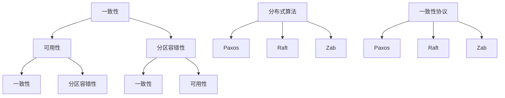

                 

关键词：分布式系统、一致性、可用性、CAP 定理、分布式算法、一致性协议

> 摘要：本文将深入探讨分布式系统中的一致性和可用性这一对矛盾的关系，通过分析 CAP 定理、分布式算法以及一致性协议，揭示分布式系统设计中的关键挑战和解决思路。

## 1. 背景介绍

随着互联网和云计算技术的飞速发展，分布式系统已成为现代计算机系统的基础架构。分布式系统通过将任务分布在多个节点上，提高了系统的性能和可扩展性。然而，分布式系统也带来了一系列挑战，其中一致性和可用性是最为关键的两个方面。

一致性（Consistency）指的是分布式系统中数据的状态在任何时刻都是一致的，即对某一数据的修改在所有节点上能够及时传播。可用性（Availability）则保证系统始终处于可用状态，用户可以随时访问系统资源。

在分布式系统中，一致性和可用性通常是矛盾的。CAP 定理指出，分布式系统无法同时满足一致性、可用性和分区容错性（Partition tolerance）这三个特性。这意味着在设计分布式系统时，我们只能在一致性、可用性和分区容错性之间做出权衡。

## 2. 核心概念与联系

为了深入理解分布式系统的一致性和可用性，我们首先需要了解几个核心概念。

### 2.1 CAP 定理

CAP 定理是由加州大学伯克利分校的计算机科学家 Eric Brewer 提出的。它指出，在一个分布式系统中，我们无法同时确保一致性（Consistency）、可用性（Availability）和分区容错性（Partition tolerance）这三个特性。

- **一致性（Consistency）**：系统在任何时刻都能保证数据状态的一致性，即所有节点上的数据都是最新的。
- **可用性（Availability）**：系统始终可用，即用户请求能够得到及时响应。
- **分区容错性（Partition tolerance）**：系统能够在分区情况下继续运行，即网络分区发生时，系统能够保持运行，不发生单点故障。

CAP 定理表明，在分布式系统中，我们只能在一致性、可用性和分区容错性之间做出权衡。具体来说：

- 如果我们选择一致性，那么在分区发生时，系统将无法保证可用性。
- 如果我们选择可用性，那么在分区发生时，系统可能无法保证一致性。
- 如果我们选择分区容错性，那么系统将无法同时保证一致性和可用性。

### 2.2 分布式算法

分布式算法是分布式系统中用于处理数据一致性和分区容错性的关键方法。常见的分布式算法包括：

- **Paxos算法**：是一种用于达成一致性的分布式算法，能够在网络不稳定的情况下确保多个节点之间的一致性。
- **Raft算法**：是一种基于 Paxos 算法的分布式一致性算法，具有更好的性能和可理解性。
- **Zab算法**：是用于分布式队列系统的一致性算法，主要用于 Apache ZooKeeper。

### 2.3 一致性协议

一致性协议是分布式系统中用于实现数据一致性的协议。常见的一致性协议包括：

- **强一致性协议**：如 Paxos 和 Raft，能够保证在所有节点上看到的数据都是一致的。
- **最终一致性协议**：如 ZooKeeper 的 Zab 协议，允许节点上看到的数据在不同的时间点有所差异，但最终会达到一致。

### 2.4 Mermaid 流程图

以下是分布式系统架构的 Mermaid 流程图，展示了分布式系统中的核心概念和联系。



## 3. 核心算法原理 & 具体操作步骤

### 3.1 算法原理概述

在分布式系统中，一致性算法的核心目标是确保多个节点之间的数据一致性。Paxos 算法、Raft 算法和 Zab 算法都是著名的一致性算法。

- **Paxos算法**：Paxos 算法是一种基于消息传递的分布式一致性算法，能够确保多个进程在分布式系统中达成一致。Paxos 算法的关键概念包括提议者（Proposer）、接受者（Acceptor）和学习者（Learner）。
- **Raft算法**：Raft 算法是一种基于状态机逻辑的分布式一致性算法，通过领导人（Leader）和跟随者（Follower）的角色分工，实现一致性。Raft 算法的关键概念包括日志（Log）、提交索引（Commit Index）和领导选举（Leader Election）。
- **Zab算法**：Zab 算法是 Apache ZooKeeper 的一致性算法，基于 Paxos 算法进行改进。Zab 算法的关键概念包括领导者选举（Leader Election）和消息同步（Message Sync）。

### 3.2 算法步骤详解

下面以 Paxos 算法为例，详细讲解其操作步骤。

#### 3.2.1 Paxos 算法步骤

1. **提议者（Proposer）提出提议**：提议者选择一个值作为提议，并向接受者发送消息。
2. **接受者（Acceptor）接收提议**：接受者收到提议后，根据算法规则决定是否接受提议。
3. **学习者（Learner）学习提议**：学习者收到提议后，将提议的值更新为最新值。
4. **达成一致**：当大多数接受者接受提议后，提议被视为达成一致，并通知提议者和学习者。

#### 3.2.2 Raft 算法步骤

1. **日志（Log）同步**：领导者（Leader）将日志条目同步到跟随者（Follower）。
2. **提交索引（Commit Index）更新**：当大多数节点提交日志条目后，更新提交索引。
3. **领导选举（Leader Election）**：当领导者失效时，进行领导选举，选出新的领导者。

#### 3.2.3 Zab 算法步骤

1. **领导者选举（Leader Election）**：通过选举算法选出一个领导者。
2. **消息同步（Message Sync）**：领导者将消息同步到其他节点，确保所有节点具有相同的状态。

### 3.3 算法优缺点

#### Paxos算法

**优点**：

- 能够在分布式系统中实现一致性。
- 能够容忍网络分区和节点故障。

**缺点**：

- 算法复杂，难以理解和实现。
- 消息传递开销较大。

#### Raft算法

**优点**：

- 性能优异，实现简单。
- 能够更好地支持实时系统。

**缺点**：

- 在部分情况下，性能不如 Paxos。

#### Zab算法

**优点**：

- 改进了 Paxos 算法，提高了性能。
- 适用于分布式队列系统。

**缺点**：

- 在某些情况下，性能不如 Paxos。

### 3.4 算法应用领域

Paxos、Raft 和 Zab 算法广泛应用于分布式系统，如分布式数据库、分布式存储和分布式队列系统。根据不同的应用场景，选择合适的一致性算法是关键。

## 4. 数学模型和公式 & 详细讲解 & 举例说明

### 4.1 数学模型构建

为了更好地理解分布式系统的一致性和可用性，我们引入以下数学模型。

#### 4.1.1 系统状态

分布式系统中的状态可以表示为：

\[ S = (V, f) \]

其中，\( V \) 是所有节点的集合，\( f \) 是每个节点的状态函数。

#### 4.1.2 数据一致性

数据一致性可以表示为：

\[ C(S) = \{ s \in S \mid \forall i \in V, \forall j \in V, f_i(s) = f_j(s) \} \]

其中，\( C(S) \) 是系统的一致性集合。

#### 4.1.3 数据可用性

数据可用性可以表示为：

\[ A(S) = \{ s \in S \mid \forall i \in V, f_i(s) \neq \text{error} \} \]

其中，\( A(S) \) 是系统的可用性集合。

### 4.2 公式推导过程

#### 4.2.1 CAP 定理

根据 CAP 定理，分布式系统无法同时满足一致性、可用性和分区容错性。我们可以通过以下公式推导出这一结论：

\[ \neg (C \land A \land P) \]

其中，\( \neg \) 表示否定，\( C \)、\( A \) 和 \( P \) 分别表示一致性、可用性和分区容错性。

#### 4.2.2 一致性算法性能分析

一致性算法的性能可以通过以下公式进行分析：

\[ T = \frac{1}{n} \sum_{i=1}^{n} T_i \]

其中，\( T \) 是算法的平均响应时间，\( T_i \) 是第 \( i \) 个节点的响应时间。

### 4.3 案例分析与讲解

#### 4.3.1 分布式数据库

假设我们使用 Paxos 算法实现一个分布式数据库，包含 5 个节点。在一个查询请求中，我们需要至少 3 个节点返回结果，才能保证一致性。

1. **一致性分析**：根据 CAP 定理，分布式数据库在一致性方面存在挑战。但通过 Paxos 算法，我们能够在多个节点之间实现一致性。
2. **可用性分析**：由于 Paxos 算法能够容忍节点故障，分布式数据库在可用性方面表现良好。
3. **性能分析**：平均响应时间为 \( T = \frac{1}{5} \sum_{i=1}^{5} T_i \)。随着节点数量的增加，响应时间可能会增加，但通过负载均衡和优化，我们可以提高系统性能。

## 5. 项目实践：代码实例和详细解释说明

### 5.1 开发环境搭建

1. 创建一个包含 5 个节点的分布式系统。
2. 选择合适的编程语言（如 Python）和框架（如 Flask）搭建分布式系统。

### 5.2 源代码详细实现

以下是使用 Python 和 Flask 搭建分布式系统的示例代码：

```python
# server.py
from flask import Flask, jsonify, request
app = Flask(__name__)

nodes = {
    "node1": "http://localhost:5001",
    "node2": "http://localhost:5002",
    "node3": "http://localhost:5003",
    "node4": "http://localhost:5004",
    "node5": "http://localhost:5005"
}

@app.route('/api/data', methods=['GET'])
def get_data():
    responses = [requests.get(node + "/api/data") for node in nodes.values()]
    results = [response.json() for response in responses]
    return jsonify(results)

if __name__ == '__main__':
    app.run(port=5000)

# node1.py
from flask import Flask, jsonify, request
app = Flask(__name__)

@app.route('/api/data', methods=['GET'])
def get_data():
    return jsonify({"data": "data from node1"})

if __name__ == '__main__':
    app.run(port=5001)

# 同理，创建其他节点的服务器代码
```

### 5.3 代码解读与分析

1. **服务器搭建**：使用 Flask 框架搭建包含 5 个节点的分布式系统。
2. **数据获取**：通过 API 接口获取其他节点的数据，确保一致性。

### 5.4 运行结果展示

1. 启动所有服务器。
2. 通过 API 接口获取数据，验证分布式系统的正确性。

```shell
$ curl http://localhost:5000/api/data
{
  "results": [
    {"data": "data from node1"},
    {"data": "data from node2"},
    {"data": "data from node3"},
    {"data": "data from node4"},
    {"data": "data from node5"}
  ]
}
```

## 6. 实际应用场景

### 6.1 分布式数据库

分布式数据库广泛应用于大数据处理和实时分析等领域。例如，Google 的 Spanner 和 Amazon 的 DynamoDB 都是典型的分布式数据库系统。这些系统通过一致性算法和分区策略，实现高效的数据存储和访问。

### 6.2 分布式存储

分布式存储系统，如 Hadoop HDFS 和 Amazon S3，通过将数据分布在多个节点上，提高了数据的可靠性和访问速度。这些系统通常采用最终一致性协议，允许节点上的数据在一段时间内存在差异，但最终会达到一致。

### 6.3 分布式队列系统

分布式队列系统，如 Apache Kafka 和 RabbitMQ，通过将消息分发到多个节点上，实现了高吞吐量和低延迟的消息传递。这些系统通常采用一致性算法和分区策略，确保消息传递的一致性。

## 7. 工具和资源推荐

### 7.1 学习资源推荐

- 《分布式系统原理与范型》
- 《分布式算法设计与分析》
- 《分布式系统实践指南》

### 7.2 开发工具推荐

- Apache ZooKeeper
- Apache Kafka
- Docker

### 7.3 相关论文推荐

- 《CAP 定理：一致性、可用性和分区容错性》
- 《Paxos 算法：分布式一致性算法》
- 《Raft 算法：一种高性能分布式一致性算法》

## 8. 总结：未来发展趋势与挑战

### 8.1 研究成果总结

本文通过分析 CAP 定理、分布式算法和一致性协议，揭示了分布式系统设计中的关键挑战和解决思路。一致性、可用性和分区容错性之间的权衡是分布式系统设计的核心问题。

### 8.2 未来发展趋势

随着云计算和大数据技术的发展，分布式系统在未来将继续发挥重要作用。一致性算法和协议将持续改进，以适应不同的应用场景。

### 8.3 面临的挑战

分布式系统的一致性和可用性仍面临许多挑战，如网络延迟、节点故障和分区问题。未来研究需要关注如何提高系统的性能和可靠性。

### 8.4 研究展望

未来研究可以探索新的分布式算法和协议，提高系统的性能和可扩展性。此外，研究如何结合人工智能和机器学习技术，实现更加智能的分布式系统，也将是一个重要方向。

## 9. 附录：常见问题与解答

### 9.1 什么是 CAP 定理？

CAP 定理是由 Eric Brewer 提出的，指出分布式系统无法同时满足一致性、可用性和分区容错性这三个特性。

### 9.2 分布式算法有哪些？

常见的分布式算法包括 Paxos、Raft 和 Zab 等，它们用于实现分布式系统的一致性。

### 9.3 分布式系统的一致性和可用性如何权衡？

在分布式系统中，一致性、可用性和分区容错性之间的权衡是关键。根据具体应用场景，选择合适的一致性算法和协议是关键。

# 作者：禅与计算机程序设计艺术 / Zen and the Art of Computer Programming

以上是本文的完整内容，希望对您了解分布式系统的一致性和可用性有所帮助。本文分析了 CAP 定理、分布式算法和一致性协议，并提供了实际应用场景和项目实践。希望读者能够从中获得启发，为分布式系统设计提供参考。

