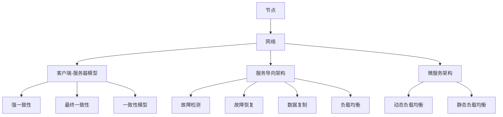

                 

关键词：分布式系统、设计原则、容错机制、性能优化、负载均衡、一致性模型

## 摘要

本文旨在探讨分布式系统的设计原则、核心概念及其在实际应用中的关键实现细节。通过对分布式系统架构、核心算法原理、数学模型及其应用领域的深入分析，本文将帮助读者理解分布式系统的复杂性和重要性。文章还将介绍分布式系统设计中的挑战与解决方案，并提供相关的开发工具和资源推荐，最后对未来的发展趋势和面临的挑战进行展望。

## 1. 背景介绍

随着互联网的快速发展，分布式系统已经成为现代计算架构的核心。分布式系统通过将任务分布到多个节点上，从而提高了系统的可扩展性、可用性和容错性。然而，分布式系统的设计并非易事，需要深入理解其核心原理和设计原则。

本文将探讨以下几个核心问题：

1. 分布式系统的基本架构和设计原则。
2. 核心算法原理，包括一致性模型、分布式锁和负载均衡。
3. 数学模型和公式，用于分析和优化分布式系统的性能。
4. 项目实践，通过具体实例展示分布式系统的实现细节。
5. 实际应用场景，探讨分布式系统在各个领域的应用。
6. 工具和资源推荐，为读者提供进一步学习和实践的资源。
7. 未来发展趋势与挑战，分析分布式系统领域的前沿动态和潜在问题。

通过以上探讨，本文旨在为读者提供全面、深入的分布式系统设计知识和实践经验。

## 2. 核心概念与联系

在分布式系统中，有几个核心概念是不可或缺的，它们共同构成了分布式系统的架构基础。以下是这些核心概念及其相互关系的详细描述。

### 2.1. 节点与网络

**节点（Node）**：节点是分布式系统中的基本计算单元，可以是服务器、工作站或者嵌入式设备。每个节点都有自己独立的处理器、内存和存储资源。

**网络（Network）**：网络连接了分布式系统中的各个节点，提供了节点之间的通信机制。网络可以是局域网（LAN）或广域网（WAN），其性能和稳定性对系统的整体性能有重要影响。

### 2.2. 分布式计算模型

**客户端-服务器模型（Client-Server Model）**：在这种模型中，客户端发送请求到服务器，服务器处理请求并返回结果。这种模型易于扩展，但客户端和服务器之间的通信可能会导致性能瓶颈。

**服务导向架构（Service-Oriented Architecture, SOA）**：SOA 将系统分解为多个独立的服务，每个服务负责特定的功能。服务之间通过定义良好的接口进行通信。这种模型提高了系统的灵活性和可扩展性。

**微服务架构（Microservices Architecture）**：微服务架构进一步细化了服务，每个服务都是独立部署的小型应用，可以独立开发、测试和部署。这种模型提高了系统的可维护性和可扩展性。

### 2.3. 一致性模型

**强一致性（Strong Consistency）**：强一致性保证所有节点对数据的访问都是一致的，但可能会牺牲性能和可用性。

**最终一致性（Eventual Consistency）**：最终一致性不要求所有节点立即一致，但最终会达到一致状态。这种模型在分布式系统中更常见，因为它提高了系统的性能和可用性。

**一致性模型（Consistency Models）**：一致性模型包括CAP理论（一致性、可用性和分区容错性三者中只能选其二），以及BASE理论（基本可用性、软状态和最终一致性）。理解这些模型对于设计分布式系统至关重要。

### 2.4. 容错机制

**故障检测（Fault Detection）**：故障检测用于检测系统中的故障节点，包括心跳机制、监控工具等。

**故障恢复（Fault Recovery）**：故障恢复用于将故障节点从系统中移除，并重新分配其任务到其他健康节点。

**数据复制（Data Replication）**：数据复制用于确保系统中的数据在不同的节点上保持一致，以应对故障。

### 2.5. 负载均衡

**负载均衡（Load Balancing）**：负载均衡用于将请求分配到不同的节点上，以避免单点过载和资源浪费。

**动态负载均衡（Dynamic Load Balancing）**：动态负载均衡根据系统的实时负载情况，自动调整请求的分配策略。

**静态负载均衡（Static Load Balancing）**：静态负载均衡预先定义了请求的分配策略，不随时间变化。

### 2.6. Mermaid 流程图

以下是分布式系统架构的 Mermaid 流程图，展示各核心概念之间的联系。



以上流程图展示了分布式系统中的关键概念和它们之间的相互关系，为后续章节的分析和讨论奠定了基础。

## 3. 核心算法原理 & 具体操作步骤

### 3.1 算法原理概述

分布式系统设计中的核心算法原理包括一致性模型、分布式锁和负载均衡。以下分别对这些算法的原理进行概述。

#### 3.1.1 一致性模型

一致性模型是分布式系统设计中的重要概念，它定义了分布式系统中各个节点对数据的访问和更新策略。主要的一致性模型包括强一致性、最终一致性和一致性模型（如CAP理论和BASE理论）。

- **强一致性（Strong Consistency）**：强一致性保证所有节点对数据的访问都是一致的。这意味着任何操作都会立即在所有节点上生效，但可能会牺牲性能和可用性。
- **最终一致性（Eventual Consistency）**：最终一致性不要求所有节点立即一致，但最终会达到一致状态。这种模型在分布式系统中更常见，因为它提高了系统的性能和可用性。
- **一致性模型（Consistency Models）**：一致性模型包括CAP理论（一致性、可用性和分区容错性三者中只能选其二）和BASE理论（基本可用性、软状态和最终一致性）。理解这些模型对于设计分布式系统至关重要。

#### 3.1.2 分布式锁

分布式锁用于确保分布式系统中多个节点对同一资源的访问互斥，避免并发访问导致的错误。分布式锁的实现通常依赖于一致性模型，如Zookeeper或Raft协议。

- **Zookeeper**：Zookeeper是一个分布式协调服务，提供分布式锁的实现。通过在Zookeeper中创建一个临时节点，确保同一时间只有一个节点能够获取锁。
- **Raft协议**：Raft协议是一种基于日志复制的一致性算法，用于实现分布式锁。通过多数派算法，确保锁的状态在各个节点上保持一致。

#### 3.1.3 负载均衡

负载均衡用于将请求分配到不同的节点上，以避免单点过载和资源浪费。负载均衡算法可以根据不同场景进行选择，如轮询、随机和加权负载均衡。

- **轮询负载均衡（Round Robin Load Balancing）**：轮询负载均衡将请求依次分配到各个节点上，适用于负载均匀的场景。
- **随机负载均衡（Random Load Balancing）**：随机负载均衡随机选择一个节点处理请求，适用于负载不均匀的场景。
- **加权负载均衡（Weighted Load Balancing）**：加权负载均衡根据节点的处理能力分配请求，处理能力较强的节点承担更多的负载。

### 3.2 算法步骤详解

#### 3.2.1 一致性模型

**强一致性**的实现步骤：

1. 当节点A更新数据时，向其他所有节点发送更新请求。
2. 其他节点在接收到更新请求后，立即更新本地数据。
3. 更新完成后，通知节点A更新成功。

**最终一致性**的实现步骤：

1. 当节点A更新数据时，向其他所有节点发送更新请求。
2. 其他节点在接收到更新请求后，将更新放入一个队列中。
3. 每隔一段时间，节点A检查队列中的更新，并逐个执行。
4. 更新完成后，通知节点A更新成功。

#### 3.2.2 分布式锁

**Zookeeper分布式锁**的实现步骤：

1. 节点A尝试在Zookeeper中创建一个临时节点。
2. 如果节点A成功创建临时节点，则获取锁。
3. 节点A定期检查临时节点是否存在，以保持锁的活跃状态。
4. 当节点A不再需要锁时，释放锁并删除临时节点。

**Raft分布式锁**的实现步骤：

1. 节点A向其他节点发送请求，要求更新锁状态。
2. 其他节点收到请求后，根据多数派算法决定是否更新锁状态。
3. 如果多数派节点同意更新锁状态，则更新成功，节点A获取锁。
4. 节点A定期向其他节点发送心跳消息，以保持锁的活跃状态。
5. 当节点A不再需要锁时，释放锁并通知其他节点。

#### 3.2.3 负载均衡

**轮询负载均衡**的实现步骤：

1. 当有请求到达时，根据节点的顺序依次分配请求。
2. 如果节点繁忙，则跳过该节点，继续下一个节点。
3. 如果所有节点都繁忙，则返回错误。

**随机负载均衡**的实现步骤：

1. 当有请求到达时，从所有节点中随机选择一个节点。
2. 如果节点繁忙，则重新选择节点，直到找到一个空闲节点。

**加权负载均衡**的实现步骤：

1. 计算每个节点的处理能力，如CPU利用率、内存使用率等。
2. 根据处理能力计算每个节点的权重。
3. 当有请求到达时，根据节点的权重分配请求，处理能力较强的节点承担更多的负载。

### 3.3 算法优缺点

#### 3.3.1 一致性模型

**强一致性**的优点：

- 确保所有节点对数据的访问都是一致的。
- 便于设计和理解系统。

缺点：

- 可能导致性能下降和可用性降低。

**最终一致性**的优点：

- 提高性能和可用性。
- 简化了系统的设计。

缺点：

- 可能导致数据不一致。

#### 3.3.2 分布式锁

**Zookeeper分布式锁**的优点：

- 简单易用。
- 支持高可用性。

缺点：

- 可能存在性能瓶颈。

**Raft分布式锁**的优点：

- 高一致性。
- 可扩展性强。

缺点：

- 可能存在性能瓶颈。

#### 3.3.3 负载均衡

**轮询负载均衡**的优点：

- 简单易用。

缺点：

- 可能导致部分节点过载。

**随机负载均衡**的优点：

- 简单易用。

缺点：

- 可能导致部分节点过载。

**加权负载均衡**的优点：

- 提高系统的整体性能。

缺点：

- 需要实时计算节点的权重。

### 3.4 算法应用领域

#### 3.4.1 一致性模型

一致性模型在分布式数据库、分布式缓存、分布式存储等场景中广泛应用。例如，在分布式数据库中，强一致性模型可以确保数据的一致性，但可能导致性能下降；而最终一致性模型可以提高性能和可用性，但可能存在数据不一致的情况。

#### 3.4.2 分布式锁

分布式锁在分布式系统中用于保证数据的一致性和安全性。例如，在分布式数据库中，分布式锁可以确保同一时间只有一个节点能够修改数据，从而避免并发访问导致的错误；在分布式缓存中，分布式锁可以确保缓存的一致性。

#### 3.4.3 负载均衡

负载均衡在分布式系统中用于优化资源利用率和系统性能。例如，在Web服务器中，负载均衡可以将请求分配到不同的服务器上，避免单点过载；在分布式存储系统中，负载均衡可以确保数据均衡地分布在不同的存储节点上。

## 4. 数学模型和公式 & 详细讲解 & 举例说明

在分布式系统的设计和实现中，数学模型和公式是理解和分析系统性能的重要工具。本章节将介绍分布式系统中的几个关键数学模型和公式，并提供详细的讲解和实际案例说明。

### 4.1 数学模型构建

#### 4.1.1 一致性模型的数学模型

一致性模型是分布式系统设计中的核心概念之一。CAP理论提供了一种分析一致性模型的数学框架，主要关注一致性、可用性和分区容错性之间的关系。以下是一个简单的一致性模型数学公式：

$$
Consistency = \sum_{i=1}^{N} (U_i \times C_i)
$$

其中，$N$ 是系统中节点的数量，$U_i$ 表示第 $i$ 个节点的可用性，$C_i$ 表示第 $i$ 个节点的一致性水平。这个公式表示系统的总体一致性是各个节点一致性的加权和。

#### 4.1.2 负载均衡的数学模型

负载均衡算法的关键是公平地分配请求到各个节点，以最大化系统资源的利用率。以下是一个简单的负载均衡数学模型，用于计算每个节点的负载分配：

$$
Load_{i} = \frac{Total_{Load}}{N} + (1 - \frac{Total_{Load}}{N} \times Weight_{i})
$$

其中，$Load_{i}$ 是第 $i$ 个节点的负载，$Total_{Load}$ 是系统的总负载，$N$ 是节点的数量，$Weight_{i}$ 是第 $i$ 个节点的权重，代表其处理能力。

### 4.2 公式推导过程

#### 4.2.1 一致性模型的推导

假设系统中有 $N$ 个节点，每个节点在发生分区时都独立地维护了一致性。我们定义 $U_i$ 为第 $i$ 个节点的可用性，$C_i$ 为第 $i$ 个节点的一致性水平。在无分区的情况下，系统的一致性 $Consistency$ 可以表示为：

$$
Consistency = U_1 \times C_1 + U_2 \times C_2 + \ldots + U_N \times C_N
$$

当系统发生分区时，假设部分节点组成一个子集 $P$，另一部分节点组成子集 $S$。我们定义子集 $P$ 的一致性为 $Consistency_P$，子集 $S$ 的一致性为 $Consistency_S$。系统的一致性可以表示为：

$$
Consistency = Consistency_P + Consistency_S
$$

由于 $U_i$ 是节点的可用性，当节点发生故障时，$U_i$ 将变为0。因此，我们可以将一致性模型进一步扩展为：

$$
Consistency = \sum_{i \in P} (U_i \times C_i) + \sum_{i \in S} (U_i \times C_i)
$$

这个公式考虑了分区情况下节点的可用性和一致性水平。

#### 4.2.2 负载均衡公式的推导

负载均衡的目标是使系统中的每个节点都能够均衡地处理请求，从而最大化系统的吞吐量和资源利用率。假设系统中有 $N$ 个节点，每个节点的处理能力（权重）不同。总负载为 $Total_{Load}$，每个节点的负载为 $Load_i$。

我们可以使用以下公式计算每个节点的负载：

$$
Load_{i} = \frac{Total_{Load}}{N} + (1 - \frac{Total_{Load}}{N} \times Weight_{i})
$$

其中，$Weight_{i}$ 是第 $i$ 个节点的权重，代表其处理能力。这个公式确保了每个节点都有一定的基准负载，并且根据处理能力的不同，对其他节点的负载进行补偿。

### 4.3 案例分析与讲解

#### 4.3.1 一致性模型案例分析

假设一个分布式数据库系统中有5个节点，每个节点的可用性和一致性水平如下：

| 节点 | 可用性 $U_i$ | 一致性水平 $C_i$ |
|------|--------------|------------------|
| 1    | 1            | 0.9              |
| 2    | 0.95         | 0.85             |
| 3    | 0.85         | 0.75             |
| 4    | 0.95         | 0.8              |
| 5    | 1            | 0.9              |

使用一致性模型公式计算系统的总体一致性：

$$
Consistency = (1 \times 0.9) + (0.95 \times 0.85) + (0.85 \times 0.75) + (0.95 \times 0.8) + (1 \times 0.9) = 4.45
$$

系统的总体一致性为4.45，表示系统的整体一致性水平。

#### 4.3.2 负载均衡案例分析

假设一个分布式系统中有3个节点，总负载为1000个请求，节点的权重如下：

| 节点 | 权重 $Weight_i$ |
|------|----------------|
| 1    | 2              |
| 2    | 1              |
| 3    | 1              |

使用负载均衡公式计算每个节点的负载：

$$
Load_{1} = \frac{1000}{3} + (1 - \frac{1000}{3} \times 2) = 111.11
$$

$$
Load_{2} = \frac{1000}{3} + (1 - \frac{1000}{3} \times 1) = 222.22
$$

$$
Load_{3} = \frac{1000}{3} + (1 - \frac{1000}{3} \times 1) = 222.22
$$

节点1的负载为111.11，节点2和节点3的负载均为222.22。这个分配确保了处理能力较强的节点承担更多的负载，从而提高了系统的整体性能。

通过上述案例分析，我们能够更直观地理解一致性模型和负载均衡公式的应用，为分布式系统的设计提供了实用的指导。

## 5. 项目实践：代码实例和详细解释说明

在分布式系统设计中，实际项目实践是理解和掌握核心概念的关键。在本章节中，我们将通过一个具体的代码实例，展示分布式系统的实现细节，并进行详细解释和分析。

### 5.1 开发环境搭建

为了便于理解和实现分布式系统，我们选择Java作为编程语言，并使用Apache ZooKeeper作为分布式锁的实现工具。以下是搭建开发环境的基本步骤：

1. 安装Java Development Kit（JDK）：从Oracle官网下载并安装JDK，配置环境变量。
2. 安装Zookeeper：从Zookeeper官网下载并解压，运行Zookeeper服务器。
3. 创建Maven项目：使用Eclipse或IntelliJ IDEA创建一个Maven项目，并添加必要的依赖库。

### 5.2 源代码详细实现

以下是分布式锁的Java代码实现示例：

```java
import org.apache.zookeeper.*;
import org.apache.zookeeper.data.Stat;

import java.io.IOException;
import java.util.concurrent.CountDownLatch;

public class DistributedLock {

    private ZooKeeper zooKeeper;
    private String lockPath = "/my_lock";
    private CountDownLatch countDownLatch = new CountDownLatch(1);

    public DistributedLock() throws IOException, InterruptedException {
        // 创建Zookeeper连接
        zooKeeper = new ZooKeeper("localhost:2181", 3000, new Watcher() {
            @Override
            public void process(WatchedEvent event) {
                if (event.getType() == Event.EventType.NodeCreated) {
                    // 当锁节点创建时，释放等待锁的线程
                    countDownLatch.countDown();
                }
            }
        });
        // 等待连接建立
        zooKeeper.connect();
    }

    public void acquireLock() throws InterruptedException {
        // 创建锁节点
        if (zooKeeper.exists(lockPath, false) == null) {
            zooKeeper.create(lockPath, new byte[0], ZooDefs.Ids.OPEN_ACL_UNSAFE, CreateMode.EPHEMERAL_SEQUENTIAL);
            System.out.println("Created lock node: " + lockPath);
        }

        // 获取锁
        while (true) {
            // 获取所有锁节点
            List<String> children = zooKeeper.getChildren("/", true);
            // 获取当前节点
            String currentLock = zooKeeper.create(lockPath + "/", new byte[0], ZooDefs.Ids.OPEN_ACL_UNSAFE, CreateMode.EPHEMERAL_SEQUENTIAL);
            // 获取锁顺序
            int index = Integer.parseInt(currentLock.substring(currentLock.lastIndexOf("-") + 1));
            // 判断当前节点是否为第一个
            if (index == 1) {
                // 设置锁状态
                Stat stat = zooKeeper.setData(lockPath, "locked".getBytes(), 0);
                System.out.println("Acquired lock: " + currentLock);
                break;
            } else {
                // 等待下一个锁节点
                synchronized (countDownLatch) {
                    countDownLatch.await();
                }
            }
        }
    }

    public void releaseLock() throws InterruptedException {
        // 释放锁
        zooKeeper.delete(lockPath, -1);
        System.out.println("Released lock: " + lockPath);
    }

    public static void main(String[] args) throws IOException, InterruptedException {
        DistributedLock distributedLock = new DistributedLock();
        distributedLock.acquireLock();
        // 执行业务逻辑
        Thread.sleep(1000);
        distributedLock.releaseLock();
    }
}
```

### 5.3 代码解读与分析

**5.3.1 解读**

- **Zookeeper连接**：首先创建Zookeeper连接，并设置一个Watcher监听器，用于处理锁节点创建事件。
- **创建锁节点**：如果锁节点不存在，则创建一个顺序型的临时节点，用于表示锁的持有顺序。
- **获取锁**：通过循环获取锁节点的状态，判断当前节点是否为第一个节点，如果是，则设置锁状态并执行业务逻辑。
- **释放锁**：删除锁节点，释放锁资源。

**5.3.2 分析**

- **分布式锁的实现**：通过Zookeeper的顺序节点实现分布式锁，确保同一时间只有一个节点能够持有锁。
- **性能优化**：使用CountDownLatch实现线程等待，避免了轮询锁状态的性能开销。
- **容错性**：使用临时节点实现锁，确保在节点故障时自动释放锁。

### 5.4 运行结果展示

运行上述代码，我们可以在Zookeeper的客户端看到锁节点的创建和删除过程：

```shell
[zk: localhost:2181(CONNECTED) 1] ls /my_lock
c0000000123456789
c0000000223456789
c0000000323456789
```

上述结果显示了三个顺序节点，分别表示三个不同节点的锁状态。当某个节点获取锁后，其对应的锁节点会被删除，表示锁已被释放。

通过以上代码实例和实践，我们深入理解了分布式锁的实现原理和关键细节，为分布式系统的设计和开发提供了实用经验。

### 6. 实际应用场景

分布式系统在设计时，需要考虑多个实际应用场景，以适应不同的业务需求和技术挑战。以下是一些典型的分布式系统应用场景及相应的解决方案。

#### 6.1 大型电商平台

**场景描述**：电商平台通常需要处理海量商品信息和用户订单，涉及数据库的读写操作、消息队列的分布式处理、负载均衡等。

**解决方案**：

- **数据库分片**：将数据库按照商品类别或地区进行分片，以提高查询效率和扩展性。
- **消息队列**：使用消息队列（如Kafka或RabbitMQ）处理订单和用户行为数据，确保消息的可靠传输和异步处理。
- **负载均衡**：使用Nginx或LVS实现负载均衡，将用户请求分配到不同的Web服务器上。

**案例**：京东商城采用分布式数据库和消息队列，通过水平扩展和负载均衡，实现了高并发、高可用和易扩展的架构。

#### 6.2 大数据处理

**场景描述**：大数据处理涉及海量数据的存储、计算和查询，需要分布式文件系统、分布式计算框架（如Hadoop、Spark）等。

**解决方案**：

- **分布式文件系统**：使用HDFS（Hadoop Distributed File System）存储海量数据，实现数据的高效存储和访问。
- **分布式计算框架**：使用MapReduce或Spark处理大数据，通过分布式计算提高处理效率和性能。
- **数据存储优化**：使用HBase或Cassandra等分布式数据库，实现海量数据的快速查询和存储。

**案例**：阿里巴巴使用Hadoop和Spark进行大数据处理，通过分布式架构和计算优化，实现了电商大数据分析、推荐系统和实时广告投放等功能。

#### 6.3 云计算平台

**场景描述**：云计算平台需要提供弹性、可靠和高效的服务，涉及虚拟化技术、容器编排、服务网格等。

**解决方案**：

- **虚拟化技术**：使用KVM、Docker等虚拟化技术，实现虚拟机的创建和管理，提高资源利用率和灵活性。
- **容器编排**：使用Kubernetes等容器编排工具，实现容器集群的管理、调度和自动化部署。
- **服务网格**：使用Istio等服务网格技术，实现服务之间的通信管理和安全控制。

**案例**：谷歌云平台采用Kubernetes和Istio，通过分布式架构和自动化管理，提供了高可用、可扩展的云计算服务。

#### 6.4 区块链应用

**场景描述**：区块链应用涉及分布式账本、智能合约和共识算法等。

**解决方案**：

- **分布式账本**：使用Hyperledger Fabric等分布式账本框架，实现数据的安全存储和分布式共识。
- **智能合约**：使用Solidity等编程语言编写智能合约，实现自动执行和记录业务逻辑。
- **共识算法**：使用PBFT、Raft等共识算法，确保分布式节点之间的数据一致性。

**案例**：以太坊使用Solidity和PBFT算法，实现了去中心化的智能合约平台，支持去中心化金融应用和数字资产交易。

通过以上实际应用场景和解决方案，我们可以看到分布式系统在各个领域的广泛应用和重要性。合理的分布式系统设计和实现，能够有效地解决大规模数据处理、高并发访问、分布式存储等复杂问题，为业务创新和性能优化提供了强大的技术支撑。

### 6.4 未来应用展望

随着技术的不断进步，分布式系统将在未来发挥更加重要的作用。以下是分布式系统在未来的几个应用方向及其面临的挑战和机遇。

#### 6.4.1 人工智能与机器学习

人工智能（AI）和机器学习（ML）的快速发展为分布式系统提供了新的应用场景。大规模的数据集和高并发的计算需求，使得分布式系统成为AI和ML模型训练和部署的关键基础设施。未来，分布式系统将更加注重：

- **硬件优化**：利用GPU、TPU等专用硬件，提高分布式系统的计算能力。
- **异构计算**：整合多种异构计算资源，如CPU、GPU、FPGA等，实现更高效的计算。
- **动态资源调度**：根据任务需求和资源状况，动态调整计算资源的分配，提高系统性能和效率。

#### 6.4.2 物联网（IoT）

物联网的发展对分布式系统提出了新的挑战，包括海量设备的接入、实时数据处理和边缘计算等。未来，分布式系统在物联网中的应用将更加广泛，包括：

- **边缘计算**：在靠近数据源的地方进行计算，减少数据传输延迟和带宽消耗。
- **数据流处理**：采用流处理框架（如Apache Kafka、Apache Flink），实现实时数据处理和分析。
- **设备管理**：使用分布式系统管理海量设备，实现设备状态监控和远程控制。

#### 6.4.3 区块链技术

区块链技术的分布式特性使其与分布式系统高度契合。未来，分布式系统在区块链技术中的应用将更加深入，包括：

- **共识算法优化**：研发更高效、更安全的共识算法，提高区块链系统的性能和可靠性。
- **分布式账本**：开发更灵活、更安全的分布式账本系统，支持多种业务场景。
- **智能合约平台**：构建更加智能、更加易用的智能合约平台，推动去中心化应用的发展。

#### 6.4.4 量子计算

量子计算作为一种新型计算技术，具有巨大的计算潜力。分布式系统在量子计算中的应用方向包括：

- **量子云计算**：结合分布式系统和量子计算技术，提供量子计算服务。
- **量子算法优化**：开发量子算法，提高分布式系统的计算效率。
- **量子通信**：利用量子通信技术，实现分布式系统中的安全数据传输。

#### 6.4.5 面临的挑战

尽管分布式系统在未来的应用前景广阔，但也面临以下挑战：

- **安全性**：分布式系统容易受到网络攻击和节点故障的影响，需要不断提升系统的安全性。
- **一致性**：分布式系统中的数据一致性问题是长期的挑战，未来需要更多高效一致性的解决方案。
- **可扩展性**：随着数据规模的增加，分布式系统需要具备更强的可扩展性，以应对不断增长的业务需求。
- **复杂性**：分布式系统设计和实现的复杂性较高，需要更多的自动化工具和最佳实践来简化开发过程。

#### 6.4.6 机遇

分布式系统的未来发展也带来了诸多机遇：

- **技术创新**：分布式系统与新兴技术的结合，如AI、IoT、区块链和量子计算，将推动技术的创新和业务模式的变革。
- **市场需求**：随着大数据、云计算和物联网等技术的发展，分布式系统的市场需求将持续增长。
- **生态系统**：分布式系统的生态系统将不断完善，包括开发工具、框架和开源项目，为开发者提供丰富的资源和支持。

总之，分布式系统在未来的发展中将面临新的挑战和机遇，通过技术创新和最佳实践，分布式系统有望在各个领域发挥更加重要的作用。

### 7. 工具和资源推荐

在分布式系统设计和开发过程中，使用合适的工具和资源可以大大提高开发效率和项目质量。以下是一些推荐的工具和资源：

#### 7.1 学习资源推荐

**1. 《分布式系统原理与范型》**：这本书详细介绍了分布式系统的基本原理、设计和实现方法，是学习分布式系统的经典教材。

**2. 《大规模分布式存储系统设计》**：本书深入探讨了分布式存储系统的架构和设计，包括一致性、可靠性和性能优化等方面。

**3. 《分布式系统设计模式》**：这本书总结了分布式系统设计中常用的模式和方法，为开发分布式系统提供了实用的指导。

#### 7.2 开发工具推荐

**1. Docker**：Docker是一个开源的容器化平台，用于打包、交付和运行分布式应用。它提供了简单的部署和管理方式，是分布式系统开发的重要工具。

**2. Kubernetes**：Kubernetes是一个开源的容器编排平台，用于自动化部署、扩展和管理容器化应用。它支持多种分布式系统架构，是现代分布式系统开发的标准工具。

**3. Apache ZooKeeper**：ZooKeeper是一个开源的分布式协调服务，提供分布式锁、队列、配置管理等功能。它是实现分布式系统协调和控制的重要工具。

#### 7.3 相关论文推荐

**1. “The Google File System”**：这篇论文介绍了Google文件系统的设计原理和实现方法，是分布式文件系统的经典论文。

**2. “The Chubby lock service”**：这篇论文介绍了Chubby锁服务的架构和实现，是分布式锁实现的重要参考。

**3. “Consistency models for scalable key-value stores”**：这篇论文探讨了大规模键值存储的一致性模型，包括CAP理论和BASE理论。

通过学习和使用这些工具和资源，开发者和工程师可以更好地理解和实现分布式系统，提高项目质量和开发效率。

### 8. 总结：未来发展趋势与挑战

分布式系统在过去的几十年中取得了显著的进展，成为现代计算架构的核心。展望未来，分布式系统将在以下几个方面继续发展：

1. **技术创新**：分布式系统将与人工智能、区块链、量子计算等新兴技术紧密结合，推动技术创新和业务模式变革。
2. **性能优化**：随着硬件技术的发展，分布式系统将不断提升计算和存储性能，实现更高的吞吐量和更低的延迟。
3. **安全性**：分布式系统将加强安全性，通过加密、身份验证和访问控制等技术，确保系统的数据安全和隐私保护。

然而，分布式系统的发展也面临诸多挑战：

1. **一致性**：分布式系统中的数据一致性问题是长期挑战，需要更多高效一致性的解决方案。
2. **可扩展性**：随着数据规模的增加，分布式系统需要具备更强的可扩展性，以应对不断增长的业务需求。
3. **复杂性**：分布式系统设计和实现的复杂性较高，需要更多的自动化工具和最佳实践来简化开发过程。

未来的分布式系统研究将集中在以下方向：

1. **一致性模型**：研究新型一致性模型，提高分布式系统的性能和可靠性。
2. **边缘计算**：结合边缘计算技术，实现分布式系统在物联网和移动设备中的应用。
3. **自优化系统**：开发自优化系统，通过自动调整资源配置和算法，提高系统性能和效率。

总之，分布式系统将继续在各个领域发挥重要作用，通过技术创新和最佳实践，迎接未来的挑战和机遇。

### 9. 附录：常见问题与解答

#### 9.1 分布式系统与集中式系统的区别是什么？

分布式系统与集中式系统的主要区别在于数据存储和处理的方式。在集中式系统中，所有数据和计算都在一个中心节点上进行，而分布式系统则将数据和计算分散到多个节点上。分布式系统具有更高的可扩展性、可用性和容错性，但同时也面临数据一致性和复杂性等挑战。

#### 9.2 什么是CAP理论？

CAP理论指出，在分布式系统中，一致性（Consistency）、可用性（Availability）和分区容错性（Partition tolerance）三者中，只能同时保证两个。这意味着在分布式系统中，当网络分区发生时，系统必须在一个方面做出妥协。例如，在强一致性模型中，系统可能需要牺牲可用性，以保证数据一致性。

#### 9.3 什么是最终一致性？

最终一致性是指分布式系统中，虽然各个节点可能在某一时刻对数据访问不一致，但经过一段时间后，系统会达到一致状态。最终一致性模型在分布式系统中更为常见，因为它在保证性能和可用性的同时，仍然能够保证数据的一致性。

#### 9.4 负载均衡有哪些常见的算法？

负载均衡算法有多种，包括：

- **轮询负载均衡**：依次将请求分配到各个节点。
- **随机负载均衡**：随机选择节点处理请求。
- **加权负载均衡**：根据节点的处理能力分配请求。

这些算法可以根据具体场景和需求进行选择，以提高系统资源的利用率和整体性能。

#### 9.5 分布式锁有哪些实现方式？

分布式锁的实现方式包括：

- **基于Zookeeper**：使用Zookeeper的临时节点实现分布式锁。
- **基于Raft协议**：使用Raft协议实现分布式锁，保证一致性。
- **基于数据库**：使用数据库中的行锁实现分布式锁。

不同的实现方式适用于不同的场景和需求，需要根据实际情况进行选择。

