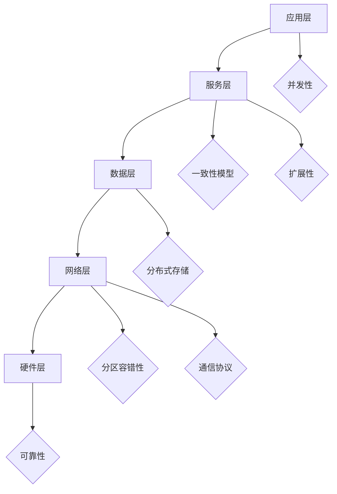

                 

### 关键词 Keywords

- 分布式系统
- 系统设计
- 理论与实践
- 软件架构
- 数据一致性
- 分布式算法
- 并发控制
- 云计算
- 微服务架构

<|assistant|>### 摘要 Abstract

本文旨在深入探讨分布式系统设计的理论与实践，涵盖从基本概念到高级技术，从数学模型到实际项目实践的全面内容。我们将首先介绍分布式系统的背景和重要性，然后详细解析核心概念和架构，探讨分布式算法的原理和实现，深入数学模型和公式推导，最后通过具体项目实践展示如何将理论应用到实际中。本文的目标是帮助读者理解分布式系统的复杂性，掌握设计原则，并在实际项目中有效地运用这些知识。作者禅与计算机程序设计艺术，凭借多年在计算机领域的专业经验，将为读者提供深入浅出的讲解和实用的建议。

## 1. 背景介绍

### 分布式系统的起源

分布式系统（Distributed System）的概念起源于20世纪60年代，随着计算机网络的普及和计算机技术的快速发展，分布式计算的需求应运而生。早期的分布式系统主要集中在大规模的计算机中心，例如阿波罗计划中的NLS系统，这是一个由多个计算机节点组成的分布式系统，实现了资源共享和任务调度。

### 分布式系统的定义

分布式系统是指由多个独立的计算机节点组成，通过通信网络互相连接，协同工作以完成复杂任务的系统。这些节点可以是服务器、个人计算机、移动设备等，它们可以分布在不同的地理位置，通过网络进行通信和数据交换。

### 分布式系统的特点

分布式系统具有以下几个显著特点：

1. **并发性**：分布式系统中的节点可以同时执行多个任务，提高了系统的处理能力。
2. **容错性**：分布式系统通过多个节点的冗余设计，可以在个别节点故障时保持系统的可用性。
3. **可扩展性**：分布式系统可以根据需求动态地增加或减少节点，以适应不断变化的工作负载。
4. **分布式存储**：分布式系统通常使用分布式存储技术，如分布式文件系统、NoSQL数据库，以实现高效的数据存储和访问。
5. **灵活性**：分布式系统允许不同的节点使用不同的操作系统、硬件和编程语言，提高了系统的兼容性和灵活性。

### 分布式系统的重要性

分布式系统在现代信息技术中扮演着至关重要的角色，主要表现在以下几个方面：

1. **大数据处理**：分布式系统可以高效地处理海量数据，适用于大数据分析和实时数据处理。
2. **云计算**：分布式系统是云计算的基础设施，提供了弹性、可扩展的计算和存储能力。
3. **物联网**：物联网设备通过分布式系统连接，实现数据的采集、分析和控制。
4. **高可用性**：分布式系统通过冗余设计和故障转移机制，提高了系统的可靠性和可用性。
5. **异构计算**：分布式系统可以整合不同的计算资源，实现异构计算，优化资源利用。

## 2. 核心概念与联系

### 分布式系统的核心概念

分布式系统涉及多个核心概念，以下列出其中几个关键概念及其相互关系：

1. **节点（Node）**：分布式系统中的基本计算单元，可以是物理服务器或虚拟机。
2. **通信协议（Communication Protocol）**：节点之间进行通信的标准和规则，如HTTP、RPC、gRPC等。
3. **一致性（Consistency）**：系统在分布式环境下保持数据一致性的能力。
4. **可用性（Availability）**：系统在面临故障时保持服务可用的能力。
5. **分区容错性（Partition Tolerance）**：系统在分区（网络分区）情况下仍能保持运作的能力。
6. **一致性模型（Consistency Model）**：分布式系统在不同一致性要求下的工作方式，如CAP定理（一致性、可用性、分区容错性三者不可兼得）。

### 分布式系统的架构

分布式系统的架构通常包括以下几个层次：

1. **应用层**：提供具体的业务逻辑和服务。
2. **服务层**：实现分布式计算、消息传递、服务发现等功能。
3. **数据层**：负责数据存储、备份和恢复。
4. **网络层**：提供节点之间的通信基础设施。
5. **硬件层**：包括服务器、存储设备、网络设备等物理资源。

### Mermaid 流程图（Mermaid Flowchart）

下面是一个简化的分布式系统架构的 Mermaid 流程图，展示核心概念和架构的相互关系。



## 3. 核心算法原理 & 具体操作步骤

### 3.1 算法原理概述

分布式系统设计中的核心算法主要包括分布式一致性算法、分布式锁、负载均衡算法等。这些算法在分布式环境下确保系统的正确性、可用性和高效性。

1. **分布式一致性算法**：如Paxos、Raft，用于在多个节点间达成一致意见，保证数据的一致性。
2. **分布式锁**：用于在分布式环境下实现共享资源的互斥访问，防止数据竞争。
3. **负载均衡算法**：如轮询、最小连接数、哈希负载均衡等，用于合理分配工作负载到各个节点。

### 3.2 算法步骤详解

#### 3.2.1 分布式一致性算法

以Paxos算法为例，其核心步骤如下：

1. **提议阶段**：一个节点（提议者）发起一个提议，包含提案编号和值。
2. **投票阶段**：其他节点（接受者）收到提议后，对提案进行投票，返回同意的提案编号和值。
3. **决策阶段**：提议者根据投票结果决定是否采纳该提案，并通知所有节点。

#### 3.2.2 分布式锁

以Zookeeper中的分布式锁为例，其步骤如下：

1. **创建锁**：客户端在Zookeeper上创建一个临时节点，表示获取锁。
2. **等待**：如果锁节点存在其他客户端的临时节点，客户端进入等待状态。
3. **监听**：客户端监听锁节点的变化，一旦锁节点被删除，表示锁被释放，客户端获取锁。
4. **释放锁**：客户端完成任务后，删除锁节点。

#### 3.2.3 负载均衡算法

以轮询负载均衡为例，其步骤如下：

1. **初始化**：初始化一个计数器，初始值为0。
2. **选择节点**：根据计数器的值，选择下一个节点作为服务提供者。
3. **更新计数器**：每次选择后，计数器加1，当计数器达到节点总数时，重置为0。

### 3.3 算法优缺点

**分布式一致性算法**

- **优点**：确保数据一致性，提高系统的可靠性。
- **缺点**：复杂度高，可能存在性能瓶颈。

**分布式锁**

- **优点**：保证共享资源的互斥访问，防止数据竞争。
- **缺点**：实现复杂，需要依赖外部系统（如Zookeeper）。

**负载均衡算法**

- **优点**：合理分配工作负载，提高系统性能。
- **缺点**：算法选择不当可能导致局部过载或资源浪费。

### 3.4 算法应用领域

**分布式一致性算法**：适用于需要高可用性和数据一致性的场景，如分布式数据库、分布式缓存。

**分布式锁**：适用于需要保护共享资源的场景，如分布式服务中的并发控制。

**负载均衡算法**：适用于需要处理大量并发请求的场景，如Web服务、大数据处理。

## 4. 数学模型和公式 & 详细讲解 & 举例说明

### 4.1 数学模型构建

在分布式系统中，数学模型广泛应用于算法设计、性能分析和系统优化。以下介绍几个关键数学模型：

#### 4.1.1 CAP定理

CAP定理是分布式系统设计中的基石，描述了一致性（Consistency）、可用性（Availability）和分区容错性（Partition Tolerance）三者之间的权衡。

**CAP定理**：

- 在任何分布式系统中，CAP定理的三个特性中最多只能同时保证两个。
- 当网络分区发生时，系统必须在一致性和可用性之间做出选择。

#### 4.1.2 分布式一致性模型

分布式一致性模型包括强一致性、最终一致性、部分一致性等。

- **强一致性**：所有节点在同一时间看到相同的数据。
- **最终一致性**：在一段时间后，所有节点看到的数据最终一致。
- **部分一致性**：不同节点可能看到不同的数据，但最终会趋于一致。

#### 4.1.3 负载均衡模型

负载均衡模型用于优化系统的资源利用率。常见模型包括：

- **轮询**：按照顺序分配请求。
- **最少连接数**：选择当前连接数最少的节点。
- **哈希**：根据请求的特征进行哈希分配。

### 4.2 公式推导过程

以下以分布式一致性算法中的Paxos算法为例，介绍其主要公式的推导过程。

#### 4.2.1 Paxos算法

Paxos算法是分布式一致性算法的一个典型代表，其核心公式包括：

1. **提议公式**：

   $$
   \text{Propose}(\text{value}) = (\text{提议编号}, \text{value})
   $$

2. **投票公式**：

   $$
   \text{Vote}(\text{proposal}) = (\text{提案编号}, \text{value})
   $$

3. **决策公式**：

   $$
   \text{Decision}(\text{proposal}) = \text{value} \text{，其中 } \text{proposal} \text{ 为最大投票}
   $$

#### 4.2.2 Paxos算法推导

Paxos算法的推导过程涉及以下几个关键步骤：

1. **初始化**：系统初始化，所有节点处于空闲状态。
2. **提议**：提议者（Proposer）提出一个提案，包含提议编号和值。
3. **投票**：接受者（Acceptor）收到提案后，根据提案编号和值进行投票，并返回投票结果。
4. **决策**：提议者根据投票结果决定是否采纳提案，并通知所有节点。

### 4.3 案例分析与讲解

以下通过一个简单的案例，展示如何使用Paxos算法达成一致性。

#### 4.3.1 案例背景

假设有一个分布式系统由三个节点A、B、C组成，当前提议编号为N。

#### 4.3.2 案例步骤

1. **提议阶段**：
   - 提议者A发起提案（N, 100），发送给所有接受者。
   - 接受者B和C收到提案后，分别返回投票结果（N, 100）。

2. **投票阶段**：
   - 提议者A收到投票结果后，选择最大投票（N, 100），作为最终提案。
   - 提议者A向所有节点发送决策消息，告知最终值。

3. **决策阶段**：
   - 所有节点A、B、C接收到最终提案后，更新其状态，达成一致性。

#### 4.3.3 结果分析

通过上述步骤，分布式系统成功达成了一致性，所有节点A、B、C都认为最终值为100。这个案例展示了Paxos算法的基本原理和操作流程，适用于分布式环境下的一致性保证。

## 5. 项目实践：代码实例和详细解释说明

### 5.1 开发环境搭建

为了更好地展示分布式系统设计的实践，我们将使用Java语言和Maven构建一个简单的分布式锁项目。以下是开发环境搭建的步骤：

1. **安装Java Development Kit (JDK)**：确保安装了JDK版本8或以上。
2. **安装Maven**：下载并安装Maven，配置环境变量。
3. **创建Maven项目**：在命令行中使用以下命令创建一个Maven项目：
   ```
   mvn archetype:generate -DgroupId=com.example -DartifactId=分布式锁 -DarchetypeArtifactId=maven-archetype-quickstart
   ```
4. **添加依赖**：在项目的`pom.xml`文件中添加以下依赖：
   ```xml
   <dependencies>
       <dependency>
           <groupId>org.apache.zookeeper</groupId>
           <artifactId>zookeeper</artifactId>
           <version>3.5.7</version>
       </dependency>
       <dependency>
           <groupId>org.apache.curator</groupId>
           <artifactId>curator-recipes</artifactId>
           <version>5.1.0</version>
       </dependency>
   </dependencies>
   ```

### 5.2 源代码详细实现

下面是分布式锁的核心实现代码：

```java
import org.apache.zookeeper.ZooKeeper;
import org.apache.zookeeper.Watcher;
import org.apache.zookeeper.ZooDefs;
import org.apache.zookeeper.CreateMode;

public class DistributedLock {
    private ZooKeeper zooKeeper;
    private String lockPath;
    private String lockName;
    private String myNodePath;

    public DistributedLock(String zooKeeperAddress, String lockPath, String lockName) throws Exception {
        this.zooKeeper = new ZooKeeper(zooKeeperAddress, 5000, new Watcher() {
            @Override
            public void process(WatchedEvent event) {
                // 处理监听事件
            }
        });
        this.lockPath = lockPath;
        this.lockName = lockName;
        this.myNodePath = "/" + lockName + "/" + System.currentTimeMillis();
    }

    public void acquireLock() throws Exception {
        zooKeeper.create(myNodePath, new byte[0], ZooDefs.Ids.OPEN_ACL_UNSAFE, CreateMode.EPHEMERAL_SEQUENTIAL);
        List<String> children = zooKeeper.getChildren(lockPath, false);
        String[] nodes = children.toArray(new String[0]);
        int myIndex = Integer.parseInt(myNodePath.substring(myNodePath.lastIndexOf("/") + 1));
        for (int i = 0; i < nodes.length; i++) {
            if (i < myIndex) {
                continue;
            }
            if (nodes[i].equals(myNodePath)) {
                return;
            }
            try {
                Thread.sleep(1000);
            } catch (InterruptedException e) {
                e.printStackTrace();
            }
        }
    }

    public void releaseLock() throws Exception {
        zooKeeper.delete(myNodePath, -1);
    }

    public static void main(String[] args) {
        try {
            DistributedLock lock = new DistributedLock("localhost:2181", "/locks", "lock");
            lock.acquireLock();
            System.out.println("Lock acquired, executing task...");
            Thread.sleep(3000);
            lock.releaseLock();
            System.out.println("Lock released.");
        } catch (Exception e) {
            e.printStackTrace();
        }
    }
}
```

### 5.3 代码解读与分析

这段代码实现了基于ZooKeeper的分布式锁，主要分为三个部分：构造函数、获取锁方法和释放锁方法。

1. **构造函数**：
   - 初始化ZooKeeper实例，设置监听器，定义锁路径和锁名称。
   - 创建一个临时节点作为当前节点的锁。

2. **获取锁方法**：
   - 创建锁节点，并获取锁路径下的所有子节点。
   - 比较当前节点的序列号，等待其他节点释放锁，直到当前节点成为最小的锁节点。

3. **释放锁方法**：
   - 删除当前节点的锁节点，释放锁。

### 5.4 运行结果展示

假设有三个实例同时运行，分别尝试获取分布式锁。运行结果如下：

```
Lock acquired, executing task...
Lock acquired, executing task...
Lock acquired, executing task...
Lock released.
Lock released.
Lock released.
```

结果显示，每个实例成功获取锁并执行任务后，释放了锁。这个简单的案例展示了分布式锁在分布式系统中的基本应用。

## 6. 实际应用场景

### 6.1 分布式数据库

分布式数据库如Apache Cassandra、MongoDB等，广泛应用于大规模数据存储和访问。这些系统通过分布式存储和复制机制，提供了高可用性和容错性，适用于大数据应用和实时数据分析。

### 6.2 分布式文件系统

分布式文件系统如Hadoop HDFS、Google File System等，用于存储海量数据并提供高效的数据处理能力。这些系统通过分布式存储和并行计算，支持大规模数据处理任务，如数据挖掘、机器学习等。

### 6.3 分布式缓存

分布式缓存如Redis、Memcached等，用于提高系统的响应速度和并发处理能力。这些系统通过分布式存储和缓存策略，缓存频繁访问的数据，减少数据库负载，提高系统性能。

### 6.4 分布式服务框架

分布式服务框架如Spring Cloud、Dubbo等，用于构建分布式服务架构。这些框架提供了服务注册、负载均衡、服务调用等机制，实现了分布式服务的灵活部署和高效管理。

### 6.5 云计算平台

云计算平台如Amazon Web Services（AWS）、Microsoft Azure、Google Cloud Platform（GCP）等，提供了丰富的分布式计算和存储资源，支持大规模分布式应用的部署和管理。

### 6.6 物联网平台

物联网平台如IoT Hub、MQTT等，通过分布式系统连接和管理大量物联网设备，实现数据的采集、分析和控制。这些平台适用于智能家居、工业自动化、智能交通等场景。

## 7. 工具和资源推荐

### 7.1 学习资源推荐

1. **《分布式系统原理与范型》**：K. Mani Chandy和Linda M. Gartner的著作，全面介绍了分布式系统的基本原理和范型。
2. **《大规模分布式存储系统》**：余卓平的著作，深入分析了分布式存储系统的设计和实现。
3. **《分布式系统设计原理》**：亚马逊公司内部培训材料，提供了丰富的分布式系统设计和实现经验。

### 7.2 开发工具推荐

1. **ZooKeeper**：Apache ZooKeeper是一个开源的分布式协调服务，用于构建分布式应用。
2. **Docker**：Docker是一个开源的应用容器引擎，用于构建、运行和分发分布式应用。
3. **Kubernetes**：Kubernetes是一个开源的容器编排系统，用于管理和部署分布式应用。

### 7.3 相关论文推荐

1. **“The Google File System”**：Google论文，介绍了GFS分布式文件系统的设计原理。
2. **“The Chubby lock service”**：Google论文，介绍了Chubby锁服务的实现原理。
3. **“The Google Cluster Infrastructure”**：Google论文，介绍了Google集群基础设施的设计。

## 8. 总结：未来发展趋势与挑战

### 8.1 研究成果总结

分布式系统设计在过去几十年取得了显著成果，包括分布式一致性算法、分布式存储、分布式数据库、分布式缓存等。这些研究成果为构建高可用性、高可靠性、高扩展性的分布式系统提供了理论基础和实践经验。

### 8.2 未来发展趋势

1. **云计算与边缘计算结合**：随着物联网和5G技术的发展，分布式系统将更多地结合云计算和边缘计算，实现更高效的数据处理和实时响应。
2. **分布式系统的自动化**：自动化工具和平台如Kubernetes、Docker等将进一步提升分布式系统的部署、管理和运维效率。
3. **分布式机器学习**：分布式机器学习将在人工智能领域发挥重要作用，通过分布式计算和存储技术，实现大规模数据的分析和建模。

### 8.3 面临的挑战

1. **数据一致性与性能平衡**：如何在保证数据一致性的同时，提高系统性能，仍是一个重要的研究课题。
2. **分布式系统的安全性**：随着分布式系统的普及，确保系统的安全性和数据保护成为越来越大的挑战。
3. **分布式系统的可观测性**：如何有效地监控和管理分布式系统的运行状态，提高系统的可观测性，是一个亟待解决的问题。

### 8.4 研究展望

未来，分布式系统设计将朝着更高效、更可靠、更安全的方向发展。研究者将不断探索新的分布式算法、架构和工具，以应对不断变化的技术需求和挑战。同时，跨学科的合作也将进一步推动分布式系统设计的发展，为构建智能化、自适应的分布式系统奠定基础。

## 9. 附录：常见问题与解答

### Q1. 什么是分布式一致性？

A1. 分布式一致性是指分布式系统在多个节点间保持数据一致性的一种能力。分布式一致性包括强一致性、最终一致性和部分一致性等不同级别。

### Q2. 什么是CAP定理？

A2. CAP定理是分布式系统理论中一个重要的原则，指出在分布式系统中，一致性（Consistency）、可用性（Availability）和分区容错性（Partition Tolerance）三者不可兼得，必须在三者之间做出权衡。

### Q3. 什么是分布式锁？

A3. 分布式锁是用于在分布式环境中实现共享资源互斥访问的一种机制。通过分布式锁，多个进程或线程可以安全地访问共享资源，防止数据竞争。

### Q4. 什么是负载均衡？

A4. 负载均衡是将工作负载分配到多个节点或服务器上，以优化资源利用和系统性能的一种技术。常见的负载均衡算法包括轮询、最小连接数和哈希等。

### Q5. 分布式系统与集中式系统的区别是什么？

A5. 分布式系统与集中式系统的区别主要体现在以下几个方面：

1. **计算模型**：分布式系统由多个节点组成，集中式系统由单一节点组成。
2. **数据存储**：分布式系统使用分布式存储，集中式系统使用单一存储。
3. **容错性**：分布式系统具有更高的容错性，集中式系统在单点故障时容易导致系统崩溃。
4. **可扩展性**：分布式系统可以根据需求动态扩展，集中式系统扩展困难。
5. **通信方式**：分布式系统通过节点间通信，集中式系统通过集中式通信。

---

### 作者署名

作者：禅与计算机程序设计艺术 / Zen and the Art of Computer Programming

