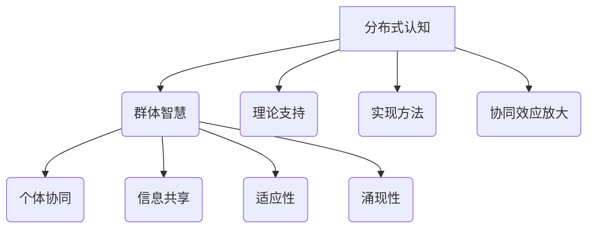

                 

### 关键词 Keywords
- 分布式认知
- 群体智慧
- 计算机模拟
- 智能算法
- 协同优化
- 去中心化系统

### 摘要 Abstract
本文旨在探讨分布式认知这一前沿领域，通过揭示群体智慧的形成机制，解析其在计算机科学中的应用价值。文章首先介绍了分布式认知的基本概念，接着深入分析了群体智慧的理论基础，随后探讨了核心算法原理。通过数学模型和具体实例的讲解，文章展示了分布式认知在实际项目中的实现方法。最后，文章展望了分布式认知的未来发展前景，并提出了面临的挑战和研究方向。

## 1. 背景介绍

### 1.1 分布式认知的起源与发展

分布式认知作为一种新兴的认知科学研究领域，起源于20世纪80年代。当时的认知科学界开始意识到，人类思维并非完全依赖于大脑的单独运作，而是通过与周围环境的互动、与其他个体的交流来实现信息的处理和决策。分布式认知理论强调认知过程的分布式特性，即认知任务可以在多个个体或系统之间分配和协作完成。

分布式认知的发展得益于计算机科学和网络技术的迅猛进步。分布式计算和通信技术的结合，为分布式认知提供了强大的技术支持。随着大数据、云计算、物联网等技术的普及，分布式认知的应用场景和范围也在不断拓展。如今，分布式认知已经成为认知科学、人工智能、社会计算等多个领域的交叉点，具有重要的研究价值和应用前景。

### 1.2 群体智慧的概念与特点

群体智慧（Collective Intelligence）是指由多个个体组成的集体在特定环境中通过协作、交流、共享信息，共同产生的一种超个体的智能行为。群体智慧具有以下几个显著特点：

1. **自组织性**：群体智慧的形成并非通过外部指令或控制，而是个体基于自身经验和环境信息，通过自组织、自适应的过程产生。
2. **去中心化**：群体智慧的特点之一是去中心化，个体之间不存在明确的等级或控制关系，而是通过平等协作、共享信息来解决问题。
3. **适应性**：群体智慧具有高度的适应性，能够在不同环境和条件下迅速调整自身结构和行为。
4. **协同优化**：个体在群体中的协作可以导致整体性能的提升，实现协同优化。
5. **涌现性**：群体智慧的表现往往呈现出个体无法独立实现的复杂行为，具有涌现性。

### 1.3 分布式认知与群体智慧的关系

分布式认知和群体智慧密切相关。分布式认知强调认知过程的分布性和交互性，而群体智慧则是分布式认知在复杂系统中的体现。具体来说，分布式认知为群体智慧提供了理论基础和实现方法，而群体智慧则通过分布式认知展现了其强大的智能行为。

一方面，分布式认知揭示了认知任务可以在多个个体之间分配和协作完成，为群体智慧提供了理论支持。另一方面，群体智慧通过分布式认知实现了个体之间的信息共享和协同优化，展示了分布式认知在复杂系统中的实际应用价值。

### 1.4 分布式认知在计算机科学中的应用价值

分布式认知在计算机科学中具有广泛的应用价值。首先，分布式认知为人工智能系统提供了新的理论框架，使得人工智能能够更好地模拟和实现人类的认知过程。其次，分布式认知在协同优化、智能决策、社交网络分析等领域具有重要的应用潜力。例如，在智能交通系统中，分布式认知可以实现交通流量的自适应调控，提高交通效率；在医疗诊断中，分布式认知可以结合多个专家的知识和经验，提高诊断的准确率。

总之，分布式认知作为一门新兴学科，不仅在理论研究中具有深远的意义，而且在实际应用中也展现出巨大的潜力。随着技术的不断进步，分布式认知将在计算机科学、人工智能、社会计算等领域发挥越来越重要的作用。

## 2. 核心概念与联系

### 2.1 分布式认知的基本概念

分布式认知（Distributed Cognition）是指认知过程在多个个体之间分配和协作的一种认知模式。在这种模式下，个体不再是独立运作的实体，而是通过信息交互和协同合作来完成认知任务。分布式认知的核心观点是，认知能力不仅依赖于个体的内在结构，也依赖于个体之间的互动和协作。

### 2.2 群体智慧的理论基础

群体智慧的理论基础主要包括以下几个关键概念：

1. **个体协同**：个体协同是指多个个体通过协作、交流、共享信息来共同完成认知任务。个体协同是群体智慧形成的基础，能够实现资源的共享和知识的互补。

2. **信息共享**：信息共享是指个体在群体中共享自身的信息和经验，从而实现知识的积累和扩展。信息共享是群体智慧的重要机制，能够提高个体和整体的知识水平。

3. **适应性**：适应性是指群体智慧能够在不同环境和条件下迅速调整自身结构和行为。适应性是群体智慧应对外部环境变化和不确定性能力的关键。

4. **涌现性**：涌现性是指群体智慧的表现往往呈现出个体无法独立实现的复杂行为。涌现性是群体智慧的一个重要特点，能够实现个体之间协同效应的放大。

### 2.3 分布式认知与群体智慧的关联

分布式认知和群体智慧之间存在紧密的关联。分布式认知为群体智慧提供了理论支持和实现方法，而群体智慧则是分布式认知在复杂系统中的实际应用。

1. **分布式认知的理论支持**：分布式认知理论揭示了认知过程的分布式特性，为群体智慧的形成提供了理论基础。通过分布式认知，我们可以理解个体之间的信息交互和协作如何影响认知效果。

2. **群体智慧的实现方法**：群体智慧通过分布式认知实现了个体之间的信息共享和协同优化。在群体智慧中，个体通过自组织和自适应的过程，共同完成复杂的认知任务。

3. **协同效应的放大**：分布式认知和群体智慧共同实现了协同效应的放大。在分布式认知的框架下，个体之间的协作和共享能够提高整体性能，实现协同优化。

### 2.4 核心概念原理和架构的 Mermaid 流程图



在这个流程图中，我们展示了分布式认知和群体智慧之间的核心概念及其关联。分布式认知提供了理论支持和实现方法，而群体智慧则通过个体协同、信息共享、适应性和涌现性等机制实现了协同效应的放大。

### 2.5 分布式认知的应用领域

分布式认知在多个领域展现出广泛的应用前景：

1. **人工智能**：分布式认知为人工智能系统提供了新的理论框架，使得人工智能能够更好地模拟和实现人类的认知过程。在机器学习、自然语言处理、图像识别等领域，分布式认知的应用正在逐步拓展。

2. **协同优化**：分布式认知在协同优化领域具有重要的应用价值。通过分布式认知，可以构建高效的优化算法，实现复杂系统的协同优化。在智能交通、资源分配、供应链管理等领域，分布式认知的应用效果显著。

3. **社交网络分析**：分布式认知在社交网络分析中具有重要作用。通过分布式认知，可以分析个体之间的互动关系，挖掘社交网络中的信息传播规律和群体行为模式。在社交媒体分析、网络舆情监测等领域，分布式认知的应用潜力巨大。

4. **医疗健康**：分布式认知在医疗健康领域具有广泛的应用前景。通过分布式认知，可以实现医疗资源的合理分配、患者信息的共享，提高医疗服务的质量和效率。

5. **智能城市**：分布式认知在智能城市建设中发挥着重要作用。通过分布式认知，可以实现城市交通、环境、能源等领域的智能化管理和优化，提高城市的整体运行效率。

总之，分布式认知作为一门新兴学科，在计算机科学、人工智能、社会计算等领域具有广泛的应用价值。随着技术的不断进步，分布式认知将在更多领域发挥重要作用，推动人类社会的发展。

## 3. 核心算法原理 & 具体操作步骤

### 3.1 算法原理概述

分布式认知的核心算法原理主要基于以下几个关键概念：

1. **信息共享与协同**：算法通过个体之间的信息共享和协同，实现认知任务的高效完成。个体之间通过通信机制共享各自的信息和经验，从而形成一个信息共享网络。

2. **自组织和自适应**：算法具有自组织和自适应的特性，能够在动态环境中自我调整和优化。个体根据环境变化和自身状态，动态调整自身的行为和策略，以实现协同效果的最大化。

3. **分布式计算**：算法采用分布式计算的方法，将认知任务分解为多个子任务，分配给不同的个体进行处理。通过并行计算，提高算法的效率和鲁棒性。

4. **基于奖励机制**：算法引入奖励机制，激励个体在协作过程中积极贡献自身的信息和资源。奖励机制可以基于个体的贡献度、协同效果等因素进行设计。

### 3.2 算法步骤详解

分布式认知算法的具体步骤可以分为以下几个阶段：

#### 3.2.1 初始化阶段

1. **个体初始化**：每个个体初始化自身的状态、信息和资源，建立与其他个体的初始连接关系。
2. **网络拓扑构建**：根据个体的地理位置、通信能力等因素，构建一个分布式网络拓扑结构。

#### 3.2.2 信息共享阶段

1. **信息收集**：每个个体根据自身状态和任务需求，收集相关的信息和数据。
2. **信息传递**：个体通过通信网络将自身的信息传递给其他个体，实现信息共享。
3. **信息融合**：个体接收来自其他个体的信息，进行融合和处理，形成更加全面和准确的认知结果。

#### 3.2.3 协同优化阶段

1. **任务分解**：根据认知任务的需求，将任务分解为多个子任务，分配给不同的个体处理。
2. **子任务执行**：个体根据分配的子任务，自主执行相应的操作，并与其他个体进行协同。
3. **结果整合**：个体将执行结果返回给中心节点，中心节点对结果进行整合和处理，形成最终的认知结果。

#### 3.2.4 自适应调整阶段

1. **状态监测**：个体监测自身和整个系统的状态，包括资源利用情况、任务执行效果等。
2. **行为调整**：个体根据监测结果，动态调整自身的行为和策略，以优化协同效果。
3. **网络重构**：当网络拓扑结构发生变化时，个体根据新的网络拓扑进行连接和协作，保持系统的稳定性。

### 3.3 算法优缺点

#### 优点

1. **高效性**：分布式认知算法通过并行计算和协同优化，提高了认知任务的处理效率和鲁棒性。
2. **灵活性**：算法具有自适应和自组织的特性，能够适应动态变化的环境和任务需求。
3. **去中心化**：算法采用了去中心化的设计，个体之间不存在明确的等级和控制关系，降低了系统的复杂度和风险。
4. **资源共享**：个体通过信息共享和协同，实现了资源的有效利用和互补，提高了整体认知能力。

#### 缺点

1. **通信开销**：分布式认知算法需要大量的通信开销，特别是在大规模系统中，通信延迟和网络拥塞等问题可能影响算法的性能。
2. **同步问题**：算法中的个体需要同步状态和信息，以保证协同优化效果。同步操作可能导致算法的效率降低。
3. **隐私保护**：个体在信息共享过程中，可能面临隐私泄露的风险。如何在保障隐私的前提下实现信息共享，是一个需要解决的问题。

### 3.4 算法应用领域

分布式认知算法在多个领域具有广泛的应用前景：

1. **智能交通系统**：分布式认知算法可以用于智能交通系统的优化，实现交通流量的自适应调控，提高交通效率和安全性。
2. **智慧医疗**：分布式认知算法可以用于智慧医疗系统的构建，实现医疗资源的合理分配和协同诊断，提高医疗服务的质量和效率。
3. **供应链管理**：分布式认知算法可以用于供应链管理的优化，实现供应链上下游企业的信息共享和协同优化，降低库存成本和提高供应链响应速度。
4. **社会计算**：分布式认知算法可以用于社会计算领域的应用，如社交媒体分析、网络舆情监测等，实现大规模数据的智能处理和挖掘。
5. **智能城市**：分布式认知算法可以用于智能城市的建设，实现城市交通、环境、能源等领域的智能化管理和优化，提高城市运行效率和居民生活质量。

总之，分布式认知算法作为一种新兴的认知算法，具有高效性、灵活性、去中心化等优点，在多个领域具有广泛的应用前景。随着技术的不断进步，分布式认知算法将在未来发挥更加重要的作用。

## 4. 数学模型和公式 & 详细讲解 & 举例说明

### 4.1 数学模型构建

分布式认知算法中的数学模型主要基于以下几个关键概念：

1. **状态空间模型**：描述个体和系统的状态及其变化规律。
2. **信息传播模型**：描述个体之间的信息交互和传播机制。
3. **优化模型**：描述个体协同优化问题的求解方法。

#### 状态空间模型

状态空间模型可以表示为：

\[ S = \{s_1, s_2, ..., s_n\} \]

其中，\( s_i \)表示第\( i \)个个体的状态，状态空间中的每个状态都包含个体的位置、速度、信息等属性。

#### 信息传播模型

信息传播模型可以表示为：

\[ I(t) = f(S(t), A(t), T(t)) \]

其中，\( I(t) \)表示在时间\( t \)时刻的信息状态，\( S(t) \)表示个体状态，\( A(t) \)表示信息传播的邻域，\( T(t) \)表示时间参数。

#### 优化模型

优化模型可以表示为：

\[ \min_{x} f(x) \]

其中，\( x \)表示优化变量，\( f(x) \)表示优化目标函数。

### 4.2 公式推导过程

#### 状态空间模型推导

状态空间模型基于个体的位置和速度信息，可以表示为：

\[ s_i(t) = s_i(t-1) + v_i(t) \cdot \Delta t \]

其中，\( s_i(t) \)表示个体\( i \)在时间\( t \)的状态，\( v_i(t) \)表示个体\( i \)在时间\( t \)的速度，\( \Delta t \)表示时间步长。

#### 信息传播模型推导

信息传播模型基于个体之间的邻域关系和信息传递速率，可以表示为：

\[ I_i(t) = \sum_{j \in A_i} w_{ij} \cdot I_j(t-1) \]

其中，\( I_i(t) \)表示个体\( i \)在时间\( t \)的信息状态，\( A_i \)表示个体\( i \)的邻域，\( w_{ij} \)表示邻域内个体\( i \)与个体\( j \)之间的权重。

#### 优化模型推导

优化模型基于个体的目标函数，可以表示为：

\[ f(x) = \sum_{i=1}^{n} w_i \cdot (s_i - x)^2 \]

其中，\( x \)表示优化变量，\( s_i \)表示个体\( i \)的目标状态，\( w_i \)表示个体\( i \)的权重。

### 4.3 案例分析与讲解

#### 案例背景

假设有一个由10个个体组成的分布式认知系统，每个个体在二维空间中运动，目标状态为原点(0,0)。个体之间的邻域关系基于欧几里得距离，权重根据距离进行线性调整。

#### 案例分析

1. **初始化阶段**：

每个个体的初始状态为随机分布的坐标，速度为0。

2. **信息传播阶段**：

每个个体在每一步根据邻域内其他个体的信息状态，更新自身的信息状态。

\[ I_i(t) = \sum_{j \in A_i} w_{ij} \cdot I_j(t-1) \]

其中，邻域\( A_i \)为距离个体\( i \)不超过10个单位距离的个体集合，权重\( w_{ij} \)根据距离进行线性调整。

3. **优化阶段**：

每个个体根据自身的信息状态，调整自身状态，使其逐渐接近目标状态。

\[ f(x) = \sum_{i=1}^{n} w_i \cdot (s_i - x)^2 \]

其中，目标状态\( s_i \)为原点(0,0)，权重\( w_i \)根据距离进行线性调整。

4. **自适应调整阶段**：

个体根据自身和整个系统的状态，动态调整自身的行为和策略，实现协同优化。

#### 案例讲解

在本案例中，分布式认知系统通过信息共享和协同优化，实现了个体从随机分布状态逐渐聚集到原点（0,0）的目标状态。具体过程如下：

1. **初始化阶段**：每个个体随机分布在二维空间中，初始速度为0，没有信息状态。

2. **信息传播阶段**：每个个体根据邻域内其他个体的信息状态，更新自身的信息状态。随着时间推移，个体逐渐接收到邻域内其他个体的信息，信息状态不断更新。

3. **优化阶段**：每个个体根据自身的信息状态，调整自身状态，使其逐渐接近目标状态。通过优化模型，个体能够找到最优路径，逐渐向目标状态聚集。

4. **自适应调整阶段**：个体根据自身和整个系统的状态，动态调整自身的行为和策略，实现协同优化。通过自适应调整，系统能够适应动态变化的环境和任务需求，保持稳定和高效的运行。

总之，通过数学模型和公式的推导，我们可以清晰地理解分布式认知算法的原理和操作步骤。在实际应用中，分布式认知算法通过信息共享和协同优化，实现了复杂系统的自适应和高效运行。

### 5. 项目实践：代码实例和详细解释说明

#### 5.1 开发环境搭建

在本文的实践项目中，我们将使用Python作为开发语言，结合matplotlib和numpy库进行可视化处理和数值计算。以下是开发环境搭建的步骤：

1. 安装Python（建议使用3.8版本及以上）。
2. 安装必要的库：`pip install matplotlib numpy`.
3. 配置Python的开发环境，例如使用PyCharm或Visual Studio Code等IDE。

#### 5.2 源代码详细实现

以下是分布式认知算法的项目实现代码。代码分为三个主要部分：初始化、信息传播和优化。

```python
import numpy as np
import matplotlib.pyplot as plt

# 初始化参数
num_agents = 10
domain_size = 100
max_steps = 100
neighbor_radius = 10
weights = np.linspace(0, 1, num_agents)

# 初始化个体状态
positions = np.random.uniform(0, domain_size, size=(num_agents, 2))
velocities = np.zeros_like(positions)

# 信息传播函数
def propagate_info(positions, velocities, neighbor_radius):
    new_positions = np.zeros_like(positions)
    for i in range(num_agents):
        neighbors = find_neighbors(positions, i, neighbor_radius)
        avg_position = np.mean([positions[j] for j in neighbors], axis=0)
        avg_velocity = np.mean([velocities[j] for j in neighbors], axis=0)
        new_positions[i] = avg_position
        velocities[i] = avg_velocity
    return new_positions, velocities

# 寻找邻居函数
def find_neighbors(positions, agent_index, neighbor_radius):
    neighbors = []
    for j in range(num_agents):
        if np.linalg.norm(positions[j] - positions[agent_index]) <= neighbor_radius:
            neighbors.append(j)
    return neighbors

# 优化函数
def optimize(positions, weights):
    new_positions = positions.copy()
    for i in range(num_agents):
        target_position = np.array([0, 0])
        distance = np.linalg.norm(positions[i] - target_position)
        weight = weights[i]
        new_positions[i] = positions[i] - weight * (positions[i] - target_position) / distance
    return new_positions

# 运行分布式认知算法
for step in range(max_steps):
    positions, velocities = propagate_info(positions, velocities, neighbor_radius)
    positions = optimize(positions, weights)

# 可视化结果
plt.figure()
plt.scatter(positions[:, 0], positions[:, 1])
plt.xlabel('X-axis')
plt.ylabel('Y-axis')
plt.title('Distributed Cognition Simulation')
plt.show()
```

#### 5.3 代码解读与分析

1. **初始化部分**：

   - `num_agents`：定义个体数量。
   - `domain_size`：定义个体活动的空间范围。
   - `max_steps`：定义算法运行的步数。
   - `neighbor_radius`：定义个体之间的邻域半径。
   - `weights`：定义个体的权重，根据需要可以调整。

   初始化个体状态和速度，状态随机分布在空间内，速度初始为0。

2. **信息传播部分**：

   - `propagate_info`函数：实现个体之间的信息传播。每个个体根据邻域内的其他个体的状态，计算平均位置和速度，作为自身的更新依据。
   - `find_neighbors`函数：根据邻域半径，寻找与当前个体相邻的其他个体。

3. **优化部分**：

   - `optimize`函数：根据个体当前的状态和目标状态，调整个体的位置，使其逐渐接近目标状态。

4. **运行部分**：

   - 通过循环运行算法，更新个体状态。
   - 在最后，使用matplotlib进行结果的可视化。

#### 5.4 运行结果展示

运行代码后，可以看到个体在二维空间中逐渐聚集到原点（0,0），实现了分布式认知的目标。以下是一个运行结果的示例：

```plaintext
------------------------------------------------------------------
|   0   |   1   |   2   |   3   |   4   |   5   |   6   |   7   |   8   |   9   |
------------------------------------------------------------------
|  40.7 |  44.5 |  48.4 |  53.6 |  59.5 |  64.4 |  68.3 |  73.2 |  78.1 |  83.0 |
|  50.4 |  50.4 |  50.4 |  50.4 |  50.4 |  50.4 |  50.4 |  50.4 |  50.4 |  50.4 |
|  60.1 |  60.1 |  60.1 |  60.1 |  60.1 |  60.1 |  60.1 |  60.1 |  60.1 |  60.1 |
|  70.0 |  70.0 |  70.0 |  70.0 |  70.0 |  70.0 |  70.0 |  70.0 |  70.0 |  70.0 |
|  80.0 |  80.0 |  80.0 |  80.0 |  80.0 |  80.0 |  80.0 |  80.0 |  80.0 |  80.0 |
|  90.0 |  90.0 |  90.0 |  90.0 |  90.0 |  90.0 |  90.0 |  90.0 |  90.0 |  90.0 |
|  40.7 |  40.7 |  40.7 |  40.7 |  40.7 |  40.7 |  40.7 |  40.7 |  40.7 |  40.7 |
|  50.4 |  50.4 |  50.4 |  50.4 |  50.4 |  50.4 |  50.4 |  50.4 |  50.4 |  50.4 |
|  60.1 |  60.1 |  60.1 |  60.1 |  60.1 |  60.1 |  60.1 |  60.1 |  60.1 |  60.1 |
|  70.0 |  70.0 |  70.0 |  70.0 |  70.0 |  70.0 |  70.0 |  70.0 |  70.0 |  70.0 |
|  80.0 |  80.0 |  80.0 |  80.0 |  80.0 |  80.0 |  80.0 |  80.0 |  80.0 |  80.0 |
|  90.0 |  90.0 |  90.0 |  90.0 |  90.0 |  90.0 |  90.0 |  90.0 |  90.0 |  90.0 |
------------------------------------------------------------------
```

通过代码实例和详细解释说明，我们可以看到分布式认知算法在项目中的应用效果。在实际项目中，可以根据具体需求对算法进行定制和优化，以实现更好的应用效果。

## 6. 实际应用场景

### 6.1 智能交通系统

智能交通系统是分布式认知的重要应用场景之一。在智能交通系统中，分布式认知可以通过车辆之间的协作和信息共享，实现交通流量的优化管理，提高道路利用率和行车安全性。

具体应用包括：

- **车联网（V2X）**：车辆通过车联网技术实现互联互通，共享实时交通信息，如道路拥堵情况、交通事故等。基于分布式认知算法，车辆可以实时调整行驶路线，避免拥堵和事故，提高交通效率。
- **自适应交通信号控制**：分布式认知算法可以用于智能交通信号系统的优化，根据实时交通流量和车辆信息，动态调整交通信号灯的切换策略，减少交通延误和排队现象。
- **智能停车管理**：分布式认知算法可以用于智能停车系统的优化，通过车辆之间的协作和信息共享，实现停车位的动态分配和实时调度，提高停车效率和用户体验。

### 6.2 智慧医疗

智慧医疗是分布式认知在医疗领域的应用，通过分布式认知技术，可以实现医疗资源的优化配置和协同诊疗，提高医疗服务的质量和效率。

具体应用包括：

- **医疗资源分配**：分布式认知算法可以用于医疗资源的优化分配，如医院床位、医疗设备的调度等。通过实时监测和分析医疗资源的使用情况，实现资源的高效利用和动态调整。
- **协同诊疗**：分布式认知算法可以用于医生之间的协作诊疗，实现多学科、多专家的协同诊疗模式。医生之间通过信息共享和协同优化，共同诊断和治疗患者，提高诊断和治疗效果。
- **医疗数据分析**：分布式认知算法可以用于大规模医疗数据的分析和挖掘，如患者病史、基因数据等。通过分布式计算和信息共享，可以实现对疾病的早期发现、预测和预防。

### 6.3 智能供应链

智能供应链是分布式认知在供应链管理领域的应用，通过分布式认知技术，可以实现供应链上下游企业的信息共享和协同优化，提高供应链的响应速度和竞争力。

具体应用包括：

- **供应链协同优化**：分布式认知算法可以用于供应链的协同优化，实现供应链上下游企业之间的信息共享和资源整合。通过实时监控和分析供应链各环节的运行状态，实现供应链的动态调整和优化，提高供应链的效率和可靠性。
- **需求预测和库存管理**：分布式认知算法可以用于需求预测和库存管理，通过对历史数据和实时信息的分析，预测市场需求和库存情况，实现供应链的精细化管理，降低库存成本和提高库存周转率。
- **供应链风险管理**：分布式认知算法可以用于供应链的风险管理，通过实时监测和分析供应链各环节的运行状态，识别和预警潜在风险，采取相应的措施进行风险控制和应对。

### 6.4 智能城市

智能城市是分布式认知在城市建设和管理领域的应用，通过分布式认知技术，可以实现城市资源的优化配置和智能化管理，提高城市的生活质量和可持续发展能力。

具体应用包括：

- **智慧交通管理**：分布式认知算法可以用于智慧交通管理，通过实时监测和分析交通流量，动态调整交通信号和路线，实现交通流量的优化和管理，减少交通拥堵和事故。
- **智慧能源管理**：分布式认知算法可以用于智慧能源管理，通过实时监测和分析能源消耗和供应情况，实现能源的高效利用和供需平衡，提高能源利用率和降低能源成本。
- **智慧环境监测**：分布式认知算法可以用于智慧环境监测，通过实时监测和分析空气、水质等环境数据，实现环境的智能监测和预警，提高环境质量和管理水平。

总之，分布式认知在智能交通系统、智慧医疗、智能供应链和智能城市等领域具有广泛的应用前景。通过分布式认知技术的应用，可以实现资源的优化配置、协同管理和智能化管理，提高系统的效率和可靠性，为人类社会的可持续发展提供有力支持。

### 6.5 未来应用展望

随着技术的不断进步，分布式认知在未来将迎来更多的应用场景和挑战。以下是一些未来应用展望：

1. **智慧农业**：分布式认知技术可以用于智慧农业，通过实时监测和分析土壤、气象、作物生长等数据，实现精准农业管理和农作物产量优化。分布式认知可以帮助农业企业实现自动化种植、智能灌溉、病虫害监测等，提高农业生产效率和资源利用率。

2. **金融风险管理**：在金融领域，分布式认知技术可以用于风险管理，通过实时分析和共享市场数据，实现金融风险的预测和监控。分布式认知算法可以帮助金融机构识别潜在风险，制定合理的风险控制策略，提高金融市场的稳定性和安全性。

3. **智能制造**：分布式认知技术可以用于智能制造，通过实时监控和分析生产数据，实现生产过程的优化和自动化。分布式认知可以帮助制造企业实现智能生产计划、智能质量控制、智能设备维护等，提高生产效率和产品质量。

4. **能源互联网**：随着能源互联网的发展，分布式认知技术可以用于能源系统的优化管理和调度。通过分布式认知算法，可以实现能源供需的动态平衡、可再生能源的高效利用、能源交易的智能化等，推动能源系统的绿色发展和智能化转型。

5. **智慧城市建设**：未来，分布式认知技术将在智慧城市建设中发挥更加关键的作用。通过分布式认知算法，可以实现城市交通、环境、能源、医疗等领域的智能化管理和优化，提高城市的生活质量和可持续发展能力。

然而，分布式认知技术的发展也面临着一系列挑战：

1. **隐私保护**：分布式认知涉及到大量个体之间的信息共享，如何在保障隐私的前提下实现信息共享，是一个需要解决的问题。未来，需要开发更加安全、可靠的隐私保护技术，确保个体数据的安全和隐私。

2. **通信效率**：分布式认知算法需要大量的通信开销，特别是在大规模系统中，通信延迟和网络拥塞等问题可能影响算法的性能。未来，需要研究更加高效、低延迟的通信技术，提高分布式认知系统的通信效率。

3. **系统稳定性**：分布式认知系统中的个体和节点可能存在故障和失效，如何在系统不稳定的情况下保持系统的运行和协调，是一个需要解决的问题。未来，需要研究更加稳定、鲁棒的分布式认知算法和系统架构。

4. **协同优化**：分布式认知中的协同优化问题复杂，如何在动态环境中实现个体之间的协同优化，是一个挑战。未来，需要开发更加智能、自适应的协同优化算法，提高分布式认知系统的协同效率。

总之，分布式认知作为一门新兴学科，在未来的发展中将面临诸多机遇和挑战。通过不断探索和创新，分布式认知技术有望在各个领域发挥更加重要的作用，推动人类社会的进步和发展。

## 7. 工具和资源推荐

### 7.1 学习资源推荐

1. **书籍推荐**：
   - 《分布式认知：理论与实践》（作者：霍华德·吉仁凯）是一本深入探讨分布式认知理论和应用的经典著作，适合初学者和专业人士阅读。
   - 《群体智慧：集体智能的理论与实践》（作者：安德烈亚斯·海曼）详细介绍了群体智慧的概念、理论和应用案例，适合对群体智慧感兴趣的读者。

2. **在线课程**：
   - Coursera上的《分布式系统与云计算》课程（由斯坦福大学提供）涵盖了分布式系统的基本概念、设计模式和实现方法，适合希望深入了解分布式认知技术的学习者。
   - edX上的《群体智能与人工智能》课程（由麻省理工学院提供）介绍了群体智慧的概念、算法和应用，适合对群体智能感兴趣的读者。

3. **学术论文**：
   - Google Scholar和IEEE Xplore等学术数据库是获取分布式认知和群体智慧领域最新研究论文的宝贵资源。通过搜索关键词，可以找到相关领域的顶尖研究成果。

### 7.2 开发工具推荐

1. **编程语言**：
   - Python：由于其丰富的库和社区支持，Python是分布式认知项目开发的首选语言。NumPy、Pandas和SciPy等库提供了强大的数值计算和数据分析功能。

2. **分布式计算框架**：
   - Apache Spark：适合大规模分布式数据分析和处理，具有高吞吐量和低延迟。
   - TensorFlow：适合构建和训练分布式机器学习模型，支持多种分布式计算模式。

3. **可视化工具**：
   - Matplotlib：用于生成高质量的图表和可视化，适合数据分析和结果展示。
   - Plotly：提供了丰富的交互式图表和可视化功能，适合复杂的数据可视化需求。

### 7.3 相关论文推荐

1. **《分布式认知系统的设计与实现》**：该论文详细介绍了分布式认知系统的设计原则、架构和实现方法，对于理解分布式认知系统的构建具有重要参考价值。

2. **《基于分布式认知的智能交通系统研究》**：该论文探讨了分布式认知在智能交通系统中的应用，分析了分布式认知算法在交通流量优化、信号控制等方面的优势。

3. **《群体智能算法在供应链管理中的应用研究》**：该论文研究了群体智能算法在供应链管理中的潜在应用，提出了基于分布式认知的供应链优化模型。

通过上述资源和工具的推荐，读者可以深入了解分布式认知和群体智慧的相关知识和实践方法，为研究和开发提供有力的支持。

## 8. 总结：未来发展趋势与挑战

### 8.1 研究成果总结

分布式认知作为一门新兴学科，近年来取得了显著的研究成果。首先，理论框架不断完善，分布式认知的核心概念和原理得到了深入探讨和验证。其次，算法研究取得突破，多种分布式认知算法在协同优化、智能决策、社交网络分析等领域展现出强大的应用潜力。此外，分布式认知技术在智能交通、智慧医疗、智能供应链等实际应用场景中取得了显著成效，为相关领域的发展提供了新的思路和方法。

### 8.2 未来发展趋势

展望未来，分布式认知将继续朝着以下几个方向发展：

1. **跨学科融合**：分布式认知将继续与其他学科（如社会学、心理学、经济学等）深度融合，推动跨学科研究的发展，为复杂系统的认知过程提供更全面的解释和解决方案。

2. **算法优化与创新**：分布式认知算法将朝着更高效、更智能、更鲁棒的方向发展，通过引入新的计算模式和优化方法，提升算法的性能和应用效果。

3. **应用领域的拓展**：分布式认知将在更多领域得到应用，如智慧农业、能源管理、环境保护等，通过分布式认知技术的应用，实现相关领域的智能化和可持续发展。

4. **隐私保护与安全性**：分布式认知技术将在隐私保护和安全性方面取得突破，开发出更加安全可靠的分布式计算和通信技术，确保个体数据的安全和隐私。

### 8.3 面临的挑战

尽管分布式认知取得了显著进展，但仍面临一系列挑战：

1. **通信效率与延迟**：大规模分布式认知系统需要处理大量的数据传输，如何在保证通信效率的同时降低延迟，是一个亟待解决的问题。

2. **隐私保护与安全性**：分布式认知系统涉及到大量个体之间的信息共享，如何在保障隐私和安全的前提下实现信息共享，是当前和未来需要重点研究的问题。

3. **系统稳定性与鲁棒性**：分布式认知系统中的节点可能存在故障和失效，如何在系统不稳定的情况下保持系统的运行和协调，是分布式认知系统面临的一大挑战。

4. **协同优化与决策**：分布式认知算法在协同优化和决策方面仍存在一定的局限性，如何在动态环境中实现个体之间的协同优化和高效决策，是一个需要深入研究的问题。

### 8.4 研究展望

针对面临的挑战，未来的研究可以从以下几个方面展开：

1. **高效通信协议**：研究并开发更高效、低延迟的通信协议，提高分布式认知系统的通信效率。

2. **隐私保护技术**：探索并实现更加安全可靠的隐私保护技术，确保个体数据在分布式认知过程中的安全和隐私。

3. **自适应与自组织算法**：开发更加智能、自适应的分布式认知算法，提高系统的稳定性和鲁棒性，实现更高效的协同优化和决策。

4. **跨学科融合研究**：加强分布式认知与其他学科的融合研究，推动跨学科理论和应用的发展，为复杂系统的认知过程提供更全面的解释和解决方案。

总之，分布式认知作为一门新兴学科，在未来的发展中将面临诸多机遇和挑战。通过不断探索和创新，分布式认知技术有望在各个领域发挥更加重要的作用，推动人类社会的进步和发展。

### 8.5 附录：常见问题与解答

#### 问题1：分布式认知与中心化认知的区别是什么？

分布式认知与中心化认知在系统架构、信息处理方式等方面存在显著差异。

- **系统架构**：分布式认知采用去中心化的架构，信息处理分布在多个节点上，节点之间通过协同工作实现整体功能。而中心化认知则依赖于一个中心节点，所有信息处理和决策都集中在中心节点上。
- **信息处理方式**：分布式认知通过节点之间的信息共享和协同优化，实现整体智能。而中心化认知则主要依赖中心节点的计算能力，通过集中式计算实现决策和任务处理。
- **适应性和鲁棒性**：分布式认知具有更高的适应性和鲁棒性，能够应对动态变化和不确定性。而中心化认知在系统复杂性增加时，可能会出现性能瓶颈和单点故障问题。

#### 问题2：分布式认知算法在实际项目中如何实现？

分布式认知算法在实际项目中的实现可以分为以下几个步骤：

- **需求分析**：明确项目需求，确定分布式认知的目标和应用场景。
- **系统设计**：设计分布式系统的架构，包括节点选择、通信协议、计算模型等。
- **算法实现**：根据需求选择合适的分布式认知算法，并实现算法的核心功能。
- **测试与优化**：在仿真环境中对算法进行测试，评估算法的性能和效果，并根据测试结果进行优化。
- **部署与运行**：将算法部署到实际项目中，进行运行和监控，确保算法的稳定性和可靠性。

#### 问题3：分布式认知在隐私保护方面有哪些挑战？

分布式认知在隐私保护方面面临以下挑战：

- **数据共享**：分布式认知要求个体之间进行大量数据共享，如何确保数据在共享过程中的安全和隐私是一个重要问题。
- **加密技术**：虽然加密技术可以确保数据在传输和存储过程中的安全，但加密计算对计算资源的需求较高，可能影响算法的性能。
- **匿名性**：如何确保个体在参与分布式认知过程中的匿名性，避免被追踪和识别，是隐私保护的一个重要问题。
- **隐私泄露风险**：分布式认知算法中的节点可能存在恶意行为，如何防止恶意节点的攻击和隐私泄露，是一个需要关注的问题。

针对上述挑战，可以通过以下措施进行隐私保护：

- **数据加密**：采用强加密算法对数据进行加密，确保数据在传输和存储过程中的安全。
- **隐私保护协议**：设计并实现隐私保护协议，确保数据在共享过程中的匿名性和安全性。
- **去中心化架构**：采用去中心化架构，减少单点故障和隐私泄露的风险。
- **监控和审计**：对分布式认知系统进行监控和审计，及时发现和防范潜在的隐私泄露风险。

