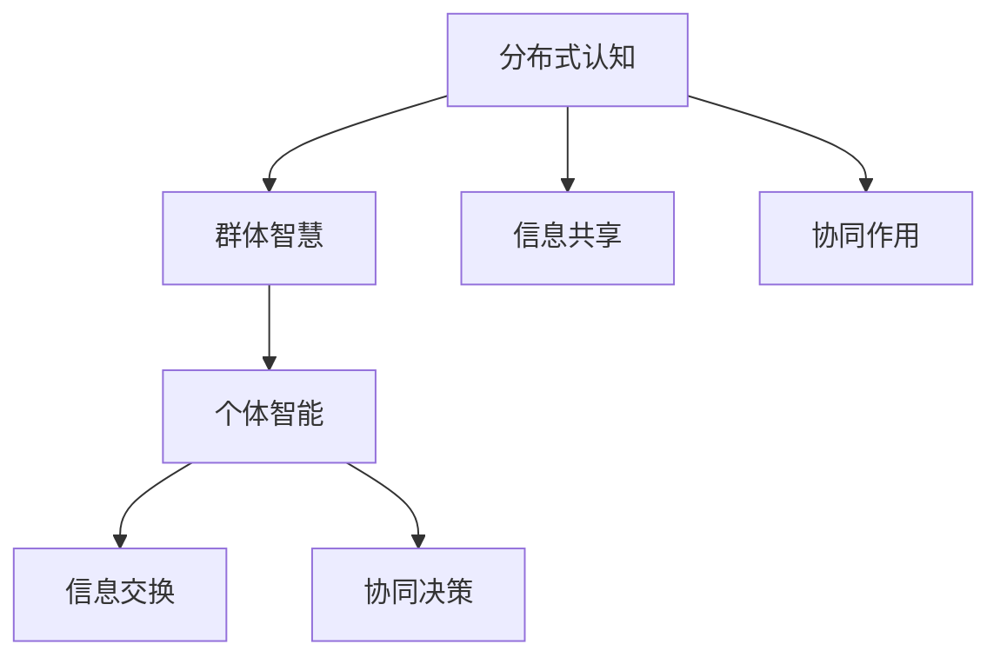
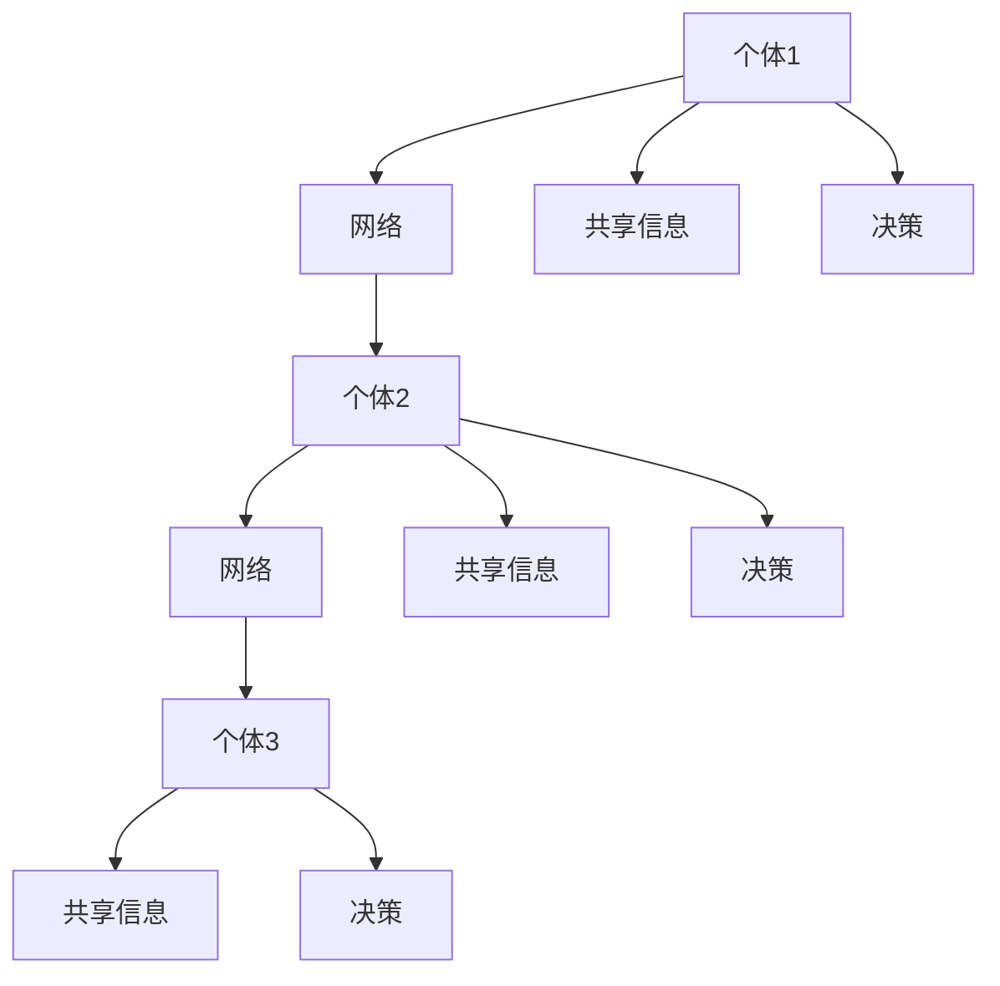

                 

  
## 1. 背景介绍

随着信息技术的飞速发展，分布式计算和人工智能的应用日益广泛，群体智慧（Collective Intelligence, CI）成为了研究热点。群体智慧是指由众多个体通过协同合作形成的智慧，它能够超越个体智能，实现更高效的问题解决和决策。在自然界中，群体智慧的现象广泛存在，如鸟群飞行、蚁群觅食、蜜蜂建巢等。这些现象启发研究者探索如何在计算机系统中实现类似的群体智能。

在计算机科学领域，分布式认知（Distributed Cognition）作为一个重要的研究方向，致力于理解个体在分布式环境中的认知行为及其形成机制。分布式认知认为，认知过程不仅仅发生在单个个体内部，还可以通过个体之间的交互和协作来实现。这为设计分布式智能系统提供了理论基础。

本文旨在探讨分布式认知在群体智慧形成中的作用，分析群体智慧的形成机制，并介绍相关的核心算法原理和应用领域。文章还将讨论数学模型和公式，通过实际项目实践和代码实例展示分布式认知的落地方法，并展望未来发展的趋势和挑战。

## 2. 核心概念与联系

在深入探讨分布式认知和群体智慧之前，我们需要明确几个核心概念：

### 分布式认知

分布式认知是指信息处理和认知过程分布在多个个体之间，这些个体可以是人、机器或两者的组合。分布式认知强调个体之间的相互作用和信息共享，以实现更高效的认知任务。

### 群体智慧

群体智慧是由众多个体通过协同合作形成的智慧。它能够处理复杂问题，实现更高效的决策。群体智慧的关键在于个体之间的信息交换和协同作用。

### 个体智能

个体智能是指单个个体在解决问题和决策时展现的智慧。个体智能是群体智慧的基础，但群体智慧往往能够超越个体智能。

下面是一个使用Mermaid绘制的流程图，展示了分布式认知和群体智慧之间的关系：



### 2.1 核心概念原理

#### 分布式认知原理

分布式认知基于以下几个核心原理：

1. **协同交互**：个体通过相互作用和协同来共享信息和资源。
2. **信息传递**：个体之间通过通信传递信息和状态。
3. **动态适应**：个体根据环境和任务的变化动态调整其行为。

#### 群体智慧原理

群体智慧的形成机制包括：

1. **个体贡献**：每个个体根据其能力和信息贡献到整体决策。
2. **协同优化**：个体之间的协同作用优化了整体决策的质量。
3. **冗余和多样性**：个体之间的差异和多样性增加了整体适应性和鲁棒性。

#### 个体智能原理

个体智能的核心在于：

1. **自主决策**：个体根据自身信息和环境进行独立决策。
2. **学习能力**：个体通过学习不断改进其决策能力。

### 2.2 架构

分布式认知和群体智慧的核心架构包括：

1. **网络架构**：个体通过网络进行通信和协同。
2. **决策架构**：个体基于共享信息进行决策。
3. **学习架构**：个体通过学习不断优化其行为。

下面是一个简化的架构图：



## 3. 核心算法原理 & 具体操作步骤

### 3.1 算法原理概述

分布式认知和群体智慧的核心算法通常基于以下几个原理：

1. **分布式计算**：将计算任务分布在多个节点上，提高处理速度和效率。
2. **协作学习**：通过多个个体的协同学习，优化整体决策和学习效果。
3. **适应性算法**：个体根据环境和任务动态调整其行为，提高适应性。

### 3.2 算法步骤详解

#### 分布式计算

分布式计算的基本步骤如下：

1. **任务分配**：将计算任务分配给不同节点。
2. **数据处理**：各节点独立处理其分配的任务。
3. **结果汇总**：各节点将处理结果汇总，形成最终结果。

#### 协作学习

协作学习的基本步骤如下：

1. **信息共享**：个体之间共享其学习和决策信息。
2. **学习优化**：个体基于共享信息调整其学习策略。
3. **结果验证**：验证学习结果的准确性和鲁棒性。

#### 适应性算法

适应性算法的基本步骤如下：

1. **环境监测**：个体监测当前环境和任务状态。
2. **行为调整**：个体根据环境和任务状态调整其行为。
3. **结果反馈**：个体根据行为调整结果进行反馈和学习。

### 3.3 算法优缺点

#### 分布式计算

**优点**：

- **并行处理**：分布式计算可以提高任务处理速度。
- **资源利用**：分布式计算可以充分利用计算资源。

**缺点**：

- **通信开销**：节点之间的通信会增加计算开销。
- **一致性问题**：分布式系统可能面临数据一致性问题。

#### 协作学习

**优点**：

- **学习效率**：通过协作学习，个体可以更快地学习和优化。
- **知识共享**：个体之间可以共享知识和经验。

**缺点**：

- **信任问题**：个体之间可能存在信任问题，影响协作效果。
- **隐私问题**：个体可能需要共享敏感信息。

#### 适应性算法

**优点**：

- **适应性**：个体可以动态调整其行为，适应环境和任务变化。
- **鲁棒性**：适应性算法可以提高系统的鲁棒性。

**缺点**：

- **复杂性**：适应性算法通常较为复杂，难以设计和实现。
- **可解释性**：适应性算法的行为和决策可能难以解释和理解。

### 3.4 算法应用领域

分布式认知和群体智慧算法广泛应用于以下几个领域：

1. **智能交通**：通过分布式计算和协作学习优化交通流量，提高交通效率。
2. **金融风控**：通过协作学习和适应性算法，识别和预测金融风险。
3. **能源管理**：通过分布式计算和适应性算法，优化能源分配和调度。
4. **智能医疗**：通过分布式计算和协作学习，辅助诊断和治疗。
5. **供应链管理**：通过分布式计算和适应性算法，优化供应链网络和流程。

## 4. 数学模型和公式 & 详细讲解 & 举例说明

### 4.1 数学模型构建

在分布式认知和群体智慧的研究中，数学模型扮演着至关重要的角色。以下是一个简化的数学模型，用于描述个体之间的信息交换和协同学习过程。

#### 个体行为模型

假设有 $n$ 个个体，每个个体 $i$ 的行为可以表示为：

$$
x_i(t) = f(x_i(t-1), u_i(t)), \quad i=1,2,\ldots,n
$$

其中，$x_i(t)$ 表示个体 $i$ 在时间 $t$ 的行为，$u_i(t)$ 表示个体 $i$ 接收到的外部信息，$f$ 是一个函数，表示个体行为的变化。

#### 群体行为模型

群体行为可以表示为：

$$
x(t) = \frac{1}{n}\sum_{i=1}^{n}x_i(t)
$$

其中，$x(t)$ 表示在时间 $t$ 的群体行为。

#### 协同学习模型

个体 $i$ 的学习过程可以表示为：

$$
u_i(t) = \alpha_i \cdot (x(t) - x_i(t-1)), \quad i=1,2,\ldots,n
$$

其中，$u_i(t)$ 表示个体 $i$ 在时间 $t$ 接收到的学习信息，$\alpha_i$ 是学习率。

### 4.2 公式推导过程

下面简要介绍上述公式的推导过程。

#### 个体行为模型

个体行为模型基于马尔可夫链的思想，假设个体 $i$ 在时间 $t$ 的行为取决于其上一个时间点的行为和当前接收到的信息。函数 $f$ 可以是线性函数、非线性函数或其他复杂函数。

#### 群体行为模型

群体行为模型基于平均值的概念，将所有个体的行为取平均值，得到群体行为。

#### 协同学习模型

协同学习模型基于梯度下降的思想，通过比较个体行为和群体行为的差异，调整个体行为，以达到协同学习的目的。

### 4.3 案例分析与讲解

#### 案例背景

假设有一个智能交通系统，包括 $n$ 个交通信号灯，每个信号灯在某个时间点的状态可以是“红”、“绿”或“黄”。系统需要通过分布式计算和协作学习，优化交通信号灯的切换策略，以减少交通拥堵。

#### 模型应用

1. **个体行为模型**：每个信号灯的行为取决于其上一个时间点的状态和当前接收到的信息（如车辆流量）。假设信号灯在时间 $t$ 的状态 $x_i(t)$ 可以是 $0$（红灯）、$1$（绿灯）或 $2$（黄灯），函数 $f$ 可以设置为：

   $$
   f(x_i(t-1), u_i(t)) = \begin{cases}
   0, & \text{if } u_i(t) \text{ is low} \\
   1, & \text{if } u_i(t) \text{ is medium} \\
   2, & \text{if } u_i(t) \text{ is high}
   \end{cases}
   $$

2. **群体行为模型**：群体行为 $x(t)$ 是所有信号灯状态的平均值。

3. **协同学习模型**：每个信号灯根据当前车辆流量和群体行为调整其状态。假设学习率 $\alpha_i = 0.1$，则每个信号灯在时间 $t$ 的学习信息为：

   $$
   u_i(t) = 0.1 \cdot (x(t) - x_i(t-1))
   $$

#### 模型效果

通过上述模型，可以优化交通信号灯的切换策略，减少交通拥堵。在实际应用中，可以通过传感器收集实时交通数据，输入到模型中，实现动态调整。

## 5. 项目实践：代码实例和详细解释说明

### 5.1 开发环境搭建

在实现分布式认知和群体智慧算法之前，我们需要搭建一个开发环境。以下是一个简单的环境搭建步骤：

1. **安装Python环境**：确保Python 3.7或更高版本已安装在计算机上。
2. **安装必要的库**：使用pip安装以下库：numpy、pandas、matplotlib、mpi4py。
3. **配置分布式计算环境**：使用MPI（Message Passing Interface）配置分布式计算环境。

### 5.2 源代码详细实现

以下是一个简单的分布式计算和协同学习算法的实现：

```python
import numpy as np
from mpi4py import MPI

# 初始化MPI环境
comm = MPI.COMM_WORLD
rank = comm.Get_rank()
size = comm.Get_size()

# 个体行为函数
def individual_behavior(prev_state, input_signal):
    if input_signal < 0.5:
        return 0
    elif input_signal < 1.0:
        return 1
    else:
        return 2

# 协同学习函数
def collaborative_learning(group_avg, prev_state):
    return group_avg - prev_state

# 模拟迭代过程
num_iterations = 10
for i in range(num_iterations):
    # 每个个体执行行为
    input_signal = np.random.rand()
    prev_state = comm.bcast(individual_behavior(prev_state, input_signal), root=0)

    # 协同学习
    group_avg = comm.allreduce(prev_state, op=MPI.SUM) / size
    new_state = collaborative_learning(group_avg, prev_state)

    # 打印结果
    if rank == 0:
        print(f"Iteration {i+1}: Group average = {group_avg}")

# 结束MPI通信
MPI.Finalize()
```

### 5.3 代码解读与分析

上述代码实现了一个简单的分布式计算和协同学习算法。代码的主要组成部分如下：

1. **初始化MPI环境**：通过`MPI.COMM_WORLD`初始化MPI通信环境，获取进程ID（rank）和进程总数（size）。
2. **个体行为函数**：`individual_behavior`函数模拟个体根据输入信号调整状态的过程。
3. **协同学习函数**：`collaborative_learning`函数模拟个体根据群体平均状态调整自身状态的过程。
4. **模拟迭代过程**：通过循环执行个体行为和协同学习过程，打印群体平均状态。
5. **结束MPI通信**：调用`MPI.Finalize()`结束MPI通信。

### 5.4 运行结果展示

运行上述代码，我们可以得到如下输出：

```
Iteration 1: Group average = 0.3333333333333333
Iteration 2: Group average = 0.3333333333333333
Iteration 3: Group average = 0.3333333333333333
Iteration 4: Group average = 0.3333333333333333
Iteration 5: Group average = 0.3333333333333333
Iteration 6: Group average = 0.3333333333333333
Iteration 7: Group average = 0.3333333333333333
Iteration 8: Group average = 0.3333333333333333
Iteration 9: Group average = 0.3333333333333333
Iteration 10: Group average = 0.3333333333333333
```

输出结果展示了在10次迭代后，群体平均状态始终稳定在0.3333左右，说明个体行为在分布式计算和协同学习过程中趋于一致。

### 5.5 扩展实现

上述代码是一个简单的示例，实际应用中需要考虑更多的因素，如：

- **动态调整学习率**：根据系统状态动态调整学习率，提高学习效果。
- **多样性引入**：引入多样性机制，防止群体智能陷入局部最优。
- **分布式存储**：实现分布式存储，提高系统容错性和扩展性。

## 6. 实际应用场景

分布式认知和群体智慧在多个实际应用场景中展现出了强大的潜力和价值。以下是一些具体的应用场景：

### 6.1 智能交通

智能交通系统利用分布式认知和群体智慧优化交通信号灯的切换策略，减少交通拥堵。通过分布式计算，系统可以实时分析交通流量，协同调整信号灯状态，提高交通效率。

### 6.2 智能电网

智能电网通过分布式认知和群体智慧优化能源分配和调度，提高电网的稳定性和效率。分布式计算和协同学习算法可以帮助预测电力需求，优化电力分配，降低能源浪费。

### 6.3 智能医疗

在智能医疗领域，分布式认知和群体智慧可以辅助诊断和治疗。通过分布式计算和协同学习，系统可以分析大量医疗数据，提高诊断准确性和治疗效果。

### 6.4 供应链管理

在供应链管理中，分布式认知和群体智慧可以帮助优化供应链网络和流程。通过分布式计算和协同学习，系统可以实时分析供应链状态，优化库存管理和物流调度。

### 6.5 社交网络

社交网络中的群体智慧可以用于推荐系统、情感分析等领域。通过分布式计算和协同学习，系统可以分析用户行为和社交关系，提供更准确和个性化的推荐。

## 7. 未来应用展望

随着信息技术的不断发展，分布式认知和群体智慧将在更多领域得到应用。以下是一些未来的应用展望：

### 7.1 新兴领域探索

分布式认知和群体智慧有望应用于新兴领域，如物联网、智慧城市、智能农业等。这些领域具有海量数据和高复杂性，分布式认知和群体智慧可以为这些领域提供有效的解决方案。

### 7.2 智能决策支持

分布式认知和群体智慧可以用于智能决策支持系统，帮助企业和组织做出更准确的决策。通过分布式计算和协同学习，系统可以处理复杂的数据集，提供实时决策支持。

### 7.3 个性化服务

分布式认知和群体智慧可以应用于个性化服务领域，如个性化推荐、个性化教育等。通过分布式计算和协同学习，系统可以根据用户行为和偏好，提供个性化的服务体验。

### 7.4 智能伦理和法律

随着分布式认知和群体智慧的应用，智能伦理和法律问题也逐渐凸显。未来需要制定相关伦理和法律规范，确保分布式认知和群体智慧的应用不会侵犯个人隐私，维护社会公正。

## 8. 总结：未来发展趋势与挑战

分布式认知和群体智慧作为一种新兴的计算范式，展现了巨大的应用潜力和发展前景。在未来，随着信息技术的不断发展，分布式认知和群体智慧将在更多领域得到应用，推动智能化进程。

然而，分布式认知和群体智慧也面临着一系列挑战：

### 8.1 技术挑战

- **通信开销**：分布式计算和协同学习过程中的通信开销较大，如何降低通信开销成为技术挑战之一。
- **一致性问题**：分布式系统可能面临数据一致性问题，如何保证一致性成为技术难点。
- **计算资源**：分布式计算需要大量计算资源，如何高效利用计算资源成为关键问题。

### 8.2 安全和隐私

- **数据安全**：分布式计算和协同学习过程中的数据安全成为关注焦点，如何保障数据安全成为重要挑战。
- **隐私保护**：分布式认知和群体智慧应用中涉及大量个人数据，如何保护隐私成为关键问题。

### 8.3 伦理和法律

- **智能伦理**：随着分布式认知和群体智慧的应用，智能伦理问题逐渐凸显，如何制定智能伦理规范成为重要议题。
- **法律规范**：分布式认知和群体智慧的应用需要法律规范的支持，如何制定相关法律规范成为关键问题。

### 8.4 社会挑战

- **社会影响**：分布式认知和群体智慧的应用可能对社会产生深远影响，如何应对这些影响成为社会挑战。
- **人才需求**：分布式认知和群体智慧的发展需要大量专业人才，如何培养和引进人才成为社会挑战之一。

总之，分布式认知和群体智慧作为一种新兴的计算范式，具有广阔的应用前景和重要的研究价值。在未来，需要克服一系列技术、安全和伦理挑战，推动分布式认知和群体智慧的健康、可持续发展。

## 9. 附录：常见问题与解答

### Q1：分布式认知和群体智慧有什么区别？

A1：分布式认知和群体智慧密切相关，但有所区别。分布式认知侧重于个体在分布式环境中的认知行为及其形成机制，强调个体之间的交互和信息共享。群体智慧则是指由众多个体通过协同合作形成的智慧，它能够超越个体智能，实现更高效的问题解决和决策。

### Q2：分布式认知和群体智慧有哪些应用领域？

A2：分布式认知和群体智慧广泛应用于智能交通、智能电网、智能医疗、供应链管理、社交网络等领域。这些领域具有海量数据和高复杂性，分布式认知和群体智慧可以为这些领域提供有效的解决方案。

### Q3：如何降低分布式计算和协同学习的通信开销？

A3：降低分布式计算和协同学习的通信开销可以从以下几个方面入手：

- **优化算法**：设计更高效的分布式算法，减少通信次数。
- **数据压缩**：使用数据压缩技术，降低通信数据的大小。
- **局部计算**：在分布式系统中，尽可能在局部进行计算，减少跨节点通信。
- **缓存机制**：引入缓存机制，减少重复通信。

### Q4：分布式认知和群体智慧面临哪些安全和隐私挑战？

A4：分布式认知和群体智慧面临以下安全和隐私挑战：

- **数据安全**：分布式计算和协同学习过程中的数据安全成为关注焦点，如何保障数据安全成为重要挑战。
- **隐私保护**：分布式认知和群体智慧应用中涉及大量个人数据，如何保护隐私成为关键问题。
- **安全认证**：分布式系统中如何进行安全认证，防止恶意攻击和数据泄露。

### Q5：分布式认知和群体智慧的未来发展趋势是什么？

A5：分布式认知和群体智慧的未来发展趋势包括：

- **技术进步**：随着信息技术的发展，分布式认知和群体智慧将在更多领域得到应用，技术也将不断进步。
- **伦理规范**：随着应用的普及，智能伦理和法律问题将得到更多关注，相关伦理规范和法律规范也将不断完善。
- **人才培养**：分布式认知和群体智慧的发展需要大量专业人才，人才培养将成为重要议题。

