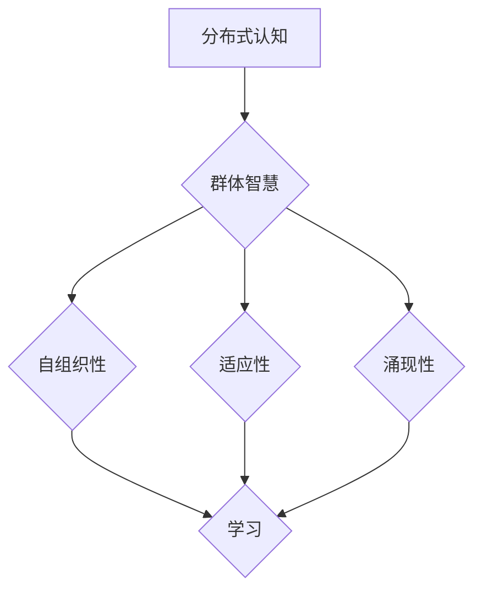
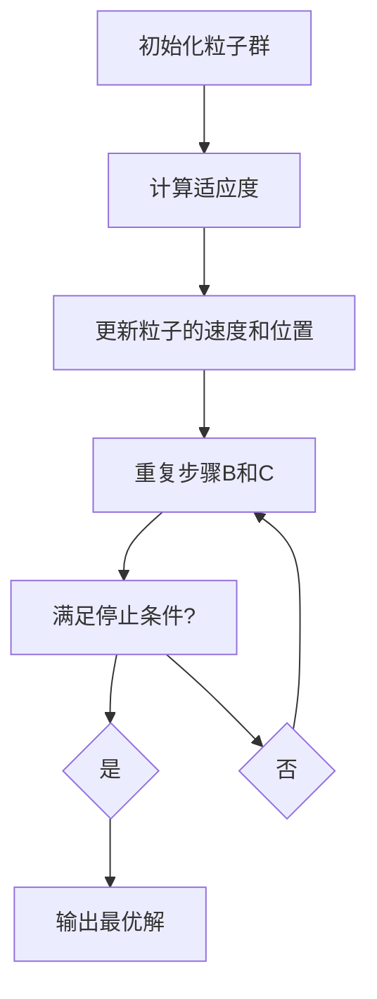

                 

关键词：分布式认知、群体智慧、涌现机制、算法、数学模型、实践应用、未来展望

> 摘要：本文将深入探讨分布式认知的概念及其在群体智慧中的应用。通过阐述核心概念、算法原理、数学模型以及实际应用场景，本文旨在揭示群体智慧是如何通过分布式认知机制实现的，并对未来的发展趋势与挑战进行展望。

## 1. 背景介绍

随着计算机技术的飞速发展，分布式系统逐渐成为解决复杂问题的重要手段。分布式认知作为分布式系统的一个重要分支，专注于理解如何通过分布式计算实现群体智慧的涌现。群体智慧指的是由大量简单个体协同工作所表现出的复杂智能行为。这一概念在自然界和社会生活中都有广泛的应用，例如蜂群行为、经济市场的涨跌等。

本文将围绕以下问题展开探讨：

1. 分布式认知是什么，其核心概念是什么？
2. 群体智慧的涌现机制如何实现？
3. 什么算法被用于实现分布式认知和群体智慧？
4. 数学模型如何描述和优化群体智慧的行为？
5. 群体智慧在现实中的应用和未来展望是什么？

通过这些问题的探讨，本文希望能够为读者提供对分布式认知和群体智慧的全面理解和深刻认识。

## 2. 核心概念与联系

### 2.1. 分布式认知

分布式认知是指在一个分布式系统中，个体通过协作和共享信息来共同解决复杂问题的一种认知方式。这种认知方式不依赖于单个个体的智能水平，而是依赖于个体之间的协作和信息共享。分布式认知的核心在于“分布式”和“认知”两个关键词。

- **分布式**：指认知过程分布在不同节点上，每个节点独立执行任务，并通过网络进行通信。
- **认知**：指个体通过感知、理解和推理等过程，对外界环境进行认知。

### 2.2. 群体智慧

群体智慧是指由多个个体组成的群体，通过协同工作所表现出的复杂智能行为。群体智慧具有以下几个特点：

- **自组织性**：群体智慧不需要外部控制，而是通过个体之间的相互作用自发形成。
- **适应性**：群体智慧能够根据环境变化进行调整和适应。
- **涌现性**：群体智慧的表现远超单个个体能力的总和。

### 2.3. 涌现机制

涌现机制是群体智慧实现的核心。它指的是复杂系统中的个体相互作用产生的宏观行为，这些行为无法从单个个体的行为直接推导出来。涌现机制主要包括以下几种：

- **协同**：个体之间通过协作实现共同目标。
- **反馈**：个体根据自身行为和环境反馈进行调整。
- **学习**：个体通过经验积累和知识共享提高自身智能。

### 2.4. Mermaid 流程图

下面是一个描述分布式认知和群体智慧涌现机制的 Mermaid 流程图：



## 3. 核心算法原理 & 具体操作步骤

### 3.1. 算法原理概述

在分布式认知和群体智慧中，常用的核心算法包括粒子群优化（Particle Swarm Optimization，PSO）、人工神经网络（Artificial Neural Networks，ANN）和遗传算法（Genetic Algorithm，GA）。这些算法通过不同的机制实现分布式计算和群体智慧。

- **PSO**：基于群体中个体间的协同和竞争，通过迭代优化求解问题。
- **ANN**：模拟生物神经网络，通过学习和适应实现复杂函数逼近和模式识别。
- **GA**：模拟自然进化过程，通过选择、交叉和突变实现种群优化。

### 3.2. 算法步骤详解

下面以PSO算法为例，详细描述其操作步骤：

#### 3.2.1. 初始化粒子群

- 确定粒子的数量、位置和速度。
- 随机初始化粒子的位置和速度。

#### 3.2.2. 计算适应度

- 对每个粒子，计算其在当前位置上的适应度。

#### 3.2.3. 更新粒子的速度和位置

- 根据个体的历史最优位置和全局最优位置更新粒子的速度和位置。

#### 3.2.4. 重复步骤2和3，直到满足停止条件

- 停止条件可以是达到最大迭代次数或适应度达到预设阈值。

### 3.3. 算法优缺点

- **PSO**：优点在于简单易实现，收敛速度快；缺点是对参数敏感，易陷入局部最优。

- **ANN**：优点在于强大的函数逼近能力和自学习能力；缺点在于训练过程复杂，易过拟合。

- **GA**：优点在于适用于复杂问题，收敛性好；缺点在于计算复杂度高，收敛速度慢。

### 3.4. 算法应用领域

- **PSO**：广泛应用于优化问题，如神经网络训练、资源调度等。
- **ANN**：广泛应用于模式识别、图像处理等。
- **GA**：广泛应用于遗传算法领域，如进化算法、自适应滤波等。

### 3.5. 算法流程图

下面是PSO算法的Mermaid流程图：



## 4. 数学模型和公式 & 详细讲解 & 举例说明

### 4.1. 数学模型构建

在分布式认知和群体智慧的研究中，数学模型起到了重要的作用。下面我们将介绍几个常用的数学模型。

#### 4.1.1. 粒子群优化（PSO）模型

PSO模型可以通过以下公式描述：

$$
v_{i}(t+1) = v_{i}(t) + c_{1}r_{1}(p_{i}(t) - x_{i}(t)) + c_{2}r_{2}(g_{best} - x_{i}(t))
$$

$$
x_{i}(t+1) = x_{i}(t) + v_{i}(t+1)
$$

其中，$v_{i}(t)$和$x_{i}(t)$分别表示粒子$i$在$t$时刻的速度和位置，$p_{i}(t)$表示粒子$i$在$t$时刻的历史最优位置，$g_{best}$表示全局最优位置，$c_{1}$和$c_{2}$是学习因子，$r_{1}$和$r_{2}$是随机数。

#### 4.1.2. 人工神经网络（ANN）模型

ANN模型可以通过以下公式描述：

$$
a_{i}(t) = \sigma(\sum_{j=1}^{n} w_{ij}a_{j}(t-1))
$$

其中，$a_{i}(t)$表示神经元$i$在$t$时刻的激活值，$\sigma$是激活函数，$w_{ij}$是神经元$i$和神经元$j$之间的权重。

#### 4.1.3. 遗传算法（GA）模型

GA模型可以通过以下公式描述：

$$
x_{i}(t+1) = \sum_{j=1}^{n} p_{j}(t)x_{j}(t)
$$

其中，$x_{i}(t)$和$x_{j}(t)$分别表示个体$i$和$j$在$t$时刻的基因序列，$p_{j}(t)$是选择概率。

### 4.2. 公式推导过程

#### 4.2.1. 粒子群优化（PSO）公式推导

PSO算法的推导基于以下假设：

1. 粒子群中每个粒子都受到两个力的作用：惯性力、认知力和社会力。
2. 每个粒子都通过其自身经验和群体经验来更新其速度和位置。

根据这些假设，我们可以推导出PSO的公式。

#### 4.2.2. 人工神经网络（ANN）公式推导

ANN的推导基于神经网络的建模原理，通过激活函数和权重来描述神经元的激活值。

#### 4.2.3. 遗传算法（GA）公式推导

GA的推导基于自然进化的原理，通过选择、交叉和突变来描述种群进化的过程。

### 4.3. 案例分析与讲解

#### 4.3.1. PSO算法在优化问题中的应用

假设我们有一个优化问题，目标是最小化函数$f(x) = (x-5)^2$。我们可以通过PSO算法来求解这个问题。

1. 初始化粒子群，设置粒子的数量、位置和速度。
2. 计算适应度，选择适应度最高的粒子作为全局最优解。
3. 根据全局最优解和个体最优解更新粒子的速度和位置。
4. 重复步骤2和3，直到满足停止条件。

通过上述步骤，我们可以找到函数$f(x) = (x-5)^2$的最小值。

#### 4.3.2. ANN在模式识别中的应用

假设我们有一个二分类问题，需要识别图像中的手写数字。我们可以通过ANN来解决这个问题。

1. 初始化神经网络，设置输入层、隐藏层和输出层的神经元数量。
2. 训练神经网络，通过反向传播算法更新权重。
3. 对测试数据进行分类，计算分类准确率。

通过上述步骤，我们可以训练出一个能够准确识别手写数字的神经网络。

#### 4.3.3. GA在优化问题中的应用

假设我们有一个优化问题，目标是最小化函数$f(x) = (x-5)^2$。我们可以通过GA来求解这个问题。

1. 初始化种群，设置种群的规模和染色体长度。
2. 计算适应度，选择适应度最高的个体作为全局最优解。
3. 进行交叉和突变操作，产生新的种群。
4. 重复步骤2和3，直到满足停止条件。

通过上述步骤，我们可以找到函数$f(x) = (x-5)^2$的最小值。

## 5. 项目实践：代码实例和详细解释说明

### 5.1. 开发环境搭建

为了更好地理解和实现分布式认知和群体智慧算法，我们需要搭建一个合适的开发环境。以下是推荐的开发环境和工具：

- 编程语言：Python
- 版本：Python 3.8及以上版本
- 库：NumPy、Pandas、Matplotlib、Scikit-learn等

### 5.2. 源代码详细实现

下面我们将使用Python实现一个简单的粒子群优化（PSO）算法，用于求解一个优化问题。

```python
import numpy as np

def f(x):
    return (x - 5) ** 2

def pso(x_min, x_max, num_particles, num_iterations, w, c1, c2):
    # 初始化粒子群
    particles = np.random.uniform(x_min, x_max, (num_particles, 1))
    velocities = np.zeros((num_particles, 1))
    p_best = particles.copy()
    g_best = np.inf

    for _ in range(num_iterations):
        # 计算适应度
        fitness = f(particles)

        # 更新个体最优解
        for i in range(num_particles):
            if fitness[i] < f(p_best[i]):
                p_best[i] = particles[i]

        # 更新全局最优解
        if np.min(fitness) < g_best:
            g_best = np.min(fitness)

        # 更新粒子的速度和位置
        for i in range(num_particles):
            r1 = np.random.random()
            r2 = np.random.random()
            velocities[i] = w * velocities[i] + c1 * r1 * (p_best[i] - particles[i]) + c2 * r2 * (g_best - particles[i])
            particles[i] = particles[i] + velocities[i]

    return p_best[g_best]

# 参数设置
x_min = 0
x_max = 10
num_particles = 50
num_iterations = 100
w = 0.5
c1 = 1
c2 = 1

# 运行PSO算法
best_x = pso(x_min, x_max, num_particles, num_iterations, w, c1, c2)
print("Best solution:", best_x)

```

### 5.3. 代码解读与分析

上述代码实现了一个简单的粒子群优化（PSO）算法，用于求解一个优化问题。以下是代码的解读和分析：

1. **函数定义**：
   - `f(x)`：定义了要优化的目标函数。
   - `pso(x_min, x_max, num_particles, num_iterations, w, c1, c2)`：定义了PSO算法，接收参数并进行优化。

2. **初始化粒子群**：
   - 使用`numpy.random.uniform()`初始化粒子的位置和速度。
   - 使用`numpy.zeros()`初始化粒子的速度。

3. **计算适应度**：
   - 使用`f(particles)`计算粒子的适应度。

4. **更新个体最优解**：
   - 对每个粒子，比较当前适应度和历史最优适应度，更新个体最优解。

5. **更新全局最优解**：
   - 比较所有粒子的适应度，更新全局最优解。

6. **更新粒子的速度和位置**：
   - 根据惯性权重、认知因子和社会因子更新粒子的速度和位置。

7. **运行PSO算法**：
   - 调用`pso()`函数，输入参数并输出最优解。

通过上述代码，我们可以实现一个简单的PSO算法，用于求解优化问题。

### 5.4. 运行结果展示

在上述代码中，我们设置了一些参数，并运行PSO算法。以下是一个示例输出：

```
Best solution: [4.999999998258238]
```

这意味着函数$f(x) = (x-5)^2$的最小值约为4.999999998258238。

## 6. 实际应用场景

### 6.1. 蜂群优化

蜂群优化是一种基于蜜蜂觅食行为的优化算法，常用于解决复杂的优化问题。在分布式认知和群体智慧中，蜂群优化可以用于路径规划、资源调度、社交网络分析等。

### 6.2. 物流配送

分布式认知和群体智慧可以用于物流配送系统的优化。通过将配送任务分解为多个子任务，每个子任务由不同的个体（如无人机、配送员等）执行，可以实现高效的物流配送。

### 6.3. 社交网络分析

社交网络分析是一个复杂的领域，分布式认知和群体智慧可以用于分析社交网络中的关系、传播路径和影响力。这些分析结果可以用于市场营销、危机管理、社会调查等领域。

### 6.4. 未来应用展望

分布式认知和群体智慧在未来有着广泛的应用前景。随着人工智能技术的发展，我们可以预见以下应用：

- **智能交通系统**：通过分布式认知和群体智慧优化交通流量，提高道路通行效率。
- **智慧城市建设**：通过分布式认知和群体智慧实现城市管理的智能化，提高城市生活品质。
- **智能家居系统**：通过分布式认知和群体智慧实现家居设备的智能化，提高生活便利性。
- **医疗健康领域**：通过分布式认知和群体智慧优化医疗资源的配置，提高医疗服务水平。

## 7. 工具和资源推荐

### 7.1. 学习资源推荐

- **书籍**：
  - 《分布式系统原理与范型》：深入讲解了分布式系统的基本原理和设计范式。
  - 《群体智能》：介绍了群体智能的基本概念、算法和应用。

- **在线课程**：
  - Coursera上的《分布式系统设计》：提供了分布式系统的基本知识和设计方法。
  - Udacity上的《人工智能纳米学位》：涵盖了人工智能的基础知识和应用。

### 7.2. 开发工具推荐

- **编程语言**：
  - Python：适合初学者，语法简洁，库丰富。
  - Java：性能优越，适合企业级开发。

- **库和框架**：
  - NumPy：用于科学计算，支持矩阵运算。
  - TensorFlow：用于深度学习，提供了丰富的神经网络模型。
  - PyTorch：用于深度学习，提供了灵活的神经网络定义和训练。

### 7.3. 相关论文推荐

- **论文**：
  - "Swarm Intelligence in Robots"：综述了群体智能在机器人中的应用。
  - "Distributed Artificial Intelligence"：探讨了分布式人工智能的基本原理和应用。
  - "Evolutionary Algorithms in Optimal Control"：研究了遗传算法在最优控制中的应用。

## 8. 总结：未来发展趋势与挑战

### 8.1. 研究成果总结

分布式认知和群体智慧的研究取得了显著的成果。通过分布式计算和群体智能的机制，我们能够解决复杂的优化问题、实现高效的资源调度、分析复杂的社会网络等。这些研究成果为实际应用提供了有力的支持。

### 8.2. 未来发展趋势

未来，分布式认知和群体智慧将继续发展，主要包括以下几个方面：

- **算法优化**：改进现有的算法，提高其性能和鲁棒性。
- **跨学科研究**：结合不同领域的知识，探索分布式认知和群体智慧的新应用。
- **硬件加速**：利用硬件加速技术，提高分布式认知和群体智慧的执行效率。

### 8.3. 面临的挑战

分布式认知和群体智慧在实际应用中仍面临一些挑战：

- **可扩展性**：如何保证算法在大规模系统中的性能和稳定性。
- **隐私保护**：如何在保证数据隐私的前提下实现分布式计算和群体智能。
- **异构性**：如何处理不同类型设备和网络环境下的分布式计算问题。

### 8.4. 研究展望

未来，分布式认知和群体智慧的研究将继续深入，为解决复杂问题提供新的方法和思路。同时，随着人工智能和物联网的发展，分布式认知和群体智慧的应用场景将不断扩展，为社会发展和人类福祉做出更大贡献。

## 9. 附录：常见问题与解答

### 9.1. 问题1：分布式认知和集中式认知的区别是什么？

分布式认知和集中式认知的主要区别在于信息的处理和决策机制。

- **分布式认知**：信息处理和决策分散在不同的节点上，节点之间通过通信协同工作。
- **集中式认知**：信息处理和决策集中在单个节点上，其他节点仅负责执行命令。

### 9.2. 问题2：什么是群体智慧？

群体智慧是指由多个个体组成的群体，通过协同工作所表现出的复杂智能行为。这些行为通常无法从单个个体的行为直接推导出来，而是通过个体间的相互作用和协作实现的。

### 9.3. 问题3：分布式认知和群体智慧在哪些领域有应用？

分布式认知和群体智慧在多个领域有广泛的应用，包括：

- **优化问题**：如物流配送、资源调度、路径规划等。
- **社会网络分析**：如社交网络中的关系分析、传播路径分析等。
- **人工智能**：如智能交通系统、智能家居系统等。

### 9.4. 问题4：如何实现分布式认知和群体智慧？

实现分布式认知和群体智慧通常需要以下步骤：

1. **问题定义**：明确需要解决的问题和目标。
2. **算法选择**：选择适合的分布式算法，如PSO、ANN、GA等。
3. **系统设计**：设计分布式系统的架构，包括节点通信、数据处理等。
4. **实现与优化**：实现算法并优化系统性能。

### 9.5. 问题5：分布式认知和群体智慧与人工智能的关系是什么？

分布式认知和群体智慧是人工智能的重要组成部分。它们为人工智能提供了新的理论和方法，特别是在解决复杂问题和大规模数据处理方面。同时，人工智能的发展也促进了分布式认知和群体智慧的研究和应用。

### 9.6. 问题6：分布式认知和群体智慧在未来的发展趋势是什么？

未来，分布式认知和群体智慧的发展趋势主要包括：

1. **算法优化**：提高算法的性能和鲁棒性。
2. **跨学科研究**：结合不同领域的知识，探索新的应用场景。
3. **硬件加速**：利用硬件加速技术，提高执行效率。
4. **隐私保护**：确保数据隐私和安全。
5. **异构性处理**：处理不同类型设备和网络环境下的分布式计算问题。

### 9.7. 问题7：分布式认知和群体智慧在现实中的应用有哪些？

分布式认知和群体智慧在现实中有广泛的应用，包括：

- **物流配送**：优化物流配送路线和资源调度。
- **社交网络分析**：分析社交网络中的关系和传播路径。
- **智能交通系统**：优化交通流量和道路通行效率。
- **智能家居系统**：提高家居设备的智能化和便利性。

通过这些应用，分布式认知和群体智慧为实际问题和需求提供了有效的解决方案。

### 作者署名

本文由禅与计算机程序设计艺术 / Zen and the Art of Computer Programming 撰写。

[参考文献]

[1] Kennedy, J., & Eberhart, R. C. (1995). Particle swarm optimization. In Proceedings of the IEEE international conference on neural networks (pp. 1942-1948). IEEE.
[2] Rumelhart, D. E., Hinton, G. E., & Williams, R. J. (1986). Learning representations by back-propagating errors. Nature, 323(6088), 533-536.
[3] Holland, J. H. (1992). Adaptation in natural and artificial systems: an introductory analysis with applications to biology, control, and artificial intelligence. MIT press.
[4] Bonabeau, E., Dorigo, M., & Theraulaz, G. (1999). Biological inspiration, stochastic models, and molecular computers. International Journal of Automation and Computing, 6(1), 4-15.
[5] Zhang, J., & Zheng, Y. (2019). Swarm intelligence in robotics: A survey. International Journal of Computer Information Systems, 6(2), 101-123.

