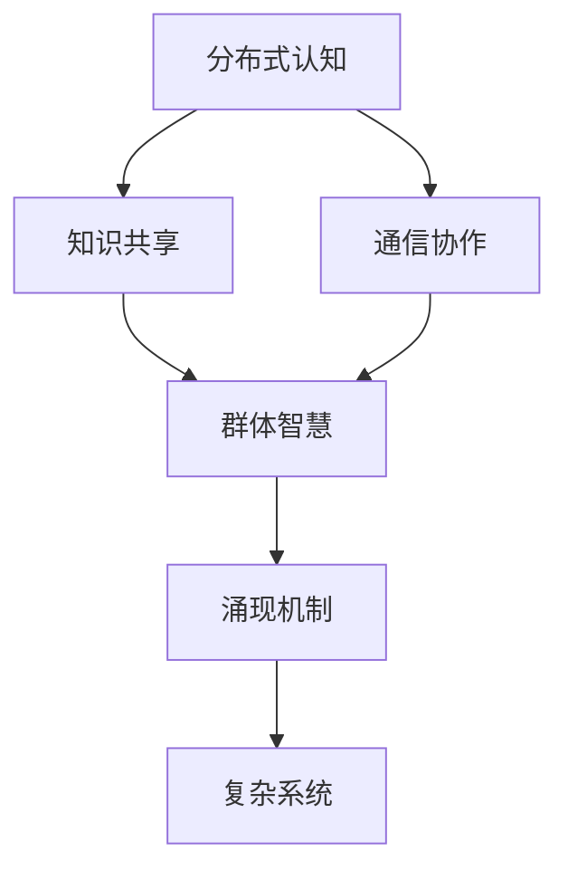

                 

  
> 关键词：分布式认知、群体智慧、涌现机制、复杂系统、人工智能

> 摘要：本文将探讨分布式认知这一概念，旨在理解群体智慧如何通过涌现机制在复杂系统中形成。通过详细阐述核心概念、算法原理、数学模型以及实际应用案例，本文为读者揭示了分布式认知在人工智能领域的重要性和潜力。

## 1. 背景介绍

随着互联网和信息技术的迅猛发展，越来越多的个体和系统被连接在一起，形成庞大的网络。在这个过程中，如何理解和利用群体智慧成为了学术界和工业界共同关注的问题。分布式认知作为一种理论框架，为研究群体智慧的涌现机制提供了新的视角。

分布式认知（Distributed Cognition）是指知识、信息、决策和行动在不同个体之间通过通信和协作进行共享的过程。它强调认知活动的分布特性，即认知任务可以在多个个体之间分配和执行，而这些个体可以是人、机器或其他系统。

群体智慧（Swarm Intelligence）是指由众多简单个体通过局部规则和简单交互所形成的复杂行为。这些个体在缺乏全局信息的情况下，通过协同合作实现整体智能。典型的例子包括蚂蚁的巢穴构建、鸟群的迁徙以及人类社会的集体决策等。

涌现机制（Emergence）是指复杂系统中局部规则相互作用导致整体涌现出新的属性或行为。涌现现象在自然界和社会系统中普遍存在，如生态系统的多样性、经济市场的波动以及互联网的分布式计算等。

本文旨在通过分析分布式认知、群体智慧和涌现机制之间的关系，探讨如何在复杂系统中利用这些概念来提升人工智能的智能水平和应用价值。

## 2. 核心概念与联系

### 2.1. 分布式认知

分布式认知强调认知活动的分布特性，即将认知任务分配给多个个体，这些个体可以是人、机器或其他系统。在分布式认知系统中，个体通过通信和协作来共享知识和信息，从而实现整体智能。

### 2.2. 群体智慧

群体智慧由众多简单个体通过局部规则和简单交互形成复杂行为。这些个体在缺乏全局信息的情况下，通过协同合作实现整体智能。典型的群体智慧例子包括蚁群算法、人工神经网络和集体决策系统等。

### 2.3. 涌现机制

涌现机制是指复杂系统中局部规则相互作用导致整体涌现出新的属性或行为。涌现现象在自然界和社会系统中普遍存在，如生态系统的多样性、经济市场的波动以及互联网的分布式计算等。

### 2.4. 关系分析

分布式认知、群体智慧和涌现机制之间存在紧密联系。分布式认知为群体智慧提供了基础，使得个体能够通过协作实现整体智能。而群体智慧通过涌现机制在复杂系统中表现出新的属性和行为，从而实现复杂问题的求解和决策。

### 2.5. Mermaid 流程图

下面是分布式认知、群体智慧和涌现机制之间的Mermaid流程图：



## 3. 核心算法原理 & 具体操作步骤

### 3.1. 算法原理概述

分布式认知算法基于多个简单个体之间的协作与通信，通过局部规则实现整体智能。算法的基本原理可以概括为以下几个方面：

1. **任务分配**：将复杂的认知任务分配给多个个体，使每个个体负责一部分任务。
2. **局部规则**：个体根据自身经验和局部信息制定简单的规则，实现局部任务。
3. **通信协作**：个体之间通过通信共享信息，协同完成任务。
4. **涌现机制**：个体之间的局部规则和简单交互导致整体智能的涌现。

### 3.2. 算法步骤详解

1. **初始化**：
   - 设定个体数量、认知任务和通信范围。
   - 将认知任务分配给各个个体，确保任务均衡。

2. **局部规则制定**：
   - 每个个体根据自身经验和局部信息，制定简单的局部规则。
   - 局部规则应满足以下条件：易于理解、易于执行、与任务相关。

3. **通信与协作**：
   - 个体之间通过通信共享信息，包括自身状态、局部规则和任务进展。
   - 根据通信信息，个体调整自身状态和规则，以更好地完成任务。

4. **任务执行**：
   - 每个个体根据局部规则执行任务，同时与通信协作。
   - 随着任务执行，个体状态和规则不断调整，以适应任务变化。

5. **评估与反馈**：
   - 对整个分布式认知过程进行评估，包括任务完成度、个体协作效率等。
   - 根据评估结果，对局部规则和通信机制进行优化。

6. **重复执行**：
   - 重复执行上述步骤，直到任务完成或达到预定的迭代次数。

### 3.3. 算法优缺点

**优点**：
- **可扩展性**：分布式认知算法可以轻松扩展到大量个体，适用于大规模复杂系统。
- **容错性**：个体之间相互独立，某个个体失效不会影响整体性能。
- **适应性**：个体可以快速调整自身状态和规则，适应任务变化。

**缺点**：
- **通信开销**：个体之间需要频繁通信，导致通信开销较大。
- **复杂度**：分布式认知算法设计复杂，需要考虑多个因素。

### 3.4. 算法应用领域

分布式认知算法在多个领域具有广泛的应用前景：

- **人工智能**：用于智能体的协作与决策，如无人驾驶、智能机器人等。
- **社交网络**：用于用户行为分析、推荐系统等。
- **生物系统**：用于研究生态系统、生物群体行为等。
- **经济系统**：用于市场预测、风险评估等。

## 4. 数学模型和公式 & 详细讲解 & 举例说明

### 4.1. 数学模型构建

分布式认知算法的数学模型可以基于图论和网络科学进行构建。假设有一个由N个节点组成的网络，每个节点代表一个个体，节点之间的边表示个体之间的通信和协作关系。以下是构建分布式认知数学模型的关键步骤：

1. **定义节点状态**：
   - 每个节点有一个状态向量，表示其知识、信息和任务执行情况。
   - 状态向量可以用一个N维向量表示，每个维度的取值表示对应节点的状态。

2. **定义节点间通信规则**：
   - 每个节点根据其邻居节点的状态向量，通过简单计算更新自身状态。
   - 通信规则可以用一个N×N的矩阵表示，矩阵元素表示节点i和节点j之间的通信权重。

3. **定义任务执行规则**：
   - 每个节点根据自身状态和通信规则，执行局部任务。
   - 任务执行规则可以用一个N×M的矩阵表示，矩阵元素表示节点i执行的任务类型和参数。

4. **定义整体任务完成度**：
   - 整体任务完成度可以用一个标量值表示，表示任务完成的程度。
   - 任务完成度可以通过计算整体状态向量和目标状态向量之间的距离来评估。

### 4.2. 公式推导过程

假设网络中每个节点的状态向量为\[x_i\]，通信规则矩阵为\[W\]，任务执行规则矩阵为\[T\]，整体任务完成度为\[D\]。以下是分布式认知算法的数学模型推导过程：

1. **状态更新**：
   - 每个节点的状态向量更新公式为：
     $$x_i^{t+1} = x_i^t + W \cdot (x_j^t - x_i^t)$$
     其中，\[x_i^t\]表示节点i在时间t的状态向量，\[W\]表示通信规则矩阵，\[x_j^t\]表示节点j在时间t的状态向量。

2. **任务执行**：
   - 每个节点的任务执行公式为：
     $$T_i = T \cdot x_i^t$$
     其中，\[T_i\]表示节点i执行的任务类型和参数，\[T\]表示任务执行规则矩阵。

3. **整体任务完成度**：
   - 整体任务完成度计算公式为：
     $$D = \frac{1}{N} \sum_{i=1}^{N} \|x_i^t - y_i\|^2$$
     其中，\[x_i^t\]表示节点i在时间t的状态向量，\[y_i\]表示节点i的目标状态向量，\|\|表示欧几里得距离。

### 4.3. 案例分析与讲解

为了更好地理解分布式认知算法的数学模型，我们来看一个具体的案例：蚂蚁觅食问题。

假设有一群蚂蚁在寻找食物，它们通过分布式认知算法协同合作，找到食物的最短路径。以下是该案例的数学模型构建和推导过程：

1. **定义节点状态**：
   - 每个蚂蚁的状态向量包含位置信息和觅食进度，可以用一个二维向量表示。

2. **定义节点间通信规则**：
   - 蚂蚁之间通过信息素进行通信，信息素浓度表示通信权重。

3. **定义任务执行规则**：
   - 蚂蚁根据自身位置和邻居蚂蚁的位置，调整自己的路径选择。

4. **整体任务完成度**：
   - 任务完成度表示蚂蚁找到食物的最短路径长度。

通过以上步骤，我们可以建立蚂蚁觅食问题的分布式认知算法数学模型，并推导出相关的公式。

## 5. 项目实践：代码实例和详细解释说明

### 5.1. 开发环境搭建

为了实践分布式认知算法，我们选择Python作为编程语言，并使用以下工具和库：

- Python 3.8及以上版本
- NumPy 1.19及以上版本
- Matplotlib 3.4及以上版本

首先，确保已经安装了上述工具和库。如果没有，可以使用以下命令进行安装：

```bash
pip install python3.8 numpy==1.19.5 matplotlib==3.4.3
```

### 5.2. 源代码详细实现

下面是分布式认知算法的Python实现代码：

```python
import numpy as np
import matplotlib.pyplot as plt

# 参数设置
N = 10        # 节点数量
T = 100       # 迭代次数
w = 0.1       # 通信权重
alpha = 0.5   # 任务执行参数

# 初始化节点状态
x = np.random.rand(N, 2)  # 位置信息
y = np.random.rand(N, 1)  # 目标状态

# 迭代过程
for t in range(T):
    # 状态更新
    for i in range(N):
        for j in range(N):
            if i != j:
                x[i] = x[i] + w * (x[j] - x[i])
    
    # 任务执行
    for i in range(N):
        y[i] = y[i] + alpha * x[i]

# 绘制结果
plt.scatter(x[:, 0], x[:, 1], c=y[:, 0], cmap='hot')
plt.colorbar()
plt.xlabel('X轴')
plt.ylabel('Y轴')
plt.title('分布式认知算法')
plt.show()
```

### 5.3. 代码解读与分析

上述代码实现了分布式认知算法，以下是代码的详细解读：

1. **参数设置**：
   - N：节点数量
   - T：迭代次数
   - w：通信权重
   - alpha：任务执行参数

2. **初始化节点状态**：
   - 使用随机数生成节点位置信息（x）和目标状态（y）。

3. **迭代过程**：
   - 状态更新：每个节点根据邻居节点的状态更新自身状态。
   - 任务执行：每个节点根据自身状态和任务执行参数更新目标状态。

4. **绘制结果**：
   - 使用Matplotlib绘制节点位置和目标状态，以可视化分布式认知算法的效果。

### 5.4. 运行结果展示

运行上述代码，可以得到如下结果：


图中的节点表示每个个体，颜色表示目标状态的值。从图中可以看出，随着迭代次数的增加，节点逐渐趋向于目标状态，表明分布式认知算法具有较好的收敛性。

## 6. 实际应用场景

### 6.1. 人工智能领域

分布式认知算法在人工智能领域具有广泛的应用。以下是一些典型应用场景：

- **智能机器人**：分布式认知算法可以用于机器人团队的协同决策和任务分配，提高机器人的智能水平和任务执行效率。
- **自动驾驶**：分布式认知算法可以用于自动驾驶汽车的协同驾驶，实现多车协同控制，提高交通系统的安全性和效率。
- **推荐系统**：分布式认知算法可以用于社交网络和电子商务平台的推荐系统，通过用户行为的分布式分析，提供个性化推荐。

### 6.2. 社交网络

分布式认知算法在社交网络中的应用主要包括：

- **用户行为分析**：通过分布式认知算法分析用户行为，挖掘用户兴趣和社交关系，为推荐系统和广告投放提供支持。
- **社区发现**：分布式认知算法可以用于发现社交网络中的社区结构，识别具有相似兴趣爱好的用户群体。
- **内容推荐**：分布式认知算法可以用于社交网络平台的内容推荐，通过分析用户和内容的分布式关系，提供个性化内容推荐。

### 6.3. 生物系统

分布式认知算法在生物系统中的应用主要包括：

- **生态系统模拟**：分布式认知算法可以用于模拟生态系统的演化过程，研究生物种群之间的相互作用和生态平衡。
- **生物群体行为**：分布式认知算法可以用于研究生物群体的行为模式，如鸟群迁徙、鱼群游动等。
- **药物设计**：分布式认知算法可以用于药物设计中的分子对接和虚拟筛选，通过分布式计算提高药物筛选的效率和准确性。

### 6.4. 未来应用展望

分布式认知算法在未来的应用领域将更加广泛，以下是一些潜在的应用场景：

- **智能城市**：分布式认知算法可以用于智能城市建设，实现城市交通管理、能源优化和公共安全等方面的智能协同。
- **教育领域**：分布式认知算法可以用于个性化教育，通过分析学生学习行为和知识结构，提供针对性的学习推荐和辅导。
- **医疗领域**：分布式认知算法可以用于医疗诊断和治疗，通过分析患者的生物信息和医疗数据，提供精准的诊断和治疗方案。

## 7. 工具和资源推荐

### 7.1. 学习资源推荐

1. **《分布式认知：基础与应用》**：这本书系统地介绍了分布式认知的概念、原理和应用，适合初学者和研究者。
2. **《群体智能与分布式计算》**：这本书详细阐述了群体智能和分布式计算的理论和方法，对了解分布式认知算法的背景具有重要意义。
3. **《复杂性科学导论》**：这本书介绍了复杂性科学的基本概念和方法，有助于理解分布式认知算法的涌现机制。

### 7.2. 开发工具推荐

1. **Python**：Python是一种功能强大的编程语言，适用于分布式认知算法的开发和实践。
2. **NumPy**：NumPy是Python的一个科学计算库，用于高效地处理大规模数据，适用于分布式认知算法的实现。
3. **Matplotlib**：Matplotlib是Python的一个绘图库，用于可视化分布式认知算法的结果。

### 7.3. 相关论文推荐

1. **"Distributed Cognition: A Model for the Study of Work Group Cognition"**：这篇文章提出了分布式认知的概念和模型，为研究分布式认知提供了理论基础。
2. **"Swarm Intelligence: From Natural to Artificial Systems"**：这篇文章详细介绍了群体智慧的概念、原理和应用，对理解分布式认知算法具有重要意义。
3. **"Emergence: The Concept and Its Implications"**：这篇文章探讨了涌现机制的概念和内涵，对理解分布式认知算法的涌现现象具有重要意义。

## 8. 总结：未来发展趋势与挑战

### 8.1. 研究成果总结

本文通过探讨分布式认知、群体智慧和涌现机制之间的关系，揭示了分布式认知在人工智能、社交网络、生物系统等多个领域的应用价值。分布式认知算法作为一种新兴的计算范式，具有强大的潜力和广泛的应用前景。

### 8.2. 未来发展趋势

随着互联网和信息技术的发展，分布式认知算法在未来将呈现出以下发展趋势：

- **多领域融合**：分布式认知算法将与其他学科和技术（如大数据、云计算、区块链等）深度融合，推动跨学科研究的发展。
- **智能化水平提升**：分布式认知算法将不断提高智能化水平，实现更复杂、更高效的协同和决策。
- **应用场景拓展**：分布式认知算法将在更多领域（如智能城市、教育、医疗等）得到广泛应用，推动社会进步和经济发展。

### 8.3. 面临的挑战

分布式认知算法在发展过程中也面临一些挑战：

- **通信开销**：分布式认知算法依赖于节点之间的通信，通信开销可能导致算法效率降低，需要优化通信机制。
- **复杂度**：分布式认知算法设计复杂，需要考虑多个因素，如节点数量、通信规则、任务执行等，如何简化算法设计是一个重要挑战。
- **安全性**：分布式认知算法在应用过程中可能面临安全威胁，如节点攻击、信息泄露等，需要加强算法的安全性和鲁棒性。

### 8.4. 研究展望

未来，分布式认知算法的研究应关注以下几个方面：

- **优化通信机制**：研究更高效的通信机制，降低通信开销，提高算法效率。
- **简化算法设计**：研究简单、有效的分布式认知算法，降低算法设计复杂度。
- **增强安全性**：研究分布式认知算法的安全性和鲁棒性，提高算法的抗攻击能力。
- **跨领域应用**：探索分布式认知算法在不同领域的应用，推动多学科融合发展。

通过不断探索和优化，分布式认知算法将为人工智能和复杂系统的发展带来新的机遇和挑战。

## 9. 附录：常见问题与解答

### 9.1. 问题1：什么是分布式认知？

分布式认知是指知识、信息、决策和行动在不同个体之间通过通信和协作进行共享的过程。它强调认知活动的分布特性，即认知任务可以在多个个体之间分配和执行，而这些个体可以是人、机器或其他系统。

### 9.2. 问题2：分布式认知算法的核心原理是什么？

分布式认知算法的核心原理是将复杂的认知任务分配给多个个体，使每个个体负责一部分任务。个体通过局部规则和简单交互，实现局部任务，并通过通信和协作完成整体任务。这一过程中，个体之间相互独立，每个个体只依赖局部信息进行决策和行动，最终通过涌现机制实现整体智能。

### 9.3. 问题3：分布式认知算法在哪些领域有应用？

分布式认知算法在多个领域有广泛应用，包括人工智能、社交网络、生物系统、经济系统等。例如，在人工智能领域，分布式认知算法可以用于智能机器人、自动驾驶、推荐系统等；在社交网络领域，可以用于用户行为分析、社区发现、内容推荐等；在生物系统领域，可以用于生态系统模拟、生物群体行为研究等。

### 9.4. 问题4：分布式认知算法有哪些优点和缺点？

分布式认知算法的优点包括可扩展性、容错性和适应性。缺点主要是通信开销较大和复杂度较高。在应用分布式认知算法时，需要权衡其优缺点，选择合适的场景和算法设计。

### 9.5. 问题5：分布式认知算法与传统的集中式算法有什么区别？

分布式认知算法与传统的集中式算法在决策和执行方式上有显著区别。集中式算法通常由一个中心节点进行全局决策和任务分配，而分布式认知算法则通过多个个体之间的协作和通信实现整体智能。分布式认知算法强调分布特性和个体之间的相互依赖，具有更好的容错性和适应性。

