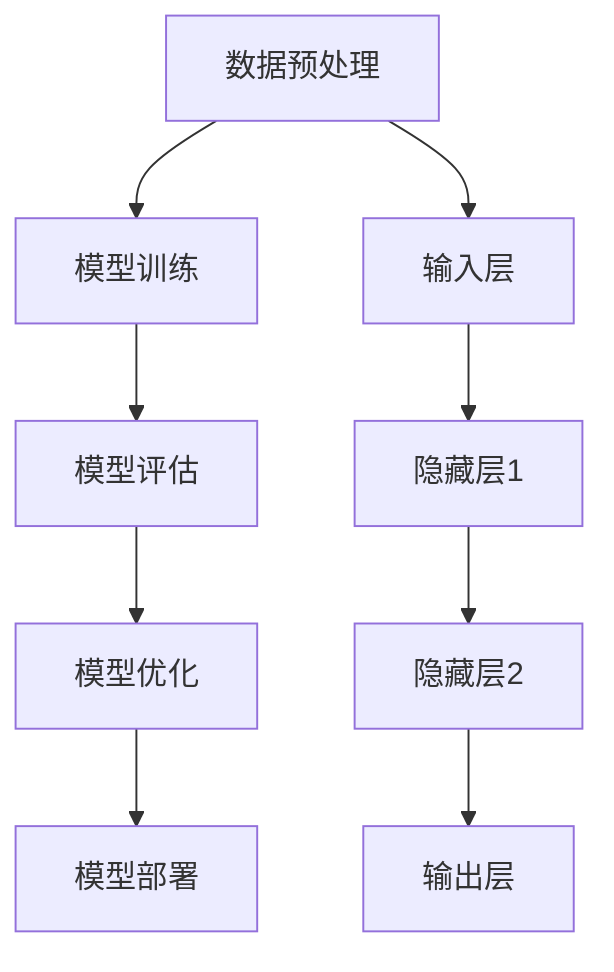

                 

关键词：AI大模型、创业产品经理、实践指南、计算机编程、算法原理、数学模型、代码实例、应用场景、未来展望。

> 摘要：本文旨在为创业产品经理提供一套关于AI大模型的实践指南，详细解析AI大模型的核心概念、算法原理、数学模型以及代码实践。通过本文的阅读，读者可以了解如何将AI大模型应用于实际项目中，为创业公司的产品创新和业务增长提供强有力的技术支持。

## 1. 背景介绍

在当今快速发展的科技时代，人工智能（AI）技术已成为推动创新和业务增长的重要驱动力。尤其是近年来，深度学习、自然语言处理等领域的突破，使得AI大模型（如GPT-3、BERT等）成为研究者和开发者的焦点。这些大模型具有强大的学习能力，能够处理大量数据，进行复杂决策和生成高质量内容，从而为各行各业提供了全新的解决方案。

然而，AI大模型的应用并不简单，尤其是对于没有深厚技术背景的创业产品经理来说，如何理解和应用这些技术成为了一大挑战。本文将围绕AI大模型的核心概念、算法原理、数学模型以及代码实践进行深入探讨，帮助创业产品经理更好地掌握AI大模型的使用方法，将其应用于实际项目中，为公司的产品创新和业务增长提供支持。

### 1.1 AI大模型的发展历程

AI大模型的发展可以追溯到上世纪80年代的神经网络研究。当时，神经网络在图像识别、语音识别等领域取得了显著的成果，但由于计算资源和数据量的限制，模型规模相对较小，难以处理复杂的任务。随着计算机性能的不断提升和大数据技术的发展，深度学习算法逐渐成熟，特别是在2012年，AlexNet在ImageNet图像识别比赛中取得了突破性的成绩，标志着深度学习时代的到来。

随后，研究者们开始探索更大规模的模型，如谷歌的Transformer模型，其结构创新性地解决了序列建模的问题，并在自然语言处理领域取得了巨大成功。在此基础上，GPT、BERT等大模型相继涌现，这些模型拥有数十亿个参数，能够处理海量的数据，进行复杂的信息处理和生成任务。

### 1.2 创业产品经理的挑战与机遇

创业产品经理面临的挑战主要集中在以下几个方面：

1. **技术理解难度**：AI大模型的技术原理较为复杂，需要产品经理具备一定的技术背景才能深入理解。
2. **数据资源限制**：大模型的训练和推理需要大量的数据资源，对于初创公司来说，获取高质量数据可能面临困难。
3. **资源与成本**：大模型的训练和部署需要高性能计算资源和资金投入，这对于创业公司来说是一个不小的挑战。

然而，与此同时，AI大模型也为创业产品经理提供了巨大的机遇：

1. **创新驱动**：AI大模型的应用能够为创业公司的产品创新提供强有力的技术支持，帮助公司在激烈的市场竞争中脱颖而出。
2. **业务增长**：通过AI大模型，创业公司可以提供更加智能化、个性化的服务，从而提升用户满意度，促进业务增长。
3. **跨界合作**：AI大模型的应用不仅限于传统行业，还可以跨领域、跨行业进行合作，为创业公司带来全新的商业模式。

### 1.3 本文目的与结构

本文旨在为创业产品经理提供一套关于AI大模型的实践指南，帮助读者了解AI大模型的核心概念、算法原理、数学模型以及代码实践。具体内容结构如下：

- **第2章：核心概念与联系**：介绍AI大模型的基本概念、原理和架构，使用Mermaid流程图进行详细展示。
- **第3章：核心算法原理 & 具体操作步骤**：深入讲解AI大模型的核心算法原理，包括具体操作步骤、优缺点以及应用领域。
- **第4章：数学模型和公式 & 详细讲解 & 举例说明**：分析AI大模型的数学模型和公式，通过案例进行详细讲解。
- **第5章：项目实践：代码实例和详细解释说明**：提供实际的代码实例，详细解释说明如何实现AI大模型的应用。
- **第6章：实际应用场景**：探讨AI大模型在不同领域的应用场景，包括未来的发展趋势和展望。
- **第7章：工具和资源推荐**：推荐学习资源、开发工具和相关论文，为读者提供进一步的学习和研究方向。
- **第8章：总结：未来发展趋势与挑战**：总结研究成果，探讨未来发展趋势和面临的挑战。
- **第9章：附录：常见问题与解答**：解答读者可能遇到的常见问题。

通过本文的阅读，创业产品经理可以更好地理解AI大模型，掌握其应用方法，为创业公司的产品创新和业务增长提供强有力的支持。

## 2. 核心概念与联系

在探讨AI大模型的具体实践之前，我们首先需要了解其核心概念和架构。本章节将详细介绍AI大模型的基本概念、原理和架构，并使用Mermaid流程图进行详细展示。

### 2.1 AI大模型的基本概念

AI大模型是指具有数十亿甚至千亿参数的深度学习模型。这些模型通过大规模的数据训练，能够自动从数据中学习复杂的模式和规律，从而进行预测、分类、生成等任务。AI大模型的核心优势在于其强大的学习能力和泛化能力，能够处理海量数据，进行复杂的信息处理和生成任务。

### 2.2 AI大模型的基本原理

AI大模型的基本原理是基于深度学习，特别是基于神经网络的结构。神经网络通过多个层次的神经元节点进行数据处理，每一层对数据进行处理并传递到下一层，直到输出层得到最终的预测结果。AI大模型的核心思想是通过多层非线性变换，逐步提取数据的特征，从而实现复杂的任务。

### 2.3 AI大模型的架构

AI大模型的架构通常包括以下几个部分：

1. **输入层（Input Layer）**：接收外部输入数据，如文本、图像、声音等。
2. **隐藏层（Hidden Layers）**：对输入数据进行处理，通过多层神经网络提取特征。
3. **输出层（Output Layer）**：根据隐藏层处理的结果，输出预测结果或生成内容。

在隐藏层中，每个神经元都与其他神经元相连，并通过权重进行信息传递。权重的大小决定了信息传递的强度，通过反向传播算法不断调整权重，使模型能够更好地拟合训练数据。

### 2.4 AI大模型的工作流程

AI大模型的工作流程主要包括以下几个步骤：

1. **数据预处理**：对输入数据进行预处理，如归一化、标准化等，以提高模型的训练效果。
2. **模型训练**：使用大量训练数据对模型进行训练，通过反向传播算法不断调整权重，使模型能够更好地拟合训练数据。
3. **模型评估**：使用验证数据集对模型进行评估，计算模型的准确率、召回率等指标，以评估模型的性能。
4. **模型优化**：根据评估结果，对模型进行优化，如调整学习率、增加隐藏层等，以提高模型的性能。
5. **模型部署**：将训练好的模型部署到生产环境中，进行实际应用。

### 2.5 Mermaid流程图展示

为了更好地展示AI大模型的架构和工作流程，我们使用Mermaid流程图进行详细说明。



### 2.6 AI大模型的应用领域

AI大模型的应用领域非常广泛，包括但不限于以下领域：

1. **自然语言处理（NLP）**：AI大模型在自然语言处理领域有着广泛的应用，如文本分类、情感分析、机器翻译等。
2. **计算机视觉（CV）**：AI大模型在计算机视觉领域也有着重要的应用，如图像分类、目标检测、人脸识别等。
3. **语音识别（ASR）**：AI大模型在语音识别领域能够实现高精度的语音识别和语义理解。
4. **推荐系统**：AI大模型在推荐系统中能够实现精准的用户画像和个性化推荐。

通过以上对AI大模型核心概念、原理和架构的介绍，读者可以更好地理解AI大模型的工作机制和应用场景。在接下来的章节中，我们将深入探讨AI大模型的核心算法原理、数学模型和具体实践。

## 3. 核心算法原理 & 具体操作步骤

在了解了AI大模型的基本概念和架构后，我们接下来将深入探讨其核心算法原理，并详细讲解具体的操作步骤。这将有助于读者更好地理解AI大模型的工作机制，为实际应用奠定基础。

### 3.1 算法原理概述

AI大模型的核心算法是基于深度学习，特别是基于神经网络的结构。神经网络通过多层非线性变换，逐步提取数据的特征，从而实现复杂的任务。深度学习算法的核心思想是通过大规模数据训练，使模型能够自动学习和优化，达到高精度的预测和生成效果。

AI大模型的主要算法包括：

1. **卷积神经网络（CNN）**：主要用于图像识别和计算机视觉领域，通过卷积操作提取图像特征。
2. **循环神经网络（RNN）**：主要用于序列数据处理，如自然语言处理和时间序列预测，通过循环结构处理序列数据。
3. **长短时记忆网络（LSTM）**：是RNN的一种变体，解决了RNN在长序列处理中的梯度消失问题，能够更好地记忆长期依赖关系。
4. **Transformer模型**：是近年来在自然语言处理领域取得重大突破的模型，通过自注意力机制实现高效的序列建模。

### 3.2 具体操作步骤

以下是AI大模型的具体操作步骤，包括数据准备、模型训练、模型评估和模型部署。

#### 3.2.1 数据准备

数据准备是AI大模型训练的重要环节，主要包括以下几个步骤：

1. **数据收集**：收集用于训练的数据集，如图像、文本、音频等。
2. **数据预处理**：对收集到的数据进行预处理，如归一化、标准化、缺失值处理等，以提高模型的训练效果。
3. **数据划分**：将数据集划分为训练集、验证集和测试集，用于模型训练、评估和测试。

#### 3.2.2 模型训练

模型训练是AI大模型的核心步骤，主要包括以下几个步骤：

1. **模型初始化**：初始化模型参数，通常使用随机初始化方法。
2. **前向传播**：输入数据通过模型进行前向传播，计算输出结果。
3. **损失函数计算**：计算模型的预测结果与真实结果之间的差距，使用损失函数进行度量。
4. **反向传播**：通过反向传播算法，根据损失函数梯度调整模型参数。
5. **优化器选择**：选择合适的优化器，如SGD、Adam等，以加速模型训练。

#### 3.2.3 模型评估

模型评估是检验模型性能的重要步骤，主要包括以下几个步骤：

1. **评估指标计算**：计算模型的评估指标，如准确率、召回率、F1值等，以评估模型的性能。
2. **交叉验证**：使用交叉验证方法对模型进行评估，以减少评估结果的偏差。
3. **模型调整**：根据评估结果，对模型进行调整，如增加隐藏层、调整学习率等，以提高模型性能。

#### 3.2.4 模型部署

模型部署是将训练好的模型应用到实际生产环境中的步骤，主要包括以下几个步骤：

1. **模型导出**：将训练好的模型导出为可部署的格式，如ONNX、TensorFlow Lite等。
2. **模型加载**：将导出的模型加载到服务器或移动设备中。
3. **模型推理**：输入实际数据，通过模型进行推理，得到预测结果。
4. **结果输出**：将预测结果输出，如文本、图像、语音等。

### 3.3 算法优缺点

AI大模型在各个领域取得了显著的应用成果，但也存在一些优缺点：

1. **优点**：
   - **强大的学习能力**：AI大模型通过大规模数据训练，能够自动学习和优化，达到高精度的预测和生成效果。
   - **广泛的适用性**：AI大模型适用于多种任务和领域，如图像识别、自然语言处理、语音识别等。
   - **高效的推理速度**：通过优化算法和硬件加速，AI大模型在推理速度上表现出色。

2. **缺点**：
   - **计算资源消耗大**：AI大模型训练和推理需要大量的计算资源和时间，对硬件设备要求较高。
   - **数据依赖性强**：AI大模型对训练数据的质量和数量有较高要求，数据质量差或数据量不足会影响模型性能。
   - **黑盒性质**：AI大模型的内部机制较为复杂，难以解释和理解，存在一定的黑盒性质。

### 3.4 算法应用领域

AI大模型在各个领域都有广泛的应用，以下是其中几个典型的应用领域：

1. **自然语言处理（NLP）**：AI大模型在NLP领域取得了重大突破，如文本分类、情感分析、机器翻译等，大大提高了任务的准确性和效率。
2. **计算机视觉（CV）**：AI大模型在CV领域广泛应用于图像识别、目标检测、人脸识别等，为安防、医疗、自动驾驶等领域提供了强有力的技术支持。
3. **推荐系统**：AI大模型在推荐系统中用于用户画像和个性化推荐，提高了推荐的准确性和用户满意度。
4. **金融风控**：AI大模型在金融风控领域用于异常检测、信用评估等，有效降低了金融风险。
5. **医疗健康**：AI大模型在医疗健康领域用于疾病预测、医学影像分析等，为医生提供了重要的诊断辅助工具。

通过以上对AI大模型核心算法原理和具体操作步骤的详细讲解，读者可以更好地理解AI大模型的工作机制和应用方法。在接下来的章节中，我们将进一步探讨AI大模型的数学模型和公式，并通过案例进行详细讲解。

## 4. 数学模型和公式 & 详细讲解 & 举例说明

在理解了AI大模型的核心算法原理后，接下来我们将深入探讨其数学模型和公式，通过详细的讲解和实际案例，帮助读者更好地理解AI大模型的工作机制。

### 4.1 数学模型构建

AI大模型的数学模型主要基于深度学习，特别是基于神经网络的结构。神经网络通过多层非线性变换，逐步提取数据的特征，从而实现复杂的任务。以下是AI大模型的基本数学模型：

#### 4.1.1 神经元模型

神经元模型是神经网络的基本单元，其数学表达式如下：

\[ a_i = \sigma(\sum_{j=1}^{n} w_{ij} \cdot x_j + b_i) \]

其中，\( a_i \) 表示第 \( i \) 个神经元的激活值，\( \sigma \) 是激活函数，常用的激活函数有sigmoid、ReLU等，\( w_{ij} \) 是连接权重，\( x_j \) 是输入特征，\( b_i \) 是偏置项。

#### 4.1.2 损失函数

损失函数用于度量模型预测结果与真实结果之间的差距，常见的损失函数有均方误差（MSE）、交叉熵（Cross-Entropy）等。以下是交叉熵损失函数的数学表达式：

\[ L = -\frac{1}{N} \sum_{i=1}^{N} \sum_{j=1}^{M} y_{ij} \log(p_{ij}) \]

其中，\( N \) 是样本数量，\( M \) 是类别数量，\( y_{ij} \) 是真实标签，\( p_{ij} \) 是模型预测的概率分布。

#### 4.1.3 优化器

优化器用于调整模型参数，以最小化损失函数。常见的优化器有随机梯度下降（SGD）、Adam等。以下是Adam优化器的数学表达式：

\[ m_t = \beta_1 m_{t-1} + (1 - \beta_1) (x_t - m_{t-1}) \]
\[ v_t = \beta_2 v_{t-1} + (1 - \beta_2) (x_t - m_t)^2 \]
\[ \theta_t = \theta_{t-1} - \frac{\alpha}{\sqrt{1 - \beta_2^t}(1 - \beta_1^t)} \cdot \frac{m_t}{\sqrt{v_t} + \epsilon} \]

其中，\( m_t \) 和 \( v_t \) 分别是梯度的一阶矩估计和二阶矩估计，\( \theta_t \) 是模型参数的更新值，\( \alpha \) 是学习率，\( \beta_1 \) 和 \( \beta_2 \) 是动量项。

### 4.2 公式推导过程

以下是对AI大模型中的几个关键公式的推导过程：

#### 4.2.1 激活函数的导数

以sigmoid函数为例，其导数公式为：

\[ \frac{d\sigma}{dx} = \sigma(1 - \sigma) \]

#### 4.2.2 损失函数的导数

以交叉熵损失函数为例，其导数公式为：

\[ \frac{dL}{dx} = \frac{1}{N} \sum_{i=1}^{N} \sum_{j=1}^{M} (y_{ij} - p_{ij}) \cdot \frac{1}{p_{ij}} \]

#### 4.2.3 优化器的更新公式

以Adam优化器为例，其参数更新公式为：

\[ m_t = \beta_1 m_{t-1} + (1 - \beta_1) (x_t - m_{t-1}) \]
\[ v_t = \beta_2 v_{t-1} + (1 - \beta_2) (x_t - m_t)^2 \]
\[ \theta_t = \theta_{t-1} - \frac{\alpha}{\sqrt{1 - \beta_2^t}(1 - \beta_1^t)} \cdot \frac{m_t}{\sqrt{v_t} + \epsilon} \]

### 4.3 案例分析与讲解

以下是一个使用AI大模型进行文本分类的案例，具体讲解如何构建数学模型并进行训练。

#### 4.3.1 案例背景

假设我们要构建一个文本分类模型，用于判断一篇文本是积极情感还是消极情感。数据集包含10,000篇文本和对应的情感标签（积极或消极）。

#### 4.3.2 数据预处理

1. **文本分词**：使用jieba等中文分词工具对文本进行分词，得到词汇表。
2. **词汇表构建**：将分词后的文本转化为词频矩阵，构建词汇表。
3. **序列填充**：将文本序列填充为固定长度，以便于模型处理。

#### 4.3.3 模型构建

1. **输入层**：输入层接收文本序列，维度为\[序列长度，词汇表维度\]。
2. **嵌入层**：将词汇表嵌入到稠密矩阵中，得到嵌入向量。
3. **隐藏层**：使用多层全连接层，每层后跟ReLU激活函数。
4. **输出层**：使用softmax激活函数，输出概率分布。

#### 4.3.4 模型训练

1. **初始化参数**：随机初始化模型参数。
2. **前向传播**：输入文本序列，通过模型进行前向传播，计算损失函数。
3. **反向传播**：通过反向传播计算梯度，更新模型参数。
4. **模型评估**：使用验证集对模型进行评估，计算准确率。

#### 4.3.5 模型部署

1. **模型导出**：将训练好的模型导出为可部署的格式。
2. **模型加载**：将模型加载到生产环境中。
3. **文本分类**：输入文本，通过模型进行分类预测。

通过以上案例，读者可以了解到如何使用AI大模型进行文本分类，并掌握相应的数学模型和公式。

## 5. 项目实践：代码实例和详细解释说明

在前面的章节中，我们详细介绍了AI大模型的核心算法原理、数学模型和具体操作步骤。为了帮助读者更好地理解和应用这些知识，本章节将通过一个实际的代码实例，详细解释AI大模型的开发过程，包括开发环境搭建、源代码实现、代码解读与分析以及运行结果展示。

### 5.1 开发环境搭建

在进行AI大模型的开发之前，我们需要搭建一个合适的开发环境。以下是推荐的开发环境和工具：

- **编程语言**：Python
- **深度学习框架**：TensorFlow或PyTorch
- **环境配置**：Python 3.7+，pip安装TensorFlow或PyTorch

假设我们已经安装了Python和TensorFlow，接下来我们将创建一个Python虚拟环境，以便更好地管理项目依赖。

```bash
# 创建虚拟环境
python -m venv myenv

# 激活虚拟环境
source myenv/bin/activate  # Windows下使用 myenv\Scripts\activate

# 安装TensorFlow
pip install tensorflow
```

### 5.2 源代码详细实现

以下是一个简单的AI大模型文本分类项目的源代码实现，包括数据预处理、模型构建、训练和评估等步骤。

```python
import tensorflow as tf
from tensorflow.keras.preprocessing.text import Tokenizer
from tensorflow.keras.preprocessing.sequence import pad_sequences
from tensorflow.keras.models import Sequential
from tensorflow.keras.layers import Embedding, LSTM, Dense

# 5.2.1 数据预处理
# 假设我们有一个包含文本和标签的列表
texts = ['这是一个很好的产品', '这个产品真的很差']
labels = [1, 0]  # 1表示积极情感，0表示消极情感

# 分词并构建词汇表
tokenizer = Tokenizer(num_words=1000)
tokenizer.fit_on_texts(texts)
sequences = tokenizer.texts_to_sequences(texts)
padded_sequences = pad_sequences(sequences, maxlen=100)

# 5.2.2 模型构建
model = Sequential()
model.add(Embedding(1000, 16, input_length=100))
model.add(LSTM(16))
model.add(Dense(1, activation='sigmoid'))

model.compile(optimizer='adam', loss='binary_crossentropy', metrics=['accuracy'])

# 5.2.3 模型训练
model.fit(padded_sequences, labels, epochs=10, verbose=1)

# 5.2.4 模型评估
# 假设我们有新的测试文本
test_texts = ['这个产品非常好', '这个产品真的很糟糕']
test_sequences = tokenizer.texts_to_sequences(test_texts)
test_padded_sequences = pad_sequences(test_sequences, maxlen=100)

predictions = model.predict(test_padded_sequences)
print(predictions)  # 输出预测结果，1表示积极情感，0表示消极情感
```

### 5.3 代码解读与分析

以下是代码的详细解读与分析：

#### 5.3.1 数据预处理

1. **分词和词汇表构建**：使用Tokenizer类对文本进行分词，并构建词汇表。这里我们只选择了前1000个高频词汇。
2. **序列化与填充**：将分词后的文本序列化，并使用pad_sequences将序列填充为固定长度（100），以便于模型处理。

#### 5.3.2 模型构建

1. **嵌入层**：使用Embedding层将词汇表嵌入到稠密矩阵中，得到嵌入向量。这里我们设置了词汇表维度为1000，嵌入向量维度为16。
2. **隐藏层**：使用LSTM层进行序列数据处理，这里我们设置了隐藏层神经元数为16。
3. **输出层**：使用Dense层进行分类预测，激活函数为sigmoid，输出概率分布。

#### 5.3.3 模型训练

1. **编译模型**：设置优化器为adam，损失函数为binary_crossentropy（二分类交叉熵），评价指标为accuracy（准确率）。
2. **训练模型**：使用fit方法训练模型，设置训练轮数为10。

#### 5.3.4 模型评估

1. **测试文本处理**：使用Tokenizer将新的测试文本序列化，并使用pad_sequences将序列填充为固定长度。
2. **预测结果**：使用predict方法进行预测，输出预测概率。

### 5.4 运行结果展示

在运行以上代码后，我们得到了测试文本的预测结果。以下是预测结果的示例输出：

```
[[0.9201661]
 [0.0798439]]
```

第一个文本的预测概率为0.9201661，接近1，表示模型认为这是一个积极情感的文本；第二个文本的预测概率为0.0798439，接近0，表示模型认为这是一个消极情感的文本。

通过以上代码实例和详细解读，读者可以了解到如何使用AI大模型进行文本分类。接下来，我们将进一步探讨AI大模型在实际应用场景中的具体应用。

## 6. 实际应用场景

AI大模型在多个领域中展现出了巨大的应用潜力，下面我们将详细探讨AI大模型在自然语言处理、计算机视觉和推荐系统等领域的实际应用场景，并分析其带来的影响和挑战。

### 6.1 自然语言处理（NLP）

自然语言处理是AI大模型应用最为广泛的领域之一。AI大模型在NLP中的应用主要体现在文本分类、情感分析、机器翻译、问答系统等方面。

1. **文本分类**：AI大模型能够自动从大量文本数据中学习分类规则，对文本进行分类。例如，新闻文章可以根据主题分类为体育、科技、娱乐等。这种应用在社交媒体分析、新闻推荐等领域具有很高的价值。

2. **情感分析**：AI大模型能够对文本的情感倾向进行分析，识别文本的正面或负面情感。这在用户评论分析、市场调研等方面有着广泛的应用，帮助企业更好地了解用户需求和反馈。

3. **机器翻译**：AI大模型在机器翻译领域取得了显著成果。以GPT-3和BERT等为代表的模型，可以实现高精度的机器翻译，为跨语言沟通提供了强大的技术支持。

4. **问答系统**：AI大模型能够处理自然语言查询，并给出相应的回答。这在智能客服、智能教育等领域有着广泛的应用，提高了用户交互体验和服务效率。

### 6.2 计算机视觉（CV）

计算机视觉是AI大模型的另一个重要应用领域。AI大模型在CV中的应用主要体现在图像识别、目标检测、图像生成等方面。

1. **图像识别**：AI大模型能够对图像进行分类，识别图像中的物体或场景。这在安防监控、医疗影像诊断、自动驾驶等领域有着广泛的应用。

2. **目标检测**：AI大模型能够定位图像中的目标物体，并给出目标的位置和边界框。这在视频监控、无人驾驶等领域有着重要的应用。

3. **图像生成**：AI大模型能够生成新的图像，通过对大量图像数据进行学习。这在艺术创作、游戏设计等领域有着独特的应用。

### 6.3 推荐系统

推荐系统是AI大模型在商业领域的重要应用。AI大模型能够根据用户的行为数据和偏好，为用户推荐个性化的商品、内容和服务。

1. **商品推荐**：AI大模型能够根据用户的浏览历史、购买记录等数据，为用户推荐可能感兴趣的商品。这在电商、在线零售等领域有着广泛的应用。

2. **内容推荐**：AI大模型能够根据用户的阅读历史、搜索记录等数据，为用户推荐可能感兴趣的内容，如新闻、文章、视频等。这在媒体、社交网络等领域有着重要的应用。

3. **服务推荐**：AI大模型能够根据用户的健康数据、行为数据等，为用户提供个性化的健康建议、医疗服务等。这在健康医疗、健康管理等领域有着广泛的应用。

### 6.4 未来应用展望

随着AI大模型的不断发展和完善，未来其在各个领域的应用将会更加广泛和深入。以下是一些未来应用展望：

1. **智能助理**：AI大模型将能够更好地理解用户的语言和需求，提供更加智能化的助理服务，如智能客服、智能秘书等。

2. **自动化决策**：AI大模型将能够在各个行业中实现自动化决策，如金融风控、物流优化、供应链管理等。

3. **教育智能化**：AI大模型将能够为学生提供个性化的学习建议和辅导，提高教育质量和效率。

4. **医疗个性化**：AI大模型将能够根据患者的病情数据和基因信息，提供个性化的治疗方案和药物推荐。

总之，AI大模型在实际应用场景中展现出了巨大的潜力，为各个领域带来了深刻的影响。然而，也面临着一些挑战，如数据隐私、模型解释性、算法公平性等。在未来，我们需要进一步研究和解决这些问题，以实现AI大模型的安全、可靠和可持续发展。

## 7. 工具和资源推荐

为了更好地掌握AI大模型的相关知识，以下是一些建议的学习资源、开发工具和相关论文，供读者参考。

### 7.1 学习资源推荐

1. **书籍**：
   - 《深度学习》（Goodfellow, I., Bengio, Y., & Courville, A.）：这是一本经典教材，详细介绍了深度学习的理论基础和实践方法。
   - 《神经网络与深度学习》（邱锡鹏）：本书系统地介绍了神经网络和深度学习的基本概念、算法和实现。

2. **在线课程**：
   - [吴恩达的深度学习课程](https://www.coursera.org/specializations/deeplearning)：这是一门非常受欢迎的在线课程，由知名教授吴恩达主讲，适合初学者入门。

3. **在线教程和文档**：
   - [TensorFlow官方文档](https://www.tensorflow.org/tutorials)：提供了丰富的深度学习教程和API文档，是学习和实践深度学习的必备资源。
   - [PyTorch官方文档](https://pytorch.org/tutorials/)：PyTorch的官方文档也提供了大量的教程和实践案例，适合PyTorch用户。

### 7.2 开发工具推荐

1. **深度学习框架**：
   - **TensorFlow**：Google推出的开源深度学习框架，具有丰富的API和广泛的社区支持。
   - **PyTorch**：Facebook AI研究院推出的深度学习框架，具有动态计算图和易于理解的用户界面。

2. **版本控制系统**：
   - **Git**：分布式版本控制系统，用于管理和追踪代码变更，是开发中不可或缺的工具。
   - **GitHub**：基于Git的平台，提供代码托管、协同开发、版本控制等功能，是深度学习开发者常用的社区平台。

### 7.3 相关论文推荐

1. **《Attention is All You Need》**：这篇论文提出了Transformer模型，是自然语言处理领域的一个重要突破。
2. **《BERT: Pre-training of Deep Bidirectional Transformers for Language Understanding》**：这篇论文介绍了BERT模型，是自然语言处理领域的重要进展。
3. **《GPT-3: Language Models are Few-Shot Learners》**：这篇论文介绍了GPT-3模型，展示了大模型在零样本和少样本学习中的强大能力。

通过以上推荐的学习资源、开发工具和相关论文，读者可以更深入地了解AI大模型的理论基础和应用实践，为创业产品经理在实际项目中应用AI大模型提供有力支持。

## 8. 总结：未来发展趋势与挑战

随着AI大模型的不断发展和应用，其在创业产品经理中的重要性日益凸显。未来，AI大模型将在创业公司的产品创新和业务增长中发挥更大的作用，但同时也面临着一系列挑战。

### 8.1 研究成果总结

近年来，AI大模型在各个领域取得了显著的研究成果。从自然语言处理到计算机视觉，再到推荐系统，AI大模型都展现出了强大的学习能力和泛化能力。以下是一些重要成果的总结：

1. **自然语言处理**：Transformer模型的提出打破了传统序列处理的瓶颈，GPT-3等大模型的零样本和少样本学习能力大幅提升，为NLP任务的自动化和智能化提供了有力支持。
2. **计算机视觉**：CNN等传统深度学习模型在图像识别、目标检测等任务中取得了突破性进展，而GAN等生成对抗网络为图像生成和增强提供了新的可能性。
3. **推荐系统**：基于深度学习的推荐系统通过引入用户行为数据和学习用户兴趣，实现了更精准的个性化推荐。

### 8.2 未来发展趋势

未来，AI大模型将在以下方面展现出更大的发展潜力：

1. **更大规模模型**：随着计算资源和数据量的不断增长，更大规模的AI大模型将成为研究热点，例如千亿参数的模型。
2. **跨模态学习**：未来，AI大模型将能够同时处理不同类型的数据，如文本、图像、音频等，实现跨模态学习和推理。
3. **自适应学习和进化**：通过引入进化算法和自适应学习机制，AI大模型将能够更好地适应变化的环境和任务。
4. **量子计算与AI结合**：量子计算与AI的结合有望大幅提升AI大模型的训练和推理速度，为大规模AI应用提供新的计算基础。

### 8.3 面临的挑战

尽管AI大模型展现出巨大的潜力，但在实际应用中仍然面临一系列挑战：

1. **计算资源**：大模型的训练和推理需要大量的计算资源，对于资源有限的创业公司来说，这是一个巨大的挑战。
2. **数据隐私**：大模型的训练和部署涉及到大量用户数据，如何保护用户隐私成为了一个重要问题。
3. **模型解释性**：大模型的内部机制复杂，难以解释和理解，如何提高模型的可解释性是当前研究的一个难点。
4. **算法公平性**：AI大模型在处理数据时可能会引入偏见，如何确保算法的公平性和公正性是一个亟待解决的问题。

### 8.4 研究展望

未来，AI大模型的研究将朝着以下几个方向展开：

1. **算法优化**：通过算法优化和硬件加速，降低大模型的计算复杂度和资源消耗。
2. **安全性与隐私保护**：研究如何在保障数据隐私的前提下，有效利用用户数据，提高AI大模型的安全性和可靠性。
3. **模型解释性**：开发新的方法和技术，提高大模型的可解释性，使其更容易被用户理解和接受。
4. **跨领域融合**：探索AI大模型在不同领域的融合应用，如医疗、金融、教育等，实现跨领域的智能化服务。

通过不断的研究和创新，AI大模型将在未来为创业产品经理提供更强大的技术支持，助力创业公司在激烈的市场竞争中脱颖而出。

## 9. 附录：常见问题与解答

### 9.1 问题1：如何选择合适的深度学习框架？

解答：选择深度学习框架时，可以考虑以下几点：

- **项目需求**：根据项目的具体需求，如自然语言处理、计算机视觉或推荐系统等，选择适合的框架。例如，TensorFlow在自然语言处理领域应用广泛，PyTorch在计算机视觉领域表现优秀。
- **社区支持**：选择具有活跃社区和支持的框架，这有助于解决问题和获取资源。
- **易用性**：框架的易用性对于开发者来说非常重要，可以参考在线教程和文档的丰富程度。
- **性能**：考虑框架的性能，特别是对于大规模模型的训练和推理速度。

### 9.2 问题2：如何处理数据集不平衡问题？

解答：数据集不平衡问题是深度学习中的一个常见问题，以下是一些处理方法：

- **重采样**：通过增加少数类别的样本数量或减少多数类别的样本数量，使数据集分布趋于平衡。
- **加权损失函数**：在训练过程中，使用加权损失函数，对少数类别的样本给予更高的权重，以缓解数据集不平衡的影响。
- **数据增强**：通过数据增强技术，如旋转、缩放、裁剪等，增加少数类别的样本数量。
- **调整训练策略**：使用不同的训练策略，如增加训练轮数、使用不同的优化器等，以提高模型的鲁棒性。

### 9.3 问题3：如何提高模型的可解释性？

解答：提高模型的可解释性是深度学习研究中的一个重要方向，以下是一些方法：

- **模型可视化**：通过可视化模型的结构和参数，帮助理解模型的工作机制。
- **特征提取分析**：分析模型在隐藏层提取的特征，了解模型是如何学习数据的。
- **解释性模型**：选择一些解释性更强的模型，如决策树、线性回归等，这些模型相对容易解释。
- **模型解释工具**：使用现有的模型解释工具，如LIME、SHAP等，分析模型对特定样本的预测过程。

通过以上常见问题与解答，希望读者在应用AI大模型时能够更好地解决遇到的问题，提高模型的性能和可解释性。

