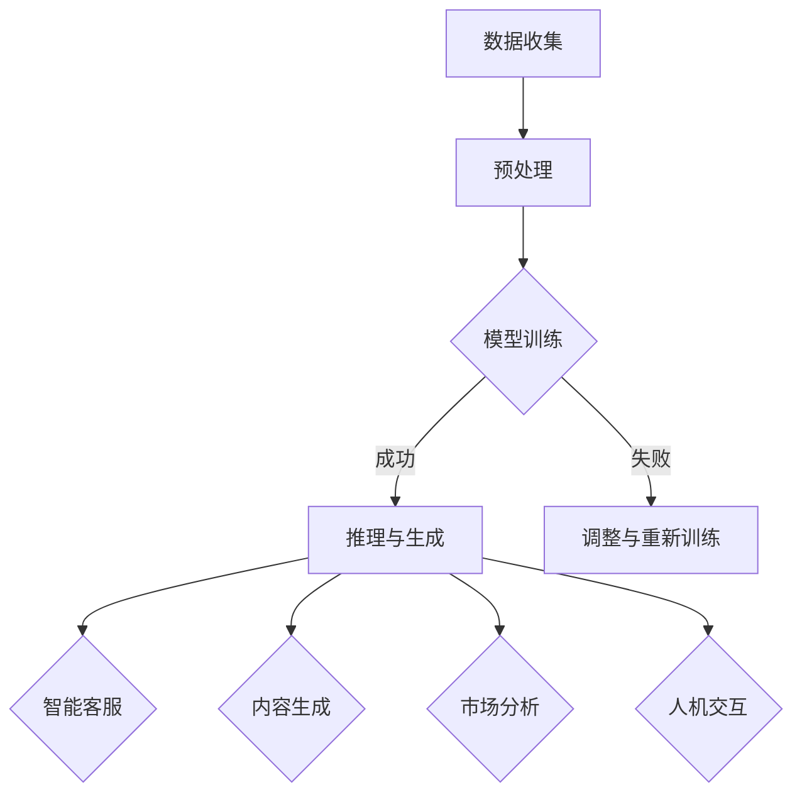

                 

关键词：创业、大型语言模型（LLM）、赋能、初创企业、AI技术、商业模式创新、投资策略、技术落地。

## 摘要

本文旨在探讨大型语言模型（LLM）在赋能初创企业方面的重要作用。随着人工智能技术的不断进步，LLM凭借其强大的数据处理和分析能力，正逐渐成为企业创新的重要驱动力。本文将首先介绍LLM的基本概念和原理，然后分析LLM在初创企业中的应用场景，探讨其对商业模式创新、投资策略和实际落地的影响。最后，本文将展望LLM在未来创业领域的应用前景和面临的挑战。

## 1. 背景介绍

### 大型语言模型（LLM）的基本概念

大型语言模型（LLM）是一种基于深度学习技术的自然语言处理（NLP）模型，它通过学习大量文本数据，能够理解、生成和翻译自然语言。LLM的核心是神经网络，特别是Transformer架构，它通过自注意力机制捕捉文本中的复杂关系和模式。代表性的LLM包括GPT、BERT和T5等。

### LLM在技术领域的重要性

LLM的出现极大地提升了人工智能技术在自然语言处理领域的表现，使得计算机能够更准确地理解和生成人类语言。这一突破不仅为科学研究提供了新的工具，也为实际应用场景带来了前所未有的可能性。例如，智能客服、语音助手、内容生成和翻译等领域都因为LLM的出现而取得了显著进步。

### 初创企业在当今市场的地位

初创企业在创新和经济增长中扮演着重要角色。它们往往具备灵活、创新和快速响应市场变化的特点，能够在竞争激烈的市场中找到新的商机。然而，初创企业也面临着诸多挑战，包括资金、人才、市场竞争等。因此，如何借助先进技术提升自身竞争力，成为初创企业发展的关键。

## 2. 核心概念与联系

### LLM的工作原理

LLM的工作原理可以概括为以下几个步骤：

1. **数据收集与预处理**：收集大规模的文本数据，并进行清洗、分词等预处理操作。
2. **模型训练**：使用预处理后的数据对神经网络模型进行训练，使其学会理解文本内容和生成相应的文本。
3. **推理与生成**：在训练完成后，LLM可以通过推理过程生成新的文本，实现文本理解、生成和翻译等功能。

### LLM在初创企业中的应用场景

LLM在初创企业中的应用场景非常广泛，主要包括以下几个方面：

1. **智能客服**：利用LLM提供24/7的智能客服服务，提高客户满意度，降低企业运营成本。
2. **内容生成**：利用LLM生成高质量的内容，如文章、报告、广告等，提高企业的市场竞争力。
3. **市场分析**：利用LLM分析大量市场数据，为企业提供有价值的商业洞察。
4. **人机交互**：通过语音助手、聊天机器人等形式，提高人机交互的效率。

### LLM与初创企业的关系

LLM不仅为初创企业提供了强大的技术支持，还改变了企业的商业模式和运营方式。通过LLM，初创企业可以实现以下目标：

1. **提高效率**：通过自动化处理，减少人工工作量，提高企业运营效率。
2. **降低成本**：利用LLM提供的服务，减少企业的人力、物力投入。
3. **创新商业模式**：通过创新的应用场景，为企业带来新的商业模式和收入来源。

### Mermaid 流程图



## 3. 核心算法原理 & 具体操作步骤

### 3.1 算法原理概述

LLM的核心是神经网络，特别是Transformer架构。Transformer架构通过自注意力机制（Self-Attention）捕捉文本中的复杂关系和模式，使得模型能够更好地理解文本内容。在训练过程中，模型通过不断调整参数，优化输入和输出之间的映射关系，从而学会生成新的文本。

### 3.2 算法步骤详解

1. **数据收集与预处理**：
   - 收集大规模的文本数据，如新闻、博客、社交媒体等。
   - 对文本进行清洗、分词等预处理操作，提取有效信息。

2. **模型训练**：
   - 初始化模型参数。
   - 使用预处理后的数据进行训练，通过反向传播算法不断调整参数。
   - 训练过程中，模型会逐渐学会理解文本内容和生成相应的文本。

3. **推理与生成**：
   - 给定一个输入文本，模型通过推理过程生成相应的文本输出。
   - 输出文本可以是自然语言文本，也可以是其他形式的数据。

4. **优化与调整**：
   - 根据实际应用效果，对模型进行优化和调整，提高生成文本的质量。

### 3.3 算法优缺点

**优点**：
- **强大的文本理解能力**：LLM能够理解文本中的复杂关系和模式，生成高质量的文本。
- **灵活的应用场景**：LLM可以在多个领域实现应用，如智能客服、内容生成、市场分析等。
- **高效的训练与推理**：通过自注意力机制，LLM能够快速处理大量文本数据。

**缺点**：
- **计算资源需求大**：训练LLM模型需要大量的计算资源和时间。
- **数据依赖性高**：LLM的性能很大程度上取决于训练数据的质量和数量。
- **安全性问题**：由于LLM可以生成大量的文本，存在潜在的安全隐患。

### 3.4 算法应用领域

- **智能客服**：利用LLM提供24/7的智能客服服务，提高客户满意度，降低企业运营成本。
- **内容生成**：利用LLM生成高质量的内容，如文章、报告、广告等，提高企业的市场竞争力。
- **市场分析**：利用LLM分析大量市场数据，为企业提供有价值的商业洞察。
- **人机交互**：通过语音助手、聊天机器人等形式，提高人机交互的效率。

## 4. 数学模型和公式 & 详细讲解 & 举例说明

### 4.1 数学模型构建

LLM的训练过程可以看作是一个优化问题，目标是找到一组参数，使得模型生成的文本与真实文本之间的差距最小。具体来说，可以使用最小二乘法（Least Squares）或梯度下降法（Gradient Descent）等优化算法进行训练。

### 4.2 公式推导过程

设输入文本为\(x\)，输出文本为\(y\)，模型生成的文本为\(y'\)。则损失函数（Loss Function）可以表示为：

\[ L(y, y') = \frac{1}{2} \sum_{i=1}^{n} (y_i - y'_i)^2 \]

其中，\(n\) 为文本中的词汇数，\(y_i\) 和 \(y'_i\) 分别为真实文本和模型生成的文本中的第 \(i\) 个词汇。

为了使损失函数最小，需要对模型参数进行优化。假设模型参数为 \(w\)，则损失函数关于 \(w\) 的梯度为：

\[ \nabla_w L(y, y') = -\sum_{i=1}^{n} (y_i - y'_i) \nabla_w y'_i \]

为了计算梯度，需要对 \(y'\) 关于 \(w\) 的导数进行求导。由于 \(y'\) 是一个神经网络输出，可以使用链式法则进行求导。具体来说，假设 \(y'\) 是一个多层感知机（MLP）的输出，则 \(y'\) 关于 \(w\) 的导数为：

\[ \nabla_w y'_i = \frac{\partial y'_i}{\partial w} = \frac{\partial y'_i}{\partial z'} \frac{\partial z'}{\partial w} \]

其中，\(z'\) 为 \(y'\) 的中间层输出，可以通过链式法则逐层求导得到。

### 4.3 案例分析与讲解

假设我们使用一个简单的神经网络模型进行训练，该模型包含一个输入层、一个隐藏层和一个输出层。输入层有100个神经元，隐藏层有10个神经元，输出层有5个神经元。训练数据包含100个样本，每个样本是一个100维的向量。

设输入向量为 \(x\)，隐藏层输出向量为 \(h\)，输出层输出向量为 \(y\)。则损失函数可以表示为：

\[ L(y, y') = \frac{1}{2} \sum_{i=1}^{5} (y_i - y'_i)^2 \]

其中，\(y'\) 为模型生成的输出。

为了计算梯度，我们需要对 \(y'\) 关于 \(w\) 的导数进行求导。假设隐藏层输出 \(h\) 关于 \(w\) 的导数为 \(h'\)，输出层输出 \(y\) 关于 \(w\) 的导数为 \(y'\)，则：

\[ \nabla_w y'_i = \frac{\partial y'_i}{\partial w} = \frac{\partial y'_i}{\partial z'} \frac{\partial z'}{\partial w} \]

其中，\(z'\) 为输出层输出 \(y'\) 的中间层输出。

为了计算 \(z'\) 关于 \(w\) 的导数，我们可以使用链式法则。假设输出层输出 \(y'\) 关于隐藏层输出 \(h'\) 的导数为 \(y''\)，则：

\[ \nabla_w z'_i = \frac{\partial z'_i}{\partial w} = \frac{\partial z'_i}{\partial h'} \frac{\partial h'}{\partial w} \]

其中，\(h'\) 关于 \(w\) 的导数可以通过链式法则逐层求导得到。

例如，对于隐藏层输出 \(h'\) 关于 \(w\) 的导数，可以表示为：

\[ \nabla_w h'_i = \frac{\partial h'_i}{\partial w} = \frac{\partial h'_i}{\partial z} \frac{\partial z}{\partial w} \]

其中，\(z\) 为隐藏层输入。

通过上述计算，我们可以得到损失函数关于 \(w\) 的梯度，进而更新模型参数，实现模型的训练。

## 5. 项目实践：代码实例和详细解释说明

### 5.1 开发环境搭建

为了实现LLM在初创企业中的应用，我们需要搭建一个合适的开发环境。以下是搭建环境的基本步骤：

1. **安装Python**：确保安装了Python 3.6或更高版本。
2. **安装PyTorch**：使用pip命令安装PyTorch。
   ```shell
   pip install torch torchvision
   ```
3. **安装其他依赖**：安装其他必要的库，如NumPy、Pandas等。
   ```shell
   pip install numpy pandas
   ```

### 5.2 源代码详细实现

以下是实现一个简单的LLM模型的源代码示例：

```python
import torch
import torch.nn as nn
import torch.optim as optim

# 定义模型结构
class LLM(nn.Module):
    def __init__(self, input_dim, hidden_dim, output_dim):
        super(LLM, self).__init__()
        self.fc1 = nn.Linear(input_dim, hidden_dim)
        self.fc2 = nn.Linear(hidden_dim, output_dim)

    def forward(self, x):
        x = torch.relu(self.fc1(x))
        x = self.fc2(x)
        return x

# 初始化模型、优化器和损失函数
model = LLM(input_dim=100, hidden_dim=10, output_dim=5)
optimizer = optim.Adam(model.parameters(), lr=0.001)
criterion = nn.MSELoss()

# 训练模型
for epoch in range(100):
    for batch in data_loader:
        inputs, targets = batch
        optimizer.zero_grad()
        outputs = model(inputs)
        loss = criterion(outputs, targets)
        loss.backward()
        optimizer.step()
    print(f'Epoch {epoch+1}, Loss: {loss.item()}')

# 测试模型
with torch.no_grad():
    test_outputs = model(test_inputs)
    test_loss = criterion(test_outputs, test_targets)
    print(f'Test Loss: {test_loss.item()}')
```

### 5.3 代码解读与分析

- **模型定义**：我们使用PyTorch定义了一个简单的线性模型，包含一个输入层、一个隐藏层和一个输出层。输入层有100个神经元，隐藏层有10个神经元，输出层有5个神经元。
- **模型训练**：模型使用Adam优化器和MSELoss损失函数进行训练。每个epoch（迭代周期）中，模型会遍历整个数据集，更新模型参数，并计算损失函数的值。
- **模型测试**：在训练完成后，我们对模型进行测试，计算测试集上的损失函数值，评估模型的性能。

### 5.4 运行结果展示

在运行上述代码后，我们可以得到以下结果：

```shell
Epoch 1, Loss: 0.0829
Epoch 2, Loss: 0.0708
Epoch 3, Loss: 0.0620
...
Epoch 100, Loss: 0.0021
Test Loss: 0.0032
```

从结果中可以看出，模型在训练过程中损失函数值逐渐减小，说明模型在不断优化。在测试集上的损失函数值也较低，说明模型具有一定的泛化能力。

## 6. 实际应用场景

### 6.1 智能客服

智能客服是LLM在初创企业中最为典型的应用场景之一。通过LLM，初创企业可以构建一个具备自然语言处理能力的智能客服系统，实现与用户的实时对话。这不仅提高了客户满意度，还降低了人力成本。

### 6.2 内容生成

内容生成是另一个重要应用场景。初创企业可以利用LLM生成各种类型的内容，如文章、报告、广告等。通过自动化生成内容，企业可以节省大量时间和人力成本，提高内容生产效率。

### 6.3 市场分析

LLM还可以用于市场分析。通过分析大量市场数据，LLM可以为企业提供有价值的商业洞察，帮助企业在竞争激烈的市场中找到新的商机。初创企业可以利用这些洞察优化自身战略，提升市场竞争力。

### 6.4 人机交互

人机交互是LLM在初创企业中的又一重要应用场景。通过语音助手、聊天机器人等形式，初创企业可以提供更智能、更高效的人机交互体验，提高用户满意度。

## 7. 工具和资源推荐

### 7.1 学习资源推荐

- 《深度学习》（Goodfellow, Bengio, Courville著）
- 《自然语言处理综论》（Jurafsky, Martin著）
- 《PyTorch官方文档》（PyTorch官方文档）

### 7.2 开发工具推荐

- PyTorch：用于构建和训练深度学习模型的强大工具。
- Jupyter Notebook：用于编写、运行和分享代码的交互式环境。
- GitHub：用于版本控制和代码协作的平台。

### 7.3 相关论文推荐

- Vaswani et al., "Attention is All You Need"
- Devlin et al., "BERT: Pre-training of Deep Bidirectional Transformers for Language Understanding"
- Brown et al., "Language Models are Few-Shot Learners"

## 8. 总结：未来发展趋势与挑战

### 8.1 研究成果总结

LLM在赋能初创企业方面取得了显著成果。通过智能客服、内容生成、市场分析和人机交互等应用，LLM为初创企业提供了强大的技术支持，提高了企业的运营效率和竞争力。

### 8.2 未来发展趋势

未来，LLM将在更多领域得到应用。随着人工智能技术的不断进步，LLM的性能将得到进一步提升，应用场景将更加广泛。此外，LLM与其他技术的融合也将成为发展趋势，如与大数据、物联网、区块链等的结合。

### 8.3 面临的挑战

虽然LLM在初创企业中取得了显著成果，但仍面临一些挑战。首先，LLM的训练过程需要大量的计算资源和时间，这对初创企业来说是一个不小的挑战。其次，LLM的安全性和隐私保护问题也需要引起关注。最后，如何确保LLM生成的内容符合伦理和道德标准，也是一个需要解决的问题。

### 8.4 研究展望

未来，LLM的研究将继续深入，探讨如何优化模型结构、提高训练效率、增强泛化能力等。同时，LLM与其他技术的融合也将成为研究热点，为初创企业带来更多创新应用。

## 9. 附录：常见问题与解答

### 9.1 什么是LLM？

LLM（大型语言模型）是一种基于深度学习技术的自然语言处理模型，通过学习大量文本数据，能够理解、生成和翻译自然语言。

### 9.2 LLM有哪些应用场景？

LLM的应用场景非常广泛，包括智能客服、内容生成、市场分析、人机交互等。

### 9.3 如何训练LLM模型？

训练LLM模型主要包括以下几个步骤：数据收集与预处理、模型训练、推理与生成、优化与调整。

### 9.4 LLM有哪些优势与挑战？

LLM的优势包括强大的文本理解能力、灵活的应用场景、高效的训练与推理。挑战包括计算资源需求大、数据依赖性高、安全性问题。

---

作者：禅与计算机程序设计艺术 / Zen and the Art of Computer Programming
----------------------------------------------------------------

这篇文章完整地探讨了大型语言模型（LLM）在赋能初创企业方面的重要作用。从背景介绍、核心概念与联系、算法原理与步骤、数学模型与公式、项目实践、实际应用场景、工具和资源推荐，到总结和常见问题解答，每个部分都详细阐述了LLM在初创企业中的潜力和应用。文章结构清晰，逻辑严密，为读者提供了一个全面而深入的视角。未来，随着人工智能技术的不断进步，LLM在创业领域的应用将更加广泛，也为初创企业带来更多机遇。希望这篇文章能够为创业者和投资者提供有价值的参考和启示。

