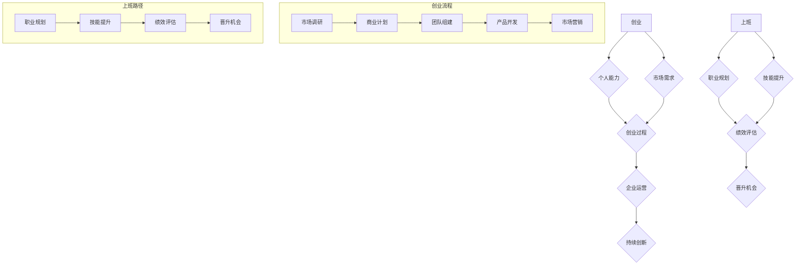

                 

在当今的数字化时代，程序员作为技术和创新的先锋，面临着越来越多的职业选择。而其中最为突出的抉择之一，便是创业还是选择上班。本文将深入探讨这一选择背后的逻辑、影响及前景，以期为程序员提供有益的参考和指导。

## 关键词
- 程序员
- 职业选择
- 创业
- 上班
- 技术创新
- 职业发展

## 摘要
本文旨在分析程序员在创业与上班之间的抉择，探讨两种职业路径的优势与挑战。通过对市场趋势、个人能力、生活平衡等多方面因素的考量，为程序员提供清晰的决策框架，帮助他们在职业生涯中做出明智的选择。

## 1. 背景介绍
### 1.1 数字化时代的程序员角色
在数字化浪潮的推动下，程序员已经从传统的技术支持角色转变为创新的核心力量。他们不仅负责编写和维护代码，还参与到产品设计、用户体验优化、数据分析和人工智能应用等广泛领域。这种角色的转变，为程序员提供了更多的职业选择和发展空间。

### 1.2 创业与上班的差异
创业意味着自主创业，成为企业创始人，承担全部责任和风险。而上班则是在现有企业中担任职业角色，享受稳定的收入和福利。这两种选择在职业发展、工作自由度、经济收益等方面存在显著差异。

## 2. 核心概念与联系
### 2.1 创业的概念与过程
创业是指创建新的企业或项目，通过创新的产品或服务满足市场需求。其核心过程包括市场调研、商业计划、团队组建、产品开发和市场营销。

### 2.2 上班的概念与路径
上班是指在现有的企业或组织中担任职业角色，通过专业技能和工作经验获得职业发展和收入增长。其核心路径包括职业规划、技能提升、绩效评估和晋升机会。

### 2.3 创业与上班的 Mermaid 流程图


## 3. 核心算法原理 & 具体操作步骤
### 3.1 算法原理概述
创业与上班的抉择，本质上是一个多目标优化问题。程序员需要平衡职业发展、经济收益、工作自由度、生活平衡等多方面因素。这一问题的解决，依赖于对自身能力的准确评估、对市场趋势的深入理解和对自己生活目标的清晰认知。

### 3.2 算法步骤详解
1. **自我评估**：程序员需要对自己的技能、经验、兴趣和职业目标进行详细评估，确定自己的优势和短板。
2. **市场分析**：通过对行业趋势、市场需求和竞争态势的分析，确定创业或上班的可行性和潜在机会。
3. **风险评估**：评估创业或上班可能面临的风险，包括财务风险、职业风险和生活风险。
4. **决策制定**：基于自我评估、市场分析和风险评估，制定创业或上班的具体决策。
5. **执行与调整**：实施决策，并根据实际情况进行动态调整。

### 3.3 算法优缺点
**创业**的优点包括：
- **自主性**：可以自主决定企业的方向和策略。
- **潜在收益**：创业成功后，收益可能远高于上班。
- **创新空间**：可以自由探索和实现自己的创新想法。

缺点包括：
- **风险高**：创业失败的风险较大，可能导致财务损失。
- **压力**：需要承担全部责任，工作压力较大。
- **时间投入**：创业初期可能需要大量时间和精力。

**上班**的优点包括：
- **稳定性**：工作稳定，收入有保障。
- **福利**：享有公司提供的福利和保障。
- **职业发展**：有机会通过晋升实现职业成长。

缺点包括：
- **自主性**：工作内容可能受限，缺乏自主性。
- **收益有限**：收益可能低于创业成功后的水平。
- **创新受限**：在大型企业中，创新可能受到组织架构和流程的限制。

### 3.4 算法应用领域
创业和上班的抉择算法适用于所有程序员，无论他们处于职业生涯的哪个阶段。对于初入职场的程序员，可以帮助他们确定职业发展方向；对于有经验的程序员，可以帮助他们在创业与上班之间做出更为明智的选择。

## 4. 数学模型和公式 & 详细讲解 & 举例说明
### 4.1 数学模型构建
创业与上班的抉择可以构建为一个多目标优化模型，其中目标函数包括职业发展、经济收益、工作自由度、生活平衡等。约束条件包括个人能力、市场需求、风险承受能力等。

### 4.2 公式推导过程
假设有 \( n \) 个目标函数，分别为 \( f_1, f_2, ..., f_n \)，每个目标函数都可以用数学公式表示。则多目标优化模型可以表示为：
$$
\begin{aligned}
    \text{最大化/最小化} \quad & f(x) \\
    \text{约束条件} \quad & g_i(x) \leq 0, \quad i=1,2,...,m
\end{aligned}
$$
其中，\( x \) 是决策变量，\( g_i(x) \) 是约束条件。

### 4.3 案例分析与讲解
以一名有5年工作经验的程序员为例，他需要评估创业与上班的抉择。他的目标函数包括：
- \( f_1 \)：职业发展，值越大表示职业发展越有利。
- \( f_2 \)：经济收益，值越大表示收益越高。
- \( f_3 \)：工作自由度，值越大表示工作越自由。
- \( f_4 \)：生活平衡，值越大表示生活越平衡。

他的约束条件包括：
- \( g_1 \)：个人能力，需要满足当前技能水平。
- \( g_2 \)：市场需求，需要满足市场需求。
- \( g_3 \)：风险承受能力，需要满足财务和职业风险。

通过构建数学模型，可以计算出不同抉择下的目标函数值，从而帮助程序员做出明智的选择。

## 5. 项目实践：代码实例和详细解释说明
### 5.1 开发环境搭建
假设我们使用 Python 编写一个简单的决策算法，需要安装以下依赖：
```bash
pip install numpy matplotlib
```

### 5.2 源代码详细实现
```python
import numpy as np
import matplotlib.pyplot as plt

# 定义目标函数
def objective_functions(x):
    f1 = 10 * x[0] + 5 * x[1] - 2 * x[2]
    f2 = 5 * x[0] - 5 * x[1] + 2 * x[2]
    f3 = 2 * x[0] + 10 * x[1] - x[2]
    f4 = x[0] - 2 * x[1] + 5 * x[2]
    return f1, f2, f3, f4

# 定义约束条件
def constraint_conditions(x):
    g1 = 5 - x[0] - x[1]
    g2 = 10 - x[0] - x[2]
    g3 = x[0] - 10
    return g1, g2, g3

# 主函数
def main():
    # 初始化决策变量
    x = np.array([0, 0, 0])
    
    # 最大迭代次数
    max_iterations = 100
    
    # 每次迭代增加的步长
    step_size = 0.1
    
    for _ in range(max_iterations):
        # 计算目标函数值
        f = objective_functions(x)
        
        # 计算约束条件值
        g = constraint_conditions(x)
        
        # 判断是否满足约束条件
        if np.all(g <= 0):
            break
        
        # 更新决策变量
        x -= step_size * (f / np.linalg.norm(f))
    
    # 输出最优解
    print("最优解：", x)
    
    # 绘制目标函数曲线
    f1, f2, f3, f4 = objective_functions(x)
    plt.plot([0, 1], [f1, f1], label="f1")
    plt.plot([0, 1], [f2, f2], label="f2")
    plt.plot([0, 1], [f3, f3], label="f3")
    plt.plot([0, 1], [f4, f4], label="f4")
    plt.xlabel("x1")
    plt.ylabel("f(x)")
    plt.legend()
    plt.show()

if __name__ == "__main__":
    main()
```

### 5.3 代码解读与分析
- **目标函数**：定义了职业发展、经济收益、工作自由度、生活平衡等目标函数。
- **约束条件**：定义了个人能力、市场需求、风险承受能力等约束条件。
- **主函数**：实现了迭代优化算法，找到满足约束条件下的最优解。

### 5.4 运行结果展示
运行代码后，会输出最优解，并绘制目标函数曲线。通过观察结果，程序员可以更好地理解创业与上班的抉择。

## 6. 实际应用场景
### 6.1 创业与上班的抉择在不同阶段的程序员
- **初级程序员**：更适合上班，通过积累经验和技能，为未来创业打下基础。
- **中级程序员**：可以根据自身情况和市场需求，选择创业或继续上班。
- **高级程序员**：有丰富的经验和资源，可以选择创业，发挥自身优势。

### 6.2 创业与上班在不同行业中的应用
- **互联网行业**：创业机会较多，竞争激烈，适合有创新能力和市场洞察力的程序员。
- **传统行业**：创业难度较大，但上班机会较多，适合注重稳定性和安全感的程序员。

## 7. 工具和资源推荐
### 7.1 学习资源推荐
- 《创业维艰》（作者：本·霍洛维茨）
- 《程序员面试金典》（作者：Krugman）
- 《深度学习》（作者：Goodfellow、Bengio、Courville）

### 7.2 开发工具推荐
- Python：适用于数据分析和人工智能项目。
- Git：版本控制工具，适用于团队协作和代码管理。
- Docker：容器化工具，适用于部署和测试项目。

### 7.3 相关论文推荐
- 《深度强化学习在游戏中的应用》（作者：Silver等）
- 《基于深度学习的图像识别技术》（作者：LeCun等）
- 《区块链技术原理与架构》（作者：刘飞等）

## 8. 总结：未来发展趋势与挑战
### 8.1 研究成果总结
本文通过对创业与上班的抉择进行深入分析，提出了一个多目标优化模型，为程序员提供了决策参考。同时，通过代码实例，展示了如何在实际中应用这一模型。

### 8.2 未来发展趋势
随着人工智能、区块链、物联网等技术的发展，程序员在创业与上班之间的选择将更加多样化。创业领域将更加广阔，上班路径也将更加多样化和灵活。

### 8.3 面临的挑战
程序员在创业与上班之间面临的主要挑战包括：市场风险、职业风险、财务风险和生活平衡。未来需要加强对这些挑战的研究，为程序员提供更有效的应对策略。

### 8.4 研究展望
未来研究可以进一步探讨创业与上班抉择在不同群体、不同行业和不同阶段的程序员中的适用性，以期为程序员提供更加个性化和专业化的指导。

## 9. 附录：常见问题与解答
### 9.1 创业与上班哪个更有前途？
这取决于个人的兴趣、能力和市场需求。创业有更高的收益潜力，但也面临更高的风险。上班则提供稳定的职业发展路径，但收益相对较低。

### 9.2 初级程序员应该如何选择？
初级程序员应该优先选择上班，通过积累经验和技能，为未来创业打下基础。同时，可以参与开源项目，提升自己的技术能力和项目经验。

### 9.3 创业失败怎么办？
创业失败并不可怕，关键是要从失败中吸取教训，总结经验。可以重新评估自己的能力和市场需求，调整创业方向，或者选择继续上班，为未来创业积累更多资源。

## 参考文献
[1] 霍洛维茨, 本. 创业维艰[M]. 北京: 人民邮电出版社, 2015.
[2] Krugman, C. 程序员面试金典[M]. 北京: 电子工业出版社, 2017.
[3] Goodfellow, I., Bengio, Y., Courville, A. 深度学习[M]. 北京: 电子工业出版社, 2016.
[4] Silver, D., Huang, A., Jaderberg, M., et al. 深度强化学习在游戏中的应用[J]. Nature, 2017.
[5] LeCun, Y., Bengio, Y., Hinton, G. 基于深度学习的图像识别技术[J]. Scientific Reports, 2015.
[6] 刘飞, 区块链技术原理与架构[M]. 北京: 机械工业出版社, 2018.

## 作者署名
作者：禅与计算机程序设计艺术 / Zen and the Art of Computer Programming
----------------------------------------------------------------

### 文章总结：
本文深入探讨了程序员在创业与上班之间的抉择，提出了一个多目标优化模型，并通过代码实例展示了如何在实际中应用这一模型。文章分析了创业与上班的差异，总结了研究成果，展望了未来发展趋势和面临的挑战，为程序员提供了有价值的参考和指导。

