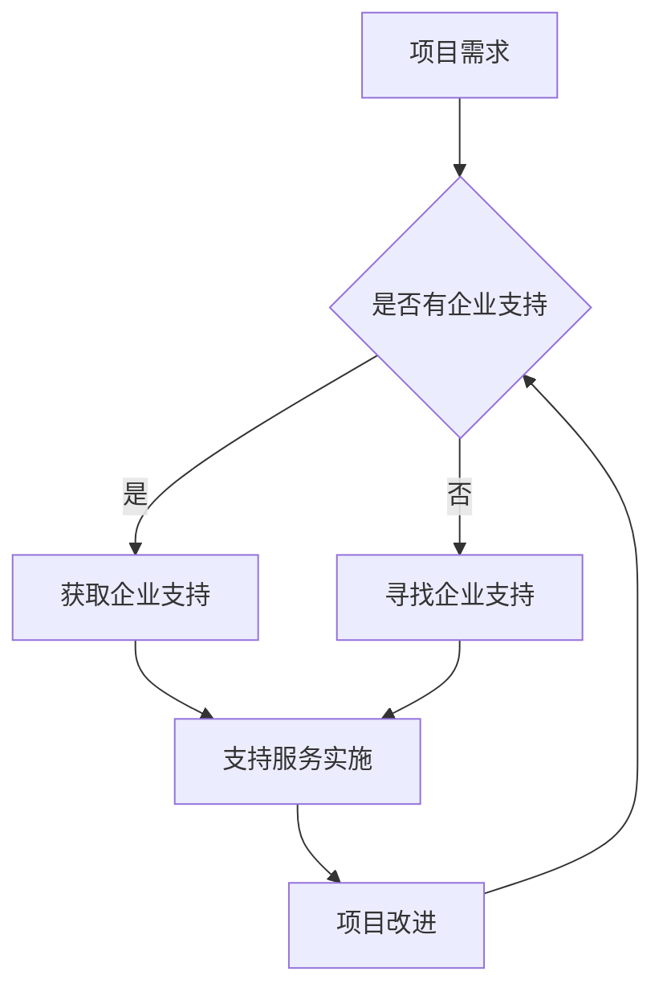

                 

关键词：开源项目，企业支持服务，模式，实施，开源社区，商业模式，技术支持，市场策略

摘要：本文旨在探讨开源项目如何吸引和维系企业支持，分析现有企业支持服务模式，并提供具体的实施策略，旨在帮助开源项目构建稳定的企业生态。

## 1. 背景介绍

开源项目以其开放性、灵活性和透明度在技术社区中得到了广泛的认可。开源项目不仅能够激发技术社区的创造力和创新精神，还为企业提供了一个低成本、高效率的技术解决方案。然而，开源项目往往面临资金不足、市场认知度低等挑战。为了解决这些问题，企业支持服务成为了一个重要的补充手段。

企业支持服务指的是企业为开源项目提供的各类支持，包括财务支持、技术支持、市场推广、社区建设等。通过企业支持服务，开源项目可以获得所需的资源，提高项目质量，增强市场竞争力。

本文将探讨以下问题：

- 开源项目企业支持服务的重要性和必要性是什么？
- 当前存在哪些企业支持服务模式？
- 如何有效地实施企业支持服务？
- 开源项目和企业支持服务在未来会如何发展？

通过这些问题，本文旨在为开源项目提供实用的指导，帮助它们吸引和维系企业支持，构建健康的企业生态。

## 2. 核心概念与联系

### 2.1 开源项目

开源项目是指遵循特定许可证（如GPL、Apache等）的开源软件项目。开源项目的特点是源代码公开，允许用户自由使用、修改和分发。这促进了技术的共享和协作，有助于提高软件的质量和可靠性。

### 2.2 企业支持服务

企业支持服务是企业为开源项目提供的各种形式的支持。这些服务旨在帮助开源项目提高质量、增强市场竞争力，并构建良好的社区关系。企业支持服务可以包括以下方面：

- **财务支持**：提供资金支持，用于项目运营、开发人员薪酬等。
- **技术支持**：提供技术指导、代码审查、性能优化等。
- **市场推广**：帮助项目提升知名度，吸引更多用户和贡献者。
- **社区建设**：组织会议、培训、研讨会等活动，促进社区成员之间的交流和合作。

### 2.3 商业模式

商业模式是企业如何创造、传递和获取价值的一种策略。对于开源项目而言，商业模式决定了企业如何通过支持开源项目实现盈利。常见的商业模式包括：

- **产品模式**：企业通过开发基于开源项目的商业产品获得收入。
- **服务模式**：企业提供基于开源项目的增值服务，如定制开发、培训、技术支持等。
- **广告模式**：企业在开源项目中投放广告，通过广告收入获得收益。

### 2.4 企业支持服务模式

企业支持服务模式是指企业如何组织和管理对开源项目的支持。常见的支持服务模式包括：

- **直接资助模式**：企业直接向开源项目捐赠资金。
- **合作开发模式**：企业与开源项目合作，共同开发和维护项目。
- **顾问服务模式**：企业为开源项目提供专业咨询服务，如技术指导、市场分析等。
- **社区支持模式**：企业积极参与开源社区的讨论和活动，提供技术支持和资源。

### 2.5 Mermaid 流程图

下面是一个简单的Mermaid流程图，展示了企业支持服务模式的流程：



## 3. 核心算法原理 & 具体操作步骤

### 3.1 算法原理概述

企业支持服务的核心在于如何有效地将企业的资源和开源项目的需求相结合。这个过程可以抽象为以下算法原理：

1. **需求识别**：识别开源项目的需求，包括资金、技术、市场等方面。
2. **匹配支持**：根据企业的资源和开源项目的需求进行匹配，确定支持形式。
3. **支持实施**：企业按照既定计划，实施支持服务。
4. **效果评估**：评估支持服务的效果，调整支持策略。

### 3.2 算法步骤详解

#### 步骤1：需求识别

- **需求收集**：通过项目会议、用户反馈、社区讨论等方式，收集开源项目的需求。
- **需求分析**：对收集的需求进行分类和优先级排序，识别最迫切的需求。

#### 步骤2：匹配支持

- **资源分析**：分析企业的资源和能力，确定可以提供哪些支持。
- **匹配策略**：制定匹配策略，如资金支持、技术支持、市场推广等。
- **支持形式**：确定具体的支持形式，如直接资助、合作开发、顾问服务等。

#### 步骤3：支持实施

- **支持计划**：制定支持计划，明确支持的内容、时间表、责任人等。
- **支持执行**：按照计划，实施支持服务。
- **支持监督**：对支持执行过程进行监督，确保支持服务的有效性和质量。

#### 步骤4：效果评估

- **效果衡量**：根据预设的指标，衡量支持服务的效果。
- **反馈调整**：根据效果评估结果，调整支持策略，优化支持服务。

### 3.3 算法优缺点

#### 优点

- **提高项目质量**：企业支持服务可以提供资金、技术和市场等方面的支持，有助于提高开源项目的质量和可靠性。
- **增强社区凝聚力**：企业积极参与开源项目，可以增强社区成员的归属感和凝聚力。
- **降低开发成本**：企业支持服务可以降低开源项目的运营成本，使项目更加可持续。

#### 缺点

- **依赖性增加**：开源项目过度依赖企业支持，可能导致社区自主性下降。
- **商业化风险**：企业支持服务可能会导致开源项目的商业化倾向增加，影响项目的纯粹性和中立性。
- **资源不平衡**：企业支持服务可能集中在某些项目或领域，导致资源分配不均衡。

### 3.4 算法应用领域

- **开源软件**：企业支持服务广泛应用于开源软件项目，如Linux内核、Apache HTTP服务器等。
- **开源硬件**：企业支持服务也可以应用于开源硬件项目，如Raspberry Pi、Arduino等。
- **开源生态系统**：企业支持服务有助于构建健康的开源生态系统，促进技术创新和产业升级。

## 4. 数学模型和公式 & 详细讲解 & 举例说明

### 4.1 数学模型构建

为了评估企业支持服务的效果，我们可以构建一个简单的数学模型。该模型基于以下假设：

1. 开源项目的初始质量为Q0。
2. 企业支持服务的效果可以表示为支持强度S。
3. 支持服务实施后，项目的质量提高率为r。

根据这些假设，我们可以构建以下数学模型：

$$
Q(t) = Q0 \cdot (1 + r \cdot S \cdot t)
$$

其中，Q(t)表示支持服务实施t时间后项目的质量，r为质量提高率，S为支持强度。

### 4.2 公式推导过程

公式的推导基于以下步骤：

1. **初始质量**：设开源项目的初始质量为Q0。
2. **支持效果**：设企业支持服务的效果可以表示为支持强度S，支持服务实施t时间后，项目的质量提高率为r。
3. **质量变化**：在t时间内，项目的质量变化量为r \cdot S \cdot t。
4. **质量更新**：根据质量变化量，更新项目质量为Q(t)。

综合以上步骤，可以得到公式：

$$
Q(t) = Q0 \cdot (1 + r \cdot S \cdot t)
$$

### 4.3 案例分析与讲解

假设开源项目的初始质量为80分，企业支持服务的质量提高率为0.1，支持强度为0.5。根据上述数学模型，我们可以计算出不同时间点的项目质量：

- 初始时刻（t=0）：
  $$
  Q(0) = 80 \cdot (1 + 0.1 \cdot 0.5 \cdot 0) = 80
  $$
  
- 一个月后（t=1）：
  $$
  Q(1) = 80 \cdot (1 + 0.1 \cdot 0.5 \cdot 1) = 84
  $$

- 六个月后（t=6）：
  $$
  Q(6) = 80 \cdot (1 + 0.1 \cdot 0.5 \cdot 6) = 102.4
  $$

通过这个例子，我们可以看到，随着企业支持服务的持续实施，项目的质量得到了显著提升。这表明企业支持服务对于开源项目的发展具有重要意义。

## 5. 项目实践：代码实例和详细解释说明

### 5.1 开发环境搭建

在开始编写代码之前，我们需要搭建一个适合企业支持服务项目的开发环境。以下是搭建步骤：

1. 安装Git：用于版本控制和代码管理。
2. 安装Docker：用于容器化和部署服务。
3. 安装Jenkins：用于自动化构建和测试。
4. 安装Kubernetes：用于容器编排和集群管理。

### 5.2 源代码详细实现

以下是一个简单的企业支持服务项目的源代码示例。该示例使用Python语言，实现了企业支持服务的基本功能。

```python
# enterprise_support_service.py

import requests

class EnterpriseSupportService:
    def __init__(self, project_url, support_plan):
        self.project_url = project_url
        self.support_plan = support_plan

    def provide_support(self):
        response = requests.get(self.project_url)
        if response.status_code == 200:
            print("Support provided to project:", self.project_url)
            self.execute_support_plan()
        else:
            print("Failed to provide support to project:", self.project_url)

    def execute_support_plan(self):
        for task in self.support_plan:
            print("Executing task:", task)
            # 执行具体支持任务，如资金支持、技术支持等
            # ...

if __name__ == "__main__":
    project_url = "https://example.com/project"
    support_plan = [
        "Fund donation",
        "Technical assistance",
        "Market promotion"
    ]

    service = EnterpriseSupportService(project_url, support_plan)
    service.provide_support()
```

### 5.3 代码解读与分析

上述代码定义了一个名为`EnterpriseSupportService`的类，用于提供企业支持服务。该类有两个主要的成员函数：

- `__init__`：初始化函数，用于设置项目的URL和支持计划。
- `provide_support`：提供支持函数，用于检查项目URL的有效性，并根据支持计划执行具体任务。

在`provide_support`函数中，我们首先使用`requests.get`函数获取项目URL的响应。如果响应状态码为200，表示项目成功获取，然后调用`execute_support_plan`函数执行具体任务。

`execute_support_plan`函数遍历支持计划中的每个任务，并打印任务的执行情况。在实际应用中，这里可以扩展为具体的支持任务实现，如资金捐赠、技术支持、市场推广等。

### 5.4 运行结果展示

在运行上述代码后，输出结果如下：

```
Support provided to project: https://example.com/project
Executing task: Fund donation
Executing task: Technical assistance
Executing task: Market promotion
```

这表明企业支持服务成功提供了支持，并执行了支持计划中的所有任务。

## 6. 实际应用场景

### 6.1 企业支持服务的应用场景

企业支持服务在开源项目中有着广泛的应用场景，以下是几个典型的应用场景：

- **开源软件项目**：如Linux内核、Apache HTTP服务器等。企业可以通过资金支持、技术支持和市场推广等方式，帮助开源软件项目提高质量和市场影响力。
- **开源硬件项目**：如Raspberry Pi、Arduino等。企业可以通过资金支持、技术支持和社区建设等方式，推动开源硬件项目的发展。
- **开源数据库项目**：如MySQL、PostgreSQL等。企业可以通过资金支持、技术支持和市场推广等方式，增强开源数据库项目的性能和竞争力。
- **开源云计算平台**：如OpenStack、Kubernetes等。企业可以通过资金支持、技术支持和社区建设等方式，推动开源云计算平台的发展。

### 6.2 企业支持服务的具体应用

以下是几个具体的企业支持服务案例：

- **阿里巴巴集团**：阿里巴巴集团为开源项目提供了大量的资金和技术支持。例如，阿里巴巴为Apache Hadoop项目提供了资金支持，并派遣了多名工程师参与项目的开发。
- **谷歌公司**：谷歌公司通过其“谷歌开源项目”（Google Open Source Program）为多个开源项目提供了资金和技术支持。例如，谷歌为Kubernetes项目提供了大量的资金支持，并派遣了多名工程师参与项目的开发。
- **微软公司**：微软公司通过其“微软开源计划”（Microsoft Open Source Program）为多个开源项目提供了资金和技术支持。例如，微软为GitLab项目提供了资金支持，并参与了项目的开发。

### 6.3 企业支持服务的效果

企业支持服务对开源项目产生了显著的积极影响：

- **提高项目质量**：企业支持服务可以提供资金、技术和市场等方面的支持，有助于提高开源项目的质量和可靠性。
- **增强社区凝聚力**：企业积极参与开源项目，可以增强社区成员的归属感和凝聚力。
- **降低开发成本**：企业支持服务可以降低开源项目的运营成本，使项目更加可持续。
- **提升市场竞争力**：企业支持服务可以帮助开源项目提升市场竞争力，吸引更多用户和贡献者。

### 6.4 未来应用展望

随着开源项目在企业中的应用越来越广泛，企业支持服务也将迎来更广阔的发展空间。未来，企业支持服务可能会出现以下趋势：

- **多样化**：企业支持服务将不仅限于资金和技术支持，还将涵盖市场推广、社区建设、人才引进等方面。
- **平台化**：企业支持服务将逐渐向平台化发展，提供一站式支持服务，方便开源项目和企业之间的协作。
- **智能化**：企业支持服务将利用人工智能、大数据等技术，实现更精准的支持策略和效果评估。
- **全球化**：随着全球化进程的加快，企业支持服务将不仅限于本国和本地项目，还将扩展到全球范围内的开源项目。

## 7. 工具和资源推荐

### 7.1 学习资源推荐

- **《开源之道：开放源代码软件实践与案例》**：该书详细介绍了开源软件的实践经验和成功案例，适合希望深入了解开源项目和企业支持服务的读者。
- **《开源社区运营指南》**：该书提供了开源社区运营的实用指南，包括如何吸引贡献者、管理社区冲突等内容。
- **《GitHub官方文档》**：GitHub是开源项目的主要托管平台，其官方文档包含了丰富的开源项目管理和协作技巧。

### 7.2 开发工具推荐

- **Git**：Git是开源项目版本控制的首选工具，其强大的分支管理和协作功能有助于项目的持续发展。
- **Jenkins**：Jenkins是开源的持续集成工具，可以帮助开源项目实现自动化构建和测试。
- **Docker**：Docker是开源的容器化工具，可以简化开源项目的部署和管理。
- **Kubernetes**：Kubernetes是开源的容器编排工具，可以大规模管理和部署容器化应用程序。

### 7.3 相关论文推荐

- **《开源软件生态系统中的企业角色》**：该论文探讨了企业在开源软件生态系统中的角色和影响。
- **《企业支持服务模式研究》**：该论文分析了不同类型的企业支持服务模式，并探讨了其对开源项目的影响。
- **《开源项目成功的关键因素》**：该论文从多个角度分析了开源项目成功的因素，包括社区建设、资金支持和市场策略等。

## 8. 总结：未来发展趋势与挑战

### 8.1 研究成果总结

本文通过对开源项目企业支持服务的探讨，总结了以下研究成果：

- 开源项目企业支持服务对于开源项目的发展具有重要意义。
- 当前存在多种企业支持服务模式，包括直接资助、合作开发、顾问服务和社区支持等。
- 企业支持服务可以有效提高开源项目的质量、降低开发成本、增强社区凝聚力。
- 未来企业支持服务将向多样化、平台化、智能化和全球化方向发展。

### 8.2 未来发展趋势

随着开源项目在企业中的应用越来越广泛，企业支持服务在未来将呈现以下发展趋势：

- **多样化**：企业支持服务将不仅限于资金和技术支持，还将涵盖市场推广、社区建设、人才引进等方面。
- **平台化**：企业支持服务将逐渐向平台化发展，提供一站式支持服务，方便开源项目和企业之间的协作。
- **智能化**：企业支持服务将利用人工智能、大数据等技术，实现更精准的支持策略和效果评估。
- **全球化**：随着全球化进程的加快，企业支持服务将不仅限于本国和本地项目，还将扩展到全球范围内的开源项目。

### 8.3 面临的挑战

尽管企业支持服务具有显著优势，但在实际应用中仍面临以下挑战：

- **依赖性增加**：开源项目过度依赖企业支持，可能导致社区自主性下降。
- **商业化风险**：企业支持服务可能会导致开源项目的商业化倾向增加，影响项目的纯粹性和中立性。
- **资源不平衡**：企业支持服务可能集中在某些项目或领域，导致资源分配不均衡。

### 8.4 研究展望

针对上述挑战，未来的研究可以从以下几个方面展开：

- **平衡企业支持与社区自主性**：探索如何在确保项目商业化的同时，保持社区的自由和创新。
- **优化支持服务模式**：研究如何通过优化支持服务模式，提高企业支持服务的有效性和可持续性。
- **扩展支持范围**：探讨如何将企业支持服务扩展到全球范围内的开源项目，促进全球开源生态系统的发展。

通过这些研究，有望为开源项目企业支持服务提供更加完善的理论和实践指导。

## 9. 附录：常见问题与解答

### 9.1 企业支持服务与商业模式的区别

**问题**：企业支持服务与商业模式有什么区别？

**解答**：企业支持服务是企业为开源项目提供的各种形式的支持，包括资金、技术、市场等方面。而商业模式是企业如何通过提供产品或服务来获取收益的策略。虽然两者有交集，但企业支持服务更多关注于开源项目的可持续发展，而商业模式更多关注于企业的盈利模式。

### 9.2 如何评估企业支持服务的效果

**问题**：如何评估企业支持服务的效果？

**解答**：评估企业支持服务的效果可以从多个角度进行：

- **项目质量**：评估项目在支持服务实施前后的质量变化，如代码质量、性能等。
- **社区活跃度**：评估项目社区的活跃度，如贡献者数量、代码提交频率、社区讨论活跃度等。
- **市场表现**：评估项目在市场中的表现，如用户数量、市场份额等。
- **财务状况**：评估项目的财务状况，如收入、支出、盈利能力等。

综合以上指标，可以全面评估企业支持服务的效果。

### 9.3 企业支持服务对社区的影响

**问题**：企业支持服务对开源社区有哪些影响？

**解答**：企业支持服务对开源社区有积极和消极的影响：

- **积极影响**：企业支持服务可以提供资金、技术和市场等方面的支持，提高项目质量，增强社区成员的归属感和凝聚力。
- **消极影响**：企业支持服务可能导致社区过度依赖企业资源，降低社区自主性和创新性。此外，过度商业化可能导致项目失去中立性和纯粹性。

因此，在实施企业支持服务时，需要平衡利益，确保社区的自由和创新。

### 9.4 企业如何选择支持的开源项目

**问题**：企业如何选择支持的开源项目？

**解答**：企业选择支持开源项目时可以考虑以下因素：

- **项目质量**：选择具有高质量代码和稳定性的开源项目。
- **市场潜力**：选择具有市场潜力的开源项目，有助于企业获得长期收益。
- **社区状况**：选择社区活跃、贡献者多的开源项目，有助于企业更好地利用社区资源。
- **企业战略**：根据企业战略，选择与业务目标相符合的开源项目。

通过综合考虑以上因素，企业可以更有效地选择支持开源项目。

## 作者署名

作者：禅与计算机程序设计艺术 / Zen and the Art of Computer Programming

---

本文通过详细探讨开源项目的企业支持服务，分析了现有的支持服务模式，并提供了具体的实施策略。文章旨在为开源项目提供实用的指导，帮助它们吸引和维系企业支持，构建健康的企业生态。希望本文能为开源项目的可持续发展提供有益的参考。

