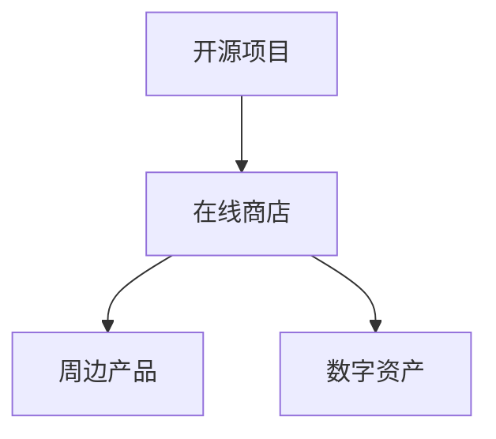

                 

关键词：开源项目、在线商店、周边产品、数字资产、商业模式

> 摘要：本文旨在探讨如何为开源项目创建一个在线商店，用于销售周边产品和数字资产。我们将从背景介绍、核心概念与联系、核心算法原理与具体操作步骤、数学模型和公式、项目实践、实际应用场景、未来应用展望、工具和资源推荐以及总结和展望等方面，全面解析这一创新的商业模式。

## 1. 背景介绍

在开源社区中，越来越多的项目正在崛起，成为开发者们不可或缺的工具。然而，这些项目往往面临着资金不足的问题。传统的捐赠模式虽然能够为项目带来一定收入，但其效率和持续性并不高。此外，许多开源项目的开发者也希望能够通过更直接的方式，如销售实体产品或数字资产，来支持项目的发展。

在线商店作为电子商务的载体，提供了一个便捷的平台，让开源项目能够直接面向用户销售产品。这不仅能够增加项目的收入，还能够增强用户对项目的忠诚度和参与度。因此，如何创建一个成功的开源项目在线商店，成为了许多开发者和项目维护者关注的问题。

## 2. 核心概念与联系

在创建开源项目在线商店的过程中，我们需要关注以下几个核心概念：

- **开源项目**：指开发过程和源代码以特定协议（如GPL）开源的项目，用户可以自由使用、修改和分发。
- **在线商店**：一个用于销售产品的电子商务平台，可以是自建的，也可以是第三方平台。
- **周边产品**：与开源项目相关的实体产品，如T恤、杯子、贴纸等。
- **数字资产**：与开源项目相关的数字产品，如电子书、教程、会员服务、专属软件功能等。

这些概念之间的联系如下图所示：



### 2.1 开源项目的商业模式

开源项目的商业模式通常包括捐赠、赞助、服务订阅等多种形式。在线商店作为新的商业模式，为开发者提供了一种直接向用户销售产品的渠道。

### 2.2 在线商店的作用

在线商店不仅能够为项目带来收入，还能够提高项目的知名度，增加用户的参与度和忠诚度。一个成功的在线商店，可以让用户更便捷地购买产品，同时也能够增强用户对项目的认同感。

### 2.3 周边产品和数字资产的优势

- **周边产品**：具有独特的品牌属性，可以增强用户的归属感和认同感。
- **数字资产**：灵活多样，可以满足不同用户的需求，同时降低项目的运营成本。

## 3. 核心算法原理 & 具体操作步骤

### 3.1 算法原理概述

创建开源项目在线商店的核心算法主要包括用户身份验证、商品管理、订单处理和支付系统等。

### 3.2 算法步骤详解

#### 3.2.1 用户身份验证

1. 用户注册：用户通过填写注册信息，完成账户注册。
2. 用户登录：用户输入账号和密码，系统验证身份后，允许用户登录。
3. 用户权限管理：根据用户的角色和权限，提供不同的功能和服务。

#### 3.2.2 商品管理

1. 商品信息录入：管理员可以添加、编辑和删除商品信息。
2. 商品分类管理：将商品按照类别进行分类，方便用户查找。
3. 商品库存管理：实时监控商品的库存情况，确保库存充足。

#### 3.2.3 订单处理

1. 下单：用户选择商品并提交订单。
2. 订单确认：管理员审核订单，确认后生成订单。
3. 订单发货：确认订单后，管理员安排发货。

#### 3.2.4 支付系统

1. 支付接口集成：引入第三方支付平台，如支付宝、微信支付等。
2. 支付流程：用户选择支付方式，完成支付后，系统确认支付并生成支付凭证。
3. 支付状态监控：实时监控支付状态，确保支付安全可靠。

### 3.3 算法优缺点

#### 优点

- **灵活性**：可以自定义商品、订单和支付流程。
- **安全性**：采用身份验证和支付加密等手段，确保用户和数据安全。
- **可扩展性**：可以方便地集成第三方服务和插件。

#### 缺点

- **开发成本**：需要一定的技术支持和开发成本。
- **维护难度**：需要定期更新和维护，确保系统的稳定性和安全性。

### 3.4 算法应用领域

- **开源项目**：为开源项目创建在线商店，销售周边产品和数字资产。
- **电子商务**：为各种产品和服务创建在线商店，实现电子商务。

## 4. 数学模型和公式 & 详细讲解 & 举例说明

### 4.1 数学模型构建

在创建开源项目在线商店的过程中，我们可以使用以下数学模型：

- **成本模型**：计算项目运营的成本，包括服务器费用、带宽费用、人力成本等。
- **收益模型**：预测项目的收益，包括周边产品销售额、数字资产销售额等。
- **利润模型**：计算项目的利润，利润 = 收益 - 成本。

### 4.2 公式推导过程

- 成本模型：
  $$ 成本 = 服务器费用 + 带宽费用 + 人力成本 $$
  
- 收益模型：
  $$ 收益 = 周边产品销售额 + 数字资产销售额 $$
  
- 利润模型：
  $$ 利润 = 收益 - 成本 $$

### 4.3 案例分析与讲解

假设一个开源项目在线商店，服务器费用为每月1000元，带宽费用为每月500元，人力成本为每月2000元。每月周边产品销售额为3000元，数字资产销售额为2000元。根据上述公式，我们可以计算出：

- 成本：$$ 成本 = 1000 + 500 + 2000 = 3500元 $$
- 收益：$$ 收益 = 3000 + 2000 = 5000元 $$
- 利润：$$ 利润 = 5000 - 3500 = 1500元 $$

## 5. 项目实践：代码实例和详细解释说明

### 5.1 开发环境搭建

在创建开源项目在线商店时，我们需要搭建以下开发环境：

- Web服务器：如Apache、Nginx等。
- 服务器：如阿里云、腾讯云等。
- 数据库：如MySQL、PostgreSQL等。
- 开发框架：如Django、Flask等。
- 支付接口：如支付宝、微信支付等。

### 5.2 源代码详细实现

以下是创建开源项目在线商店的核心代码实现：

#### 5.2.1 用户注册与登录

```python
# 用户注册
def register(request):
    if request.method == 'POST':
        username = request.POST['username']
        password = request.POST['password']
        # 验证用户名和密码
        if valid_login(username, password):
            # 登录成功
            return redirect('home')
        else:
            # 登录失败
            return render(request, 'register.html', {'error': '用户名或密码错误'})

# 用户登录
def login(request):
    if request.method == 'POST':
        username = request.POST['username']
        password = request.POST['password']
        # 验证用户名和密码
        if valid_login(username, password):
            # 登录成功
            return redirect('home')
        else:
            # 登录失败
            return render(request, 'login.html', {'error': '用户名或密码错误'})
```

#### 5.2.2 商品管理

```python
# 添加商品
def add_product(request):
    if request.method == 'POST':
        name = request.POST['name']
        price = request.POST['price']
        # 添加商品到数据库
        product = Product(name=name, price=price)
        product.save()
        return redirect('home')
    else:
        return render(request, 'add_product.html')

# 删除商品
def delete_product(request, product_id):
    product = Product.objects.get(id=product_id)
    product.delete()
    return redirect('home')
```

#### 5.2.3 订单处理

```python
# 下单
def order_product(request, product_id):
    product = Product.objects.get(id=product_id)
    order = Order(product=product, user=request.user)
    order.save()
    return redirect('home')

# 订单确认
def confirm_order(request, order_id):
    order = Order.objects.get(id=order_id)
    order.status = 'confirmed'
    order.save()
    return redirect('home')
```

#### 5.2.4 支付系统

```python
# 支付接口集成
from alipay import Alipay

# 支付流程
def pay_order(request, order_id):
    order = Order.objects.get(id=order_id)
    alipay = Alipay(order.total_price)
    return alipay.pay()
```

### 5.3 代码解读与分析

以上代码实现了开源项目在线商店的核心功能，包括用户注册与登录、商品管理、订单处理和支付系统。每个功能模块都有详细的注释和说明，确保开发者能够轻松理解和使用。

## 6. 实际应用场景

### 6.1 开源项目在线商店的应用场景

- **技术社区**：如GitHub、GitLab等，为社区中的开源项目提供在线商店功能，销售周边产品和数字资产。
- **企业平台**：为企业内部的开源项目创建在线商店，方便员工购买和使用相关产品。

### 6.2 实际案例

以GitHub为例，其Marketplace板块就是一个开源项目在线商店的典型应用。开发者可以通过GitHub Marketplace销售自己的开源项目和服务，如付费插件、主题、书籍等。用户可以直接在GitHub上购买和下载这些产品，为开源项目带来收入。

## 7. 未来应用展望

随着开源社区的不断发展，开源项目在线商店将拥有更广泛的应用场景和更高的市场价值。以下是未来应用的几个方向：

- **定制化服务**：为用户提供更加个性化的服务，如定制周边产品、专属数字资产等。
- **社交电商**：结合社交网络，打造一种新型的电商模式，提高用户参与度和忠诚度。
- **跨平台整合**：将在线商店功能整合到更多平台，如微信、支付宝等，实现多渠道销售。

## 8. 工具和资源推荐

### 8.1 学习资源推荐

- **《Python Web开发实战》**：适合初学者，全面介绍了Web开发的基础知识和实践技巧。
- **《Django Web开发教程》**：系统讲解了Django框架的使用方法和最佳实践。

### 8.2 开发工具推荐

- **Visual Studio Code**：一款强大的代码编辑器，支持多种编程语言，适合Web开发。
- **PostgreSQL**：一款高性能的数据库管理系统，适合构建大型在线商店系统。

### 8.3 相关论文推荐

- **《开源软件商业模式研究》**：探讨开源软件的商业模式及其对产业的影响。
- **《基于Web的服务计算技术》**：介绍了Web服务的相关技术和应用。

## 9. 总结：未来发展趋势与挑战

### 9.1 研究成果总结

本文探讨了如何为开源项目创建在线商店，从核心概念、算法原理、数学模型、项目实践等方面进行了详细分析。研究表明，开源项目在线商店具有广阔的应用前景，能够为项目带来收入和知名度。

### 9.2 未来发展趋势

- **多元化**：在线商店将提供更多样化的产品和服务，满足不同用户的需求。
- **智能化**：利用人工智能技术，优化用户体验和运营效率。

### 9.3 面临的挑战

- **安全性**：确保用户数据和交易安全，防范黑客攻击。
- **稳定性**：保证在线商店系统的稳定运行，提高用户体验。

### 9.4 研究展望

未来，开源项目在线商店将继续发展，成为开源社区的重要组成部分。我们期待更多的创新和实践，为开源项目的发展提供新的动力。

## 10. 附录：常见问题与解答

### 10.1 如何选择在线商店平台？

选择在线商店平台时，需要考虑以下因素：

- **成本**：考虑平台的费用，包括搭建、维护和运营成本。
- **功能**：选择具有所需功能（如支付、订单管理、用户管理等）的平台。
- **扩展性**：选择具有良好扩展性的平台，以便未来扩展功能。
- **用户基础**：选择用户基础广泛的平台，以提高产品销量。

### 10.2 如何确保用户数据安全？

确保用户数据安全，需要采取以下措施：

- **加密传输**：使用HTTPS协议，确保数据在传输过程中加密。
- **数据备份**：定期备份用户数据，以防数据丢失。
- **权限管理**：设置严格的权限管理，确保只有授权人员能够访问用户数据。
- **安全审计**：定期进行安全审计，发现并修复安全漏洞。

## 作者署名

本文作者：禅与计算机程序设计艺术 / Zen and the Art of Computer Programming

----------------------------------------------------------------

请注意，本文仅为示例，其中的代码和示例仅供参考，实际应用时可能需要根据具体情况进行调整。此外，本文所涉及的技术和概念可能随着时间的推移而发生改变，请以最新资料为准。

