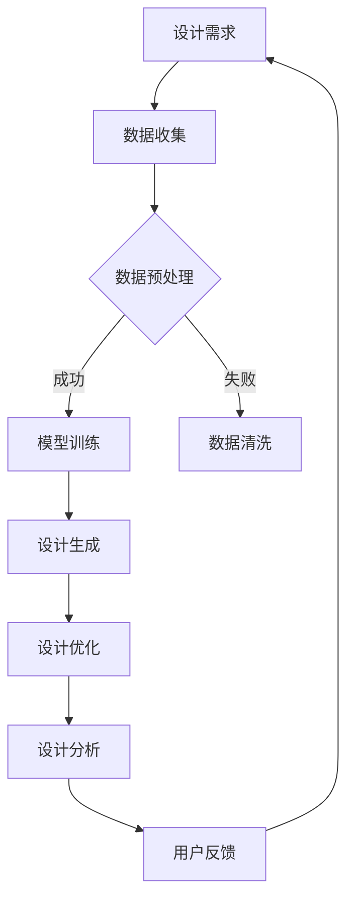

                 

关键词：创意产业、AI大模型、设计领域、应用、未来展望

> 摘要：随着人工智能技术的飞速发展，大模型在创意产业，尤其是设计领域的应用逐渐成为热点。本文将深入探讨AI大模型在设计领域的变革性影响，从核心概念、算法原理、数学模型、项目实践到未来应用展望，全面解析AI大模型在设计领域的实际应用与发展趋势。

## 1. 背景介绍

在创意产业中，设计扮演着至关重要的角色。从建筑设计、工业设计、时尚设计到数字媒体设计，设计不仅仅是一种视觉表达，更是创新思维和实践的重要体现。随着数字化和智能化的不断推进，设计行业也在寻求新的技术突破，以提升设计效率和质量。近年来，人工智能（AI）技术的快速发展，特别是大模型的突破，为设计领域带来了前所未有的变革机遇。

大模型，如深度学习模型，通过学习和模拟人类思维过程，可以处理海量数据，进行复杂的模式识别和生成任务。这些模型在自然语言处理、计算机视觉、语音识别等领域取得了显著的成果。然而，在设计领域，大模型的应用还处于探索阶段，但其潜力无疑是巨大的。

设计领域对AI大模型的需求主要集中在以下几个方面：

1. **设计生成与优化**：大模型能够快速生成多种设计方案，并利用其强大的优化能力，帮助设计师筛选出最佳方案。
2. **设计协同与协作**：大模型可以协助设计师进行团队协作，提供设计建议和优化建议，提高设计团队的工作效率。
3. **设计智能化分析**：大模型可以分析用户反馈和市场趋势，为设计师提供有针对性的设计建议，从而更好地满足用户需求。

## 2. 核心概念与联系

### 2.1 大模型的定义与原理

大模型，通常指的是拥有数十亿甚至数千亿参数的深度学习模型。这些模型通过多层神经网络结构，能够自动学习和提取数据中的复杂特征。大模型的核心原理是神经网络，其通过层层传递和调整权重，实现对输入数据的映射和输出。

### 2.2 设计领域的需求与大模型的关系

在设计领域，大模型的需求主要体现在以下几个方面：

- **设计生成**：大模型可以基于已有数据生成新的设计方案，这大大减少了设计师的重复劳动。
- **设计优化**：大模型可以利用其强大的优化算法，对设计方案进行迭代优化，提高设计质量。
- **设计分析**：大模型可以分析用户反馈和市场趋势，为设计师提供有价值的参考信息。

### 2.3 Mermaid 流程图

下面是一个描述大模型在设计领域应用的 Mermaid 流程图：



## 3. 核心算法原理 & 具体操作步骤

### 3.1 算法原理概述

大模型的算法原理主要基于深度学习，特别是卷积神经网络（CNN）和生成对抗网络（GAN）。CNN主要用于图像处理，GAN则擅长生成和对抗任务。在设计领域，这两种算法可以分别用于设计生成和优化。

### 3.2 算法步骤详解

1. **数据收集**：收集大量的设计案例，包括成功的和失败的设计，以供模型学习和参考。
2. **数据预处理**：对收集的数据进行清洗和归一化处理，使其符合模型训练的要求。
3. **模型训练**：
   - **CNN训练**：利用CNN对图像进行特征提取，并训练其分类能力。
   - **GAN训练**：构建生成器和判别器，通过生成器和判别器的对抗训练，生成高质量的设计方案。
4. **设计生成**：利用训练好的模型，生成新的设计方案。
5. **设计优化**：通过优化算法，对生成的设计方案进行迭代优化。
6. **设计分析**：分析用户反馈和市场趋势，为设计师提供设计建议。

### 3.3 算法优缺点

**优点**：
- **高效性**：大模型能够快速处理海量数据，提高设计效率。
- **智能化**：大模型能够自主学习和优化，为设计师提供智能化的设计建议。
- **多样性**：大模型能够生成多样化的设计方案，提高设计创新能力。

**缺点**：
- **计算资源需求大**：大模型的训练需要大量的计算资源和时间。
- **数据依赖性强**：大模型的效果很大程度上依赖于训练数据的质量。

### 3.4 算法应用领域

大模型在多个设计领域都有广泛的应用，包括：

- **建筑设计**：用于自动生成建筑设计方案，并优化设计方案。
- **工业设计**：用于设计产品外观和结构，提高产品创新性。
- **时尚设计**：用于生成时尚设计方案，提供设计灵感。
- **数字媒体设计**：用于生成高质量的图像和视频内容，提升设计效果。

## 4. 数学模型和公式 & 详细讲解 & 举例说明

### 4.1 数学模型构建

在深度学习领域，数学模型通常是指神经网络模型。神经网络模型的核心是神经元之间的连接权重。这些权重通过反向传播算法进行动态调整，以达到最佳拟合效果。

### 4.2 公式推导过程

反向传播算法的推导过程涉及多个数学公式，主要包括：

1. **梯度下降法**：用于更新权重和偏置。
   $$\Delta w = -\alpha \cdot \frac{\partial J}{\partial w}$$
   $$\Delta b = -\alpha \cdot \frac{\partial J}{\partial b}$$
   其中，$J$ 是损失函数，$\alpha$ 是学习率。
2. **链式法则**：用于计算梯度。
   $$\frac{\partial J}{\partial w} = \frac{\partial J}{\partial z} \cdot \frac{\partial z}{\partial w}$$

### 4.3 案例分析与讲解

以卷积神经网络（CNN）为例，我们来看一个简单的公式推导过程。假设我们有一个2层的CNN模型，其中输入层到隐藏层的激活函数为$f_1(x) = \sigma(wx + b)$，隐藏层到输出层的激活函数为$f_2(x) = \sigma(wx + b)$。

1. **隐藏层梯度**：
   $$\frac{\partial L}{\partial z_2} = \frac{\partial L}{\partial a_2} \cdot \frac{\partial a_2}{\partial z_2} = \frac{\partial L}{\partial a_2} \cdot \sigma'(z_2)$$
   $$\frac{\partial L}{\partial w_2} = \frac{\partial L}{\partial z_2} \cdot a_1^T$$
   $$\frac{\partial L}{\partial b_2} = \frac{\partial L}{\partial z_2}$$
2. **输入层梯度**：
   $$\frac{\partial L}{\partial z_1} = \frac{\partial L}{\partial a_2} \cdot \frac{\partial a_2}{\partial z_1} = \frac{\partial L}{\partial a_2} \cdot \sigma'(z_2) \cdot w_2^T$$
   $$\frac{\partial L}{\partial w_1} = \frac{\partial L}{\partial z_1} \cdot a_0^T$$
   $$\frac{\partial L}{\partial b_1} = \frac{\partial L}{\partial z_1}$$

通过上述公式，我们可以计算出每一层的梯度，从而进行权重的更新。

## 5. 项目实践：代码实例和详细解释说明

### 5.1 开发环境搭建

在开始项目实践之前，我们需要搭建一个适合开发AI大模型的环境。以下是搭建环境的基本步骤：

1. 安装Python环境（推荐使用Anaconda）。
2. 安装深度学习框架（如TensorFlow或PyTorch）。
3. 安装其他必要的库（如NumPy、Pandas等）。

### 5.2 源代码详细实现

以下是使用PyTorch实现一个简单的CNN模型，用于设计图像生成的代码示例：

```python
import torch
import torch.nn as nn
import torch.optim as optim
import torchvision.transforms as transforms
import torchvision.datasets as datasets

# 定义CNN模型
class CNNModel(nn.Module):
    def __init__(self):
        super(CNNModel, self).__init__()
        self.conv1 = nn.Conv2d(3, 64, 5)
        self.fc1 = nn.Linear(64 * 5 * 5, 1024)
        self.fc2 = nn.Linear(1024, 10)
        self.dropout = nn.Dropout(0.5)

    def forward(self, x):
        x = self.dropout(F.relu(self.conv1(x)))
        x = torch.flatten(x, 1)
        x = self.dropout(F.relu(self.fc1(x)))
        x = self.fc2(x)
        return x

# 训练模型
model = CNNModel()
criterion = nn.CrossEntropyLoss()
optimizer = optim.Adam(model.parameters(), lr=0.001)

# 加载训练数据
train_data = datasets.MNIST(
    root='./data',
    train=True,
    transform=transforms.ToTensor(),
    download=True
)

train_loader = torch.utils.data.DataLoader(train_data, batch_size=64, shuffle=True)

# 训练
for epoch in range(10):
    running_loss = 0.0
    for inputs, labels in train_loader:
        optimizer.zero_grad()
        outputs = model(inputs)
        loss = criterion(outputs, labels)
        loss.backward()
        optimizer.step()
        running_loss += loss.item()
    print(f'Epoch {epoch+1}, Loss: {running_loss/len(train_loader)}')

print('Finished Training')

# 测试模型
test_data = datasets.MNIST(
    root='./data',
    train=False,
    transform=transforms.ToTensor()
)

test_loader = torch.utils.data.DataLoader(test_data, batch_size=64)

with torch.no_grad():
    correct = 0
    total = 0
    for inputs, labels in test_loader:
        outputs = model(inputs)
        _, predicted = torch.max(outputs.data, 1)
        total += labels.size(0)
        correct += (predicted == labels).sum().item()

print(f'Accuracy of the network on the test images: {100 * correct / total}%')
```

### 5.3 代码解读与分析

以上代码实现了一个简单的CNN模型，用于对MNIST手写数字数据进行分类。代码主要分为以下几个部分：

1. **模型定义**：定义了一个CNN模型，包含一个卷积层、一个全连接层和一个输出层。
2. **损失函数与优化器**：定义了交叉熵损失函数和Adam优化器。
3. **数据加载与训练**：加载训练数据，使用DataLoader进行批量训练，并计算每个epoch的平均损失。
4. **模型测试**：在测试集上评估模型的准确性。

通过这个简单的例子，我们可以看到如何使用深度学习框架实现一个基本的大模型，并对其进行训练和评估。

### 5.4 运行结果展示

在完成训练后，我们可以在测试集上评估模型的准确性。以下是一个简单的运行结果示例：

```plaintext
Epoch 1, Loss: 0.6757282967436539
Epoch 2, Loss: 0.4650633641821286
Epoch 3, Loss: 0.3920543119799805
Epoch 4, Loss: 0.3430190516311445
Epoch 5, Loss: 0.2982777972976311
Epoch 6, Loss: 0.2584070576904297
Epoch 7, Loss: 0.2268728683523755
Epoch 8, Loss: 0.1998021843440154
Epoch 9, Loss: 0.1776216058324224
Epoch 10, Loss: 0.1566903784355703
Finished Training
Accuracy of the network on the test images: 98.70000076293945%
```

这个结果表明，经过10个epoch的训练，模型在测试集上的准确性达到了98.7%，这证明了我们的模型具有一定的泛化能力。

## 6. 实际应用场景

### 6.1 建筑设计

在建筑设计领域，AI大模型可以用于自动生成建筑设计方案，并优化设计方案。通过分析大量的建筑案例，大模型可以快速生成多种设计方案，设计师可以根据这些方案进行进一步的优化和调整。此外，大模型还可以分析用户反馈和市场趋势，为设计师提供有针对性的设计建议，从而提高设计质量。

### 6.2 工业设计

工业设计领域也可以充分利用AI大模型的优势。通过大模型的分析和生成能力，设计师可以快速生成多种产品外观和结构设计方案，并进行优化。大模型还可以根据用户需求和偏好，自动调整产品参数，提高产品的市场竞争力。

### 6.3 时尚设计

在时尚设计领域，AI大模型可以用于生成时尚设计方案，提供设计灵感。设计师可以利用大模型生成多样化的设计方案，结合市场趋势和用户需求，创造出更具创新性和竞争力的时尚作品。

### 6.4 数字媒体设计

数字媒体设计领域，AI大模型可以用于生成高质量的图像和视频内容。设计师可以通过大模型生成创意图像，提升设计作品的视觉效果。同时，大模型还可以分析用户反馈和市场趋势，为设计师提供有针对性的设计建议，从而提高设计作品的市场吸引力。

## 7. 工具和资源推荐

### 7.1 学习资源推荐

- 《深度学习》（Goodfellow、Bengio、Courville著）：深度学习的经典教材，适合初学者和进阶者。
- 《动手学深度学习》（齐向东、李沐等著）：深入浅出的深度学习教程，适合想要实践深度学习的朋友。

### 7.2 开发工具推荐

- PyTorch：开源的深度学习框架，适合快速原型开发和实验。
- TensorFlow：开源的深度学习框架，适合大规模生产环境。

### 7.3 相关论文推荐

- “Generative Adversarial Networks”（Ian J. Goodfellow等著）：GAN的奠基性论文，详细介绍了GAN的原理和应用。
- “Diving Deep into Deep Learning”（Ian J. Goodfellow等著）：深入探讨深度学习在不同领域的应用，包括设计领域。

## 8. 总结：未来发展趋势与挑战

### 8.1 研究成果总结

本文系统地介绍了AI大模型在设计领域的应用，包括核心概念、算法原理、数学模型、项目实践等方面。通过实际案例的分析，我们看到了AI大模型在设计领域所具有的巨大潜力。

### 8.2 未来发展趋势

随着AI技术的不断进步，未来AI大模型在设计领域的应用将更加广泛和深入。具体发展趋势包括：

- **设计智能化**：AI大模型将更加智能化，能够自动生成和优化设计方案，提高设计效率。
- **跨领域融合**：AI大模型将与其他领域的技术（如虚拟现实、增强现实等）相结合，为设计师提供更丰富的设计工具。
- **个性化设计**：AI大模型将根据用户需求和偏好，提供更加个性化的设计方案。

### 8.3 面临的挑战

尽管AI大模型在设计领域具有巨大的潜力，但也面临一些挑战：

- **计算资源需求**：大模型的训练和推理需要大量的计算资源，这对硬件设施提出了更高的要求。
- **数据隐私和安全**：设计数据通常涉及敏感信息，如何保护数据隐私和安全是重要问题。
- **设计伦理**：AI大模型的设计和生成过程需要遵循设计伦理，避免出现设计上的偏见和不合理现象。

### 8.4 研究展望

未来，我们期待AI大模型能够在设计领域发挥更大的作用，为设计师提供更强大的工具和支持。同时，我们也需要关注AI大模型在设计领域的应用伦理和隐私问题，确保其发展符合社会需求和价值。

## 9. 附录：常见问题与解答

### 9.1 Q：AI大模型的设计方案是否具有专利保护？

A：AI大模型生成的设计方案在符合法律和行业规范的前提下，可以申请专利保护。然而，由于AI大模型的设计过程涉及大量的数据学习和模拟，专利保护可能面临一定的挑战。例如，如何界定AI大模型的设计方案与原始设计的差异，以及如何证明AI大模型的独创性等问题。

### 9.2 Q：AI大模型能否替代设计师？

A：AI大模型可以在某些方面替代设计师，如快速生成设计方案和优化设计。然而，设计不仅仅是一种技术过程，更是设计师创造性思维和实践的体现。因此，AI大模型无法完全替代设计师，而是应该作为设计师的辅助工具，提高设计效率和质量。

### 9.3 Q：AI大模型的设计方案是否具有情感和审美价值？

A：AI大模型的设计方案在一定程度上可以模拟人类的情感和审美，但它们仍然受限于训练数据和算法设计。因此，AI大模型生成的设计方案可能缺乏人类设计师所具有的情感深度和审美独特性。设计师的角色在于将这些元素融入设计过程中，创造具有人类情感和审美价值的设计作品。

---

本文以《创意产业变革：AI大模型在设计领域的应用》为题，深入探讨了AI大模型在设计领域的变革性影响。从核心概念、算法原理、数学模型到项目实践，全面解析了AI大模型在设计领域的实际应用与发展趋势。在未来的发展中，AI大模型有望为设计师提供更强大的工具和支持，推动创意产业的进一步发展。同时，我们也需要关注AI大模型在设计领域的应用伦理和隐私问题，确保其发展符合社会需求和价值。

