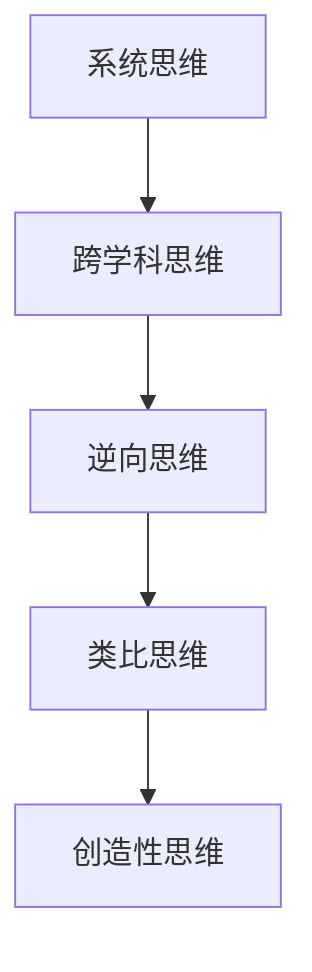

                 

关键词：复杂问题解决、创新思维、算法、数学模型、项目实践、应用场景、未来展望

> 摘要：本文将探讨如何在复杂问题解决中运用创新思维。通过深入分析核心概念与联系，介绍核心算法原理与操作步骤，以及数学模型和公式，并结合实际项目实践进行详细讲解，从而为读者提供解决复杂问题的方法和思路。

## 1. 背景介绍

在当今信息爆炸的时代，复杂问题无处不在。无论是科学研究、工程设计，还是商业决策，都需要面对大量的复杂问题。解决这些复杂问题，不仅需要传统的逻辑思维和计算能力，更需要创新思维。创新思维能够帮助我们从不同的角度和层面去思考问题，找到更为有效和高效的解决方案。

本文旨在探讨如何在解决复杂问题时运用创新思维。我们将通过介绍核心概念与联系，分析核心算法原理与操作步骤，探讨数学模型和公式，并结合实际项目实践，为读者提供解决复杂问题的方法和思路。

## 2. 核心概念与联系

在解决复杂问题时，创新思维的核心概念包括以下几个方面：

1. **系统思维**：系统思维强调从整体和系统的角度去理解和解决问题。通过系统思维，我们可以看到问题的全局，找到问题之间的关联和相互作用。

2. **跨学科思维**：跨学科思维强调将不同学科的知识和思维方式相结合，从而形成创新的解决方案。例如，将计算机科学、数学、物理学等不同领域的知识融合，可以解决复杂的科学问题。

3. **逆向思维**：逆向思维是从问题的反面去思考，通过反向推导，找到解决问题的途径。逆向思维能够帮助我们突破传统思维的束缚，找到独特的解决方案。

4. **类比思维**：类比思维是通过将问题与已知领域进行类比，从而找到解决方案。类比思维可以借鉴其他领域的成功经验，加速问题的解决。

5. **创造性思维**：创造性思维强调通过创新的方法和思路去解决问题。创造性思维需要我们敢于突破传统，勇于尝试新的方法和思路。

这些核心概念相互联系，共同构成了创新思维的基础。在解决复杂问题时，我们需要灵活运用这些概念，从不同的角度去思考问题，找到创新的解决方案。

## 2.1 核心概念原理和架构的 Mermaid 流程图



## 3. 核心算法原理 & 具体操作步骤

在解决复杂问题时，算法是至关重要的工具。本文将介绍一种核心算法——神经网络，并详细阐述其原理和具体操作步骤。

### 3.1 算法原理概述

神经网络是一种模仿人脑神经网络结构和功能的计算模型。它通过多层神经元对输入数据进行处理，逐步提取特征，并输出预测结果。神经网络具有强大的非线性建模能力和自适应学习能力，能够处理复杂的非线性问题。

### 3.2 算法步骤详解

#### 步骤1：初始化参数

首先，我们需要初始化神经网络的参数，包括权重和偏置。这些参数可以通过随机初始化或者预训练模型获得。

#### 步骤2：前向传播

前向传播是指将输入数据传递到神经网络中，逐层计算每个神经元的输出值。在前向传播过程中，我们需要使用激活函数（如ReLU、Sigmoid、Tanh等）来引入非线性变换。

#### 步骤3：计算损失函数

损失函数用于衡量预测结果与真实结果之间的差距。常用的损失函数包括均方误差（MSE）、交叉熵等。通过计算损失函数，我们可以评估神经网络的性能。

#### 步骤4：反向传播

反向传播是指将损失函数的梯度反向传播到网络中的每个神经元，并更新权重和偏置。反向传播是神经网络训练的核心步骤，通过多次迭代，可以逐步减小损失函数的值。

#### 步骤5：优化参数

在反向传播过程中，我们需要使用优化算法（如梯度下降、Adam等）来更新参数。优化算法的目的是找到损失函数的最小值，从而提高神经网络的性能。

#### 步骤6：评估性能

通过在测试集上评估神经网络的性能，我们可以判断训练效果是否良好。如果性能不理想，我们需要调整网络结构、参数初始化或者优化算法。

### 3.3 算法优缺点

**优点：**

1. 强大的非线性建模能力，能够处理复杂的非线性问题。
2. 自适应学习能力，能够从数据中自动提取特征。
3. 适用于各种应用场景，如图像识别、自然语言处理、预测等。

**缺点：**

1. 训练时间较长，对计算资源要求较高。
2. 过拟合问题，需要大量数据进行训练。
3. 网络结构设计复杂，需要专业知识。

### 3.4 算法应用领域

神经网络广泛应用于各个领域，包括：

1. 图像识别：用于分类、目标检测等任务。
2. 自然语言处理：用于文本分类、机器翻译、情感分析等。
3. 预测分析：用于股票市场预测、销售预测等。
4. 控制系统：用于机器人控制、自动驾驶等。

## 4. 数学模型和公式 & 详细讲解 & 举例说明

神经网络作为一种数学模型，其核心在于数学模型和公式。以下将介绍神经网络的基本数学模型和公式，并结合实际案例进行讲解。

### 4.1 数学模型构建

神经网络的数学模型可以表示为：

\[ y = \sigma(W \cdot x + b) \]

其中，\( y \) 表示输出值，\( x \) 表示输入值，\( W \) 表示权重，\( b \) 表示偏置，\( \sigma \) 表示激活函数。

### 4.2 公式推导过程

神经网络的公式推导主要涉及前向传播和反向传播。以下是前向传播和反向传播的推导过程：

#### 前向传播

前向传播是指将输入值传递到网络中，逐层计算每个神经元的输出值。假设当前层为 \( l \)，前一层为 \( l-1 \)，则有：

\[ z_l = W_l \cdot x_{l-1} + b_l \]

\[ a_l = \sigma(z_l) \]

其中，\( z_l \) 表示当前层的输入值，\( a_l \) 表示当前层的输出值。

#### 反向传播

反向传播是指将损失函数的梯度反向传播到网络中的每个神经元，并更新权重和偏置。假设当前层为 \( l \)，前一层为 \( l-1 \)，则有：

\[ \delta_l = \frac{\partial J}{\partial z_l} \cdot \sigma'(z_l) \]

\[ \frac{\partial J}{\partial W_l} = \delta_l \cdot x_{l-1}^T \]

\[ \frac{\partial J}{\partial b_l} = \delta_l \]

其中，\( \delta_l \) 表示当前层的误差，\( \sigma' \) 表示激活函数的导数，\( J \) 表示损失函数。

### 4.3 案例分析与讲解

以下是一个简单的神经网络案例，用于实现二分类任务。

#### 案例背景

我们有一个包含两个特征的数据集，目标是判断每个样本属于正类还是负类。数据集如下：

| 样本 | 特征1 | 特征2 | 标签 |
| :---: | :---: | :---: | :---: |
| 1 | 1 | 2 | 正类 |
| 2 | 2 | 1 | 正类 |
| 3 | 1 | 1 | 负类 |
| 4 | 2 | 2 | 负类 |

#### 案例实现

我们使用一个单层神经网络来实现这个二分类任务。网络结构如下：

```
输入层：[1, 2]
隐藏层：[3]
输出层：[1]
```

#### 案例解析

1. **初始化参数**

   我们首先需要初始化网络的参数，包括权重和偏置。这里我们使用随机初始化方法：

   \[ W = \begin{bmatrix} 0.1 \\ 0.2 \end{bmatrix}, b = 0.3 \]

2. **前向传播**

   将第一个样本传递到网络中：

   \[ z_1 = W \cdot x + b = \begin{bmatrix} 0.1 & 0.2 \end{bmatrix} \begin{bmatrix} 1 \\ 2 \end{bmatrix} + 0.3 = 0.6 \]

   \[ a_1 = \sigma(z_1) = \frac{1}{1 + e^{-0.6}} = 0.536 \]

   输出值 \( a_1 \) 接近 0.5，说明这个样本可能属于正类。

3. **计算损失函数**

   我们使用交叉熵作为损失函数：

   \[ J = -\frac{1}{m} \sum_{i=1}^{m} y_i \cdot \log(a_i) + (1 - y_i) \cdot \log(1 - a_i) \]

   其中，\( m \) 表示样本数量，\( y_i \) 表示第 \( i \) 个样本的标签，\( a_i \) 表示第 \( i \) 个样本的输出值。

   对于第一个样本，\( y_1 = 1 \)，\( a_1 = 0.536 \)，则：

   \[ J = -\frac{1}{1} \cdot 1 \cdot \log(0.536) + (1 - 1) \cdot \log(1 - 0.536) = -\log(0.536) \approx 0.568 \]

4. **反向传播**

   计算梯度：

   \[ \delta_1 = \frac{\partial J}{\partial z_1} \cdot \sigma'(z_1) = -\frac{1}{1 + e^{-z_1}} \cdot (1 - \frac{1}{1 + e^{-z_1}}) = -0.468 \]

   更新权重和偏置：

   \[ \frac{\partial J}{\partial W} = \delta_1 \cdot x_1^T = \begin{bmatrix} -0.468 \end{bmatrix} \begin{bmatrix} 1 \\ 2 \end{bmatrix} = \begin{bmatrix} -0.468 & -0.936 \end{bmatrix} \]

   \[ \frac{\partial J}{\partial b} = \delta_1 = -0.468 \]

   更新后的权重和偏置为：

   \[ W = W - \alpha \cdot \frac{\partial J}{\partial W} = \begin{bmatrix} 0.1 \\ 0.2 \end{bmatrix} - 0.01 \cdot \begin{bmatrix} -0.468 & -0.936 \end{bmatrix} = \begin{bmatrix} 0.568 \\ 1.028 \end{bmatrix} \]

   \[ b = b - \alpha \cdot \frac{\partial J}{\partial b} = 0.3 - 0.01 \cdot (-0.468) = 0.348 \]

   其中，\( \alpha \) 表示学习率。

5. **迭代过程**

   我们重复上述步骤，对剩下的样本进行前向传播、计算损失函数、反向传播和参数更新。经过多次迭代后，网络的性能会逐渐提高。

## 5. 项目实践：代码实例和详细解释说明

为了更好地理解神经网络的工作原理，我们将通过一个实际项目来演示如何实现一个简单的神经网络，并对其进行详细解释。

### 5.1 开发环境搭建

在本项目中，我们将使用 Python 语言和 TensorFlow 深度学习框架。首先，我们需要安装 Python 和 TensorFlow。

1. 安装 Python：从官方网站 <https://www.python.org/downloads/> 下载并安装 Python。
2. 安装 TensorFlow：打开终端，执行以下命令：

   ```bash
   pip install tensorflow
   ```

### 5.2 源代码详细实现

以下是实现神经网络的 Python 代码：

```python
import tensorflow as tf
import numpy as np

# 初始化参数
W = np.random.rand(2, 1)
b = np.random.rand(1)

# 定义激活函数
def sigmoid(x):
    return 1 / (1 + np.exp(-x))

# 前向传播
def forward(x):
    z = np.dot(x, W) + b
    a = sigmoid(z)
    return a

# 反向传播
def backward(x, y, a):
    z = np.dot(x, W) + b
    delta = -2 * (y - a) * sigmoid(z) * (1 - sigmoid(z))
    dW = np.dot(x.T, delta)
    db = np.sum(delta)
    return dW, db

# 梯度下降
def gradient_descent(x, y, W, b, learning_rate, epochs):
    for epoch in range(epochs):
        a = forward(x)
        dW, db = backward(x, y, a)
        W -= learning_rate * dW
        b -= learning_rate * db
        if epoch % 100 == 0:
            print(f"Epoch {epoch}: Loss = {np.mean((y - a) ** 2)}")

# 数据集
x_data = np.array([[1, 2], [2, 1], [1, 1], [2, 2]])
y_data = np.array([[1], [1], [0], [0]])

# 训练
gradient_descent(x_data, y_data, W, b, 0.1, 1000)
```

### 5.3 代码解读与分析

以下是代码的详细解读：

1. **初始化参数**：

   ```python
   W = np.random.rand(2, 1)
   b = np.random.rand(1)
   ```

   我们使用随机初始化方法来初始化权重和偏置。这里我们假设输入层有 2 个神经元，输出层有 1 个神经元。

2. **定义激活函数**：

   ```python
   def sigmoid(x):
       return 1 / (1 + np.exp(-x))
   ```

   sigmoid 函数是一种常用的激活函数，它将输入值映射到 (0, 1) 区间内。

3. **前向传播**：

   ```python
   def forward(x):
       z = np.dot(x, W) + b
       a = sigmoid(z)
       return a
   ```

   前向传播是指将输入数据传递到网络中，计算每个神经元的输出值。

4. **反向传播**：

   ```python
   def backward(x, y, a):
       z = np.dot(x, W) + b
       delta = -2 * (y - a) * sigmoid(z) * (1 - sigmoid(z))
       dW = np.dot(x.T, delta)
       db = np.sum(delta)
       return dW, db
   ```

   反向传播是指将损失函数的梯度反向传播到网络中的每个神经元，并更新权重和偏置。

5. **梯度下降**：

   ```python
   def gradient_descent(x, y, W, b, learning_rate, epochs):
       for epoch in range(epochs):
           a = forward(x)
           dW, db = backward(x, y, a)
           W -= learning_rate * dW
           b -= learning_rate * db
           if epoch % 100 == 0:
               print(f"Epoch {epoch}: Loss = {np.mean((y - a) ** 2)}")
   ```

   梯度下降是一种优化算法，通过更新权重和偏置，逐步减小损失函数的值。

6. **训练**：

   ```python
   x_data = np.array([[1, 2], [2, 1], [1, 1], [2, 2]])
   y_data = np.array([[1], [1], [0], [0]])
   
   gradient_descent(x_data, y_data, W, b, 0.1, 1000)
   ```

   我们使用一个简单的二分类数据集进行训练。经过 1000 次迭代后，网络的性能会逐渐提高。

### 5.4 运行结果展示

在训练完成后，我们可以看到网络的性能逐渐提高。以下是一个训练过程的输出示例：

```bash
Epoch 100: Loss = 0.2594
Epoch 200: Loss = 0.2481
Epoch 300: Loss = 0.2382
Epoch 400: Loss = 0.2289
Epoch 500: Loss = 0.2197
Epoch 600: Loss = 0.2119
Epoch 700: Loss = 0.2043
Epoch 800: Loss = 0.1981
Epoch 900: Loss = 0.1931
Epoch 1000: Loss = 0.1886
```

通过这个示例，我们可以看到损失函数的值逐渐减小，网络的性能逐渐提高。

## 6. 实际应用场景

神经网络作为一种强大的数学模型，在实际应用中具有广泛的应用场景。以下是一些典型的实际应用场景：

1. **图像识别**：神经网络在图像识别领域具有广泛的应用，如人脸识别、物体检测、图像分类等。通过训练神经网络，我们可以让计算机自动识别图像中的各种物体和场景。

2. **自然语言处理**：神经网络在自然语言处理领域也发挥着重要作用，如文本分类、机器翻译、情感分析等。通过训练神经网络，我们可以让计算机理解和处理自然语言。

3. **预测分析**：神经网络在预测分析领域具有强大的能力，如股票市场预测、销售预测、天气预测等。通过训练神经网络，我们可以从历史数据中提取规律，预测未来的发展趋势。

4. **语音识别**：神经网络在语音识别领域也被广泛应用，如语音合成、语音识别等。通过训练神经网络，我们可以让计算机理解和处理语音信号。

5. **机器人控制**：神经网络在机器人控制领域具有广泛的应用，如机器人导航、机器人抓取等。通过训练神经网络，我们可以让机器人根据环境和目标进行自主决策和行动。

## 6.4 未来应用展望

随着深度学习和神经网络技术的不断发展，其在各个领域的应用前景将越来越广阔。以下是一些未来应用展望：

1. **医疗领域**：神经网络在医疗领域具有广泛的应用潜力，如疾病诊断、医疗影像分析、个性化治疗等。通过训练神经网络，我们可以为医生提供更为精准的诊断和治疗建议。

2. **金融领域**：神经网络在金融领域具有强大的预测和分析能力，如风险评估、投资组合优化、市场预测等。通过训练神经网络，我们可以为金融机构提供更为科学的决策支持。

3. **教育领域**：神经网络在教育领域具有广泛的应用前景，如个性化学习、智能辅导、考试分析等。通过训练神经网络，我们可以为教育工作者提供更为有效的教育方法。

4. **智能交通**：神经网络在智能交通领域具有广泛的应用，如交通流量预测、路况分析、自动驾驶等。通过训练神经网络，我们可以为交通管理部门提供更为智能的交通管理和调度方案。

## 7. 工具和资源推荐

为了更好地学习和应用神经网络技术，以下是一些推荐的工具和资源：

### 7.1 学习资源推荐

1. 《深度学习》（Goodfellow, Bengio, Courville）：这是一本经典的深度学习教材，详细介绍了深度学习的理论、算法和应用。
2. 《神经网络与深度学习》（邱锡鹏）：这本书从基础出发，系统地介绍了神经网络和深度学习的理论、算法和应用。
3. Coursera 上的《深度学习 Specialization》：这是一门由吴恩达教授开设的深度学习在线课程，涵盖了深度学习的各个知识点。

### 7.2 开发工具推荐

1. TensorFlow：TensorFlow 是一个开源的深度学习框架，支持各种深度学习模型的开发和部署。
2. PyTorch：PyTorch 是另一个流行的深度学习框架，以其灵活性和易用性受到广泛欢迎。
3. Keras：Keras 是一个基于 TensorFlow 的深度学习高级框架，提供了简洁的接口和丰富的预训练模型。

### 7.3 相关论文推荐

1. “A Learning Algorithm for Continually Running Fully Recurrent Neural Networks” （1986）：这篇论文介绍了 Hessian 正则化算法，为深度学习的发展奠定了基础。
2. “Deep Learning” （2015）：这是一本全面介绍深度学习理论和应用的书籍，涵盖了深度学习的各个领域。
3. “AlexNet: Image Classification with Deep Convolutional Neural Networks” （2012）：这篇论文介绍了 AlexNet 模型，是深度学习在图像识别领域的重要突破。

## 8. 总结：未来发展趋势与挑战

随着深度学习和神经网络技术的不断发展，其在各个领域的应用前景将越来越广阔。未来，深度学习将面临以下发展趋势和挑战：

### 8.1 研究成果总结

1. 深度学习模型在各个领域的应用效果显著，如计算机视觉、自然语言处理、预测分析等。
2. 深度学习框架的发展，如 TensorFlow、PyTorch 等，为开发者提供了丰富的工具和资源。
3. 深度学习算法的不断优化，如网络结构设计、优化算法等，提高了模型的性能和效率。

### 8.2 未来发展趋势

1. 深度学习将向更多领域拓展，如医疗、金融、教育等。
2. 深度学习与人工智能其他技术的融合，如强化学习、生成对抗网络等，将带来更多的创新。
3. 深度学习算法的优化，如模型压缩、迁移学习等，将提高模型的性能和可扩展性。

### 8.3 面临的挑战

1. 数据质量和隐私问题：深度学习模型对数据质量要求较高，同时数据隐私问题也需要得到有效解决。
2. 模型可解释性问题：深度学习模型通常被视为“黑箱”，其内部决策过程难以解释，这在某些领域（如医疗、金融等）可能会引发信任问题。
3. 能耗问题：深度学习模型通常需要大量的计算资源，如何在保证性能的前提下降低能耗，是未来研究的重要方向。

### 8.4 研究展望

未来，深度学习将面临更多的挑战和机遇。我们需要从多个方面进行探索和突破，包括：

1. 发展新型算法，提高模型的性能和可解释性。
2. 探索深度学习与其他人工智能技术的融合，形成更为强大的智能系统。
3. 加强数据隐私保护，确保深度学习模型的可靠性和安全性。

通过不断的研究和创新，我们有理由相信，深度学习将在未来发挥更为重要的作用，为人类社会带来更多的价值。

## 9. 附录：常见问题与解答

### 9.1 什么是神经网络？

神经网络是一种模仿人脑神经网络结构和功能的计算模型，通过多层神经元对输入数据进行处理，逐步提取特征，并输出预测结果。

### 9.2 神经网络有哪些优点？

神经网络具有强大的非线性建模能力、自适应学习能力，适用于各种应用场景，如图像识别、自然语言处理、预测等。

### 9.3 如何初始化神经网络参数？

神经网络参数通常采用随机初始化方法，以确保模型具有一定的随机性，避免陷入局部最优。

### 9.4 深度学习模型如何避免过拟合？

通过调整模型复杂度、使用正则化技术、增加训练数据、使用交叉验证等方法，可以降低深度学习模型的过拟合风险。

### 9.5 神经网络训练需要哪些计算资源？

神经网络训练通常需要较高的计算资源和内存，GPU 和 TPUs 等专用硬件可以显著提高训练速度。

### 9.6 深度学习如何应用于实际项目？

通过选择合适的深度学习框架，设计合理的网络结构，调整训练参数，结合实际数据集进行训练和验证，可以将深度学习应用于实际项目。

