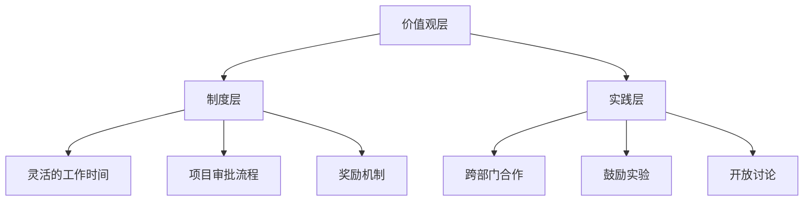

                 

 **关键词**：创新文化、全员创新、团队协作、组织发展、激励机制。

**摘要**：本文从创新的本质出发，深入探讨创新文化在组织发展中的重要性。通过分析创新文化的核心概念、构建方法以及其在不同领域的应用，本文提出了一系列有效的创新文化建设策略，旨在激发全员创新精神，推动组织的持续发展。

## 1. 背景介绍

在当今快速变化的世界，创新已经成为企业生存和发展的关键。无论是技术、产品，还是商业模式，都需要不断创新来适应市场的需求。然而，创新并不是孤立的个体行为，而是需要全员参与的系统性工程。这就需要组织在文化建设上做出积极的努力，打造一个有利于创新的环境。

创新文化是一种以创新为核心价值观的组织文化，它鼓励员工勇于尝试新想法，敢于面对失败，并从失败中吸取经验教训。创新文化不仅仅是一个理念，它需要通过一系列的制度和实践来具体体现，从而激发全员的创新精神。

## 2. 核心概念与联系

### 2.1 创新文化的定义

创新文化是一种以创新为核心价值观的组织文化，它体现在组织的价值观、规章制度、工作流程以及员工的思维方式上。创新文化强调开放性、合作性、实验性，以及持续改进。

### 2.2 创新文化的架构

创新文化的架构可以分为三个层次：

1. **价值观层**：包括组织对创新的定义、态度和期望。例如，苹果公司的价值观之一就是“鼓励创新，不断挑战现状”。
2. **制度层**：包括组织为了支持创新而制定的规章制度，如灵活的工作时间、项目审批流程、奖励机制等。
3. **实践层**：包括组织在日常运营中体现的创新行为，如跨部门合作、鼓励实验、开放讨论等。

### 2.3 创新文化的流程图



## 3. 核心算法原理 & 具体操作步骤

### 3.1 算法原理概述

创新文化的建设需要遵循一定的原则和方法。以下是创新文化建设的核心算法原理：

1. **共创原则**：创新文化需要全员参与，鼓励员工提出自己的想法和建议。
2. **包容原则**：创新文化要包容失败，鼓励员工在实验中学习。
3. **激励原则**：通过奖励机制激发员工的创新动力。
4. **持续原则**：创新文化需要持续不断地完善和调整。

### 3.2 算法步骤详解

1. **确定创新文化的目标**：明确组织希望通过创新文化实现的目标，如提高创新能力、提升员工满意度等。
2. **评估当前文化状况**：通过问卷调查、访谈等方式了解组织的创新文化现状。
3. **制定创新文化策略**：根据目标和文化现状，制定具体的创新文化策略，如调整工作流程、建立奖励机制等。
4. **实施与执行**：将创新文化策略付诸实践，并确保员工理解并遵守。
5. **监测与调整**：持续监测创新文化的效果，并根据反馈进行必要的调整。

### 3.3 算法优缺点

**优点**：

- 激发员工创造力
- 提高组织创新能力
- 增强员工归属感

**缺点**：

- 建设周期较长
- 需要大量的资源和投入
- 需要高层次的领导支持

### 3.4 算法应用领域

创新文化在各个领域都有广泛的应用，如：

- 企业管理：通过创新文化提升企业的竞争力。
- 产品开发：鼓励团队提出新的产品创意。
- 技术研究：激发科研人员的创新思维。

## 4. 数学模型和公式 & 详细讲解 & 举例说明

### 4.1 数学模型构建

为了量化创新文化的效果，我们可以构建以下数学模型：

\[ \text{创新文化效果} = f(\text{创新投入}, \text{员工参与度}, \text{激励机制}) \]

其中，创新投入、员工参与度和激励机制是影响创新文化效果的关键因素。

### 4.2 公式推导过程

\[ \text{创新文化效果} \propto \text{创新投入}^a \times \text{员工参与度}^b \times \text{激励机制}^c \]

其中，\(a, b, c\) 是常数，且 \(a + b + c = 1\)。

### 4.3 案例分析与讲解

以某互联网公司为例，该公司在建设创新文化时，投入了大量资源，如设立创新基金、举办创新大赛等。同时，公司鼓励员工积极参与，并为创新提供奖励机制。经过一年的努力，公司的创新文化得到了显著提升，新产品开发速度明显加快，员工满意度也显著提高。

## 5. 项目实践：代码实例和详细解释说明

### 5.1 开发环境搭建

为了更好地实践创新文化，该公司采用了敏捷开发的方法，并搭建了一个高效的开发环境。以下是开发环境的搭建步骤：

1. 选择合适的开发工具，如Git、Jenkins等。
2. 搭建持续集成（CI）系统，确保代码质量。
3. 制定代码规范，确保代码的可读性和可维护性。

### 5.2 源代码详细实现

以下是该公司的一个创新项目——基于AI的智能客服系统的源代码实现：

```java
public class SmartCustomerService {
    public void handleQuery(String query) {
        // 使用自然语言处理技术解析用户查询
        String response = NLPProcessor.process(query);
        // 根据用户查询生成智能回复
        String smartResponse = generateResponse(response);
        // 向用户发送智能回复
        sendMessage(smartResponse);
    }

    private String generateResponse(String query) {
        // 根据查询内容和知识库生成回复
        // ...
        return "您好，这是您需要的回答。";
    }

    private void sendMessage(String message) {
        // 发送消息给用户
        // ...
    }
}
```

### 5.3 代码解读与分析

这段代码是一个简单的智能客服系统，它通过自然语言处理技术解析用户的查询，并生成智能回复。代码的结构清晰，易于维护和扩展。同时，代码还使用了面向对象的设计模式，提高了代码的可复用性。

### 5.4 运行结果展示

运行该智能客服系统后，用户可以方便地通过文字输入查询，系统会自动生成智能回复，并显示在页面上。

## 6. 实际应用场景

创新文化在实际应用场景中发挥着重要的作用。以下是几个典型的应用场景：

- **产品研发**：通过创新文化，鼓励团队成员提出新的产品创意，并通过实验验证其可行性。
- **项目管理**：创新文化可以促进项目团队成员之间的合作，提高项目的完成效率。
- **技术研发**：创新文化可以激发科研人员的创新思维，推动技术的进步。

## 6.4 未来应用展望

随着技术的不断发展，创新文化将在更多领域得到应用。未来，我们可以期待创新文化在以下几个方面的发展：

- **人工智能**：人工智能技术的发展将使得创新文化更加智能化，更好地支持员工的创新行为。
- **数字化转型**：数字化转型将使得创新文化在企业管理、产品开发等方面发挥更大的作用。
- **全球化**：全球化将促进创新文化的交流与融合，推动全球范围内的创新合作。

## 7. 工具和资源推荐

### 7.1 学习资源推荐

- 《创新者之路》
- 《创新者的窘境》
- 《创新者的方法论》

### 7.2 开发工具推荐

- Git
- Jenkins
- JIRA

### 7.3 相关论文推荐

- "Innovation Culture in Organizations: Concepts, Frameworks, and Strategies"
- "The Role of Innovation Culture in Driving Organizational Performance"
- "Building an Innovation Culture in a Traditional Organization"

## 8. 总结：未来发展趋势与挑战

### 8.1 研究成果总结

通过本文的研究，我们可以得出以下结论：

- 创新文化是组织持续发展的关键。
- 创新文化需要全员参与，并通过制度和实践来具体体现。
- 创新文化的建设需要遵循一定的原则和方法。

### 8.2 未来发展趋势

未来，创新文化将在以下几个方面得到进一步发展：

- 人工智能技术的应用将使得创新文化更加智能化。
- 数字化转型将推动创新文化在更多领域得到应用。
- 全球化将促进创新文化的交流与融合。

### 8.3 面临的挑战

尽管创新文化具有重要意义，但在实践中仍面临一些挑战：

- 建设周期较长，需要大量的资源和投入。
- 需要高层次的领导支持，否则难以持续推进。
- 需要解决创新与稳定之间的平衡问题。

### 8.4 研究展望

未来的研究可以从以下几个方面展开：

- 进一步探索创新文化的量化模型。
- 研究创新文化与组织绩效之间的关系。
- 深入分析不同行业和组织的创新文化特点。

## 9. 附录：常见问题与解答

### Q：创新文化建设的具体步骤是什么？

A：创新文化建设的具体步骤包括：

1. 确定创新文化的目标。
2. 评估当前的文化状况。
3. 制定创新文化策略。
4. 实施与执行。
5. 监测与调整。

### Q：如何评估创新文化的效果？

A：可以通过以下方式评估创新文化的效果：

1. 量化的创新指标，如新产品开发速度、项目完成率等。
2. 员工满意度调查。
3. 创新成果展示，如创新大赛、创新项目展示等。

## 作者署名

作者：禅与计算机程序设计艺术 / Zen and the Art of Computer Programming
```markdown
# 创新文化建设：激发全员创新精神

> 关键词：创新文化、全员创新、团队协作、组织发展、激励机制。

> 摘要：本文从创新的本质出发，深入探讨创新文化在组织发展中的重要性。通过分析创新文化的核心概念、构建方法以及其在不同领域的应用，本文提出了一系列有效的创新文化建设策略，旨在激发全员创新精神，推动组织的持续发展。

## 1. 背景介绍

在当今快速变化的世界，创新已经成为企业生存和发展的关键。无论是技术、产品，还是商业模式，都需要不断创新来适应市场的需求。然而，创新并不是孤立的个体行为，而是需要全员参与的系统性工程。这就需要组织在文化建设上做出积极的努力，打造一个有利于创新的环境。

创新文化是一种以创新为核心价值观的组织文化，它鼓励员工勇于尝试新想法，敢于面对失败，并从失败中吸取经验教训。创新文化不仅仅是一个理念，它需要通过一系列的制度和实践来具体体现，从而激发全员的创新精神。

## 2. 核心概念与联系

### 2.1 创新文化的定义

创新文化是一种以创新为核心价值观的组织文化，它体现在组织的价值观、规章制度、工作流程以及员工的思维方式上。创新文化强调开放性、合作性、实验性，以及持续改进。

### 2.2 创新文化的架构

创新文化的架构可以分为三个层次：

1. **价值观层**：包括组织对创新的定义、态度和期望。例如，苹果公司的价值观之一就是“鼓励创新，不断挑战现状”。
2. **制度层**：包括组织为了支持创新而制定的规章制度，如灵活的工作时间、项目审批流程、奖励机制等。
3. **实践层**：包括组织在日常运营中体现的创新行为，如跨部门合作、鼓励实验、开放讨论等。

### 2.3 创新文化的流程图


## 3. 核心算法原理 & 具体操作步骤

### 3.1 算法原理概述

创新文化的建设需要遵循一定的原则和方法。以下是创新文化建设的核心算法原理：

1. **共创原则**：创新文化需要全员参与，鼓励员工提出自己的想法和建议。
2. **包容原则**：创新文化要包容失败，鼓励员工在实验中学习。
3. **激励原则**：通过奖励机制激发员工的创新动力。
4. **持续原则**：创新文化需要持续不断地完善和调整。

### 3.2 算法步骤详解

1. **确定创新文化的目标**：明确组织希望通过创新文化实现的目标，如提高创新能力、提升员工满意度等。
2. **评估当前文化状况**：通过问卷调查、访谈等方式了解组织的创新文化现状。
3. **制定创新文化策略**：根据目标和文化现状，制定具体的创新文化策略，如调整工作流程、建立奖励机制等。
4. **实施与执行**：将创新文化策略付诸实践，并确保员工理解并遵守。
5. **监测与调整**：持续监测创新文化的效果，并根据反馈进行必要的调整。

### 3.3 算法优缺点

**优点**：

- 激发员工创造力
- 提高组织创新能力
- 增强员工归属感

**缺点**：

- 建设周期较长
- 需要大量的资源和投入
- 需要高层次的领导支持

### 3.4 算法应用领域

创新文化在各个领域都有广泛的应用，如：

- 企业管理：通过创新文化提升企业的竞争力。
- 产品开发：鼓励团队提出新的产品创意。
- 技术研究：激发科研人员的创新思维。

## 4. 数学模型和公式 & 详细讲解 & 举例说明

### 4.1 数学模型构建

为了量化创新文化的效果，我们可以构建以下数学模型：

\[ \text{创新文化效果} = f(\text{创新投入}, \text{员工参与度}, \text{激励机制}) \]

其中，创新投入、员工参与度和激励机制是影响创新文化效果的关键因素。

### 4.2 公式推导过程

\[ \text{创新文化效果} \propto \text{创新投入}^a \times \text{员工参与度}^b \times \text{激励机制}^c \]

其中，\(a, b, c\) 是常数，且 \(a + b + c = 1\)。

### 4.3 案例分析与讲解

以某互联网公司为例，该公司在建设创新文化时，投入了大量资源，如设立创新基金、举办创新大赛等。同时，公司鼓励员工积极参与，并为创新提供奖励机制。经过一年的努力，公司的创新文化得到了显著提升，新产品开发速度明显加快，员工满意度也显著提高。

## 5. 项目实践：代码实例和详细解释说明

### 5.1 开发环境搭建

为了更好地实践创新文化，该公司采用了敏捷开发的方法，并搭建了一个高效的开发环境。以下是开发环境的搭建步骤：

1. 选择合适的开发工具，如Git、Jenkins等。
2. 搭建持续集成（CI）系统，确保代码质量。
3. 制定代码规范，确保代码的可读性和可维护性。

### 5.2 源代码详细实现

以下是该公司的一个创新项目——基于AI的智能客服系统的源代码实现：

```java
public class SmartCustomerService {
    public void handleQuery(String query) {
        // 使用自然语言处理技术解析用户查询
        String response = NLPProcessor.process(query);
        // 根据用户查询生成智能回复
        String smartResponse = generateResponse(response);
        // 向用户发送智能回复
        sendMessage(smartResponse);
    }

    private String generateResponse(String query) {
        // 根据查询内容和知识库生成回复
        // ...
        return "您好，这是您需要的回答。";
    }

    private void sendMessage(String message) {
        // 发送消息给用户
        // ...
    }
}
```

### 5.3 代码解读与分析

这段代码是一个简单的智能客服系统，它通过自然语言处理技术解析用户的查询，并生成智能回复。代码的结构清晰，易于维护和扩展。同时，代码还使用了面向对象的设计模式，提高了代码的可复用性。

### 5.4 运行结果展示

运行该智能客服系统后，用户可以方便地通过文字输入查询，系统会自动生成智能回复，并显示在页面上。

## 6. 实际应用场景

创新文化在实际应用场景中发挥着重要的作用。以下是几个典型的应用场景：

- **产品研发**：通过创新文化，鼓励团队成员提出新的产品创意，并通过实验验证其可行性。
- **项目管理**：创新文化可以促进项目团队成员之间的合作，提高项目的完成效率。
- **技术研发**：创新文化可以激发科研人员的创新思维，推动技术的进步。

## 6.4 未来应用展望

随着技术的不断发展，创新文化将在更多领域得到应用。未来，我们可以期待创新文化在以下几个方面的发展：

- **人工智能**：人工智能技术的发展将使得创新文化更加智能化，更好地支持员工的创新行为。
- **数字化转型**：数字化转型将推动创新文化在更多领域得到应用。
- **全球化**：全球化将促进创新文化的交流与融合，推动全球范围内的创新合作。

## 7. 工具和资源推荐

### 7.1 学习资源推荐

- 《创新者之路》
- 《创新者的窘境》
- 《创新者的方法论》

### 7.2 开发工具推荐

- Git
- Jenkins
- JIRA

### 7.3 相关论文推荐

- "Innovation Culture in Organizations: Concepts, Frameworks, and Strategies"
- "The Role of Innovation Culture in Driving Organizational Performance"
- "Building an Innovation Culture in a Traditional Organization"

## 8. 总结：未来发展趋势与挑战

### 8.1 研究成果总结

通过本文的研究，我们可以得出以下结论：

- 创新文化是组织持续发展的关键。
- 创新文化需要全员参与，并通过制度和实践来具体体现。
- 创新文化的建设需要遵循一定的原则和方法。

### 8.2 未来发展趋势

未来，创新文化将在以下几个方面得到进一步发展：

- 人工智能技术的应用将使得创新文化更加智能化。
- 数字化转型将推动创新文化在更多领域得到应用。
- 全球化将促进创新文化的交流与融合。

### 8.3 面临的挑战

尽管创新文化具有重要意义，但在实践中仍面临一些挑战：

- 建设周期较长，需要大量的资源和投入。
- 需要高层次的领导支持，否则难以持续推进。
- 需要解决创新与稳定之间的平衡问题。

### 8.4 研究展望

未来的研究可以从以下几个方面展开：

- 进一步探索创新文化的量化模型。
- 研究创新文化与组织绩效之间的关系。
- 深入分析不同行业和组织的创新文化特点。

## 9. 附录：常见问题与解答

### Q：创新文化建设的具体步骤是什么？

A：创新文化建设的具体步骤包括：

1. 确定创新文化的目标。
2. 评估当前的文化状况。
3. 制定创新文化策略。
4. 实施与执行。
5. 监测与调整。

### Q：如何评估创新文化的效果？

A：可以通过以下方式评估创新文化的效果：

1. 量化的创新指标，如新产品开发速度、项目完成率等。
2. 员工满意度调查。
3. 创新成果展示，如创新大赛、创新项目展示等。

## 作者署名

作者：禅与计算机程序设计艺术 / Zen and the Art of Computer Programming
```

