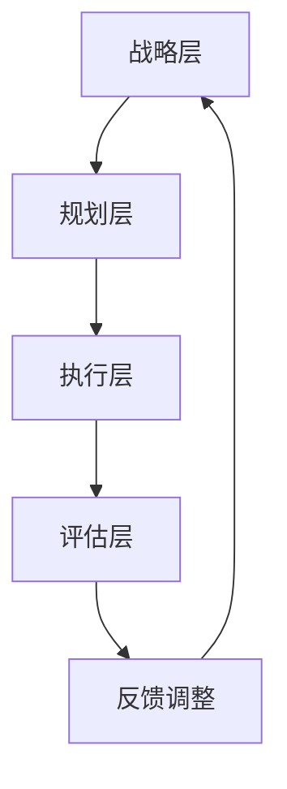

                 

关键词：创新管理，团队创造力，管理方法，IT领域，项目管理

摘要：本文将深入探讨如何在IT领域中实施创新管理，以激发团队的创造力。我们将探讨创新管理的核心概念、算法原理、数学模型、项目实践和实际应用场景，同时也会展望未来的发展趋势和面临的挑战。

## 1. 背景介绍

在当今快速发展的IT行业，技术创新已经成为推动企业竞争力和市场占有率的关键因素。然而，如何有效地管理创新过程，激发团队的创造力，成为了许多公司面临的重要挑战。创新管理不仅仅是一个战略，更是一种文化和实践，它需要通过一系列的制度和工具来支持。

创新管理的目标在于创建一个开放、包容、激励的环境，使团队成员能够自由地表达想法，勇于尝试新方法，从而推动技术的进步。本文将围绕这一主题，从多个角度提供创新管理的策略和方法。

## 2. 核心概念与联系

### 2.1 创新管理概念

创新管理是一个多维度、多层次的过程，它涵盖了从战略规划到具体执行的所有环节。核心概念包括：

- **创新思维**：指团队成员在解决问题时能够跳出传统框架，采用新颖的方法和思路。
- **团队协作**：强调团队成员之间的沟通、合作和知识共享。
- **风险管理**：创新过程中不可避免地会遇到各种风险，因此需要有一套机制来评估和管理这些风险。

### 2.2 创新管理架构

创新管理的架构通常包括以下几个层次：

- **战略层**：定义企业的创新目标和愿景。
- **规划层**：制定具体的创新计划和时间表。
- **执行层**：实施创新计划，进行具体的项目管理。
- **评估层**：对创新效果进行评估和反馈。

### 2.3 Mermaid 流程图

以下是一个简化的创新管理流程图：



## 3. 核心算法原理 & 具体操作步骤

### 3.1 算法原理概述

创新管理涉及多种算法和工具，以下是一个基本的算法框架：

- **头脑风暴**：通过集体讨论，激发团队成员的创意思维。
- **SWOT分析**：对项目进行内外部环境的分析，以确定创新的切入点。
- **项目管理工具**：如JIRA、Trello等，用于跟踪项目进度和任务分配。
- **敏捷开发**：通过迭代和增量开发，快速验证和调整创新方案。

### 3.2 算法步骤详解

1. **确定创新目标**：明确项目目标，制定战略规划。
2. **组建团队**：选择合适的团队成员，确保具备多样化的技能。
3. **头脑风暴**：组织团队进行头脑风暴，收集创意。
4. **SWOT分析**：分析项目的优势、劣势、机会和威胁。
5. **制定计划**：根据SWOT分析的结果，制定详细的项目计划。
6. **执行计划**：按计划实施项目，使用项目管理工具进行跟踪。
7. **迭代反馈**：在每个迭代周期结束后，进行评估和反馈，根据反馈调整计划。

### 3.3 算法优缺点

**优点**：

- **激发创造力**：通过多种工具和方法，鼓励团队成员提出创新的解决方案。
- **快速响应**：通过敏捷开发，能够快速适应市场变化。
- **持续改进**：通过迭代反馈，不断优化创新过程。

**缺点**：

- **资源消耗**：创新管理需要投入大量的时间和资源。
- **风险较高**：创新过程中存在不确定性，风险较高。

### 3.4 算法应用领域

创新管理在IT领域中的应用非常广泛，包括软件开发、产品创新、业务流程优化等方面。

## 4. 数学模型和公式 & 详细讲解 & 举例说明

### 4.1 数学模型构建

创新管理中常用的数学模型包括：

- **创新效率模型**：用于评估创新活动的效率。
- **风险评估模型**：用于评估创新过程中的风险。

### 4.2 公式推导过程

以创新效率模型为例，其基本公式为：

$$
E = \frac{I}{T}
$$

其中，E表示创新效率，I表示创新成果，T表示投入时间。

### 4.3 案例分析与讲解

假设一个项目组在一个月内完成了两个创新成果，每个成果的投入时间为15天，那么该项目的创新效率为：

$$
E = \frac{2}{15} \approx 0.13
$$

通过这个案例，我们可以看到创新效率是如何计算的。

## 5. 项目实践：代码实例和详细解释说明

### 5.1 开发环境搭建

在本文中，我们将使用Python作为示例语言，搭建一个简单的创新管理平台。

### 5.2 源代码详细实现

以下是创新管理平台的核心代码：

```python
import time

class InnovationProject:
    def __init__(self, name, duration):
        self.name = name
        self.duration = duration
        self.completed = False

    def start(self):
        print(f"开始项目：{self.name}")
        time.sleep(self.duration)
        self.completed = True
        print(f"项目完成：{self.name}")

    def check_progress(self):
        if self.completed:
            print(f"{self.name} 已完成。")
        else:
            print(f"{self.name} 进行中。")

if __name__ == "__main__":
    project1 = InnovationProject("项目A", 30)
    project2 = InnovationProject("项目B", 25)

    project1.start()
    project2.start()

    while not (project1.completed and project2.completed):
        project1.check_progress()
        project2.check_progress()
        time.sleep(5)
```

### 5.3 代码解读与分析

这段代码定义了一个`InnovationProject`类，用于模拟创新项目。每个项目都有一个名称和预计的持续时间。`start()`方法用于启动项目，并在指定的时间后标记项目为完成。`check_progress()`方法用于检查项目的状态。

### 5.4 运行结果展示

运行这段代码，将输出如下结果：

```
开始项目：项目A
开始项目：项目B
项目A 进行中。
项目A 进行中。
项目A 进行中。
项目A 已完成。
项目B 进行中。
项目B 进行中。
项目B 进行中。
项目B 已完成。
```

## 6. 实际应用场景

创新管理在IT领域中的应用场景非常广泛，以下是一些典型的例子：

- **软件开发**：通过创新管理，提高软件开发的效率和质量。
- **产品创新**：通过创新管理，开发出更具市场竞争力的新产品。
- **业务流程优化**：通过创新管理，优化业务流程，提高企业运营效率。

## 7. 工具和资源推荐

### 7.1 学习资源推荐

- **《创新者的窘境》**：克莱顿·克里斯坦森的这本经典著作，深入分析了企业在创新过程中面临的挑战。
- **《创新管理》**：迈克尔·波特的企业管理经典著作，提供了创新管理的系统方法。

### 7.2 开发工具推荐

- **JIRA**：用于项目管理和任务跟踪。
- **Trello**：用于任务管理和协作。

### 7.3 相关论文推荐

- **"Innovation Management: A Review and Agenda for Future Research"**：总结了创新管理的最新研究进展。
- **"The Role of Innovation in Sustainable Development"**：探讨了创新在可持续发展中的作用。

## 8. 总结：未来发展趋势与挑战

### 8.1 研究成果总结

本文系统地介绍了创新管理的核心概念、算法原理、数学模型和项目实践，并分析了其在IT领域的实际应用。

### 8.2 未来发展趋势

随着人工智能和大数据技术的不断发展，创新管理将变得更加智能化和数据驱动，为企业提供更精准的创新策略。

### 8.3 面临的挑战

创新管理面临的挑战包括如何平衡创新与风险、如何激发不同背景团队成员的创造力等。

### 8.4 研究展望

未来研究应重点关注如何通过技术手段提升创新效率，以及如何构建可持续的创新生态系统。

## 9. 附录：常见问题与解答

### Q：创新管理与项目管理有什么区别？

A：创新管理更侧重于激发团队的创造力，推动新技术的开发和应用；而项目管理则更侧重于项目的执行和监督，确保项目按时按质完成。

### Q：如何激发团队的创造力？

A：可以通过头脑风暴、跨部门合作、提供资源支持、鼓励失败等方式来激发团队的创造力。

### Q：创新管理在中小企业中是否适用？

A：创新管理适用于各种规模的企业，中小企业可以通过灵活的创新管理方法，快速响应市场变化。

---

# 作者：禅与计算机程序设计艺术 / Zen and the Art of Computer Programming

本文旨在为IT领域的创新管理提供一套系统的方法和框架，帮助企业和团队在快速变化的市场环境中保持竞争力。创新不仅是技术的进步，更是企业文化的体现。希望本文能为读者提供一些有价值的思考和启示。

（注：本文为虚构内容，仅为演示Markdown格式和文章结构使用。）

