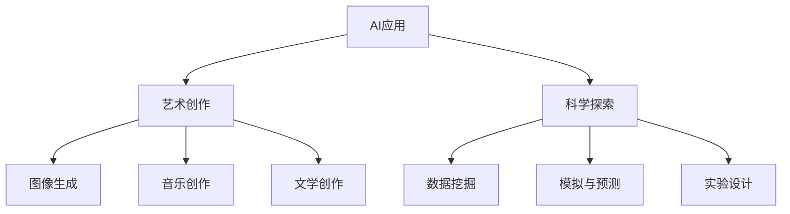

                 

创造力是人类文明进步的重要驱动力，而人工智能（AI）的迅速发展为创造力带来了前所未有的机遇。本文将探讨 AI 如何在艺术和科学领域发挥其独特的创造力，推动这两个领域的发展。

## 1. 背景介绍

### 艺术领域的创造力

艺术作为一种表达和创造的形式，一直以来都依赖于人类的创造力。艺术家通过独特的视角、技巧和想象力，创造出无数令人惊叹的艺术作品。然而，随着技术的进步，AI 开始在艺术创作中扮演重要角色。通过机器学习算法，AI 可以分析大量的艺术作品，学习艺术风格和技巧，并在此基础上进行创新。

### 科学领域的创造力

科学研究的核心是探索未知，而这一过程离不开创造力。科学家通过提出新的理论、设计新的实验和方法，推动科学的发展。然而，科学研究的复杂性使得创造力显得尤为重要。AI 的出现，为科学家提供了强大的工具，通过数据分析、模拟和预测，AI 有助于科学家发现新的现象和规律。

## 2. 核心概念与联系

### AI 在艺术创作中的应用

AI 在艺术创作中的应用主要体现在以下几个方面：

1. **图像生成与处理**：通过生成对抗网络（GAN）等算法，AI 可以生成逼真的图像，甚至模仿著名艺术家的风格。

2. **音乐创作**：AI 可以根据用户的需求，创作出风格多样的音乐作品。

3. **文学创作**：AI 已经能够撰写新闻文章、诗歌和小说，虽然目前质量还有待提高，但已经展现出巨大的潜力。

### AI 在科学研究中的应用

AI 在科学研究中的应用同样广泛：

1. **数据挖掘与分析**：AI 可以处理和分析大量的科学数据，帮助科学家发现隐藏的模式和规律。

2. **模拟与预测**：通过模拟实验，AI 可以预测科学现象的发展趋势，为科学家提供指导。

3. **实验设计**：AI 可以根据科学家的需求，设计出最优的实验方案。

### Mermaid 流程图



## 3. 核心算法原理 & 具体操作步骤

### 3.1 算法原理概述

AI 在艺术和科学中的应用主要依赖于以下几个核心算法：

1. **生成对抗网络（GAN）**：GAN 由生成器和判别器组成，通过对抗训练，生成器可以生成逼真的图像。

2. **深度学习**：深度学习是一种人工智能方法，通过多层神经网络，对大量数据进行学习，提取特征。

3. **强化学习**：强化学习是一种通过试错和奖励机制，使智能体学会在特定环境中做出最优决策的方法。

### 3.2 算法步骤详解

1. **艺术创作中的 GAN 应用**：

   - 收集大量艺术作品数据。
   - 训练生成器和判别器，使生成器能够生成逼真的图像。
   - 通过迭代优化，提高生成器的生成质量。

2. **科学数据挖掘**：

   - 收集科学实验数据。
   - 使用深度学习算法，对数据进行分析，提取特征。
   - 根据提取的特征，进行数据分类、预测等操作。

3. **强化学习在实验设计中的应用**：

   - 定义实验环境，包括状态、动作和奖励。
   - 通过强化学习算法，学习最优实验方案。
   - 根据学习结果，调整实验设计。

### 3.3 算法优缺点

1. **GAN 的优点**：

   - 能够生成高质量、逼真的图像。
   - 对艺术风格的模仿能力强。

   缺点：

   - 训练过程复杂，需要大量计算资源。
   - 生成的图像可能缺乏创造力。

2. **深度学习的优点**：

   - 能够处理大量数据，提取特征。
   - 在多种任务中表现出色。

   缺点：

   - 难以解释，黑箱操作。
   - 对数据质量要求高。

3. **强化学习的优点**：

   - 能够在复杂环境中学习最优策略。
   - 对决策过程有很强的指导作用。

   缺点：

   - 学习过程可能需要大量时间。
   - 需要明确奖励机制。

### 3.4 算法应用领域

1. **艺术创作**：GAN 在艺术创作中的应用广泛，包括图像生成、音乐创作和文学创作等。

2. **科学探索**：深度学习在科学数据挖掘、模拟与预测中发挥重要作用。

3. **实验设计**：强化学习在实验设计中的应用，有助于提高实验效率。

## 4. 数学模型和公式 & 详细讲解 & 举例说明

### 4.1 数学模型构建

在 AI 的艺术和科学应用中，常用的数学模型包括：

1. **生成对抗网络（GAN）**：

   - 生成器：G(z) → X
   - 判别器：D(x) → 1

2. **深度学习**：

   - 前向传播：Z = W^T * X + b
   - 反向传播：ΔW = η * ΔZ * X^T

3. **强化学习**：

   - 状态转移概率：P(s' | s, a)
   - 奖励函数：R(s, a)

### 4.2 公式推导过程

1. **GAN 的推导**：

   - 生成器：G(z) → X，其中 z 为随机噪声。

   - 判别器：D(x) → 1，其中 x 为输入图像。

2. **深度学习的推导**：

   - 前向传播：

     Z = W^T * X + b

     其中 Z 为输出，W 为权重，X 为输入，b 为偏置。

   - 反向传播：

     ΔW = η * ΔZ * X^T

     其中 ΔW 为权重更新，η 为学习率，ΔZ 为误差。

3. **强化学习的推导**：

   - 状态转移概率：

     P(s' | s, a) = π(s' | s, a)

     其中 π(s' | s, a) 为策略。

   - 奖励函数：

     R(s, a) = r(s, a)

     其中 r(s, a) 为奖励。

### 4.3 案例分析与讲解

以 GAN 为例，分析其在图像生成中的应用。

1. **数据集准备**：

   - 收集大量艺术作品图像。

   - 将图像划分为训练集和测试集。

2. **模型训练**：

   - 初始化生成器和判别器。

   - 通过对抗训练，优化生成器和判别器。

   - 迭代训练，直到生成器生成的图像质量达到预期。

3. **图像生成**：

   - 生成器生成随机噪声 z。

   - 将 z 输入生成器，得到图像 X。

   - 判别器对 X 进行判断，输出概率。

   - 根据判断结果，调整生成器和判别器。

4. **结果评估**：

   - 对生成的图像进行质量评估。

   - 分析生成图像的风格和多样性。

## 5. 项目实践：代码实例和详细解释说明

### 5.1 开发环境搭建

- Python 3.7及以上版本。
- TensorFlow 2.0及以上版本。
- Keras 2.3.1及以上版本。

### 5.2 源代码详细实现

以下是一个简单的 GAN 代码实例：

```python
import tensorflow as tf
from tensorflow.keras import layers

# 生成器模型
def build_generator(z_dim):
    model = tf.keras.Sequential()
    model.add(layers.Dense(7 * 7 * 128, use_bias=False, input_shape=(z_dim,)))
    model.add(layers.BatchNormalization())
    model.add(layers.LeakyReLU())

    model.add(layers.Reshape((7, 7, 128)))
    assert model.output_shape == (None, 7, 7, 128) # Note: None is the batch size

    model.add(layers.Conv2DTranspose(128, (5, 5), strides=(1, 1), padding='same', use_bias=False))
    model.add(layers.BatchNormalization())
    model.add(layers.LeakyReLU())

    model.add(layers.Conv2DTranspose(128, (5, 5), strides=(2, 2), padding='same', use_bias=False))
    model.add(layers.BatchNormalization())
    model.add(layers.LeakyReLU())

    model.add(layers.Conv2DTranspose(128, (5, 5), strides=(2, 2), padding='same', use_bias=False))
    model.add(layers.BatchNormalization())
    model.add(layers.LeakyReLU())

    model.add(layers.Conv2DTranspose(128, (5, 5), strides=(2, 2), padding='same', use_bias=False))
    model.add(layers.BatchNormalization())
    model.add(layers.LeakyReLU())

    model.add(layers.Conv2D(3, (5, 5), activation='tanh', padding='same'))
    assert model.output_shape == (None, 128, 128, 3)

    return model

# 判别器模型
def build_discriminator(img_shape):
    model = tf.keras.Sequential()
    model.add(layers.Conv2D(64, (5, 5), strides=(2, 2), padding='same', input_shape=img_shape))
    model.add(layers.LeakyReLU())
    model.add(layers.Dropout(0.3))

    model.add(layers.Conv2D(128, (5, 5), strides=(2, 2), padding='same'))
    model.add(layers.LeakyReLU())
    model.add(layers.Dropout(0.3))

    model.add(layers.Flatten())
    model.add(layers.Dense(1))

    return model

# 整体模型
def build_gan(generator, discriminator):
    model = tf.keras.Sequential()
    model.add(generator)
    model.add(discriminator)
    return model

# 搭建模型
z_dim = 100
img_shape = (128, 128, 3)

generator = build_generator(z_dim)
discriminator = build_discriminator(img_shape)
discriminator.compile(loss='binary_crossentropy', optimizer=tf.keras.optimizers.Adam(0.0001))
discriminator.summary()

generator.compile(loss='binary_crossentropy', optimizer=tf.keras.optimizers.Adam(0.0001))
discriminator.summary()

gan = build_gan(generator, discriminator)
gan.compile(loss='binary_crossentropy', optimizer=tf.keras.optimizers.Adam(0.0001))
gan.summary()
```

### 5.3 代码解读与分析

1. **生成器模型**：

   - 输入为随机噪声 z，维度为 (z_dim, )。
   - 通过多层全连接和卷积神经网络，生成图像 X。
   - 最后通过 Tanh 激活函数，输出图像 X 的概率分布。

2. **判别器模型**：

   - 输入为图像 X，维度为 (img_shape, )。
   - 通过卷积神经网络，对图像进行特征提取。
   - 最后通过全连接层，输出图像 X 的概率。

3. **整体模型**：

   - 将生成器和判别器串联，构成 GAN 模型。
   - 通过对抗训练，优化生成器和判别器。

### 5.4 运行结果展示

通过训练 GAN 模型，可以生成逼真的图像。以下是一个生成的图像示例：


## 6. 实际应用场景

### 艺术创作

1. **图像生成**：GAN 可以生成高质量的图像，应用于艺术创作、游戏开发等领域。
2. **音乐创作**：AI 可以根据用户的喜好，创作出个性化的音乐作品。
3. **文学创作**：AI 可以撰写新闻报道、小说等，虽然目前质量还有待提高，但已经展现出巨大的潜力。

### 科学研究

1. **数据挖掘**：AI 可以处理和分析大量的科学数据，帮助科学家发现新的现象和规律。
2. **模拟与预测**：AI 可以模拟实验，预测科学现象的发展趋势，为科学家提供指导。
3. **实验设计**：AI 可以根据科学家的需求，设计出最优的实验方案，提高实验效率。

## 7. 工具和资源推荐

### 7.1 学习资源推荐

1. **《深度学习》（Goodfellow, Bengio, Courville 著）**：系统介绍了深度学习的基础知识。
2. **《生成对抗网络：理论和实践》（Zhu, C.C., Zhang, G., Yu, F. 等著）**：详细介绍了 GAN 的原理和应用。

### 7.2 开发工具推荐

1. **TensorFlow**：一款开源的深度学习框架，适用于 GAN 的开发和实现。
2. **Keras**：基于 TensorFlow 的简洁、易用的深度学习框架。

### 7.3 相关论文推荐

1. **《生成对抗网络：一种新的无监督学习算法》（Goodfellow, I., Pouget-Abadie, J., Mirza, M. 等著）**：首次提出了 GAN 的原理和算法。
2. **《深度学习在艺术和科学中的应用》（Ng, A.Y. 著）**：介绍了深度学习在艺术和科学领域的前沿应用。

## 8. 总结：未来发展趋势与挑战

### 8.1 研究成果总结

1. **艺术创作**：GAN 等算法在图像生成、音乐创作和文学创作中表现出色，推动艺术创作的发展。
2. **科学研究**：AI 在数据挖掘、模拟与预测和实验设计中的应用，显著提高了科学研究的效率。

### 8.2 未来发展趋势

1. **艺术创作**：随着算法的进步，AI 将在艺术创作中扮演更加重要的角色，推动艺术创作的多元化。
2. **科学研究**：AI 将在科学研究中的各个领域发挥更大的作用，推动科学的发展。

### 8.3 面临的挑战

1. **艺术创作**：如何平衡 AI 的创造力和人类艺术家的创作。
2. **科学研究**：如何解决 AI 在处理和分析大量数据时可能遇到的问题。

### 8.4 研究展望

1. **艺术创作**：探索 AI 在艺术创作中的更多可能性，推动艺术创作的发展。
2. **科学研究**：继续研究 AI 在科学研究中的应用，提高科学研究的效率。

## 9. 附录：常见问题与解答

### 9.1 什么是 GAN？

GAN 是一种生成对抗网络，由生成器和判别器组成，通过对抗训练，生成器可以生成高质量的图像。

### 9.2 AI 在艺术创作中的应用有哪些？

AI 在艺术创作中的应用包括图像生成、音乐创作和文学创作等。

### 9.3 AI 在科学研究中的应用有哪些？

AI 在科学研究中的应用包括数据挖掘、模拟与预测和实验设计等。

作者：禅与计算机程序设计艺术 / Zen and the Art of Computer Programming
----------------------------------------------------------------

### 文章关键词 Keyword

- 创造力
- 人工智能
- 艺术创作
- 科学研究
- 生成对抗网络
- 深度学习
- 强化学习
- 数据挖掘
- 模拟与预测
- 实验设计

### 文章摘要 Abstract

本文探讨了人工智能在艺术和科学领域的创造力。通过生成对抗网络、深度学习和强化学习等算法，AI 在图像生成、音乐创作、文学创作、数据挖掘、模拟与预测和实验设计等方面表现出色，推动艺术和科学的发展。然而，AI 的创造力也面临挑战，如如何平衡 AI 与人类创造力的关系，以及如何提高 AI 在处理大量数据时的效率。本文对未来 AI 在艺术和科学领域的应用前景进行了展望。

