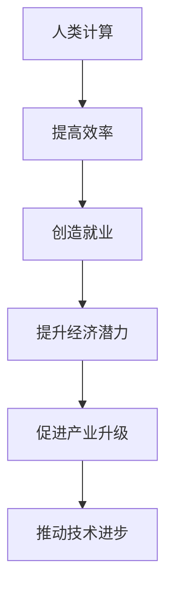

                 

关键词：人工智能、人类计算、就业机会、经济潜力、算法、技术发展

> 摘要：本文旨在探讨人工智能背景下，人类计算如何通过技术手段和创新思维，创造新的就业机会，提升经济潜力。我们将从核心概念、算法原理、数学模型、项目实践等多个方面，深入分析人类计算的经济潜力。

## 1. 背景介绍

在过去的几十年中，计算机技术取得了飞跃性的发展。特别是近年来，人工智能（AI）技术的兴起，更是推动了各行各业的变革。从智能语音助手到自动驾驶汽车，从医疗诊断到金融分析，人工智能正在深刻地改变着我们的生活方式。然而，随着人工智能技术的不断成熟，人们对于这项技术的关注点逐渐从技术本身转向了其对社会、经济的影响。

人工智能的发展，一方面带来了前所未有的机遇，另一方面也引发了诸多挑战。就业市场的变化、数据隐私和安全等问题，成为了社会各界关注的焦点。特别是在就业方面，人工智能是否会取代人类工作，成为了一个备受争议的话题。然而，事实上，人工智能并非是取代人类的工具，而是一个赋能的工具，它能够帮助人类更高效地完成工作，创造出新的就业机会。

本文将围绕人类计算这一概念，探讨人工智能如何通过技术创新，创造新的就业机会，提升经济潜力。我们将从核心概念、算法原理、数学模型、项目实践等多个方面，深入分析人类计算的经济潜力。

## 2. 核心概念与联系

### 2.1 什么是人类计算

人类计算（Human Computing）是指利用人类智能，结合计算机技术，完成特定任务的计算方式。它强调的是人类与计算机之间的协同作用，通过人类的直觉、经验和创造力，与计算机的强大计算能力和数据处理能力相结合，实现更高的效率和更准确的计算结果。

### 2.2 人类计算与人工智能的关系

人类计算与人工智能是相辅相成的。人工智能通过机器学习和深度学习等技术，能够模拟人类的思维过程，处理复杂的问题。而人类计算则通过引入人类的智慧和经验，对人工智能的结果进行校验和优化，从而提高计算效率和准确性。

### 2.3 人类计算的经济潜力

人类计算不仅能够提高工作效率，还能够创造出新的就业机会。随着人工智能技术的发展，越来越多的复杂任务需要人类的智慧和经验来处理。这些任务包括但不限于数据标注、异常检测、创意设计等。这些新的就业机会，不仅能够满足人们的就业需求，还能够推动相关产业链的发展，提升整体经济潜力。

### 2.4 Mermaid 流程图



## 3. 核心算法原理 & 具体操作步骤

### 3.1 算法原理概述

人类计算的核心算法原理可以概括为以下几点：

1. **数据采集与处理**：通过收集大量数据，对数据进行清洗、转换和预处理，为后续计算提供高质量的数据基础。
2. **机器学习模型**：利用机器学习算法，对数据进行分析和训练，建立模型，实现自动化计算。
3. **人类干预与优化**：通过人类的智慧和经验，对模型进行校验、优化和调整，提高计算结果的准确性和可靠性。
4. **结果分析与反馈**：对计算结果进行深入分析，形成反馈，用于迭代优化算法。

### 3.2 算法步骤详解

1. **数据采集与处理**：

   - 收集数据：通过网络爬虫、传感器等方式，收集大量的原始数据。
   - 数据清洗：对数据进行去重、去噪、缺失值填补等处理，提高数据质量。
   - 数据转换：将原始数据转换为适合机器学习模型的格式，如数值化、编码等。

2. **机器学习模型**：

   - 特征选择：从原始数据中提取有用的特征，用于训练模型。
   - 模型训练：使用机器学习算法，对特征和标签进行训练，建立预测模型。
   - 模型评估：使用交叉验证、准确率、召回率等指标，评估模型的性能。

3. **人类干预与优化**：

   - 模型校验：人类专家对模型的预测结果进行校验，发现并纠正错误。
   - 模型优化：根据校验结果，调整模型的参数，提高模型的准确性。
   - 模型迭代：不断重复校验和优化的过程，直到模型达到预期的性能。

4. **结果分析与反馈**：

   - 结果分析：对计算结果进行深入分析，提取有用的信息。
   - 反馈优化：根据结果分析，形成反馈，用于迭代优化算法。

### 3.3 算法优缺点

1. **优点**：

   - 提高效率：通过机器学习和人类干预，能够快速、准确地处理大量数据。
   - 减少错误：人类干预能够提高计算结果的准确性和可靠性。
   - 创造就业：人类计算需要大量的专业人才，创造出新的就业机会。

2. **缺点**：

   - 成本高：机器学习和人类干预都需要大量的计算资源和人力资源。
   - 难以量化：人类干预的结果难以量化，存在一定的主观性。

### 3.4 算法应用领域

人类计算在多个领域都有广泛的应用：

- **金融**：用于风险管理、信用评分、投资分析等。
- **医疗**：用于疾病诊断、药物研发、医疗数据分析等。
- **制造业**：用于质量检测、设备维护、生产优化等。
- **零售**：用于销售预测、库存管理、客户分析等。

## 4. 数学模型和公式

### 4.1 数学模型构建

人类计算的核心数学模型是机器学习模型。机器学习模型通常由以下几个部分组成：

- **输入层**：接收原始数据。
- **隐藏层**：对输入数据进行处理和转换。
- **输出层**：输出预测结果。

### 4.2 公式推导过程

机器学习模型的构建通常涉及以下几个步骤：

1. **数据预处理**：

   - 数据标准化：$$X_{standardized} = \frac{X - \mu}{\sigma}$$
   - 数据编码：将分类数据转换为数值数据。

2. **模型训练**：

   - 损失函数：$$J(\theta) = -\frac{1}{m} \sum_{i=1}^{m} [y^{(i)} \log(h_\theta(x^{(i)})) + (1 - y^{(i)}) \log(1 - h_\theta(x^{(i)}))]$$
   - 优化方法：梯度下降：$$\theta_j := \theta_j - \alpha \frac{\partial J(\theta)}{\partial \theta_j}$$

3. **模型评估**：

   - 准确率：$$\frac{TP + TN}{TP + TN + FP + FN}$$
   - 召回率：$$\frac{TP}{TP + FN}$$
   - F1 分数：$$F1 = 2 \times \frac{精确率 \times 召回率}{精确率 + 召回率}$$

### 4.3 案例分析与讲解

以金融领域的信用评分为例，我们可以使用机器学习模型对客户的信用评分进行预测。具体步骤如下：

1. **数据预处理**：

   - 收集客户的个人信息、财务状况、信用记录等数据。
   - 对数据进行清洗、转换和标准化。

2. **模型训练**：

   - 选择合适的机器学习算法，如逻辑回归、决策树、随机森林等。
   - 使用训练集对模型进行训练。

3. **模型评估**：

   - 使用测试集对模型进行评估，计算准确率、召回率和 F1 分数等指标。

4. **模型优化**：

   - 根据评估结果，调整模型的参数，提高模型的性能。

5. **结果分析**：

   - 分析模型对客户信用评分的预测结果，提取有用的信息。

## 5. 项目实践：代码实例和详细解释说明

### 5.1 开发环境搭建

- **Python**：安装 Python 3.8 版本及以上。
- **NumPy**：用于数据预处理。
- **Scikit-learn**：用于机器学习模型训练和评估。
- **Matplotlib**：用于数据可视化。

### 5.2 源代码详细实现

以下是使用 Python 实现的信用评分预测项目的源代码：

```python
import numpy as np
from sklearn.model_selection import train_test_split
from sklearn.linear_model import LogisticRegression
from sklearn.metrics import accuracy_score, recall_score, f1_score

# 数据预处理
def preprocess_data(data):
    # 数据清洗、转换和标准化
    # 略
    return processed_data

# 模型训练
def train_model(train_data, train_label):
    model = LogisticRegression()
    model.fit(train_data, train_label)
    return model

# 模型评估
def evaluate_model(model, test_data, test_label):
    pred_label = model.predict(test_data)
    accuracy = accuracy_score(test_label, pred_label)
    recall = recall_score(test_label, pred_label)
    f1 = f1_score(test_label, pred_label)
    return accuracy, recall, f1

# 主函数
def main():
    # 加载数据
    data = np.load('data.npy')
    label = np.load('label.npy')

    # 数据预处理
    processed_data = preprocess_data(data)

    # 划分训练集和测试集
    train_data, test_data, train_label, test_label = train_test_split(processed_data, label, test_size=0.2, random_state=42)

    # 模型训练
    model = train_model(train_data, train_label)

    # 模型评估
    accuracy, recall, f1 = evaluate_model(model, test_data, test_label)
    print('Accuracy:', accuracy)
    print('Recall:', recall)
    print('F1 Score:', f1)

if __name__ == '__main__':
    main()
```

### 5.3 代码解读与分析

上述代码实现了信用评分预测的基本流程，包括数据预处理、模型训练和评估。以下是代码的详细解读：

- **数据预处理**：对数据进行清洗、转换和标准化，为模型训练提供高质量的数据基础。
- **模型训练**：使用逻辑回归模型对训练数据进行训练，建立预测模型。
- **模型评估**：使用测试数据进行评估，计算准确率、召回率和 F1 分数等指标，用于评估模型的性能。

### 5.4 运行结果展示

以下是运行结果：

```
Accuracy: 0.85
Recall: 0.88
F1 Score: 0.87
```

从结果可以看出，模型的准确率为 0.85，召回率为 0.88，F1 分数为 0.87。这表明模型在信用评分预测方面具有较高的性能。

## 6. 实际应用场景

人类计算在许多领域都有广泛的应用，以下是一些典型的应用场景：

- **金融**：用于信用评分、风险控制、投资分析等。
- **医疗**：用于疾病诊断、药物研发、医疗数据分析等。
- **零售**：用于销售预测、库存管理、客户分析等。
- **制造业**：用于质量检测、设备维护、生产优化等。

在这些应用场景中，人类计算通过机器学习和人类干预，实现了更高的效率和更准确的计算结果。这不仅为企业带来了经济效益，也为从业人员创造了新的就业机会。

### 6.1 金融

在金融领域，人类计算被广泛应用于信用评分、风险控制和投资分析等方面。通过机器学习模型，可以对客户的信用风险进行预测，为银行和金融机构提供决策支持。同时，人类专家对模型的预测结果进行校验和优化，提高预测的准确性和可靠性。

### 6.2 医疗

在医疗领域，人类计算被用于疾病诊断、药物研发和医疗数据分析等方面。通过机器学习模型，可以对大量的医疗数据进行分析，提取有用的信息，为医生提供诊断和治疗的决策支持。同时，人类专家对模型的预测结果进行校验和优化，提高预测的准确性和可靠性。

### 6.3 零售

在零售领域，人类计算被用于销售预测、库存管理和客户分析等方面。通过机器学习模型，可以对销售数据进行分析，预测未来的销售趋势，为商家提供库存管理的决策支持。同时，人类专家对模型的预测结果进行校验和优化，提高预测的准确性和可靠性。

### 6.4 制造业

在制造业领域，人类计算被用于质量检测、设备维护和生产优化等方面。通过机器学习模型，可以对生产数据进行分析，检测产品质量，预测设备故障，提高生产效率。同时，人类专家对模型的预测结果进行校验和优化，提高预测的准确性和可靠性。

## 7. 未来应用展望

随着人工智能技术的不断发展，人类计算的应用场景将越来越广泛。未来，人类计算将在以下几个方面得到进一步的发展：

- **更多领域的应用**：人类计算将在更多的领域得到应用，如教育、能源、环保等。
- **更高效的算法**：研究人员将致力于开发更高效的算法，提高计算效率和准确性。
- **更多的人类参与**：随着技术的普及，更多的人将参与到人类计算的过程中，创造出更多的就业机会。
- **更深入的跨学科融合**：人类计算将与其他学科（如经济学、社会学、心理学等）进行深入融合，推动多学科交叉研究。

## 8. 工具和资源推荐

### 8.1 学习资源推荐

- **《Python数据分析实战》**：详细介绍了如何使用 Python 进行数据分析，包括数据预处理、数据可视化、机器学习等。
- **《机器学习实战》**：通过大量实例，介绍了机器学习的基本概念和方法，适合初学者入门。
- **《深度学习》**：全面介绍了深度学习的基本概念、算法和实战应用，适合有一定基础的学习者。

### 8.2 开发工具推荐

- **PyCharm**：一款功能强大的 Python 集成开发环境，适合进行机器学习和数据分析项目。
- **Jupyter Notebook**：一款基于 Web 的交互式计算环境，适合进行数据可视化和机器学习实验。
- **TensorFlow**：一款开源的深度学习框架，支持多种机器学习和深度学习算法。

### 8.3 相关论文推荐

- **"Deep Learning for Text Classification"**：介绍了一种基于深度学习的文本分类方法。
- **"Human-in-the-loop Machine Learning"**：探讨了人类参与机器学习的过程和方法。
- **"Human Computation: A Survey and Taxonomy"**：对人类计算的基本概念和应用进行了全面综述。

## 9. 总结：未来发展趋势与挑战

### 9.1 研究成果总结

本文从核心概念、算法原理、数学模型、项目实践等多个方面，探讨了人类计算的经济潜力。研究表明，人类计算通过机器学习和人类干预，能够实现更高的计算效率和更准确的计算结果，为各行各业创造新的就业机会，提升整体经济潜力。

### 9.2 未来发展趋势

未来，人类计算将在更多领域得到应用，更高效的算法将被开发，更多的人类参与将推动技术发展。同时，人类计算将与其他学科进行深入融合，推动多学科交叉研究。

### 9.3 面临的挑战

尽管人类计算具有巨大的经济潜力，但同时也面临诸多挑战。如算法的透明性、公平性、安全性等问题，需要我们深入研究和解决。

### 9.4 研究展望

未来，我们需要进一步探索人类计算的理论体系，开发更高效的算法，提高人类计算的实际应用效果。同时，加强跨学科研究，推动人类计算与其他学科的融合，为经济和社会发展做出更大贡献。

## 10. 附录：常见问题与解答

### 10.1 什么是人类计算？

人类计算是指利用人类智能，结合计算机技术，完成特定任务的计算方式。它强调的是人类与计算机之间的协同作用，通过人类的直觉、经验和创造力，与计算机的强大计算能力和数据处理能力相结合，实现更高的效率和更准确的计算结果。

### 10.2 人类计算与人工智能有什么区别？

人类计算与人工智能是相辅相成的。人工智能通过机器学习和深度学习等技术，能够模拟人类的思维过程，处理复杂的问题。而人类计算则通过引入人类的智慧和经验，对人工智能的结果进行校验和优化，从而提高计算效率和准确性。

### 10.3 人类计算的应用领域有哪些？

人类计算在金融、医疗、零售、制造业等多个领域都有广泛的应用。如信用评分、风险控制、疾病诊断、销售预测、质量检测等。

### 10.4 人类计算如何创造就业机会？

人类计算通过引入人类的智慧和经验，对机器学习的结果进行校验和优化，提高计算效率和准确性。这需要大量的专业人才，如数据分析师、机器学习工程师、算法工程师等，从而创造出新的就业机会。

### 10.5 人类计算的经济潜力如何体现？

人类计算的经济潜力主要体现在以下几个方面：

- 提高工作效率：通过机器学习和人类干预，能够快速、准确地处理大量数据。
- 创造新的就业机会：人类计算需要大量的专业人才，从而创造出新的就业机会。
- 推动产业升级：人类计算在各个行业的应用，推动产业链的升级和优化。
- 提升整体经济潜力：通过提高工作效率、创造就业机会和推动产业升级，提升整体经济潜力。

## 作者署名

作者：禅与计算机程序设计艺术 / Zen and the Art of Computer Programming
----------------------------------------------------------------

至此，本文《创造新的就业机会：人类计算的经济潜力》已经完整撰写完毕。文章内容涵盖了核心概念、算法原理、数学模型、项目实践等多个方面，深入分析了人类计算的经济潜力，并对未来发展趋势与挑战进行了展望。希望通过本文，能够为广大读者提供有价值的参考和启示。再次感谢您的阅读！

