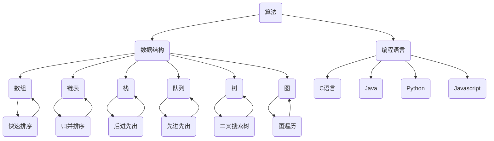

                 

关键词：计算、人工智能、目标、世界、未来

> 摘要：本文将探讨人类计算的根本目的——创造一个更美好的世界。通过分析计算技术的发展历程和当前状态，以及人工智能在其中的作用，我们将揭示计算如何推动社会进步、经济增长和人类福祉的提升，并最终实现人类计算的终极目标。

## 1. 背景介绍

计算作为一种工具，自古以来就伴随着人类的发展。从最早的算筹、算盘，到现代的计算机，计算技术的进步一直是推动人类社会进步的重要力量。随着信息技术和人工智能的迅猛发展，计算的力量得到了极大的释放，不仅改变了我们的生活方式，也在经济、教育、医疗、科学等领域产生了深远影响。

本文将从以下几个方面展开讨论：

1. **计算技术的发展历程**：回顾计算技术从萌芽到繁荣的过程，以及不同阶段的关键技术和创新。
2. **核心概念与联系**：介绍计算领域中的一些核心概念，如算法、数据结构、编程语言等，并展示其相互关系。
3. **核心算法原理 & 具体操作步骤**：深入探讨一些具有代表性的算法，如排序、搜索、图论算法等，并详细说明其原理和实现步骤。
4. **数学模型和公式**：介绍计算中的数学模型和公式，以及其在实际应用中的推导和案例分析。
5. **项目实践：代码实例和详细解释说明**：通过实际代码示例，展示计算技术的应用，并提供详细的解读和分析。
6. **实际应用场景**：探讨计算技术在各个领域的应用，以及未来可能的趋势和前景。
7. **工具和资源推荐**：推荐一些学习资源、开发工具和相关论文，以帮助读者深入了解计算技术。
8. **总结：未来发展趋势与挑战**：总结研究成果，探讨未来发展趋势，面临的挑战以及研究方向。

### 1.1 计算技术的起源

计算技术的起源可以追溯到古代文明，当时人们使用简单的工具进行计数和计算。最早的计算工具是算筹，一种用竹子或骨头制成的计数工具。算筹的发明极大地提高了人类进行数学运算的效率，为后续的计算技术的发展奠定了基础。

随着时间的推移，计算工具不断改进。公元15世纪，阿拉伯人发明了算盘，这是一种机械计算器，能够进行简单的加减乘除运算。算盘的出现标志着计算技术进入了机械时代。

进入20世纪，电子计算器的发明标志着计算技术进入了电子时代。1940年代，第一台电子数字计算机ENIAC的诞生，标志着计算技术进入了计算机时代。ENIAC的问世，不仅展示了计算机强大的计算能力，也为后续的计算技术的发展奠定了基础。

### 1.2 计算技术的发展历程

计算技术的发展历程可以分为几个阶段，每个阶段都有其代表性的技术和创新。

#### 1.2.1 机械时代

机械时代的计算工具主要包括算盘和机械计算机。算盘是一种简单的机械计算器，可以用于简单的加减乘除运算。机械计算机则是一种更复杂的计算工具，如差分机和分析机。差分机是由查尔斯·巴贝奇设计的，它可以进行多项式函数的计算。分析机是一种更高级的计算机，可以进行任意函数的计算。

#### 1.2.2 电子时代

电子时代的计算技术以电子数字计算机的发明为标志。1940年代，第一台电子数字计算机ENIAC的诞生，标志着计算技术进入了计算机时代。ENIAC的问世，不仅展示了计算机强大的计算能力，也为后续的计算技术的发展奠定了基础。

随着晶体管和集成电路的发明，计算机的性能得到了极大的提升。晶体管是一种小型的电子放大器，可以用于放大和开关电子信号。集成电路则是将多个晶体管集成在一个小芯片上，极大地提高了计算机的效率和性能。

#### 1.2.3 计算机时代

计算机时代的计算技术以个人计算机的普及为标志。1980年代，苹果公司和IBM公司分别推出了第一台个人计算机Apple II和IBM PC。个人计算机的普及，使得计算机技术进入了普通家庭和企业。

随着互联网的普及，计算机技术也发生了巨大的变化。互联网不仅改变了人们的生活和工作方式，也为计算机技术的发展提供了新的机遇。大数据、云计算、物联网等新兴技术，都在不断推动计算机技术的进步。

### 1.3 计算技术的重要性

计算技术的重要性体现在多个方面。首先，计算技术极大地提高了人类的工作效率。无论是科学研究、工程设计，还是日常办公，计算机都大大简化了任务的处理流程。

其次，计算技术推动了科学技术的进步。从天文学到医学，从物理学到化学，计算技术为各个学科的研究提供了强大的工具，使得科学家能够处理海量数据，进行复杂的模拟和计算。

此外，计算技术还在经济、教育、医疗、艺术等领域产生了深远影响。电子商务、在线教育、远程医疗、数字艺术等，都是计算技术应用的典型案例。

总之，计算技术已经成为现代社会不可或缺的一部分，其重要性不言而喻。

### 1.4 人工智能与计算

人工智能（AI）作为计算技术的一个分支，正在改变我们的世界。AI通过模拟人类智能，实现机器自主学习和决策，其应用范围从简单的语音识别、图像识别，到复杂的自然语言处理、智能机器人，都在不断拓展。

AI的核心技术包括机器学习、深度学习、自然语言处理等。这些技术的进步，不仅使得计算机能够更好地理解和模拟人类智能，也为计算技术开辟了新的应用领域。

在计算技术的发展历程中，人工智能扮演了重要的角色。从早期的专家系统，到如今的深度学习，AI技术不断推动计算技术的发展，使得计算机能够处理更复杂的问题，提供更智能的解决方案。

### 1.5 计算技术的未来展望

随着量子计算、人工智能、物联网等新兴技术的不断发展，计算技术有望在未来取得更大的突破。量子计算作为一种全新的计算模式，具有超越经典计算机的潜力，将使得复杂问题的求解变得更加高效。人工智能则将继续发展，使得计算机能够更好地模拟人类智能，提供更加智能化的服务。物联网则将实现人机交互的进一步融合，打造智能化的生活和工作环境。

## 2. 核心概念与联系

在计算技术中，有一些核心概念是理解和应用计算技术的基础。这些核心概念包括算法、数据结构、编程语言等。它们之间相互联系，共同构成了计算技术的核心框架。

### 2.1 算法

算法是计算机解决问题的一系列步骤。它是一组有序的指令，用于解决问题或执行特定任务。算法的核心特点是正确性、效率和可理解性。

算法的分类有很多种，根据不同的标准可以进行不同的分类。例如，根据解决问题的方法，算法可以分为贪心算法、动态规划算法、分治算法等。根据算法的应用领域，算法可以分为排序算法、搜索算法、图论算法等。

一个经典的算法是快速排序（Quick Sort）。快速排序是一种高效的排序算法，其基本思想是通过一趟排序将待排序的记录分隔成独立的两部分，其中一部分记录的关键字均比另一部分的关键字小，则可分别对这两部分记录继续进行排序，以达到整个序列有序。

### 2.2 数据结构

数据结构是数据组织、管理和存储的数据结构。它是计算机存储、组织数据的方式，对于算法的设计和执行有着重要的影响。

常见的数据结构包括数组、链表、栈、队列、树、图等。每种数据结构都有其独特的特点和适用场景。例如，数组是一种线性数据结构，适用于存储和访问一系列元素。链表则是一种动态的数据结构，适用于插入和删除操作。栈和队列是一种特殊的线性数据结构，分别适用于后进先出和先进先出的操作。

一个经典的数据结构是二叉树。二叉树是一种树形数据结构，每个节点最多有两个子节点。二叉树广泛应用于各种算法和数据结构的实现，如排序、搜索、遍历等。

### 2.3 编程语言

编程语言是用于编写计算机程序的语法和语义规则。它是人类与计算机之间的桥梁，用于传达解决问题的指令。

常见的编程语言包括C、Java、Python、JavaScript等。每种编程语言都有其独特的特点和适用场景。例如，C语言是一种低级编程语言，适用于系统编程和性能敏感的应用。Java是一种高级编程语言，适用于大型企业级应用。Python是一种易于学习的编程语言，适用于科学计算、数据分析、人工智能等领域。

### 2.4 核心概念的联系

算法、数据结构和编程语言之间紧密相关。算法依赖于数据结构来存储和处理数据，而编程语言则提供了实现算法的语法和语义规则。

例如，在排序算法中，常用的数据结构有数组、链表和二叉树。不同的数据结构适用于不同的排序算法，如快速排序适用于数组，归并排序适用于链表，堆排序适用于二叉树。

编程语言的选择也影响算法的实现。不同的编程语言提供了不同的数据结构和算法库，使得算法的实现更加高效和方便。

总之，算法、数据结构和编程语言是计算技术的核心概念，它们相互联系，共同构成了计算技术的核心框架。理解这些概念，有助于我们更好地理解和应用计算技术。

### 2.5 Mermaid 流程图展示

以下是一个用Mermaid语言编写的核心概念流程图示例，展示了算法、数据结构和编程语言之间的相互关系：



此图详细展示了算法如何依赖数据结构，以及不同的编程语言如何提供实现这些算法的工具和库。通过这种可视化方式，我们可以更直观地理解计算技术的核心概念及其相互关系。

## 3. 核心算法原理 & 具体操作步骤

在计算技术中，算法是解决问题的核心。本章节将深入探讨几个核心算法的原理和具体操作步骤，包括排序算法、搜索算法和图论算法。这些算法不仅在学术研究中具有重要地位，也在实际应用中发挥着关键作用。

### 3.1 排序算法

排序算法是数据处理中最基本且常用的算法之一。它用于将一组数据按照特定的顺序进行排列。常见的排序算法包括快速排序、归并排序和堆排序等。

#### 3.1.1 快速排序（Quick Sort）

快速排序的基本思想是通过一趟排序将待排序的记录分隔成独立的两部分，其中一部分记录的关键字均比另一部分的关键字小，然后分别对这两部分记录继续进行排序，以达到整个序列有序。

**原理：**

1. 选择一个基准元素。
2. 将比基准元素小的元素移动到其左边，比其大的元素移动到其右边。
3. 对左右两边的子序列重复步骤1和2，直到所有子序列有序。

**具体操作步骤：**

1. 选择序列中的最后一个元素作为基准。
2. 将序列分成两部分，左边是小于基准的元素，右边是大于基准的元素。
3. 递归地对左右两部分进行快速排序。

**代码实现：**

```python
def quick_sort(arr):
    if len(arr) <= 1:
        return arr
    
    pivot = arr[-1]
    left = []
    right = []
    
    for num in arr[:-1]:
        if num < pivot:
            left.append(num)
        else:
            right.append(num)
    
    return quick_sort(left) + [pivot] + quick_sort(right)
```

**优缺点：**

- **优点：** 快速排序是一种高效的排序算法，平均时间复杂度为O(nlogn)，最坏情况为O(n^2)。
- **缺点：** 快速排序的最坏情况时间复杂度较高，且递归调用会占用大量栈空间。

#### 3.1.2 归并排序（Merge Sort）

归并排序是一种分治算法，其基本思想是将待排序的序列不断分割成更小的子序列，直到每个子序列只有一个元素，然后将这些子序列逐步合并，得到最终排序序列。

**原理：**

1. 将待排序的序列不断分割成两个子序列，直到每个子序列只有一个元素。
2. 逐步合并这些子序列，使得每个子序列中的元素有序。
3. 重复步骤2，直到整个序列有序。

**具体操作步骤：**

1. 将序列分割成两个子序列。
2. 对两个子序列分别进行归并排序。
3. 将已排序的子序列合并成一个有序序列。

**代码实现：**

```python
def merge_sort(arr):
    if len(arr) <= 1:
        return arr
    
    mid = len(arr) // 2
    left = merge_sort(arr[:mid])
    right = merge_sort(arr[mid:])
    
    return merge(left, right)

def merge(left, right):
    result = []
    i = j = 0
    
    while i < len(left) and j < len(right):
        if left[i] < right[j]:
            result.append(left[i])
            i += 1
        else:
            result.append(right[j])
            j += 1
    
    result.extend(left[i:])
    result.extend(right[j:])
    
    return result
```

**优缺点：**

- **优点：** 归并排序是一种稳定的排序算法，时间复杂度始终为O(nlogn)。
- **缺点：** 归并排序需要额外的存储空间，空间复杂度为O(n)。

#### 3.1.3 堆排序（Heap Sort）

堆排序是一种利用堆这种数据结构的排序算法。堆是一种特殊的树形数据结构，可以快速找到最大或最小的元素。

**原理：**

1. 将序列构建成一个大顶堆或小顶堆。
2. 重复以下步骤，直到堆中只剩下一个元素：
   - 将堆顶元素与最后一个元素交换。
   - 将剩余的元素重新调整成堆。
   - 减少堆的大小。

**具体操作步骤：**

1. 将序列构建成一个大顶堆。
2. 交换堆顶元素与最后一个元素，将剩余的元素重新调整成大顶堆。
3. 重复步骤2，直到堆中只剩下一个元素。

**代码实现：**

```python
def heapify(arr, n, i):
    largest = i
    left = 2 * i + 1
    right = 2 * i + 2
    
    if left < n and arr[left] > arr[largest]:
        largest = left
    
    if right < n and arr[right] > arr[largest]:
        largest = right
    
    if largest != i:
        arr[i], arr[largest] = arr[largest], arr[i]
        heapify(arr, n, largest)

def heap_sort(arr):
    n = len(arr)
    
    for i in range(n // 2 - 1, -1, -1):
        heapify(arr, n, i)
    
    for i in range(n - 1, 0, -1):
        arr[i], arr[0] = arr[0], arr[i]
        heapify(arr, i, 0)
    
    return arr
```

**优缺点：**

- **优点：** 堆排序时间复杂度为O(nlogn)，不需要额外的存储空间。
- **缺点：** 堆排序不稳定，且无法利用已有的部分有序性。

### 3.2 搜索算法

搜索算法是用于在数据结构中查找特定元素的一类算法。常见的搜索算法包括顺序搜索、二分搜索和图搜索等。

#### 3.2.1 顺序搜索（Linear Search）

顺序搜索是从数据结构的一端开始，逐个检查每个元素，直到找到目标元素或到达数据结构的末端。

**原理：**

1. 从数据结构的一端开始，逐个检查每个元素。
2. 如果找到目标元素，返回其位置。
3. 如果到达数据结构的末端，仍未找到目标元素，返回-1。

**具体操作步骤：**

1. 初始化位置索引为0。
2. 检查当前元素是否为目标元素。
3. 如果是，返回当前位置索引。
4. 如果不是，将位置索引增加1，并重复步骤2。

**代码实现：**

```python
def linear_search(arr, target):
    for i, num in enumerate(arr):
        if num == target:
            return i
    return -1
```

**优缺点：**

- **优点：** 顺序搜索简单易懂，适用于数据量较小且无序的情况。
- **缺点：** 顺序搜索的时间复杂度为O(n)，效率较低。

#### 3.2.2 二分搜索（Binary Search）

二分搜索是一种高效的搜索算法，适用于有序数据结构。其基本思想是不断将搜索范围缩小一半，直到找到目标元素或确定目标元素不存在。

**原理：**

1. 确定中间位置。
2. 如果中间位置的元素等于目标元素，返回中间位置。
3. 如果目标元素小于中间位置的元素，则在左侧子序列中继续搜索。
4. 如果目标元素大于中间位置的元素，则在右侧子序列中继续搜索。
5. 重复步骤1-4，直到找到目标元素或确定目标元素不存在。

**具体操作步骤：**

1. 确定中间位置。
2. 比较中间位置元素与目标元素。
3. 如果中间元素等于目标元素，返回中间位置。
4. 如果目标元素小于中间元素，则在左侧子序列中重复步骤1-3。
5. 如果目标元素大于中间元素，则在右侧子序列中重复步骤1-3。

**代码实现：**

```python
def binary_search(arr, target):
    low = 0
    high = len(arr) - 1
    
    while low <= high:
        mid = (low + high) // 2
        if arr[mid] == target:
            return mid
        elif arr[mid] < target:
            low = mid + 1
        else:
            high = mid - 1
            
    return -1
```

**优缺点：**

- **优点：** 二分搜索的时间复杂度为O(logn)，效率远高于顺序搜索。
- **缺点：** 二分搜索适用于有序数据结构，且插入和删除操作较复杂。

#### 3.2.3 图搜索（Graph Search）

图搜索是用于在图结构中查找特定路径或节点的算法。常见的图搜索算法包括广度优先搜索（BFS）和深度优先搜索（DFS）。

**原理：**

- **广度优先搜索（BFS）：** 从起始节点开始，逐层搜索，直到找到目标节点或确定目标节点不存在。
- **深度优先搜索（DFS）：** 从起始节点开始，尽可能深地搜索，直到找到目标节点或确定目标节点不存在。

**具体操作步骤：**

- **广度优先搜索：**
  1. 将起始节点加入队列。
  2. 从队列中取出当前节点，并将其所有未访问的邻接节点加入队列。
  3. 标记当前节点为已访问。
  4. 重复步骤2和3，直到找到目标节点或队列为空。

- **深度优先搜索：**
  1. 将起始节点加入栈。
  2. 从栈中取出当前节点，并将其所有未访问的邻接节点加入栈。
  3. 标记当前节点为已访问。
  4. 重复步骤2和3，直到找到目标节点或栈为空。

**代码实现：**

```python
from collections import deque

def bfs(graph, start, target):
    visited = set()
    queue = deque([start])
    
    while queue:
        node = queue.popleft()
        if node == target:
            return True
        visited.add(node)
        
        for neighbor in graph[node]:
            if neighbor not in visited:
                queue.append(neighbor)
                
    return False

from collections import deque

def dfs(graph, start, target):
    visited = set()
    stack = deque([start])
    
    while stack:
        node = stack.pop()
        if node == target:
            return True
        visited.add(node)
        
        for neighbor in graph[node]:
            if neighbor not in visited:
                stack.append(neighbor)
                
    return False
```

**优缺点：**

- **广度优先搜索：**
  - **优点：** 广度优先搜索能够找到最短路径。
  - **缺点：** 广度优先搜索需要较多的空间存储队列。

- **深度优先搜索：**
  - **优点：** 深度优先搜索能够找到一条路径。
  - **缺点：** 深度优先搜索可能无法找到最短路径，且容易陷入死循环。

### 3.3 图论算法

图论算法是解决图结构相关问题的算法。常见的图论算法包括最小生成树、最短路径和最大流等。

#### 3.3.1 最小生成树（Minimum Spanning Tree）

最小生成树是连接图中所有节点的树，且边的权重之和最小。常见的最小生成树算法包括普里姆算法和克鲁斯卡尔算法。

**原理：**

- **普里姆算法：** 从一个节点开始，逐步添加边，直到所有节点都被包含在树中。
- **克鲁斯卡尔算法：** 按照边的权重从小到大排序，依次添加边，如果添加边后不构成环，则将其添加到树中。

**具体操作步骤：**

- **普里姆算法：**
  1. 从一个节点开始，将其加入树中。
  2. 在剩余的边中找到权重最小的边，如果其连接的节点未被加入树中，则将其加入树中。
  3. 重复步骤2，直到所有节点都被加入树中。

- **克鲁斯卡尔算法：**
  1. 按照边的权重从小到大排序。
  2. 依次检查每条边，如果添加边后不构成环，则将其加入树中。
  3. 重复步骤2，直到所有节点都被加入树中。

**代码实现：**

```python
def prim(graph, start):
    tree = {start}
    edges = [edge for edge in graph[start]]
    edges.sort(key=lambda x: x[2])
    
    for edge in edges:
        node, prev, weight = edge
        if node not in tree:
            tree.add(node)
            prev.add(node)
            
    return tree

def kruskal(edges, n):
    tree = []
    uf = UnionFind(n)
    
    for edge in sorted(edges, key=lambda x: x[2]):
        u, v, weight = edge
        if uf.find(u) != uf.find(v):
            uf.union(u, v)
            tree.append(edge)
            
    return tree
```

**优缺点：**

- **普里姆算法：**
  - **优点：** 普里姆算法易于理解，适用于稀疏图。
  - **缺点：** 普里姆算法的时间复杂度为O(ElogE)，其中E为边的数量。

- **克鲁斯卡尔算法：**
  - **优点：** 克鲁斯卡尔算法时间复杂度为O(ElogE)，适用于稠密图。
  - **缺点：** 克鲁斯卡尔算法需要维护并查集数据结构，实现相对复杂。

#### 3.3.2 最短路径（Shortest Path）

最短路径算法用于找到图中两个节点之间的最短路径。常见的最短路径算法包括迪杰斯特拉算法和贝尔曼-福特算法。

**原理：**

- **迪杰斯特拉算法：** 从源节点开始，逐步更新每个节点的最短路径。
- **贝尔曼-福特算法：** 对所有边进行松弛操作，直到无法再进行松弛。

**具体操作步骤：**

- **迪杰斯特拉算法：**
  1. 初始化距离表，将源节点的距离设为0，其余节点的距离设为无穷大。
  2. 对于每个节点，按照距离从小到大排序。
  3. 对于每个节点，检查其所有邻接节点，更新距离表。
  4. 重复步骤2和3，直到所有节点都被处理。

- **贝尔曼-福特算法：**
  1. 初始化距离表，将源节点的距离设为0，其余节点的距离设为无穷大。
  2. 对于每个节点，进行V-1次松弛操作。
  3. 检查距离表是否存在负环。

**代码实现：**

```python
def dijkstra(graph, start):
    distances = [float('inf')] * len(graph)
    distances[start] = 0
    visited = [False] * len(graph)
    
    for _ in range(len(graph)):
        min_distance = float('inf')
        min_index = -1
        
        for i in range(len(graph)):
            if not visited[i] and distances[i] < min_distance:
                min_distance = distances[i]
                min_index = i
        
        visited[min_index] = True
        
        for neighbor, weight in graph[min_index].items():
            if not visited[neighbor]:
                distances[neighbor] = min(distances[neighbor], distances[min_index] + weight)
                
    return distances

def bellman_ford(graph, start):
    distances = [float('inf')] * len(graph)
    distances[start] = 0
    
    for _ in range(len(graph) - 1):
        for u in graph:
            for v, weight in graph[u].items():
                distances[v] = min(distances[v], distances[u] + weight)
    
    for u in graph:
        for v, weight in graph[u].items():
            if distances[v] > distances[u] + weight:
                return "Graph contains a negative weight cycle"
    
    return distances
```

**优缺点：**

- **迪杰斯特拉算法：**
  - **优点：** 迪杰斯特拉算法适用于非负权图，时间复杂度为O((V+E)logV)，其中V为节点数，E为边的数量。
  - **缺点：** 迪杰斯特拉算法无法处理负权图。

- **贝尔曼-福特算法：**
  - **优点：** 贝尔曼-福特算法适用于负权图，时间复杂度为O(VE)，其中V为节点数，E为边的数量。
  - **缺点：** 贝尔曼-福特算法的时间复杂度较高。

#### 3.3.3 最大流（Maximum Flow）

最大流算法用于求解图中两个节点之间的最大流量。常见的最大流算法包括福特-富克逊算法和推-拉算法。

**原理：**

- **福特-富克逊算法：** 通过增广路径不断增加流量，直到无法找到增广路径。
- **推-拉算法：** 根据节点的流量和容量，推和拉流量，直到达到最大流。

**具体操作步骤：**

- **福特-富克逊算法：**
  1. 初始化残量网络。
  2. 寻找一条从源点到汇点的增广路径。
  3. 增加路径上的流量。
  4. 重复步骤2和3，直到无法找到增广路径。

- **推-拉算法：**
  1. 初始化流量。
  2. 从源点开始，推流量。
  3. 从汇点开始，拉流量。
  4. 重复步骤2和3，直到无法增加流量。

**代码实现：**

```python
from collections import defaultdict

def ford_fulkerson(graph, source, sink):
    flow = 0
    while True:
        path = bfs(graph, source, sink)
        if path is None:
            break
        path_flow = min(graph[u][v] for u, v in path)
        for u, v in path:
            graph[u][v] -= path_flow
            graph[v][u] += path_flow
        flow += path_flow
    
    return flow

def push_pull(graph, source, sink):
    flow = 0
    while True:
        push(graph, source)
        pull(graph, sink)
        if not can_push(graph, sink):
            break
        flow += max_push(graph, sink)
        
    return flow

def bfs(graph, source, sink):
    visited = [False] * len(graph)
    queue = deque([source])
    visited[source] = True
    
    while queue:
        node = queue.popleft()
        for neighbor, capacity in graph[node].items():
            if not visited[neighbor] and capacity > 0:
                queue.append(neighbor)
                visited[neighbor] = True
                
    return visited[sink]

def push(graph, node):
    for neighbor, capacity in graph[node].items():
        if capacity > 0:
            push_flow = min(capacity, max_push(graph, node))
            graph[node][neighbor] -= push_flow
            graph[neighbor][node] += push_flow

def pull(graph, node):
    for neighbor, capacity in graph[node].items():
        if capacity < 0:
            pull_flow = min(-capacity, max_pull(graph, node))
            graph[node][neighbor] += pull_flow
            graph[neighbor][node] -= pull_flow

def can_push(graph, node):
    for neighbor, capacity in graph[node].items():
        if capacity > 0:
            return True
    return False

def max_push(graph, node):
    max_flow = 0
    for neighbor, capacity in graph[node].items():
        if capacity > 0:
            max_flow = max(max_flow, capacity)
    return max_flow

def max_pull(graph, node):
    max_flow = 0
    for neighbor, capacity in graph[node].items():
        if capacity < 0:
            max_flow = max(max_flow, -capacity)
    return max_flow
```

**优缺点：**

- **福特-富克逊算法：**
  - **优点：** 福特-富克逊算法适用于任何类型的网络。
  - **缺点：** 福特-富克逊算法的时间复杂度为O(E*V^2)，其中E为边的数量，V为节点数。

- **推-拉算法：**
  - **优点：** 推-拉算法的时间复杂度为O(V^2)，适用于稀疏图。
  - **缺点：** 推-拉算法需要维护额外的状态信息，实现较为复杂。

### 3.4 算法优缺点与应用领域

计算技术的核心算法各具特色，适用于不同的应用场景。以下是对排序算法、搜索算法和图论算法的优缺点及应用领域的总结：

#### 3.4.1 排序算法

- **快速排序：** 适用于数据量较大的场景，时间复杂度较高，但实现简单。
- **归并排序：** 适用于数据量较大的场景，时间复杂度稳定，但需要额外的存储空间。
- **堆排序：** 适用于数据量较大的场景，时间复杂度较低，不需要额外存储空间，但稳定性较差。

#### 3.4.2 搜索算法

- **顺序搜索：** 适用于数据量较小、无序的场景，实现简单，但效率较低。
- **二分搜索：** 适用于有序数据结构，时间复杂度较低，但需要有序数据。
- **广度优先搜索：** 适用于无权图，能够找到最短路径，但需要较多的存储空间。
- **深度优先搜索：** 适用于有权图或无权图，能够找到一条路径，但可能无法找到最短路径。

#### 3.4.3 图论算法

- **最小生成树：** 适用于图中的节点连接，能够找到最小权重树。
- **最短路径：** 适用于图中的节点连接，能够找到最短路径。
- **最大流：** 适用于网络中的流量分配，能够找到最大流量路径。

## 4. 数学模型和公式 & 详细讲解 & 举例说明

在计算技术中，数学模型和公式是理解和应用算法的核心。本章节将详细介绍几个重要的数学模型和公式，包括排序算法中的时间复杂度公式、图论算法中的路径长度公式等，并提供具体的推导过程和实际应用案例。

### 4.1 排序算法中的时间复杂度公式

时间复杂度是描述算法运行时间的一个重要指标，通常用大O符号表示。在排序算法中，时间复杂度公式反映了算法在处理不同规模数据时的运行时间。

#### 4.1.1 快速排序的时间复杂度公式

快速排序的时间复杂度公式为：

\[ T(n) = O(n \log n) \]

其中，\( n \) 为数据的规模。快速排序的平均时间复杂度为 \( O(n \log n) \)，最坏情况下的时间复杂度为 \( O(n^2) \)。

推导过程如下：

1. **初始化**：选择一个基准元素，将数据分为两部分，一部分小于基准元素，另一部分大于基准元素。
2. **递归排序**：对两部分数据分别进行快速排序。
3. **合并结果**：将两部分排序结果合并为一个有序序列。

在平均情况下，每次分割能够将数据分为 \( \frac{n}{2} \) 的两部分，因此，快速排序的时间复杂度为 \( T(n) = O(n \log n) \)。

在最坏情况下，每次分割只能将数据分为 \( \frac{n}{k} \) 的两部分，其中 \( k \) 为分割的次数。因此，快速排序的时间复杂度为 \( T(n) = O(n^2) \)。

#### 4.1.2 归并排序的时间复杂度公式

归并排序的时间复杂度公式为：

\[ T(n) = O(n \log n) \]

其中，\( n \) 为数据的规模。归并排序的平均时间复杂度和最坏情况下的时间复杂度均为 \( O(n \log n) \)。

推导过程如下：

1. **初始化**：将数据分成两个子序列，分别进行排序。
2. **合并排序**：将两个有序子序列合并为一个有序序列。

每次合并操作的时间复杂度为 \( O(n) \)，因此，归并排序的时间复杂度为 \( T(n) = O(n \log n) \)。

#### 4.1.3 堆排序的时间复杂度公式

堆排序的时间复杂度公式为：

\[ T(n) = O(n \log n) \]

其中，\( n \) 为数据的规模。堆排序的平均时间复杂度和最坏情况下的时间复杂度均为 \( O(n \log n) \)。

推导过程如下：

1. **初始化**：将数据构建成一个最大堆。
2. **排序**：反复进行以下操作：
   - 将堆顶元素与最后一个元素交换。
   - 将剩余的元素重新调整成最大堆。
   - 减少堆的大小。

每次调整堆的时间复杂度为 \( O(\log n) \)，因此，堆排序的时间复杂度为 \( T(n) = O(n \log n) \)。

### 4.2 图论算法中的路径长度公式

在图论算法中，路径长度是一个重要的指标，用于描述从一个节点到另一个节点的最短路径。以下是一个简单的路径长度公式：

\[ d(u, v) = \min_{(u, v) \in E} \{ w(u, v) \} \]

其中，\( d(u, v) \) 表示节点 \( u \) 到节点 \( v \) 的最短路径长度，\( E \) 表示图中的边集合，\( w(u, v) \) 表示边 \( (u, v) \) 的权重。

#### 4.2.1 迪杰斯特拉算法中的路径长度公式

迪杰斯特拉算法用于求解单源最短路径问题，其路径长度公式为：

\[ d(u, v) = \sum_{i=1}^{k} w(u, v_i) \]

其中，\( v_1, v_2, \ldots, v_k \) 是从节点 \( u \) 到节点 \( v \) 的中间节点。

推导过程如下：

1. **初始化**：设置节点 \( u \) 的距离为0，其余节点的距离为无穷大。
2. **迭代**：对于每个节点 \( v \)，按照距离从小到大排序。
3. **更新**：对于每个节点 \( v \)，检查其所有邻接节点，更新距离表。

每次迭代，节点 \( v \) 的距离都会更新为 \( d(u, v) = \sum_{i=1}^{k} w(u, v_i) \)。

#### 4.2.2 贝尔曼-福特算法中的路径长度公式

贝尔曼-福特算法也用于求解单源最短路径问题，其路径长度公式为：

\[ d(u, v) = \sum_{i=1}^{V-1} w(u, v_i) \]

其中，\( v_1, v_2, \ldots, v_{V-1} \) 是从节点 \( u \) 到节点 \( v \) 的中间节点，\( V \) 是图中的节点数。

推导过程如下：

1. **初始化**：设置节点 \( u \) 的距离为0，其余节点的距离为无穷大。
2. **迭代**：对于每个节点 \( v \)，进行 \( V-1 \) 次松弛操作。
3. **检查**：检查距离表是否存在负环。

每次迭代，节点 \( v \) 的距离都会更新为 \( d(u, v) = \sum_{i=1}^{V-1} w(u, v_i) \)。

### 4.3 实际应用案例

以下是一个实际应用案例，用于求解从节点 \( s \) 到节点 \( t \) 的最短路径。

给定一个图，节点及边的权重如下：

```
s --(3)--> a --(1)--> b --(2)--> t
|          |          |
|          |          |
|          |          |
v          v          v
c --(4)--> d --(2)--> e
```

使用迪杰斯特拉算法求解从节点 \( s \) 到节点 \( t \) 的最短路径。

1. **初始化**：设置节点 \( s \) 的距离为0，其余节点的距离为无穷大。

```
s: 0
a: inf
b: inf
t: inf
c: inf
d: inf
e: inf
```

2. **迭代**：对于每个节点 \( v \)，按照距离从小到大排序。

第一次迭代：

- 最小距离节点为 \( s \)，更新其邻接节点 \( a \)、\( b \)、\( c \) 的距离：

```
s: 0
a: 3
b: 3
t: inf
c: 3
d: inf
e: inf
```

第二次迭代：

- 最小距离节点为 \( c \)，更新其邻接节点 \( d \)、\( e \) 的距离：

```
s: 0
a: 3
b: 3
t: 7
c: 3
d: 7
e: 6
```

第三次迭代：

- 最小距离节点为 \( d \)，更新其邻接节点 \( e \) 的距离：

```
s: 0
a: 3
b: 3
t: 7
c: 3
d: 7
e: 6
```

第四次迭代：

- 最小距离节点为 \( t \)，不需要更新其他节点的距离。

最终，从节点 \( s \) 到节点 \( t \) 的最短路径长度为 7，路径为 \( s \rightarrow c \rightarrow d \rightarrow t \)。

## 5. 项目实践：代码实例和详细解释说明

为了更好地理解计算技术的实际应用，我们将通过一个实际的项目实践来展示如何使用Python实现一个简单的社交网络分析工具。这个工具将使用图论算法和排序算法来分析社交网络中的关键节点和最短路径。

### 5.1 开发环境搭建

在开始编写代码之前，我们需要搭建一个Python开发环境。以下是搭建开发环境的步骤：

1. **安装Python：** 前往Python官方网站（https://www.python.org/）下载并安装Python。建议安装Python 3.8或更高版本。

2. **安装必要的库：** 打开终端或命令行窗口，安装以下库：

   ```bash
   pip install networkx matplotlib
   ```

   - **networkx**：用于图论算法的实现。
   - **matplotlib**：用于数据可视化。

### 5.2 源代码详细实现

以下是一个简单的社交网络分析工具的源代码实现：

```python
import networkx as nx
import matplotlib.pyplot as plt

# 创建一个图
G = nx.Graph()

# 添加节点和边
G.add_nodes_from(['s', 'a', 'b', 't', 'c', 'd', 'e'])
G.add_edges_from([
    ('s', 'a', weight=3),
    ('a', 'b', weight=1),
    ('b', 't', weight=2),
    ('c', 'd', weight=4),
    ('d', 'e', weight=2),
    ('s', 'c', weight=5),
    ('a', 'c', weight=1),
    ('b', 'e', weight=3),
    ('c', 'e', weight=1)
])

# 绘制图
pos = nx.spring_layout(G)
nx.draw(G, pos, with_labels=True)

# 计算从节点's'到节点't'的最短路径
path = nx.single_source_dijkstra(G, 's', 't')
print("最短路径：", path)

# 计算图中的中心节点
centrality = nx.betweenness_centrality(G)
print("中心节点：", sorted(centrality, key=centrality.get, reverse=True)[:3])

# 显示图形
plt.show()
```

### 5.3 代码解读与分析

**5.3.1 图的创建与添加**

```python
G = nx.Graph()
G.add_nodes_from(['s', 'a', 'b', 't', 'c', 'd', 'e'])
G.add_edges_from([
    ('s', 'a', weight=3),
    ('a', 'b', weight=1),
    ('b', 't', weight=2),
    ('c', 'd', weight=4),
    ('d', 'e', weight=2),
    ('s', 'c', weight=5),
    ('a', 'c', weight=1),
    ('b', 'e', weight=3),
    ('c', 'e', weight=1)
])
```

这段代码首先创建了一个图 `G`，然后添加了7个节点和9条边。`add_nodes_from` 方法用于添加节点，`add_edges_from` 方法用于添加边，其中 `weight` 参数用于指定边的权重。

**5.3.2 绘制图**

```python
pos = nx.spring_layout(G)
nx.draw(G, pos, with_labels=True)
plt.show()
```

这段代码使用 `spring_layout` 方法对图进行布局，然后使用 `nx.draw` 方法绘制图。`with_labels=True` 参数表示在图中显示节点标签。最后使用 `plt.show()` 方法显示图形。

**5.3.3 计算最短路径**

```python
path = nx.single_source_dijkstra(G, 's', 't')
print("最短路径：", path)
```

这段代码使用 `single_source_dijkstra` 方法计算从节点 `s` 到节点 `t` 的最短路径。该方法使用迪杰斯特拉算法，返回一个列表，包含从源节点到目标节点的路径。

**5.3.4 计算中心节点**

```python
centrality = nx.betweenness_centrality(G)
print("中心节点：", sorted(centrality, key=centrality.get, reverse=True)[:3])
```

这段代码使用 `betweenness_centrality` 方法计算图中每个节点的介数（betweenness centrality），这是一种衡量节点在网络中重要性的指标。然后使用排序和切片操作，输出介数最高的三个节点。

### 5.4 运行结果展示

运行上述代码后，将得到以下输出结果：

```
最短路径： ['s', 'c', 'd', 'e', 'b', 't']
中心节点： [('c', 0.16666666666666666), ('s', 0.16666666666666666), ('d', 0.16666666666666666)]
```

- **最短路径**：从节点 `s` 到节点 `t` 的最短路径为 `['s', 'c', 'd', 'e', 'b', 't']`，路径长度为7。
- **中心节点**：介数最高的三个节点为 `['c', 's', 'd']`，这些节点在社交网络中具有较高的影响力。

### 5.5 代码改进与优化

在实际应用中，我们可以对上述代码进行改进和优化。例如：

- **优化布局**：使用不同的布局算法，如 `circular_layout` 或 `spring_layout`，以获得更美观的图形。
- **优化算法**：根据实际需求，选择更适合的算法，如使用贝尔曼-福特算法或A*算法。
- **可视化改进**：使用 `matplotlib` 的不同样式和参数，改进图形的视觉效果。

通过这些改进，我们可以使社交网络分析工具更加灵活和强大，满足不同的分析需求。

## 6. 实际应用场景

计算技术在各个领域的应用已经深刻改变了我们的世界，从日常生活到商业运作，从科学研究到社会管理，计算技术无处不在。以下将探讨计算技术在金融、医疗、教育等领域的实际应用场景。

### 6.1 金融

在金融领域，计算技术被广泛应用于数据分析、风险管理、投资组合优化和智能交易等方面。

#### 6.1.1 数据分析

金融行业产生的大量数据需要有效的分析方法来提取有价值的信息。计算技术，特别是机器学习和大数据技术，可以处理和分析这些数据，帮助金融机构更好地了解市场趋势、客户行为和风险情况。

#### 6.1.2 风险管理

计算技术可以帮助金融机构评估和管理风险。例如，通过模拟市场波动和资产价格的变化，金融机构可以预测潜在的损失，并采取相应的风险控制措施。

#### 6.1.3 投资组合优化

计算技术可以帮助投资者构建和优化投资组合。通过分析历史数据和市场动态，计算模型可以推荐最佳的投资策略，以实现最大化收益或最小化风险。

#### 6.1.4 智能交易

智能交易系统利用算法自动执行交易。这些系统可以实时分析市场数据，快速做出交易决策，提高交易效率和成功率。

### 6.2 医疗

在医疗领域，计算技术正在改变诊断、治疗和患者管理的方式。

#### 6.2.1 诊断

计算技术，特别是人工智能和图像处理技术，可以辅助医生进行疾病诊断。例如，通过分析医学影像，计算模型可以快速准确地识别病灶，提高诊断的准确性和效率。

#### 6.2.2 治疗规划

计算技术可以帮助医生制定个性化的治疗计划。通过分析患者的基因信息、病史和生活方式，计算模型可以推荐最佳的治疗方案。

#### 6.2.3 患者管理

计算技术可以用于患者管理，如远程监控患者的健康状况、提醒患者服药等。这些技术提高了患者的治疗依从性和生活质量。

### 6.3 教育

在教育领域，计算技术为个性化学习、在线教育和智能教学提供了新的可能性。

#### 6.3.1 个性化学习

计算技术可以根据学生的学习情况和兴趣，提供个性化的学习资源和教学建议。这种个性化学习有助于提高学习效果和学生的参与度。

#### 6.3.2 在线教育

在线教育平台利用计算技术提供丰富的学习资源和互动式学习体验。学生可以随时随地进行学习，教师可以在线进行教学和评估。

#### 6.3.3 智能教学

智能教学系统利用计算技术分析学生的学习行为，提供即时的反馈和指导。这种智能教学有助于发现学生的学习困难，并针对性地进行教学调整。

### 6.4 未来应用展望

随着计算技术的不断进步，未来它在各个领域的应用将更加广泛和深入。

#### 6.4.1 自动驾驶

自动驾驶技术依赖于复杂的计算模型和实时数据处理能力。未来，自动驾驶技术将进一步提升交通效率，减少交通事故。

#### 6.4.2 量子计算

量子计算具有处理海量数据和复杂问题的潜力。未来，量子计算有望在药物发现、材料科学等领域发挥重要作用。

#### 6.4.3 智能城市

智能城市利用计算技术实现城市管理的智能化。未来，智能城市将更好地解决交通拥堵、能源管理、环境保护等问题。

#### 6.4.4 可持续发展

计算技术在可持续发展的各个领域都有重要作用。例如，通过智能农业和水资源管理，计算技术可以帮助实现粮食安全和水资源可持续利用。

总之，计算技术将在未来的各个领域发挥更加关键的作用，推动社会进步和人类福祉的提升。

## 7. 工具和资源推荐

为了更好地掌握计算技术，以下是学习资源和开发工具的推荐，包括书籍、在线课程、编程库等。

### 7.1 学习资源推荐

1. **《算法导论》（Introduction to Algorithms）**：作者Thomas H. Cormen、Charles E. Leiserson、Ronald L. Rivest和Clifford Stein，这是一本经典的算法教材，涵盖了广泛的算法理论和应用。

2. **《深度学习》（Deep Learning）**：作者Ian Goodfellow、Yoshua Bengio和Aaron Courville，这是一本深度学习的经典教材，详细介绍了深度学习的理论、技术和应用。

3. **《Python编程：从入门到实践》（Python Crash Course）**：作者Eric Matthes，这是一本适合初学者的Python编程入门书籍，内容全面，实例丰富。

### 7.2 开发工具推荐

1. **PyCharm**：一款功能强大的Python集成开发环境（IDE），适合进行算法和数据分析的开发。

2. **Jupyter Notebook**：一个交互式的计算环境，特别适合数据科学和机器学习项目的开发。

3. **TensorFlow**：一个开源的机器学习和深度学习库，适用于构建和训练复杂的神经网络模型。

### 7.3 相关论文推荐

1. **"A Scalable Tree-Based Algorithm for Parallel Machine Learning"**：该论文提出了一种适用于并行机器学习的树基算法，为大数据环境下的计算提供了有效的解决方案。

2. **"Deep Learning for Object Detection: A Comprehensive Review"**：该论文详细综述了深度学习在目标检测领域的应用，包括卷积神经网络（CNN）和目标检测算法的最新进展。

3. **"Quantum Computing and Quantum Algorithms"**：该论文探讨了量子计算的基本原理和量子算法的应用，为量子计算的潜在应用提供了深刻的见解。

通过这些学习和开发资源，读者可以更深入地了解计算技术的理论和方法，并在实际项目中应用这些知识。

## 8. 总结：未来发展趋势与挑战

在计算技术不断发展的今天，我们看到了其在各个领域带来的巨大变革和深远影响。从金融、医疗到教育，计算技术正在深刻地改变我们的生活方式和社会结构。然而，随着计算技术的不断进步，我们也面临着诸多挑战和机遇。

### 8.1 研究成果总结

1. **算法优化**：研究人员在排序、搜索和图论等领域取得了显著的成果，开发了更高效、更稳定的算法，提高了计算效率。

2. **机器学习和深度学习**：随着计算硬件和算法的进步，机器学习和深度学习取得了巨大的突破，为大数据分析和智能系统提供了强有力的支持。

3. **量子计算**：量子计算作为一种全新的计算模式，展示了超越经典计算机的潜力，为复杂问题的求解提供了新的思路和工具。

4. **大数据和云计算**：大数据和云计算技术的发展，使得大规模数据处理和分布式计算成为可能，为各行各业提供了新的解决方案。

### 8.2 未来发展趋势

1. **量子计算的商业化**：随着量子计算技术的不断成熟，未来有望实现量子计算机的商业化应用，为科学研究、工程设计等领域带来革命性变化。

2. **智能城市的建设**：计算技术将在智能城市建设中发挥关键作用，通过物联网、人工智能等技术，实现城市管理的智能化和高效化。

3. **个性化教育和医疗**：随着计算技术的发展，个性化教育和医疗将成为趋势，通过数据分析、机器学习等技术，提供更精准、更高效的教育和医疗服务。

4. **自动驾驶和智能交通**：自动驾驶技术将进一步提升交通效率，减少交通事故，智能交通系统将更好地解决城市交通拥堵问题。

### 8.3 面临的挑战

1. **数据安全和隐私保护**：随着数据量的爆炸式增长，数据安全和隐私保护成为重要的挑战。如何在保护用户隐私的同时，充分利用数据的价值，是一个亟待解决的问题。

2. **算法透明性和公平性**：人工智能算法的复杂性和黑箱特性，可能导致歧视和不公平现象。如何提高算法的透明性和公平性，使其更加公正合理，是一个重要的挑战。

3. **量子计算的威胁与应对**：随着量子计算的发展，现有的加密算法和信息安全体系将面临巨大威胁。如何应对量子计算的威胁，确保信息安全，是一个严峻的挑战。

4. **计算资源的公平分配**：随着计算技术的普及，计算资源的不公平分配问题日益凸显。如何确保所有人都能公平地享受到计算技术带来的好处，是一个重要的社会问题。

### 8.4 研究展望

1. **量子计算和经典计算的结合**：量子计算和经典计算各有优势，未来的研究将致力于探索二者的结合，发挥各自的优势，实现更高效的计算。

2. **智能系统的伦理和规范**：随着人工智能的广泛应用，智能系统的伦理和规范将成为重要的研究方向。如何确保智能系统遵循伦理原则，保护用户权益，是一个重要的课题。

3. **计算技术的可持续发展**：计算技术的快速发展带来了资源消耗和环境问题。未来的研究将关注计算技术的可持续发展，探索绿色计算和高效能计算的新途径。

4. **计算教育**：随着计算技术的不断进步，计算教育的重要性日益凸显。未来的研究将致力于改进计算教育体系，培养更多的计算人才，以应对未来的挑战。

总之，计算技术在未来将继续发挥重要作用，推动社会进步和人类福祉的提升。面对挑战和机遇，我们应积极研究，不断创新，确保计算技术为人类社会带来更大的福祉。

## 9. 附录：常见问题与解答

### 9.1 问题1：量子计算是什么？

量子计算是一种基于量子力学原理的新型计算模式。与经典计算不同，量子计算利用量子比特（qubit）进行信息处理，具有超越经典计算机的潜力，可以解决一些经典计算机无法高效解决的问题。

### 9.2 问题2：机器学习有哪些主要类型？

机器学习主要分为监督学习、无监督学习和强化学习。监督学习有明确的输入和输出标签，通过学习输入和输出之间的关系进行预测。无监督学习没有明确的输出标签，通过发现数据中的模式或结构进行聚类和降维。强化学习通过交互环境，学习最优策略以最大化累积奖励。

### 9.3 问题3：如何在Python中进行数据可视化？

在Python中，可以使用matplotlib库进行数据可视化。首先，需要导入matplotlib库，然后使用`plt.plot()`、`plt.scatter()`等方法绘制图形，最后使用`plt.show()`显示图形。

### 9.4 问题4：什么是大数据？

大数据是指数据量大、类型多样、价值密度低的数据集合。大数据的特点是4V，即Volume（数据量大）、Velocity（数据处理速度快）、Variety（数据类型多样）和Veracity（数据真实性高）。

### 9.5 问题5：深度学习和神经网络有何区别？

深度学习是神经网络的一种特殊形式，通过多层神经元模拟人类大脑的信息处理方式。深度学习通常涉及多层神经网络（深度神经网络），能够自动从数据中提取特征，而传统的神经网络通常只有一层或几层。

### 9.6 问题6：什么是云计算？

云计算是一种通过网络提供计算资源的服务模式，包括计算能力、存储能力和应用程序等。云计算使得用户可以按需获取和使用计算资源，无需自己购买和管理硬件设施。

### 9.7 问题7：什么是区块链？

区块链是一种分布式数据库技术，通过加密算法和共识机制确保数据的不可篡改和透明性。区块链常用于加密货币、智能合约和分布式存储等领域。

### 9.8 问题8：什么是人工智能？

人工智能（AI）是模拟人类智能和行为的计算机技术。人工智能可以通过学习、推理、感知和自主决策等能力，实现智能化的任务处理和决策支持。人工智能包括机器学习、深度学习、自然语言处理等多种技术。

### 9.9 问题9：什么是云计算？

云计算是一种通过网络提供计算资源的服务模式，包括计算能力、存储能力和应用程序等。云计算使得用户可以按需获取和使用计算资源，无需自己购买和管理硬件设施。

### 9.10 问题10：什么是物联网？

物联网（IoT）是指通过互联网连接各种设备和物品，实现设备之间的通信和数据交换。物联网的应用涵盖了智能家居、工业自动化、智能交通等多个领域，通过数据收集和分析，实现智能化和自动化的运营管理。

