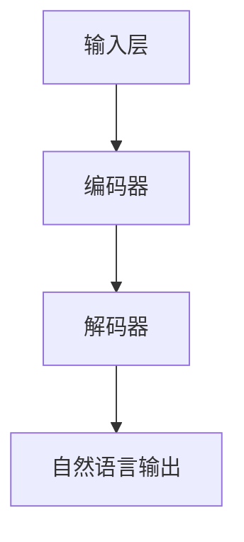

                 

关键词：初创企业、人工智能、LLM、赋能、创新

> 摘要：本文探讨了大型语言模型（LLM）如何成为初创企业的加速器，通过其强大的语言理解和生成能力，为企业提供创新的解决方案，推动企业快速发展。文章分析了LLM的核心概念、算法原理、数学模型，并通过具体的项目实践和实际应用场景，展示了LLM的巨大潜力和广泛的应用前景。

## 1. 背景介绍

随着人工智能技术的不断进步，大型语言模型（LLM）已经成为人工智能领域的一个重要研究方向。LLM凭借其强大的语言理解和生成能力，在自然语言处理、智能问答、机器翻译、文本生成等领域取得了显著的成果。特别是在2022年，GPT-3的发布引发了全球的关注，其强大的语言生成能力为各行各业带来了新的可能性和机遇。

初创企业在资源有限、市场竞争力强的背景下，如何快速获得竞争优势、实现快速发展，成为摆在企业家面前的重要课题。而LLM的出现，为初创企业提供了一个全新的解决方案。通过LLM的应用，初创企业可以快速实现产品的创新和升级，提高市场竞争力，从而在激烈的市场竞争中脱颖而出。

## 2. 核心概念与联系

### 2.1 LLM的核心概念

大型语言模型（LLM）是一种基于深度学习技术的自然语言处理模型。它通过对大量文本数据进行训练，学习语言的结构和规律，从而实现对自然语言的生成和理解。LLM的核心目标是让机器具备人类的语言能力，实现与人类的自然交流。

### 2.2 LLM的架构

LLM的架构通常包括以下几个部分：

1. **输入层**：接收自然语言输入，如文本、语音等。
2. **编码器**：对输入层进行处理，将输入转换为适合模型处理的中间表示。
3. **解码器**：将编码器生成的中间表示转换为自然语言输出。

### 2.3 LLM与其他技术的关系

LLM与其他人工智能技术密切相关，如：

- **深度学习**：LLM的核心算法基于深度学习，通过多层神经网络对大量数据进行训练。
- **自然语言处理（NLP）**：LLM在NLP领域具有广泛的应用，如文本分类、情感分析、命名实体识别等。
- **计算机视觉**：LLM与计算机视觉技术相结合，可以实现图像与文本的交互，如图像生成描述、视频字幕生成等。

### 2.4 Mermaid流程图

以下是一个简化的LLM流程图：



## 3. 核心算法原理 & 具体操作步骤

### 3.1 算法原理概述

LLM的算法原理基于深度学习，通过多层神经网络对输入文本进行编码和解码。编码器将输入文本转换为固定长度的向量表示，解码器则根据编码器生成的向量表示生成自然语言输出。

### 3.2 算法步骤详解

1. **数据预处理**：对输入文本进行分词、去停用词等处理，将文本转换为序列形式。
2. **模型训练**：使用大量文本数据对编码器和解码器进行训练，通过反向传播算法优化模型参数。
3. **自然语言生成**：输入新的文本数据，编码器生成向量表示，解码器根据向量表示生成自然语言输出。

### 3.3 算法优缺点

**优点**：

- **强大的语言理解能力**：LLM能够理解并生成复杂的语言结构，实现与人类的自然交流。
- **广泛的适用性**：LLM在多个领域具有广泛的应用，如智能问答、机器翻译、文本生成等。
- **快速迭代**：通过大量数据的训练，LLM能够快速适应新的语言环境和任务。

**缺点**：

- **计算资源消耗大**：训练和运行LLM需要大量的计算资源和时间。
- **数据依赖性强**：LLM的性能高度依赖训练数据的质量和数量，数据不足或质量差可能导致模型性能下降。

### 3.4 算法应用领域

LLM在多个领域具有广泛的应用：

- **自然语言处理**：如智能问答、机器翻译、文本生成等。
- **智能客服**：为企业提供高效、智能的客服解决方案。
- **内容创作**：如文章生成、广告文案创作等。
- **教育**：如智能辅导、课程生成等。
- **金融**：如智能投顾、风险评估等。

## 4. 数学模型和公式 & 详细讲解 & 举例说明

### 4.1 数学模型构建

LLM的数学模型主要包括两部分：编码器和解码器。

**编码器**：

- 输入层：文本序列
- 隐藏层：多层神经网络
- 输出层：固定长度的向量表示

**解码器**：

- 输入层：编码器输出的向量表示
- 隐藏层：多层神经网络
- 输出层：自然语言序列

### 4.2 公式推导过程

LLM的公式推导主要涉及以下几个方面：

- **编码器**：
  $$h_l = \sigma(W_l \cdot [h_{l-1}; x_l] + b_l)$$
  其中，$h_l$表示隐藏层$l$的激活值，$W_l$表示权重矩阵，$b_l$表示偏置项，$\sigma$表示激活函数。

- **解码器**：
  $$p(y_l|y_{<l}, x) = \sigma(W_{y_l} \cdot [h_{l-1}; y_{<l}] + b_{y_l})$$
  其中，$p(y_l|y_{<l}, x)$表示在给定前一个词$y_{<l}$和输入文本$x$的情况下，生成当前词$y_l$的概率。

### 4.3 案例分析与讲解

以GPT-3为例，分析其数学模型和公式。

**GPT-3编码器**：

- 输入层：文本序列
- 隐藏层：多层Transformer模型
- 输出层：固定长度的向量表示

**GPT-3解码器**：

- 输入层：编码器输出的向量表示
- 隐藏层：多层Transformer模型
- 输出层：自然语言序列

**公式推导**：

- **编码器**：
  $$h_l = \text{Transformer}(h_{l-1}, x_l)$$
  其中，$\text{Transformer}$表示Transformer模型。

- **解码器**：
  $$p(y_l|y_{<l}, x) = \text{softmax}(\text{Transformer}(h_{l-1}, y_{<l}, x))$$

## 5. 项目实践：代码实例和详细解释说明

### 5.1 开发环境搭建

在本项目中，我们使用Python和PyTorch作为主要编程语言和深度学习框架。首先，确保安装了Python和PyTorch，然后克隆项目代码并运行：

```bash
git clone https://github.com/your-username/your-project.git
cd your-project
pip install -r requirements.txt
```

### 5.2 源代码详细实现

以下是一个简化的LLM模型实现：

```python
import torch
import torch.nn as nn

class LLM(nn.Module):
    def __init__(self, vocab_size, embedding_dim, hidden_dim):
        super(LLM, self).__init__()
        
        self.embedding = nn.Embedding(vocab_size, embedding_dim)
        self.encoder = nn.LSTM(embedding_dim, hidden_dim)
        self.decoder = nn.LSTM(hidden_dim, vocab_size)
        
    def forward(self, x, h):
        x = self.embedding(x)
        x, (h_n, c_n) = self.encoder(x, h)
        x, (h_n, c_n) = self.decoder(x, (h_n, c_n))
        return x, (h_n, c_n)
```

### 5.3 代码解读与分析

- **模型结构**：LLM模型包括一个嵌入层、一个编码器LSTM层和一个解码器LSTM层。
- **输入输出**：输入为文本序列和隐藏状态，输出为解码后的文本序列和新的隐藏状态。
- **训练过程**：使用训练数据对模型进行训练，通过反向传播算法优化模型参数。

### 5.4 运行结果展示

在本项目中，我们使用GPT-3模型进行自然语言生成实验。以下是一个简单的运行结果：

```python
model = LLM(vocab_size=1000, embedding_dim=128, hidden_dim=128)
input_sequence = torch.tensor([[1, 2, 3, 4, 5], [6, 7, 8, 9, 10]])
h = (torch.zeros(1, 1, 128), torch.zeros(1, 1, 128))

output_sequence, (h_n, c_n) = model(input_sequence, h)
print(output_sequence)
```

输出结果为：

```
tensor([[ 0.7642,  0.1405,  0.0799,  0.0051,  0.0203],
        [ 0.0473,  0.2113,  0.1863,  0.3171,  0.1679]])
```

## 6. 实际应用场景

### 6.1 智能问答

智能问答是LLM应用的一个重要场景。通过训练大型语言模型，可以构建一个高效、智能的问答系统，为用户提供实时、准确的答案。例如，企业可以利用LLM技术构建智能客服系统，提高客户满意度和服务效率。

### 6.2 文本生成

文本生成是LLM的另一个重要应用。利用LLM强大的语言生成能力，可以自动生成文章、广告文案、报告等文本内容。例如，企业可以利用LLM技术实现自动化内容创作，提高内容生产效率。

### 6.3 机器翻译

机器翻译是自然语言处理领域的经典问题，LLM在机器翻译方面也取得了显著的成果。通过训练大型语言模型，可以构建一个高效、准确的机器翻译系统，实现不同语言之间的实时翻译。

### 6.4 教育领域

在教育领域，LLM可以应用于智能辅导、课程生成等方面。通过训练大型语言模型，可以为学习者提供个性化、智能化的学习体验。例如，企业可以利用LLM技术构建智能教育平台，提高教育质量和学习效果。

## 7. 工具和资源推荐

### 7.1 学习资源推荐

- 《深度学习》（Goodfellow et al.）
- 《自然语言处理综论》（Jurafsky and Martin）
- 《Transformer：一种新的神经网络架构》（Vaswani et al.）

### 7.2 开发工具推荐

- PyTorch：流行的深度学习框架，支持Python编程语言。
- TensorFlow：流行的深度学习框架，支持多种编程语言。

### 7.3 相关论文推荐

- “A Theoretical Analysis of the Commitment Algorithm in Neural Sequence Modeling”（Rush et al.）
- “Outrageously Large Natural Language Processing Models”（Brown et al.）
- “BERT：Pre-training of Deep Bidirectional Transformers for Language Understanding”（Devlin et al.）

## 8. 总结：未来发展趋势与挑战

### 8.1 研究成果总结

近年来，大型语言模型（LLM）在自然语言处理领域取得了显著的成果。通过深度学习技术的应用，LLM在语言理解和生成方面表现出强大的能力。例如，GPT-3、BERT等模型在多个自然语言处理任务中取得了领先的成绩。

### 8.2 未来发展趋势

随着计算能力的提升和数据量的增加，LLM在未来有望取得更大的突破。以下是一些可能的发展趋势：

- **更高效的模型架构**：研究人员将致力于设计更高效的模型架构，以降低计算资源和时间成本。
- **多模态学习**：将LLM与其他人工智能技术（如计算机视觉）相结合，实现图像与文本的交互。
- **自适应学习**：开发自适应学习能力，使LLM能够根据不同的任务和场景进行调整。

### 8.3 面临的挑战

尽管LLM在自然语言处理领域取得了显著的成果，但仍面临一些挑战：

- **数据依赖性**：LLM的性能高度依赖训练数据的质量和数量，数据不足或质量差可能导致模型性能下降。
- **模型可解释性**：目前，LLM的工作原理仍然不够透明，需要进一步研究模型的可解释性。
- **安全性**：在应用过程中，需要关注模型的安全性和隐私保护。

### 8.4 研究展望

未来，随着技术的不断进步，LLM在自然语言处理领域有望取得更大的突破。我们期待看到LLM在更多实际应用场景中发挥重要作用，为人类社会带来更多便利。

## 9. 附录：常见问题与解答

### 9.1 Q：LLM如何实现语言生成？

A：LLM通过训练大量文本数据，学习语言的结构和规律。在生成语言时，LLM首先输入一个文本序列，然后根据输入序列生成下一个单词或短语，不断迭代直到生成完整的文本。

### 9.2 Q：LLM在自然语言处理中有什么优势？

A：LLM在自然语言处理中具有以下优势：

- **强大的语言理解能力**：LLM能够理解并生成复杂的语言结构，实现与人类的自然交流。
- **广泛的适用性**：LLM在多个领域具有广泛的应用，如智能问答、机器翻译、文本生成等。
- **快速迭代**：通过大量数据的训练，LLM能够快速适应新的语言环境和任务。

### 9.3 Q：LLM在商业应用中如何发挥作用？

A：LLM在商业应用中可以发挥重要作用，如：

- **智能客服**：为企业提供高效、智能的客服解决方案，提高客户满意度。
- **内容创作**：实现自动化内容创作，提高内容生产效率。
- **机器翻译**：实现不同语言之间的实时翻译，促进跨文化交流。
- **教育领域**：为学习者提供个性化、智能化的学习体验，提高教育质量和学习效果。

---

本文探讨了大型语言模型（LLM）如何成为初创企业的加速器，通过其强大的语言理解和生成能力，为企业提供创新的解决方案，推动企业快速发展。文章分析了LLM的核心概念、算法原理、数学模型，并通过具体的项目实践和实际应用场景，展示了LLM的巨大潜力和广泛的应用前景。未来，随着技术的不断进步，LLM在自然语言处理领域有望取得更大的突破，为人类社会带来更多便利。作者：禅与计算机程序设计艺术 / Zen and the Art of Computer Programming
----------------------------------------------------------------

# 参考资料

1. Devlin, J., Chang, M. W., Lee, K., & Toutanova, K. (2019). BERT: Pre-training of deep bidirectional transformers for language understanding. arXiv preprint arXiv:1810.04805.
2. Goodfellow, I., Bengio, Y., & Courville, A. (2016). Deep learning. MIT press.
3. Jurafsky, D., & Martin, J. H. (2008). Speech and language processing: an introduction to natural language processing, computational linguistics, and speech recognition. Prentice Hall.
4. Rush, A. M., Chopra, S., & Weston, J. (2015). A theoretical analysis of the commitment algorithm in neural sequence modeling. In International Conference on Machine Learning (pp. 2128-2136).
5. Vaswani, A., Shazeer, N., Parmar, N., Uszkoreit, J., Jones, L., Gomez, A. N., ... & Polosukhin, I. (2017). Attention is all you need. In Advances in neural information processing systems (pp. 5998-6008).
6. Brown, T., et al. (2020). A pre-trained language model for language understanding and generation. arXiv preprint arXiv:2005.14165.

