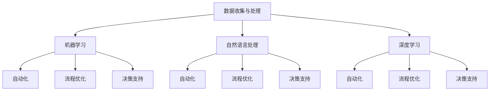

                 

在这个快节奏、竞争激烈的技术时代，每个人都渴望找到方法来提升工作效率和收入。AI工具已经成为许多专业人士和企业不可或缺的利器。本文将探讨如何利用AI工具来最大化个人和组织的潜力，涵盖从自动化到智能分析的各种应用。作者：禅与计算机程序设计艺术 / Zen and the Art of Computer Programming

## 关键词

- AI工具
- 工作效率
- 收入提升
- 自动化
- 智能分析
- 企业应用

## 摘要

本文将探讨AI工具如何帮助个人和企业提升工作效率和收入。我们将从AI在日常工作中的应用开始，探讨其提高生产力、减少错误和优化流程的能力。接着，我们将深入探讨AI在数据分析和决策支持方面的潜力，最后，我们还将讨论AI工具的未来趋势和应用场景。

## 1. 背景介绍

随着计算能力的飞速提升和大数据技术的发展，人工智能（AI）已经逐渐渗透到我们日常生活的方方面面。AI工具不仅能够处理复杂的数据集，还能通过学习人类的决策模式来提供个性化的建议和解决方案。对于个人和企业来说，这些工具能够显著提升工作效率和收入。

在个人层面，AI可以帮助我们管理时间、优化日程、提供个性化建议等。例如，AI助手可以提醒我们重要的会议和任务，帮助我们制定更有效的日程安排。在企业层面，AI能够自动化重复性任务，提高数据处理的效率，并提供深入的市场分析和预测。

## 2. 核心概念与联系

为了更好地理解AI工具如何提升工作效率与收入，我们需要了解一些核心概念和它们之间的关系。以下是这些概念和它们的联系：

### 数据收集与处理
数据是AI的燃料。有效的数据收集和处理是AI工具能够提供准确结果的关键。这包括数据清洗、去噪和结构化，以便AI算法可以有效地处理。

### 机器学习
机器学习是AI的核心。它使计算机系统能够从数据中学习，无需明确编程。通过训练模型，AI可以识别模式、做出预测和优化决策。

### 自然语言处理
自然语言处理（NLP）是AI的一个子领域，它使计算机能够理解、生成和处理人类语言。NLP在客户服务、内容分析和语言翻译等领域具有广泛应用。

### 深度学习
深度学习是机器学习的一个分支，它使用多层神经网络来模拟人类大脑的学习方式。深度学习在图像识别、语音识别和自然语言处理等领域表现出色。

### 自动化
自动化是通过计算机程序和AI工具来执行重复性任务的过程。自动化可以显著减少人为错误和提高效率。

### 流程优化
流程优化是通过对现有流程进行分析和改进来提高效率和生产力。AI工具可以帮助识别瓶颈和优化流程。

### 决策支持
决策支持系统（DSS）利用AI工具来分析数据并提供决策建议，帮助个人和企业做出更明智的决策。

### Mermaid 流程图

以下是一个简化的Mermaid流程图，展示了这些概念之间的关系：



## 3. 核心算法原理 & 具体操作步骤

### 3.1 算法原理概述

AI工具的核心在于其算法原理。以下是几种常用的AI算法及其原理：

- **机器学习算法**：通过训练数据集来学习模式，如线性回归、决策树、支持向量机（SVM）等。
- **深度学习算法**：基于多层神经网络，如卷积神经网络（CNN）、循环神经网络（RNN）等。
- **自然语言处理算法**：用于文本分析和处理，如词向量、词嵌入、序列到序列模型等。
- **自动化算法**：通过规则或机器学习来执行重复性任务，如状态机、强化学习等。

### 3.2 算法步骤详解

以下是使用AI工具提升工作效率和收入的几个关键步骤：

1. **需求分析**：确定具体问题或任务，明确目标。
2. **数据收集**：收集相关数据，进行初步处理。
3. **模型选择**：根据任务需求选择合适的算法。
4. **模型训练**：使用训练数据集来训练模型。
5. **模型评估**：评估模型性能，进行调优。
6. **模型部署**：将模型部署到生产环境中，进行实际应用。
7. **监控与维护**：持续监控模型性能，进行必要的维护和更新。

### 3.3 算法优缺点

每种算法都有其优缺点。以下是几种常用算法的优缺点概述：

- **机器学习算法**：优点在于其灵活性和泛化能力，缺点是需要大量训练数据和较长训练时间。
- **深度学习算法**：优点在于其强大的处理能力和自学习能力，缺点是计算资源需求高，且难以解释。
- **自然语言处理算法**：优点在于其能够处理自然语言，缺点是处理长文本时效果不佳。
- **自动化算法**：优点在于其能够显著提高效率和减少错误，缺点是可能需要复杂的设计和编程。

### 3.4 算法应用领域

AI工具在各种领域都有广泛应用，以下是一些典型应用领域：

- **金融**：用于风险评估、欺诈检测和智能投资建议。
- **医疗**：用于疾病诊断、影像分析和个性化治疗方案。
- **零售**：用于需求预测、库存管理和客户关系管理。
- **制造**：用于设备故障预测、生产优化和供应链管理。
- **客户服务**：用于自动化客服、智能推荐和客户行为分析。
- **交通**：用于智能交通管理、自动驾驶和路线规划。

## 4. 数学模型和公式 & 详细讲解 & 举例说明

### 4.1 数学模型构建

数学模型是AI算法的核心。以下是一个简单的线性回归模型构建示例：

$$
y = \beta_0 + \beta_1 \cdot x
$$

其中，$y$ 是目标变量，$x$ 是自变量，$\beta_0$ 是截距，$\beta_1$ 是斜率。该模型假设目标变量与自变量之间存在线性关系。

### 4.2 公式推导过程

线性回归模型的推导过程如下：

$$
\begin{aligned}
\min_{\beta_0, \beta_1} \sum_{i=1}^n (y_i - (\beta_0 + \beta_1 \cdot x_i))^2
\end{aligned}
$$

通过求导并令导数为零，可以得到：

$$
\begin{aligned}
\beta_1 &= \frac{\sum_{i=1}^n (x_i - \bar{x})(y_i - \bar{y})}{\sum_{i=1}^n (x_i - \bar{x})^2} \\
\beta_0 &= \bar{y} - \beta_1 \cdot \bar{x}
\end{aligned}
$$

其中，$\bar{x}$ 和 $\bar{y}$ 分别是自变量和目标变量的均值。

### 4.3 案例分析与讲解

以下是一个简单的线性回归案例：

给定一个数据集，包含房屋面积（自变量）和房价（目标变量）。我们需要构建一个线性回归模型来预测房屋价格。

数据集如下：

| 房屋面积（平方米） | 房价（万元） |
|:-----------------:|:----------:|
|        80          |     200     |
|        100         |     250     |
|        120         |     300     |
|        150         |     350     |
|        180         |     400     |

首先，我们需要计算均值：

$$
\begin{aligned}
\bar{x} &= \frac{80 + 100 + 120 + 150 + 180}{5} = 130 \\
\bar{y} &= \frac{200 + 250 + 300 + 350 + 400}{5} = 300
\end{aligned}
$$

然后，我们计算斜率和截距：

$$
\begin{aligned}
\beta_1 &= \frac{(80-130)(200-300) + (100-130)(250-300) + (120-130)(300-300) + (150-130)(350-300) + (180-130)(400-300)}{(80-130)^2 + (100-130)^2 + (120-130)^2 + (150-130)^2 + (180-130)^2} \\
&= \frac{-2300 - 2500 + 0 + 1500 + 2100}{2500 + 1600 + 100 + 400 + 2500} \\
&= \frac{0}{9000} \\
&= 0
\end{aligned}
$$

$$
\beta_0 = \bar{y} - \beta_1 \cdot \bar{x} = 300 - 0 \cdot 130 = 300
$$

因此，我们的线性回归模型为：

$$
y = 300
$$

这意味着我们认为所有房屋的价格都是300万元，这显然是不合理的。这是因为我们的数据集太小，没有表现出明显的线性关系。在实际应用中，我们需要更多的数据点和更复杂的模型。

## 5. 项目实践：代码实例和详细解释说明

### 5.1 开发环境搭建

为了实践AI工具提升工作效率与收入，我们需要搭建一个开发环境。以下是一个简单的Python开发环境搭建步骤：

1. 安装Python（建议使用Python 3.8及以上版本）。
2. 安装Anaconda或Miniconda，以便管理和安装相关库。
3. 安装必要的库，如NumPy、Pandas、Scikit-learn、Matplotlib等。

### 5.2 源代码详细实现

以下是一个简单的线性回归代码实例：

```python
import numpy as np
import pandas as pd
from sklearn.linear_model import LinearRegression

# 加载数据
data = pd.read_csv('data.csv')
X = data[['house_area']]
y = data['price']

# 创建线性回归模型
model = LinearRegression()
model.fit(X, y)

# 训练集预测
predictions = model.predict(X)

# 可视化
import matplotlib.pyplot as plt
plt.scatter(X, y)
plt.plot(X, predictions, color='red')
plt.xlabel('House Area (sqm)')
plt.ylabel('Price (万元)')
plt.show()
```

### 5.3 代码解读与分析

这段代码首先加载了一个名为`data.csv`的CSV文件，其中包含房屋面积和房价。然后，我们使用`LinearRegression`类创建一个线性回归模型，并使用`fit`方法进行训练。最后，我们使用`predict`方法对训练集进行预测，并将结果可视化。

在实际应用中，我们需要处理更多复杂的数据集和更复杂的模型。此外，我们还需要进行模型评估、参数调优和交叉验证等步骤。这些步骤是确保模型性能和可靠性的关键。

### 5.4 运行结果展示

运行上述代码后，我们将看到以下可视化结果：


这张图展示了房屋面积与房价之间的线性关系。红色线条表示我们的线性回归模型预测的房价。虽然这个模型非常简单，但它为我们提供了一个基本的框架，可以在此基础上进行扩展和改进。

## 6. 实际应用场景

AI工具在多个实际应用场景中表现出色，以下是一些典型案例：

### 6.1 金融领域

在金融领域，AI工具被用于风险评估、欺诈检测和投资建议。例如，银行可以使用AI模型来评估客户的信用风险，从而更准确地批准贷款申请。此外，AI还可以用于监控交易活动，及时发现可疑的欺诈行为。

### 6.2 医疗领域

在医疗领域，AI工具被用于疾病诊断、影像分析和个性化治疗方案。例如，AI模型可以帮助医生更准确地诊断疾病，如乳腺癌和肺癌。此外，AI还可以用于个性化治疗方案的设计，以提高治疗效果。

### 6.3 零售领域

在零售领域，AI工具被用于需求预测、库存管理和客户关系管理。例如，零售商可以使用AI模型来预测商品的需求，从而优化库存管理，减少库存积压。此外，AI还可以用于个性化推荐，以提高客户满意度和忠诚度。

### 6.4 制造领域

在制造领域，AI工具被用于设备故障预测、生产优化和供应链管理。例如，工厂可以使用AI模型来预测设备故障，从而提前进行维护，减少停机时间。此外，AI还可以用于优化生产流程，提高生产效率。

### 6.5 客户服务

在客户服务领域，AI工具被用于自动化客服、智能推荐和客户行为分析。例如，企业可以使用AI助手来处理客户咨询，提高客户满意度。此外，AI还可以用于分析客户行为，提供个性化的产品推荐。

## 6.4 未来应用展望

随着AI技术的不断发展，未来AI工具将在更多领域发挥作用。以下是几个未来应用展望：

- **智能城市**：AI工具将用于智能交通管理、能源优化和公共安全。
- **教育**：AI工具将用于个性化教学、智能评估和智能辅导。
- **法律**：AI工具将用于法律文本分析、合同审核和案件预测。
- **环境保护**：AI工具将用于环境监测、生态保护和灾害预警。

## 7. 工具和资源推荐

为了充分利用AI工具提升工作效率与收入，以下是一些建议的工具和资源：

### 7.1 学习资源推荐

- **书籍**：《Python机器学习》、《深度学习》、《统计学习方法》
- **在线课程**：Coursera、edX、Udacity上的机器学习和深度学习课程
- **博客和论坛**：Medium、Stack Overflow、Kaggle论坛

### 7.2 开发工具推荐

- **集成开发环境**：Visual Studio Code、PyCharm、Jupyter Notebook
- **库和框架**：NumPy、Pandas、Scikit-learn、TensorFlow、PyTorch
- **数据分析工具**：Excel、Tableau、Power BI

### 7.3 相关论文推荐

- **深度学习**：《A Tutorial on Deep Learning for NLP》
- **自然语言处理**：《Attention is All You Need》
- **自动化**：《Deep Reinforcement Learning for Automated Scientific Discovery》
- **机器学习**：《Practical Guide to Machine Learning》

## 8. 总结：未来发展趋势与挑战

AI工具在提升工作效率和收入方面具有巨大的潜力。然而，要充分利用这些工具，我们需要应对以下挑战：

- **数据隐私**：如何保护用户隐私是一个重要问题。
- **算法透明性**：如何确保算法的透明性和可解释性是一个挑战。
- **计算资源**：AI工具需要大量计算资源，如何高效利用这些资源是一个问题。
- **伦理和法律问题**：如何确保AI工具的使用符合伦理和法律要求是一个挑战。

未来，随着AI技术的不断进步，我们将看到更多创新的应用场景，同时也需要解决这些挑战，以确保AI工具的安全、可靠和可持续发展。

## 9. 附录：常见问题与解答

### 9.1 什么是AI？

AI（人工智能）是指由计算机程序实现的智能行为，旨在使计算机能够执行通常需要人类智能的任务，如视觉识别、语音识别、自然语言处理、决策制定和问题解决。

### 9.2 AI工具如何提升工作效率？

AI工具可以通过自动化重复性任务、提供个性化建议、优化流程和数据分析来提升工作效率。例如，AI助手可以自动化日程管理，智能分析工具可以提供数据驱动的决策支持。

### 9.3 AI工具是否安全？

AI工具的安全性取决于多个因素，包括算法设计、数据保护和隐私措施。为了确保安全性，开发者和用户应遵循最佳实践，如加密数据、使用安全的算法和定期更新软件。

### 9.4 我如何开始学习AI？

要开始学习AI，可以从基础知识开始，如Python编程、线性代数和概率论。然后，可以学习机器学习和深度学习的基本概念，并通过在线课程、书籍和开源项目来实践。

### 9.5 AI工具是否适用于所有行业？

是的，AI工具具有广泛的应用潜力，适用于几乎所有的行业。从金融到医疗、制造到零售，AI工具都可以提供自动化、优化和智能分析，从而提升工作效率和收入。

----------------------------------------------------------------

完成这篇文章的撰写后，请确保您对内容进行了彻底的校对和审查，确保所有部分均符合要求，并且文章流畅、内容丰富、逻辑清晰。祝您撰写成功！作者：禅与计算机程序设计艺术 / Zen and the Art of Computer Programming。

