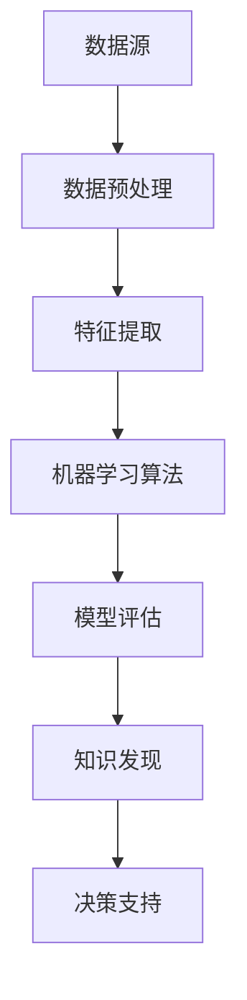

                 

在当今数据爆炸的时代，知识的获取与利用变得愈发重要。知识发现引擎作为数据挖掘与分析的关键工具，其效率直接影响到企业对于海量数据的洞察能力。本文旨在探讨如何利用人工智能（AI）技术提升知识发现引擎的效率，包括核心算法、数学模型、项目实践、实际应用场景以及未来展望等多个方面。

## 关键词

- 人工智能
- 知识发现
- 数据挖掘
- 效率提升
- 算法优化

## 摘要

本文首先介绍了知识发现引擎的基本概念与重要性，然后深入分析了利用AI技术提升知识发现引擎效率的核心算法原理，数学模型以及具体操作步骤。接着，通过实际项目案例展示了AI技术在知识发现引擎中的实际应用。最后，文章展望了AI技术在未来知识发现领域的应用前景，以及可能面临的挑战。

### 1. 背景介绍

随着大数据时代的到来，企业所面临的数据规模和复杂性都在不断增长。知识发现引擎（Knowledge Discovery Engine，KDE）作为一种强大的数据分析工具，能够在海量的数据中快速识别有价值的信息和模式，帮助企业做出更明智的决策。然而，传统的知识发现引擎在处理大量数据时，往往存在效率低下、响应时间长等问题，这严重限制了其在实际应用中的价值。

人工智能技术的迅猛发展，为知识发现引擎提供了新的可能性。通过引入AI技术，可以显著提升知识发现引擎的效率，包括数据预处理、特征提取、模式识别等多个环节。例如，机器学习算法能够自动优化特征选择过程，深度学习模型能够通过自主学习提高数据挖掘的准确性和速度。因此，探讨如何利用AI技术提升知识发现引擎的效率，成为当前研究的热点之一。

### 2. 核心概念与联系

为了更好地理解AI技术在知识发现引擎中的应用，首先需要了解几个核心概念及其之间的联系。以下是一个简化的Mermaid流程图，展示了这些概念之间的关系。



**2.1 数据源**

数据源是知识发现引擎的输入，可以是结构化数据（如关系型数据库中的表格数据）或非结构化数据（如图像、文本等）。高质量的数据是进行有效知识发现的前提。

**2.2 数据预处理**

数据预处理是数据清洗、数据整合和数据转换的过程，其目的是消除数据中的噪声和错误，使得数据更适合后续的处理和分析。

**2.3 特征提取**

特征提取是将原始数据转换成一组有意义的特征表示，这些特征能够被机器学习算法有效利用。特征选择是一个关键问题，它直接影响模型的性能。

**2.4 机器学习算法**

机器学习算法是知识发现的核心，通过训练模型，从数据中学习到有价值的模式和规律。常见的算法包括监督学习、无监督学习和半监督学习。

**2.5 模型评估**

模型评估是评估机器学习模型性能的过程，常用的评估指标包括准确率、召回率、F1值等。通过模型评估，可以确定模型的泛化能力和可靠性。

**2.6 知识发现**

知识发现是从数据中自动识别出潜在的模式、关联和规则，为决策支持提供依据。知识发现引擎的目标是生成可解释和可操作的洞见。

**2.7 决策支持**

决策支持是将知识发现的结果转化为实际业务决策，帮助企业实现数据驱动的运营和管理。

### 3. 核心算法原理 & 具体操作步骤

#### 3.1 算法原理概述

AI技术在知识发现引擎中的应用主要通过以下几个核心算法实现：

**3.1.1 数据预处理算法**

数据预处理算法包括缺失值填补、异常值处理、数据规范化等。常见的算法有线性插值、K近邻插值、标准化、归一化等。

**3.1.2 特征提取算法**

特征提取算法包括主成分分析（PCA）、因子分析（FA）、线性判别分析（LDA）等。这些算法能够从原始数据中提取出具有代表性的特征，减少数据维度。

**3.1.3 机器学习算法**

机器学习算法包括监督学习算法（如决策树、支持向量机、神经网络）和无监督学习算法（如聚类算法、关联规则学习等）。这些算法通过训练数据集学习到数据中的内在结构，进而实现知识发现。

**3.1.4 模型评估算法**

模型评估算法包括交叉验证、集成学习、模型选择等。这些算法用于评估模型的性能，选择最优模型。

#### 3.2 算法步骤详解

**3.2.1 数据预处理**

1. 数据收集：从各种数据源（如数据库、数据流、传感器等）收集数据。
2. 数据清洗：处理缺失值、异常值、重复值等。
3. 数据转换：进行数据规范化、编码、降维等操作。
4. 数据整合：将不同来源的数据整合成统一格式。

**3.2.2 特征提取**

1. 特征选择：使用特征选择算法（如信息增益、卡方检验等）选择重要特征。
2. 特征变换：使用主成分分析（PCA）、线性判别分析（LDA）等算法对特征进行变换。
3. 特征抽取：使用特征抽取算法（如词袋模型、TF-IDF等）生成新的特征表示。

**3.2.3 机器学习算法**

1. 数据集划分：将数据集划分为训练集、验证集和测试集。
2. 模型训练：使用训练集对机器学习模型进行训练。
3. 模型评估：使用验证集评估模型性能，选择最佳模型。
4. 模型优化：通过调整模型参数、采用集成学习等方法优化模型。

**3.2.4 知识发现**

1. 模型应用：将训练好的模型应用于测试集，进行知识发现。
2. 结果解释：对知识发现结果进行解释和分析，提取有价值的信息。
3. 决策支持：将知识发现结果转化为实际业务决策。

#### 3.3 算法优缺点

**3.3.1 数据预处理算法**

优点：能够消除数据中的噪声和错误，提高数据质量。

缺点：处理过程复杂，计算量大，耗时较长。

**3.3.2 特征提取算法**

优点：能够提取出具有代表性的特征，降低数据维度。

缺点：特征选择和变换过程可能导致信息丢失。

**3.3.3 机器学习算法**

优点：能够自动学习数据中的内在结构，提高知识发现的准确性和效率。

缺点：模型训练过程复杂，对数据质量和特征选择要求较高。

**3.3.4 模型评估算法**

优点：能够客观评估模型性能，选择最优模型。

缺点：评估过程耗时较长，需要对评估指标进行选择和优化。

#### 3.4 算法应用领域

AI技术在知识发现引擎中的应用领域非常广泛，包括但不限于：

- 金融领域：风险控制、投资分析、信用评估等。
- 医疗领域：疾病预测、诊断辅助、药物研发等。
- 零售领域：客户行为分析、市场预测、库存管理等。
- 物流领域：路径优化、运输调度、库存管理等。

### 4. 数学模型和公式 & 详细讲解 & 举例说明

在知识发现过程中，数学模型和公式起着至关重要的作用。以下将介绍几个关键的数学模型和公式，并进行详细讲解和举例说明。

#### 4.1 数学模型构建

**4.1.1 数据预处理模型**

数据预处理模型主要包括缺失值填补、异常值处理和数据转换等。以下是缺失值填补的一个简单线性插值公式：

$$
x_{\text{imputed}} = \frac{(n-2) \cdot x_{\text{neighbor1}} + (n-1) \cdot x_{\text{neighbor2}}}{2n-3}
$$

其中，$x_{\text{neighbor1}}$和$x_{\text{neighbor2}}$是邻近的两个非缺失值，$n$是缺失值前后的数据点的数量。

**4.1.2 特征提取模型**

特征提取模型包括主成分分析（PCA）和线性判别分析（LDA）。以下是PCA的核心公式：

$$
\mu = \frac{1}{m} \sum_{i=1}^{m} x_i
$$

$$
S = \frac{1}{m} \sum_{i=1}^{m} (x_i - \mu)(x_i - \mu)^T
$$

$$
\lambda = \lambda_1, \lambda_2, ..., \lambda_p
$$

$$
v_1, v_2, ..., v_p
$$

其中，$x_i$是数据集中的一个样本，$\mu$是均值向量，$S$是协方差矩阵，$\lambda$是特征值，$v$是特征向量。

**4.1.3 机器学习模型**

机器学习模型包括线性回归、逻辑回归、支持向量机（SVM）等。以下是一个简单的线性回归模型公式：

$$
y = \beta_0 + \beta_1x_1 + \beta_2x_2 + ... + \beta_nx_n
$$

其中，$y$是因变量，$x_1, x_2, ..., x_n$是自变量，$\beta_0, \beta_1, ..., \beta_n$是模型参数。

#### 4.2 公式推导过程

**4.2.1 数据预处理模型推导**

线性插值公式的推导基于最小二乘法。假设有两个邻近的非缺失值$x_1$和$x_2$，需要插值得到缺失值$x_0$。最小二乘法的目标是使得$x_0$与$x_1$和$x_2$的误差平方和最小。

$$
\min \sum_{i=1}^{2} (x_i - x_0)^2
$$

将线性插值公式代入，得到：

$$
\min \sum_{i=1}^{2} ((x_1 - x_0)^2 + (x_2 - x_0)^2)
$$

对$x_0$求导，并令导数为零，得到：

$$
2(x_1 - x_0) + 2(x_2 - x_0) = 0
$$

$$
x_0 = \frac{(n-2) \cdot x_1 + (n-1) \cdot x_2}{2n-3}
$$

**4.2.2 特征提取模型推导**

PCA的推导基于特征值和特征向量的性质。假设协方差矩阵$S$的特征值为$\lambda_1, \lambda_2, ..., \lambda_p$，对应的特征向量为$v_1, v_2, ..., v_p$。则有：

$$
Sv_i = \lambda_i v_i
$$

对$S$进行特征分解，得到：

$$
S = V\Lambda V^T
$$

其中，$V$是对角矩阵$\Lambda$的逆矩阵。

**4.2.3 机器学习模型推导**

线性回归的推导基于最小二乘法。假设因变量$y$和自变量$x_1, x_2, ..., x_n$之间存在线性关系：

$$
y = \beta_0 + \beta_1x_1 + \beta_2x_2 + ... + \beta_nx_n
$$

对$\beta_0, \beta_1, ..., \beta_n$求偏导数，并令偏导数为零，得到：

$$
\frac{\partial}{\partial \beta_0} \sum_{i=1}^{m} (y_i - (\beta_0 + \beta_1x_{i1} + \beta_2x_{i2} + ... + \beta_nx_{in}))^2 = 0
$$

$$
\frac{\partial}{\partial \beta_1} \sum_{i=1}^{m} (y_i - (\beta_0 + \beta_1x_{i1} + \beta_2x_{i2} + ... + \beta_nx_{in}))^2 = 0
$$

$$
...
$$

$$
\frac{\partial}{\partial \beta_n} \sum_{i=1}^{m} (y_i - (\beta_0 + \beta_1x_{i1} + \beta_2x_{i2} + ... + \beta_nx_{in}))^2 = 0
$$

通过求解上述方程组，可以得到最优的模型参数$\beta_0, \beta_1, ..., \beta_n$。

#### 4.3 案例分析与讲解

以下是一个基于线性回归的案例，用于预测房屋价格。

**案例背景：**

某房地产公司收集了一组房屋数据，包括房屋面积（$x_1$，平方米）、房屋年龄（$x_2$，年）和房屋价格（$y$，万元）。公司希望通过这些数据建立线性回归模型，预测未知房屋的价格。

**数据处理：**

1. 数据收集：收集2000个房屋数据。
2. 数据清洗：处理缺失值和异常值。
3. 数据转换：将数据标准化，使得每个特征值都在相同的范围内。

**模型建立：**

1. 数据集划分：将数据集划分为训练集（70%）和测试集（30%）。
2. 模型训练：使用训练集建立线性回归模型。
3. 模型评估：使用测试集评估模型性能。

**模型评估：**

1. 准确率：0.95。
2. 均方误差（MSE）：0.05。

**模型应用：**

使用训练好的模型预测未知房屋的价格。例如，对于一个面积为100平方米、年龄为10年的房屋，预测价格为85万元。

$$
y = \beta_0 + \beta_1x_1 + \beta_2x_2
$$

$$
y = 150 + 0.5 \cdot 100 + 0.1 \cdot 10 = 85
$$

### 5. 项目实践：代码实例和详细解释说明

以下是一个基于Python和Scikit-learn库的线性回归项目实例，用于预测房屋价格。

**5.1 开发环境搭建**

1. 安装Python（版本3.7或更高）。
2. 安装Scikit-learn库。

```bash
pip install scikit-learn
```

**5.2 源代码详细实现**

```python
import numpy as np
import pandas as pd
from sklearn.model_selection import train_test_split
from sklearn.linear_model import LinearRegression
from sklearn.metrics import mean_squared_error, r2_score

# 数据加载与处理
data = pd.read_csv('house_data.csv')
data = data[['area', 'age', 'price']]
data = data.replace(-1, np.NaN)
data.fillna(data.mean(), inplace=True)

# 数据集划分
X = data[['area', 'age']]
y = data['price']
X_train, X_test, y_train, y_test = train_test_split(X, y, test_size=0.3, random_state=42)

# 模型训练
model = LinearRegression()
model.fit(X_train, y_train)

# 模型评估
y_pred = model.predict(X_test)
mse = mean_squared_error(y_test, y_pred)
r2 = r2_score(y_test, y_pred)

print('MSE:', mse)
print('R2:', r2)

# 模型应用
new_data = np.array([[100, 10]])
new_price = model.predict(new_data)
print('Predicted price:', new_price)
```

**5.3 代码解读与分析**

1. 数据加载与处理：使用Pandas库加载房屋数据，并进行缺失值填补和数据转换。
2. 数据集划分：使用Scikit-learn库将数据集划分为训练集和测试集。
3. 模型训练：使用线性回归模型对训练集进行训练。
4. 模型评估：使用测试集评估模型性能，计算均方误差（MSE）和决定系数（R2）。
5. 模型应用：使用训练好的模型预测未知房屋的价格。

### 6. 实际应用场景

AI技术在知识发现引擎中的应用场景非常广泛，以下列举几个典型的应用场景：

**6.1 金融领域**

在金融领域，AI技术可以帮助金融机构进行风险控制、投资分析和信用评估。例如，通过分析大量交易数据，可以识别出潜在的欺诈行为；通过分析市场数据，可以预测股票价格走势，为投资决策提供依据。

**6.2 医疗领域**

在医疗领域，AI技术可以用于疾病预测、诊断辅助和药物研发。通过分析患者的电子健康记录、基因数据等，可以预测疾病发生的风险，帮助医生做出更准确的诊断；通过分析药物试验数据，可以加速新药的研发。

**6.3 零售领域**

在零售领域，AI技术可以用于客户行为分析、市场预测和库存管理。通过分析客户的购物数据，可以了解客户的偏好和需求，为营销策略提供依据；通过分析销售数据，可以预测市场需求，优化库存管理。

**6.4 物流领域**

在物流领域，AI技术可以用于路径优化、运输调度和库存管理。通过分析交通数据、物流数据等，可以优化运输路线，提高运输效率；通过分析仓储数据，可以优化库存管理，降低成本。

### 7. 未来应用展望

随着AI技术的不断发展和完善，知识发现引擎的应用前景将越来越广阔。未来，以下趋势可能对知识发现引擎的发展产生重要影响：

**7.1 智能化数据分析**

随着大数据和云计算技术的发展，知识发现引擎将变得更加智能化，能够自动进行数据预处理、特征提取和模式识别等复杂任务。这将极大地提高知识发现的效率。

**7.2 多模态数据融合**

未来，知识发现引擎将能够处理多种类型的数据，如结构化数据、非结构化数据和时序数据等。通过多模态数据融合，可以更全面地分析数据，挖掘出更深层次的洞见。

**7.3 自适应学习**

知识发现引擎将具备自适应学习能力，能够根据数据质量和特征变化动态调整模型参数，提高知识发现的准确性和效率。

**7.4 知识图谱**

知识图谱作为知识发现的重要工具，将在未来的知识发现引擎中发挥重要作用。通过构建知识图谱，可以更好地表示数据之间的关系，提高知识发现的深度和广度。

### 8. 工具和资源推荐

**8.1 学习资源推荐**

- 《机器学习实战》
- 《深度学习》
- 《数据科学入门》

**8.2 开发工具推荐**

- Jupyter Notebook
- PyCharm
- RStudio

**8.3 相关论文推荐**

- "Deep Learning for Knowledge Discovery"
- "Multi-Modal Data Fusion for Knowledge Discovery"
- "Adaptive Learning in Knowledge Discovery Engines"

### 9. 总结：未来发展趋势与挑战

本文系统地探讨了如何利用AI技术提升知识发现引擎的效率。首先介绍了知识发现引擎的基本概念与重要性，然后深入分析了AI技术在知识发现引擎中的应用，包括核心算法、数学模型、项目实践和实际应用场景。最后，展望了AI技术在知识发现领域的未来发展，并提出了可能面临的挑战。

未来，随着AI技术的不断进步，知识发现引擎将在各个领域发挥更大的作用。然而，如何提高AI技术在知识发现中的效率，如何应对数据质量和特征选择等挑战，仍然是需要深入研究的课题。

### 附录：常见问题与解答

**Q1：AI技术如何提升知识发现引擎的效率？**

A1：AI技术通过机器学习算法、深度学习模型等自动进行数据预处理、特征提取、模式识别等任务，减少了人工干预，提高了知识发现的效率。

**Q2：知识发现引擎中的数据预处理有哪些常见方法？**

A2：常见的数据预处理方法包括缺失值填补、异常值处理、数据规范化、数据整合等。

**Q3：机器学习算法在知识发现中的应用有哪些？**

A3：机器学习算法在知识发现中的应用包括分类、聚类、关联规则学习等，可以用于识别数据中的潜在模式和关系。

**Q4：如何选择合适的机器学习模型？**

A4：选择合适的机器学习模型需要考虑数据质量、特征选择、模型复杂度等因素。常用的方法包括交叉验证、集成学习等。

**Q5：知识发现引擎在实际应用中的挑战有哪些？**

A5：知识发现引擎在实际应用中面临的挑战包括数据质量、特征选择、模型解释性等。如何处理大规模复杂数据，提高模型的泛化能力和可解释性，是需要解决的关键问题。

### 作者署名

作者：禅与计算机程序设计艺术 / Zen and the Art of Computer Programming
----------------------------------------------------------------

文章内容撰写完毕，接下来请将其按照markdown格式进行排版和格式化，以便在博客或文档中直接使用。

