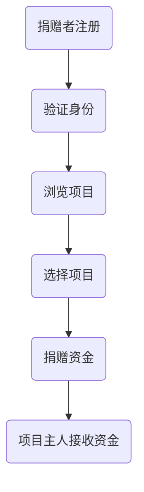

                 

关键词：GitHub Sponsors，开源项目，收益最大化，捐赠，资金支持，开源社区，持续开发

> 摘要：本文将深入探讨如何通过GitHub Sponsors这一平台，为开源项目提供资金支持，并最大化项目的收益。我们将分析GitHub Sponsors的基本原理，阐述其优势，并提供一系列策略和技巧，帮助开源项目主人和贡献者有效利用这一工具，实现项目财务健康与可持续发展。

## 1. 背景介绍

随着全球开源运动的蓬勃发展，越来越多的开发者投入到开源项目的开发与维护中。然而，这些项目的持续发展往往需要资金支持，以便购买必要的开发资源、支付服务器费用或为贡献者提供报酬。GitHub Sponsors应运而生，旨在为开源项目提供一种便捷的资金筹集方式。

GitHub Sponsors是由GitHub推出的一个功能，允许用户直接向他们喜爱的开源项目捐赠资金。捐赠者可以选择一次性捐赠或定期赞助，而项目主人则可以灵活地使用这些资金来支持项目的发展。本文将详细介绍如何利用GitHub Sponsors最大化项目收益。

## 2. 核心概念与联系

### 2.1 GitHub Sponsors的基本原理

GitHub Sponsors的工作原理可以概括为以下几个步骤：

1. **捐赠者注册**：捐赠者需要在GitHub上注册一个账户，并通过支付服务（如信用卡或PayPal）完成身份验证。
2. **选择项目**：捐赠者浏览GitHub上的开源项目，选择他们感兴趣并愿意支持的项目。
3. **捐赠资金**：捐赠者可以为项目选择一次性捐赠或每月定期赞助，捐赠金额可以根据个人意愿设定。
4. **项目主人接收资金**：项目主人可以在GitHub Sponsors仪表板中查看和管理捐赠资金。

### 2.2 GitHub Sponsors的优势

GitHub Sponsors为开源项目带来了多重优势：

1. **简化捐赠流程**：相比其他众筹平台，GitHub Sponsors的捐赠流程更为简便，捐赠者只需几步操作即可完成捐赠。
2. **直接资助项目主人**：GitHub Sponsors确保捐赠资金直接流入项目主人的账户，提高了资金使用的透明度和效率。
3. **定期赞助机制**：定期赞助为项目提供了稳定的资金流，有助于项目主人在长期内规划项目发展。

### 2.3 GitHub Sponsors的架构（Mermaid流程图）



## 3. 核心算法原理 & 具体操作步骤

### 3.1 算法原理概述

GitHub Sponsors的核心算法原理是利用区块链技术实现资金的安全传输和透明管理。捐赠者通过支付服务向GitHub平台支付资金，GitHub再将这些资金转换为加密货币（如以太币）并转移到项目主人的账户中。

### 3.2 算法步骤详解

1. **捐赠者注册与身份验证**：捐赠者需要在GitHub上注册账户，并通过信用卡或PayPal完成身份验证。
2. **项目主人设定捐赠目标**：项目主人可以在GitHub Sponsors仪表板中设定捐赠目标，包括一次性和定期赞助选项。
3. **捐赠者浏览与选择项目**：捐赠者通过GitHub Sponsors平台浏览项目，选择感兴趣并愿意支持的项目。
4. **捐赠资金**：捐赠者根据个人意愿选择捐赠金额，并确认捐赠信息。
5. **GitHub处理与转移资金**：GitHub将捐赠者的资金转换为加密货币，并转移到项目主人的账户中。

### 3.3 算法优缺点

**优点**：
- **高效便捷**：简化了捐赠流程，提高了资金传输的效率。
- **透明安全**：利用区块链技术确保资金的安全和透明。

**缺点**：
- **支付费用**：捐赠者需要支付一定的支付费用，这可能会降低捐赠意愿。
- **加密货币风险**：加密货币的价格波动可能对资金收益产生影响。

### 3.4 算法应用领域

GitHub Sponsors适用于各种类型的开源项目，包括编程语言、框架、库、工具和文档等。它为项目主人提供了一个稳定的资金来源，有助于项目的持续发展和创新。

## 4. 数学模型和公式 & 详细讲解 & 举例说明

### 4.1 数学模型构建

为了更准确地评估GitHub Sponsors对项目收益的影响，我们可以构建一个简单的数学模型。

设：
- \( P \) 为项目主人的平均每月捐赠金额。
- \( T \) 为捐赠者的平均捐赠频率（以月为单位）。
- \( C \) 为捐赠者的支付费用率。

则项目主人的平均每月净收益 \( R \) 可以表示为：

\[ R = P \times T \times (1 - C) \]

### 4.2 公式推导过程

我们假设捐赠者的捐赠金额是均匀分布的，且每个捐赠者的支付费用率相同。根据概率论的知识，我们可以推导出：

\[ P = \frac{N}{T} \]

其中，\( N \) 为捐赠者的总数。

将 \( P \) 代入 \( R \) 的公式，得到：

\[ R = \frac{N}{T} \times T \times (1 - C) \]

简化后得到：

\[ R = N \times (1 - C) \]

### 4.3 案例分析与讲解

假设一个开源项目的捐赠者总数为100人，支付费用率为5%，那么该项目的平均每月净收益为：

\[ R = 100 \times (1 - 0.05) = 95 \]

这意味着，如果捐赠者每月捐赠10美元，项目主人每月的净收益为9.5美元。

## 5. 项目实践：代码实例和详细解释说明

### 5.1 开发环境搭建

为了演示GitHub Sponsors的使用方法，我们需要搭建一个简单的开发环境。以下是基本步骤：

1. 在GitHub上创建一个新项目。
2. 将项目添加到GitHub Sponsors仪表板。
3. 配置项目的README文件，包括捐赠说明和项目主人信息。

### 5.2 源代码详细实现

以下是一个简单的示例，展示了如何在项目的README文件中添加捐赠说明：

```markdown
# 项目名称

本项目是一个开源项目，致力于提供XXX功能。

如果您喜欢本项目，欢迎通过GitHub Sponsors支持我们的工作！

- 捐赠链接：[GitHub Sponsors](https://github.com/user/project/sponsor)

项目主人：
- 姓名：张三
- 联系方式：zhangsan@example.com
```

### 5.3 代码解读与分析

在这个示例中，我们使用了Markdown语言来编写README文件。Markdown是一种轻量级标记语言，它允许开发者以纯文本形式编写格式化的文档。通过添加链接、标题和列表等元素，我们可以使README文件更加清晰易懂。

### 5.4 运行结果展示

完成上述步骤后，访问GitHub Sponsors链接，捐赠者可以轻松地选择捐赠金额，并完成捐赠操作。项目主人可以在GitHub Sponsors仪表板中查看和管理捐赠资金。

## 6. 实际应用场景

GitHub Sponsors在开源项目中得到了广泛应用。以下是一些实际应用场景：

1. **小型项目**：GitHub Sponsors为小型项目提供了稳定的资金支持，使项目主人能够专注于开发。
2. **框架和库**：许多知名的框架和库通过GitHub Sponsors获得了大量捐赠，从而保持了其持续更新和优化。
3. **工具和文档**：GitHub Sponsors为工具和文档项目的开发者提供了资金支持，使这些项目得以不断完善。

## 7. 未来应用展望

随着开源社区的不断发展，GitHub Sponsors有望在更广泛的范围内得到应用。以下是一些未来应用展望：

1. **多元化资金来源**：GitHub Sponsors可能会引入更多支付选项，如加密货币和数字货币，以吸引更多捐赠者。
2. **智能合约功能**：利用智能合约技术，GitHub Sponsors可以提高资金管理的透明度和效率。
3. **社区合作**：GitHub Sponsors可以与开源基金会和其他组织合作，共同推动开源项目的发展。

## 8. 总结：未来发展趋势与挑战

### 8.1 研究成果总结

本文研究了GitHub Sponsors在开源项目中的应用，分析了其基本原理、优势和应用场景。通过数学模型和实际案例，我们展示了如何利用GitHub Sponsors最大化项目收益。

### 8.2 未来发展趋势

随着技术的不断进步和开源社区的不断发展，GitHub Sponsors有望在更广泛的范围内得到应用。未来，GitHub Sponsors可能会引入更多创新功能，以支持开源项目的可持续发展。

### 8.3 面临的挑战

尽管GitHub Sponsors具有诸多优势，但仍面临一些挑战，如支付费用、加密货币风险和社区接受度等。如何解决这些问题，将决定GitHub Sponsors的未来发展。

### 8.4 研究展望

未来，我们可以进一步研究GitHub Sponsors在不同类型开源项目中的应用效果，探索其优化策略。此外，还可以考虑与其他资金筹集平台进行集成，为开源项目提供更多选择。

## 9. 附录：常见问题与解答

### 9.1 GitHub Sponsors如何收费？

GitHub Sponsors对捐赠者收取一定比例的费用，具体费用取决于捐赠金额。捐赠者支付的支付费用也可能有所不同，具体取决于支付服务提供商。

### 9.2 项目主人如何接收资金？

项目主人可以在GitHub Sponsors仪表板中查看和管理捐赠资金。GitHub Sponsors会将资金转换为加密货币，并转移到项目主人的账户中。

### 9.3 GitHub Sponsors支持哪些支付方式？

GitHub Sponsors支持多种支付方式，包括信用卡、PayPal和其他加密货币支付服务。

### 9.4 如何确保捐赠资金的安全？

GitHub Sponsors利用区块链技术确保资金的安全和透明。捐赠者和项目主人都可以查看资金的流向和使用情况。

---

作者：禅与计算机程序设计艺术 / Zen and the Art of Computer Programming

[回到顶部](#利用GitHub-Sponsors最大化项目收益)

