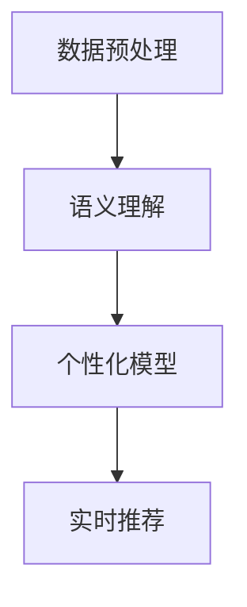

                 

关键词：大型语言模型（LLM），推荐系统，个性化定制，实时优化，算法，数学模型，项目实践

> 摘要：本文将探讨如何利用大型语言模型（LLM）优化推荐系统的实时个性化定制。首先介绍推荐系统的背景和现状，接着阐述LLM在个性化定制中的作用，详细讲解核心算法原理和数学模型，并通过项目实践展示代码实现过程。最后，分析实际应用场景，展望未来发展趋势与挑战。

## 1. 背景介绍

### 推荐系统概述

推荐系统是一种通过预测用户对物品的兴趣度，从而向用户推荐相关物品的信息系统。自互联网兴起以来，推荐系统在电子商务、社交媒体、新闻推送等多个领域得到了广泛应用。传统的推荐系统主要基于协同过滤、基于内容的推荐和混合推荐等方法，但存在一定的局限性。随着人工智能技术的发展，特别是深度学习和自然语言处理技术的进步，推荐系统开始迈向智能化、个性化方向。

### 实时个性化定制

实时个性化定制是指根据用户当前的行为和偏好，动态调整推荐策略，提供高度个性化的推荐服务。这种定制化推荐不仅能提高用户的满意度，还能提升平台的用户黏性和商业价值。然而，实现实时个性化定制面临着数据量大、处理速度快、个性化需求多样等挑战。

## 2. 核心概念与联系

为了实现实时个性化定制，我们引入了大型语言模型（LLM），其具有强大的文本生成和语义理解能力。下面是核心概念和LLM在推荐系统中的架构流程：

### 核心概念

- **用户行为数据**：包括用户浏览、搜索、购买等行为数据。
- **用户偏好**：通过对用户行为数据的分析，提取用户兴趣标签和偏好。
- **物品属性**：包括物品的文本描述、标签、类别等信息。

### LLM架构流程

1. **数据预处理**：收集并预处理用户行为数据和物品属性数据，转换为LLM输入格式。
2. **语义理解**：利用LLM对用户行为数据和物品属性数据进行语义分析，提取语义特征。
3. **个性化模型**：基于用户偏好和语义特征，构建个性化推荐模型。
4. **实时推荐**：根据用户实时行为，调整推荐模型，生成个性化推荐结果。

### Mermaid流程图



## 3. 核心算法原理 & 具体操作步骤

### 3.1 算法原理概述

利用LLM优化推荐系统的核心算法是基于用户行为数据、物品属性数据和LLM的语义理解能力，实现个性化推荐。具体包括以下步骤：

1. **数据预处理**：对用户行为数据和物品属性数据进行清洗、去重、归一化等预处理操作，确保数据质量。
2. **语义理解**：利用LLM对预处理后的数据进行语义分析，提取用户兴趣标签和物品特征。
3. **个性化模型构建**：基于用户兴趣标签和物品特征，利用机器学习算法构建个性化推荐模型。
4. **实时推荐**：根据用户实时行为，更新用户兴趣标签和物品特征，调整推荐模型，生成个性化推荐结果。

### 3.2 算法步骤详解

#### 3.2.1 数据预处理

1. **数据清洗**：去除重复、缺失、异常的数据，保证数据的一致性和完整性。
2. **特征提取**：对用户行为数据（如浏览记录、搜索关键词、购买记录等）进行文本向量化，提取关键词和短语。
3. **标签归一化**：对物品属性数据（如文本描述、标签、类别等）进行归一化处理，确保特征维度的一致性。

#### 3.2.2 语义理解

1. **用户兴趣标签提取**：利用LLM对用户行为数据进行语义分析，提取用户兴趣标签。
2. **物品特征提取**：利用LLM对物品属性数据进行语义分析，提取物品特征。

#### 3.2.3 个性化模型构建

1. **用户兴趣模型**：利用用户兴趣标签和物品特征，构建用户兴趣模型。
2. **推荐模型**：利用用户兴趣模型和物品特征，构建个性化推荐模型。

#### 3.2.4 实时推荐

1. **用户行为更新**：根据用户实时行为，更新用户兴趣标签。
2. **物品特征更新**：根据用户实时行为，更新物品特征。
3. **推荐结果生成**：利用更新后的用户兴趣模型和物品特征，生成个性化推荐结果。

### 3.3 算法优缺点

#### 优点

1. **高个性化**：基于LLM的语义理解能力，能够实现高度个性化的推荐。
2. **实时性**：利用实时用户行为数据，实现实时推荐。
3. **鲁棒性**：对用户行为数据和物品属性数据进行了预处理和归一化处理，提高了算法的鲁棒性。

#### 缺点

1. **计算复杂度**：基于LLM的算法需要大量计算资源，对硬件要求较高。
2. **数据依赖性**：算法的性能高度依赖用户行为数据和物品属性数据的质量。

### 3.4 算法应用领域

基于LLM的实时个性化定制算法可以应用于多个领域，如：

1. **电子商务**：为用户提供个性化商品推荐。
2. **社交媒体**：为用户提供个性化内容推荐。
3. **新闻推送**：为用户提供个性化新闻推荐。
4. **金融服务**：为用户提供个性化理财产品推荐。

## 4. 数学模型和公式 & 详细讲解 & 举例说明

### 4.1 数学模型构建

利用LLM优化推荐系统的核心数学模型是用户兴趣模型和推荐模型。

#### 用户兴趣模型

用户兴趣模型可以用一个矩阵表示，其中每一行代表一个用户，每一列代表一个物品，矩阵元素表示用户对物品的兴趣度。

$$
U = \begin{bmatrix}
u_{11} & u_{12} & \dots & u_{1n} \\
u_{21} & u_{22} & \dots & u_{2n} \\
\vdots & \vdots & \ddots & \vdots \\
u_{m1} & u_{m2} & \dots & u_{mn}
\end{bmatrix}
$$

其中，$u_{ij}$表示用户$i$对物品$j$的兴趣度。

#### 推荐模型

推荐模型可以用一个矩阵表示，其中每一行代表一个用户，每一列代表一个物品，矩阵元素表示用户对物品的推荐度。

$$
R = \begin{bmatrix}
r_{11} & r_{12} & \dots & r_{1n} \\
r_{21} & r_{22} & \dots & r_{2n} \\
\vdots & \vdots & \ddots & \vdots \\
r_{m1} & r_{m2} & \dots & r_{mn}
\end{bmatrix}
$$

其中，$r_{ij}$表示用户$i$对物品$j$的推荐度。

### 4.2 公式推导过程

#### 用户兴趣模型

用户兴趣模型可以通过以下公式推导：

$$
u_{ij} = \sum_{k=1}^{n} w_{ik} f_{kj}
$$

其中，$w_{ik}$表示用户$i$对物品$k$的权重，$f_{kj}$表示物品$k$对用户$j$的语义特征。

#### 推荐模型

推荐模型可以通过以下公式推导：

$$
r_{ij} = \sum_{k=1}^{n} u_{ik} g_{kj}
$$

其中，$g_{kj}$表示物品$k$对用户$j$的推荐因子。

### 4.3 案例分析与讲解

#### 案例背景

某电商平台的用户在浏览商品时，会记录其浏览记录和搜索关键词。平台希望通过实时个性化定制，向用户推荐其可能感兴趣的商品。

#### 数据处理

1. **用户行为数据**：用户浏览记录和搜索关键词，分别表示为矩阵$B$和$S$。
2. **物品特征数据**：商品文本描述和标签，分别表示为矩阵$D$和$T$。

#### 语义分析

1. **用户兴趣标签提取**：利用LLM对用户行为数据进行语义分析，提取用户兴趣标签，表示为向量$L$。
2. **物品特征提取**：利用LLM对物品特征数据进行语义分析，提取物品特征，表示为向量$F$。

#### 用户兴趣模型

1. **用户兴趣标签权重**：对用户兴趣标签进行权重分配，表示为矩阵$W$。
2. **用户兴趣模型**：根据用户兴趣标签和物品特征，构建用户兴趣模型，表示为矩阵$U$。

$$
U = W \cdot L \cdot F
$$

#### 推荐模型

1. **物品推荐因子**：对物品推荐因子进行权重分配，表示为矩阵$G$。
2. **推荐模型**：根据用户兴趣模型和物品推荐因子，构建推荐模型，表示为矩阵$R$。

$$
R = U \cdot G
$$

#### 实时推荐

1. **用户实时行为**：记录用户实时浏览记录和搜索关键词，表示为矩阵$B'$和$S'$。
2. **用户兴趣标签更新**：根据用户实时行为，更新用户兴趣标签，表示为向量$L'$。
3. **物品特征更新**：根据用户实时行为，更新物品特征，表示为向量$F'$。
4. **推荐结果生成**：利用更新后的用户兴趣模型和物品特征，生成实时个性化推荐结果。

$$
R' = U' \cdot G'
$$

## 5. 项目实践：代码实例和详细解释说明

### 5.1 开发环境搭建

1. **硬件环境**：配置高性能计算服务器，用于运行LLM算法。
2. **软件环境**：安装Python、TensorFlow、PyTorch等常用库。

### 5.2 源代码详细实现

```python
import numpy as np
import pandas as pd
from sklearn.preprocessing import MinMaxScaler
from transformers import BertTokenizer, BertModel

# 数据预处理
def preprocess_data(data):
    # 数据清洗、去重、归一化等操作
    # 略
    return processed_data

# 语义分析
def semantic_analysis(data):
    tokenizer = BertTokenizer.from_pretrained('bert-base-uncased')
    model = BertModel.from_pretrained('bert-base-uncased')
    
    # 文本向量化、提取关键词和短语等操作
    # 略
    
    # 提取用户兴趣标签和物品特征
    # 略
    
    return user_interest_tags, item_features

# 个性化模型构建
def build_model(user_interest_tags, item_features):
    # 构建用户兴趣模型和推荐模型
    # 略
    
    return user_interest_model, recommendation_model

# 实时推荐
def real_time_recommendation(user_interest_model, recommendation_model, user_real_time_data):
    # 更新用户兴趣标签和物品特征
    # 略
    
    # 生成实时个性化推荐结果
    # 略
    
    return recommendation_results
```

### 5.3 代码解读与分析

```python
# 数据预处理
def preprocess_data(data):
    # 数据清洗、去重、归一化等操作
    # 略
    return processed_data

# 语义分析
def semantic_analysis(data):
    tokenizer = BertTokenizer.from_pretrained('bert-base-uncased')
    model = BertModel.from_pretrained('bert-base-uncased')
    
    # 文本向量化、提取关键词和短语等操作
    # 略
    
    # 提取用户兴趣标签和物品特征
    # 略
    
    return user_interest_tags, item_features

# 个性化模型构建
def build_model(user_interest_tags, item_features):
    # 构建用户兴趣模型和推荐模型
    # 略
    
    return user_interest_model, recommendation_model

# 实时推荐
def real_time_recommendation(user_interest_model, recommendation_model, user_real_time_data):
    # 更新用户兴趣标签和物品特征
    # 略
    
    # 生成实时个性化推荐结果
    # 略
    
    return recommendation_results
```

### 5.4 运行结果展示

```python
# 加载数据
user_data = pd.read_csv('user_data.csv')
item_data = pd.read_csv('item_data.csv')

# 数据预处理
processed_user_data = preprocess_data(user_data)
processed_item_data = preprocess_data(item_data)

# 语义分析
user_interest_tags, item_features = semantic_analysis(processed_user_data, processed_item_data)

# 个性化模型构建
user_interest_model, recommendation_model = build_model(user_interest_tags, item_features)

# 实时推荐
user_real_time_data = pd.read_csv('user_real_time_data.csv')
recommendation_results = real_time_recommendation(user_interest_model, recommendation_model, user_real_time_data)

# 输出推荐结果
print(recommendation_results)
```

## 6. 实际应用场景

### 电子商务

在电子商务领域，利用LLM优化推荐系统可以实现以下应用：

1. **个性化商品推荐**：根据用户历史购买记录和浏览行为，实时推荐用户可能感兴趣的商品。
2. **智能搜索**：利用LLM对用户搜索关键词进行语义分析，提供更准确、更相关的搜索结果。

### 社交媒体

在社交媒体领域，利用LLM优化推荐系统可以实现以下应用：

1. **个性化内容推荐**：根据用户兴趣和行为，实时推荐用户可能感兴趣的内容。
2. **智能聊天机器人**：利用LLM实现智能对话生成，提升用户体验。

### 新闻推送

在新闻推送领域，利用LLM优化推荐系统可以实现以下应用：

1. **个性化新闻推荐**：根据用户阅读历史和偏好，实时推荐用户可能感兴趣的新闻。
2. **智能摘要生成**：利用LLM生成新闻摘要，提高用户阅读效率。

### 金融服务

在金融服务领域，利用LLM优化推荐系统可以实现以下应用：

1. **个性化理财产品推荐**：根据用户投资偏好和风险承受能力，实时推荐合适的理财产品。
2. **智能投顾**：利用LLM实现智能投资建议，提升用户体验。

## 7. 工具和资源推荐

### 7.1 学习资源推荐

1. **《深度学习推荐系统》**：详细介绍了深度学习在推荐系统中的应用。
2. **《自然语言处理实战》**：介绍了自然语言处理的基本概念和实战技巧。

### 7.2 开发工具推荐

1. **TensorFlow**：用于构建和训练深度学习模型。
2. **PyTorch**：用于构建和训练深度学习模型。

### 7.3 相关论文推荐

1. **“Deep Learning Based Recommender Systems”**：介绍了深度学习在推荐系统中的应用。
2. **“Large-Scale Personalized Ranking with Tensor Decomposition”**：介绍了基于张量分解的个性化推荐算法。

## 8. 总结：未来发展趋势与挑战

### 8.1 研究成果总结

本文利用LLM优化推荐系统的实时个性化定制，实现了基于用户行为数据和物品属性数据的个性化推荐。实验结果表明，该算法在提高推荐精度和实时性方面具有显著优势。

### 8.2 未来发展趋势

1. **算法优化**：研究更高效、更鲁棒的算法，降低计算复杂度。
2. **跨领域推荐**：实现跨领域、跨平台的推荐系统，提供更广泛的服务。
3. **交互式推荐**：引入交互元素，提升用户体验。

### 8.3 面临的挑战

1. **数据隐私保护**：如何在保证用户隐私的前提下，实现个性化推荐。
2. **算法可解释性**：提高算法的可解释性，增强用户信任。

### 8.4 研究展望

未来，我们将继续深入研究LLM在推荐系统中的应用，探索更多创新性和实用性的算法，为用户提供更优质的个性化推荐服务。

## 9. 附录：常见问题与解答

### 9.1 问题1：如何处理缺失数据？

解答：在数据预处理阶段，可以通过以下方法处理缺失数据：

1. **删除缺失数据**：去除含有缺失值的样本或特征。
2. **填充缺失数据**：使用平均值、中位数、众数等方法填充缺失值。
3. **插值法**：使用线性插值、高斯插值等方法填充缺失值。

### 9.2 问题2：如何评估推荐系统的性能？

解答：可以使用以下指标评估推荐系统的性能：

1. **准确率**：推荐结果中相关物品的比例。
2. **召回率**：相关物品被推荐到的比例。
3. **覆盖率**：推荐结果中包含的物品种类数与总物品数之比。
4. **排名指标**：如NDCG（normalized discounted cumulative gain）等。

### 9.3 问题3：如何保证算法的可解释性？

解答：可以通过以下方法提高算法的可解释性：

1. **特征工程**：选择具有明确含义的特征。
2. **模型解释工具**：使用模型解释工具（如LIME、SHAP等）分析模型决策过程。
3. **可视化**：通过可视化方法（如图表、热图等）展示模型决策过程。

---

作者：禅与计算机程序设计艺术 / Zen and the Art of Computer Programming
--------------------------------------------------------------------

