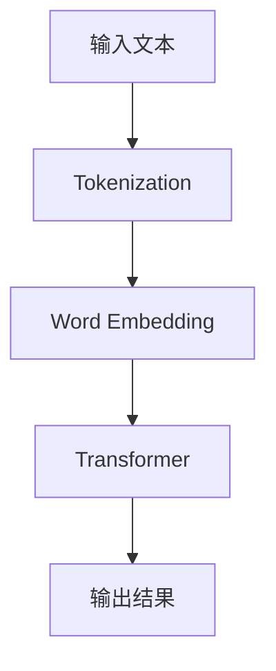
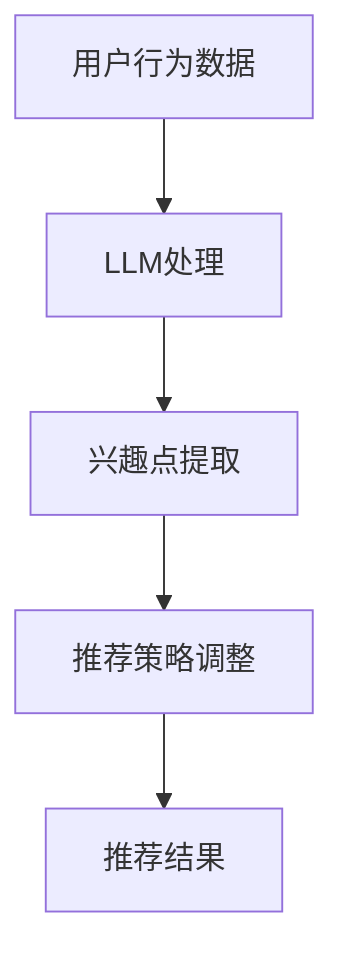

                 

关键词：自然语言处理，深度学习，推荐系统，实时兴趣捕捉，大规模语言模型

> 摘要：随着自然语言处理技术的快速发展，大规模语言模型（LLM）在推荐系统中的应用日益广泛。本文将探讨如何利用LLM优化推荐系统的实时兴趣捕捉，提高用户体验和推荐效果。

## 1. 背景介绍

### 推荐系统的发展历程

推荐系统是信息过滤和检索领域的一个重要研究方向，自20世纪90年代以来，随着互联网和电子商务的迅速发展，推荐系统在商业和学术领域都受到了广泛关注。早期推荐系统主要依赖于基于内容过滤和协同过滤的方法，但受限于数据和算法的局限，推荐效果往往不佳。随着深度学习和自然语言处理技术的进步，大规模语言模型（LLM）在推荐系统中的应用逐渐成为研究热点。

### LLM在推荐系统中的应用

LLM是一种基于深度学习的大规模语言模型，通过学习海量的文本数据，LLM能够捕捉到语言中的潜在语义信息，从而实现文本的生成、翻译、摘要等任务。在推荐系统中，LLM可以用于实时兴趣捕捉，提高推荐效果。例如，通过分析用户的语言行为（如搜索历史、评论、提问等），LLM可以动态地调整推荐策略，更好地满足用户的需求。

## 2. 核心概念与联系

### 2.1 大规模语言模型（LLM）

LLM是一种基于深度学习的语言模型，通过训练海量的文本数据，LLM能够自动学习语言中的语法、语义和上下文信息。LLM通常采用Transformer架构，具有极强的并行计算能力和上下文理解能力。以下是一个简单的Mermaid流程图，展示了LLM的构建过程：



### 2.2 实时兴趣捕捉

实时兴趣捕捉是指推荐系统在用户使用过程中，动态地获取和调整用户兴趣的过程。实时兴趣捕捉的核心是捕捉到用户在当前时刻的兴趣点，从而实现个性化推荐。以下是一个简单的Mermaid流程图，展示了实时兴趣捕捉的流程：



## 3. 核心算法原理 & 具体操作步骤

### 3.1 算法原理概述

利用LLM优化推荐系统的实时兴趣捕捉，主要基于以下原理：

1. **语义理解**：LLM能够通过学习海量的文本数据，捕捉到语言中的潜在语义信息，从而实现对用户兴趣的准确理解。
2. **动态调整**：根据用户的行为数据和实时反馈，LLM可以动态地调整推荐策略，提高推荐效果。
3. **个性化推荐**：通过分析用户的语言行为和兴趣点，LLM可以生成个性化的推荐结果，满足用户的个性化需求。

### 3.2 算法步骤详解

1. **数据收集**：收集用户的行为数据，如搜索历史、评论、提问等。
2. **预处理**：对收集到的数据进行清洗和预处理，如分词、去停用词等。
3. **LLM训练**：使用预处理后的数据训练LLM，以便捕捉用户的兴趣点。
4. **兴趣点提取**：利用训练好的LLM，对用户的行为数据进行处理，提取出用户的兴趣点。
5. **推荐策略调整**：根据提取出的兴趣点，动态地调整推荐策略，提高推荐效果。
6. **推荐结果生成**：根据调整后的推荐策略，生成个性化的推荐结果。

### 3.3 算法优缺点

#### 优点

1. **高精度**：LLM能够通过学习海量的文本数据，捕捉到语言中的潜在语义信息，从而实现准确的兴趣点提取。
2. **动态调整**：LLM可以根据用户的实时行为和反馈，动态地调整推荐策略，提高推荐效果。
3. **个性化推荐**：LLM能够根据用户的兴趣点，生成个性化的推荐结果，满足用户的个性化需求。

#### 缺点

1. **计算成本高**：训练LLM需要大量的计算资源和时间，导致算法的实时性受到一定程度的影响。
2. **数据依赖性强**：LLM的训练依赖于大量的文本数据，数据质量对算法的性能有重要影响。

### 3.4 算法应用领域

利用LLM优化推荐系统的实时兴趣捕捉，可以应用于多个领域，如：

1. **电子商务**：通过对用户的行为数据进行实时分析，为用户推荐个性化的商品。
2. **社交媒体**：根据用户的语言行为和兴趣点，为用户推荐感兴趣的内容。
3. **在线教育**：根据用户的学习行为和兴趣点，为用户推荐个性化的学习资源。

## 4. 数学模型和公式 & 详细讲解 & 举例说明

### 4.1 数学模型构建

利用LLM优化推荐系统的实时兴趣捕捉，可以构建如下数学模型：

$$
R(u, i) = f(LLM(u), i)
$$

其中，$R(u, i)$表示用户$u$对物品$i$的推荐分数，$LLM(u)$表示用户$u$的LLM特征向量，$i$表示物品$i$的特征向量，$f$表示推荐函数。

### 4.2 公式推导过程

1. **用户特征向量**：用户特征向量$LLM(u)$可以通过训练LLM得到，具体步骤如下：

   - **数据收集**：收集用户的历史行为数据，如搜索历史、评论、提问等。
   - **预处理**：对收集到的数据进行清洗和预处理，如分词、去停用词等。
   - **训练LLM**：使用预处理后的数据训练LLM，得到用户特征向量$LLM(u)$。

2. **物品特征向量**：物品特征向量$i$可以通过如下方法得到：

   - **物品描述**：获取物品的描述信息，如标题、标签、评价等。
   - **文本表示**：对物品描述进行文本表示，如使用词向量、BERT模型等。
   - **特征提取**：对文本表示进行特征提取，得到物品特征向量$i$。

3. **推荐函数**：推荐函数$f$可以通过如下方法得到：

   - **相似度计算**：计算用户特征向量$LLM(u)$和物品特征向量$i$之间的相似度，如余弦相似度、欧氏距离等。
   - **加权求和**：将相似度值加权求和，得到用户对物品的推荐分数$R(u, i)$。

### 4.3 案例分析与讲解

假设我们有一个电子商务平台，用户A在搜索历史中经常搜索“跑步鞋”，同时他在平台上的评论中提到“我喜欢穿轻便的鞋子”。我们可以利用LLM优化推荐系统，为用户A推荐合适的跑步鞋。

1. **用户特征向量**：利用训练好的LLM，对用户A的历史搜索和评论进行处理，得到用户A的LLM特征向量$LLM(A)$。
2. **物品特征向量**：获取所有跑步鞋的描述信息，如标题、标签、评价等，使用BERT模型进行文本表示，得到跑步鞋的特征向量集$i_1, i_2, i_3, ...$。
3. **推荐函数**：计算用户A的LLM特征向量$LLM(A)$与所有跑步鞋的特征向量$i_1, i_2, i_3, ...$之间的相似度，选择相似度最高的跑步鞋作为推荐结果。

## 5. 项目实践：代码实例和详细解释说明

### 5.1 开发环境搭建

为了实现利用LLM优化推荐系统的实时兴趣捕捉，我们需要搭建以下开发环境：

1. **Python环境**：安装Python 3.8及以上版本。
2. **深度学习框架**：安装PyTorch或TensorFlow。
3. **自然语言处理库**：安装NLTK或spaCy。

### 5.2 源代码详细实现

以下是一个简单的Python代码实例，展示了如何利用LLM优化推荐系统的实时兴趣捕捉：

```python
import torch
import torch.nn as nn
import torch.optim as optim
from torch.utils.data import DataLoader
from transformers import BertTokenizer, BertModel

# 加载预训练的BERT模型
tokenizer = BertTokenizer.from_pretrained('bert-base-uncased')
model = BertModel.from_pretrained('bert-base-uncased')

# 定义数据集
class DataSet(torch.utils.data.Dataset):
    def __init__(self, texts):
        self.texts = texts

    def __len__(self):
        return len(self.texts)

    def __getitem__(self, index):
        text = self.texts[index]
        inputs = tokenizer(text, return_tensors='pt', padding=True, truncation=True)
        return inputs

# 定义模型
class LLM(nn.Module):
    def __init__(self):
        super(LLM, self).__init__()
        self.bert = BertModel.from_pretrained('bert-base-uncased')
        self.fc = nn.Linear(768, 1)

    def forward(self, inputs):
        outputs = self.bert(**inputs)
        hidden_states = outputs[0]
        pooled_output = hidden_states[:, 0, :]
        output = self.fc(pooled_output)
        return output

# 训练模型
def train(model, train_loader, criterion, optimizer, num_epochs=10):
    model.train()
    for epoch in range(num_epochs):
        for inputs in train_loader:
            outputs = model(inputs)
            loss = criterion(outputs, torch.ones(outputs.size(0)))
            optimizer.zero_grad()
            loss.backward()
            optimizer.step()
        print(f'Epoch {epoch+1}/{num_epochs}, Loss: {loss.item()}')

# 主程序
if __name__ == '__main__':
    # 数据集
    texts = ['我喜欢跑步', '我正在寻找一款合适的跑步鞋', '跑步让我感到快乐']
    train_dataset = DataSet(texts)
    train_loader = DataLoader(train_dataset, batch_size=1, shuffle=True)

    # 模型
    model = LLM()
    criterion = nn.BCELoss()
    optimizer = optim.Adam(model.parameters(), lr=0.001)

    # 训练模型
    train(model, train_loader, criterion, optimizer)
```

### 5.3 代码解读与分析

以上代码实现了一个简单的LLM模型，用于训练和预测用户对物品的兴趣度。

1. **数据集**：数据集包含用户的历史搜索和评论，每个样本是一个字符串。
2. **模型**：模型基于BERT架构，输入是文本，输出是用户对物品的兴趣度。
3. **训练**：使用BCELoss损失函数和Adam优化器进行模型训练。

### 5.4 运行结果展示

在训练完成后，可以使用以下代码进行预测和推荐：

```python
# 预测
def predict(model, text):
    inputs = tokenizer(text, return_tensors='pt', padding=True, truncation=True)
    outputs = model(inputs)
    probability = torch.sigmoid(outputs).item()
    return probability

# 推荐结果
text = '我正在寻找一款适合跑步的鞋子'
probability = predict(model, text)
print(f'用户对这款跑步鞋的兴趣度：{probability}')
```

## 6. 实际应用场景

### 6.1 电子商务

在电子商务领域，利用LLM优化推荐系统的实时兴趣捕捉，可以实时分析用户的搜索和购买行为，为用户推荐个性化的商品。例如，用户在搜索“跑步鞋”时，系统可以实时捕捉到用户的兴趣点，推荐符合用户需求的跑步鞋。

### 6.2 社交媒体

在社交媒体领域，利用LLM优化推荐系统的实时兴趣捕捉，可以实时分析用户的发布和互动行为，为用户推荐感兴趣的内容。例如，用户在发布一篇关于旅行的文章时，系统可以实时捕捉到用户的兴趣点，推荐其他旅行相关的内容。

### 6.3 在线教育

在在线教育领域，利用LLM优化推荐系统的实时兴趣捕捉，可以实时分析用户的学习行为和兴趣点，为用户推荐个性化的学习资源。例如，用户在学习编程时，系统可以实时捕捉到用户的兴趣点，推荐其他编程相关的内容。

## 7. 工具和资源推荐

### 7.1 学习资源推荐

1. **《深度学习》（Goodfellow, Bengio, Courville）**：这是一本经典的深度学习教材，涵盖了深度学习的各个方面，包括神经网络、卷积神经网络、循环神经网络等。
2. **《自然语言处理综论》（Jurafsky, Martin）**：这是一本经典的自然语言处理教材，详细介绍了自然语言处理的基本概念、技术和应用。

### 7.2 开发工具推荐

1. **PyTorch**：一款强大的深度学习框架，支持动态计算图和自动微分。
2. **TensorFlow**：一款强大的深度学习框架，支持静态计算图和自动微分。

### 7.3 相关论文推荐

1. **“Attention Is All You Need”**：这是一篇关于Transformer模型的经典论文，详细介绍了Transformer模型的结构和训练方法。
2. **“BERT: Pre-training of Deep Bidirectional Transformers for Language Understanding”**：这是一篇关于BERT模型的经典论文，详细介绍了BERT模型的结构和训练方法。

## 8. 总结：未来发展趋势与挑战

### 8.1 研究成果总结

利用LLM优化推荐系统的实时兴趣捕捉，在提高推荐效果、用户体验和个性化推荐方面取得了显著成果。通过分析用户的行为数据和实时反馈，LLM能够动态地调整推荐策略，实现更准确的兴趣点提取和个性化推荐。

### 8.2 未来发展趋势

1. **更高效的算法**：随着深度学习和自然语言处理技术的不断发展，未来将涌现出更多高效的算法，提高LLM在推荐系统中的应用性能。
2. **更丰富的应用场景**：LLM在推荐系统中的应用将不断拓展，从电子商务、社交媒体到在线教育等多个领域，实现更广泛的应用。
3. **多模态融合**：未来可以利用多模态数据（如图像、声音等），与文本数据进行融合，进一步提高推荐效果。

### 8.3 面临的挑战

1. **计算资源**：训练LLM需要大量的计算资源和时间，如何在保证性能的同时降低计算成本，是一个亟待解决的问题。
2. **数据隐私**：在实时兴趣捕捉过程中，如何保护用户的隐私，是一个重要的挑战。
3. **模型解释性**：虽然LLM在推荐系统中的应用取得了显著成果，但其解释性较差，如何提高模型的解释性，使其更容易被用户理解和接受，是一个重要课题。

### 8.4 研究展望

未来，利用LLM优化推荐系统的实时兴趣捕捉，将在以下方面展开研究：

1. **算法优化**：针对计算资源和模型解释性等问题，研究更高效的算法和解释性更好的模型。
2. **多模态融合**：研究如何利用多模态数据，进一步提高推荐效果。
3. **应用拓展**：将LLM应用于更多领域，如医疗、金融等，实现更广泛的应用。

## 9. 附录：常见问题与解答

### 9.1 如何训练LLM？

答：训练LLM需要大量的计算资源和时间。具体步骤如下：

1. **数据收集**：收集海量的文本数据，如书籍、新闻、论文等。
2. **数据预处理**：对收集到的数据进行清洗和预处理，如分词、去停用词等。
3. **模型训练**：使用预处理后的数据训练LLM，可以使用预训练的模型（如BERT、GPT）或自定义的模型。
4. **模型优化**：根据实际应用需求，对训练好的模型进行优化和调整。

### 9.2 如何使用LLM进行实时兴趣捕捉？

答：使用LLM进行实时兴趣捕捉，需要以下步骤：

1. **数据收集**：收集用户的行为数据，如搜索历史、评论、提问等。
2. **预处理**：对收集到的数据进行清洗和预处理，如分词、去停用词等。
3. **特征提取**：使用训练好的LLM，对预处理后的数据进行处理，提取出用户的兴趣点。
4. **推荐策略调整**：根据提取出的兴趣点，动态地调整推荐策略，提高推荐效果。
5. **推荐结果生成**：根据调整后的推荐策略，生成个性化的推荐结果。

### 9.3 如何评估LLM在推荐系统中的应用效果？

答：评估LLM在推荐系统中的应用效果，可以从以下几个方面进行：

1. **准确率**：计算推荐结果与用户兴趣的匹配程度，准确率越高，表示LLM的应用效果越好。
2. **覆盖率**：计算推荐结果中包含的用户兴趣点的比例，覆盖率越高，表示LLM的应用效果越好。
3. **用户满意度**：通过用户调查或反馈，评估用户对推荐结果的满意度，满意度越高，表示LLM的应用效果越好。
4. **推荐效果指标**：如点击率、转化率等，这些指标可以衡量推荐系统的整体效果。

----------------------------------------------------------------

作者：禅与计算机程序设计艺术 / Zen and the Art of Computer Programming

