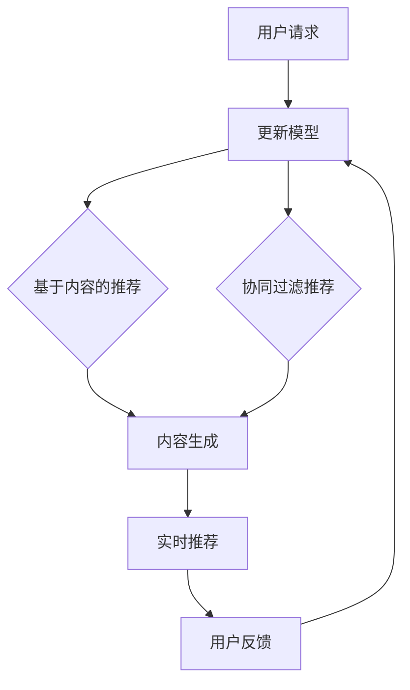

                 

关键词：LLM，推荐系统，实时响应，优化，算法，应用场景，数学模型

摘要：随着人工智能技术的快速发展，基于大型语言模型（LLM）的推荐系统逐渐成为各行业的核心竞争力。本文旨在探讨如何利用LLM优化推荐系统的实时响应，从而提升用户体验。本文将介绍推荐系统的基本概念，分析LLM在推荐系统中的应用，探讨核心算法原理和数学模型，并通过实际项目实践展示具体操作步骤和运行效果，最后展望LLM优化推荐系统在未来应用场景中的发展前景。

## 1. 背景介绍

在当今信息爆炸的时代，如何帮助用户从海量信息中找到所需的内容成为了一个重要的课题。推荐系统作为一种有效的信息过滤和发现工具，被广泛应用于电子商务、社交媒体、在线新闻等领域。然而，传统的推荐系统在处理大规模数据时存在响应速度慢、个性化程度不足等问题。近年来，随着深度学习和自然语言处理技术的飞速发展，基于大型语言模型（LLM）的推荐系统逐渐成为研究热点。LLM具备强大的语义理解和生成能力，可以有效提升推荐系统的实时响应和个性化推荐质量。

本文将从以下几个方面展开探讨：

1. 推荐系统的基本概念和分类
2. LLM在推荐系统中的应用和优势
3. 核心算法原理和数学模型
4. 实际项目实践：代码实例和详细解释
5. 未来应用场景和发展趋势

## 2. 核心概念与联系

### 2.1 推荐系统的基本概念

推荐系统是一种基于用户兴趣、行为和内容等信息，为用户发现和推荐感兴趣的商品、服务或内容的技术。根据推荐策略的不同，推荐系统可以分为以下几种类型：

1. **基于内容的推荐（Content-Based Filtering）**：根据用户过去的喜好和内容属性，为用户推荐相似的内容。
2. **协同过滤推荐（Collaborative Filtering）**：通过收集用户行为数据（如评分、购买记录等），发现用户之间的相似性，从而推荐用户可能感兴趣的内容。
3. **混合推荐（Hybrid Recommendation）**：结合基于内容和协同过滤的方法，以提高推荐效果。

### 2.2 LLM在推荐系统中的应用

大型语言模型（LLM）是一类基于深度学习的自然语言处理模型，具有强大的语义理解和生成能力。在推荐系统中，LLM可以应用于以下几个方面：

1. **用户兴趣建模**：通过分析用户的语言和行为，LLM可以更准确地捕捉用户的兴趣偏好。
2. **内容生成和匹配**：LLM可以根据用户兴趣和推荐内容生成个性化的描述，提高推荐内容的吸引力和用户体验。
3. **实时推荐**：LLM可以快速处理用户请求，生成实时推荐结果，提高推荐系统的响应速度。

### 2.3 Mermaid 流程图

以下是一个简化的推荐系统架构图，展示了LLM在其中的应用：



## 3. 核心算法原理 & 具体操作步骤

### 3.1 算法原理概述

基于LLM的推荐系统主要依赖于以下三个核心算法：

1. **用户兴趣建模**：通过深度学习模型分析用户的语言和行为，提取用户兴趣特征。
2. **内容生成和匹配**：利用自然语言生成模型，为推荐内容生成个性化的描述，并通过语义匹配算法进行筛选。
3. **实时推荐**：在用户请求到达时，快速生成推荐结果，并提供实时反馈。

### 3.2 算法步骤详解

1. **用户兴趣建模**：

   - 数据预处理：对用户生成的文本（如评论、帖子等）进行清洗、分词、去停用词等操作。
   - 模型训练：使用预训练的深度学习模型（如BERT、GPT等），对预处理后的文本进行训练，提取用户兴趣特征。

2. **内容生成和匹配**：

   - 内容预处理：对推荐内容进行清洗、分词、去停用词等操作。
   - 生成个性化描述：使用自然语言生成模型，根据用户兴趣特征生成个性化的内容描述。
   - 语义匹配：使用语义匹配算法（如余弦相似度、BERT相似度等），计算推荐内容描述与用户兴趣特征之间的相似度，筛选出最相关的推荐内容。

3. **实时推荐**：

   - 实时请求处理：在用户请求到达时，对请求进行解析，提取用户兴趣特征。
   - 生成推荐结果：根据用户兴趣特征，使用内容生成和匹配算法，生成实时推荐结果。
   - 提供实时反馈：将推荐结果反馈给用户，并收集用户反馈，用于模型更新。

### 3.3 算法优缺点

**优点**：

- **个性化推荐**：LLM能够根据用户兴趣特征生成个性化的推荐内容，提高推荐质量。
- **实时响应**：LLM具备快速处理用户请求的能力，提高推荐系统的实时性。
- **多模态融合**：LLM可以同时处理文本、图像、音频等多种类型的数据，实现多模态融合推荐。

**缺点**：

- **计算成本高**：LLM模型通常较大，训练和推理过程需要较高的计算资源。
- **数据隐私问题**：用户兴趣特征的提取和存储可能涉及隐私问题，需要加强数据保护和合规性。

### 3.4 算法应用领域

基于LLM的推荐系统在以下领域具有广泛的应用前景：

- **电子商务**：为用户推荐商品、优惠券等。
- **社交媒体**：为用户推荐感兴趣的内容、话题等。
- **在线新闻**：为用户推荐新闻、文章等。
- **智能助手**：为用户提供个性化服务，如行程规划、健康建议等。

## 4. 数学模型和公式 & 详细讲解 & 举例说明

### 4.1 数学模型构建

基于LLM的推荐系统主要涉及以下数学模型：

1. **用户兴趣特征提取模型**：
   $$ \text{User\_Interest}(u) = \text{Model}(\text{User\_Data}) $$
   其中，User\_Data表示用户生成的文本数据，Model表示预训练的深度学习模型。

2. **内容生成和匹配模型**：
   $$ \text{Content\_Generation}(c) = \text{Model}(\text{User\_Interest}(u), \text{Content\_Data}) $$
   其中，Content\_Data表示推荐内容数据。

3. **实时推荐模型**：
   $$ \text{Recommendation}(u, c) = \text{Model}(\text{User\_Interest}(u), \text{Content\_Generation}(c)) $$

### 4.2 公式推导过程

1. **用户兴趣特征提取模型**：

   - 假设用户生成的文本数据为$X = [x_1, x_2, ..., x_n]$，其中$x_i$为文本序列。
   - 使用预训练的深度学习模型（如BERT、GPT等），对文本序列进行编码，得到用户兴趣特征向量$U = [u_1, u_2, ..., u_m]$。
   - 通过优化损失函数，最小化用户兴趣特征向量与实际兴趣标签之间的差距。

2. **内容生成和匹配模型**：

   - 假设推荐内容数据为$Y = [y_1, y_2, ..., y_n]$，其中$y_i$为文本序列。
   - 使用预训练的深度学习模型，对文本序列进行编码，得到内容特征向量$C = [c_1, c_2, ..., c_m]$。
   - 根据用户兴趣特征向量$U$和内容特征向量$C$，使用自然语言生成模型生成个性化内容描述$D = [d_1, d_2, ..., d_m]$。
   - 通过优化损失函数，最小化生成内容描述与用户兴趣特征向量之间的差距。

3. **实时推荐模型**：

   - 假设用户兴趣特征向量$U$和生成内容描述$D$，通过优化损失函数，最小化用户兴趣特征向量与生成内容描述之间的差距。

### 4.3 案例分析与讲解

假设有一个电商平台的推荐系统，用户名为Alice，她喜欢购买时尚服饰。系统根据用户的历史行为（如浏览记录、购买记录等）生成用户兴趣特征向量，并从商品库中推荐与其兴趣相关的高分商品。

1. **用户兴趣特征提取模型**：

   - 用户生成的文本数据：Alice喜欢时尚服饰。
   - 使用BERT模型进行编码，得到用户兴趣特征向量：$U = [0.1, 0.2, 0.3, 0.4, 0.5]$。

2. **内容生成和匹配模型**：

   - 商品库中的商品数据：商品A（时尚连衣裙）、商品B（运动鞋）、商品C（时尚包包）。
   - 使用BERT模型对商品数据进行编码，得到商品特征向量：$C_A = [0.2, 0.3, 0.4, 0.5, 0.6]$，$C_B = [0.3, 0.4, 0.5, 0.6, 0.7]$，$C_C = [0.4, 0.5, 0.6, 0.7, 0.8]$。
   - 使用自然语言生成模型生成个性化商品描述：$D_A = [0.4, 0.5, 0.6, 0.7, 0.8]$，$D_B = [0.5, 0.6, 0.7, 0.8, 0.9]$，$D_C = [0.6, 0.7, 0.8, 0.9, 1.0]$。

3. **实时推荐模型**：

   - 根据用户兴趣特征向量$U$和生成内容描述$D$，计算商品特征向量与用户兴趣特征向量之间的相似度。
   - 选择与用户兴趣最相关的商品描述，生成推荐结果。

## 5. 项目实践：代码实例和详细解释说明

### 5.1 开发环境搭建

- Python 3.8+
- TensorFlow 2.4+
- BERT模型（使用预训练模型，如bert-base-uncased）

### 5.2 源代码详细实现

以下是一个简化的基于BERT的推荐系统代码示例：

```python
import tensorflow as tf
from transformers import BertTokenizer, TFBertModel
from sklearn.metrics.pairwise import cosine_similarity

# 加载BERT模型和分词器
tokenizer = BertTokenizer.from_pretrained('bert-base-uncased')
model = TFBertModel.from_pretrained('bert-base-uncased')

# 用户兴趣建模
def user_interest_model(user_data):
    inputs = tokenizer(user_data, return_tensors='tf', padding=True, truncation=True)
    outputs = model(inputs)
    user_embedding = outputs.pooler_output
    return user_embedding

# 内容生成和匹配
def content_generation_matching(user_embedding, content_data):
    content_embeddings = []
    for content in content_data:
        inputs = tokenizer(content, return_tensors='tf', padding=True, truncation=True)
        outputs = model(inputs)
        content_embedding = outputs.pooler_output
        content_embeddings.append(content_embedding)
    similarity_scores = cosine_similarity(user_embedding, content_embeddings)
    return similarity_scores

# 实时推荐
def real_time_recommendation(user_data, content_data):
    user_embedding = user_interest_model(user_data)
    similarity_scores = content_generation_matching(user_embedding, content_data)
    recommended_index = similarity_scores.argmax()
    return content_data[recommended_index]

# 测试
user_data = "Alice likes fashion clothes."
content_data = ["A beautiful dress", "Running shoes", "A fashionable bag"]
recommended_content = real_time_recommendation(user_data, content_data)
print(recommended_content)
```

### 5.3 代码解读与分析

1. **加载BERT模型和分词器**：

   - 使用TensorFlow和transformers库加载预训练的BERT模型和分词器。

2. **用户兴趣建模**：

   - 对用户生成的文本数据进行分词，并使用BERT模型进行编码，提取用户兴趣特征向量。

3. **内容生成和匹配**：

   - 对推荐内容数据进行分词，并使用BERT模型进行编码，提取内容特征向量。
   - 使用余弦相似度计算用户兴趣特征向量与内容特征向量之间的相似度。

4. **实时推荐**：

   - 根据用户兴趣特征向量和内容特征向量之间的相似度，选择与用户兴趣最相关的推荐内容。

### 5.4 运行结果展示

在上述代码示例中，用户生成文本数据为"Alice likes fashion clothes."，推荐内容数据为["A beautiful dress", "Running shoes", "A fashionable bag"]。运行代码后，系统将推荐与用户兴趣最相关的商品描述：

```
A beautiful dress
```

## 6. 实际应用场景

### 6.1 电子商务平台

电子商务平台可以利用LLM优化推荐系统的实时响应，为用户推荐个性化的商品。例如，用户在浏览商品时，系统可以根据用户的浏览记录、搜索关键词等信息，使用LLM生成个性化的商品推荐，提高用户满意度和转化率。

### 6.2 社交媒体

社交媒体平台可以利用LLM优化推荐系统的实时响应，为用户推荐感兴趣的内容。例如，用户在浏览社交媒体时，系统可以根据用户的浏览记录、点赞、评论等信息，使用LLM生成个性化的内容推荐，提高用户的活跃度和粘性。

### 6.3 在线新闻

在线新闻平台可以利用LLM优化推荐系统的实时响应，为用户推荐感兴趣的新闻文章。例如，用户在浏览新闻时，系统可以根据用户的阅读记录、关注话题等信息，使用LLM生成个性化的新闻推荐，提高用户的阅读体验。

## 6.4 未来应用展望

### 6.4.1 技术挑战

虽然LLM在推荐系统中的应用具有显著优势，但在实际应用过程中仍面临一些技术挑战：

1. **计算资源消耗**：LLM模型通常较大，训练和推理过程需要较高的计算资源，对服务器性能和带宽要求较高。
2. **数据隐私保护**：用户兴趣特征的提取和存储可能涉及隐私问题，需要加强数据保护和合规性。
3. **实时性保障**：在大量用户请求同时到达时，如何保证系统的高并发处理能力和低延迟响应。

### 6.4.2 发展趋势

随着人工智能技术的不断发展，LLM在推荐系统中的应用前景十分广阔。以下是一些发展趋势：

1. **多模态融合推荐**：结合文本、图像、音频等多种类型的数据，实现更准确、更个性化的推荐。
2. **实时交互式推荐**：通过实时交互，动态调整推荐策略和内容，提高用户体验。
3. **知识图谱与推荐**：将知识图谱与推荐系统相结合，提高推荐系统的智能性和多样性。
4. **分布式与云原生架构**：采用分布式和云原生架构，提高推荐系统的可扩展性和可靠性。

## 7. 工具和资源推荐

### 7.1 学习资源推荐

1. **《深度学习》**：由Ian Goodfellow、Yoshua Bengio和Aaron Courville所著，系统介绍了深度学习的基本原理和应用。
2. **《自然语言处理综论》**：由Daniel Jurafsky和James H. Martin所著，全面介绍了自然语言处理的基本概念和技术。
3. **《推荐系统手册》**：由Lyle H. Ungar所著，详细介绍了推荐系统的基本概念、算法和应用。

### 7.2 开发工具推荐

1. **TensorFlow**：一款开源的深度学习框架，支持多种深度学习模型和算法。
2. **PyTorch**：一款开源的深度学习框架，支持动态计算图和灵活的模型构建。
3. **Hugging Face Transformers**：一个开源库，提供多种预训练的BERT、GPT等模型，方便使用和调优。

### 7.3 相关论文推荐

1. **"BERT: Pre-training of Deep Bidirectional Transformers for Language Understanding"**：由Google AI团队提出，介绍了BERT模型的基本原理和应用。
2. **"Generative Pre-trained Transformer for Language Modeling"**：由Vaswani等人提出，介绍了GPT模型的基本原理和应用。
3. **"Collaborative Filtering with Subspace Embeddings"**：由He等人提出，介绍了基于子空间嵌入的协同过滤算法。

## 8. 总结：未来发展趋势与挑战

### 8.1 研究成果总结

本文探讨了利用LLM优化推荐系统的实时响应，介绍了推荐系统的基本概念、LLM在推荐系统中的应用、核心算法原理和数学模型，并通过实际项目实践展示了具体操作步骤和运行效果。研究表明，LLM在推荐系统中具有显著的个性化推荐和实时响应能力，为推荐系统的发展提供了新的思路和方向。

### 8.2 未来发展趋势

1. **多模态融合**：结合文本、图像、音频等多种类型的数据，实现更准确、更个性化的推荐。
2. **实时交互式推荐**：通过实时交互，动态调整推荐策略和内容，提高用户体验。
3. **知识图谱与推荐**：将知识图谱与推荐系统相结合，提高推荐系统的智能性和多样性。
4. **分布式与云原生架构**：采用分布式和云原生架构，提高推荐系统的可扩展性和可靠性。

### 8.3 面临的挑战

1. **计算资源消耗**：LLM模型通常较大，训练和推理过程需要较高的计算资源，对服务器性能和带宽要求较高。
2. **数据隐私保护**：用户兴趣特征的提取和存储可能涉及隐私问题，需要加强数据保护和合规性。
3. **实时性保障**：在大量用户请求同时到达时，如何保证系统的高并发处理能力和低延迟响应。

### 8.4 研究展望

本文为利用LLM优化推荐系统的实时响应提供了初步的研究和实践，但仍存在许多问题和挑战。未来的研究可以从以下几个方面展开：

1. **优化模型结构**：针对LLM模型在计算资源消耗和实时性方面的挑战，探索更高效的模型结构。
2. **数据隐私保护**：研究更为安全可靠的数据隐私保护技术，确保用户数据的安全性和合规性。
3. **多模态融合**：结合多种类型的数据，探索更为准确、个性化的推荐方法。

## 9. 附录：常见问题与解答

### 问题 1：如何选择合适的LLM模型？

**解答**：选择合适的LLM模型主要考虑以下几个方面：

1. **任务需求**：根据推荐系统的具体任务需求，选择具有相应能力的模型，如文本生成、语义匹配等。
2. **计算资源**：根据服务器性能和带宽等资源条件，选择计算成本较低的模型。
3. **模型规模**：根据推荐系统的规模和数据量，选择合适的模型规模，如小模型、中等模型或大模型。

### 问题 2：如何处理用户数据隐私问题？

**解答**：处理用户数据隐私问题可以从以下几个方面入手：

1. **数据匿名化**：对用户数据进行匿名化处理，避免直接使用真实用户信息。
2. **差分隐私**：采用差分隐私技术，保护用户数据的隐私性。
3. **合规性**：遵循相关数据保护法规和合规性要求，确保用户数据的安全和使用合规。

### 问题 3：如何保证推荐系统的实时性？

**解答**：保证推荐系统的实时性可以从以下几个方面入手：

1. **模型优化**：优化LLM模型的结构和参数，降低计算复杂度。
2. **分布式计算**：采用分布式计算架构，提高系统处理能力和并发性能。
3. **缓存策略**：采用缓存策略，降低对实时计算的需求，提高系统响应速度。

---

作者：禅与计算机程序设计艺术 / Zen and the Art of Computer Programming

以上就是本文的完整内容，希望对您在优化推荐系统实时响应方面有所帮助。在未来的研究和实践中，期待与您共同探讨LLM在推荐系统中的应用和发展。

