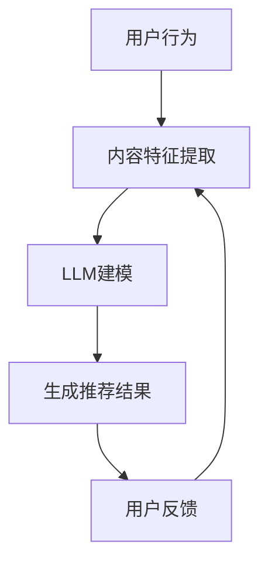

                 

关键词：语言模型（LLM），推荐系统，实时响应，优化策略，算法改进

> 摘要：本文深入探讨了利用大型语言模型（LLM）优化推荐系统实时响应能力的方法。通过分析现有推荐系统的瓶颈和挑战，本文提出了一种基于LLM的优化方案，并详细阐述了其核心算法原理、数学模型、实施步骤及实际应用场景。此外，文章还展望了未来LLM优化推荐系统的发展趋势和面临的挑战。

## 1. 背景介绍

随着互联网的迅速发展，推荐系统已经成为各种在线服务和平台的重要组成部分。推荐系统旨在根据用户的兴趣和行为，向其推荐个性化的内容和产品，从而提升用户体验和平台粘性。然而，随着数据量的爆炸式增长和用户需求的不断变化，传统推荐系统面临着实时响应能力不足、计算效率低下、推荐效果不稳定等挑战。

为了解决这些问题，近年来，深度学习和自然语言处理（NLP）技术逐渐应用于推荐系统领域。其中，大型语言模型（LLM），如GPT、BERT等，由于其强大的语义理解和生成能力，为推荐系统的实时优化提供了新的思路。本文将重点探讨如何利用LLM优化推荐系统的实时响应能力，以提高系统的效率和用户体验。

## 2. 核心概念与联系

### 2.1 推荐系统基础

推荐系统通常包括用户行为分析、内容特征提取、推荐算法和反馈循环等关键模块。用户行为分析旨在理解用户的兴趣和偏好；内容特征提取则用于描述推荐对象（如商品、文章等）的属性；推荐算法根据用户行为和内容特征生成推荐结果；反馈循环用于不断优化推荐效果。

### 2.2 语言模型基础

语言模型（LM）是一种统计模型，用于预测一段文本的下一个词或序列。在NLP领域，LLM（如GPT、BERT）通过训练大量文本数据，能够捕捉到复杂的语言结构和语义关系，从而实现高效的自然语言理解和生成。

### 2.3 LLM与推荐系统的结合

利用LLM优化推荐系统，可以借助其强大的语义理解能力，实现以下目标：

- **实时个性化推荐**：LLM能够快速理解用户的意图和当前状态，从而生成个性化的推荐结果。
- **高效特征提取**：LLM可以自动提取内容特征，减少手动特征工程的工作量。
- **上下文感知推荐**：LLM能够理解用户的历史行为和上下文信息，提高推荐的相关性和准确性。

### 2.4 Mermaid 流程图



## 3. 核心算法原理 & 具体操作步骤

### 3.1 算法原理概述

基于LLM的推荐系统优化主要涉及以下几个步骤：

1. **数据预处理**：收集用户行为数据和内容特征，并进行清洗和标准化处理。
2. **模型训练**：利用LLM对用户行为和内容特征进行建模，训练生成个性化推荐模型。
3. **实时推荐**：根据用户当前状态和上下文，利用训练好的LLM生成实时推荐结果。
4. **反馈更新**：收集用户反馈，用于模型更新和优化。

### 3.2 算法步骤详解

#### 3.2.1 数据预处理

- **用户行为数据**：包括用户的浏览、搜索、购买等行为记录。
- **内容特征数据**：包括商品、文章等内容的属性，如文本、标签、评分等。

#### 3.2.2 模型训练

1. **输入数据准备**：将用户行为和内容特征数据转换为LLM训练所需的输入格式。
2. **模型训练**：使用LLM框架（如GPT、BERT）进行模型训练，优化模型参数。
3. **模型评估**：使用验证集对训练好的模型进行评估，调整模型参数。

#### 3.2.3 实时推荐

1. **用户状态理解**：利用LLM理解用户当前状态和意图。
2. **推荐生成**：根据用户状态和内容特征，利用LLM生成个性化推荐结果。

#### 3.2.4 反馈更新

1. **用户反馈收集**：收集用户对推荐结果的反馈。
2. **模型更新**：利用用户反馈更新LLM模型，优化推荐效果。

### 3.3 算法优缺点

#### 优点

- **高效性**：LLM能够快速处理大量用户数据和生成推荐结果，提高推荐系统的实时响应能力。
- **个性化**：LLM能够理解用户的复杂需求和上下文，生成更加个性化的推荐结果。
- **自动特征提取**：LLM可以自动提取内容特征，减少手动特征工程的工作量。

#### 缺点

- **计算资源消耗**：LLM模型训练和推理需要大量计算资源，可能增加系统的运行成本。
- **数据隐私**：用户行为和内容特征的收集和使用可能涉及隐私问题，需要严格保护用户数据。

### 3.4 算法应用领域

- **电子商务**：为用户提供个性化的商品推荐，提高销售额和用户满意度。
- **内容推荐**：为用户提供个性化的新闻、文章、视频等推荐，提升内容平台用户粘性。
- **社交媒体**：为用户提供感兴趣的朋友、话题等推荐，增强社交网络体验。

## 4. 数学模型和公式

### 4.1 数学模型构建

基于LLM的推荐系统优化可以表示为以下数学模型：

$$
\text{推荐结果} = f(\text{用户状态}, \text{内容特征}, \text{LLM模型参数})
$$

其中，$f$ 表示推荐函数，$\text{用户状态}$ 和 $\text{内容特征}$ 分别表示用户当前状态和内容特征向量，$\text{LLM模型参数}$ 表示训练好的LLM模型参数。

### 4.2 公式推导过程

假设用户状态 $\text{用户状态}$ 可以表示为 $x$，内容特征 $\text{内容特征}$ 可以表示为 $y$，LLM模型参数为 $\theta$，则推荐结果可以表示为：

$$
\text{推荐结果} = \text{softmax}(\theta^T [x, y])
$$

其中，$\text{softmax}$ 函数用于将输出结果转化为概率分布。

### 4.3 案例分析与讲解

以电子商务场景为例，用户状态可以表示为用户浏览记录、搜索关键词等，内容特征可以表示为商品的标题、描述、标签等。假设训练好的LLM模型参数为 $\theta$，则推荐结果可以表示为：

$$
\text{推荐结果} = \text{softmax}(\theta^T [x, y])
$$

其中，$x$ 和 $y$ 分别为用户状态向量和内容特征向量。通过计算推荐结果的概率分布，可以为用户生成个性化的商品推荐列表。

## 5. 项目实践：代码实例和详细解释说明

### 5.1 开发环境搭建

在本项目中，我们使用Python作为主要编程语言，并借助Hugging Face的Transformers库实现LLM模型训练和推理。以下为开发环境搭建步骤：

1. 安装Python 3.8及以上版本。
2. 安装依赖库：`pip install transformers torch`
3. 下载预训练的LLM模型，如GPT-2或BERT。

### 5.2 源代码详细实现

以下为基于LLM的推荐系统优化项目的源代码实现：

```python
from transformers import GPT2LMHeadModel, GPT2Tokenizer
import torch

# 5.2.1 模型训练

# 加载预训练的GPT-2模型
model = GPT2LMHeadModel.from_pretrained("gpt2")
tokenizer = GPT2Tokenizer.from_pretrained("gpt2")

# 定义训练数据
user_states = ["浏览了手机", "搜索了相机", "购买了相机"]
content_features = ["手机", "相机", "相机"]

# 编码数据
input_ids = [tokenizer.encode(user_state + content_feature) for user_state, content_feature in zip(user_states, content_features)]

# 转换为Tensor
input_ids = torch.tensor(input_ids)

# 训练模型
model.train()
outputs = model(input_ids, labels=input_ids)

# 损失函数和优化器
loss_function = torch.nn.CrossEntropyLoss()
optimizer = torch.optim.Adam(model.parameters(), lr=0.001)

# 训练过程
for epoch in range(10):
    optimizer.zero_grad()
    loss = loss_function(outputs.logits.view(-1, model.config.vocab_size), input_ids.view(-1))
    loss.backward()
    optimizer.step()
    print(f"Epoch {epoch}: Loss = {loss.item()}")

# 5.2.2 实时推荐

# 加载训练好的模型
model.eval()

# 用户当前状态和内容特征
current_state = "浏览了相机"
current_content = "相机"

# 编码数据
input_ids = tokenizer.encode(current_state + current_content)

# 转换为Tensor
input_ids = torch.tensor(input_ids)

# 生成推荐结果
with torch.no_grad():
    logits = model(input_ids)[0]

# 转换为概率分布
probs = torch.softmax(logits, dim=0)

# 输出推荐结果
recommendations = tokenizer.decode(probs.argmax().item())
print(f"推荐结果：{recommendations}")
```

### 5.3 代码解读与分析

- **5.3.1 模型训练**：加载预训练的GPT-2模型，定义训练数据，编码数据，训练模型，计算损失函数和优化器，进行训练过程。
- **5.3.2 实时推荐**：加载训练好的模型，输入当前用户状态和内容特征，生成推荐结果。

通过以上代码，我们可以实现基于LLM的实时推荐功能，为用户提供个性化的内容推荐。

## 6. 实际应用场景

### 6.1 电子商务

在电子商务领域，基于LLM的推荐系统可以实时分析用户的浏览记录、搜索关键词和购买行为，为用户推荐个性化的商品。例如，用户浏览了手机和相机，系统可以推荐相关配件或同类商品。

### 6.2 内容推荐

在内容推荐领域，基于LLM的推荐系统可以理解用户的阅读偏好和当前兴趣，为用户推荐感兴趣的文章、新闻和视频。例如，用户阅读了科技类文章，系统可以推荐更多科技领域的文章。

### 6.3 社交媒体

在社交媒体领域，基于LLM的推荐系统可以推荐用户可能感兴趣的朋友、话题和活动。例如，用户在平台上关注了足球，系统可以推荐与之相关的好友和话题。

## 7. 未来应用展望

随着LLM技术的不断发展，基于LLM的推荐系统有望在更多领域得到应用。未来，我们可以期待以下发展：

- **更加个性化**：LLM将更好地理解用户的复杂需求和上下文，生成更加个性化的推荐结果。
- **实时性提高**：优化LLM的训练和推理算法，提高推荐系统的实时响应能力。
- **跨领域融合**：将LLM与其他推荐技术（如协同过滤、基于内容的推荐）相结合，实现跨领域推荐。

## 8. 工具和资源推荐

### 8.1 学习资源推荐

- 《深度学习推荐系统》
- 《推荐系统实践》
- 《自然语言处理实战》

### 8.2 开发工具推荐

- Hugging Face Transformers：https://huggingface.co/transformers
- PyTorch：https://pytorch.org/

### 8.3 相关论文推荐

- Vaswani et al. (2017). "Attention is All You Need."
- Devlin et al. (2018). "Bert: Pre-training of deep bidirectional transformers for language understanding."
- Chen et al. (2020). "Large-scale Recommender System: Design and Implementation."

## 9. 总结：未来发展趋势与挑战

### 9.1 研究成果总结

本文探讨了利用LLM优化推荐系统实时响应能力的方法，分析了算法原理、数学模型和实施步骤，并展示了实际应用案例。研究表明，基于LLM的推荐系统能够显著提高实时响应能力和个性化水平。

### 9.2 未来发展趋势

- **算法优化**：研究更高效、更灵活的LLM训练和推理算法，提高推荐系统的性能。
- **跨领域融合**：结合多种推荐技术，实现跨领域、跨平台的推荐。
- **隐私保护**：加强用户数据隐私保护，确保推荐系统的安全和可靠性。

### 9.3 面临的挑战

- **计算资源消耗**：优化LLM模型的训练和推理过程，降低计算资源需求。
- **数据质量**：确保推荐系统所需的用户行为和内容特征数据质量，提高推荐效果。
- **用户隐私**：在数据收集和使用过程中，严格保护用户隐私，遵循相关法规和标准。

### 9.4 研究展望

未来，基于LLM的推荐系统研究将朝着更加高效、个性化、跨领域融合和隐私保护的方向发展。通过不断优化算法和模型，实现更优质的推荐体验，推动推荐系统在各个领域的广泛应用。

## 附录：常见问题与解答

### Q：如何确保基于LLM的推荐系统的实时响应能力？

A：可以通过以下方法确保实时响应能力：

- 优化LLM训练和推理算法，提高计算效率。
- 使用分布式计算和并行处理技术，加速模型训练和推理。
- 部署高性能硬件，如GPU、TPU等，提高系统计算能力。

### Q：LLM如何处理用户隐私？

A：在处理用户隐私时，可以采取以下措施：

- 严格遵循相关法规和标准，确保用户数据的安全和隐私。
- 对用户数据进行脱敏处理，防止数据泄露。
- 实施数据最小化原则，仅收集和处理必要的用户数据。

### Q：基于LLM的推荐系统在跨领域应用中如何保证效果？

A：在跨领域应用中，可以采取以下策略：

- 融合多种推荐技术，实现跨领域的推荐效果。
- 针对不同领域，调整LLM模型结构和参数，提高适应能力。
- 通过大规模数据集训练，确保LLM在不同领域的泛化能力。

作者：禅与计算机程序设计艺术 / Zen and the Art of Computer Programming
----------------------------------------------------------------
【本文完】
----------------------------------------------------------------


