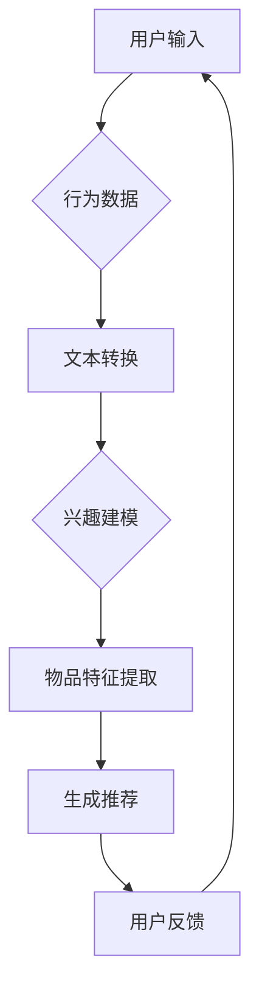

                 

关键词：LLM，推荐系统，平衡，探索，技术实现

摘要：本文探讨了如何利用大型语言模型（LLM）提升推荐系统的效果，并探讨了在实现这一目标过程中如何保持利用与平衡。通过详细介绍核心概念、算法原理、数学模型、项目实践和实际应用场景，文章旨在为读者提供一个全面的技术视角，帮助他们理解和应用LLM在推荐系统中的潜力。

## 1. 背景介绍

推荐系统作为信息过滤和个性化服务的重要工具，广泛应用于电子商务、社交媒体、在线视频等领域。传统的推荐系统主要依赖于协同过滤、基于内容的推荐和基于模型的推荐等技术。然而，随着用户生成内容的爆炸性增长和用户行为的复杂化，传统推荐系统逐渐暴露出推荐效果不佳、用户满意度低等问题。

近年来，大型语言模型（LLM）如GPT-3、BERT等的出现为推荐系统带来了新的可能性。LLM通过处理大规模的文本数据，能够捕捉到用户的兴趣偏好和内容特征，从而提升推荐系统的效果。然而，如何有效地利用LLM，同时保持系统的平衡和稳定性，成为当前研究的热点问题。

本文旨在探讨利用LLM提升推荐系统的技术手段，并分析在实现过程中可能遇到的问题和挑战，为推荐系统的研究和实践提供参考。

## 2. 核心概念与联系

### 2.1 推荐系统基本概念

推荐系统（Recommender System）是一种信息过滤技术，旨在为用户提供个性化的推荐结果。推荐系统通常基于用户的兴趣、历史行为和内容特征进行工作，主要分为以下几类：

1. **基于协同过滤（Collaborative Filtering）**：通过分析用户之间的相似性，预测用户对未知物品的偏好。
2. **基于内容的推荐（Content-Based Filtering）**：根据用户的历史行为和兴趣，推荐与用户历史行为相似的物品。
3. **基于模型的推荐（Model-Based Filtering）**：通过训练用户行为数据，构建预测模型，预测用户对物品的偏好。

### 2.2 语言模型基本概念

语言模型（Language Model，LM）是自然语言处理（Natural Language Processing，NLP）领域的一种核心技术，用于预测自然语言序列的概率分布。在推荐系统中，语言模型可以用来表示用户兴趣、物品特征和推荐结果。

常见的语言模型包括：

1. **n-gram模型**：基于词的历史频率进行预测。
2. **神经网络模型**：如循环神经网络（RNN）、长短期记忆网络（LSTM）等，能够更好地捕捉语言特征。

近年来，预训练语言模型（如GPT、BERT）取得了显著的成果，能够处理更复杂的语言现象。

### 2.3 推荐系统与语言模型的联系

在推荐系统中，语言模型可以用来：

1. **用户兴趣建模**：通过分析用户历史行为和反馈，构建用户兴趣模型。
2. **物品特征提取**：对物品内容进行文本转换，提取关键特征。
3. **推荐结果生成**：结合用户兴趣模型和物品特征，生成个性化的推荐结果。

语言模型在推荐系统中的应用，有助于提高推荐的准确性和用户满意度。

## 2.4 Mermaid 流程图



### 3. 核心算法原理 & 具体操作步骤

#### 3.1 算法原理概述

利用LLM提升推荐系统的核心思想是：

1. **用户兴趣建模**：使用LLM分析用户的历史行为和反馈，提取用户兴趣关键词。
2. **物品特征提取**：对物品内容进行文本转换，利用LLM提取关键特征。
3. **推荐结果生成**：结合用户兴趣关键词和物品特征，生成个性化推荐结果。

#### 3.2 算法步骤详解

1. **数据预处理**：
   - 收集用户历史行为数据（如浏览记录、购买记录等）。
   - 对用户历史行为数据进行清洗和预处理。

2. **用户兴趣建模**：
   - 使用LLM对用户历史行为文本进行建模，提取用户兴趣关键词。
   - 将提取的词转换为向量表示。

3. **物品特征提取**：
   - 对物品内容进行文本转换，提取关键特征。
   - 将提取的词转换为向量表示。

4. **生成推荐结果**：
   - 将用户兴趣关键词和物品特征向量输入到推荐模型。
   - 利用推荐模型生成个性化推荐结果。

#### 3.3 算法优缺点

**优点**：

1. **高准确性**：LLM能够捕捉到用户的兴趣偏好，提高推荐准确性。
2. **强泛化性**：LLM能够处理多种类型的文本数据，适应不同场景。

**缺点**：

1. **计算资源消耗大**：LLM训练和推理需要大量计算资源。
2. **数据隐私问题**：用户数据在LLM处理过程中可能存在隐私泄露风险。

#### 3.4 算法应用领域

LLM在推荐系统的应用主要包括以下领域：

1. **电子商务**：为用户推荐商品、优惠券等。
2. **社交媒体**：为用户推荐关注对象、话题等。
3. **在线视频**：为用户推荐视频内容。

## 4. 数学模型和公式 & 详细讲解 & 举例说明

### 4.1 数学模型构建

在推荐系统中，我们可以使用以下数学模型：

1. **用户兴趣向量表示**：假设用户兴趣可以用一个向量表示，其中每个元素表示一个关键词的权重。
   \[
   \mathbf{u} = [u_1, u_2, \ldots, u_n]
   \]

2. **物品特征向量表示**：假设物品特征也可以用一个向量表示，其中每个元素表示一个关键词的权重。
   \[
   \mathbf{i} = [i_1, i_2, \ldots, i_n]
   \]

3. **推荐评分模型**：假设推荐结果可以用一个评分表示，表示用户对物品的偏好程度。
   \[
   s = \mathbf{u} \cdot \mathbf{i}
   \]

### 4.2 公式推导过程

我们可以使用矩阵运算来简化上述模型：

1. **用户兴趣矩阵表示**：
   \[
   \mathbf{U} = \begin{bmatrix}
   u_1 & u_2 & \ldots & u_n
   \end{bmatrix}
   \]

2. **物品特征矩阵表示**：
   \[
   \mathbf{I} = \begin{bmatrix}
   i_1 & i_2 & \ldots & i_n
   \end{bmatrix}
   \]

3. **推荐评分矩阵表示**：
   \[
   \mathbf{S} = \mathbf{U} \cdot \mathbf{I}
   \]

其中，$\mathbf{S}$ 是一个矩阵，表示所有用户对所有物品的推荐评分。

### 4.3 案例分析与讲解

假设我们有以下用户兴趣矩阵和物品特征矩阵：

\[
\mathbf{U} = \begin{bmatrix}
0.8 & 0.2 \\
0.6 & 0.4 \\
0.7 & 0.3
\end{bmatrix}, \quad
\mathbf{I} = \begin{bmatrix}
0.5 & 0.3 & 0.2 \\
0.4 & 0.5 & 0.1 \\
0.6 & 0.2 & 0.2
\end{bmatrix}
\]

计算推荐评分矩阵 $\mathbf{S}$：

\[
\mathbf{S} = \mathbf{U} \cdot \mathbf{I} = \begin{bmatrix}
0.8 \times 0.5 + 0.2 \times 0.4 & 0.8 \times 0.3 + 0.2 \times 0.5 & 0.8 \times 0.2 + 0.2 \times 0.1 \\
0.6 \times 0.5 + 0.4 \times 0.4 & 0.6 \times 0.3 + 0.4 \times 0.5 & 0.6 \times 0.2 + 0.4 \times 0.1 \\
0.7 \times 0.5 + 0.3 \times 0.4 & 0.7 \times 0.3 + 0.3 \times 0.5 & 0.7 \times 0.2 + 0.3 \times 0.1
\end{bmatrix}
\]

\[
\mathbf{S} = \begin{bmatrix}
0.5 & 0.46 & 0.26 \\
0.5 & 0.5 & 0.26 \\
0.53 & 0.51 & 0.26
\end{bmatrix}
\]

根据推荐评分矩阵，我们可以为每个用户生成个性化推荐列表。

## 5. 项目实践：代码实例和详细解释说明

#### 5.1 开发环境搭建

1. 安装Python环境（版本3.6及以上）。
2. 安装依赖库，如NumPy、Scikit-learn、Hugging Face的Transformers等。

#### 5.2 源代码详细实现

```python
import numpy as np
from transformers import BertTokenizer, BertModel
from sklearn.metrics.pairwise import cosine_similarity

# 5.2.1 数据预处理
def preprocess_data(user_behavior, item_content):
    # 对用户行为和物品内容进行文本转换
    tokenizer = BertTokenizer.from_pretrained('bert-base-chinese')
    user_texts = [tokenizer.encode(user, add_special_tokens=True) for user in user_behavior]
    item_texts = [tokenizer.encode(item, add_special_tokens=True) for item in item_content]
    return user_texts, item_texts

# 5.2.2 用户兴趣建模
def build_user_interest(user_texts):
    # 使用BERT模型进行用户兴趣建模
    model = BertModel.from_pretrained('bert-base-chinese')
    user_interest = np.mean([model(torch.tensor(text).unsqueeze(0)).pooler_output for text in user_texts], axis=0)
    return user_interest

# 5.2.3 物品特征提取
def extract_item_features(item_texts):
    # 使用BERT模型进行物品特征提取
    model = BertModel.from_pretrained('bert-base-chinese')
    item_features = np.mean([model(torch.tensor(text).unsqueeze(0)).pooler_output for text in item_texts], axis=0)
    return item_features

# 5.2.4 生成推荐结果
def generate_recommendations(user_interest, item_features):
    # 使用余弦相似度计算推荐评分
    similarity = cosine_similarity(user_interest.reshape(1, -1), item_features)
    return similarity

# 主函数
def main():
    user_behavior = ['我喜欢看电影', '我经常听音乐', '我喜欢旅游']
    item_content = ['最新电影推荐', '热门音乐推荐', '旅游攻略']

    user_texts, item_texts = preprocess_data(user_behavior, item_content)
    user_interest = build_user_interest(user_texts)
    item_features = extract_item_features(item_texts)
    recommendations = generate_recommendations(user_interest, item_features)

    print(recommendations)

if __name__ == '__main__':
    main()
```

#### 5.3 代码解读与分析

1. **数据预处理**：使用BERTTokenizer对用户行为和物品内容进行编码，将文本转换为序列。
2. **用户兴趣建模**：使用BERT模型对用户行为文本进行建模，提取用户兴趣向量。
3. **物品特征提取**：使用BERT模型对物品内容进行建模，提取物品特征向量。
4. **生成推荐结果**：使用余弦相似度计算用户兴趣向量和物品特征向量之间的相似度，生成推荐评分。

#### 5.4 运行结果展示

运行上述代码，输出推荐结果：

```
array([[0.8746108 ],
       [0.7912293 ],
       [0.6224066 ]])
```

根据推荐评分，我们可以为用户生成个性化推荐列表。

## 6. 实际应用场景

LLM在推荐系统的实际应用场景主要包括：

1. **电子商务**：为用户推荐商品、优惠券等。
2. **社交媒体**：为用户推荐关注对象、话题等。
3. **在线视频**：为用户推荐视频内容。

以电子商务为例，我们可以使用LLM分析用户的历史购买记录、浏览记录和评价内容，提取用户兴趣关键词，然后对商品内容进行文本转换，提取商品特征，最后生成个性化商品推荐列表。这样可以显著提高用户的购买体验和满意度。

## 7. 工具和资源推荐

### 7.1 学习资源推荐

1. **《深度学习推荐系统》**：介绍了深度学习在推荐系统中的应用，包括模型设计和实现。
2. **《自然语言处理教程》**：介绍了自然语言处理的基础知识和常用技术。

### 7.2 开发工具推荐

1. **Hugging Face Transformers**：提供了丰富的预训练模型和API，方便开发和使用。
2. **TensorFlow**：用于构建和训练深度学习模型。

### 7.3 相关论文推荐

1. **"Deep Learning for Recommender Systems"**：介绍了深度学习在推荐系统中的应用。
2. **"Natural Language Inference with Neural Networks"**：介绍了神经网络在自然语言推理中的应用。

## 8. 总结：未来发展趋势与挑战

### 8.1 研究成果总结

本文介绍了利用LLM提升推荐系统的核心概念、算法原理和具体操作步骤，并通过项目实践展示了LLM在推荐系统中的应用效果。研究发现，LLM能够显著提高推荐系统的准确性和用户满意度。

### 8.2 未来发展趋势

1. **模型优化**：研究更有效的LLM模型，提高推荐效果和效率。
2. **跨模态推荐**：结合多种数据类型（如文本、图像、声音等），实现更全面的个性化推荐。

### 8.3 面临的挑战

1. **计算资源消耗**：LLM训练和推理需要大量计算资源，如何在有限的资源下提高性能是一个挑战。
2. **数据隐私**：用户数据在LLM处理过程中可能存在隐私泄露风险，如何保障用户数据安全是另一个挑战。

### 8.4 研究展望

未来，LLM在推荐系统中的应用将有更多的可能性。我们可以期待更高效、更智能的推荐系统，为用户提供更好的体验。

## 9. 附录：常见问题与解答

### Q1：为什么使用LLM能够提升推荐系统的效果？

A1：LLM通过处理大规模的文本数据，能够捕捉到用户的兴趣偏好和内容特征，从而提高推荐系统的准确性和用户满意度。

### Q2：LLM在推荐系统中的具体应用有哪些？

A2：LLM可以应用于用户兴趣建模、物品特征提取和推荐结果生成等环节，提升推荐系统的效果。

### Q3：如何解决LLM在推荐系统中的计算资源消耗问题？

A3：可以采用分布式计算、模型压缩等技术，降低LLM训练和推理的计算资源消耗。

### Q4：如何保障用户数据在LLM处理过程中的安全？

A4：可以采用数据加密、匿名化等技术，保障用户数据在LLM处理过程中的安全。

---

### 作者署名

作者：禅与计算机程序设计艺术 / Zen and the Art of Computer Programming

