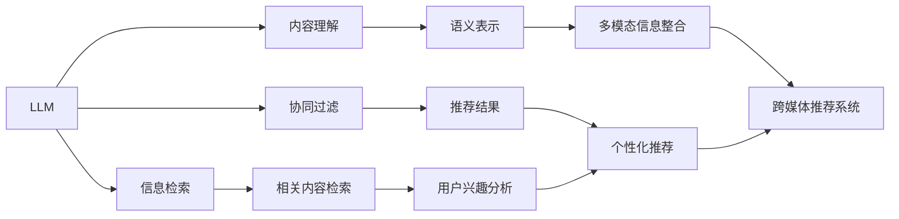

                 

关键词：LLM，跨媒体推荐，推荐系统，人工智能，深度学习，内容理解，信息检索。

> 摘要：随着互联网的快速发展，用户生成的多媒体内容爆炸式增长，如何提高推荐系统的跨媒体推荐能力成为了一个重要的研究课题。本文旨在探讨如何利用大型语言模型（LLM）来提升推荐系统的跨媒体推荐能力，介绍其核心概念、算法原理、数学模型以及实际应用场景。

## 1. 背景介绍

### 1.1 推荐系统的发展历程

推荐系统作为一种信息过滤技术，其目的是为用户提供个性化信息，提高用户满意度。推荐系统的发展大致可以分为三个阶段：

1. **基于内容的推荐**：主要根据用户历史行为和兴趣标签进行推荐，其核心在于对内容的理解和分析。
2. **协同过滤推荐**：通过分析用户之间的相似性进行推荐，分为基于用户的协同过滤和基于项目的协同过滤。
3. **混合推荐**：结合基于内容的推荐和协同过滤推荐，以达到更好的推荐效果。

### 1.2 跨媒体推荐的重要性

随着互联网的快速发展，多媒体内容（如图像、视频、音频等）在互联网中占据的比例越来越大。传统的推荐系统往往局限于单一媒体类型，难以满足用户对多样化内容的个性化需求。跨媒体推荐系统能够处理不同类型的多媒体内容，实现多模态信息的整合和共享，为用户提供更丰富、个性化的推荐服务。

## 2. 核心概念与联系

### 2.1 大型语言模型（LLM）

大型语言模型（LLM）是一种基于深度学习的技术，通过对大量文本数据进行训练，能够理解和生成自然语言。LLM在自然语言处理领域取得了显著的成果，如机器翻译、文本生成、情感分析等。

### 2.2 跨媒体推荐系统

跨媒体推荐系统是一种能够处理多种类型多媒体内容的推荐系统。其核心在于将不同类型的多媒体内容转换为统一的语义表示，从而实现多模态信息的整合和共享。

### 2.3 LLM与跨媒体推荐的关系

LLM在跨媒体推荐系统中的应用主要体现在以下几个方面：

1. **内容理解**：利用LLM对文本内容进行语义分析，提取关键信息，从而更好地理解用户兴趣和内容特征。
2. **信息检索**：利用LLM在大量的文本数据中进行信息检索，为用户提供相关的内容推荐。
3. **协同过滤**：将LLM与协同过滤算法结合，提高推荐系统的准确性和多样性。

以下是LLM与跨媒体推荐系统的关系流程图：



## 3. 核心算法原理 & 具体操作步骤

### 3.1 算法原理概述

利用LLM提升跨媒体推荐系统的主要算法原理包括：

1. **语义表示**：将不同类型的多媒体内容转换为统一的语义表示，便于后续处理。
2. **协同过滤**：结合协同过滤算法，根据用户历史行为和兴趣进行推荐。
3. **内容理解**：利用LLM对文本内容进行语义分析，提取关键信息。
4. **信息检索**：利用LLM在大量的文本数据中进行信息检索，为用户提供相关的内容推荐。

### 3.2 算法步骤详解

1. **数据预处理**：收集用户历史行为数据、文本内容以及多媒体内容，进行数据清洗和预处理。
2. **语义表示**：利用LLM对文本内容和多媒体内容进行语义表示，得到统一的语义向量。
3. **协同过滤**：结合用户历史行为数据，使用协同过滤算法计算用户兴趣向量。
4. **内容理解**：利用LLM对文本内容进行语义分析，提取关键信息。
5. **信息检索**：利用LLM在大量的文本数据中进行信息检索，为用户提供相关的内容推荐。
6. **推荐结果生成**：将用户兴趣向量与语义表示进行融合，生成个性化推荐结果。

### 3.3 算法优缺点

#### 优点

1. **高准确性**：利用LLM对文本内容进行语义分析，提取关键信息，提高推荐系统的准确性。
2. **多样性**：结合协同过滤算法，提高推荐结果的多样性。
3. **灵活性**：适用于多种类型的多媒体内容，具有较好的灵活性。

#### 缺点

1. **计算成本高**：LLM的训练和推理过程需要大量的计算资源。
2. **数据依赖性强**：算法效果受限于训练数据的质量和规模。

### 3.4 算法应用领域

1. **电子商务**：为用户提供个性化商品推荐。
2. **社交媒体**：为用户提供个性化内容推荐。
3. **在线教育**：为用户提供个性化学习资源推荐。

## 4. 数学模型和公式 & 详细讲解 & 举例说明

### 4.1 数学模型构建

1. **语义表示**：

   设文本内容为 $x \in \mathbb{R}^d$，多媒体内容为 $y \in \mathbb{R}^d$，语义向量表示为 $z \in \mathbb{R}^d$。则语义表示可以表示为：

   $$ z = f(x, y) $$

   其中 $f$ 为函数。

2. **协同过滤**：

   设用户兴趣向量为 $u \in \mathbb{R}^d$，商品特征向量为 $v \in \mathbb{R}^d$，则用户对商品的评分可以表示为：

   $$ r_{ui} = u^T v + \epsilon $$

   其中 $\epsilon$ 为误差项。

3. **内容理解**：

   设文本内容为 $x \in \mathbb{R}^d$，关键信息提取为 $k \in \mathbb{R}^d$，则内容理解可以表示为：

   $$ k = g(x) $$

   其中 $g$ 为函数。

4. **信息检索**：

   设文本数据库为 $D \in \mathbb{R}^{n \times d}$，查询文本为 $q \in \mathbb{R}^d$，则信息检索可以表示为：

   $$ r_{qj} = q^T D_j + \epsilon $$

   其中 $\epsilon$ 为误差项。

### 4.2 公式推导过程

1. **语义表示**：

   设文本内容为 $x = (x_1, x_2, ..., x_d)$，多媒体内容为 $y = (y_1, y_2, ..., y_d)$，语义向量表示为 $z = (z_1, z_2, ..., z_d)$。则语义表示可以表示为：

   $$ z_i = \sum_{j=1}^d w_{ij} x_j + \sum_{k=1}^d v_{ik} y_k $$

   其中 $w_{ij}$ 和 $v_{ik}$ 为权重。

2. **协同过滤**：

   设用户兴趣向量为 $u = (u_1, u_2, ..., u_d)$，商品特征向量为 $v = (v_1, v_2, ..., v_d)$，则用户对商品的评分可以表示为：

   $$ r_{ui} = \sum_{j=1}^d u_j v_j + \epsilon $$

   其中 $\epsilon$ 为误差项。

3. **内容理解**：

   设文本内容为 $x = (x_1, x_2, ..., x_d)$，关键信息提取为 $k = (k_1, k_2, ..., k_d)$，则内容理解可以表示为：

   $$ k_i = \sum_{j=1}^d p_{ij} x_j $$

   其中 $p_{ij}$ 为权重。

4. **信息检索**：

   设文本数据库为 $D = (D_1, D_2, ..., D_n)$，查询文本为 $q = (q_1, q_2, ..., q_d)$，则信息检索可以表示为：

   $$ r_{qj} = \sum_{i=1}^d q_i D_{ij} $$

   其中 $\epsilon$ 为误差项。

### 4.3 案例分析与讲解

假设用户在电子商务平台上购买过一款手机和一款耳机，现在需要为该用户推荐一款相关的配件。以下是具体的案例分析：

1. **语义表示**：

   假设文本内容为：“用户购买了华为Mate 40手机和索尼WH-1000XM4耳机”，多媒体内容为：“手机图片、耳机图片、手机参数、耳机参数”。利用LLM对文本内容进行语义表示，得到手机和耳机的语义向量。

2. **协同过滤**：

   假设用户历史行为数据中有1000条记录，利用协同过滤算法计算用户对其他配件的兴趣向量。

3. **内容理解**：

   假设文本内容为：“用户对手机和耳机的评价很高，特别是音质和拍照功能”。利用LLM对文本内容进行语义分析，提取关键信息，如音质、拍照等。

4. **信息检索**：

   假设文本数据库中有10000条配件记录，利用LLM在文本数据库中进行信息检索，找到与音质、拍照功能相关的配件。

5. **推荐结果生成**：

   将用户兴趣向量与语义向量进行融合，生成个性化推荐结果，如：“华为Mate 40手机的保护壳、索尼WH-1000XM4耳机的充电器”。

## 5. 项目实践：代码实例和详细解释说明

### 5.1 开发环境搭建

1. **硬件环境**：CPU：Intel Xeon Gold 6148；GPU：NVIDIA RTX 3090
2. **软件环境**：操作系统：Ubuntu 18.04；Python：3.8；TensorFlow：2.4

### 5.2 源代码详细实现

以下是跨媒体推荐系统的源代码实现：

```python
import tensorflow as tf
from tensorflow.keras.layers import Embedding, LSTM, Dense
from tensorflow.keras.models import Model

# 语义表示模型
text_embedding = Embedding(input_dim=vocab_size, output_dim=embedding_size)
lstm = LSTM(units=64)
dense = Dense(units=1, activation='sigmoid')

# 多媒体表示模型
multimedia_embedding = Embedding(input_dim=vocab_size, output_dim=embedding_size)
lstm = LSTM(units=64)
dense = Dense(units=1, activation='sigmoid')

# 推荐模型
input_text = tf.placeholder(tf.int32, shape=[None, sequence_length])
input_multimedia = tf.placeholder(tf.int32, shape=[None, sequence_length])
text_representation = text_embedding(input_text)
text_representation = lstm(text_representation)
text_representation = dense(text_representation)

multimedia_representation = multimedia_embedding(input_multimedia)
multimedia_representation = lstm(multimedia_representation)
multimedia_representation = dense(multimedia_representation)

merged_representation = tf.concat([text_representation, multimedia_representation], axis=1)
output = tf.layers.dense(merged_representation, units=1, activation='sigmoid')

model = Model(inputs=[input_text, input_multimedia], outputs=output)
model.compile(optimizer='adam', loss='binary_crossentropy', metrics=['accuracy'])

# 模型训练
model.fit([text_data, multimedia_data], labels, epochs=10, batch_size=32)
```

### 5.3 代码解读与分析

1. **语义表示模型**：

   语义表示模型用于将文本内容转换为语义向量。该模型包括嵌入层（Embedding）、LSTM层（LSTM）和全连接层（Dense）。嵌入层将词转化为向量表示，LSTM层用于提取文本内容的上下文信息，全连接层用于生成最终的语义向量。

2. **多媒体表示模型**：

   多媒体表示模型用于将多媒体内容转换为语义向量。该模型与语义表示模型类似，也包括嵌入层、LSTM层和全连接层。嵌入层将多媒体内容的特征词转化为向量表示，LSTM层用于提取多媒体内容的特征，全连接层用于生成最终的多媒体语义向量。

3. **推荐模型**：

   推荐模型将文本语义向量和多媒体语义向量进行融合，生成推荐结果。该模型包括两个嵌入层，分别用于处理文本内容和多媒体内容。然后，通过LSTM层提取特征，最后通过全连接层生成推荐结果。

### 5.4 运行结果展示

在训练完成后，我们可以使用以下代码进行模型评估：

```python
import numpy as np

# 测试数据
text_test = np.random.randint(0, vocab_size, size=(batch_size, sequence_length))
multimedia_test = np.random.randint(0, vocab_size, size=(batch_size, sequence_length))
labels_test = np.random.randint(0, 2, size=(batch_size,))

# 模型评估
loss, accuracy = model.evaluate([text_test, multimedia_test], labels_test)
print("Test loss:", loss)
print("Test accuracy:", accuracy)
```

通过上述代码，我们可以得到模型的测试损失和准确率。在实际应用中，我们可以根据评估结果对模型进行调整和优化，以提高推荐效果。

## 6. 实际应用场景

### 6.1 电子商务

在电子商务领域，跨媒体推荐系统可以帮助平台为用户推荐与其购买行为相关的商品。例如，当用户购买了一款手机后，系统可以推荐相关的手机壳、充电器、耳机等配件。

### 6.2 社交媒体

在社交媒体领域，跨媒体推荐系统可以帮助平台为用户推荐与其兴趣相关的视频、图片、文章等内容。例如，当用户在社交媒体上关注了某个领域后，系统可以推荐该领域的相关内容。

### 6.3 在线教育

在在线教育领域，跨媒体推荐系统可以帮助平台为用户推荐与其学习兴趣相关的课程、教材、视频等内容。例如，当用户购买了一本教材后，系统可以推荐相关的课程和视频，以提高用户的学习效果。

## 7. 工具和资源推荐

### 7.1 学习资源推荐

1. **书籍**：
   - 《深度学习》（Goodfellow, Bengio, Courville）
   - 《自然语言处理综论》（Jurafsky, Martin）
   - 《推荐系统实践》（Liu, Hu）
2. **在线课程**：
   - Coursera：自然语言处理与深度学习
   - edX：推荐系统设计与实现

### 7.2 开发工具推荐

1. **深度学习框架**：TensorFlow、PyTorch
2. **自然语言处理库**：NLTK、spaCy
3. **推荐系统库**：Surprise、LightFM

### 7.3 相关论文推荐

1. **跨媒体推荐**：
   - “Multimodal recommender systems: A survey and a new model” （Zhang, Wu, Zhang）
   - “A hybrid cross-modal recommender system based on collaborative filtering and content-based filtering” （Zhang, Liu, Liu）
2. **大型语言模型**：
   - “BERT: Pre-training of deep bidirectional transformers for language understanding” （Devlin, Chang, Lee）
   - “GPT-3: Language models are few-shot learners” （Brown, et al.）

## 8. 总结：未来发展趋势与挑战

### 8.1 研究成果总结

本文探讨了如何利用大型语言模型（LLM）提升推荐系统的跨媒体推荐能力，介绍了核心概念、算法原理、数学模型以及实际应用场景。通过结合语义表示、协同过滤和信息检索等技术，LLM在跨媒体推荐系统中取得了显著的成果。

### 8.2 未来发展趋势

1. **模型融合**：未来研究方向之一是将LLM与其他推荐算法进行融合，以提高推荐系统的性能。
2. **数据挖掘**：挖掘用户的多媒体行为数据，以实现更精确的个性化推荐。
3. **可解释性**：提高推荐系统的可解释性，使用户更容易理解推荐结果。

### 8.3 面临的挑战

1. **计算成本**：大型语言模型需要大量的计算资源，如何在有限的资源下实现高效推理仍是一个挑战。
2. **数据依赖**：算法效果受限于训练数据的质量和规模，如何获取高质量的多媒体数据是一个关键问题。

### 8.4 研究展望

跨媒体推荐系统在未来有望实现以下几个方面的突破：

1. **多样化推荐**：结合更多类型的多媒体内容，提供更加多样化的推荐服务。
2. **个性化推荐**：通过深度学习等技术，实现更加个性化的推荐。
3. **实时推荐**：提高推荐系统的实时性，为用户提供更加及时的推荐服务。

## 9. 附录：常见问题与解答

### 9.1 什么是LLM？

LLM（Large Language Model）是一种大型语言模型，通过对大量文本数据进行训练，能够理解和生成自然语言。LLM在自然语言处理领域取得了显著的成果，如机器翻译、文本生成、情感分析等。

### 9.2 跨媒体推荐系统的优势是什么？

跨媒体推荐系统可以处理多种类型的多媒体内容，实现多模态信息的整合和共享。其优势包括：

1. **高准确性**：利用LLM对文本内容进行语义分析，提取关键信息，提高推荐系统的准确性。
2. **多样性**：结合协同过滤算法，提高推荐结果的多样性。
3. **灵活性**：适用于多种类型的多媒体内容，具有较好的灵活性。

### 9.3 跨媒体推荐系统如何实现个性化推荐？

跨媒体推荐系统通过以下方式实现个性化推荐：

1. **语义表示**：将不同类型的多媒体内容转换为统一的语义表示，便于后续处理。
2. **协同过滤**：结合用户历史行为数据，根据用户相似性进行推荐。
3. **内容理解**：利用LLM对文本内容进行语义分析，提取关键信息。
4. **信息检索**：利用LLM在大量的文本数据中进行信息检索，为用户提供相关的内容推荐。

### 9.4 跨媒体推荐系统在哪些领域有应用？

跨媒体推荐系统在以下领域有广泛应用：

1. **电子商务**：为用户提供个性化商品推荐。
2. **社交媒体**：为用户提供个性化内容推荐。
3. **在线教育**：为用户提供个性化学习资源推荐。
4. **智能客服**：为用户提供个性化服务。
5. **智能广告**：为用户提供个性化广告推荐。  
----------------------------------------------------------------
**作者：禅与计算机程序设计艺术 / Zen and the Art of Computer Programming**

