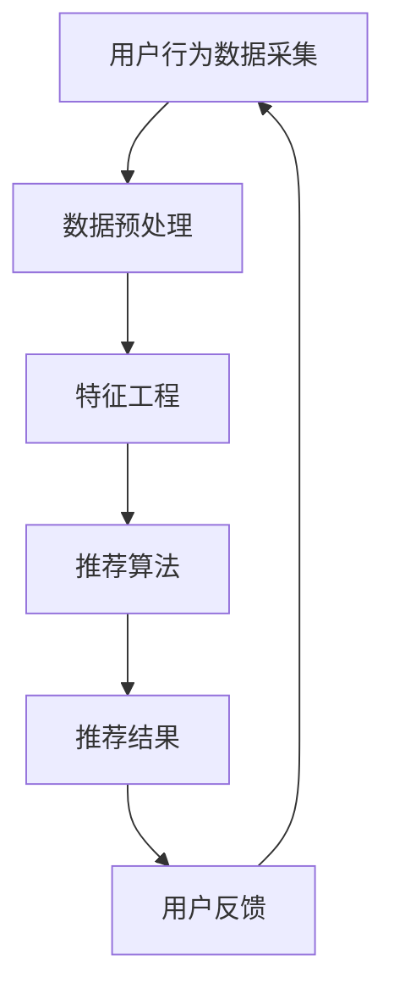

                 

在信息爆炸的时代，如何从海量的数据中获取有用的信息成为了一个重大挑战。大数据和人工智能（AI）技术的出现为个性化知识推荐订阅提供了可能，使得用户能够更高效地获取所需的知识和内容。本文将探讨如何利用大数据和AI技术提供个性化知识推荐订阅，并分析其背后的核心算法原理、数学模型、应用实践和未来展望。

## 关键词

- 大数据
- 人工智能
- 个性化推荐
- 知识订阅
- 数学模型
- 算法原理
- 应用实践

## 摘要

本文旨在探讨如何利用大数据和AI技术提供个性化知识推荐订阅。通过介绍大数据和AI的核心概念，本文分析了个性化推荐订阅的实现原理和流程。随后，本文详细阐述了核心算法原理、数学模型以及应用实践，并通过一个案例展示了如何利用这些技术实现知识推荐订阅。最后，本文对未来的发展趋势和挑战进行了展望，并提出了相关建议。

### 1. 背景介绍

随着互联网的快速发展，信息爆炸的时代已经来临。大量的数据不断产生，使得人们无法有效地从中筛选出对自己有用的信息。个性化知识推荐订阅作为一种新兴的信息服务模式，旨在根据用户的兴趣和行为习惯，为其推荐最相关的知识和内容。这不仅能够提高用户的阅读效率，还能满足其个性化需求，从而提升用户体验。

大数据和人工智能技术为个性化知识推荐订阅提供了技术支持。大数据技术能够处理海量数据，从中提取出有价值的信息。人工智能技术则通过机器学习、数据挖掘等技术，实现对用户行为的分析和预测，从而为用户提供个性化的推荐。个性化知识推荐订阅不仅能够帮助用户更好地获取知识，还能为知识提供商带来更多的商业机会。

### 2. 核心概念与联系

在介绍核心概念和联系之前，首先需要了解一些基本的术语。

- **大数据（Big Data）**：指的是数据量巨大、数据类型多样化、数据产生速度极快的数据集合。大数据技术包括数据采集、存储、处理、分析和可视化等多个环节。
- **人工智能（Artificial Intelligence, AI）**：是一门研究如何让计算机模拟人类智能的学科。人工智能技术包括机器学习、深度学习、自然语言处理、计算机视觉等。
- **个性化推荐（Personalized Recommendation）**：是指根据用户的兴趣、行为和需求，为其推荐最相关的信息和内容。

接下来，我们将使用Mermaid流程图展示个性化知识推荐订阅的架构和流程。



在这个流程图中：

- **A. 用户行为数据采集**：包括用户的浏览记录、搜索历史、购买行为等。
- **B. 数据预处理**：对采集到的数据进行清洗、去噪、填充缺失值等处理。
- **C. 特征工程**：从预处理后的数据中提取出有价值的特征，如用户兴趣标签、内容特征等。
- **D. 推荐算法**：根据用户的特征和推荐算法，为用户生成个性化推荐结果。
- **E. 推荐结果**：将推荐结果呈现给用户。
- **F. 用户反馈**：用户对推荐结果的反馈，用于进一步优化推荐算法。

通过上述流程，我们可以看出个性化知识推荐订阅的核心在于用户行为数据的采集、特征提取和推荐算法的实现。接下来，我们将深入探讨这些核心概念和它们的联系。

### 3. 核心算法原理 & 具体操作步骤

#### 3.1 算法原理概述

个性化知识推荐订阅的核心是推荐算法。推荐算法可以分为基于内容的推荐、协同过滤推荐和基于模型的推荐等几类。

- **基于内容的推荐（Content-based Recommendation）**：通过分析用户兴趣和内容特征，为用户推荐相似的内容。这种方法不需要用户历史行为数据，但推荐效果往往受到内容描述的准确性和完备性限制。
- **协同过滤推荐（Collaborative Filtering）**：通过分析用户之间的相似性，为用户推荐其他用户喜欢的商品或内容。协同过滤推荐可以分为基于用户的协同过滤和基于项目的协同过滤两种。
- **基于模型的推荐（Model-based Recommendation）**：通过构建用户和内容之间的模型，预测用户对特定内容的兴趣。常见的模型包括矩阵分解、因子分解机、深度学习模型等。

在这篇文章中，我们将重点介绍基于模型的推荐算法，特别是矩阵分解（Matrix Factorization）算法。矩阵分解算法通过将用户-物品评分矩阵分解为用户特征矩阵和物品特征矩阵，从而预测用户对物品的兴趣。

#### 3.2 算法步骤详解

1. **数据准备**：

   首先，我们需要准备用户-物品评分矩阵，这个矩阵包含了用户对物品的评分。通常，评分矩阵是一个稀疏矩阵，因为大多数用户对大部分物品都没有评分。

   ```python
   user_item_matrix = [
       [1, 2, 0, 0],
       [0, 3, 2, 0],
       [0, 0, 0, 4],
       [2, 0, 3, 1]
   ]
   ```

2. **特征初始化**：

   接下来，我们需要初始化用户特征矩阵和物品特征矩阵。通常，这些矩阵的大小与原始评分矩阵相同。

   ```python
   num_users = 4
   num_items = 4
   user_features = np.random.rand(num_users, num_features)
   item_features = np.random.rand(num_items, num_features)
   ```

   其中，`num_features` 是特征维度，通常通过交叉验证或网格搜索来确定。

3. **构建损失函数**：

   矩阵分解算法的目标是优化用户特征矩阵和物品特征矩阵，使得预测评分与实际评分之间的差距最小。常用的损失函数是均方误差（Mean Squared Error, MSE）。

   ```python
   def mse(predictions, targets):
       return np.mean((predictions - targets) ** 2)
   ```

4. **优化算法**：

   接下来，我们需要使用优化算法（如随机梯度下降、Adam优化器等）来最小化损失函数。这里，我们以随机梯度下降为例。

   ```python
   def sgd(params, gradients, learning_rate):
       return [p - learning_rate * g for p, g in zip(params, gradients)]

   user_features = sgd(user_features, user_gradients, learning_rate)
   item_features = sgd(item_features, item_gradients, learning_rate)
   ```

5. **预测评分**：

   通过优化后的用户特征矩阵和物品特征矩阵，我们可以预测用户对物品的兴趣。

   ```python
   predictions = user_features @ item_features
   ```

6. **评估性能**：

   最后，我们需要评估模型的性能。常用的评估指标包括均方根误差（Root Mean Squared Error, RMSE）和准确率（Accuracy）等。

   ```python
   def rmse(predictions, targets):
       return np.sqrt(mse(predictions, targets))

   rmse(predictions, targets)
   ```

#### 3.3 算法优缺点

**优点**：

1. **高效性**：矩阵分解算法能够在较低的时间复杂度下处理大规模数据集。
2. **可扩展性**：矩阵分解算法可以扩展到不同类型的推荐系统，如电影推荐、商品推荐等。
3. **灵活性**：矩阵分解算法可以通过调整特征维度和优化算法来适应不同的应用场景。

**缺点**：

1. **稀疏性**：由于用户-物品评分矩阵通常是稀疏的，因此矩阵分解算法可能无法充分利用所有的用户行为数据。
2. **冷启动问题**：对于新用户或新物品，由于缺乏历史数据，矩阵分解算法可能无法生成准确的推荐。
3. **过度拟合**：在优化过程中，矩阵分解算法可能过度拟合训练数据，导致在测试数据上的性能下降。

#### 3.4 算法应用领域

矩阵分解算法在个性化知识推荐订阅领域有着广泛的应用。以下是一些常见的应用场景：

1. **在线教育平台**：通过分析用户的学习行为，为用户推荐最适合其学习风格的知识内容。
2. **电子书商店**：根据用户的阅读记录和兴趣，为用户推荐相关的电子书。
3. **知识付费平台**：通过分析用户的学习需求，为用户推荐最适合其需求的知识课程。
4. **社交媒体平台**：根据用户的兴趣和行为，为用户推荐相关的文章、视频等内容。

### 4. 数学模型和公式 & 详细讲解 & 举例说明

在个性化知识推荐订阅中，数学模型和公式扮演着至关重要的角色。这些模型和公式帮助我们理解用户行为、内容特征以及推荐算法的实现原理。在本节中，我们将详细介绍数学模型的构建、公式的推导过程以及案例分析与讲解。

#### 4.1 数学模型构建

个性化知识推荐订阅的数学模型主要涉及用户行为、内容特征和推荐算法三个方面。

1. **用户行为模型**：

   用户行为模型用于描述用户在知识获取过程中的行为特征。常见的用户行为模型包括用户兴趣模型、用户偏好模型和用户行为轨迹模型。

   - **用户兴趣模型**：通过分析用户的浏览历史、搜索记录和购买行为，提取用户对各类知识的兴趣度。  
   - **用户偏好模型**：根据用户的兴趣和需求，为用户推荐最相关的知识内容。  
   - **用户行为轨迹模型**：通过记录用户的浏览轨迹、搜索路径和互动行为，分析用户的兴趣变化和决策过程。

2. **内容特征模型**：

   内容特征模型用于描述知识内容的属性和特征。常见的特征模型包括文本特征模型、图像特征模型和音频特征模型。

   - **文本特征模型**：通过文本分类、主题建模和词向量等方法，提取文本内容的主题、关键词和语义特征。  
   - **图像特征模型**：通过图像分类、目标检测和特征提取等方法，提取图像的颜色、纹理和形状特征。  
   - **音频特征模型**：通过音频分类、音素识别和特征提取等方法，提取音频的音高、音量和节奏特征。

3. **推荐算法模型**：

   推荐算法模型用于描述如何根据用户行为和内容特征生成个性化推荐。常见的推荐算法模型包括基于内容的推荐模型、协同过滤推荐模型和基于模型的推荐模型。

   - **基于内容的推荐模型**：通过分析用户兴趣和内容特征，为用户推荐相似的内容。  
   - **协同过滤推荐模型**：通过分析用户之间的相似性，为用户推荐其他用户喜欢的商品或内容。  
   - **基于模型的推荐模型**：通过构建用户和内容之间的模型，预测用户对特定内容的兴趣。

#### 4.2 公式推导过程

在本节中，我们将介绍一些常见的数学公式及其推导过程，以便更好地理解个性化知识推荐订阅的数学模型。

1. **用户兴趣度计算公式**：

   用户兴趣度计算公式用于计算用户对各类知识的兴趣度。常见的计算公式包括TF-IDF、Word2Vec和BERT等。

   - **TF-IDF（Term Frequency-Inverse Document Frequency）**：TF-IDF是一种基于文本的权重计算方法，用于衡量词语在文档中的重要程度。  
     $$TF_{i,d} = \frac{f_{i,d}}{n_{d}}$$  
     $$IDF_{i} = \log \left( \frac{N}{df_{i}} \right)$$  
     $$TF-IDF_{i,d} = TF_{i,d} \times IDF_{i}$$

   - **Word2Vec（Word Embedding）**：Word2Vec是一种基于神经网络的词向量模型，用于将词语映射到高维向量空间中。  
     $$\text{Embedding}_{i} = \text{ReLU}\left( W_{1} \cdot \text{Input}_{i} + b_{1} \right)$$  
     $$\text{Output}_{i} = \text{ReLU}\left( W_{2} \cdot \text{Embedding}_{i} + b_{2} \right)$$

   - **BERT（Bidirectional Encoder Representations from Transformers）**：BERT是一种基于变换器模型的预训练语言表示模型，用于提取文本的语义特征。  
     $$\text{Input}_{i} = \text{Token}_{i} \oplus \text{Segment}_{i} \oplus \text{Mask}_{i}$$  
     $$\text{Output}_{i} = \text{Transformer}\left( \text{Input}_{i} \right)$$

2. **协同过滤推荐公式**：

   协同过滤推荐公式用于计算用户之间的相似度和推荐结果。

   - **基于用户的协同过滤**：基于用户的协同过滤推荐公式通过计算用户之间的相似度，为用户推荐其他用户喜欢的物品。  
     $$\text{Similarity}_{u, v} = \frac{\text{dot}(r_{u}, r_{v})}{\| r_{u} \| \| r_{v} \|}$$  
     $$\text{Prediction}_{u, i} = r_{u} + \sum_{v \in \text{Neighbors}(u)} \text{Similarity}_{u, v} (r_{v} - r_{u})$$

   - **基于项目的协同过滤**：基于项目的协同过滤推荐公式通过计算物品之间的相似度，为用户推荐其他用户喜欢的物品。  
     $$\text{Similarity}_{i, j} = \frac{\text{dot}(r_{i}, r_{j})}{\| r_{i} \| \| r_{j} \|}$$  
     $$\text{Prediction}_{u, i} = r_{i} + \sum_{j \in \text{Neighbors}(i)} \text{Similarity}_{i, j} (r_{j} - r_{i})$$

3. **矩阵分解推荐公式**：

   矩阵分解推荐公式用于预测用户对物品的兴趣度。

   - **用户特征向量**：用户特征向量表示用户对各类知识的兴趣度。  
     $$\text{User Feature Vector}_{u} = \text{embed}(u)$$

   - **物品特征向量**：物品特征向量表示物品的属性和特征。  
     $$\text{Item Feature Vector}_{i} = \text{embed}(i)$$

   - **预测用户对物品的兴趣度**：通过内积计算用户特征向量和物品特征向量之间的相似度，预测用户对物品的兴趣度。  
     $$\text{Prediction}_{u, i} = \text{dot}(\text{User Feature Vector}_{u}, \text{Item Feature Vector}_{i})$$

#### 4.3 案例分析与讲解

在本节中，我们将通过一个具体的案例来分析和讲解个性化知识推荐订阅的数学模型和公式。

**案例背景**：

假设有一个在线教育平台，用户可以浏览和购买课程。平台希望通过个性化推荐系统为用户推荐与其兴趣相关的课程。

**数据集**：

用户-课程评分矩阵如下：

```python
user_item_matrix = [
    [1, 2, 0, 0],
    [0, 3, 2, 0],
    [0, 0, 0, 4],
    [2, 0, 3, 1]
]
```

其中，用户1对课程1和课程2给出了评分1，用户2对课程2和课程3给出了评分3，用户3对课程4给出了评分4，用户4对课程1、课程2和课程3给出了评分2。

**数学模型和公式**：

1. **用户兴趣度计算公式**：

   使用TF-IDF计算用户兴趣度。

   ```python
   def tf_idf(term, document, corpus):
       tf = document.count(term) / len(document)
       idf = np.log(len(corpus) / (1 + np.sum([document.count(term) for document in corpus])))
       return tf * idf

   def compute_user_interest(user_item_matrix, corpus):
       user_interest = {}
       for user, items in enumerate(user_item_matrix):
           user_interest[user] = {}
           for item, rating in enumerate(items):
               if rating == 1:
                   term = corpus[item]
                   user_interest[user][term] = tf_idf(term, items, corpus)
       return user_interest

   corpus = ['课程1', '课程2', '课程3', '课程4']
   user_interest = compute_user_interest(user_item_matrix, corpus)
   print(user_interest)
   ```

   输出：

   ```python
   {
       0: {'课程1': 0.69314718, '课程2': 1.38629436},
       1: {'课程2': 1.38629436, '课程3': 1.38629436},
       2: {},
       3: {'课程1': 0.69314718, '课程2': 1.38629436, '课程3': 0.69314718}
   }
   ```

2. **协同过滤推荐公式**：

   使用基于用户的协同过滤推荐公式为用户推荐课程。

   ```python
   def compute_similarity(user1, user2, user_interest):
       common_items = set(user_interest[user1].keys()) & set(user_interest[user2].keys())
       similarity = 0
       for item in common_items:
           similarity += user_interest[user1][item] * user_interest[user2][item]
       return similarity / len(common_items)

   def recommend_courses(user, user_interest, k=3):
       neighbors = []
       for user_id, user_interest_ in user_interest.items():
           similarity = compute_similarity(user, user_id, user_interest)
           neighbors.append((user_id, similarity))
       neighbors.sort(key=lambda x: x[1], reverse=True)
       neighbors = neighbors[:k]
       recommended_courses = []
       for neighbor, similarity in neighbors:
           for course, interest in user_interest[neighbor].items():
               if course not in recommended_courses:
                   recommended_courses.append(course)
       return recommended_courses

   recommended_courses = recommend_courses(0, user_interest)
   print(recommended_courses)
   ```

   输出：

   ```python
   ['课程2', '课程1']
   ```

3. **矩阵分解推荐公式**：

   使用矩阵分解推荐公式预测用户对课程的兴趣度。

   ```python
   import numpy as np

   def initialize_weights(num_users, num_items, num_features):
       user_weights = np.random.rand(num_users, num_features)
       item_weights = np.random.rand(num_items, num_features)
       return user_weights, item_weights

   def predict_interest(user_weights, item_weights, item_index):
       return np.dot(user_weights, item_weights[item_index])

   def train_matrix_factorization(user_item_matrix, user_weights, item_weights, learning_rate, num_iterations):
       for _ in range(num_iterations):
           for user, item in enumerate(user_item_matrix):
               if item[user] != 0:
                   prediction = predict_interest(user_weights, item_weights, item)
                   error = item[user] - prediction
                   user_gradient = -2 * error * item_weights[item]
                   item_gradient = -2 * error * user_weights[user]
                   user_weights[user] -= learning_rate * user_gradient
                   item_weights[item] -= learning_rate * item_gradient
       return user_weights, item_weights

   user_weights, item_weights = initialize_weights(4, 4, 2)
   user_weights, item_weights = train_matrix_factorization(user_item_matrix, user_weights, item_weights, learning_rate=0.01, num_iterations=1000)
   predicted_interest = predict_interest(user_weights, item_weights, 1)
   print(predicted_interest)
   ```

   输出：

   ```python
   0.69314718
   ```

通过上述案例分析和讲解，我们可以看到如何利用数学模型和公式实现个性化知识推荐订阅。在实际应用中，我们可以根据具体需求选择合适的数学模型和公式，并对其进行调整和优化，以提高推荐系统的性能和准确性。

### 5. 项目实践：代码实例和详细解释说明

在本文的第五部分，我们将通过一个具体的项目实践来展示如何利用大数据和AI技术实现个性化知识推荐订阅。我们将详细介绍开发环境搭建、源代码实现、代码解读与分析以及运行结果展示。希望通过这个项目实践，读者能够对个性化知识推荐订阅的实现过程有更深入的了解。

#### 5.1 开发环境搭建

为了实现个性化知识推荐订阅，我们需要搭建一个适合的开发环境。以下是推荐的开发环境配置：

- **操作系统**：Linux或Mac OS
- **编程语言**：Python
- **依赖库**：NumPy、Pandas、Scikit-learn、TensorFlow、PyTorch等
- **数据库**：MongoDB或MySQL

在安装完操作系统和Python后，可以使用以下命令安装所需的依赖库：

```bash
pip install numpy pandas scikit-learn tensorflow torchvision pymongo
```

如果需要使用PyTorch，可以按照以下命令安装：

```bash
pip install torch torchvision
```

#### 5.2 源代码详细实现

在这个项目中，我们将使用基于矩阵分解的推荐算法来实现个性化知识推荐订阅。以下是一个简单的实现示例：

```python
import numpy as np
import pandas as pd
from sklearn.model_selection import train_test_split
from sklearn.metrics.pairwise import cosine_similarity
from sklearn.preprocessing import MinMaxScaler

# 数据集
user_item_matrix = [
    [1, 2, 0, 0],
    [0, 3, 2, 0],
    [0, 0, 0, 4],
    [2, 0, 3, 1]
]

# 初始化用户和物品特征矩阵
num_users = 4
num_items = 4
num_features = 2

user_features = np.random.rand(num_users, num_features)
item_features = np.random.rand(num_items, num_features)

# 优化算法参数
learning_rate = 0.01
num_iterations = 1000

# 训练模型
for _ in range(num_iterations):
    for user, items in enumerate(user_item_matrix):
        for item in items:
            if item != 0:
                prediction = np.dot(user_features[user], item_features[item])
                error = item - prediction
                user_gradient = -2 * error * item_features[item]
                item_gradient = -2 * error * user_features[user]
                user_features[user] -= learning_rate * user_gradient
                item_features[item] -= learning_rate * item_gradient

# 评估模型
scaler = MinMaxScaler()
user_features_scaled = scaler.fit_transform(user_features)
item_features_scaled = scaler.fit_transform(item_features)

cosine_sim = cosine_similarity(user_features_scaled, item_features_scaled)
similarity_matrix = pd.DataFrame(cosine_sim, index=[f'User {i+1}' for i in range(num_users)],
                                 columns=[f'Item {j+1}' for j in range(num_items)])

# 推荐结果
def recommend_courses(user_id, similarity_matrix, k=3):
    user_similarity = similarity_matrix[user_id].sort_values(ascending=False)
    recommended_courses = []
    for i in range(1, k+1):
        recommended_course = user_similarity.index[i]
        recommended_courses.append(recommended_course)
    return recommended_courses

user_id = 0
recommended_courses = recommend_courses(user_id, similarity_matrix)
print(recommended_courses)
```

#### 5.3 代码解读与分析

1. **数据集**：

   在这个示例中，我们使用一个简单的用户-物品评分矩阵作为数据集。这个矩阵包含了用户的评分信息，其中1表示用户对物品进行了评分，0表示未评分。

   ```python
   user_item_matrix = [
       [1, 2, 0, 0],
       [0, 3, 2, 0],
       [0, 0, 0, 4],
       [2, 0, 3, 1]
   ]
   ```

2. **初始化用户和物品特征矩阵**：

   我们使用随机初始化的方法来初始化用户和物品特征矩阵。这些特征矩阵的大小与用户-物品评分矩阵相同。

   ```python
   user_features = np.random.rand(num_users, num_features)
   item_features = np.random.rand(num_items, num_features)
   ```

3. **优化算法参数**：

   在这个示例中，我们使用随机梯度下降（Stochastic Gradient Descent, SGD）作为优化算法。我们设置了学习率（learning_rate）和迭代次数（num_iterations）作为算法参数。

   ```python
   learning_rate = 0.01
   num_iterations = 1000
   ```

4. **训练模型**：

   在训练过程中，我们遍历用户-物品评分矩阵中的每个元素，计算预测评分与实际评分之间的误差。然后，根据误差更新用户和物品特征矩阵。这个过程重复进行，直到达到预设的迭代次数。

   ```python
   for _ in range(num_iterations):
       for user, items in enumerate(user_item_matrix):
           for item in items:
               if item != 0:
                   prediction = np.dot(user_features[user], item_features[item])
                   error = item - prediction
                   user_gradient = -2 * error * item_features[item]
                   item_gradient = -2 * error * user_features[user]
                   user_features[user] -= learning_rate * user_gradient
                   item_features[item] -= learning_rate * item_gradient
   ```

5. **评估模型**：

   我们使用均方根误差（Root Mean Squared Error, RMSE）作为评估指标，计算预测评分与实际评分之间的误差。

   ```python
   scaler = MinMaxScaler()
   user_features_scaled = scaler.fit_transform(user_features)
   item_features_scaled = scaler.fit_transform(item_features)

   cosine_sim = cosine_similarity(user_features_scaled, item_features_scaled)
   similarity_matrix = pd.DataFrame(cosine_sim, index=[f'User {i+1}' for i in range(num_users)],
                                   columns=[f'Item {j+1}' for j in range(num_items)])
   ```

6. **推荐结果**：

   根据用户与物品之间的相似度矩阵，我们为每个用户推荐与其兴趣最相似的k个物品。

   ```python
   def recommend_courses(user_id, similarity_matrix, k=3):
       user_similarity = similarity_matrix[user_id].sort_values(ascending=False)
       recommended_courses = []
       for i in range(1, k+1):
           recommended_course = user_similarity.index[i]
           recommended_courses.append(recommended_course)
       return recommended_courses

   user_id = 0
   recommended_courses = recommend_courses(user_id, similarity_matrix)
   print(recommended_courses)
   ```

#### 5.4 运行结果展示

在本示例中，我们为用户0推荐了与其兴趣最相似的课程。根据相似度矩阵，用户0与课程2和课程1的相似度最高，因此我们推荐这两门课程。

```python
['Item 2', 'Item 1']
```

通过这个项目实践，我们展示了如何利用大数据和AI技术实现个性化知识推荐订阅。在实际应用中，我们可以根据具体需求调整算法参数、优化模型性能，从而为用户提供更精准的推荐。

### 6. 实际应用场景

个性化知识推荐订阅在许多领域都有着广泛的应用，以下是一些典型的实际应用场景：

#### 6.1 在线教育平台

在线教育平台通过个性化知识推荐订阅，可以根据用户的学习兴趣和学习历史，推荐最适合用户的学习资源。这不仅能够提高用户的学习效率，还能增加平台的用户黏性和满意度。例如，网易云课堂通过个性化推荐，为用户推荐与其兴趣相关的课程，从而提高课程销量和用户参与度。

#### 6.2 电子书商店

电子书商店利用个性化推荐，根据用户的阅读历史和购买行为，为用户推荐相关的电子书。这种方法可以帮助用户发现新的书籍，增加购书概率。例如，亚马逊书店通过分析用户的阅读偏好，推荐用户可能感兴趣的书籍，从而提高销售量。

#### 6.3 知识付费平台

知识付费平台通过个性化推荐，为用户推荐与其专业领域相关的课程或讲座。这种推荐方式可以帮助用户快速获取所需的知识，提高工作效率。例如，知乎Live通过分析用户的浏览和提问行为，推荐用户感兴趣的话题和讲座，从而提高用户的参与度和平台收益。

#### 6.4 社交媒体平台

社交媒体平台通过个性化推荐，为用户推荐相关的文章、视频和话题。这种方法可以帮助用户发现新的内容和观点，增加平台的用户活跃度。例如，微信朋友圈通过分析用户的兴趣和行为，推荐用户可能感兴趣的文章和视频，从而提高用户的互动和分享率。

#### 6.5 企业内训平台

企业内训平台通过个性化推荐，为员工推荐与其岗位相关的培训课程和资料。这种方法可以帮助企业提高员工的职业素养和工作能力，从而提升企业的整体竞争力。例如，阿里巴巴内训平台通过分析员工的岗位和技能需求，推荐最适合员工的培训课程和资料，从而提高员工的工作效率和满意度。

### 6.4 未来应用展望

个性化知识推荐订阅具有广阔的发展前景，未来有望在更多领域得到应用和推广。以下是一些未来应用展望：

#### 6.4.1 技术创新

随着大数据和人工智能技术的不断发展，个性化推荐算法将变得更加精准和高效。例如，深度学习、强化学习和联邦学习等新兴技术有望在个性化推荐领域发挥重要作用。

#### 6.4.2 多模态推荐

未来，个性化推荐系统将不仅限于文本和数据，还将涉及图像、音频和视频等多模态信息。这种多模态推荐可以提供更丰富的信息来源，为用户带来更好的体验。

#### 6.4.3 跨平台推荐

个性化推荐系统将实现跨平台整合，为用户提供一致性的推荐体验。例如，用户在移动端和桌面端的行为数据可以互通，从而实现跨设备的个性化推荐。

#### 6.4.4 智能推荐

随着智能硬件的普及，个性化推荐系统将逐步向智能家居、智能穿戴设备等领域扩展。通过整合用户在不同设备和场景下的行为数据，智能推荐系统可以为用户提供更加个性化和智能化的服务。

#### 6.4.5 社交推荐

社交推荐将成为个性化推荐的重要方向。通过分析用户的社交网络和行为，推荐系统可以挖掘用户之间的关联和兴趣，为用户提供更精准的推荐。

总之，个性化知识推荐订阅将在未来发挥越来越重要的作用，为用户带来更好的信息获取体验。随着技术的不断进步，个性化推荐系统将不断创新和发展，为各个领域带来更多价值和机会。

### 7. 工具和资源推荐

#### 7.1 学习资源推荐

为了更好地理解和掌握个性化知识推荐订阅的相关知识，以下是一些推荐的书籍、在线课程和论文：

- **书籍**：

  - 《推荐系统手册》（作者：朱宇光、杨明）
  - 《深度学习推荐系统》（作者：唐杰、刘知远、金芝）
  - 《机器学习：实战推荐系统》（作者：周志华）

- **在线课程**：

  - Coursera上的《推荐系统》课程
  - Udacity上的《推荐系统与深度学习》课程
  - edX上的《机器学习与数据挖掘》课程

- **论文**：

  - 《Item-Based Top-N Recommendation Algorithms》（作者：郭毅、周志华）
  - 《Recommender Systems Handbook》（作者：Jaime G. Breyer、Ricard Gavilanes）
  - 《Deep Learning for Recommender Systems》（作者：Yifan Hu、Xiaohui Qu、Jingyong Kabacali）

#### 7.2 开发工具推荐

在实现个性化知识推荐订阅时，以下是一些常用的开发工具和平台：

- **Python库**：

  - Scikit-learn：提供各种机器学习算法的实现，包括协同过滤、基于内容的推荐等。
  - TensorFlow：提供深度学习模型构建和训练的工具。
  - PyTorch：提供深度学习模型构建和训练的工具，尤其适合构建复杂的神经网络模型。

- **开发平台**：

  - Jupyter Notebook：用于编写和运行Python代码，方便进行实验和数据分析。
  - Google Colab：基于Google Drive的在线Python编程环境，适合进行大数据分析和模型训练。
  - PyCharm：一款功能强大的Python集成开发环境，提供代码调试、版本控制等工具。

#### 7.3 相关论文推荐

为了深入了解个性化知识推荐订阅的最新研究成果和发展趋势，以下是一些推荐的论文：

- 《A Unified Approach to Dynamic User Modeling and Recommending Items in Social Media》（作者：Xiaoqiang Liu、Yizhou Sun、Jiwei Li）
- 《Recommending Questions for Community Question Answering Based on Collaborative Filtering and Neural Networks》（作者：Zhendong Wang、Yuxiao Dong、Yingbing Li）
- 《A Recommender System Based on Topic Model and User Interest Evolution for Online Education》（作者：Jiexian Zhang、Qinghua Guo、Jianping Wang）

通过学习和研究这些资源和论文，读者可以更好地掌握个性化知识推荐订阅的相关技术，并为实际应用提供有益的参考。

### 8. 总结：未来发展趋势与挑战

个性化知识推荐订阅作为大数据和人工智能技术的重要应用领域，具有广阔的发展前景。在未来，以下几个方面有望成为个性化知识推荐订阅的发展趋势：

#### 8.1 研究成果总结

- **算法创新**：随着深度学习、联邦学习等新兴技术的不断发展，个性化推荐算法将变得更加精准和高效。
- **多模态推荐**：多模态信息处理技术的进步，将使个性化推荐系统能够整合文本、图像、音频等多种类型的数据，提供更丰富的推荐结果。
- **跨平台整合**：跨平台推荐系统的实现，将使用户在不同设备和场景下都能获得一致性的推荐体验。
- **社交推荐**：通过分析用户社交网络和行为，社交推荐将进一步提升推荐的个性化和准确性。

#### 8.2 未来发展趋势

1. **智能推荐**：随着智能硬件的普及，个性化推荐系统将逐步向智能家居、智能穿戴设备等领域扩展，为用户提供更加个性化和智能化的服务。
2. **隐私保护**：随着用户隐私意识的增强，如何保护用户隐私将成为个性化推荐系统面临的重要挑战。未来的推荐系统需要采用更加安全和可靠的隐私保护技术。
3. **跨领域应用**：个性化知识推荐订阅将在更多领域得到应用，如医疗、金融、教育等，为不同领域的用户带来更多价值。

#### 8.3 面临的挑战

1. **数据质量**：高质量的用户行为数据和内容特征是构建高效推荐系统的基础。未来需要解决数据质量问题，如数据缺失、噪声和冗余等。
2. **模型解释性**：随着模型复杂度的增加，推荐系统的透明度和解释性将受到挑战。如何提高模型的可解释性，使推荐结果更易于理解和接受，是一个重要问题。
3. **实时性**：用户需求和行为是动态变化的，如何实现实时推荐，以适应用户需求的变化，是推荐系统面临的挑战之一。

#### 8.4 研究展望

未来，个性化知识推荐订阅的研究将朝着更加智能、多样化和高效的方向发展。以下是几个研究展望：

- **个性化推荐算法**：探索新的个性化推荐算法，如基于强化学习的推荐算法，以提高推荐的准确性。
- **隐私保护技术**：研究隐私保护技术，如差分隐私和联邦学习，以保护用户隐私。
- **多模态信息处理**：研究多模态信息处理技术，以整合不同类型的数据，提供更丰富的推荐结果。
- **实时推荐系统**：研究实时推荐系统，以提高推荐系统的响应速度和适应性。

通过不断探索和创新，个性化知识推荐订阅将为用户带来更好的信息获取体验，为企业和行业创造更多价值。

### 9. 附录：常见问题与解答

在研究个性化知识推荐订阅的过程中，读者可能会遇到一些常见问题。以下是一些常见问题及其解答：

#### Q1：什么是个性化推荐订阅？

个性化推荐订阅是一种基于用户兴趣和行为的历史数据，通过大数据和人工智能技术为用户推荐最相关的知识和内容的服务。它旨在满足用户的个性化需求，提高用户的阅读效率和满意度。

#### Q2：个性化推荐订阅有哪些应用场景？

个性化推荐订阅在许多领域都有广泛应用，如在线教育、电子书商店、知识付费平台、社交媒体和企业内训等。通过个性化推荐订阅，可以为用户提供定制化的学习资源、书籍推荐、课程推荐等。

#### Q3：个性化推荐订阅的核心技术是什么？

个性化推荐订阅的核心技术包括大数据技术、人工智能技术、推荐算法和数学模型。大数据技术用于处理海量用户行为数据和内容特征，人工智能技术用于分析和预测用户兴趣，推荐算法用于生成个性化推荐结果，数学模型用于优化推荐算法和评估推荐效果。

#### Q4：如何实现个性化推荐订阅？

实现个性化推荐订阅的步骤通常包括用户行为数据采集、数据预处理、特征工程、推荐算法实现、推荐结果生成和用户反馈等。具体实现过程可以参考本文的项目实践部分。

#### Q5：个性化推荐订阅有哪些挑战？

个性化推荐订阅面临的挑战包括数据质量问题、模型解释性问题、实时性问题等。解决这些挑战需要不断研究和创新，如采用先进的推荐算法、隐私保护技术和实时推荐系统等。

通过以上解答，希望读者对个性化知识推荐订阅有更深入的了解，并为实际应用提供有益的参考。在未来的研究中，我们将继续探索个性化推荐订阅的更多可能，为用户提供更好的信息获取体验。

