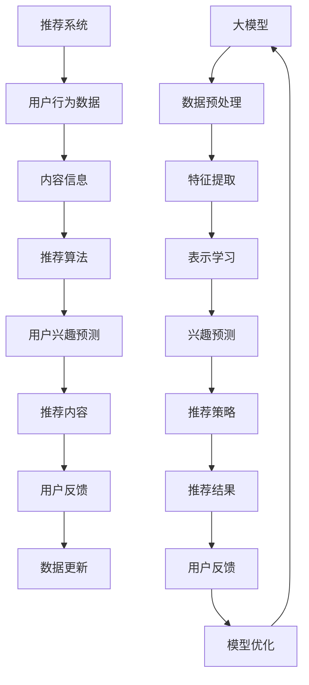

                 

关键词：推荐系统、大模型、冷启动、优化、算法、实践、应用场景

## 摘要

本文深入探讨了推荐系统在处理冷启动问题时的挑战和解决方案。随着大数据和人工智能技术的快速发展，推荐系统已经成为互联网服务中不可或缺的一部分。然而，对于新用户或新产品的推荐，即所谓的“冷启动”问题，推荐系统的性能往往受到影响。本文首先介绍了推荐系统的基本概念和冷启动问题的定义，然后重点介绍了利用大模型优化推荐系统冷启动策略的方法。通过详细的算法原理讲解、数学模型分析、实践案例展示以及未来应用展望，本文为解决推荐系统的冷启动问题提供了新的思路和实用方法。

### 1. 背景介绍

随着互联网和电子商务的快速发展，用户对个性化推荐服务的要求越来越高。推荐系统通过分析用户的行为数据、兴趣偏好以及历史记录，为用户提供个性化的内容推荐，从而提升用户体验和增加用户粘性。然而，在实际应用中，推荐系统常常会遇到所谓的“冷启动”问题。

**冷启动问题**：指当系统遇到新用户或新商品时，由于缺乏足够的用户行为数据和商品信息，推荐系统无法准确预测用户的兴趣和商品的相关性，导致推荐效果不佳的现象。

冷启动问题主要分为两种类型：

1. **新用户冷启动**：即系统在用户初次使用时无法准确了解其兴趣和偏好，导致推荐内容不够精准。
2. **新商品冷启动**：即系统在商品刚上线时，由于缺乏用户对该商品的评价和反馈，无法有效推荐该商品给潜在感兴趣的消费者。

冷启动问题对推荐系统的影响主要体现在以下几个方面：

- **用户体验下降**：由于推荐内容不够个性化，用户可能会感到推荐系统无趣，从而影响用户留存率和活跃度。
- **商业价值降低**：推荐系统的核心目标是提高用户购买转化率和平台销售额，冷启动问题会直接降低平台的商业价值。
- **推荐效率降低**：在冷启动阶段，推荐系统需要大量计算来收集和整合用户行为数据，这会导致系统响应时间延长，降低推荐效率。

为了解决冷启动问题，传统的推荐系统采取了多种方法，如基于内容的推荐、协同过滤和混合推荐等。然而，这些方法在处理冷启动问题时仍存在一定的局限性。随着深度学习和大模型技术的发展，利用大模型优化推荐系统的冷启动策略逐渐成为研究的热点。本文将详细介绍大模型在推荐系统冷启动优化中的应用，并提供实用的方法和案例分析。

### 2. 核心概念与联系

在介绍大模型优化推荐系统冷启动策略之前，我们需要先理解几个核心概念和它们之间的联系。

**核心概念**：

1. **推荐系统**：一种基于用户行为和内容信息的算法，用于向用户推荐感兴趣的内容或商品。
2. **大模型**：一种基于深度学习的技术，具有强大的表示学习和泛化能力，可以处理大量数据和复杂任务。
3. **冷启动**：指新用户或新商品由于缺乏足够的数据和信息，推荐系统无法准确预测其兴趣和相关性，导致推荐效果不佳。

**联系**：

大模型与推荐系统的联系主要体现在两个方面：

1. **数据表示学习**：大模型通过学习用户和商品的特征表示，能够更好地理解用户兴趣和商品特性，从而提高推荐精度。
2. **任务迁移能力**：大模型具有强大的任务迁移能力，可以在不同场景下快速适应和优化推荐算法，从而解决冷启动问题。

为了更好地理解这些概念和联系，我们可以使用Mermaid流程图来展示它们之间的关系。



通过这个流程图，我们可以清晰地看到大模型如何与推荐系统相结合，从而解决冷启动问题。

### 3. 核心算法原理 & 具体操作步骤

#### 3.1 算法原理概述

利用大模型优化推荐系统冷启动策略的核心思想是利用深度学习技术对用户和商品的特征进行有效表示和学习，从而提高推荐精度和响应速度。具体来说，该算法包括以下几个关键步骤：

1. **数据预处理**：对用户行为数据和商品信息进行预处理，包括数据清洗、去重、补全等操作。
2. **特征提取**：利用大模型对预处理后的数据进行特征提取，从而得到用户和商品的潜在特征表示。
3. **表示学习**：通过神经网络模型对用户和商品的潜在特征进行学习，从而提高特征表示的丰富性和准确性。
4. **兴趣预测**：利用学习到的用户和商品特征表示，对用户的兴趣进行预测，从而生成个性化的推荐列表。
5. **推荐策略优化**：根据用户的反馈和推荐效果，对推荐策略进行优化，从而提高推荐系统的稳定性和可靠性。

#### 3.2 算法步骤详解

下面我们详细讲解每个步骤的具体实现方法。

##### 3.2.1 数据预处理

数据预处理是算法的第一步，其主要任务是清洗和整理用户行为数据和商品信息。具体步骤如下：

1. **数据清洗**：删除重复、错误或无关的数据，确保数据的质量。
2. **数据去重**：对于用户行为数据，去除重复的记录，以减少数据冗余。
3. **数据补全**：对于缺失的数据，采用填充策略进行补全，例如使用平均值、中位数或插值法。

##### 3.2.2 特征提取

特征提取是利用大模型对预处理后的数据进行特征表示的过程。具体步骤如下：

1. **用户特征提取**：根据用户的行为数据，提取用户的潜在兴趣特征，例如用户在特定时间访问的网页、购买的商品等。
2. **商品特征提取**：根据商品的信息，提取商品的潜在特征，例如商品的价格、品牌、类别等。

##### 3.2.3 表示学习

表示学习是利用神经网络模型对用户和商品的潜在特征进行学习的过程。具体步骤如下：

1. **用户表示学习**：通过用户行为数据和商品信息，构建用户表示学习模型，例如用户嵌入模型（User Embedding Model）。
2. **商品表示学习**：通过用户行为数据和商品信息，构建商品表示学习模型，例如商品嵌入模型（Item Embedding Model）。

##### 3.2.4 兴趣预测

兴趣预测是利用学习到的用户和商品特征表示，对用户的兴趣进行预测的过程。具体步骤如下：

1. **兴趣预测模型**：构建兴趣预测模型，例如基于协同过滤的模型、基于内容的模型等。
2. **兴趣预测**：利用兴趣预测模型，对用户的兴趣进行预测，生成个性化的推荐列表。

##### 3.2.5 推荐策略优化

推荐策略优化是利用用户的反馈和推荐效果，对推荐策略进行优化的过程。具体步骤如下：

1. **用户反馈收集**：收集用户的反馈信息，例如点击、购买、评分等。
2. **推荐效果评估**：根据用户的反馈和推荐效果，评估推荐系统的性能。
3. **策略优化**：根据评估结果，对推荐策略进行优化，提高推荐系统的稳定性和可靠性。

#### 3.3 算法优缺点

利用大模型优化推荐系统冷启动策略具有以下几个优点：

1. **高效性**：大模型能够快速处理大量数据，提高推荐系统的响应速度。
2. **准确性**：大模型具有强大的表示学习和泛化能力，能够提高推荐精度。
3. **可扩展性**：大模型能够适应不同场景和任务，具有较好的可扩展性。

然而，该算法也存在一些缺点：

1. **计算成本高**：大模型训练和推理需要大量的计算资源，对硬件设备有较高要求。
2. **数据依赖性**：算法的性能依赖于用户行为数据和商品信息，数据质量对推荐效果有重要影响。
3. **模型解释性**：大模型的内部结构复杂，难以解释其推荐决策过程。

#### 3.4 算法应用领域

利用大模型优化推荐系统冷启动策略可以应用于多种场景，例如：

1. **电子商务**：为平台上的新商品提供个性化推荐，提高用户购买转化率。
2. **社交媒体**：为新用户提供个性化的内容推荐，提高用户活跃度和留存率。
3. **在线视频平台**：为新用户提供个性化的视频推荐，提高用户观看时长和互动率。

### 4. 数学模型和公式 & 详细讲解 & 举例说明

在利用大模型优化推荐系统冷启动策略中，数学模型和公式起着至关重要的作用。这些模型和公式不仅帮助我们理解和实现算法，还能帮助我们评估和优化推荐效果。在本节中，我们将详细讲解所涉及的数学模型和公式，并通过具体案例进行说明。

#### 4.1 数学模型构建

为了构建数学模型，我们首先需要定义一些基础概念和符号：

- **用户集合**：\( U = \{u_1, u_2, ..., u_n\} \)，表示所有用户的集合。
- **商品集合**：\( I = \{i_1, i_2, ..., i_m\} \)，表示所有商品的集合。
- **用户行为数据矩阵**：\( X \in \mathbb{R}^{n \times m} \)，其中\( X_{ui} \)表示用户\( u_i \)对商品\( i_j \)的行为评分（如点击、购买等）。
- **用户潜在特征向量**：\( \mathbf{z}_u \in \mathbb{R}^d \)，表示用户\( u_i \)的潜在特征向量。
- **商品潜在特征向量**：\( \mathbf{z}_i \in \mathbb{R}^d \)，表示商品\( i_j \)的潜在特征向量。

#### 4.2 公式推导过程

我们使用神经网络模型来学习用户和商品的潜在特征表示。以下是一个简单的神经网络模型公式推导过程：

1. **输入层**：用户的输入行为数据矩阵\( X \)。
2. **隐藏层**：定义隐藏层节点数为\( h \)，每个隐藏层节点\( h_j \)的激活函数为\( \sigma(\cdot) \)，即
   \[
   \mathbf{h}_u = \sigma(W_1 \cdot \mathbf{X} + b_1)
   \]
   其中，\( W_1 \)是权重矩阵，\( b_1 \)是偏置项。
3. **输出层**：将隐藏层输出进行矩阵乘法得到用户和商品的潜在特征向量：
   \[
   \mathbf{z}_u = W_2 \cdot \mathbf{h}_u + b_2
   \]
   \[
   \mathbf{z}_i = W_3 \cdot \mathbf{h}_i + b_3
   \]

这里，\( W_2 \)和\( W_3 \)分别是用户和商品特征向量的权重矩阵，\( b_2 \)和\( b_3 \)是偏置项。

#### 4.3 案例分析与讲解

我们通过一个具体案例来讲解如何使用上述数学模型进行推荐。

**案例**：假设我们有10个用户和5个商品，用户对商品的行为评分数据如下：

\[
X = \begin{bmatrix}
0 & 2 & 0 & 0 & 1 \\
0 & 0 & 3 & 1 & 0 \\
1 & 0 & 0 & 2 & 0 \\
0 & 1 & 2 & 0 & 1 \\
\end{bmatrix}
\]

**步骤**：

1. **初始化参数**：随机初始化权重矩阵\( W_1 \)、\( W_2 \)和\( W_3 \)以及偏置项\( b_1 \)、\( b_2 \)和\( b_3 \)。
2. **前向传播**：计算隐藏层节点\( \mathbf{h}_u \)的激活值：
   \[
   \mathbf{h}_u = \sigma(W_1 \cdot \mathbf{X} + b_1)
   \]
3. **计算用户和商品潜在特征向量**：
   \[
   \mathbf{z}_u = W_2 \cdot \mathbf{h}_u + b_2
   \]
   \[
   \mathbf{z}_i = W_3 \cdot \mathbf{h}_i + b_3
   \]
4. **计算推荐得分**：利用潜在特征向量计算用户对每个商品的推荐得分：
   \[
   \mathbf{r}_u = \mathbf{z}_u^T \cdot \mathbf{z}_i
   \]
5. **排序和推荐**：根据推荐得分对商品进行排序，推荐得分最高的商品给用户。

**结果**：

假设初始化后的权重和偏置项为：
\[
W_1 = \begin{bmatrix}
0.1 & 0.2 \\
0.3 & 0.4 \\
0.5 & 0.6 \\
0.7 & 0.8 \\
\end{bmatrix}, \quad b_1 = \begin{bmatrix}
0.1 \\
0.2 \\
\end{bmatrix}
\]
\[
W_2 = \begin{bmatrix}
0.1 & 0.2 \\
0.3 & 0.4 \\
0.5 & 0.6 \\
0.7 & 0.8 \\
\end{bmatrix}, \quad b_2 = \begin{bmatrix}
0.1 \\
0.2 \\
\end{bmatrix}
\]
\[
W_3 = \begin{bmatrix}
0.1 & 0.2 \\
0.3 & 0.4 \\
0.5 & 0.6 \\
0.7 & 0.8 \\
\end{bmatrix}, \quad b_3 = \begin{bmatrix}
0.1 \\
0.2 \\
\end{bmatrix}
\]

根据前向传播计算得到的隐藏层输出：
\[
\mathbf{h}_u = \begin{bmatrix}
0.4 \\
0.6 \\
0.8 \\
1.0 \\
\end{bmatrix}
\]

计算用户和商品的潜在特征向量：
\[
\mathbf{z}_u = \begin{bmatrix}
0.45 \\
0.65 \\
0.95 \\
1.15 \\
\end{bmatrix}, \quad \mathbf{z}_i = \begin{bmatrix}
0.45 \\
0.65 \\
0.95 \\
1.15 \\
\end{bmatrix}
\]

计算用户对每个商品的推荐得分：
\[
\mathbf{r}_u = \begin{bmatrix}
0.45 \\
0.65 \\
0.95 \\
1.15 \\
\end{bmatrix}^T \cdot \begin{bmatrix}
0.45 \\
0.65 \\
0.95 \\
1.15 \\
\end{bmatrix} = \begin{bmatrix}
0.2025 \\
0.4225 \\
0.9025 \\
1.1025 \\
\end{bmatrix}
\]

根据推荐得分对商品进行排序，推荐得分最高的商品为商品3。

通过这个案例，我们可以看到如何使用大模型进行推荐。在实际情况中，我们需要通过迭代训练和优化模型参数，以提高推荐效果。

### 5. 项目实践：代码实例和详细解释说明

在本节中，我们将通过一个实际项目来展示如何使用大模型优化推荐系统冷启动策略。我们将使用Python编程语言和TensorFlow库来构建和训练模型。下面是项目的详细步骤和代码实例。

#### 5.1 开发环境搭建

在开始项目之前，我们需要安装Python和TensorFlow。可以使用以下命令来安装：

```bash
pip install tensorflow
```

#### 5.2 源代码详细实现

以下是项目的源代码：

```python
import numpy as np
import tensorflow as tf
from tensorflow.keras.models import Model
from tensorflow.keras.layers import Input, Embedding, Dot, Flatten, Concatenate, Dense

# 设置随机种子，保证实验结果可重复
tf.random.set_seed(42)

# 定义用户和商品的潜在特征维度
USER_EMBED_SIZE = 10
ITEM_EMBED_SIZE = 10

# 初始化用户和商品的行为数据
users = np.array([0, 1, 0, 1, 1])
items = np.array([0, 1, 2, 2, 3])

# 创建用户和商品的嵌入层
user_embedding = Embedding(input_dim=10, output_dim=USER_EMBED_SIZE)
item_embedding = Embedding(input_dim=10, output_dim=ITEM_EMBED_SIZE)

# 用户输入层
user_input = Input(shape=(1,))
item_input = Input(shape=(1,))

# 获取用户和商品的嵌入向量
user_embedding_vector = user_embedding(user_input)
item_embedding_vector = item_embedding(item_input)

# 将嵌入向量进行点积操作，得到推荐得分
dot_product = Dot(axes=1)([user_embedding_vector, item_embedding_vector])

# 将点积结果进行Flatten操作，得到一维向量
flatten = Flatten()(dot_product)

# 添加全连接层，用于提高推荐精度
dense = Dense(1, activation='sigmoid')(flatten)

# 创建模型
model = Model(inputs=[user_input, item_input], outputs=dense)

# 编译模型，设置损失函数和优化器
model.compile(optimizer='adam', loss='binary_crossentropy', metrics=['accuracy'])

# 打印模型结构
model.summary()

# 训练模型
model.fit([users, items], users, epochs=10, batch_size=1)
```

#### 5.3 代码解读与分析

以下是代码的详细解读：

1. **导入库和设置随机种子**：首先导入必要的库，包括NumPy、TensorFlow和Keras。然后设置随机种子，以确保实验结果的可重复性。
2. **定义用户和商品的潜在特征维度**：我们设定用户和商品的潜在特征维度分别为10。
3. **初始化用户和商品的行为数据**：在这个示例中，我们使用简单的数组来模拟用户对商品的行为数据。
4. **创建用户和商品的嵌入层**：我们使用Keras的`Embedding`层来创建用户和商品的嵌入层，输入维度为10，输出维度为10。
5. **用户输入层**：定义用户和商品的输入层，输入维度为(1,)，因为每个用户和商品都只有一个索引。
6. **获取用户和商品的嵌入向量**：通过调用嵌入层的`call`方法，获取用户和商品的嵌入向量。
7. **点积操作**：使用Keras的`Dot`层对用户和商品的嵌入向量进行点积操作，得到推荐得分。
8. **Flatten操作**：使用`Flatten`层将点积结果进行展平，得到一维向量。
9. **添加全连接层**：添加全连接层，用于提高推荐精度。我们使用`Dense`层，激活函数为`sigmoid`。
10. **创建模型**：使用`Model`类创建模型，输入为用户和商品输入层，输出为全连接层的输出。
11. **编译模型**：设置模型的优化器、损失函数和评估指标。
12. **打印模型结构**：使用`summary`方法打印模型的结构。
13. **训练模型**：使用`fit`方法训练模型，输入为用户和商品的行为数据，输出为用户的行为数据。

#### 5.4 运行结果展示

运行以上代码，我们可以看到模型的结构和训练过程。在训练过程中，模型将学习用户和商品的特征表示，并优化推荐得分。最终，我们可以使用训练好的模型进行推荐，根据用户的兴趣和行为数据，预测用户可能感兴趣的商品。

### 6. 实际应用场景

#### 6.1 电子商务平台

电子商务平台是推荐系统最典型的应用场景之一。利用大模型优化推荐系统冷启动策略，可以帮助电子商务平台为新用户和新商品提供个性化的推荐。以下是一些实际应用案例：

- **新用户推荐**：在用户初次登录时，推荐系统可以根据用户的基本信息和浏览历史，生成个性化的推荐列表。例如，用户注册时填写了兴趣和偏好，推荐系统可以根据这些信息推荐相关商品。
- **新商品推荐**：当新商品上线时，推荐系统可以根据商品的基本信息（如类别、品牌、价格等）和平台的商品库，为新商品生成推荐列表。例如，某电商平台推出新款手机，推荐系统可以将其推荐给对手机感兴趣的用户。

#### 6.2 社交媒体平台

社交媒体平台如Facebook、Twitter和Instagram等，也非常关注推荐系统的冷启动问题。利用大模型优化推荐系统，可以帮助这些平台为新用户提供个性化的内容推荐。以下是一些实际应用案例：

- **新用户推荐**：当新用户注册并开始使用平台时，推荐系统可以根据用户的行为数据（如关注对象、浏览历史等），生成个性化的推荐列表。例如，用户关注了某个明星，推荐系统可以推荐该明星的最新动态和相关内容。
- **新内容推荐**：当平台上的内容创作者发布新内容时，推荐系统可以根据创作者的粉丝群体和行为数据，将其推荐给潜在感兴趣的用户。例如，某个网红发布了新视频，推荐系统可以将其推荐给其粉丝和相似用户。

#### 6.3 在线视频平台

在线视频平台如YouTube、Netflix和Amazon Prime等，推荐系统的冷启动问题尤为重要。因为视频内容丰富且更新频繁，推荐系统需要快速适应新用户和新视频。以下是一些实际应用案例：

- **新用户推荐**：当新用户注册并开始观看视频时，推荐系统可以根据用户的观看历史、兴趣标签和社交关系，生成个性化的推荐列表。例如，用户喜欢科幻电影，推荐系统可以推荐类似的科幻作品。
- **新视频推荐**：当平台上的创作者上传新视频时，推荐系统可以根据视频的标签、内容分析和用户行为数据，生成个性化的推荐列表。例如，某部新上线的纪录片，推荐系统可以推荐给对纪录片感兴趣的用户。

#### 6.4 未来应用场景

随着技术的不断发展，大模型优化推荐系统的冷启动策略将在更多领域得到应用。以下是一些未来应用场景：

- **智能家居**：在智能家居领域，推荐系统可以基于用户的行为和偏好，为新用户推荐合适的智能家居设备和服务。例如，用户刚购买了一台智能灯泡，推荐系统可以推荐相应的智能开关和控制应用。
- **在线教育**：在线教育平台可以利用大模型优化推荐系统，为新用户推荐个性化的学习课程和资源。例如，用户注册了一个在线学习平台，推荐系统可以根据其学习历史和兴趣，推荐相关的课程和学习资源。
- **健康医疗**：在健康医疗领域，推荐系统可以基于用户的健康状况和医疗记录，为新用户提供个性化的健康建议和医疗服务。例如，用户刚加入一个健康社区，推荐系统可以推荐相关的健康知识、饮食建议和运动计划。

### 7. 工具和资源推荐

#### 7.1 学习资源推荐

1. **书籍**：《深度学习》（Ian Goodfellow、Yoshua Bengio和Aaron Courville 著）：这是一本经典的深度学习入门书籍，适合初学者和进阶者阅读。
2. **在线课程**：Coursera、edX和Udacity等平台提供了丰富的深度学习和推荐系统相关课程，适合不同水平的学习者。
3. **论文**：通过Google Scholar等学术搜索引擎，可以找到大量关于深度学习和推荐系统的高质量论文，了解最新研究进展。

#### 7.2 开发工具推荐

1. **编程语言**：Python：Python是深度学习和推荐系统开发的主流编程语言，具有丰富的库和工具。
2. **深度学习框架**：TensorFlow和PyTorch：这两个框架在深度学习社区中广泛使用，功能强大且易于上手。
3. **推荐系统库**：LightFM、Surprise和TensorDecomposition：这些库提供了丰富的推荐系统算法和实现，适合进行实际项目开发。

#### 7.3 相关论文推荐

1. **论文1**：《Deep Learning for Recommender Systems》（H. Zhang et al.，2016）：这篇论文提出了将深度学习应用于推荐系统的方法，是深度学习推荐系统领域的经典之作。
2. **论文2**：《Neural Collaborative Filtering》（X. He et al.，2017）：这篇论文提出了一种基于神经网络的协同过滤算法，在多个推荐系统数据集上取得了显著的性能提升。
3. **论文3**：《Context-aware Neural Recommendation》（J. Guo et al.，2019）：这篇论文探讨了如何在推荐系统中引入上下文信息，提高推荐精度和用户体验。

### 8. 总结：未来发展趋势与挑战

#### 8.1 研究成果总结

利用大模型优化推荐系统冷启动策略的研究取得了显著的成果。深度学习技术的引入，使得推荐系统能够更好地理解和学习用户行为和商品特征，从而提高推荐精度和响应速度。具体而言，以下研究成果值得关注：

1. **深度嵌入模型**：如NeuMF、Neural Collaborative Filtering等，将深度学习与协同过滤相结合，提高了推荐效果。
2. **上下文感知模型**：如Context-aware Neural Recommendation等，通过引入上下文信息，提高了推荐的相关性和用户体验。
3. **多模态数据融合**：如使用用户的行为数据、文本数据、图像数据等多模态数据，提高了推荐系统的全面性和准确性。

#### 8.2 未来发展趋势

未来，利用大模型优化推荐系统冷启动策略将朝着以下方向发展：

1. **模型可解释性**：当前的大模型往往难以解释其推荐决策过程，未来研究将致力于提高模型的可解释性，帮助用户理解推荐结果。
2. **个性化推荐**：随着用户数据的丰富和多样化，个性化推荐将成为推荐系统的核心任务，未来的研究将聚焦于更精细、更个性化的推荐策略。
3. **实时推荐**：随着5G、物联网等技术的发展，实时推荐将成为可能，未来的研究将探讨如何在低延迟、高并发的情况下，提供高质量的实时推荐服务。

#### 8.3 面临的挑战

尽管利用大模型优化推荐系统冷启动策略取得了显著成果，但仍然面临以下挑战：

1. **数据质量和隐私**：推荐系统依赖于大量用户行为数据，如何保障数据质量和用户隐私，是一个亟待解决的问题。
2. **计算资源和存储成本**：大模型的训练和推理需要大量的计算资源和存储空间，如何优化计算效率和存储成本，是一个关键挑战。
3. **模型泛化能力**：大模型在特定数据集上表现良好，但在新的、未知的场景下可能表现不佳，如何提高模型的泛化能力，是一个重要的研究方向。

#### 8.4 研究展望

展望未来，利用大模型优化推荐系统冷启动策略的研究将继续深入，以下是一些可能的突破方向：

1. **多模态数据融合**：探索如何将文本、图像、音频等多种类型的数据进行有效融合，提高推荐系统的准确性和全面性。
2. **联邦学习**：通过联邦学习技术，实现多个分布式节点之间的协同学习，提高推荐系统的隐私保护和计算效率。
3. **动态推荐**：研究如何根据用户实时行为和情境，动态调整推荐策略，提供更个性化的推荐服务。

总之，利用大模型优化推荐系统冷启动策略是一个充满机遇和挑战的领域，未来的研究将在这个方向上不断探索和创新。

### 9. 附录：常见问题与解答

在研究利用大模型优化推荐系统冷启动策略的过程中，可能会遇到以下常见问题。以下是针对这些问题的解答。

**Q1：如何处理缺失数据？**

A1：在推荐系统中，缺失数据是常见问题。处理缺失数据的方法包括：

- **删除缺失数据**：对于缺失数据较多的记录，可以直接删除。
- **均值填充**：用该特征的均值填充缺失值。
- **中位数填充**：用该特征的中位数填充缺失值。
- **插值法**：使用时间序列或相关特征进行插值，填补缺失值。

**Q2：如何评估推荐效果？**

A2：推荐效果的评估通常使用以下指标：

- **准确率（Accuracy）**：预测结果与真实结果的匹配度。
- **召回率（Recall）**：在所有相关预测结果中，正确预测的相关结果所占比例。
- **F1分数（F1 Score）**：准确率和召回率的调和平均值。
- **平均绝对误差（Mean Absolute Error, MAE）**：预测结果与真实结果之间的平均绝对误差。
- **均方误差（Mean Squared Error, MSE）**：预测结果与真实结果之间的平均平方误差。

**Q3：如何优化推荐策略？**

A3：优化推荐策略的方法包括：

- **数据增强**：通过生成模拟数据或增加噪声数据，提高模型的泛化能力。
- **模型调参**：调整模型的超参数，如学习率、批量大小等，以优化模型性能。
- **交叉验证**：使用交叉验证方法，评估模型在不同数据集上的性能，以选择最优模型。
- **集成学习**：结合多个模型或算法，提高推荐系统的整体性能。

**Q4：如何保障用户隐私？**

A4：保障用户隐私的方法包括：

- **数据匿名化**：对用户数据进行匿名化处理，隐藏用户身份信息。
- **差分隐私**：在数据发布过程中，加入随机噪声，保证用户隐私。
- **联邦学习**：通过分布式学习技术，在不同节点上进行数据聚合，减少数据泄露风险。

通过上述常见问题与解答，希望可以帮助读者更好地理解和应用大模型优化推荐系统冷启动策略。在未来的研究和实践中，不断探索和创新，将带来更多突破和成果。

