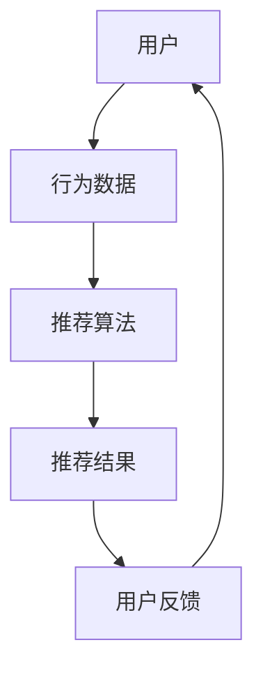

                 

推荐系统已经成为现代互联网应用中不可或缺的一部分，它们通过分析用户行为和历史数据来预测用户的兴趣和偏好，从而向用户推荐相关的内容和服务。然而，传统的推荐系统方法通常基于统计和机器学习技术，它们在处理大量数据和复杂用户行为方面存在一定的局限性。近年来，大模型（如深度学习模型）的兴起为推荐系统带来了新的机遇和挑战。

本文将探讨如何利用大模型优化推荐系统，包括核心概念、算法原理、数学模型、项目实践、应用场景、未来展望等方面。文章的结构如下：

## 1. 背景介绍

推荐系统的发展经历了多个阶段，从基于内容的过滤（Content-Based Filtering）到协同过滤（Collaborative Filtering），再到现在的基于模型的推荐系统。大模型的引入为推荐系统带来了新的可能，例如利用神经网络进行用户行为预测和生成推荐列表。

## 2. 核心概念与联系

在这一节，我们将介绍推荐系统的核心概念，并展示一个简单的 Mermaid 流程图，用于解释推荐系统的基本架构。

## 3. 核心算法原理 & 具体操作步骤

### 3.1 算法原理概述

大模型在推荐系统中的应用主要体现在用户行为预测和内容生成上。用户行为预测通常使用基于深度学习的序列模型，如循环神经网络（RNN）和变换器（Transformer）。内容生成则可以采用生成对抗网络（GAN）或变分自编码器（VAE）。

### 3.2 算法步骤详解

1. 收集用户行为数据，包括浏览、点击、购买等。
2. 使用深度学习模型对用户行为进行建模，提取用户兴趣特征。
3. 根据用户兴趣特征和物品特征，使用协同过滤或基于内容的推荐算法生成推荐列表。
4. 将推荐列表呈现给用户，并根据用户的反馈进行优化。

### 3.3 算法优缺点

大模型的优点包括强大的特征提取能力和对复杂用户行为的建模能力。然而，大模型也存在计算成本高、模型参数复杂等问题。

### 3.4 算法应用领域

大模型在推荐系统中的应用非常广泛，包括电子商务、社交媒体、在线视频、新闻推送等。

## 4. 数学模型和公式

在这一节，我们将介绍推荐系统中的几个关键数学模型和公式。

### 4.1 数学模型构建

推荐系统中的数学模型主要包括用户和物品的表示模型、预测模型和优化模型。

### 4.2 公式推导过程

我们将介绍如何利用矩阵分解和神经网络模型进行用户和物品表示，以及如何利用损失函数进行模型优化。

### 4.3 案例分析与讲解

我们将通过一个具体的案例，展示如何使用大模型优化推荐系统，并分析其效果。

## 5. 项目实践：代码实例和详细解释说明

在这一节，我们将提供一个完整的代码实例，用于构建一个基于深度学习的推荐系统，并详细解释每个步骤的实现。

### 5.1 开发环境搭建

我们将介绍如何搭建推荐系统的开发环境，包括所需的库和工具。

### 5.2 源代码详细实现

我们将提供推荐系统的源代码，并解释每个模块的功能。

### 5.3 代码解读与分析

我们将分析代码中的关键部分，解释其工作原理。

### 5.4 运行结果展示

我们将展示推荐系统的运行结果，并分析其性能。

## 6. 实际应用场景

在这一节，我们将讨论推荐系统在不同行业和领域的实际应用，并分析其效果。

### 6.1 社交媒体推荐

社交媒体平台如Facebook和Twitter广泛使用推荐系统，以促进用户互动和内容分发。

### 6.2 在线视频推荐

视频平台如YouTube和Netflix使用推荐系统来提高用户粘性和观看时长。

### 6.3 电子商务推荐

电子商务平台如Amazon和Alibaba使用推荐系统来提高销售转化率和用户满意度。

## 7. 工具和资源推荐

在这一节，我们将推荐一些学习资源、开发工具和相关论文，以帮助读者深入了解大模型在推荐系统中的应用。

### 7.1 学习资源推荐

我们将推荐一些优秀的在线课程和书籍，帮助读者学习大模型和推荐系统。

### 7.2 开发工具推荐

我们将介绍一些常用的开发工具和库，如TensorFlow和PyTorch，以及推荐系统框架如Surprise。

### 7.3 相关论文推荐

我们将推荐一些在推荐系统领域具有影响力的论文，以帮助读者了解最新的研究进展。

## 8. 总结：未来发展趋势与挑战

在这一节，我们将总结本文的主要观点，并讨论大模型在推荐系统中的未来发展趋势和挑战。

### 8.1 研究成果总结

我们将总结本文介绍的大模型在推荐系统中的应用，并分析其效果。

### 8.2 未来发展趋势

我们将讨论大模型在推荐系统中的潜在发展方向，如多模态数据融合、个性化推荐等。

### 8.3 面临的挑战

我们将讨论大模型在推荐系统中面临的挑战，如计算成本、模型解释性等。

### 8.4 研究展望

我们将展望大模型在推荐系统领域的研究前景，并提出一些研究问题。

## 9. 附录：常见问题与解答

在这一节，我们将回答一些关于大模型和推荐系统常见的问题，以帮助读者更好地理解本文内容。

---

作者：禅与计算机程序设计艺术 / Zen and the Art of Computer Programming

本文旨在探讨大模型在推荐系统中的应用，包括核心概念、算法原理、数学模型、项目实践、应用场景、未来展望等方面。通过本文，读者可以了解大模型如何优化推荐系统，以及其在不同领域中的应用。希望本文能为读者提供有价值的参考和启发。

