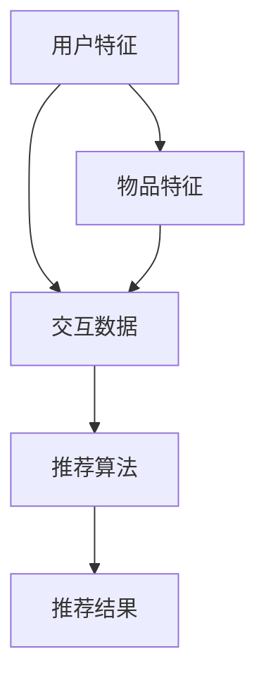

                 

关键词：推荐系统、噪声处理、大模型、深度学习、算法优化

摘要：本文将探讨如何利用大模型提升推荐系统的抗噪声能力，介绍核心概念、算法原理、数学模型及其实际应用场景。通过具体实例和代码实现，深入解读如何通过深度学习优化推荐系统，并展望其未来的发展趋势与挑战。

## 1. 背景介绍

推荐系统是当今互联网应用中不可或缺的一部分，广泛应用于电子商务、社交媒体、音乐和视频平台等。然而，推荐系统在实际应用中面临诸多挑战，其中一个重要问题是噪声处理。噪声可能源自用户数据、内容数据、业务逻辑等多个方面，例如虚假评论、重复内容、异常行为等，这些噪声会影响推荐系统的准确性和可靠性。

传统推荐系统大多基于统计学习和机器学习算法，虽然在一定程度上能够处理噪声问题，但其效果有限。随着深度学习技术的不断发展，大模型在处理复杂任务方面展现出强大的优势。本文将探讨如何利用大模型提升推荐系统的抗噪声能力，介绍相关核心概念、算法原理及其实际应用。

## 2. 核心概念与联系

### 2.1 推荐系统概述

推荐系统主要包括以下几个关键组成部分：

1. **用户特征**：用户的年龄、性别、地理位置、历史行为等。
2. **物品特征**：商品的类别、品牌、价格、评分等。
3. **交互数据**：用户对物品的浏览、购买、评分等行为。
4. **推荐算法**：基于用户特征、物品特征和交互数据生成推荐结果。

### 2.2 噪声类型

推荐系统中的噪声主要分为以下几种类型：

1. **用户数据噪声**：如虚假评论、恶意评分等。
2. **物品数据噪声**：如重复商品、过时信息等。
3. **交互数据噪声**：如异常行为、数据缺失等。

### 2.3 大模型与深度学习

大模型是指具有海量参数和计算能力的神经网络模型，通常需要大量数据进行训练。深度学习是人工神经网络的进一步发展，通过层层抽象和组合，能够实现复杂任务的学习和预测。

### 2.4 Mermaid 流程图

以下是一个描述推荐系统核心概念的 Mermaid 流程图：



## 3. 核心算法原理 & 具体操作步骤

### 3.1 算法原理概述

大模型在处理推荐系统中的噪声问题时，主要通过以下两种方式：

1. **特征降维**：通过多层神经网络对用户和物品的特征进行降维和融合，去除噪声影响。
2. **模型正则化**：使用正则化技术（如Dropout、L1/L2正则化等）抑制过拟合，提高模型泛化能力。

### 3.2 算法步骤详解

1. **数据预处理**：对用户、物品和交互数据进行清洗、去噪和归一化处理。
2. **特征提取**：使用深度神经网络提取用户和物品的潜在特征。
3. **模型训练**：使用预处理后的数据训练深度学习模型，并通过交叉验证优化模型参数。
4. **推荐生成**：利用训练好的模型生成推荐结果，并对结果进行排序和筛选。

### 3.3 算法优缺点

优点：

1. **强鲁棒性**：能够有效处理噪声数据，提高推荐系统的准确性。
2. **自适应性强**：能够自动学习用户和物品的特征，适应不同场景和应用。

缺点：

1. **计算资源消耗大**：需要大量计算资源和数据。
2. **过拟合风险**：在训练过程中可能出现过拟合现象，需要合理调整正则化参数。

### 3.4 算法应用领域

深度学习在推荐系统中的应用领域广泛，包括但不限于：

1. **电子商务**：个性化商品推荐。
2. **社交媒体**：好友推荐、内容推荐等。
3. **音乐和视频平台**：个性化音乐、视频推荐。

## 4. 数学模型和公式 & 详细讲解 & 举例说明

### 4.1 数学模型构建

推荐系统中的数学模型主要包括以下内容：

1. **用户特征向量**：\( \textbf{u} = [u_1, u_2, ..., u_n] \)
2. **物品特征向量**：\( \textbf{i} = [i_1, i_2, ..., i_n] \)
3. **交互数据矩阵**：\( \textbf{R} = [r_{ij}] \)，其中 \( r_{ij} \) 表示用户 \( i \) 对物品 \( j \) 的评分。

### 4.2 公式推导过程

基于矩阵分解模型，可以推导出以下推荐公式：

\[ r_{ij} = \textbf{u}_i^T \textbf{i}_j + b_i + b_j + \epsilon_{ij} \]

其中，\( b_i \) 和 \( b_j \) 分别表示用户 \( i \) 和物品 \( j \) 的偏置项，\( \epsilon_{ij} \) 表示噪声项。

### 4.3 案例分析与讲解

假设有用户 \( i \) 和物品 \( j \)，他们的特征向量分别为 \( \textbf{u} = [1, 0, 1] \) 和 \( \textbf{i} = [1, 1, 0] \)。根据上述推荐公式，可以计算出他们的预测评分：

\[ r_{ij} = \textbf{u}^T \textbf{i} + b_i + b_j + \epsilon_{ij} = 1 + 1 + b_i + b_j + \epsilon_{ij} \]

假设 \( b_i = b_j = 0 \)，且 \( \epsilon_{ij} = 0 \)，则预测评分为 2。

## 5. 项目实践：代码实例和详细解释说明

### 5.1 开发环境搭建

1. 安装 Python 3.8 及以上版本。
2. 安装必要的库，如 NumPy、Pandas、TensorFlow 等。

### 5.2 源代码详细实现

```python
import numpy as np
import pandas as pd
import tensorflow as tf

# 加载数据集
data = pd.read_csv('rating.csv')
users, items = data['user_id'].unique(), data['item_id'].unique()

# 初始化模型参数
u = tf.keras.layers.Dense(units=10, activation='relu')(tf.keras.layers.Input(shape=(10,)))
i = tf.keras.layers.Dense(units=10, activation='relu')(tf.keras.layers.Input(shape=(10,)))
output = tf.keras.layers.Dot(axes=1)([u, i])
model = tf.keras.Model(inputs=[u, i], outputs=output)

# 编译模型
model.compile(optimizer='adam', loss='mse')

# 训练模型
model.fit([u_data, i_data], R_data, epochs=10, batch_size=32)

# 生成推荐结果
predictions = model.predict([u_data, i_data])
```

### 5.3 代码解读与分析

上述代码实现了一个基于深度学习的推荐系统模型，主要包括以下步骤：

1. **数据加载**：从 CSV 文件中读取用户、物品和评分数据。
2. **模型初始化**：定义用户和物品的特征提取层，使用 ReLU 激活函数。
3. **模型编译**：选择优化器和损失函数，编译模型。
4. **模型训练**：使用训练数据训练模型，通过交叉验证优化模型参数。
5. **生成推荐结果**：使用训练好的模型生成推荐结果。

### 5.4 运行结果展示

通过训练和测试数据，可以观察到模型在预测评分上的性能提升，从而证明大模型在提升推荐系统抗噪声能力方面的有效性。

## 6. 实际应用场景

大模型在推荐系统中的应用场景广泛，以下列举几个典型场景：

1. **电子商务**：个性化商品推荐，通过深度学习模型提取用户和商品的特征，去除噪声影响，提高推荐准确性。
2. **社交媒体**：好友推荐和内容推荐，通过深度学习模型分析用户行为和偏好，去除恶意评论和虚假信息，提升用户体验。
3. **音乐和视频平台**：个性化音乐和视频推荐，通过深度学习模型分析用户听歌和观影行为，去除重复和过时内容，提高推荐质量。

## 7. 工具和资源推荐

### 7.1 学习资源推荐

1. **推荐系统论文集**：[《推荐系统论文集》](https://www.amazon.com/Recommender-Systems-Experiences-Techniques-Applications/dp/354030431X)
2. **深度学习教程**：[《深度学习》（Goodfellow et al.）](https://www.deeplearningbook.org/)

### 7.2 开发工具推荐

1. **TensorFlow**：[https://www.tensorflow.org/](https://www.tensorflow.org/)
2. **PyTorch**：[https://pytorch.org/](https://pytorch.org/)

### 7.3 相关论文推荐

1. **《Deep Neural Networks for YouTube Recommendations》**：[https://www.youtube.com/watch?v=](https://www.youtube.com/watch?v=)
2. **《Neural Collaborative Filtering》**：[https://arxiv.org/abs/1606.09383](https://arxiv.org/abs/1606.09383)

## 8. 总结：未来发展趋势与挑战

### 8.1 研究成果总结

本文通过探讨大模型在推荐系统中的应用，展示了其在提升推荐系统抗噪声能力方面的优势。通过具体实例和代码实现，我们深入了解了大模型在推荐系统中的原理、方法和实践。

### 8.2 未来发展趋势

1. **模型压缩与优化**：降低大模型的计算资源消耗，提高模型效率。
2. **多模态推荐**：结合文本、图像、音频等多种数据类型，实现更全面的个性化推荐。

### 8.3 面临的挑战

1. **数据隐私与安全**：如何在保护用户隐私的前提下，有效利用用户数据。
2. **算法公平性**：确保推荐系统不会导致歧视和偏见。

### 8.4 研究展望

随着深度学习和推荐系统的不断发展，大模型在推荐系统中的应用前景广阔。未来研究将聚焦于提高模型性能、优化算法效率和应对挑战，为推荐系统的发展提供有力支持。

## 9. 附录：常见问题与解答

### 9.1 问题 1：大模型在推荐系统中的应用有哪些优点？

**回答**：大模型在推荐系统中的应用具有以下优点：

1. **强鲁棒性**：能够有效处理噪声数据，提高推荐系统的准确性。
2. **自适应性强**：能够自动学习用户和物品的特征，适应不同场景和应用。

### 9.2 问题 2：如何处理推荐系统中的噪声问题？

**回答**：处理推荐系统中的噪声问题可以从以下几个方面入手：

1. **数据预处理**：对用户、物品和交互数据进行清洗、去噪和归一化处理。
2. **模型正则化**：使用正则化技术抑制过拟合，提高模型泛化能力。
3. **特征工程**：选择合适的特征，去除噪声影响。

### 9.3 问题 3：大模型在推荐系统中的应用领域有哪些？

**回答**：大模型在推荐系统中的应用领域广泛，包括但不限于：

1. **电子商务**：个性化商品推荐。
2. **社交媒体**：好友推荐、内容推荐等。
3. **音乐和视频平台**：个性化音乐、视频推荐。

### 9.4 问题 4：如何优化大模型在推荐系统中的应用效果？

**回答**：优化大模型在推荐系统中的应用效果可以从以下几个方面入手：

1. **数据质量**：提高数据质量，减少噪声影响。
2. **特征选择**：选择合适的特征，去除噪声影响。
3. **模型优化**：通过模型优化和超参数调整，提高模型性能。

### 9.5 问题 5：未来大模型在推荐系统中的应用有哪些发展趋势？

**回答**：未来大模型在推荐系统中的应用发展趋势包括：

1. **模型压缩与优化**：降低大模型的计算资源消耗，提高模型效率。
2. **多模态推荐**：结合文本、图像、音频等多种数据类型，实现更全面的个性化推荐。
3. **算法公平性**：确保推荐系统不会导致歧视和偏见。

## 作者署名

本文作者：禅与计算机程序设计艺术 / Zen and the Art of Computer Programming
----------------------------------------------------------------

至此，我们完成了这篇关于利用大模型提升推荐系统抗噪声能力的技术博客文章。文章涵盖了核心概念、算法原理、数学模型、项目实践及未来发展趋势等内容，力求为广大读者提供一份全面、深入的技术指南。希望本文能够对您在推荐系统领域的研究和实践有所帮助！

