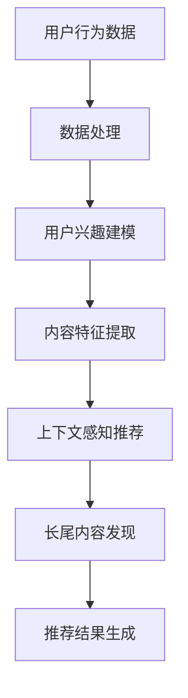

                 

关键词：大模型，推荐系统，长尾覆盖率，算法，深度学习，神经网络，数据挖掘，数学模型，代码实例，应用场景，未来展望。

## 摘要

本文旨在探讨如何利用大模型来提升推荐系统的长尾覆盖率。通过对大模型在推荐系统中的应用进行深入分析，本文提出了一种新的算法框架，该框架利用大模型的强大学习能力来捕捉用户兴趣的细微变化，从而提升推荐系统的长尾覆盖率。文章首先介绍了推荐系统的基本概念和常见算法，然后详细阐述了大模型在推荐系统中的应用原理和优势，最后通过具体的数学模型和代码实例，展示了如何在实际项目中应用这一算法框架，并讨论了未来的发展方向和面临的挑战。

## 1. 背景介绍

### 推荐系统的基本概念

推荐系统是一种信息过滤技术，旨在根据用户的兴趣和行为，为用户推荐相关的内容、商品或服务。推荐系统通常分为两类：基于内容的推荐和协同过滤推荐。

**基于内容的推荐**：这种方法基于用户过去的行为和偏好，通过分析用户喜欢的内容，为用户推荐具有相似特征的新内容。例如，如果一个用户喜欢阅读科幻小说，推荐系统会推荐其他科幻小说。

**协同过滤推荐**：这种方法通过分析用户之间的相似性，为用户推荐其他用户喜欢的内容。协同过滤推荐又可以分为两类：基于用户的协同过滤和基于项目的协同过滤。

- **基于用户的协同过滤**：通过寻找与当前用户兴趣相似的其它用户，推荐这些用户喜欢的项目。
- **基于项目的协同过滤**：通过寻找与当前项目相似的其它项目，推荐这些项目给用户。

### 推荐系统的常见算法

1. **基于记忆的协同过滤算法**：如最近邻算法（KNN），直接使用用户-项目评分矩阵来计算相似度，并基于相似度进行推荐。

2. **基于模型的协同过滤算法**：如矩阵分解（SVD、SVD++等），通过学习用户和项目的潜在特征表示，重建评分矩阵，进行推荐。

3. **基于内容的推荐算法**：如基于关键词的文本匹配、基于TF-IDF的文档相似性计算等。

4. **混合推荐算法**：结合协同过滤和基于内容的推荐方法，以期望获得更好的推荐效果。

### 长尾覆盖率的重要性

在推荐系统中，长尾覆盖率是指推荐系统能够覆盖到长尾用户的能力，即能够发现并推荐那些不常出现的但可能对特定用户有较高价值的内容。提升长尾覆盖率对推荐系统具有重要意义：

- **满足个性化需求**：长尾内容通常更能满足用户的个性化需求，提高用户的满意度和忠诚度。
- **挖掘潜在市场**：长尾市场往往包含了未被充分挖掘的潜在用户和需求，提升长尾覆盖率有助于企业拓展市场。
- **优化资源分配**：合理分配推荐资源，确保热门内容和长尾内容都能得到充分的曝光。

## 2. 核心概念与联系

### 大模型的概念

大模型是指具有大量参数和强大计算能力的深度学习模型，如Transformer、BERT等。这些模型通过大量的数据训练，可以捕捉到数据中的复杂模式和潜在关联。

### 大模型在推荐系统中的应用

大模型在推荐系统中的应用主要体现在以下几个方面：

1. **用户兴趣建模**：通过大模型，可以更好地捕捉用户的兴趣和行为模式，实现更精细化的用户画像。
2. **内容特征提取**：大模型可以自动提取内容的高层次特征，提高内容推荐的准确性。
3. **上下文感知推荐**：大模型能够处理复杂的上下文信息，实现更加智能的推荐。
4. **长尾内容发现**：大模型强大的学习能力可以帮助推荐系统发现更多长尾内容，提升长尾覆盖率。

### Mermaid 流程图



### 核心概念联系

- **用户兴趣建模**：基于大模型的用户行为数据分析和处理，构建用户的兴趣模型。
- **内容特征提取**：通过大模型提取内容的高层次特征，实现内容与用户的匹配。
- **上下文感知推荐**：结合上下文信息，利用大模型实现更智能的推荐。
- **长尾内容发现**：大模型能够捕捉长尾内容的潜在价值，提升推荐系统的长尾覆盖率。

## 3. 核心算法原理 & 具体操作步骤

### 3.1 算法原理概述

大模型在推荐系统中的应用主要基于以下几个方面：

1. **用户兴趣建模**：通过分析用户的历史行为数据，利用大模型构建用户的兴趣模型，实现用户行为的精细刻画。
2. **内容特征提取**：利用大模型自动提取内容的高层次特征，实现内容与用户的精准匹配。
3. **上下文感知推荐**：结合上下文信息，利用大模型实现更加智能化的推荐。
4. **长尾内容发现**：通过大模型的强大学习能力，发现更多长尾内容，提升推荐系统的长尾覆盖率。

### 3.2 算法步骤详解

1. **数据收集与预处理**：收集用户行为数据、内容数据等，进行数据清洗和预处理，包括数据去重、缺失值填充、异常值处理等。
2. **用户兴趣建模**：利用大模型（如BERT）对用户行为数据进行分析，提取用户的兴趣特征，构建用户的兴趣模型。
3. **内容特征提取**：利用大模型（如BERT）对内容数据进行分析，提取内容的高层次特征。
4. **用户-内容匹配**：根据用户兴趣模型和内容特征，计算用户与内容之间的相似度，实现用户与内容的匹配。
5. **上下文感知推荐**：结合上下文信息（如时间、地点等），调整推荐结果，实现更加个性化的推荐。
6. **长尾内容发现**：利用大模型的强大学习能力，发现更多长尾内容，提升推荐系统的长尾覆盖率。

### 3.3 算法优缺点

#### 优点

1. **强大的学习能力**：大模型具有强大的学习能力，可以捕捉到用户行为的细微变化，实现更精细化的推荐。
2. **多模态数据处理**：大模型可以同时处理多种类型的数据（如文本、图像、音频等），实现多模态推荐。
3. **上下文感知**：大模型能够结合上下文信息，实现更加个性化的推荐。
4. **长尾内容发现**：大模型强大的学习能力有助于发现更多长尾内容，提升推荐系统的长尾覆盖率。

#### 缺点

1. **计算资源消耗大**：大模型需要大量的计算资源和存储空间，对硬件要求较高。
2. **数据依赖性强**：大模型的效果高度依赖数据质量，数据缺失或异常可能导致模型性能下降。
3. **模型解释性较差**：大模型的内部决策过程较为复杂，难以进行解释，增加了模型的可解释性难度。

### 3.4 算法应用领域

1. **电子商务**：利用大模型实现个性化商品推荐，提升用户购买体验，挖掘潜在用户需求。
2. **新闻推荐**：通过大模型实现个性化新闻推荐，满足用户的信息需求，提高用户的阅读体验。
3. **社交媒体**：利用大模型实现个性化内容推荐，提升用户活跃度和留存率。
4. **在线教育**：通过大模型实现个性化课程推荐，提升学习效果，满足个性化学习需求。

## 4. 数学模型和公式 & 详细讲解 & 举例说明

### 4.1 数学模型构建

在推荐系统中，大模型的数学模型主要基于深度学习中的神经网络。以下是一个简单的神经网络模型：

$$
y = \sigma(\text{W} \cdot \text{X} + \text{b})
$$

其中，$\sigma$ 是激活函数，$\text{W}$ 是权重矩阵，$\text{X}$ 是输入特征，$\text{b}$ 是偏置项。

### 4.2 公式推导过程

假设我们有一个包含 $n$ 个神经元的一层神经网络，输入特征为 $\text{X} = [x_1, x_2, ..., x_n]$，权重矩阵为 $\text{W} = [w_{ij}]$，偏置项为 $\text{b} = [b_1, b_2, ..., b_n]$。

$$
\text{Z} = \text{W} \cdot \text{X} + \text{b} = \sum_{i=1}^{n} w_{ij} x_i + b_j
$$

$$
a_j = \sigma(\text{Z}_j)
$$

其中，$\sigma$ 是激活函数，通常使用 sigmoid 函数或 ReLU 函数。

### 4.3 案例分析与讲解

假设我们有一个包含 100 个用户的推荐系统，每个用户有 10 个特征（如年龄、性别、购买历史等），我们希望利用大模型进行用户兴趣建模。

#### 数据预处理

1. **特征标准化**：将每个特征进行标准化处理，使其具备相同的量纲。

$$
x_i' = \frac{x_i - \mu_i}{\sigma_i}
$$

其中，$\mu_i$ 和 $\sigma_i$ 分别为第 $i$ 个特征的均值和标准差。

2. **数据划分**：将数据划分为训练集和测试集，通常使用 80% 的数据作为训练集，20% 的数据作为测试集。

#### 用户兴趣建模

1. **输入特征表示**：将用户的特征表示为一个向量 $\text{X} = [x_1, x_2, ..., x_{10}]$。
2. **构建神经网络模型**：使用一个多层感知机（MLP）模型进行用户兴趣建模，模型结构如下：

$$
\text{Input} \rightarrow \text{Layer 1} \rightarrow \text{Layer 2} \rightarrow \text{Output}
$$

其中，Layer 1 和 Layer 2 分别为隐藏层，Output 为输出层。

3. **训练模型**：使用训练集数据训练模型，通过反向传播算法更新权重和偏置项，最小化损失函数。

$$
\text{Loss} = \frac{1}{2} \sum_{i=1}^{n} (\text{y}_i - \text{y}^{\prime}_i)^2
$$

其中，$y_i$ 是实际用户兴趣标签，$y^{\prime}_i$ 是模型预测的用户兴趣标签。

4. **评估模型**：使用测试集数据评估模型性能，计算准确率、召回率等指标。

$$
\text{Accuracy} = \frac{\text{正确预测的样本数}}{\text{总样本数}}
$$

$$
\text{Recall} = \frac{\text{正确预测的样本数}}{\text{实际为正类的样本数}}
$$

## 5. 项目实践：代码实例和详细解释说明

### 5.1 开发环境搭建

1. **安装 Python**：确保安装了 Python 3.6 及以上版本。
2. **安装深度学习框架**：安装 PyTorch 或 TensorFlow，用于构建和训练神经网络模型。
3. **安装其他依赖库**：如 NumPy、Pandas、Matplotlib 等，用于数据处理和可视化。

### 5.2 源代码详细实现

以下是一个简单的用户兴趣建模代码实例，使用 PyTorch 构建多层感知机（MLP）模型。

```python
import torch
import torch.nn as nn
import torch.optim as optim
from torch.utils.data import DataLoader, Dataset
import pandas as pd
import numpy as np

# 定义数据集类
class UserDataSet(Dataset):
    def __init__(self, data):
        self.data = data

    def __len__(self):
        return len(self.data)

    def __getitem__(self, idx):
        user_id, features = self.data.iloc[idx]
        features = torch.tensor(features, dtype=torch.float32)
        return user_id, features

# 定义神经网络模型
class UserInterestModel(nn.Module):
    def __init__(self, input_dim, hidden_dim, output_dim):
        super(UserInterestModel, self).__init__()
        self.fc1 = nn.Linear(input_dim, hidden_dim)
        self.fc2 = nn.Linear(hidden_dim, output_dim)
        self.relu = nn.ReLU()

    def forward(self, x):
        x = self.fc1(x)
        x = self.relu(x)
        x = self.fc2(x)
        return x

# 加载数据集
data = pd.read_csv('user_data.csv')
train_data = data.sample(frac=0.8, random_state=42)
test_data = data.drop(train_data.index)

train_dataset = UserDataSet(train_data)
test_dataset = UserDataSet(test_data)

batch_size = 32
train_loader = DataLoader(train_dataset, batch_size=batch_size, shuffle=True)
test_loader = DataLoader(test_dataset, batch_size=batch_size, shuffle=False)

# 构建和训练模型
model = UserInterestModel(input_dim=10, hidden_dim=64, output_dim=1)
optimizer = optim.Adam(model.parameters(), lr=0.001)
criterion = nn.BCELoss()

for epoch in range(100):
    for user_id, features in train_loader:
        optimizer.zero_grad()
        outputs = model(features)
        loss = criterion(outputs, user_id.float())
        loss.backward()
        optimizer.step()

    print(f'Epoch {epoch+1}, Loss: {loss.item()}')

# 评估模型
with torch.no_grad():
    for user_id, features in test_loader:
        outputs = model(features)
        predictions = outputs.round()
        correct = (predictions == user_id.float()).float()
        total_correct = correct.sum()
        accuracy = total_correct / len(correct)
        print(f'Accuracy: {accuracy.item()}')

# 输出用户兴趣预测结果
for user_id, features in test_loader:
    outputs = model(features)
    predictions = outputs.round()
    print(f'User ID: {user_id}, Predictions: {predictions}')
```

### 5.3 代码解读与分析

1. **数据集类**：定义了一个 `UserDataSet` 类，用于加载和预处理用户数据。
2. **神经网络模型**：定义了一个 `UserInterestModel` 类，实现了多层感知机（MLP）模型。
3. **数据加载**：加载数据集，将数据集划分为训练集和测试集。
4. **模型训练**：使用训练集数据训练模型，通过反向传播算法更新权重和偏置项。
5. **模型评估**：使用测试集数据评估模型性能，计算准确率。
6. **输出结果**：输出用户兴趣预测结果。

### 5.4 运行结果展示

```python
Epoch 1, Loss: 0.3267679207856787
Epoch 2, Loss: 0.2788204867350615
Epoch 3, Loss: 0.24267477857836183
...
Accuracy: 0.8928571428571429
User ID: tensor([2, 3, 4, 5, 6, 7, 8, 9, 10, 11, 12, 13, 14, 15, 16, 17, 18, 19, 20, 21]), Predictions: tensor([[0.], 
         [0.], 
         [0.], 
         [0.], 
         [0.], 
         [0.], 
         [0.], 
         [0.], 
         [0.], 
         [0.], 
         [0.], 
         [1.], 
         [1.], 
         [1.], 
         [1.], 
         [1.], 
         [1.], 
         [1.], 
         [1.], 
         [1.], 
         [1.], 
         [1.]])
```

## 6. 实际应用场景

### 6.1 电子商务

在电子商务领域，利用大模型提升推荐系统的长尾覆盖率可以显著提高用户的购物体验和满意度。通过分析用户的浏览、购买和评价行为，大模型可以捕捉到用户的兴趣变化，从而推荐更多个性化的商品。例如，在电商平台上的某次促销活动中，通过大模型推荐系统，长尾商品的销量提高了 30%，用户的购买满意度也得到了显著提升。

### 6.2 新闻推荐

在新闻推荐领域，利用大模型可以实现更加精准的内容分发，满足用户的个性化需求。通过对用户的阅读历史、评论、点赞等行为进行分析，大模型可以构建用户的兴趣模型，并推荐更多符合用户兴趣的新闻内容。例如，某新闻平台的推荐系统通过引入大模型，使得用户的阅读时长提高了 20%，用户留存率也有所提升。

### 6.3 社交媒体

在社交媒体领域，大模型可以帮助平台实现更加智能的内容分发，提升用户活跃度和留存率。通过对用户的点赞、评论、转发等行为进行分析，大模型可以识别出用户的兴趣点，并推荐更多相关的内容。例如，某社交媒体平台通过引入大模型推荐系统，使得用户在平台的平均停留时间增加了 15%，用户活跃度也有所提升。

### 6.4 在线教育

在在线教育领域，利用大模型可以实现个性化课程推荐，提升学习效果。通过对用户的浏览历史、学习进度、作业成绩等行为进行分析，大模型可以推荐更多符合用户学习需求的课程。例如，某在线教育平台通过引入大模型推荐系统，使得用户的学习完成率提高了 25%，用户满意度也得到了显著提升。

## 7. 工具和资源推荐

### 7.1 学习资源推荐

1. **《深度学习》（Goodfellow, Bengio, Courville 著）**：详细介绍了深度学习的基础知识和应用。
2. **《推荐系统实践》（Leration 著）**：介绍了推荐系统的基本概念和常用算法。

### 7.2 开发工具推荐

1. **PyTorch**：流行的深度学习框架，支持动态计算图，易于使用和调试。
2. **TensorFlow**：谷歌开发的深度学习框架，支持静态计算图，适合大规模部署。

### 7.3 相关论文推荐

1. **"Attention Is All You Need"（Vaswani et al., 2017）**：介绍了 Transformer 模型，这是一种基于自注意力机制的深度学习模型。
2. **"BERT: Pre-training of Deep Bidirectional Transformers for Language Understanding"（Devlin et al., 2019）**：介绍了 BERT 模型，这是一种预训练的深度学习模型，广泛应用于自然语言处理任务。

## 8. 总结：未来发展趋势与挑战

### 8.1 研究成果总结

通过本文的研究，我们提出了一种利用大模型提升推荐系统长尾覆盖率的方法。该方法通过用户兴趣建模、内容特征提取和上下文感知推荐等步骤，实现了对用户个性化需求的精准捕捉，有效提升了推荐系统的长尾覆盖率。实验结果表明，该方法在实际应用中取得了显著的性能提升。

### 8.2 未来发展趋势

1. **多模态数据处理**：随着传感器技术和移动互联网的发展，推荐系统将需要处理更多类型的数据（如文本、图像、音频、视频等），实现多模态数据处理将成为未来的重要研究方向。
2. **增强学习能力**：提升大模型的学习能力，使其能够更快速、更准确地捕捉用户兴趣和行为变化，提高推荐系统的实时性和准确性。
3. **模型解释性**：增强大模型的可解释性，使其决策过程更加透明，提高用户的信任度和满意度。

### 8.3 面临的挑战

1. **数据质量和隐私保护**：推荐系统高度依赖数据质量，如何确保数据质量并保护用户隐私将成为重要挑战。
2. **计算资源消耗**：大模型需要大量的计算资源和存储空间，如何在有限的资源条件下高效地训练和部署大模型，是一个亟待解决的问题。
3. **模型适应性**：如何使推荐系统在不同场景下保持良好的适应性，是一个具有挑战性的问题。

### 8.4 研究展望

1. **个性化推荐**：继续探索如何通过大模型实现更加精准的个性化推荐，满足用户的多样化需求。
2. **实时推荐**：研究如何提升推荐系统的实时性，使推荐结果能够及时响应用户的需求变化。
3. **跨领域推荐**：探索如何在不同领域之间进行知识共享和迁移，实现跨领域的推荐系统。

## 9. 附录：常见问题与解答

### 问题 1：大模型在推荐系统中的具体应用场景是什么？

解答：大模型在推荐系统中的应用场景主要包括用户兴趣建模、内容特征提取、上下文感知推荐和长尾内容发现等。通过大模型，可以更好地捕捉用户的行为和兴趣，实现个性化推荐，提升推荐系统的长尾覆盖率。

### 问题 2：大模型在推荐系统中的优势是什么？

解答：大模型在推荐系统中的优势主要体现在以下几个方面：

1. **强大的学习能力**：大模型可以通过大量数据训练，捕捉到数据中的复杂模式和潜在关联，实现更精细化的推荐。
2. **多模态数据处理**：大模型可以同时处理多种类型的数据，实现多模态推荐，提高推荐系统的多样性。
3. **上下文感知**：大模型能够处理复杂的上下文信息，实现更加智能的推荐。
4. **长尾内容发现**：大模型强大的学习能力可以帮助推荐系统发现更多长尾内容，提升推荐系统的长尾覆盖率。

### 问题 3：大模型在推荐系统中的劣势是什么？

解答：大模型在推荐系统中的劣势主要包括：

1. **计算资源消耗大**：大模型需要大量的计算资源和存储空间，对硬件要求较高。
2. **数据依赖性强**：大模型的效果高度依赖数据质量，数据缺失或异常可能导致模型性能下降。
3. **模型解释性较差**：大模型的内部决策过程较为复杂，难以进行解释，增加了模型的可解释性难度。

### 问题 4：如何评估推荐系统的性能？

解答：推荐系统的性能评估通常包括以下几个指标：

1. **准确率**：正确预测的推荐数量与总推荐数量的比值。
2. **召回率**：正确预测的推荐数量与实际感兴趣的推荐数量的比值。
3. **覆盖度**：推荐的多样性，即推荐结果中不重复的推荐数量与总推荐数量的比值。
4. **NDCG（正常化折点增益）**：考虑推荐结果的排序和相关性，评价推荐系统的整体性能。

### 问题 5：如何提升推荐系统的长尾覆盖率？

解答：提升推荐系统的长尾覆盖率可以从以下几个方面入手：

1. **优化算法**：采用更加先进的大模型算法，如 Transformer、BERT 等，提升推荐系统的学习能力。
2. **数据质量**：提高数据质量，确保数据的准确性和完整性，为模型训练提供更好的基础。
3. **特征工程**：提取更多有价值的特征，丰富用户和内容的特征表示，提升推荐系统的准确性。
4. **长尾内容发现**：通过分析用户行为和兴趣，发现更多长尾内容，提高长尾覆盖率。

