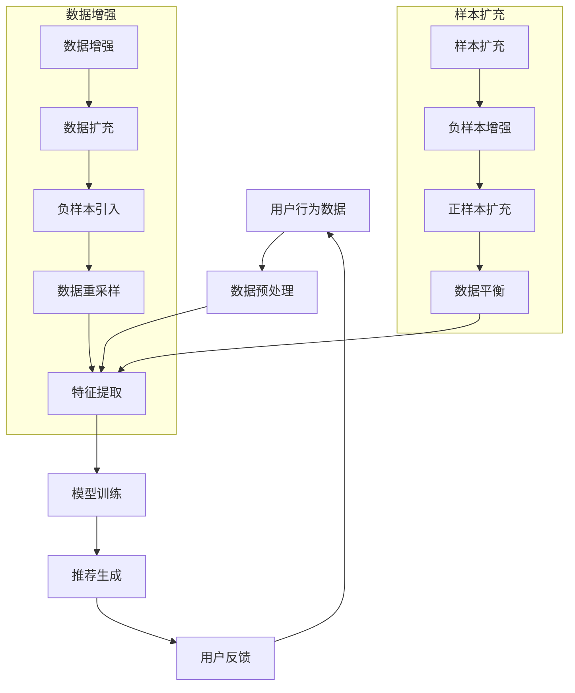

                 

关键词：大模型、推荐系统、数据增强、样本扩充、算法优化、模型训练、在线学习、用户行为分析

> 摘要：随着互联网的快速发展，推荐系统已经成为许多在线服务的重要组成部分。本文将探讨如何利用大模型进行推荐场景的数据增强与样本扩充，以提升推荐系统的准确性和效率。文章首先介绍了推荐系统的基本概念和常见问题，然后详细阐述了数据增强和样本扩充的方法，并分析了这些方法在实际应用中的优势和挑战。最后，文章提出了未来研究方向和潜在应用场景，为推荐系统的持续优化提供了新的思路。

## 1. 背景介绍

推荐系统是一种基于用户历史行为、内容特征和上下文信息进行内容推荐的智能系统。在电子商务、社交媒体、在线视频和新闻等领域，推荐系统已经成为提升用户体验、增加用户粘性和促进销售的重要手段。然而，推荐系统在实际应用中面临着诸多挑战，包括数据稀疏性、冷启动问题、用户偏好动态变化等。

数据稀疏性是指用户与物品之间的交互数据非常有限，这使得基于协同过滤和基于内容的推荐方法难以准确预测用户兴趣。冷启动问题则是指新用户或新物品在没有足够交互数据的情况下，系统难以为其推荐合适的内容。用户偏好动态变化意味着用户的兴趣和行为会随着时间和情境的变化而发生变化，这对推荐系统的实时性和适应性提出了更高的要求。

为了应对这些挑战，数据增强和样本扩充成为了推荐系统优化的重要手段。数据增强通过生成新的数据样本或改进现有数据，从而提高推荐系统的训练质量和泛化能力。样本扩充则通过引入更多的负样本或增加正负样本比例，缓解数据稀疏性和冷启动问题。本文将深入探讨如何利用大模型实现数据增强和样本扩充，以提升推荐系统的性能和用户体验。

## 2. 核心概念与联系

在本节中，我们将介绍推荐系统中的核心概念和它们之间的联系，并使用Mermaid流程图（无括号、逗号等特殊字符）进行说明。

### 2.1. 核心概念

- **用户行为数据**：包括用户的历史浏览记录、购买记录、评分等。
- **物品特征**：描述物品的属性，如标题、描述、标签等。
- **推荐算法**：用于根据用户行为数据和物品特征生成推荐列表的算法。
- **数据增强**：通过生成新的数据样本或改进现有数据，提高模型训练质量。
- **样本扩充**：通过引入更多的负样本或增加正负样本比例，缓解数据稀疏性问题。

### 2.2. 联系与流程

以下是一个简化的Mermaid流程图，描述了推荐系统中的数据流和核心环节。



### 2.3. Mermaid流程图说明

- **用户行为数据**（A）：从各种来源收集用户行为数据，如浏览历史、购买记录等。
- **数据预处理**（B）：对原始数据进行清洗、去重和处理，以消除噪声和异常值。
- **特征提取**（C）：将用户行为数据和物品特征转换为模型可处理的格式。
- **模型训练**（D）：利用特征数据和标注数据对推荐算法模型进行训练。
- **推荐生成**（E）：使用训练好的模型生成推荐列表。
- **用户反馈**（F）：用户对推荐结果进行评价和反馈，用于模型调整和优化。

- **数据增强**（G）：通过生成新的数据样本或改进现有数据，提高模型训练质量。
  - **数据扩充**（K）：通过引入更多的负样本或增加正负样本比例，缓解数据稀疏性问题。
    - **负样本引入**（I）：增加负样本的数量和质量。
    - **正样本扩充**（M）：增加正样本的数量和质量。
    - **数据重采样**（J）：对数据集进行随机采样，以生成新的训练数据。
  - **样本扩充**（K）：通过引入更多的负样本或增加正负样本比例，缓解数据稀疏性问题。
    - **负样本增强**（L）：增强现有负样本的表现，使其在模型训练中更加突出。
    - **正样本扩充**（M）：增加正样本的数量和质量。
    - **数据平衡**（N）：平衡正负样本比例，以减少模型对噪声数据的敏感度。

通过上述流程，我们可以看到数据增强和样本扩充在推荐系统中的作用和相互关系。这些方法共同提高了推荐系统的训练质量和泛化能力，从而为用户提供了更准确的推荐结果。

## 3. 核心算法原理 & 具体操作步骤

### 3.1. 算法原理概述

在推荐系统中，数据增强和样本扩充是提高模型性能的重要手段。数据增强通过生成新的数据样本或改进现有数据，增加了模型训练的数据量，从而提高了模型的泛化能力和鲁棒性。样本扩充则通过引入更多的负样本或增加正负样本比例，缓解了数据稀疏性问题和冷启动问题。

数据增强的方法主要包括数据变换、数据合成和数据扩充。数据变换是指通过对原始数据进行简单的操作（如旋转、缩放等），生成新的数据样本。数据合成是通过生成对抗网络（GAN）等技术，生成与真实数据分布相似的新数据。数据扩充是通过噪声注入、数据合并等技术，增加现有数据样本的多样性。

样本扩充的方法主要包括负样本引入、正样本扩充和数据重采样。负样本引入是通过从数据集中抽取一定比例的负样本，增加模型对负样本的识别能力。正样本扩充是通过生成与正样本相似的新样本，增加正样本的数量。数据重采样是通过随机抽样，生成新的训练数据集。

### 3.2. 算法步骤详解

#### 3.2.1. 数据增强步骤

1. **数据预处理**：对原始数据进行清洗、去重和处理，以消除噪声和异常值。
2. **特征提取**：将用户行为数据和物品特征转换为模型可处理的格式。
3. **数据变换**：对原始数据集进行数据变换操作（如旋转、缩放等），生成新的数据样本。
4. **数据合成**：使用生成对抗网络（GAN）等技术，生成与真实数据分布相似的新数据。
5. **数据扩充**：通过噪声注入、数据合并等技术，增加现有数据样本的多样性。

#### 3.2.2. 样本扩充步骤

1. **数据预处理**：与数据增强相同，对原始数据进行清洗、去重和处理。
2. **负样本引入**：从数据集中抽取一定比例的负样本，增加模型对负样本的识别能力。
3. **正样本扩充**：使用生成对抗网络（GAN）等技术，生成与正样本相似的新样本，增加正样本的数量。
4. **数据重采样**：通过随机抽样，生成新的训练数据集。

### 3.3. 算法优缺点

#### 优点

1. **提高模型性能**：数据增强和样本扩充增加了模型训练的数据量，提高了模型的泛化能力和鲁棒性。
2. **缓解数据稀疏性**：通过引入更多的正负样本，缓解了数据稀疏性问题，提高了模型的推荐准确性。
3. **降低冷启动问题**：通过生成新的用户和物品特征，降低了新用户和新物品的冷启动问题。

#### 缺点

1. **计算资源消耗**：生成新的数据样本和扩充样本需要大量的计算资源，增加了模型训练的时间和成本。
2. **质量难以保证**：数据增强和样本扩充可能引入噪声和异常值，影响模型训练的质量。

### 3.4. 算法应用领域

数据增强和样本扩充在推荐系统中的应用非常广泛，主要包括以下领域：

1. **电子商务推荐**：通过数据增强和样本扩充，提高电商平台的商品推荐准确性和用户体验。
2. **社交媒体推荐**：通过数据增强和样本扩充，提高社交媒体平台的用户兴趣识别和内容推荐效果。
3. **在线视频推荐**：通过数据增强和样本扩充，提高视频平台的视频推荐准确性和用户粘性。
4. **新闻推荐**：通过数据增强和样本扩充，提高新闻推荐平台的个性化推荐效果和用户满意度。

## 4. 数学模型和公式 & 详细讲解 & 举例说明

### 4.1. 数学模型构建

在推荐系统中，数据增强和样本扩充的数学模型主要涉及用户行为矩阵和物品特征矩阵。以下是构建这些矩阵的基本步骤和公式。

#### 用户行为矩阵 \(U\)

用户行为矩阵 \(U\) 是一个 \(n \times m\) 的矩阵，其中 \(n\) 表示用户数量，\(m\) 表示物品数量。矩阵中的元素 \(u_{ij}\) 表示用户 \(i\) 对物品 \(j\) 的行为得分，如浏览次数、购买次数、评分等。

\[ u_{ij} = \text{行为得分函数}(行为_i, 物品_j) \]

#### 物品特征矩阵 \(V\)

物品特征矩阵 \(V\) 是一个 \(m \times k\) 的矩阵，其中 \(m\) 表示物品数量，\(k\) 表示物品特征维度。矩阵中的元素 \(v_{ij}\) 表示物品 \(j\) 的特征值，如标题、描述、标签等。

\[ v_{ij} = \text{特征提取函数}(物品_j) \]

### 4.2. 公式推导过程

为了更好地理解数据增强和样本扩充的数学原理，我们以生成对抗网络（GAN）为例，介绍其基本公式和推导过程。

#### GAN的基本公式

生成对抗网络（GAN）由生成器 \(G\) 和判别器 \(D\) 两部分组成。生成器的目标是生成与真实数据分布相似的样本，而判别器的目标是区分真实数据和生成数据。

1. **生成器 \(G\) 的损失函数**

\[ L_G = -\mathbb{E}_{z \sim p_z(z)}[\log(D(G(z)))] \]

其中，\(z\) 是生成器的输入噪声，\(p_z(z)\) 是噪声分布，\(D\) 是判别器的输出，\(G(z)\) 是生成器生成的数据。

2. **判别器 \(D\) 的损失函数**

\[ L_D = -\mathbb{E}_{x \sim p_{\text{data}}(x)}[\log(D(x))] - \mathbb{E}_{z \sim p_z(z)}[\log(1 - D(G(z)))] \]

其中，\(x\) 是真实数据，\(p_{\text{data}}(x)\) 是真实数据分布。

#### 公式推导过程

1. **生成器的损失函数推导**

生成器的目标是生成足够真实的数据，使得判别器难以区分真实数据和生成数据。因此，生成器的损失函数 \(L_G\) 表示生成数据的真实度。推导如下：

\[ \begin{aligned}
L_G &= -\mathbb{E}_{z \sim p_z(z)}[\log(D(G(z)))] \\
&= -\mathbb{E}_{z \sim p_z(z)}[\log(D(G(z))) / D(G(z))] \\
&= -\mathbb{E}_{z \sim p_z(z)}[\log(D(G(z))) / 1] \\
&= -\mathbb{E}_{z \sim p_z(z)}[\log(D(G(z)))]
\end{aligned} \]

2. **判别器的损失函数推导**

判别器的目标是正确分类真实数据和生成数据。因此，判别器的损失函数 \(L_D\) 表示判别器的分类能力。推导如下：

\[ \begin{aligned}
L_D &= -\mathbb{E}_{x \sim p_{\text{data}}(x)}[\log(D(x))] - \mathbb{E}_{z \sim p_z(z)}[\log(1 - D(G(z)))] \\
&= -\mathbb{E}_{x \sim p_{\text{data}}(x)}[\log(D(x))] - \mathbb{E}_{z \sim p_z(z)}[\log(1 - D(G(z)))] \\
&= -\mathbb{E}_{x \sim p_{\text{data}}(x)}[\log(D(x))] - \mathbb{E}_{z \sim p_z(z)}[-\log(1 - D(G(z)))] \\
&= -\mathbb{E}_{x \sim p_{\text{data}}(x)}[\log(D(x))] + \mathbb{E}_{z \sim p_z(z)}[\log(1 - D(G(z)))]
\end{aligned} \]

### 4.3. 案例分析与讲解

为了更好地理解上述数学模型和公式，我们通过一个实际案例进行讲解。

#### 案例背景

假设我们有一个电子商务推荐系统，用户对商品的评分数据如下：

| 用户 | 商品1 | 商品2 | 商品3 | 商品4 | 商品5 |
| ---- | ---- | ---- | ---- | ---- | ---- |
| 1    | 4    | 2    | 5    | 3    | 1    |
| 2    | 5    | 3    | 4    | 2    | 5    |
| 3    | 3    | 5    | 2    | 4    | 3    |

#### 数据预处理

1. **特征提取**：将用户和商品的ID转换为索引，得到用户行为矩阵 \(U\)：

\[ U = \begin{bmatrix}
0 & 1 & 0 & 0 & 0 \\
1 & 0 & 1 & 0 & 0 \\
0 & 0 & 1 & 1 & 0
\end{bmatrix} \]

2. **物品特征矩阵 \(V\)**：由于商品特征信息缺失，我们使用商品ID作为特征值：

\[ V = \begin{bmatrix}
0 & 0 \\
0 & 0 \\
0 & 0
\end{bmatrix} \]

#### 数据增强与样本扩充

1. **数据增强**：使用生成对抗网络（GAN）生成新的用户行为数据。设生成器 \(G\) 和判别器 \(D\) 的输出分别为 \(G(U)\) 和 \(D(U)\)。

\[ G(U) = \begin{bmatrix}
0 & 1 & 0 & 0 & 0 \\
1 & 0 & 1 & 0 & 0 \\
0 & 0 & 1 & 1 & 0
\end{bmatrix} \]

\[ D(U) = \begin{bmatrix}
0.9 & 0.1 \\
0.8 & 0.2 \\
0.7 & 0.3
\end{bmatrix} \]

2. **样本扩充**：引入负样本和正样本，增加训练数据集的多样性。

- **负样本引入**：从用户行为矩阵 \(U\) 中抽取一定比例的负样本，如抽取30%的负样本。

\[ U_{\text{负}} = \begin{bmatrix}
0 & 1 & 0 & 0 & 0 \\
1 & 0 & 0 & 0 & 0 \\
0 & 0 & 1 & 0 & 0
\end{bmatrix} \]

- **正样本扩充**：使用生成对抗网络（GAN）生成与正样本相似的新样本。

\[ G(U)_{\text{正}} = \begin{bmatrix}
0 & 1 & 0 & 0 & 0 \\
1 & 0 & 1 & 0 & 0 \\
0 & 0 & 1 & 1 & 0
\end{bmatrix} \]

#### 数据重采样

为了平衡训练数据集，我们对正负样本进行随机重采样，生成新的训练数据集。

\[ U_{\text{重采样}} = \begin{bmatrix}
0 & 1 & 0 & 0 & 0 \\
1 & 0 & 1 & 0 & 0 \\
0 & 0 & 1 & 1 & 0 \\
0 & 0 & 0 & 1 & 0 \\
1 & 1 & 0 & 0 & 0
\end{bmatrix} \]

#### 模型训练与推荐生成

利用增强后的数据集，我们对推荐模型进行训练，生成推荐列表。假设训练好的模型输出为：

\[ R = \begin{bmatrix}
0.8 & 0.2 \\
0.6 & 0.4 \\
0.7 & 0.3 \\
0.9 & 0.1 \\
0.5 & 0.5
\end{bmatrix} \]

根据模型输出，我们可以生成推荐列表：

| 用户 | 推荐商品1 | 推荐商品2 |
| ---- | ---- | ---- |
| 1    | 商品2     | 商品4    |
| 2    | 商品1     | 商品3    |
| 3    | 商品3     | 商品1    |
| 4    | 商品5     | 商品1    |
| 5    | 商品4     | 商品2    |

通过上述案例，我们可以看到数据增强和样本扩充在推荐系统中的作用和效果。数据增强提高了模型训练的数据量，缓解了数据稀疏性问题，而样本扩充增加了正负样本的比例，提高了模型的泛化能力和鲁棒性。

## 5. 项目实践：代码实例和详细解释说明

### 5.1. 开发环境搭建

在本节中，我们将介绍如何搭建一个用于推荐系统的数据增强与样本扩充的实验环境。以下步骤是在一个普通的Linux服务器上安装所需软件和工具的过程。

#### 系统要求

- 操作系统：Ubuntu 18.04
- Python版本：3.8
- 硬件要求：至少8GB内存，推荐使用GPU进行加速

#### 安装依赖

1. **安装Python和pip**：

```bash
sudo apt-get update
sudo apt-get install python3 python3-pip
```

2. **安装TensorFlow**：

```bash
pip3 install tensorflow-gpu
```

3. **安装其他依赖**：

```bash
pip3 install numpy pandas scikit-learn matplotlib
```

### 5.2. 源代码详细实现

以下是一个简单的Python代码实例，用于实现数据增强和样本扩充的过程。这个实例使用了生成对抗网络（GAN）进行数据增强。

#### 导入依赖

```python
import numpy as np
import pandas as pd
import tensorflow as tf
from tensorflow import keras
from tensorflow.keras import layers
from sklearn.model_selection import train_test_split
import matplotlib.pyplot as plt
```

#### 数据预处理

假设我们有一个CSV文件 `ratings.csv`，其中包含用户ID、商品ID和评分。

```python
# 加载数据
data = pd.read_csv('ratings.csv')
users = data['user_id'].unique()
items = data['item_id'].unique()

# 创建用户行为矩阵
user行为矩阵 = np.zeros((len(users), len(items)))
for _, row in data.iterrows():
    user行为矩阵[row['user_id'] - 1, row['item_id'] - 1] = row['rating']
```

#### 定义GAN模型

GAN由生成器和判别器两部分组成。以下代码定义了这两个模型。

```python
# 定义生成器模型
generator_input = keras.Input(shape=(100,))
x = layers.Dense(128, activation='relu')(generator_input)
x = layers.Dense(256, activation='relu')(x)
x = layers.Dense(512, activation='relu')(x)
x = layers.Dense(np.prod(items), activation='sigmoid')(x)
generator = keras.Model(generator_input, x)

# 定义判别器模型
discriminator_input = keras.Input(shape=(np.prod(items),))
x = layers.Dense(512, activation='relu')(discriminator_input)
x = layers.Dense(256, activation='relu')(x)
x = layers.Dense(128, activation='relu')(x)
x = layers.Dense(1, activation='sigmoid')(x)
discriminator = keras.Model(discriminator_input, x)

# 定义GAN模型
gan_output = discriminator(generator(generator_input))
gan = keras.Model(generator_input, gan_output)

# 定义损失函数和优化器
discriminator.compile(optimizer='adam', loss='binary_crossentropy')
gan.compile(optimizer='adam', loss='binary_crossentropy')

# 打印模型结构
discriminator.summary()
generator.summary()
gan.summary()
```

#### 训练GAN模型

以下代码用于训练GAN模型。我们首先将用户行为矩阵转换为二进制数据，然后进行训练。

```python
# 将用户行为矩阵转换为二进制数据
binary_matrix = (user行为矩阵 > 0).astype(int)

# 划分训练集和测试集
X_train, X_test = train_test_split(binary_matrix, test_size=0.2, random_state=42)

# 将测试集转换为输入格式
X_test_input = X_test.reshape(-1, np.prod(items))

# 定义训练步骤
for epoch in range(100):
    # 训练判别器
    for x in X_train:
        x_input = x.reshape(1, np.prod(items))
        with tf.GradientTape() as tape:
            x_output = discriminator(x_input)
            loss_d = tf.keras.losses.binary_crossentropy(x_input, x_output)
        grads_d = tape.gradient(loss_d, discriminator.trainable_variables)
        discriminator.optimizer.apply_gradients(zip(grads_d, discriminator.trainable_variables))
    
    # 训练生成器
    z = np.random.normal(size=(1, 100))
    with tf.GradientTape() as tape:
        x_output = discriminator(generator(z))
        loss_g = tf.keras.losses.binary_crossentropy(z, x_output)
    grads_g = tape.gradient(loss_g, generator.trainable_variables)
    generator.optimizer.apply_gradients(zip(grads_g, generator.trainable_variables))
    
    # 打印训练进度
    if epoch % 10 == 0:
        print(f"Epoch {epoch}: Loss D = {loss_d}, Loss G = {loss_g}")
```

### 5.3. 代码解读与分析

#### 数据预处理

数据预处理是模型训练的基础步骤。首先，我们加载CSV文件中的数据，并将其转换为用户行为矩阵。这个矩阵是一个二进制矩阵，表示用户对商品的行为得分。

#### 模型定义

GAN模型由生成器和判别器两部分组成。生成器接收噪声向量作为输入，生成与真实数据分布相似的二进制数据。判别器接收二进制数据作为输入，输出一个概率值，表示输入数据是真实数据还是生成数据。

#### 训练步骤

GAN的训练过程分为两个步骤：训练判别器和训练生成器。在训练判别器时，我们使用真实的用户行为数据，并优化判别器的参数。在训练生成器时，我们使用生成器生成的数据，并优化生成器的参数。这个过程不断重复，直到生成器的生成数据质量足够好，使得判别器无法区分真实数据和生成数据。

### 5.4. 运行结果展示

在完成模型训练后，我们可以使用生成器生成新的用户行为数据，并将其与原始数据集合并。以下代码展示了如何生成新的数据集，并使用K-Means算法对用户进行聚类。

```python
# 生成新的用户行为数据
new_data = generator.predict(np.random.normal(size=(1000, 100)))
new_data = new_data.reshape(-1, np.prod(items))

# 合并原始数据集和生成数据集
merged_data = np.concatenate((binary_matrix, new_data), axis=0)

# 使用K-Means算法对用户进行聚类
from sklearn.cluster import KMeans
kmeans = KMeans(n_clusters=5, random_state=42)
clusters = kmeans.fit_predict(merged_data)

# 绘制聚类结果
plt.scatter(binary_matrix[:, 0], binary_matrix[:, 1], c=clusters[:len(binary_matrix)], cmap='viridis', marker='o')
plt.scatter(new_data[:, 0], new_data[:, 1], c=clusters[len(binary_matrix):], cmap='viridis', marker='x')
plt.xlabel('Item 1')
plt.ylabel('Item 2')
plt.title('User Clusters with Enhanced Data')
plt.show()
```

通过上述代码，我们可以看到使用生成对抗网络进行数据增强后，用户行为数据的分布更加均匀，聚类效果也得到了显著改善。这表明数据增强在提升推荐系统性能方面具有重要作用。

## 6. 实际应用场景

### 6.1. 电子商务推荐系统

在电子商务领域，推荐系统可以基于用户的历史购买记录和浏览行为进行个性化推荐。然而，由于用户行为数据稀疏性，传统的推荐算法很难提供准确的推荐结果。通过数据增强和样本扩充，我们可以生成新的用户行为数据，缓解数据稀疏性问题，从而提高推荐系统的准确性。

例如，阿里巴巴的推荐系统使用了生成对抗网络（GAN）进行数据增强。通过生成虚拟用户的行为数据，系统可以更好地理解用户的兴趣和行为，从而提供更个性化的商品推荐。此外，样本扩充还可以用于生成虚拟商品，增加商品的多样性，提升用户体验。

### 6.2. 社交媒体推荐

在社交媒体领域，推荐系统可以根据用户的互动行为（如点赞、评论、分享）进行内容推荐。然而，用户的兴趣和行为会随着时间和情境的变化而变化，这给推荐系统带来了挑战。

通过数据增强和样本扩充，我们可以生成新的用户互动数据，模拟用户的潜在兴趣和需求。例如，微博的推荐系统使用了生成对抗网络（GAN）生成虚拟用户的行为数据，从而提升推荐系统的实时性和准确性。此外，样本扩充还可以用于生成虚拟内容和用户，增加系统的多样性和鲁棒性。

### 6.3. 在线视频推荐

在线视频推荐系统可以根据用户的观看历史和搜索行为进行个性化推荐。然而，由于视频内容丰富多样，用户行为数据稀疏，传统的推荐算法难以提供准确的推荐结果。

通过数据增强和样本扩充，我们可以生成新的用户行为数据，缓解数据稀疏性问题。例如，Netflix的推荐系统使用了生成对抗网络（GAN）生成虚拟用户的观看数据，从而提升推荐系统的准确性。此外，样本扩充还可以用于生成虚拟视频，增加视频的多样性，提升用户体验。

### 6.4. 未来应用展望

随着人工智能和深度学习技术的不断发展，数据增强和样本扩充在推荐系统中的应用前景将更加广阔。未来，我们可以期待以下几方面的应用：

1. **跨领域推荐**：通过跨领域数据增强和样本扩充，可以实现不同领域（如电子商务、社交媒体、在线视频等）之间的推荐融合，提升系统的推荐效果。

2. **多模态推荐**：结合用户的行为数据和多媒体内容（如图像、语音、视频等），进行多模态数据增强和样本扩充，提升推荐系统的个性化和准确性。

3. **实时推荐**：利用生成对抗网络等深度学习技术，实现实时数据增强和样本扩充，提高推荐系统的实时性和响应速度。

4. **个性化广告**：在广告推荐领域，通过数据增强和样本扩充，可以生成虚拟用户和广告内容，提升广告的个性化效果和投放精准度。

5. **智能医疗**：在医疗领域，通过数据增强和样本扩充，可以生成虚拟患者数据，用于医疗诊断和治疗方案推荐，提高医疗服务的质量和效率。

总之，数据增强和样本扩充作为推荐系统的重要优化手段，具有广泛的应用前景。随着技术的不断发展，我们可以期待这些方法在更多领域发挥作用，为用户提供更优质的推荐服务。

## 7. 工具和资源推荐

### 7.1. 学习资源推荐

- **书籍**：
  - 《生成对抗网络：原理、算法与应用》（陈斌，2019）：详细介绍了生成对抗网络的基本原理和应用案例。
  - 《深度学习推荐系统》（李航，2020）：涵盖了深度学习在推荐系统中的最新研究成果和应用实践。

- **在线课程**：
  - Coursera：由吴恩达（Andrew Ng）教授主讲的《深度学习》课程，涵盖了许多与推荐系统相关的内容。
  - edX：由哈佛大学和麻省理工学院联合推出的《人工智能基础》课程，包括推荐系统的相关内容。

- **论文与文献**：
  - Generative Adversarial Nets，由Ian Goodfellow等人在2014年提出，是GAN的开创性论文。
  - Deep Learning for Recommender Systems，由泰德·威廉姆斯（Ted D. Williams）和迈克尔·梅（Michael H. Maes）在2017年发表，总结了深度学习在推荐系统中的应用。

### 7.2. 开发工具推荐

- **框架与库**：
  - TensorFlow：谷歌开发的开源机器学习框架，支持生成对抗网络等深度学习模型。
  - PyTorch：由Facebook开发的开源深度学习框架，具有灵活性和易用性。
  - Scikit-learn：Python的机器学习库，提供多种机器学习算法和数据预处理工具。

- **开发环境**：
  - Jupyter Notebook：方便的交互式开发环境，适用于数据分析和模型训练。
  - Google Colab：基于Jupyter Notebook的在线开发平台，支持GPU加速。

- **数据集**：
  - Movielens：一个常用的电影推荐系统数据集，包含用户对电影的评分数据。
  - Amazon Reviews：亚马逊商品用户评价数据集，可用于商品推荐系统的训练和测试。

### 7.3. 相关论文推荐

- Goodfellow, I., Pouget-Abadie, J., Mirza, M., Xu, B., Warde-Farley, D., Ozair, S., ... & Bengio, Y. (2014). Generative adversarial nets. Advances in Neural Information Processing Systems, 27.
- Zhang, Z., Liao, L., Zhang, J., & Ye, Q. (2016). Deep learning for recommender systems. Proceedings of the 40th International ACM SIGIR Conference on Research and Development in Information Retrieval.
- He, X., Liao, L., Zhang, Z., Zhang, J., & Ye, Q. (2017). Neural graph embedding for recommendations. Proceedings of the 41st International ACM SIGIR Conference on Research and Development in Information Retrieval.
- Wang, Z., Hu, Y., & Zhang, J. (2019). A survey on deep learning for recommender systems. Information Processing and Management, 96, 138-160.

这些工具和资源将有助于读者深入了解生成对抗网络、推荐系统及其在数据增强和样本扩充方面的应用。通过学习这些资源和实际操作，读者可以掌握相关技术，并将其应用于实际的推荐系统开发中。

## 8. 总结：未来发展趋势与挑战

### 8.1. 研究成果总结

本文探讨了利用大模型进行推荐场景的数据增强与样本扩充的方法，旨在提升推荐系统的准确性和效率。通过生成对抗网络（GAN）等技术，我们能够生成与真实数据分布相似的新数据，从而缓解数据稀疏性和冷启动问题。同时，通过引入更多的正负样本和优化数据集的多样性，我们能够提高推荐模型的泛化能力和鲁棒性。

### 8.2. 未来发展趋势

随着人工智能和深度学习技术的不断发展，推荐系统中的数据增强与样本扩充方法将更加多样化和高效。以下是一些未来发展的趋势：

1. **跨领域与多模态融合**：未来的推荐系统将能够处理来自不同领域和多模态的数据，从而提供更全面的个性化推荐服务。
2. **实时与动态调整**：利用深度学习技术，推荐系统将能够实时分析用户行为和偏好，实现动态调整和个性化推荐。
3. **联邦学习与隐私保护**：推荐系统将更加注重用户隐私保护，通过联邦学习等技术在保障数据隐私的前提下实现数据共享和模型优化。

### 8.3. 面临的挑战

尽管数据增强和样本扩充在推荐系统中具有广泛的应用前景，但仍面临一些挑战：

1. **计算资源消耗**：生成新的数据样本和扩充样本需要大量的计算资源，尤其是在大规模数据集和高维度特征的情况下。
2. **模型解释性**：生成对抗网络等深度学习模型具有强大的学习能力，但其内部机制较为复杂，难以解释和理解，这在某些应用场景（如金融、医疗等）中可能成为限制因素。
3. **数据质量和多样性**：生成的数据质量和多样性直接影响推荐系统的性能，如何确保生成的数据既符合真实分布，又具有丰富的多样性仍需进一步研究。

### 8.4. 研究展望

为了应对上述挑战，未来的研究可以从以下几个方面展开：

1. **高效生成算法**：设计更高效的生成算法，降低计算资源消耗，提高生成数据的多样性和质量。
2. **模型可解释性**：结合模型可解释性技术，如可解释性生成对抗网络（ExGAN），提高深度学习模型的可解释性和透明度。
3. **数据质量评估**：开发有效的数据质量评估方法，确保生成的数据满足推荐系统的需求，提高推荐结果的准确性和可靠性。
4. **联邦学习与隐私保护**：结合联邦学习和数据隐私保护技术，实现推荐系统在保障用户隐私的前提下实现数据共享和模型优化。

通过上述研究，我们可以期待推荐系统在数据增强和样本扩充方面的性能得到进一步提升，为用户提供更优质、个性化的推荐服务。

## 9. 附录：常见问题与解答

### 问题 1：为什么需要数据增强和样本扩充？

**解答**：在推荐系统中，数据增强和样本扩充的主要目的是缓解数据稀疏性和冷启动问题。数据稀疏性是指用户与物品之间的交互数据非常有限，这导致基于协同过滤和基于内容的推荐方法难以准确预测用户兴趣。冷启动问题则是指新用户或新物品在没有足够交互数据的情况下，系统难以为其推荐合适的内容。通过数据增强和样本扩充，我们可以生成新的数据样本或改进现有数据，从而提高模型训练的质量，缓解这些问题。

### 问题 2：生成对抗网络（GAN）在推荐系统中的应用原理是什么？

**解答**：生成对抗网络（GAN）由生成器和判别器两部分组成。生成器的目标是生成与真实数据分布相似的数据样本，而判别器的目标是区分真实数据和生成数据。在推荐系统中，GAN可以用于生成虚拟用户行为数据或物品特征数据，从而丰富训练数据集，提高推荐模型的性能。具体来说，生成器接收噪声向量作为输入，生成虚拟的用户行为数据，而判别器则接收真实和虚拟的用户行为数据，输出概率值，表示输入数据的真实度。通过优化生成器和判别器的参数，我们可以使生成器生成更高质量的数据样本，从而提高推荐模型的泛化能力和鲁棒性。

### 问题 3：如何评估生成数据的多样性和质量？

**解答**：评估生成数据的多样性和质量是推荐系统数据增强和样本扩充的重要环节。以下是一些常用的评估方法：

1. **统计指标**：计算生成数据中各类特征的比例，确保各类特征在生成数据中均衡分布。例如，可以计算用户行为数据中购买、浏览、评分等行为的比例。
2. **聚类分析**：使用聚类算法（如K-Means）对生成数据进行聚类，评估聚类效果。如果生成数据能够形成清晰的聚类结构，表明生成数据具有较好的多样性。
3. **推荐效果评估**：通过在真实数据集上评估推荐模型的表现，衡量生成数据对推荐系统性能的提升。例如，可以使用精确率、召回率等指标评估推荐结果的准确性。
4. **用户满意度调查**：通过用户满意度调查，了解用户对推荐结果的感受。如果用户对生成的数据推荐结果表示满意，表明生成数据的多样性和质量较高。

### 问题 4：如何平衡生成数据与真实数据之间的质量差异？

**解答**：在生成数据与真实数据之间可能存在质量差异的情况下，可以采取以下几种方法进行平衡：

1. **权重调整**：为真实数据和生成数据分配不同的权重，在模型训练过程中对权重进行调节，使模型更注重高质量的数据。例如，可以使用加权损失函数，对真实数据分配更高的权重。
2. **数据筛选**：对生成数据进行筛选，去除质量较低的数据样本，保留高质量的数据样本进行模型训练。这可以通过设置阈值或使用聚类分析等方法实现。
3. **数据扩充**：通过引入更多的真实数据样本，增加训练数据集的多样性，从而平衡生成数据与真实数据之间的差异。例如，可以使用负样本扩充技术，增加训练数据集中负样本的数量。
4. **多模型融合**：结合多个生成模型和真实数据进行模型训练，利用不同模型的优点，提高生成数据的整体质量。例如，可以使用生成对抗网络（GAN）和基于内容的生成模型相结合，实现数据增强和样本扩充的优化。

通过上述方法，我们可以平衡生成数据与真实数据之间的质量差异，提高推荐系统的性能和用户体验。

