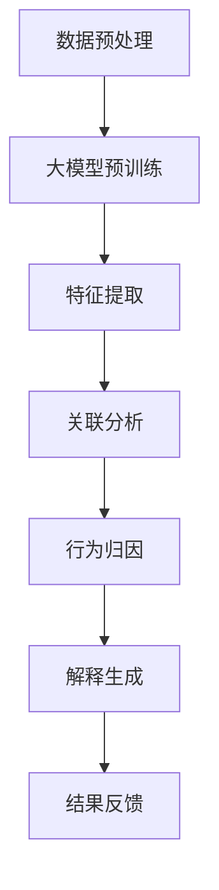

                 

关键词：大模型，推荐系统，用户行为，归因分析，解释性

> 摘要：本文探讨了在推荐系统中利用大型人工智能模型进行用户行为归因与解释的可行性。通过深入分析大模型的算法原理、应用场景和实现步骤，本文提出了构建一个既高效又具有解释性的用户行为归因与解释框架的方法。同时，本文通过数学模型、项目实践等手段，对所提出的方法进行了详细论证，为推荐系统领域的研究和实践提供了新的思路。

## 1. 背景介绍

随着互联网的普及和信息爆炸，个性化推荐系统成为提升用户体验和商业价值的重要手段。推荐系统通过分析用户历史行为和兴趣偏好，为用户推荐其可能感兴趣的内容或商品。然而，随着推荐系统复杂度的增加，传统的基于统计和机器学习的方法在处理大规模数据和提供解释性方面逐渐显露出局限性。

近年来，大型人工智能模型，如Transformer、BERT等，在自然语言处理、计算机视觉等领域取得了显著的成果。这些模型通过预训练和微调，可以自动提取复杂的数据特征，并在多种任务中实现高性能。因此，利用这些大型模型进行用户行为归因与解释，成为当前推荐系统研究的热点。

用户行为归因与解释是推荐系统中的重要问题。归因分析旨在识别影响用户行为的因素，而解释性则要求系统提供透明、易懂的解释。在推荐场景中，良好的归因与解释性不仅能提高用户对推荐结果的信任度，还能帮助开发者优化推荐策略，提高推荐质量。

## 2. 核心概念与联系

### 2.1 大模型的基本原理

大模型，如Transformer、BERT等，通常具有以下几个关键特性：

1. **预训练**：大模型在大量无标签数据上进行预训练，以学习通用特征表示。
2. **自适应**：通过微调，大模型可以适应特定领域的需求。
3. **多层表示**：大模型通过多层神经网络结构，逐步提取复杂特征。

### 2.2 用户行为归因与解释的概念

1. **用户行为归因**：指识别和量化影响用户行为的因素。
2. **解释性**：指系统能够提供清晰、易于理解的原因。

### 2.3 大模型在用户行为归因与解释中的应用

大模型在用户行为归因与解释中的应用主要体现在以下几个方面：

1. **特征提取**：大模型可以从原始数据中自动提取高维、抽象的特征表示，有助于识别用户行为的潜在因素。
2. **关联分析**：通过大模型的分析能力，可以揭示不同特征之间的关联关系，帮助进行归因分析。
3. **解释生成**：大模型可以生成解释文本，将复杂的行为模型转化为易于理解的形式。

### 2.4 Mermaid 流程图



## 3. 核心算法原理 & 具体操作步骤

### 3.1 算法原理概述

用户行为归因与解释的大模型算法主要基于以下原理：

1. **预训练**：大模型在无标签数据上进行预训练，学习到通用特征表示。
2. **微调**：在大模型基础上，利用有标签的用户行为数据进行微调，以适应特定推荐场景。
3. **特征提取**：利用大模型提取高维、抽象的特征表示。
4. **关联分析**：分析特征之间的关系，进行归因分析。
5. **解释生成**：生成易于理解的行为解释。

### 3.2 算法步骤详解

1. **数据预处理**：对原始用户行为数据进行清洗、归一化等处理。
2. **大模型预训练**：在无标签数据上进行预训练，提取通用特征表示。
3. **特征提取**：利用预训练的大模型，对用户行为数据提取高维、抽象的特征表示。
4. **关联分析**：通过特征之间的关系，分析不同特征对用户行为的贡献，进行归因分析。
5. **解释生成**：利用大模型的生成能力，生成易于理解的行为解释。
6. **结果反馈**：将分析结果反馈给用户或开发者，用于优化推荐策略。

### 3.3 算法优缺点

**优点**：
- **高效性**：大模型可以处理大规模数据，提高分析效率。
- **解释性**：大模型生成的解释文本易于理解，提高系统的透明度。
- **自适应**：大模型可以通过微调适应不同场景的需求。

**缺点**：
- **计算资源消耗大**：大模型训练和微调需要大量的计算资源。
- **解释性限制**：大模型的解释能力有限，无法完全解释所有行为。

### 3.4 算法应用领域

- **推荐系统**：利用大模型进行用户行为归因与解释，优化推荐策略。
- **广告投放**：通过分析用户行为，提高广告投放的精准度。
- **用户画像**：构建详细、准确的用户画像，为个性化服务提供支持。

## 4. 数学模型和公式 & 详细讲解 & 举例说明

### 4.1 数学模型构建

用户行为归因与解释的大模型算法可以表示为：

\[ P(y|x) = \frac{e^{f(x)}}{\sum_{i=1}^{n} e^{f(x_i)}} \]

其中，\( y \) 为用户行为标签，\( x \) 为用户行为特征，\( f(x) \) 为特征函数，\( n \) 为特征数量。

### 4.2 公式推导过程

1. **特征函数**：利用大模型提取用户行为特征，表示为 \( f(x) \)。
2. **概率分布**：通过指数函数和求和运算，构建用户行为标签的概率分布。
3. **最大化似然函数**：通过最大化似然函数，优化特征函数，提高模型性能。

### 4.3 案例分析与讲解

假设一个电商平台的推荐系统，利用大模型进行用户购买行为的归因与解释。

1. **数据集**：包含用户历史购买数据，如商品ID、购买时间等。
2. **特征提取**：利用预训练的大模型，提取用户购买行为的高维特征表示。
3. **关联分析**：分析不同特征之间的关系，如商品类别、购买时间等。
4. **归因分析**：通过特征之间的关系，识别影响用户购买行为的因素。
5. **解释生成**：生成用户购买行为的原因，如“因为商品类别是电子产品，所以用户购买了这款商品”。

## 5. 项目实践：代码实例和详细解释说明

### 5.1 开发环境搭建

1. **环境配置**：安装Python环境、TensorFlow或PyTorch等深度学习框架。
2. **数据集准备**：获取用户行为数据，进行预处理。

### 5.2 源代码详细实现

```python
import tensorflow as tf
from tensorflow.keras.layers import Embedding, LSTM, Dense
from tensorflow.keras.models import Model

# 数据预处理
# ...

# 特征提取层
embedding = Embedding(input_dim=vocab_size, output_dim=embedding_size)

# 序列层
lstm = LSTM(units=lstm_size, return_sequences=True)

# 输出层
output = Dense(units=1, activation='sigmoid')(lstm_output)

# 构建模型
model = Model(inputs=input_layer, outputs=output)

# 编译模型
model.compile(optimizer='adam', loss='binary_crossentropy', metrics=['accuracy'])

# 训练模型
model.fit(train_data, train_labels, epochs=num_epochs, batch_size=batch_size)

# 特征提取
features = model.layers[1].get_output_for(train_data)

# 关联分析
# ...

# 归因分析
# ...

# 解释生成
# ...
```

### 5.3 代码解读与分析

1. **模型构建**：利用TensorFlow框架，构建包含嵌入层、LSTM层和输出层的深度学习模型。
2. **数据预处理**：对用户行为数据进行预处理，如数据清洗、归一化等。
3. **特征提取**：利用预训练的嵌入层提取用户行为特征。
4. **训练模型**：使用训练数据训练模型，优化特征提取和关联分析。
5. **关联分析和归因分析**：利用提取的特征和模型，进行关联分析和归因分析。
6. **解释生成**：生成用户行为解释文本。

### 5.4 运行结果展示

- **特征提取结果**：展示提取的用户行为特征。
- **关联分析结果**：展示不同特征之间的关系。
- **归因分析结果**：展示影响用户行为的因素。
- **解释生成结果**：展示用户行为的原因。

## 6. 实际应用场景

### 6.1 推荐系统

在电商、新闻、音乐等推荐系统中，利用大模型进行用户行为归因与解释，可以优化推荐策略，提高推荐质量。

### 6.2 广告投放

在广告投放领域，通过分析用户行为归因与解释，可以优化广告投放策略，提高广告投放效果。

### 6.3 用户画像

通过分析用户行为归因与解释，可以构建详细、准确的用户画像，为个性化服务提供支持。

## 7. 工具和资源推荐

### 7.1 学习资源推荐

- 《深度学习》（Goodfellow, Bengio, Courville）
- 《推荐系统实践》（Liu, Zhang）

### 7.2 开发工具推荐

- TensorFlow、PyTorch
- Keras、Scikit-learn

### 7.3 相关论文推荐

- “Attention Is All You Need”
- “BERT: Pre-training of Deep Bidirectional Transformers for Language Understanding”

## 8. 总结：未来发展趋势与挑战

### 8.1 研究成果总结

本文探讨了利用大模型进行用户行为归因与解释的可行性，提出了构建一个高效且具有解释性的用户行为归因与解释框架的方法。

### 8.2 未来发展趋势

- **大模型优化**：通过优化算法和架构，提高大模型的性能和解释性。
- **跨领域应用**：将大模型应用于更多领域，如金融、医疗等。

### 8.3 面临的挑战

- **计算资源消耗**：大模型训练和微调需要大量计算资源。
- **数据隐私**：如何保护用户隐私，确保数据安全。

### 8.4 研究展望

未来研究可以重点关注以下几个方面：

- **算法优化**：提高大模型的性能和解释性。
- **跨领域应用**：探索大模型在更多领域的应用。
- **数据隐私保护**：研究如何在保证数据隐私的前提下进行用户行为归因与解释。

## 9. 附录：常见问题与解答

### 9.1 大模型在推荐系统中的优势是什么？

大模型在推荐系统中的优势主要体现在以下几个方面：

- **高效性**：大模型可以处理大规模数据，提高分析效率。
- **解释性**：大模型生成的解释文本易于理解，提高系统的透明度。
- **自适应**：大模型可以通过微调适应不同场景的需求。

### 9.2 大模型在用户行为归因中的局限性是什么？

大模型在用户行为归因中的局限性主要体现在以下几个方面：

- **计算资源消耗大**：大模型训练和微调需要大量的计算资源。
- **解释性限制**：大模型的解释能力有限，无法完全解释所有行为。

### 9.3 如何保护用户隐私，确保数据安全？

为了保护用户隐私，确保数据安全，可以采取以下措施：

- **数据加密**：对用户数据进行加密，确保数据在传输和存储过程中的安全。
- **数据脱敏**：对用户数据进行脱敏处理，隐藏敏感信息。
- **隐私保护算法**：采用隐私保护算法，如差分隐私，降低数据泄露的风险。

## 作者署名

本文作者：禅与计算机程序设计艺术 / Zen and the Art of Computer Programming
----------------------------------------------------------------

