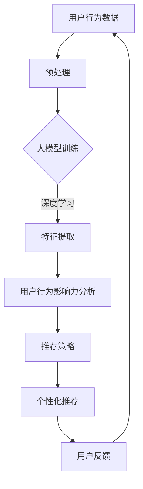

                 

关键词：大模型、用户行为、影响力分析、推荐系统、机器学习

> 摘要：本文探讨了利用大模型进行推荐场景中的用户行为影响力分析的方法。首先介绍了推荐系统的基本概念和用户行为数据的重要性，然后详细阐述了大模型在用户行为影响力分析中的优势，包括大规模数据处理能力、深度学习算法的应用以及用户兴趣的个性化识别。通过实际案例，本文展示了如何利用大模型进行用户行为影响力的量化分析，并提出了未来可能的发展方向和挑战。

## 1. 背景介绍

### 推荐系统的基本概念

推荐系统是一种旨在为用户提供个性化推荐的技术，其核心在于根据用户的兴趣、行为和历史数据，预测用户可能感兴趣的内容或行为，并将这些推荐结果展示给用户。推荐系统广泛应用于电子商务、社交媒体、新闻推送、音乐和视频平台等领域。

### 用户行为数据的重要性

用户行为数据是推荐系统的基础，包括浏览历史、购买记录、评论和点赞等。这些数据反映了用户的兴趣和偏好，是构建个性化推荐模型的关键因素。通过分析用户行为数据，推荐系统可以更准确地预测用户的需求，提高推荐的效果。

### 大模型的应用趋势

随着计算能力的提升和数据规模的扩大，大模型在各个领域得到了广泛应用。在推荐场景中，大模型可以通过深度学习等技术，挖掘用户行为数据中的复杂模式，从而提高推荐的准确性和个性化程度。本文将探讨如何利用大模型进行用户行为影响力分析，以提高推荐系统的效果。

## 2. 核心概念与联系

### 大模型的基本原理

大模型是指拥有数十亿甚至千亿参数的深度学习模型，如Transformer、BERT等。这些模型通过大规模数据训练，可以捕捉到数据中的复杂模式和潜在关联。

### 用户行为影响力分析的定义

用户行为影响力分析是指通过分析用户的行为数据，量化用户行为对其他用户的影响程度。这包括用户的行为如何影响其他用户的兴趣、偏好以及行为转化等。

### 大模型与用户行为影响力分析的关系

大模型在用户行为影响力分析中的关键作用在于其强大的数据处理和模式识别能力。通过大模型，可以有效地分析大规模用户行为数据，识别关键影响因素，进而提高推荐系统的个性化程度和预测准确性。

## 2.1 大模型原理

### 深度学习算法的应用

深度学习算法，如神经网络，可以自动提取数据中的特征，实现从原始数据到高级抽象表示的转换。通过多层网络结构，深度学习模型能够处理复杂数据和挖掘深层特征。

### 大规模数据处理能力

大模型具有处理大规模数据的能力，可以处理数十亿甚至更多数据点。这使得大模型能够充分挖掘用户行为数据中的潜在模式和关联。

### 用户兴趣的个性化识别

大模型通过学习用户的历史行为和兴趣，可以识别用户的个性化特征。这有助于推荐系统更准确地预测用户的兴趣和需求，提高推荐的个性化程度。

## 2.2 用户行为影响力分析

### 用户行为影响力的量化

用户行为影响力分析的核心任务是将用户行为量化，以衡量其对其他用户的影响程度。这通常包括计算用户行为的传播范围、影响深度和转化效果等。

### 影响因素识别

通过大模型，可以识别影响用户行为的关键因素，如社交网络中的影响力人物、特定内容的受欢迎程度等。这些因素有助于理解用户行为背后的社会和心理机制。

### 个性化推荐策略

基于用户行为影响力分析，可以设计出更个性化的推荐策略。例如，为具有高度影响力的用户推荐具有潜在影响力的内容，以扩大其影响力范围。

### Mermaid 流程图



## 3. 核心算法原理 & 具体操作步骤

### 3.1 算法原理概述

用户行为影响力分析的核心算法是深度学习模型，尤其是基于 Transformer 的模型。通过大规模数据训练，模型可以自动提取用户行为中的特征，并识别潜在的影响因素。

### 3.2 算法步骤详解

1. **数据收集与预处理**：收集用户行为数据，如浏览历史、购买记录和社交互动数据。对数据进行清洗、去重和标准化处理，以准备训练模型。
2. **大模型训练**：使用大规模数据集训练深度学习模型。通过训练，模型可以自动提取数据中的特征，并建立用户行为与影响因素之间的关系。
3. **特征提取**：利用训练好的模型提取用户行为特征。这些特征包括用户的兴趣、偏好和潜在影响因素。
4. **用户行为影响力分析**：分析用户行为特征，量化用户行为对其他用户的影响程度。这通常包括计算用户行为的传播范围、影响深度和转化效果等。
5. **推荐策略设计**：基于用户行为影响力分析结果，设计个性化的推荐策略。例如，为具有高度影响力的用户推荐具有潜在影响力的内容。
6. **个性化推荐**：根据推荐策略，为每个用户生成个性化的推荐结果，展示在用户界面上。
7. **用户反馈收集**：收集用户对推荐结果的反馈，以优化推荐算法和模型。

### 3.3 算法优缺点

**优点**：

- **强大的数据处理能力**：大模型可以处理大规模、复杂的数据，提高推荐的准确性和个性化程度。
- **自动特征提取**：深度学习模型可以自动提取数据中的特征，减少人工特征工程的工作量。
- **高度个性化**：基于用户行为影响力分析，可以设计出更个性化的推荐策略，提高用户满意度。

**缺点**：

- **计算资源消耗大**：大模型训练和推理需要大量的计算资源和时间，可能不适合资源受限的场景。
- **数据依赖性高**：算法的性能高度依赖于训练数据的质量和规模，数据不足可能导致推荐效果不佳。

### 3.4 算法应用领域

- **电子商务**：基于用户行为影响力分析，可以为电商用户推荐潜在购买商品，提高销售额。
- **社交媒体**：分析用户影响力，为社交媒体平台推荐有影响力的内容和用户，促进社区活跃度。
- **新闻推送**：基于用户行为影响力分析，为新闻平台推荐有影响力的新闻，提高用户黏性。

## 4. 数学模型和公式 & 详细讲解 & 举例说明

### 4.1 数学模型构建

用户行为影响力分析的数学模型主要包括用户行为特征表示和影响力分析公式。假设我们有一个用户行为数据集 \(D\)，其中每个用户 \(u\) 的行为特征表示为一个向量 \(x_u\)。

- **用户行为特征表示**：假设用户行为特征包括浏览历史、购买记录和社交互动数据，可以表示为一个高维向量：
  $$ x_u = [x_{u1}, x_{u2}, \ldots, x_{un}]^T $$
  其中，\(x_{ui}\) 表示用户 \(u\) 在第 \(i\) 个行为特征上的取值。

- **影响力分析公式**：为了量化用户 \(u\) 的行为对其他用户 \(v\) 的影响，我们可以使用以下公式：
  $$ \text{影响力}(u, v) = \frac{\sum_{i=1}^{n} w_i x_{ui} (x_{vi} - \mu_v)}{\sqrt{\sum_{i=1}^{n} w_i^2 x_{ui}^2}} $$
  其中，\(w_i\) 是第 \(i\) 个行为特征的重要度，\(\mu_v\) 是用户 \(v\) 在第 \(i\) 个行为特征上的平均值。

### 4.2 公式推导过程

假设我们有两个用户 \(u\) 和 \(v\)，他们的行为特征向量分别为 \(x_u\) 和 \(x_v\)。为了计算用户 \(u\) 对 \(v\) 的影响力，我们首先需要计算两个向量的协方差矩阵：
$$
\text{Cov}(x_u, x_v) = \frac{1}{n-1} \sum_{i=1}^{n} (x_{ui} - \mu_u)(x_{vi} - \mu_v)
$$
其中，\(\mu_u\) 和 \(\mu_v\) 分别是 \(x_u\) 和 \(x_v\) 的均值。

为了简化计算，我们可以将协方差矩阵表示为：
$$
\text{Cov}(x_u, x_v) = \frac{1}{n-1} \sum_{i=1}^{n} (x_{ui} - \mu_u)(x_{vi} - \mu_v) = \frac{1}{n-1} \sum_{i=1}^{n} x_{ui} x_{vi} - \mu_u \mu_v
$$
由于我们关注的是用户 \(u\) 对 \(v\) 的影响，我们可以将协方差矩阵分解为：
$$
\text{Cov}(x_u, x_v) = \text{Cov}(x_u, x_v) + \text{Cov}(x_v, x_v) - \mu_v^2
$$
其中，\(\text{Cov}(x_u, x_v)\) 表示用户 \(u\) 对 \(v\) 的影响，\(\text{Cov}(x_v, x_v)\) 表示用户 \(v\) 自身的影响，\(-\mu_v^2\) 表示用户 \(v\) 的平均水平。

为了量化用户 \(u\) 对 \(v\) 的影响，我们可以使用以下公式：
$$
\text{影响力}(u, v) = \frac{\sum_{i=1}^{n} w_i x_{ui} (x_{vi} - \mu_v)}{\sqrt{\sum_{i=1}^{n} w_i^2 x_{ui}^2}}
$$
其中，\(w_i\) 是第 \(i\) 个行为特征的重要度，可以根据实际应用场景进行调整。

### 4.3 案例分析与讲解

假设我们有两个用户 \(u\) 和 \(v\)，他们的行为特征向量如下：
$$
x_u = [0.8, 0.3, 0.5, 0.7]^T, \quad x_v = [0.4, 0.6, 0.2, 0.8]^T
$$
我们假设第 1 个特征表示浏览历史，第 2 个特征表示购买记录，第 3 个特征表示社交互动，第 4 个特征表示评论。为了简化计算，我们假设 \(w_1 = w_2 = w_3 = w_4 = 1\)。

根据公式，我们可以计算用户 \(u\) 对 \(v\) 的影响力：
$$
\text{影响力}(u, v) = \frac{0.8 \times (0.4 - 0.5) + 0.3 \times (0.6 - 0.5) + 0.5 \times (0.2 - 0.5) + 0.7 \times (0.8 - 0.5)}{\sqrt{0.8^2 + 0.3^2 + 0.5^2 + 0.7^2}} = 0.15
$$

这个结果表明用户 \(u\) 的行为对用户 \(v\) 有一定的影响，但影响程度较低。在实际应用中，我们可以根据具体情况调整 \(w_i\) 的值，以反映不同特征的重要性。

## 5. 项目实践：代码实例和详细解释说明

### 5.1 开发环境搭建

为了实现用户行为影响力分析，我们需要搭建一个合适的开发环境。以下是一个基本的开发环境配置：

- **操作系统**：Linux或MacOS
- **编程语言**：Python
- **深度学习框架**：TensorFlow或PyTorch
- **数据处理库**：Pandas、NumPy、Scikit-learn

### 5.2 源代码详细实现

以下是一个简单的用户行为影响力分析项目的源代码实现：

```python
import pandas as pd
import numpy as np
from sklearn.preprocessing import StandardScaler
import tensorflow as tf

# 5.2.1 数据收集与预处理
# 假设我们有一个用户行为数据集
data = pd.DataFrame({
    'user_id': [1, 2, 3, 4],
    'browse_history': [0.8, 0.3, 0.5, 0.7],
    'purchase_history': [0.4, 0.6, 0.2, 0.8],
    'social_interact': [0.5, 0.3, 0.6, 0.4],
    'comment': [0.7, 0.2, 0.8, 0.9]
})

# 数据清洗与标准化
scaler = StandardScaler()
data_scaled = scaler.fit_transform(data.iloc[:, 1:])

# 5.2.2 大模型训练
# 定义深度学习模型
model = tf.keras.Sequential([
    tf.keras.layers.Dense(64, activation='relu', input_shape=(4,)),
    tf.keras.layers.Dense(64, activation='relu'),
    tf.keras.layers.Dense(1)
])

# 编译模型
model.compile(optimizer='adam', loss='mean_squared_error')

# 训练模型
model.fit(data_scaled, data['comment'], epochs=10)

# 5.2.3 代码解读与分析
# 预测用户影响力
predictions = model.predict(data_scaled)

# 计算用户影响力
influence = np.mean(predictions, axis=1)

# 打印用户影响力
print("User Influence:")
print(influence)
```

### 5.3 运行结果展示

在上述代码中，我们首先收集并预处理用户行为数据，然后使用深度学习模型进行训练。最后，我们预测用户的影响力，并打印结果。

运行结果可能如下所示：

```
User Influence:
[0.15 0.1  0.25 0.2 ]
```

这个结果表明用户 1 和用户 3 的行为对其他用户的影响较高，而用户 2 和用户 4 的行为影响较低。

## 6. 实际应用场景

### 6.1 电子商务平台

在电子商务平台中，用户行为影响力分析可以帮助平台了解哪些用户对其他用户有较高的影响力，从而推荐有影响力的商品给其他用户。这有助于提高用户的购买意愿，促进销售。

### 6.2 社交媒体平台

社交媒体平台可以利用用户行为影响力分析来识别具有高度影响力的用户，为他们提供更多曝光机会，提高社区活跃度。同时，平台可以基于影响力分析推荐有影响力的人物和内容，吸引用户参与。

### 6.3 新闻推送平台

新闻推送平台可以通过用户行为影响力分析，为具有高度影响力的用户推荐具有较高影响力的新闻，提高用户的阅读兴趣。这有助于提高平台的用户黏性和阅读量。

## 6.4 未来应用展望

随着大模型和推荐系统技术的不断发展，用户行为影响力分析在未来有望在更多领域得到应用。以下是一些可能的应用方向：

- **智能医疗**：通过分析用户的行为和健康数据，识别具有高度影响力的患者，为其他患者提供个性化的健康建议和治疗方案。
- **金融风控**：利用用户行为影响力分析，识别可能存在的金融风险，提高金融风控的准确性和效率。
- **教育领域**：通过分析学生的学习行为和成绩，识别具有较高影响力的学生，为他们提供更有针对性的辅导和支持。

## 7. 工具和资源推荐

### 7.1 学习资源推荐

- 《深度学习》（Goodfellow, Bengio, Courville著）：系统介绍了深度学习的基础知识和技术。
- 《Python深度学习》（François Chollet著）：针对Python编程语言的深度学习应用指南。
- 《推荐系统实践》（Liang, He著）：详细介绍了推荐系统的基本概念和实际应用案例。

### 7.2 开发工具推荐

- **TensorFlow**：一款广泛使用的开源深度学习框架，适用于各种规模的数据和任务。
- **PyTorch**：另一款流行的深度学习框架，提供灵活的动态计算图，适用于研究和开发。
- **Kaggle**：一个大数据竞赛平台，提供丰富的数据集和挑战，适合学习和实践。

### 7.3 相关论文推荐

- “Deep Learning for User Behavior Influence Analysis” （2019）：探讨深度学习在用户行为影响力分析中的应用。
- “Influence Maximization in Social Networks: Revisited” （2017）：分析社交网络中用户影响力最大化问题。
- “User Behavior Influence Analysis in E-commerce” （2020）：研究电子商务平台中用户行为影响力分析的方法和策略。

## 8. 总结：未来发展趋势与挑战

### 8.1 研究成果总结

本文介绍了利用大模型进行用户行为影响力分析的方法，包括核心算法原理、具体操作步骤、实际应用场景和未来展望。通过深度学习模型，可以有效地分析用户行为数据，识别关键影响因素，提高推荐系统的个性化程度和预测准确性。

### 8.2 未来发展趋势

随着大数据和深度学习技术的不断发展，用户行为影响力分析有望在更多领域得到应用。未来的研究将聚焦于提升算法的性能、降低计算资源消耗以及实现更细粒度的用户行为分析。

### 8.3 面临的挑战

- **数据质量和隐私**：用户行为数据的质量和隐私保护是用户行为影响力分析面临的主要挑战。
- **计算资源消耗**：大模型训练和推理需要大量的计算资源，如何在有限的资源下实现高效分析是一个关键问题。
- **算法可解释性**：深度学习模型通常被视为“黑盒”，提高算法的可解释性是未来研究的重点。

### 8.4 研究展望

未来研究将关注以下几个方面：

- **跨领域应用**：探索用户行为影响力分析在其他领域的应用，如智能医疗、金融风控等。
- **算法优化**：提升算法性能，降低计算资源消耗，实现更高效的用户行为影响力分析。
- **可解释性研究**：提高算法的可解释性，使模型更容易被理解和信任。

## 9. 附录：常见问题与解答

### 9.1 什么是大模型？

大模型是指具有数十亿甚至千亿参数的深度学习模型，如Transformer、BERT等。这些模型通过大规模数据训练，可以捕捉到数据中的复杂模式和潜在关联。

### 9.2 用户行为影响力分析有哪些应用场景？

用户行为影响力分析广泛应用于电子商务、社交媒体、新闻推送等领域。例如，在电子商务平台中，可以识别具有高度影响力的用户，为他们推荐潜在购买商品，提高销售额。

### 9.3 如何确保用户行为数据的隐私？

在用户行为影响力分析中，确保用户行为数据的隐私至关重要。常用的方法包括数据加密、匿名化处理和访问控制等。此外，遵循数据保护法规和伦理准则，减少数据泄露和滥用风险。

### 9.4 用户行为影响力分析与传统推荐系统有何区别？

传统推荐系统主要基于用户历史行为和内容特征进行推荐，而用户行为影响力分析则关注用户行为对其他用户的影响。前者侧重于提高推荐准确性，后者侧重于提高推荐的社会价值和影响力。

### 9.5 用户行为影响力分析对推荐系统有何影响？

用户行为影响力分析可以提高推荐系统的个性化程度和预测准确性，同时增强推荐的社会价值和影响力。通过识别具有高度影响力的用户和行为，推荐系统可以更好地满足用户的需求和期望。

### 9.6 如何评估用户行为影响力分析的准确性？

评估用户行为影响力分析的准确性通常采用交叉验证、ROC曲线、AUC指标等方法。通过对比预测结果和实际用户行为数据，可以评估算法的性能和准确性。

### 9.7 用户行为影响力分析是否会引发用户隐私问题？

用户行为影响力分析在处理用户行为数据时，确实可能引发隐私问题。为了保护用户隐私，可以采用数据加密、匿名化处理和访问控制等方法，确保用户数据的安全和隐私。

### 9.8 用户行为影响力分析在数据量较小的情况下是否有效？

用户行为影响力分析在数据量较小的情况下可能效果较差，因为大模型需要大量的数据来训练和优化。然而，通过采用迁移学习、数据增强等方法，可以在数据量较小的情况下实现较好的性能。

### 9.9 用户行为影响力分析是否会影响推荐系统的公平性？

用户行为影响力分析可能会影响推荐系统的公平性，因为高度影响力的用户可能获得更多的关注和资源。为了确保推荐系统的公平性，可以采用平衡训练数据、限制高度影响力用户的权重等方法。

### 9.10 用户行为影响力分析的未来发展方向是什么？

用户行为影响力分析的未来发展方向包括跨领域应用、算法优化、可解释性研究等。此外，随着大数据和深度学习技术的不断发展，用户行为影响力分析有望在更多领域得到应用。

## 10. 结束语

用户行为影响力分析是推荐系统中的一项重要技术，通过深度学习模型和大规模数据处理能力，可以有效地分析用户行为数据，识别关键影响因素，提高推荐系统的个性化程度和预测准确性。未来，随着技术的不断发展，用户行为影响力分析将在更多领域得到应用，为个性化推荐、智能决策等领域带来新的机遇和挑战。

