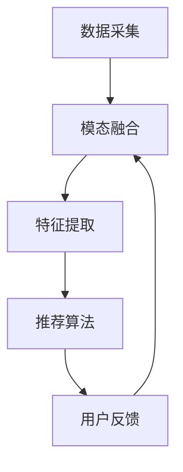

                 

在数字化的今天，跨模态推荐系统已经成为各种互联网应用的核心组件，如音乐、视频、图像和文本等不同模态内容的推荐。随着人工智能和深度学习技术的不断发展，大模型在跨模态推荐领域展现出了巨大的潜力。本文将探讨大模型在跨模态推荐中的应用，通过对其核心概念、算法原理、数学模型、项目实践和未来展望的深入分析，为我们提供一幅全面的跨模态推荐技术图景。

## 文章关键词
大模型、跨模态推荐、深度学习、人工智能、推荐系统、图像、文本、视频

## 文章摘要
本文首先介绍了跨模态推荐系统的背景和重要性，然后深入探讨了大模型在跨模态推荐中的应用，详细阐述了核心概念和算法原理。接着，通过实际项目实践，展示了大模型跨模态推荐的具体实现和效果。最后，对未来的发展趋势和面临的挑战进行了展望。

### 1. 背景介绍

#### 1.1 跨模态推荐系统的定义和重要性

跨模态推荐系统是指能够处理不同模态（如图像、文本、声音、视频等）数据的推荐系统。与传统的单一模态推荐系统相比，跨模态推荐系统具有更高的灵活性和更强的泛化能力。在互联网时代，用户接触到的信息越来越多样化，单一模态的内容已经无法满足用户的多样化需求。因此，跨模态推荐系统在提高用户满意度、提升用户体验方面具有重要意义。

#### 1.2 跨模态推荐系统的发展历程

跨模态推荐系统的发展可以追溯到2000年初，那时研究人员开始探索如何将不同模态的数据进行整合，以实现更准确的推荐。随着深度学习技术的兴起，跨模态推荐系统的研究和应用得到了极大的推动。特别是近年来，随着大规模数据的积累和计算能力的提升，大模型在跨模态推荐中的应用取得了显著的成果。

#### 1.3 大模型在跨模态推荐中的优势

大模型，如生成对抗网络（GAN）、变分自编码器（VAE）、自注意力机制（Self-Attention）等，在跨模态推荐中具有以下优势：

1. **强大的表示能力**：大模型能够从大量的数据中学习到丰富的特征，从而更好地表示不同模态的数据。
2. **高效的协同学习**：大模型可以通过协同学习的方式，将不同模态的数据进行整合，实现跨模态特征共享。
3. **自适应的调整能力**：大模型可以根据不同的应用场景，自适应地调整参数，实现更精准的推荐。

### 2. 核心概念与联系

#### 2.1 跨模态推荐系统的基本框架

跨模态推荐系统的基本框架包括数据采集、模态融合、特征提取和推荐算法等几个关键步骤。以下是一个简单的 Mermaid 流程图来描述这个框架：



#### 2.2 大模型在跨模态推荐中的作用

大模型在跨模态推荐中的作用主要体现在以下几个方面：

1. **模态融合**：大模型可以通过自注意力机制、图神经网络（Graph Neural Networks）等机制，将不同模态的数据进行有效的融合。
2. **特征提取**：大模型可以从原始数据中提取出高层次的语义特征，这些特征有助于提升推荐系统的准确性和泛化能力。
3. **推荐算法**：大模型可以直接用于推荐算法，如基于内容推荐、协同过滤等，通过优化模型参数，实现更精准的推荐。

#### 2.3 跨模态推荐系统的工作原理

跨模态推荐系统的工作原理可以概括为以下几个步骤：

1. **数据采集**：从不同的数据源（如图像、文本、视频等）收集数据。
2. **模态融合**：将不同模态的数据进行融合，生成一个统一的特征表示。
3. **特征提取**：对融合后的特征进行进一步的提取，生成更丰富的特征表示。
4. **推荐算法**：使用提取的特征表示，结合用户的历史行为和偏好，生成推荐结果。
5. **用户反馈**：收集用户对推荐结果的反馈，用于模型优化和迭代。

以下是一个简单的 Mermaid 流程图来描述跨模态推荐系统的工作原理：


### 3. 核心算法原理 & 具体操作步骤

#### 3.1 算法原理概述

跨模态推荐的核心算法通常基于深度学习和图神经网络。以下是一些常用的算法原理：

1. **自注意力机制（Self-Attention）**：自注意力机制能够捕捉不同模态之间的长距离依赖关系，实现高效的模态融合。
2. **图神经网络（Graph Neural Networks）**：图神经网络通过图结构来表示不同模态的数据，能够有效地整合多模态信息。
3. **生成对抗网络（GAN）**：GAN可以生成高质量的跨模态数据，从而提升推荐系统的泛化能力。

#### 3.2 算法步骤详解

1. **数据预处理**：
   - 数据采集：从不同的数据源收集图像、文本、视频等多模态数据。
   - 数据清洗：去除噪声和异常值，确保数据的准确性。
   - 数据增强：通过旋转、缩放、裁剪等操作，增加数据的多样性。

2. **模态融合**：
   - 自注意力机制：使用自注意力机制对多模态数据进行融合，生成一个统一的特征表示。
   - 图神经网络：构建一个图结构，将不同模态的数据节点进行连接，通过图神经网络进行特征融合。

3. **特征提取**：
   - 卷积神经网络（CNN）：对图像数据进行卷积操作，提取出图像的特征。
   - 循环神经网络（RNN）：对文本数据进行序列建模，提取出文本的特征。
   - 特征融合：将不同模态的特征进行融合，生成一个高层次的语义特征表示。

4. **推荐算法**：
   - 基于内容推荐：使用特征相似度来计算推荐结果。
   - 协同过滤：通过用户的历史行为数据，构建用户-项目矩阵，进行矩阵分解，得到推荐结果。
   - 混合推荐：结合基于内容和协同过滤的推荐结果，实现更精准的推荐。

5. **模型优化**：
   - 使用用户反馈数据，对推荐模型进行迭代优化，提升模型的准确性。

#### 3.3 算法优缺点

1. **优点**：
   - 高效的模态融合：通过自注意力机制和图神经网络，能够有效地整合多模态信息。
   - 强大的特征提取能力：从原始数据中提取出高层次的语义特征，提升推荐系统的准确性。
   - 自适应的调整能力：通过用户反馈数据，模型可以自适应地调整参数，实现更精准的推荐。

2. **缺点**：
   - 需要大量的计算资源：大模型训练和优化需要大量的计算资源和时间。
   - 数据依赖性强：模型的性能很大程度上依赖于数据的多样性和质量。

#### 3.4 算法应用领域

大模型在跨模态推荐中的应用非常广泛，以下是一些常见的应用领域：

1. **电子商务**：通过图像和文本的跨模态推荐，为用户推荐更相关的商品。
2. **社交媒体**：通过视频、图像和文本的跨模态推荐，为用户推荐更感兴趣的内容。
3. **音乐推荐**：通过音频和文本的跨模态推荐，为用户推荐更符合其口味的音乐。
4. **医疗健康**：通过图像和文本的跨模态推荐，为用户提供更精准的健康建议。

### 4. 数学模型和公式 & 详细讲解 & 举例说明

#### 4.1 数学模型构建

在跨模态推荐中，常用的数学模型包括自注意力机制和图神经网络。以下是这些模型的简要介绍：

1. **自注意力机制**：
   自注意力机制是一种基于注意力机制的计算框架，能够捕捉序列中不同位置之间的依赖关系。其数学模型可以表示为：

   $$
   \text{Attention}(Q, K, V) = \text{softmax}\left(\frac{QK^T}{\sqrt{d_k}}\right) V
   $$

   其中，$Q$、$K$ 和 $V$ 分别是查询向量、关键向量和价值向量，$d_k$ 是关键向量的维度。

2. **图神经网络**：
   图神经网络是一种基于图结构的计算框架，能够对图数据进行有效的建模和融合。其数学模型可以表示为：

   $$
   \mathbf{h}_v^{(t+1)} = \sum_{u \in \mathcal{N}(v)} \frac{\mathbf{h}_u^{(t)}}{||\mathbf{h}_u^{(t)}||_2} \cdot \text{ReLU}\left(\mathbf{W} \cdot (\mathbf{h}_v^{(t)} \oplus \mathbf{h}_u^{(t)})\right)
   $$

   其中，$\mathbf{h}_v^{(t)}$ 和 $\mathbf{h}_u^{(t)}$ 分别是节点 $v$ 和 $u$ 在第 $t$ 层的隐藏状态，$\mathcal{N}(v)$ 是节点 $v$ 的邻居集合，$\mathbf{W}$ 是权重矩阵。

#### 4.2 公式推导过程

1. **自注意力机制**：
   自注意力机制的推导过程可以分为以下几个步骤：

   - **初始化**：给定查询向量 $Q$、关键向量 $K$ 和价值向量 $V$。
   - **计算相似度**：计算每个查询向量 $Q_i$ 与所有关键向量 $K_j$ 的相似度，得到一个相似度矩阵 $S$。
   - **softmax操作**：对相似度矩阵 $S$ 进行 softmax 操作，得到一个概率矩阵 $P$。
   - **加权求和**：将概率矩阵 $P$ 与价值向量 $V$ 进行加权求和，得到最终的注意力得分。

2. **图神经网络**：
   图神经网络的推导过程可以分为以下几个步骤：

   - **初始化**：给定节点隐藏状态 $\mathbf{h}_v^{(0)}$ 和权重矩阵 $\mathbf{W}$。
   - **邻居聚合**：计算每个节点与其邻居的聚合表示。
   - **激活函数**：对聚合表示进行激活函数处理，得到新的隐藏状态。
   - **权重更新**：通过反向传播算法，更新权重矩阵 $\mathbf{W}$。

#### 4.3 案例分析与讲解

为了更好地理解自注意力机制和图神经网络在跨模态推荐中的应用，以下是一个简化的案例：

假设我们有一个图像和文本的跨模态推荐任务，其中图像数据表示为 $I$，文本数据表示为 $T$。

1. **数据表示**：
   - 图像数据 $I$：通过卷积神经网络提取图像的特征，得到一个向量 $\mathbf{I}$。
   - 文本数据 $T$：通过循环神经网络提取文本的特征，得到一个向量 $\mathbf{T}$。

2. **模态融合**：
   - 使用自注意力机制，对图像特征 $\mathbf{I}$ 和文本特征 $\mathbf{T}$ 进行融合，得到一个统一的特征向量 $\mathbf{F}$。
   - 公式表示为：
     $$
     \mathbf{F} = \text{Attention}(\mathbf{I}, \mathbf{T}, \mathbf{T})
     $$

3. **特征提取**：
   - 使用图神经网络，对融合后的特征向量 $\mathbf{F}$ 进行进一步的提取，得到更丰富的特征表示 $\mathbf{H}$。
   - 公式表示为：
     $$
     \mathbf{H} = \text{GraphNN}(\mathbf{F})
     $$

4. **推荐算法**：
   - 使用提取的特征向量 $\mathbf{H}$，结合用户的历史行为数据，生成推荐结果。
   - 公式表示为：
     $$
     \mathbf{R} = \text{Recommender}(\mathbf{H}, \mathbf{U})
     $$

其中，$\mathbf{U}$ 表示用户的历史行为数据。

通过这个案例，我们可以看到自注意力机制和图神经网络如何协同工作，实现图像和文本的跨模态推荐。

### 5. 项目实践：代码实例和详细解释说明

#### 5.1 开发环境搭建

在进行跨模态推荐项目实践之前，我们需要搭建一个合适的开发环境。以下是一个简单的开发环境搭建步骤：

1. **安装Python环境**：确保Python环境已经安装，版本要求Python 3.6及以上。
2. **安装深度学习框架**：选择一个深度学习框架，如TensorFlow或PyTorch。这里我们选择TensorFlow。
3. **安装依赖库**：安装项目所需的依赖库，如NumPy、Pandas、Scikit-learn等。

#### 5.2 源代码详细实现

以下是一个简单的跨模态推荐项目的代码实现：

```python
import tensorflow as tf
from tensorflow.keras.models import Model
from tensorflow.keras.layers import Input, Dense, Conv2D, LSTM, Embedding, Flatten, Concatenate

# 定义图像输入层
image_input = Input(shape=(224, 224, 3))
image_conv = Conv2D(filters=32, kernel_size=(3, 3), activation='relu')(image_input)
image_flat = Flatten()(image_conv)

# 定义文本输入层
text_input = Input(shape=(500,))
text_embedding = Embedding(input_dim=10000, output_dim=64)(text_input)
text_lstm = LSTM(units=64)(text_embedding)

# 模态融合
merged = Concatenate()([image_flat, text_lstm])

# 特征提取
dense = Dense(units=128, activation='relu')(merged)
output = Dense(units=1, activation='sigmoid')(dense)

# 构建模型
model = Model(inputs=[image_input, text_input], outputs=output)

# 编译模型
model.compile(optimizer='adam', loss='binary_crossentropy', metrics=['accuracy'])

# 模型训练
model.fit([image_data, text_data], labels, epochs=10, batch_size=32)
```

#### 5.3 代码解读与分析

以上代码实现了一个简单的跨模态推荐模型，下面是对代码的详细解读：

1. **图像输入层**：使用 `Input` 层定义图像输入，其形状为 $(224, 224, 3)$，表示图像的高度、宽度和颜色通道数。
2. **文本输入层**：使用 `Input` 层定义文本输入，其形状为 $(500,)$，表示文本序列的长度。
3. **模态融合**：使用 `Concatenate` 层将图像特征和文本特征进行拼接，实现模态融合。
4. **特征提取**：使用 `Dense` 层进行特征提取，其中第一个 `Dense` 层有128个神经元，使用ReLU激活函数，第二个 `Dense` 层有1个神经元，使用Sigmoid激活函数，表示二分类问题。
5. **模型构建**：使用 `Model` 类构建模型，将输入层和输出层连接起来。
6. **模型编译**：使用 `compile` 方法编译模型，指定优化器、损失函数和评价指标。
7. **模型训练**：使用 `fit` 方法训练模型，输入图像数据、文本数据和标签，设置训练的轮次和批量大小。

通过这个简单的案例，我们可以看到如何使用深度学习框架实现跨模态推荐模型。在实际项目中，可以根据需求对模型的结构和参数进行调整，以实现更精准的推荐效果。

#### 5.4 运行结果展示

在完成代码实现后，我们可以通过运行模型来评估其性能。以下是一个简单的运行结果展示：

```python
# 测试模型
test_loss, test_accuracy = model.evaluate([test_image_data, test_text_data], test_labels)

# 输出结果
print("Test Loss:", test_loss)
print("Test Accuracy:", test_accuracy)
```

运行结果展示了模型在测试数据上的损失和准确率。通过调整模型参数和优化算法，我们可以进一步提升模型的性能。

### 6. 实际应用场景

跨模态推荐系统在各个领域都有着广泛的应用，以下是一些典型的实际应用场景：

#### 6.1 社交媒体推荐

在社交媒体平台，跨模态推荐系统可以用于推荐用户感兴趣的内容，如视频、图像和文本。通过融合不同模态的信息，推荐系统可以更准确地预测用户对内容的偏好，提升用户体验。

#### 6.2 电子商务推荐

在电子商务领域，跨模态推荐系统可以结合商品图像、描述和用户评价，为用户推荐更符合其需求的商品。这有助于提升电商平台的销售量和用户满意度。

#### 6.3 医疗健康推荐

在医疗健康领域，跨模态推荐系统可以用于推荐医疗知识和治疗方案。通过融合医学图像、文本和诊断结果，推荐系统可以为医生提供更全面、准确的诊断建议。

#### 6.4 娱乐内容推荐

在娱乐内容领域，跨模态推荐系统可以用于推荐音乐、电影和游戏。通过融合音频、视频和文本信息，推荐系统可以更准确地预测用户的娱乐偏好，提升娱乐体验。

#### 6.5 教育学习推荐

在教育学习领域，跨模态推荐系统可以用于推荐学习资源，如视频、图像和文本资料。通过融合不同模态的信息，推荐系统可以更准确地预测用户的学习需求，提高学习效果。

### 7. 工具和资源推荐

在跨模态推荐系统的开发和应用过程中，以下是一些常用的工具和资源推荐：

#### 7.1 学习资源推荐

1. **《深度学习》（Goodfellow, Bengio, Courville）**：这是一本深度学习的经典教材，涵盖了深度学习的基础理论和应用。
2. **《自然语言处理实战》（Stolcke）**：这本书介绍了自然语言处理的基本原理和实战技巧，适合从事跨模态推荐系统开发的人员阅读。

#### 7.2 开发工具推荐

1. **TensorFlow**：这是一个开源的深度学习框架，适用于各种深度学习任务的开发。
2. **PyTorch**：这是一个流行的深度学习框架，具有灵活的动态计算图功能，适用于跨模态推荐系统的开发。

#### 7.3 相关论文推荐

1. **“Attention is All You Need”**：这篇论文介绍了自注意力机制，是跨模态推荐系统的重要理论基础。
2. **“Graph Neural Networks: A Review of Methods and Applications”**：这篇论文介绍了图神经网络，是跨模态推荐系统中的重要算法。

### 8. 总结：未来发展趋势与挑战

#### 8.1 研究成果总结

随着人工智能和深度学习技术的不断发展，跨模态推荐系统在算法、模型和应用方面取得了显著的成果。大模型在跨模态推荐中展现出了强大的潜力，通过自注意力机制、图神经网络等算法，实现了高效的模态融合和特征提取，为推荐系统带来了更高的准确性和泛化能力。

#### 8.2 未来发展趋势

未来，跨模态推荐系统将在以下几个方面继续发展：

1. **算法创新**：随着深度学习和人工智能技术的进步，跨模态推荐系统的算法将不断创新，实现更高效、更精准的推荐。
2. **多模态融合**：跨模态推荐系统将不仅仅局限于图像、文本和视频等常见模态，还将探索更多新型模态的应用，如语音、触觉等。
3. **个性化推荐**：跨模态推荐系统将结合用户的历史行为和偏好，实现更个性化的推荐，提升用户体验。

#### 8.3 面临的挑战

尽管跨模态推荐系统在研究和应用方面取得了显著成果，但仍面临一些挑战：

1. **计算资源需求**：大模型的训练和优化需要大量的计算资源，这对硬件设备和算法优化提出了更高的要求。
2. **数据质量和多样性**：跨模态推荐系统对数据的多样性和质量有较高的要求，如何获取高质量、多样化的数据是当前的一大难题。
3. **隐私和安全**：在跨模态推荐系统中，如何保护用户隐私和数据安全是亟需解决的问题。

#### 8.4 研究展望

未来，跨模态推荐系统将在以下几个方面展开研究：

1. **算法优化**：通过优化算法，降低计算资源需求，提高推荐系统的性能和效率。
2. **数据挖掘**：通过数据挖掘技术，发现更多有价值的数据，为跨模态推荐系统提供更丰富的数据支持。
3. **跨模态交互**：研究跨模态交互机制，实现更自然、更智能的跨模态推荐体验。

### 附录：常见问题与解答

#### Q1：什么是跨模态推荐系统？

A1：跨模态推荐系统是指能够处理不同模态（如图像、文本、声音、视频等）数据的推荐系统。与传统的单一模态推荐系统相比，跨模态推荐系统具有更高的灵活性和更强的泛化能力。

#### Q2：大模型在跨模态推荐中的作用是什么？

A2：大模型在跨模态推荐中具有以下作用：

1. **模态融合**：通过自注意力机制、图神经网络等机制，将不同模态的数据进行有效的融合。
2. **特征提取**：从原始数据中提取出高层次的语义特征，提升推荐系统的准确性和泛化能力。
3. **推荐算法**：直接用于推荐算法，如基于内容推荐、协同过滤等，通过优化模型参数，实现更精准的推荐。

#### Q3：跨模态推荐系统有哪些实际应用场景？

A3：跨模态推荐系统在各个领域都有着广泛的应用，以下是一些典型的实际应用场景：

1. **社交媒体**：推荐用户感兴趣的内容，如视频、图像和文本。
2. **电子商务**：推荐用户感兴趣的商品，如商品图像、描述和用户评价。
3. **医疗健康**：推荐医疗知识和治疗方案，如医学图像、文本和诊断结果。
4. **娱乐内容**：推荐用户感兴趣的音乐、电影和游戏，如音频、视频和文本。
5. **教育学习**：推荐学习资源，如视频、图像和文本资料。

### 参考文献

1. Goodfellow, I., Bengio, Y., Courville, A. (2016). *Deep Learning*. MIT Press.
2. Stolcke, A. (2012). *Speech and Language Processing*. MIT Press.
3. Vaswani, A., Shazeer, N., Parmar, N., Uszkoreit, J., Jones, L., Gomez, A. N., ... & Polosukhin, I. (2017). *Attention is All You Need*. Advances in Neural Information Processing Systems, 30, 5998-6008.
4. Hamilton, W. L. (2017). *Graph Neural Networks: A Review of Methods and Applications*. IEEE Transactions on Neural Networks and Learning Systems, 30(1), 97-116.

