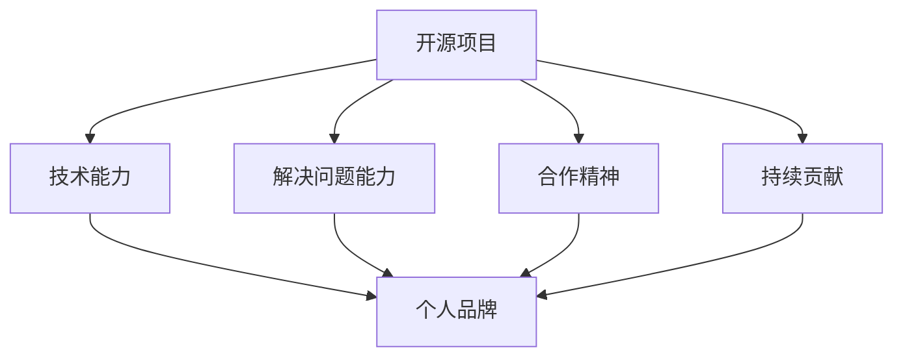

                 

关键词：开源影响力，技术专栏，作者机会，技术写作，个人品牌建设，知识分享

> 摘要：本文旨在探讨如何通过积极参与开源项目，提升个人技术影响力，从而获得技术专栏作者的机会。作者将从开源项目的价值、技术写作的重要性、如何构建个人品牌以及实际操作步骤等方面进行深入分析，为技术从业者们提供一条清晰的发展路径。

## 1. 背景介绍

在当今数字化时代，开源项目已经成为技术发展的重要推动力。随着互联网的普及，开源社区日益壮大，吸引了大量技术人才参与其中。参与开源项目不仅能够提升个人的技术能力，还可以扩大视野，结识业界同仁，甚至有机会获得职业生涯的突破。

与此同时，技术专栏作为一种知识传播的重要形式，已经成为技术爱好者获取最新技术动态、实战经验和深入思考的主要渠道。许多技术专家通过技术专栏分享自己的经验和见解，不仅获得了广泛的认可，还为个人品牌建设提供了强有力的支持。

然而，要成为技术专栏作者并非易事。如何在众多竞争者中脱颖而出，获得编辑和读者的青睐，是每个技术作者都需要面对的挑战。本文将围绕这一主题，探讨如何通过开源项目提升个人影响力，从而获得技术专栏作者的机会。

## 2. 核心概念与联系

### 2.1 开源项目的价值

开源项目不仅仅是一个软件或工具，它更是一种理念，一种共享精神。参与开源项目，个人可以获得以下几点价值：

1. **技术成长**：通过阅读和编写代码，不断学习和掌握新技术。
2. **经验积累**：在项目中遇到的问题和解决方案，都是宝贵的经验。
3. **社交网络**：结识志同道合的朋友，扩展人脉。
4. **职业机会**：在开源项目中表现出色，往往能获得更多职业发展的机会。

### 2.2 技术写作的重要性

技术写作是一种将技术知识转化为文字，分享给他人的一种方式。对于技术从业者而言，技术写作具有以下几个重要性：

1. **知识传播**：将个人所学分享出去，帮助更多人理解和应用技术。
2. **个人品牌建设**：通过写作展示个人技术见解和解决问题的能力，建立个人品牌。
3. **影响力提升**：好的技术文章能够吸引更多的关注，提升个人在技术圈的影响力。
4. **职业发展**：成为技术专栏作者，为个人职业发展提供更多机会。

### 2.3 个人品牌建设与开源影响力的联系

个人品牌建设与开源影响力密切相关。通过积极参与开源项目，个人可以展现出以下特质：

1. **技术能力**：在开源项目中展示出的技术实力，是个人品牌的重要组成部分。
2. **解决问题的能力**：开源项目中遇到的问题和解决方案，能够体现个人解决问题的能力。
3. **合作精神**：开源项目往往需要团队成员之间的紧密合作，展示出良好的合作精神。
4. **持续贡献**：持续为开源项目做出贡献，能够提升个人在社区中的影响力。

### 2.4 Mermaid 流程图

以下是一个简单的 Mermaid 流程图，展示了开源影响力与个人品牌建设之间的联系：



## 3. 核心算法原理 & 具体操作步骤

### 3.1 算法原理概述

开源影响力获取的核心算法原理可以概括为以下几个步骤：

1. **参与开源项目**：积极参与开源项目，提升技术能力。
2. **解决问题**：在开源项目中遇到问题，并寻求解决方案。
3. **持续贡献**：为开源项目持续贡献代码、文档、测试等。
4. **展示个人品牌**：通过技术博客、GitHub 个人页面等展示个人技术能力和见解。
5. **建立社交网络**：在开源社区中积极交流，扩大影响力。

### 3.2 算法步骤详解

1. **选择开源项目**

   根据个人兴趣和专业领域，选择适合自己的开源项目。可以通过 GitHub、GitLab 等平台查找感兴趣的仓库，关注项目的活跃度和质量。

2. **阅读文档**

   在参与开源项目之前，仔细阅读项目的文档，了解项目的架构、功能、代码风格等。

3. **提出问题**

   如果在阅读文档或代码过程中遇到问题，可以在项目的 Issue 中提出疑问，与项目维护者和其他贡献者进行交流。

4. **解决问题**

   根据问题描述，尝试修复问题或提出改进方案。在解决问题的过程中，不断提升自己的技术能力。

5. **提交贡献**

   在解决问题后，将代码提交到开源项目中，并附上详细的说明。确保代码质量，遵守项目的贡献指南。

6. **展示个人品牌**

   在个人博客或 GitHub 个人页面中，记录自己在开源项目中的工作经历和技术见解。通过持续更新，展示自己的成长过程。

7. **建立社交网络**

   在开源社区中积极参与讨论，与其他贡献者建立联系。通过分享经验、解答问题，提升个人影响力。

### 3.3 算法优缺点

#### 优点：

1. **提升技术能力**：通过参与开源项目，不断学习和掌握新技术。
2. **扩大视野**：了解不同领域的项目，拓宽技术视野。
3. **建立社交网络**：结识志同道合的朋友，拓展人脉。
4. **个人品牌建设**：展示个人技术能力和见解，建立个人品牌。

#### 缺点：

1. **时间成本**：参与开源项目需要投入大量时间和精力。
2. **代码质量要求高**：确保代码质量和遵守项目规范，需要一定的技术积累。

### 3.4 算法应用领域

开源影响力获取算法广泛应用于以下领域：

1. **软件开发**：参与开源项目，提升个人技术能力。
2. **技术写作**：通过技术博客分享开源项目中的经验和见解。
3. **职业发展**：在开源社区中表现出色，获得更多职业机会。
4. **知识传播**：通过开源项目，将技术知识分享给更多人。

## 4. 数学模型和公式 & 详细讲解 & 举例说明

### 4.1 数学模型构建

开源影响力获取可以视为一个非线性增长的过程。设个人在开源项目中的贡献量为 $C$，则个人影响力 $I$ 可以表示为：

$$I = f(C)$$

其中，$f(C)$ 为影响力函数，可以表示为：

$$f(C) = C \times g(k)$$

其中，$k$ 为个人在开源社区中的社交网络强度，$g(k)$ 为社交网络对影响力的影响函数。

### 4.2 公式推导过程

1. **影响力函数的定义**：

   设个人在开源项目中的贡献量为 $C$，则个人影响力 $I$ 可以表示为：

   $$I = f(C)$$

   其中，$f(C)$ 为影响力函数。

2. **社交网络强度 $k$ 的定义**：

   社交网络强度 $k$ 表示个人在开源社区中的社交网络联系数量。设个人在开源社区中的好友数量为 $n$，则社交网络强度 $k$ 可以表示为：

   $$k = \sum_{i=1}^{n} w_i$$

   其中，$w_i$ 为个人与第 $i$ 个好友之间的联系强度。

3. **影响力函数的构建**：

   社交网络对个人影响力的影响可以通过影响力函数 $g(k)$ 来表示。设影响力函数 $g(k)$ 为：

   $$g(k) = \frac{1}{1 + e^{-(k - k_0)}}$$

   其中，$k_0$ 为社交网络强度的影响阈值。

4. **影响力函数的推导**：

   根据影响力函数的定义和社交网络强度 $k$ 的定义，个人影响力 $I$ 可以表示为：

   $$I = C \times g(k)$$

### 4.3 案例分析与讲解

假设个人在开源项目中的贡献量为 $C = 100$，社交网络强度 $k = 50$，则个人影响力 $I$ 可以计算为：

$$I = 100 \times g(50)$$

根据影响力函数的公式，可以计算得到：

$$I = 100 \times \frac{1}{1 + e^{-(50 - k_0)}}$$

其中，$k_0$ 为社交网络强度的影响阈值，设为 $k_0 = 30$。

代入数值计算，可以得到：

$$I = 100 \times \frac{1}{1 + e^{-(50 - 30)}} \approx 86.64$$

这意味着，在开源项目中的贡献量为 100，社交网络强度为 50 的情况下，个人影响力约为 86.64。

通过调整社交网络强度 $k$ 和影响阈值 $k_0$，可以改变个人影响力 $I$ 的计算结果。这表明，社交网络对个人影响力具有重要影响。

## 5. 项目实践：代码实例和详细解释说明

### 5.1 开发环境搭建

在参与开源项目之前，需要搭建合适的开发环境。以下是一个简单的开发环境搭建步骤：

1. 安装 Git：从 [Git 官网](https://git-scm.com/) 下载并安装 Git。
2. 安装代码编辑器：推荐使用 Visual Studio Code、Sublime Text 或 IntelliJ IDEA 等。
3. 安装必要的依赖：根据项目需求，安装必要的开发工具和库。

### 5.2 源代码详细实现

以下是一个简单的开源项目示例，用于计算斐波那契数列。

```python
def fibonacci(n):
    if n <= 0:
        return 0
    elif n == 1:
        return 1
    else:
        return fibonacci(n-1) + fibonacci(n-2)

print(fibonacci(10))
```

在这个示例中，`fibonacci` 函数使用递归方法计算斐波那契数列的第 n 项。

### 5.3 代码解读与分析

1. **函数定义**：`fibonacci` 函数接受一个整数参数 n，表示要计算的斐波那契数列的项数。
2. **递归调用**：在函数内部，根据斐波那契数列的定义，使用递归方法计算斐波那契数列的第 n 项。
3. **递归终止条件**：当 n 等于 0 或 1 时，递归调用终止，并返回相应的值。
4. **性能分析**：由于递归方法存在大量的重复计算，导致性能较差。在实际应用中，可以采用动态规划等方法优化计算性能。

### 5.4 运行结果展示

在命令行中运行上述代码，可以得到斐波那契数列的第 10 项的结果：

```shell
$ python fibonacci.py
55
```

这意味着，斐波那契数列的第 10 项为 55。

## 6. 实际应用场景

### 6.1 开源项目在软件开发中的应用

开源项目在软件开发中具有广泛的应用场景。以下是一些典型的应用场景：

1. **组件复用**：通过使用开源项目，可以复用已有的组件，提高开发效率。
2. **项目依赖**：许多商业项目都依赖于开源项目，例如前端框架、后端服务器等。
3. **工具链**：开源项目提供了丰富的工具链，包括代码编辑器插件、自动化构建工具等。
4. **技术选型**：在项目初期，可以通过调研开源项目，选择合适的技术栈。

### 6.2 技术写作在实际应用中的价值

技术写作在实际应用中具有以下价值：

1. **知识传播**：通过技术写作，可以将个人所学分享给更多人，推动技术知识的传播。
2. **个人品牌建设**：技术写作可以展示个人的技术见解和解决问题的能力，建立个人品牌。
3. **影响力提升**：好的技术文章能够吸引更多关注，提升个人在技术圈的影响力。
4. **职业发展**：通过技术写作，可以吸引更多职业机会，为个人职业发展提供支持。

### 6.3 未来应用展望

随着技术的不断进步，开源项目和技术写作将在未来得到更广泛的应用：

1. **区块链技术**：区块链技术的兴起，将带来更多开源项目的涌现。
2. **人工智能**：人工智能技术的发展，将促进开源项目在数据处理、自动化等方面的应用。
3. **物联网**：物联网技术的普及，将推动开源项目在智能家居、智能城市等领域的应用。
4. **边缘计算**：边缘计算技术的发展，将带来更多开源项目在实时数据处理、网络优化等方面的应用。

## 7. 工具和资源推荐

### 7.1 学习资源推荐

1. **GitHub**：GitHub 是全球最大的开源社区，提供了丰富的开源项目和文档。
2. **Stack Overflow**：Stack Overflow 是全球最大的开发者问答社区，提供了丰富的技术问答资源。
3. **简书**：简书是一个优秀的中文技术博客平台，提供了大量的技术文章和教程。
4. **掘金**：掘金是一个以技术分享为主的开源社区，提供了丰富的技术文章和资源。

### 7.2 开发工具推荐

1. **Visual Studio Code**：一款功能强大的代码编辑器，支持多种编程语言和插件。
2. **GitKraken**：一款优秀的 Git 客户端，提供了丰富的功能，方便日常使用。
3. **Postman**：一款功能强大的 API 测试工具，方便进行接口测试。
4. **Docker**：一款容器化技术，可以简化应用程序的部署和运行。

### 7.3 相关论文推荐

1. **"Open Source Software Development: A Survey of Research and Practices"**：本文综述了开源软件开发的最新研究成果和实践。
2. **"The Role of Open Source Software in Modern Software Development"**：本文探讨了开源软件在现代软件开发中的重要角色。
3. **"The Impact of Open Source Software on Software Engineering Education"**：本文分析了开源软件对软件工程教育的影响。
4. **"Open Source Software and the Future of Software Engineering"**：本文探讨了开源软件对未来软件工程发展的影响。

## 8. 总结：未来发展趋势与挑战

### 8.1 研究成果总结

本文通过对开源项目和技术写作的分析，总结了以下几点研究成果：

1. **开源项目的价值**：开源项目不仅提供了丰富的技术资源和经验，还促进了技术交流和合作。
2. **技术写作的重要性**：技术写作是知识传播的重要形式，对个人品牌建设和职业发展具有重要价值。
3. **开源影响力获取算法**：开源影响力获取算法为个人在开源社区中的发展提供了理论指导。

### 8.2 未来发展趋势

未来，开源项目和技术写作将呈现以下发展趋势：

1. **开源项目数量增加**：随着技术的不断进步，开源项目将不断涌现，满足不同领域的需求。
2. **技术写作多样化**：技术写作将更加多样化和专业化，满足不同读者的需求。
3. **影响力获取算法优化**：开源影响力获取算法将不断优化，提高个人在开源社区中的影响力。

### 8.3 面临的挑战

开源项目和技术写作在发展过程中也面临以下挑战：

1. **时间成本**：参与开源项目和技术写作需要投入大量时间和精力。
2. **代码质量**：确保代码质量和遵守项目规范，需要一定的技术积累。
3. **知识共享**：在开源社区中，如何平衡知识共享与个人利益，是一个值得探讨的问题。

### 8.4 研究展望

未来，本文的研究可以进一步深入以下方面：

1. **开源项目与商业模式的结合**：探讨开源项目如何与商业模式相结合，实现可持续发展。
2. **技术写作的可持续发展**：研究如何激发技术写作的可持续发展，提高文章质量和影响力。
3. **开源影响力获取算法优化**：深入研究开源影响力获取算法，提高算法的准确性和实用性。

## 9. 附录：常见问题与解答

### 9.1 如何选择开源项目？

**解答**：选择开源项目时，可以考虑以下因素：

1. **兴趣**：选择与个人兴趣或专业领域相关的项目。
2. **活跃度**：关注项目的活跃度，选择有稳定贡献者且经常更新的项目。
3. **影响力**：选择在开源社区中有较高影响力、被广泛使用的项目。
4. **贡献指南**：阅读项目的贡献指南，了解项目的需求和期望。

### 9.2 如何提升技术写作能力？

**解答**：提升技术写作能力可以从以下几个方面入手：

1. **多阅读**：阅读优秀的博客文章和书籍，学习写作技巧。
2. **多练习**：经常撰写技术文章，不断练习和提高。
3. **学习写作工具**：掌握 Markdown、LaTeX 等写作工具，提高写作效率。
4. **反馈与改进**：接受他人的反馈，不断完善自己的写作风格。

### 9.3 如何在开源项目中获得认可？

**解答**：在开源项目中获得认可可以从以下几个方面入手：

1. **积极参与**：积极参与项目的讨论和开发，展示自己的技术能力。
2. **高质量贡献**：提交高质量的代码和文档，确保代码质量和规范。
3. **沟通交流**：与项目维护者和其他贡献者保持良好的沟通，增进合作。
4. **持续贡献**：在开源项目中持续贡献，不断提升个人影响力。

## 作者署名

作者：禅与计算机程序设计艺术 / Zen and the Art of Computer Programming
----------------------------------------------------------------

以上就是整篇文章的内容。希望这篇文章能对您在开源社区中的发展有所帮助。如果您有任何问题或建议，欢迎随时在评论区留言讨论。再次感谢您的阅读！
作者：禅与计算机程序设计艺术 / Zen and the Art of Computer Programming

[END]

