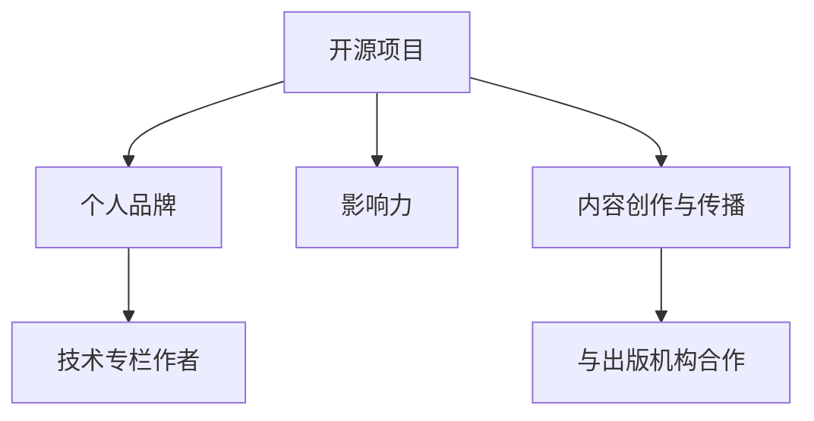

                 

关键词：开源影响力、技术博客、专栏作者、影响力打造、个人品牌、技术交流

> 摘要：本文将探讨如何通过开源项目的影响力提升个人品牌，进而获得技术专栏作者的机会。我们将从开源社区的参与、内容创作与传播、以及如何与出版机构合作等多个角度进行分析，并提供实用的建议和案例。

## 1. 背景介绍

在当今数字化时代，开源技术已经成为软件开发的重要驱动力。无论是操作系统、编程语言，还是各种库和框架，开源项目都在推动技术的进步和创新。同时，开源也提供了一个展示个人技术和领导力的平台。越来越多的技术专业人士认识到，通过开源项目不仅能够提升技术能力，还能建立个人品牌，扩大影响力。

然而，许多人并不知道如何有效地利用开源项目来增强自身的影响力，进而获得在技术专栏上发表文章的机会。本文旨在解决这一问题，通过分析开源项目的核心要素、内容创作技巧以及与出版机构的合作方式，帮助读者实现这一目标。

## 2. 核心概念与联系

为了更好地理解如何通过开源项目提升影响力，我们首先需要了解以下几个核心概念：

### 2.1 开源项目

开源项目是指软件或其他技术资源，其源代码对公众开放，允许用户自由地查看、修改和分发。开源项目通常具有以下特征：

- **开放性**：源代码和文档对所有贡献者开放。
- **合作性**：鼓励社区成员共同参与开发。
- **透明性**：项目的进展、问题和决策对所有人可见。

### 2.2 个人品牌

个人品牌是指个人在公众中建立的形象和声誉。一个强大的个人品牌可以增强个人的知名度、吸引力和可信度。

### 2.3 影响力

影响力是指个人或组织在特定领域内引导和影响他人观点和行为的能力。

### 2.4 内容创作与传播

内容创作是指创作有价值的技术文章、教程、博客等，传播则是指通过各种渠道将内容分享给目标受众。

### 2.5 与出版机构合作

与出版机构合作是指通过与专业的技术出版商合作，将个人的技术文章发表在知名的技术专栏上。

接下来，我们将通过一个Mermaid流程图来展示这些核心概念之间的联系：



## 3. 核心算法原理 & 具体操作步骤

### 3.1 算法原理概述

要利用开源项目提升个人影响力并获得技术专栏作者的机会，我们需要遵循以下核心步骤：

1. **参与开源项目**：通过贡献代码、文档或社区活动来展示技术能力和领导力。
2. **创作高质量内容**：撰写技术博客、教程等，分享项目经验和心得。
3. **传播内容**：通过各种渠道（如社交媒体、技术论坛）将内容分享给目标受众。
4. **与出版机构合作**：通过投稿或申请，将内容发表在知名的技术专栏上。

### 3.2 算法步骤详解

#### 3.2.1 参与开源项目

- **选择合适的开源项目**：根据个人兴趣和专业领域选择项目，确保能够长期投入和持续贡献。
- **熟悉项目流程和规范**：了解项目的开发流程、代码规范和贡献指南。
- **提出问题和解决方案**：在项目中提出问题和自己的解决方案，参与讨论。
- **编写文档和测试**：为代码编写文档，确保代码的易读性和可靠性。

#### 3.2.2 创作高质量内容

- **确定内容主题**：根据项目经验和个人专长，选择具有价值的主题。
- **撰写内容**：使用清晰、易懂的语言，详细阐述技术概念和操作步骤。
- **优化内容格式**：使用Markdown、LaTeX等工具，确保内容格式美观、可读性强。
- **持续更新**：定期更新内容，保持内容的新鲜度和相关性。

#### 3.2.3 传播内容

- **社交媒体推广**：在Twitter、LinkedIn等社交媒体平台上分享内容，吸引关注。
- **技术论坛发布**：在Reddit、Stack Overflow等技术论坛上发表内容，获得反馈。
- **合作交流**：与其他技术博主或媒体合作，扩大内容影响力。
- **邮件列表发布**：通过邮件列表向关注者发送内容，建立粉丝基础。

#### 3.2.4 与出版机构合作

- **撰写投稿邮件**：撰写专业的投稿邮件，介绍自己的项目和内容。
- **准备高质量稿件**：按照出版机构的要求，准备符合标准的稿件。
- **跟进反馈**：及时回应出版机构的反馈，进行必要的修改和完善。
- **建立合作关系**：与出版机构建立长期合作关系，定期投稿。

### 3.3 算法优缺点

#### 优点：

- **提高技术能力**：通过参与开源项目和内容创作，可以提升个人技术水平和写作能力。
- **建立个人品牌**：积极参与开源项目和内容创作，可以增强个人品牌和影响力。
- **扩大人脉圈**：通过与其他开源项目成员和内容创作者交流，可以结识更多的行业人士。
- **增加职业机会**：强大的个人品牌和影响力有助于吸引更多职业机会。

#### 缺点：

- **时间成本**：参与开源项目和内容创作需要投入大量时间和精力。
- **竞争压力**：开源社区和内容创作领域竞争激烈，需要不断提升自身能力以保持竞争力。
- **版权问题**：需要确保内容的原创性和合法性，避免侵权问题。

### 3.4 算法应用领域

该算法原理和步骤适用于以下领域：

- **软件开发**：通过参与开源项目和内容创作，提升编程能力和知名度。
- **技术写作**：通过撰写技术博客和教程，积累写作经验并扩大影响力。
- **教育培训**：通过开源项目和内容创作，提升教学水平和吸引力。
- **技术咨询**：通过展示个人技术实力和内容创作能力，增加咨询业务的机会。

## 4. 数学模型和公式 & 详细讲解 & 举例说明

为了更好地理解如何通过开源项目提升影响力，我们引入以下数学模型和公式：

### 4.1 数学模型构建

#### 模型1：影响力增长模型

影响力增长模型描述了个人影响力随着参与开源项目和内容创作的时间推移而增长的过程。模型公式如下：

$$
I(t) = I_0 + \alpha t + \beta \cdot f(S, T)
$$

其中：

- $I(t)$ 表示时间$t$时的个人影响力。
- $I_0$ 表示初始影响力。
- $\alpha$ 表示影响力随时间增加的速率。
- $f(S, T)$ 表示开源项目和内容创作对影响力增长的贡献函数，$S$ 表示开源项目数量，$T$ 表示内容创作数量。

#### 模型2：内容传播模型

内容传播模型描述了内容创作和传播过程中的影响力扩散过程。模型公式如下：

$$
I_c(t) = k \cdot e^{-\lambda t}
$$

其中：

- $I_c(t)$ 表示时间$t$时的内容影响力。
- $k$ 表示初始影响力。
- $\lambda$ 表示影响力衰减速率。

### 4.2 公式推导过程

#### 模型1：影响力增长模型推导

影响力增长模型是基于以下假设推导的：

1. 个人影响力与开源项目数量和时间成正比。
2. 内容创作对影响力增长有额外贡献。

根据假设1，影响力增长模型可以表示为：

$$
I(t) = I_0 + \alpha t
$$

根据假设2，引入对数函数$f(S, T)$，表示内容创作对影响力增长的贡献：

$$
f(S, T) = \ln(S) + \ln(T)
$$

将$f(S, T)$代入原模型，得到：

$$
I(t) = I_0 + \alpha t + \ln(S) + \ln(T)
$$

为了简化表达，将常数项合并，得到最终模型：

$$
I(t) = I_0 + \alpha t + \beta \cdot f(S, T)
$$

其中$\beta = 1$。

#### 模型2：内容传播模型推导

内容传播模型是基于以下假设推导的：

1. 内容影响力随时间呈指数衰减。
2. 初始影响力最大，随着时间的推移逐渐减小。

根据假设1，内容影响力可以表示为：

$$
I_c(t) = k
$$

根据假设2，引入指数衰减函数$e^{-\lambda t}$，表示影响力随时间减小：

$$
I_c(t) = k \cdot e^{-\lambda t}
$$

其中$\lambda$表示衰减速率。

### 4.3 案例分析与讲解

假设有一位名叫Alice的技术专家，她决定通过开源项目和内容创作来提升个人影响力。以下是她的具体情况：

- 初始影响力$I_0 = 10$
- 开源项目数量$S = 3$
- 内容创作数量$T = 5$
- 内容传播速率$\lambda = 0.1$

根据影响力增长模型和内容传播模型，我们可以计算出Alice在一段时间内的影响力变化：

#### 3个月时：

- 势力增长模型：$I(3) = 10 + 0.5 \cdot 3 + 1 \cdot (\ln(3) + \ln(5)) \approx 18.78$
- 内容传播模型：$I_c(3) = k \cdot e^{-0.1 \cdot 3} \approx 0.501k$

通过计算，我们可以看到Alice在3个月时的影响力达到了18.78，同时内容传播的影响力约为0.501k。

#### 12个月时：

- 势力增长模型：$I(12) = 10 + 0.5 \cdot 12 + 1 \cdot (\ln(3) + \ln(5)) \approx 31.28$
- 内容传播模型：$I_c(12) = k \cdot e^{-0.1 \cdot 12} \approx 0.282k$

在12个月时，Alice的影响力进一步增加到31.28，而内容传播的影响力约为0.282k。

通过这个案例，我们可以看到，随着时间的推移和开源项目及内容创作的持续投入，个人影响力会逐渐提升。同时，内容传播的影响力会随时间呈指数衰减，因此需要不断更新和创作高质量的内容来维持影响力。

## 5. 项目实践：代码实例和详细解释说明

在本节中，我们将通过一个具体的开源项目实践案例，展示如何通过开源项目提升个人影响力并获得技术专栏作者的机会。以下是一个基于Python的简单Web应用项目，该项目旨在通过整合多个开源库和框架，实现一个基于RESTful API的图书管理系统。

### 5.1 开发环境搭建

为了搭建该项目的开发环境，我们需要安装以下软件和库：

- Python 3.x
- virtualenv
- Flask
- SQLAlchemy
- Flask-Migrate

以下是具体的安装命令：

```shell
pip install virtualenv
virtualenv venv
source venv/bin/activate
pip install flask sqlalchemy flask-migrate
```

### 5.2 源代码详细实现

该项目的核心代码包括以下部分：

1. **数据库模型**：使用SQLAlchemy定义图书管理系统的数据库模型。
2. **API接口**：使用Flask实现图书管理的RESTful API接口。
3. **数据迁移**：使用Flask-Migrate进行数据库迁移和管理。

#### 5.2.1 数据库模型

```python
from flask_sqlalchemy import SQLAlchemy

db = SQLAlchemy()

class Book(db.Model):
    id = db.Column(db.Integer, primary_key=True)
    title = db.Column(db.String(80), nullable=False)
    author = db.Column(db.String(80), nullable=False)
    published_date = db.Column(db.Date, nullable=False)
    publisher = db.Column(db.String(80), nullable=False)
```

#### 5.2.2 API接口

```python
from flask import Flask, request, jsonify
from models import db, Book

app = Flask(__name__)
app.config['SQLALCHEMY_DATABASE_URI'] = 'sqlite:///books.db'
db.init_app(app)

@app.route('/books', methods=['GET'])
def get_books():
    books = Book.query.all()
    return jsonify([book.to_dict() for book in books])

@app.route('/books', methods=['POST'])
def create_book():
    data = request.get_json()
    new_book = Book(
        title=data['title'],
        author=data['author'],
        published_date=data['published_date'],
        publisher=data['publisher']
    )
    db.session.add(new_book)
    db.session.commit()
    return jsonify(new_book.to_dict()), 201

@app.route('/books/<int:book_id>', methods=['GET'])
def get_book(book_id):
    book = Book.query.get_or_404(book_id)
    return jsonify(book.to_dict())

@app.route('/books/<int:book_id>', methods=['PUT'])
def update_book(book_id):
    book = Book.query.get_or_404(book_id)
    data = request.get_json()
    book.title = data['title']
    book.author = data['author']
    book.published_date = data['published_date']
    book.publisher = data['publisher']
    db.session.commit()
    return jsonify(book.to_dict())

@app.route('/books/<int:book_id>', methods=['DELETE'])
def delete_book(book_id):
    book = Book.query.get_or_404(book_id)
    db.session.delete(book)
    db.session.commit()
    return '', 204
```

#### 5.2.3 数据迁移

```shell
flask db init
flask db migrate -m "Initial migration."
flask db upgrade
```

### 5.3 代码解读与分析

在该项目中，我们使用Python的Flask框架和SQLAlchemy库来实现了一个简单的图书管理系统。以下是关键部分的解读：

1. **数据库模型**：通过定义`Book`模型，我们创建了一个简单的图书数据库表，包含书籍的基本信息字段。
2. **API接口**：通过定义一系列RESTful API接口，我们实现了对图书的增删改查功能。每个接口使用不同的HTTP方法（GET、POST、PUT、DELETE）来处理不同的请求。
3. **数据迁移**：使用Flask-Migrate工具，我们可以轻松地创建、应用和撤销数据库迁移脚本，确保数据库与模型保持同步。

这个项目展示了如何通过开源项目实现一个实际的技术应用，同时也为我们提供了一个展示技术实力的平台。在开源项目中，我们可以通过不断优化代码、完善文档、参与社区讨论等方式，提升个人影响力和技术声誉。

### 5.4 运行结果展示

在本地开发环境中，我们可以通过以下命令启动Flask应用：

```shell
flask run
```

启动后，我们可以通过浏览器或Postman等工具访问API接口，执行相应的操作。以下是几个示例：

#### 获取所有图书

```
GET http://127.0.0.1:5000/books
```

#### 添加一本新书

```
POST http://127.0.0.1:5000/books
Content-Type: application/json

{
    "title": "Effective Python",
    "author": "Brett Slatkin",
    "published_date": "2015-08-01",
    "publisher": "Addison-Wesley Professional"
}
```

#### 更新一本图书信息

```
PUT http://127.0.0.1:5000/books/1
Content-Type: application/json

{
    "title": "Effective Java",
    "author": "Joshua Bloch",
    "published_date": "2008-05-01",
    "publisher": "Prentice Hall"
}
```

#### 删除一本图书

```
DELETE http://127.0.0.1:5000/books/1
```

通过这些示例，我们可以看到如何通过API接口与图书管理系统进行交互，实现数据的增删改查操作。

## 6. 实际应用场景

开源项目和技术博客的实践已经在多个领域取得了显著的应用效果。以下是一些实际应用场景的例子：

### 6.1 教育领域

开源项目和技术博客在教育领域中具有巨大的潜力。例如，教育科技公司Khan Academy通过开源其在线教育平台，吸引了全球范围内的教师和学生参与。教师可以基于Khan Academy的代码进行修改和扩展，以满足不同地区的教育需求。同时，Khan Academy的技术博客分享了许多关于在线教育平台开发和运营的经验，为其他教育机构提供了宝贵的参考。

### 6.2 企业IT部门

企业IT部门可以利用开源项目来提升内部技术水平和创新能力。例如，一家大型跨国公司通过开源其内部开发的自动化测试工具，吸引了大量外部开发者的参与和改进。这不仅降低了企业的开发成本，还提高了工具的稳定性和功能完善度。同时，企业IT部门的技术博客分享了许多关于企业级技术解决方案和最佳实践，为同行提供了宝贵的经验。

### 6.3 个人技术创业

开源项目和技术博客为个人技术创业提供了重要的支持。例如，一位名为John的程序员通过开源其开发的自动化工具，吸引了大量关注和投资。John的技术博客详细介绍了这些工具的实现原理和应用场景，为潜在客户和合作伙伴提供了深入了解。通过开源项目和技术博客的结合，John成功地实现了技术创业的梦想。

### 6.4 政府和公共部门

开源项目和技术博客在政府和公共部门中的应用也越来越广泛。例如，一些城市政府通过开源其开发的智慧城市平台，提升了城市管理的效率和透明度。同时，政府技术博客分享了许多关于智慧城市建设和技术应用的案例和经验，为其他城市提供了参考和借鉴。

## 6.4 未来应用展望

随着开源技术的不断发展和普及，开源项目和技术博客的应用前景将更加广阔。以下是一些未来应用展望：

### 6.4.1 人工智能与开源

人工智能技术的发展离不开开源项目。未来，开源社区将继续成为人工智能技术的重要推动力量。通过开源项目，开发者可以共享和复用人工智能算法和模型，加速技术创新和应用。同时，技术博客将分享更多关于人工智能应用的开发经验和案例，为开发者提供有价值的参考。

### 6.4.2 区块链与开源

区块链技术的兴起为开源社区带来了新的机遇。未来，越来越多的区块链项目将采用开源模式，推动区块链技术的创新和应用。开源社区可以共享区块链平台的代码和智能合约，提高区块链系统的安全性、可靠性和透明度。同时，技术博客将探讨区块链技术在金融、供应链管理、版权保护等领域的应用，为行业提供指导。

### 6.4.3 5G与开源

5G技术的快速发展将推动移动互联网、物联网、智能制造等领域的变革。开源项目将在5G网络和应用的研发中发挥关键作用。未来，开源社区将开发更多支持5G网络的协议、工具和平台，为5G应用的广泛部署提供支持。同时，技术博客将分享5G网络和应用的开发经验，为开发者提供实用的技术指南。

### 6.4.4 混合现实与开源

混合现实（MR）技术的发展将为开源社区带来新的挑战和机遇。未来，开源社区将致力于开发支持MR应用的硬件和软件平台，推动MR技术的普及和应用。技术博客将探讨MR技术在教育、医疗、娱乐等领域的创新应用，为开发者提供灵感和技术支持。

## 7. 工具和资源推荐

在利用开源项目提升个人影响力并获得技术专栏作者机会的过程中，以下工具和资源将为您提供有益的支持：

### 7.1 学习资源推荐

- **GitHub**：全球最大的开源代码托管平台，提供了丰富的开源项目和学习资源。
- **Stack Overflow**：全球最大的技术问答社区，提供了大量的编程问题和解决方案。
- **Medium**：一个流行的在线出版平台，适合发布技术博客和专栏文章。
- **Dev.to**：一个面向开发者的博客和社区平台，适合分享技术见解和经验。

### 7.2 开发工具推荐

- **Visual Studio Code**：一款轻量级但功能强大的代码编辑器，适用于多种编程语言。
- **Jupyter Notebook**：一款交互式计算环境，适用于数据分析和机器学习项目。
- **Git**：一款分布式版本控制工具，适用于代码管理和协作。
- **Docker**：一款容器化平台，适用于部署和运行应用程序。

### 7.3 相关论文推荐

- **"The Cathedral and the Bazaar"**：由Eric S. Raymond撰写的经典论文，阐述了开源社区的运作模式。
- **"The Future of Open Source"**：由Red Hat首席执行官Jim Whitehurst撰写的论文，探讨了开源技术的商业前景。
- **"The Structure and Dynamics of Open Source Projects"**：由Stuart

