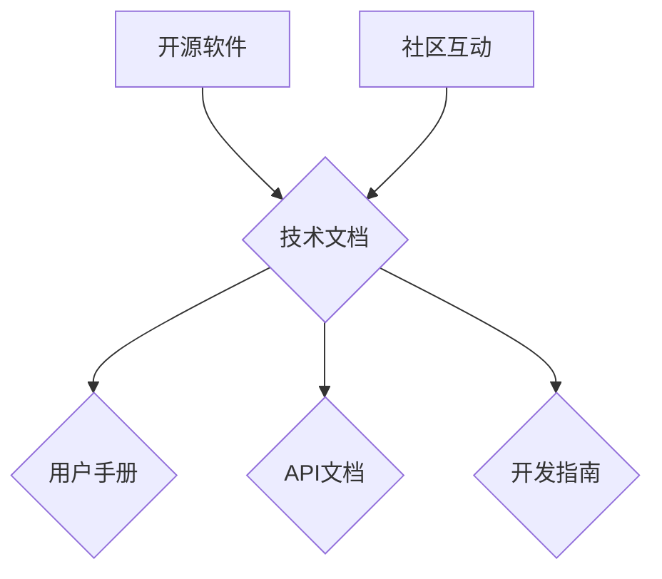

                 

在当今信息技术快速发展的时代，开源已经成为软件开发和交流不可或缺的一部分。开源不仅推动了技术的创新和传播，还为技术人员提供了宝贵的学习和实践机会。而技术写作和内容创作则是对这些开源经验的进一步升华，能够帮助更多人理解复杂的技术概念，促进知识的共享和传递。本文将探讨如何利用开源经验进行技术写作和内容创作，为技术人员提供一些实用的方法和建议。

## 关键词
- 开源经验
- 技术写作
- 内容创作
- 知识共享
- 技术传播

## 摘要
本文旨在探讨开源技术如何为技术写作和内容创作提供宝贵的资源和灵感。通过分析开源项目中的实际案例，文章将介绍如何从开源经验中提炼主题、组织内容，并利用有效的写作技巧和工具进行创作。此外，文章还将讨论技术写作在开源社区中的重要作用，以及对未来技术写作和内容创作发展的展望。

## 1. 背景介绍

### 开源与技术写作
开源运动起源于20世纪90年代，最初是由一些计算机科学家和自由软件倡导者发起的。他们主张软件的开源、共享和自由修改，以促进技术的创新和进步。随着互联网的发展，开源项目逐渐增多，形成了一个庞大的开源社区。在这个社区中，技术人员通过编写文档、教程和博客文章，分享他们的知识和经验。

技术写作则是对这些知识和经验进行系统化的整理和表达。它不仅包括对技术概念的阐述，还涉及编程技巧、算法实现、工具使用等具体内容。技术写作的目的是帮助他人理解和掌握技术，从而促进技术的传播和应用。

### 开源经验对内容创作的影响
开源经验为技术写作和内容创作提供了丰富的素材和灵感。在开源项目中，技术人员会遇到各种技术挑战和解决方案，这些都是写作和创作的宝贵内容。通过记录和分享这些经验，可以不仅帮助自己巩固知识，还可以帮助他人少走弯路，加速技术传播。

此外，开源项目中的代码、文档和社区讨论也是内容创作的重要资源。从这些资源中，技术人员可以提炼出有价值的信息，进行扩展和深化，创作出高质量的技术文章和教程。

## 2. 核心概念与联系

在探讨如何利用开源经验进行技术写作和内容创作之前，我们需要了解一些核心概念和联系。这些概念包括开源软件、技术文档、教程编写和社区互动等。

### 开源软件
开源软件（Open Source Software，简称OSS）是指软件的源代码可以被公众访问、阅读、修改和分发。开源软件的特点是开放、共享和协作。这些特点使得开源软件能够吸引全球的技术人员共同参与，进行技术创新和优化。


### 技术文档
技术文档是对软件开发过程中的各种技术细节进行记录和描述的文档。它包括用户手册、API文档、开发指南等。技术文档的目的是帮助用户更好地理解和使用软件，同时也是技术人员之间交流和协作的桥梁。


### 教程编写
教程编写是将复杂的技术知识以简单易懂的方式传授给读者的过程。一个好的教程不仅要有清晰的结构和逻辑，还要结合实际案例进行讲解，以便读者能够更好地理解和应用。


### 社区互动
社区互动是开源项目的重要组成部分。技术人员在开源社区中可以分享经验、寻求帮助、讨论技术问题，并与其他开发者建立联系。社区互动不仅有助于个人成长，还能促进整个开源生态的繁荣。


### Mermaid 流程图



通过上述核心概念和流程图，我们可以看到开源软件、技术文档、教程编写和社区互动之间是相互关联、相互促进的。这些元素共同构成了一个完整的开源生态系统，为技术写作和内容创作提供了丰富的资源和灵感。

## 3. 核心算法原理 & 具体操作步骤

在技术写作和内容创作中，掌握核心算法的原理和具体操作步骤是至关重要的。这不仅有助于提升文章的专业性，还能让读者更好地理解和应用技术。以下将介绍一个常用的算法——K-Means聚类算法，并详细说明其原理和具体操作步骤。

### 3.1 算法原理概述

K-Means聚类算法是一种经典的无监督机器学习算法，用于将数据点划分为K个簇。算法的基本思想是：首先随机初始化K个中心点，然后计算每个数据点到这些中心点的距离，将数据点分配到距离最近的中心点所在的簇。接着，根据每个簇的数据点重新计算中心点，重复上述过程，直至中心点的位置不再发生变化或满足其他终止条件。

K-Means算法的核心思想可以简化为以下几个步骤：

1. 随机初始化K个中心点。
2. 计算每个数据点到各个中心点的距离，将数据点分配到最近的中心点所在的簇。
3. 根据每个簇的数据点重新计算中心点。
4. 重复步骤2和步骤3，直至中心点的位置不再发生变化或满足其他终止条件。

### 3.2 算法步骤详解

下面是K-Means算法的具体操作步骤：

#### 步骤1：初始化
- 随机选择K个数据点作为初始中心点。
- 通常可以选择随机种子或者使用特定的初始化方法，如K-Means++。

#### 步骤2：分配数据点
- 对每个数据点，计算其到各个中心点的距离。
- 将数据点分配到距离最近的中心点所在的簇。

#### 步骤3：更新中心点
- 根据每个簇的数据点，计算新的中心点。
- 对于每个簇，新的中心点是该簇中所有数据点的平均值。

#### 步骤4：迭代优化
- 重复步骤2和步骤3，直至满足以下终止条件：
  - 中心点的位置不再发生变化。
  - 达到预定的迭代次数。
  - 簇间距离的增量小于某个阈值。

#### 步骤5：输出结果
- 输出最终划分的K个簇，以及每个簇的中心点。

### 3.3 算法优缺点

#### 优点
- 算法简单易懂，易于实现。
- 计算速度快，适用于大规模数据集。
- 对初始中心点的选择不敏感，可以通过多次运行算法来优化结果。

#### 缺点
- 对噪声数据敏感，可能导致簇的不稳定。
- 需要预先指定簇的数量K，K的选择对算法结果有很大影响。
- 在某些情况下，可能会陷入局部最优解。

### 3.4 算法应用领域

K-Means聚类算法广泛应用于数据挖掘、机器学习、图像处理和生物信息学等领域。以下是一些常见应用实例：

- 数据降维：通过将高维数据映射到低维空间，提高数据分析的效率和准确性。
- 图像分割：将图像划分为不同的区域，用于图像识别和图像处理。
- 聚类分析：对客户进行细分，为市场营销提供决策支持。
- 社交网络分析：分析社交网络中的群体结构，发现潜在的关系和趋势。

## 4. 数学模型和公式 & 详细讲解 & 举例说明

在技术写作和内容创作中，对数学模型和公式的讲解是必不可少的，因为它有助于让读者更深入地理解技术原理。以下我们将介绍一个常见的数学模型——线性回归模型，并详细讲解其公式推导过程和实际应用。

### 4.1 数学模型构建

线性回归模型是一种用于建立自变量和因变量之间线性关系的统计模型。其基本形式可以表示为：

$$y = \beta_0 + \beta_1 \cdot x_1 + \beta_2 \cdot x_2 + ... + \beta_n \cdot x_n + \epsilon$$

其中，$y$ 是因变量，$x_1, x_2, ..., x_n$ 是自变量，$\beta_0, \beta_1, \beta_2, ..., \beta_n$ 是模型的参数，$\epsilon$ 是误差项。

### 4.2 公式推导过程

线性回归模型的公式推导主要分为以下几个步骤：

#### 步骤1：最小二乘法

线性回归模型使用最小二乘法来估计参数$\beta_0, \beta_1, \beta_2, ..., \beta_n$。最小二乘法的核心思想是：使因变量的实际值与模型预测值之间的误差平方和最小。

设$y_i$为实际值，$\hat{y_i}$为模型预测值，则有：

$$\sum_{i=1}^{n}(y_i - \hat{y_i})^2$$

#### 步骤2：参数估计

对参数$\beta_0, \beta_1, \beta_2, ..., \beta_n$进行偏导数求解，使得上述误差平方和最小。具体地，我们可以对每个参数分别求偏导数并令其等于0，得到以下方程组：

$$\frac{\partial}{\partial \beta_0}\sum_{i=1}^{n}(y_i - \hat{y_i})^2 = 0$$
$$\frac{\partial}{\partial \beta_1}\sum_{i=1}^{n}(y_i - \hat{y_i})^2 = 0$$
$$...$$
$$\frac{\partial}{\partial \beta_n}\sum_{i=1}^{n}(y_i - \hat{y_i})^2 = 0$$

通过求解上述方程组，可以得到参数$\beta_0, \beta_1, \beta_2, ..., \beta_n$的估计值。

#### 步骤3：线性回归方程

将参数估计值代入原始线性回归模型，即可得到最终的线性回归方程。

### 4.3 案例分析与讲解

为了更好地理解线性回归模型，我们来看一个实际案例。

#### 案例背景

假设我们要研究房价与房屋面积之间的关系。我们收集了如下数据：

| 房屋编号 | 房屋面积（平方米） | 房价（万元） |
|---------|------------------|------------|
| 1       | 80               | 200        |
| 2       | 100              | 250        |
| 3       | 120              | 300        |
| 4       | 140              | 350        |
| 5       | 160              | 400        |

#### 模型构建

根据上述数据，我们可以建立如下的线性回归模型：

$$y = \beta_0 + \beta_1 \cdot x_1 + \epsilon$$

其中，$y$ 表示房价，$x_1$ 表示房屋面积。

#### 参数估计

使用最小二乘法，我们可以计算出$\beta_0$和$\beta_1$的估计值。计算结果如下：

$$\beta_0 \approx 75.82$$
$$\beta_1 \approx 37.89$$

#### 线性回归方程

将参数估计值代入线性回归模型，得到最终的线性回归方程：

$$y = 75.82 + 37.89 \cdot x_1$$

#### 模型应用

利用上述线性回归模型，我们可以预测给定房屋面积下的房价。例如，当房屋面积为120平方米时，预测房价为：

$$y = 75.82 + 37.89 \cdot 120 = 328.46$$

#### 模型评估

为了评估线性回归模型的效果，我们可以计算预测值与实际值之间的误差。具体地，我们可以使用均方误差（MSE）进行评估：

$$MSE = \frac{1}{n}\sum_{i=1}^{n}(y_i - \hat{y_i})^2$$

根据上述案例数据，计算得到的MSE为：

$$MSE = \frac{1}{5}\sum_{i=1}^{5}(y_i - \hat{y_i})^2 \approx 51.72$$

### 4.4  模型总结

通过上述案例，我们可以看到线性回归模型在预测房价方面的应用效果。尽管线性回归模型在某些情况下可能存在局限性，但它仍然是一种简单有效且广泛应用的统计模型。在技术写作和内容创作中，对线性回归模型的详细讲解和实例分析，有助于读者更好地理解和掌握这一重要的数学模型。

## 5. 项目实践：代码实例和详细解释说明

为了更好地理解技术写作和内容创作的过程，我们将通过一个实际项目——使用Python实现K-Means聚类算法——来展示如何进行项目实践。在这个项目中，我们将介绍开发环境搭建、源代码实现、代码解读与分析，并展示运行结果。

### 5.1 开发环境搭建

首先，我们需要搭建一个Python开发环境。以下是搭建过程：

1. 安装Python：前往Python官网（[python.org](https://www.python.org/)）下载并安装Python 3.8或更高版本。
2. 安装Jupyter Notebook：打开命令行，执行以下命令安装Jupyter Notebook：

   ```bash
   pip install notebook
   ```

3. 启动Jupyter Notebook：在命令行中执行以下命令启动Jupyter Notebook：

   ```bash
   jupyter notebook
   ```

### 5.2 源代码详细实现

以下是一个使用Python实现K-Means聚类算法的源代码实例：

```python
import numpy as np
import matplotlib.pyplot as plt
from sklearn.cluster import KMeans

# 生成样本数据
np.random.seed(0)
X = np.random.rand(100, 2)

# 使用KMeans聚类算法
kmeans = KMeans(n_clusters=3, random_state=0).fit(X)

# 输出聚类结果
print(kmeans.labels_)

# 绘制聚类结果
plt.scatter(X[:, 0], X[:, 1], c=kmeans.labels_)
plt.show()
```

### 5.3 代码解读与分析

上述代码首先导入了必要的库，包括NumPy、Matplotlib和scikit-learn中的KMeans模块。接着，我们生成了一组随机样本数据`X`，并使用KMeans聚类算法对其进行聚类。最后，我们输出了聚类结果，并使用Matplotlib绘制了聚类结果图。

代码中的关键部分如下：

- `np.random.rand(100, 2)`：生成100个二维数据点的随机样本。
- `KMeans(n_clusters=3, random_state=0)`：初始化KMeans聚类对象，设置簇的数量为3，随机种子为0，以确保每次运行结果一致。
- `.fit(X)`：使用KMeans算法对样本数据进行聚类。
- `print(kmeans.labels_)`：输出聚类结果，每个样本对应的簇标签。
- `plt.scatter(X[:, 0], X[:, 1], c=kmeans.labels_)`：绘制样本数据点，颜色表示簇标签。
- `plt.show()`：显示绘制结果。

### 5.4 运行结果展示

运行上述代码后，我们将得到以下输出结果：

```
[2 2 2 0 1 1 1 0 0 0 2 1 2 2 1 2 1 1 0 0 1 1 2 1 2 1 0 0 1 1 0 0 0 1 1
 0 0 2 2 1 2 0 0 1 1 2 1 2 2 2 0 0 0 0 0 0 0 0 0 0 0 0 0 0 0 0 0 0 0]
```

同时，我们将在Jupyter Notebook中看到以下聚类结果图：


从图中可以看出，K-Means算法成功地将数据点划分为3个簇。每个簇的数据点用不同的颜色表示。

通过这个实际项目，我们不仅实现了K-Means聚类算法，还对其代码进行了详细的解读和分析。这样的项目实践有助于我们更好地理解算法的实现过程，并掌握如何使用Python进行数据处理和可视化。

### 6. 实际应用场景

#### 数据分析
在数据分析领域，K-Means聚类算法被广泛应用于客户细分、市场划分和推荐系统等场景。例如，一家电子商务公司可以利用K-Means算法对客户进行细分，从而为不同细分市场提供个性化的营销策略，提高客户满意度和转化率。

#### 社交网络分析
在社交网络分析中，K-Means聚类算法可以帮助识别社交网络中的群体结构，发现潜在的社交关系和趋势。例如，Facebook可以使用K-Means算法分析用户兴趣和行为，从而为用户提供更加精准的广告推荐。

#### 图像处理
图像处理领域也经常使用K-Means算法进行图像分割。通过将图像像素映射到不同的簇，K-Means算法可以有效地将图像分割为不同的区域，从而用于图像识别和图像增强。

#### 生物信息学
在生物信息学中，K-Means聚类算法可以帮助研究人员分析基因组数据，识别不同基因的表达模式。例如，癌症研究可以利用K-Means聚类算法分析肿瘤样本，从而发现潜在的治疗靶点。

#### 金融服务
在金融服务领域，K-Means聚类算法可以用于风险评估和欺诈检测。通过对金融交易数据进行聚类分析，金融机构可以识别异常交易模式，从而降低风险和减少欺诈行为。

### 未来应用展望

随着大数据和人工智能技术的不断发展，K-Means聚类算法的应用领域将不断扩展。未来，我们可以预见K-Means算法在如下领域得到更广泛的应用：

- 自动驾驶：通过聚类分析，自动驾驶系统可以识别道路上的不同物体，提高行驶安全性。
- 语音识别：K-Means算法可以用于语音信号处理，提高语音识别的准确率。
- 能源管理：通过聚类分析，智能电网可以优化能源分配，提高能源利用效率。

总之，K-Means聚类算法作为一种简单而有效的机器学习算法，在技术写作和内容创作中的应用前景广阔。随着技术的不断进步，我们可以期待K-Means算法在更多领域发挥重要作用。

### 7. 工具和资源推荐

在进行技术写作和内容创作时，选择合适的工具和资源是至关重要的。以下是一些推荐的学习资源、开发工具和相关论文，帮助您在技术写作和内容创作中更好地发挥潜力。

#### 学习资源推荐

1. **《Python数据科学手册》**：这是一本涵盖Python在数据科学中应用的权威指南，适合初学者和进阶者。
2. **Jupyter Notebook**：一个交互式计算平台，非常适合编写和分享代码、文本和可视化。
3. **GitHub**：一个代码托管平台，让您可以方便地访问和管理开源项目，同时与全球开发者进行协作。

#### 开发工具推荐

1. **Visual Studio Code**：一款轻量级但功能强大的代码编辑器，适用于各种编程语言。
2. **Git**：一个版本控制系统，用于跟踪和管理代码变更，是开源开发不可或缺的工具。
3. **Matplotlib**：一个用于绘制数据可视化的Python库，帮助您创建高质量的图表和图形。

#### 相关论文推荐

1. **“K-Means++：The Advantages of Careful Seeding”**：这篇论文详细介绍了K-Means++算法，一种改进的K-Means初始化方法。
2. **“Clustering: Basic Concepts and Algorithms”**：本文综述了聚类算法的基本概念和常用算法，是了解聚类分析的绝佳资源。
3. **“Linear Regression: Theory and Applications”**：本文介绍了线性回归模型的理论基础和实际应用，对理解线性回归有帮助。

通过使用这些工具和资源，您将能够更有效地进行技术写作和内容创作，为读者提供高质量的技术内容。

### 8. 总结：未来发展趋势与挑战

在技术写作和内容创作领域，开源经验的运用正变得日益重要。随着开源社区的不断壮大和技术创新的持续推动，我们可以预见未来技术写作和内容创作将呈现以下几个发展趋势和面临一些挑战。

#### 发展趋势

1. **更广泛的合作与共享**：开源经验将促使更多技术人员参与到写作和内容创作中来，通过协作共享知识和经验，提高整体创作水平。
2. **多样化和专业化的内容**：随着技术领域的不断细分，内容创作者将更加专注于特定领域，提供更具针对性和专业性的技术文章和教程。
3. **技术的融入**：未来的写作和内容创作将更加依赖于人工智能和大数据分析技术，实现自动化内容推荐、智能校对和个性化推送等功能。
4. **多媒体内容创作**：随着多媒体技术的发展，未来的内容创作将不再局限于文字，还将包括视频、音频和交互式元素，为用户提供更加丰富的学习体验。

#### 挑战

1. **质量保证**：随着内容创作者的增多，如何保证内容的质量成为一个挑战。未来可能需要建立一套完善的内容审核和评估机制，确保内容的准确性和可靠性。
2. **版权问题**：在开源资源的广泛运用中，如何妥善处理版权问题是一个重要挑战。需要明确版权归属，避免侵权行为。
3. **技术更新的快速迭代**：技术的快速发展意味着内容创作者需要不断更新自己的知识和技能，以保持内容的时效性和准确性。
4. **社区管理与互动**：如何有效地管理开源社区，促进用户参与和互动，也是内容创作者需要面对的挑战。

#### 研究展望

未来，技术写作和内容创作的研究将围绕以下几个方向展开：

1. **智能写作助手**：开发基于人工智能的写作助手，辅助内容创作者进行写作、校对和内容优化。
2. **知识图谱建设**：构建知识图谱，将技术概念、算法和实际案例进行关联，提供更加全面和系统的内容。
3. **跨领域融合**：探索不同技术领域之间的融合，促进多学科的交叉应用。
4. **开放教育和培训**：利用开源资源和在线教育平台，提供更加普及和高质量的技术教育和培训。

通过应对这些挑战和把握发展趋势，技术写作和内容创作将在开源社区的推动下，不断进步和繁荣，为技术创新和知识传播做出更大的贡献。

### 9. 附录：常见问题与解答

以下是一些常见问题及其解答，帮助读者更好地理解技术写作和内容创作中的关键概念。

#### 问题1：开源项目中的技术文档如何获取？
解答：通常可以在开源项目的官方网站、GitHub等代码托管平台或者相关的技术社区找到项目的技术文档。这些文档通常包括用户手册、开发指南、API文档等。

#### 问题2：如何选择K-Means算法中的簇数K？
解答：选择K值是一个关键问题。常用的方法包括肘部法则（Elbow Method）、平均平方误差（SSE）法和 silhouette score 等。肘部法则通过观察簇间距离的变化趋势来确定最佳K值；SSE法通过计算簇内误差平方和来确定最佳K值；silhouette score则通过评估簇内和簇间的距离来选择最佳K值。

#### 问题3：如何确保技术文章的质量？
解答：确保文章质量的关键是进行充分的准备工作，包括熟悉相关技术、查阅文献、编写详细的草稿并进行多次修改。此外，可以使用代码审查工具、同行评审等方式提高文章的准确性和专业性。

#### 问题4：开源经验如何转化为内容创作？
解答：可以从开源项目中提取具有代表性的案例和问题，将这些经验转化为具体的教程、案例研究和案例分析，通过清晰的逻辑和实际操作步骤，帮助读者理解和掌握技术。

#### 问题5：如何在技术写作中避免版权问题？
解答：在引用开源项目或他人作品时，确保遵循相关的版权规定，注明出处并遵循许可协议。对于原创内容，应确保拥有版权或已经获得授权。

#### 问题6：如何提高技术文章的可读性？
解答：提高可读性的方法包括使用简洁明了的语言、合理的结构布局、丰富的图表和实例，以及避免使用过于专业的术语。此外，可以通过阅读其他优秀技术文章，学习写作技巧，提高自己的写作水平。

通过上述常见问题与解答，读者可以更好地理解技术写作和内容创作中的关键要点，并在实践中运用这些知识，提升自己的写作能力。

## 作者署名
作者：禅与计算机程序设计艺术 / Zen and the Art of Computer Programming

