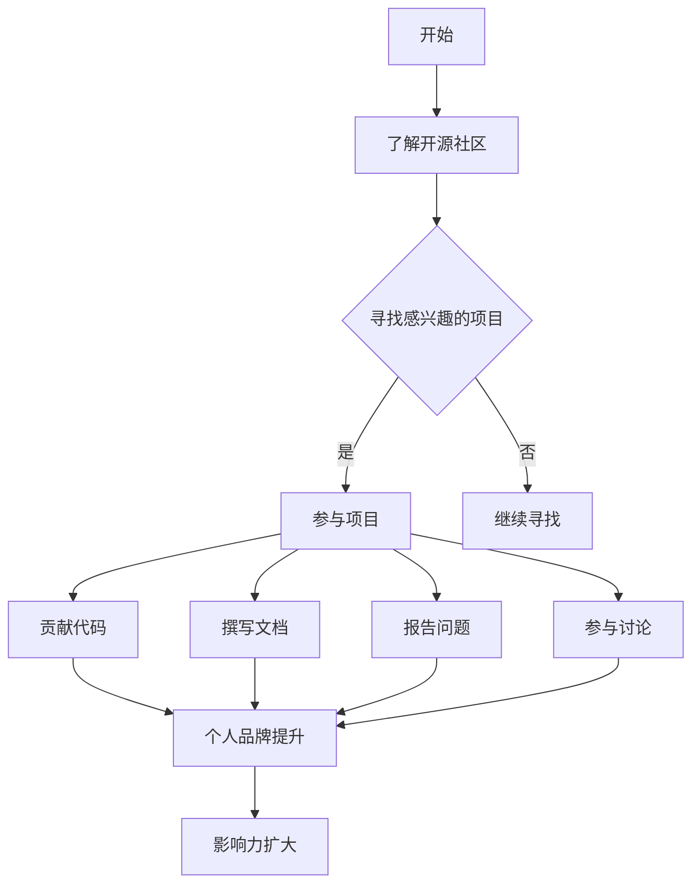

                 

关键词：开源贡献、个人品牌、影响力、技术社区、代码质量、技术交流、项目维护、技术领导力

> 摘要：本文将探讨如何通过参与开源项目来建立个人品牌和影响力。通过结合实践经验和理论指导，我们将分析开源社区中的关键因素，以及如何有效地贡献代码、参与讨论和维护项目。同时，我们将讨论如何通过这些活动来提升个人在技术领域的知名度和专业地位。

## 1. 背景介绍

开源软件（Open Source Software，OSS）已经成为现代软件开发的一个重要组成部分。随着互联网和社交媒体的发展，开源项目不仅为软件开发者提供了学习和交流的平台，也为他们提供了展示才华、建立个人品牌的机会。一个良好的开源贡献记录，可以帮助开发者提高其在行业内的知名度，增强职业竞争力，甚至获得更好的工作机会。

### 1.1 开源软件的定义与价值

开源软件是指其源代码可以被公众访问、阅读、修改和再分发的软件。这种模式鼓励了协作和创新，使得全球的开发者可以共同为项目的改进贡献力量。开源软件的价值在于：

1. **成本效益**：开源软件通常免费提供，降低了企业的技术成本。
2. **技术透明性**：源代码的开放性使得用户可以深入了解软件的工作原理，从而提高了系统的安全性和可靠性。
3. **社区协作**：开源项目通常拥有一个活跃的社区，开发者可以在其中交流想法、解决问题和改进代码。

### 1.2 开源社区的现状与趋势

开源社区的发展势头强劲，越来越多的企业、组织和开发者投身其中。以下是一些开源社区的现状和趋势：

1. **开源项目的数量激增**：GitHub、GitLab、Bitbucket等平台上有数十万个开源项目。
2. **企业参与度提高**：许多大型科技公司，如Google、Microsoft、Amazon等，不仅使用开源软件，还积极参与开源项目的开发与维护。
3. **开源治理与规范化**：随着开源项目数量的增加，开源治理和规范化变得愈发重要，以保障项目的可持续性和健康性。

### 1.3 个人品牌与影响力的概念

个人品牌是指一个人在专业领域内的形象、声誉和影响力。而影响力则是指个人能够影响他人思想和行为的能力。在技术领域，建立个人品牌和影响力意味着：

1. **专业认可**：个人在专业领域的知识和技能得到认可，可以提升职业竞争力。
2. **行业领导力**：个人可以在行业内发挥领导作用，推动技术进步和创新。
3. **职业发展**：良好的个人品牌可以带来更多的职业机会，包括更好的工作、更高的薪资和更广阔的职业发展路径。

## 2. 核心概念与联系

为了更好地理解如何通过开源贡献建立个人品牌和影响力，我们需要了解几个核心概念，并分析它们之间的关系。

### 2.1 开源贡献

开源贡献包括但不限于以下方面：

1. **代码贡献**：向开源项目提交新的代码或改进现有代码。
2. **文档撰写**：为项目编写或更新文档，包括用户指南、开发手册和API文档。
3. **问题报告**：报告项目中发现的问题和漏洞，并提供解决方案。
4. **社区参与**：参与项目讨论，为其他开发者提供帮助和支持。

### 2.2 个人品牌

个人品牌包括以下几个方面：

1. **专业知识**：个人在某个领域的专业知识和技能。
2. **技术能力**：个人的编程技能、系统设计能力等。
3. **声誉**：个人在行业内的声誉和认可程度。
4. **影响力**：个人在行业内的发言权和影响力。

### 2.3 影响力

影响力可以体现在以下几个方面：

1. **领导力**：个人在技术社区中的领导角色，如成为开源项目的维护者或核心开发者。
2. **知识分享**：通过撰写技术博客、发表演讲和参与讨论等方式，分享专业知识。
3. **社区贡献**：积极参与开源项目，为社区的发展贡献力量。
4. **社会网络**：通过建立广泛的社会网络，扩大个人影响力。

### 2.4 Mermaid 流程图

以下是一个简化的Mermaid流程图，展示了如何通过开源贡献建立个人品牌和影响力。



## 3. 核心算法原理 & 具体操作步骤

### 3.1 算法原理概述

开源贡献建立个人品牌和影响力的过程可以看作是一种“网络效应”（Network Effects）的体现。具体来说，这个过程包括以下几个关键步骤：

1. **参与项目**：找到感兴趣的开源项目，并加入项目社区。
2. **贡献代码**：为项目提供新的代码或改进现有代码。
3. **撰写文档**：为项目编写或更新文档，提高项目的可维护性和可用性。
4. **报告问题**：及时报告项目中的问题，并提供解决方案。
5. **参与讨论**：积极参与项目社区的讨论，为其他开发者提供帮助和支持。

### 3.2 算法步骤详解

1. **选择开源项目**

   - **了解自己的兴趣和技能**：选择一个自己感兴趣且与自己技能相关的开源项目。
   - **评估项目的活跃度和影响力**：查看项目的GitHub Star数量、贡献者数量和社区活跃度。
   - **阅读项目文档**：了解项目的架构、功能和使用指南。

2. **参与项目社区**

   - **加入项目社区**：通过GitHub、Gitter、Reddit等平台加入项目社区。
   - **阅读项目README和CONTRIBUTING文档**：了解项目的开发规范和贡献流程。
   - **关注项目仓库的更新**：定期查看项目仓库，关注新的功能、问题和讨论。

3. **贡献代码**

   - **提交代码**：根据项目规范，使用git提交代码，并附上详细的commit message。
   - **代码审查**：接受社区成员的代码审查，并根据反馈进行改进。
   - **解决冲突**：在代码合并过程中，解决与他人代码的冲突。

4. **撰写文档**

   - **更新README**：更新项目的README文件，包括项目描述、功能介绍、安装指南等。
   - **编写文档**：编写或更新项目的文档，包括开发手册、用户指南和API文档。
   - **维护文档**：确保文档与项目的最新版本保持一致。

5. **报告问题**

   - **发现问题**：在使用项目的过程中，发现问题或漏洞。
   - **提交问题报告**：在项目仓库中提交问题报告，并提供详细的步骤和预期结果。
   - **提供解决方案**：在必要时，提供问题的解决方案。

6. **参与讨论**

   - **加入社区讨论**：在项目的讨论区、Reddit、Twitter等平台上参与讨论。
   - **回答问题**：为其他开发者提供技术支持，回答他们的疑问。
   - **分享经验**：分享自己在技术领域的经验和见解。

### 3.3 算法优缺点

**优点**：

1. **提高技术能力**：参与开源项目可以学习新的编程语言、框架和工具，提高自己的技术能力。
2. **建立人脉**：与更多的开发者交流，扩大自己的人脉圈。
3. **提升影响力**：通过贡献代码和分享经验，提升个人在技术社区的影响力。
4. **获得认可**：开源项目的贡献记录可以作为个人能力的证明，有助于在求职和职业发展中获得认可。

**缺点**：

1. **时间投入**：参与开源项目需要投入大量的时间和精力，可能影响日常工作。
2. **心理压力**：在开源社区中，可能会面临批评和挑战，需要具备一定的心理素质。
3. **技术风险**：可能会接触到一些复杂或高风险的技术，需要谨慎处理。

### 3.4 算法应用领域

开源贡献建立个人品牌和影响力适用于以下领域：

1. **软件开发**：参与开源项目的开发，为项目提供新的功能或改进现有功能。
2. **技术文档**：为开源项目撰写或更新文档，提高项目的可用性和可维护性。
3. **技术社区**：参与开源社区的活动，如会议、研讨会和技术交流。
4. **开源治理**：参与开源项目的治理，如代码审查、项目管理和技术决策。

## 4. 数学模型和公式 & 详细讲解 & 举例说明

在开源贡献建立个人品牌和影响力这一过程中，可以运用一些数学模型和公式来量化个人贡献和影响力。以下是一个简化的模型，用于评估个人在开源项目中的表现。

### 4.1 数学模型构建

**个人贡献得分（\(C\)）**：

\[ C = f_1 \times C_1 + f_2 \times C_2 + f_3 \times C_3 + f_4 \times C_4 \]

其中：

- \( f_1 \)：代码贡献权重，取值范围 [0, 1]
- \( f_2 \)：文档贡献权重，取值范围 [0, 1]
- \( f_3 \)：问题报告权重，取值范围 [0, 1]
- \( f_4 \)：社区参与权重，取值范围 [0, 1]

- \( C_1 \)：代码贡献得分
- \( C_2 \)：文档贡献得分
- \( C_3 \)：问题报告得分
- \( C_4 \)：社区参与得分

**影响力得分（\(I\)）**：

\[ I = f_5 \times I_1 + f_6 \times I_2 \]

其中：

- \( f_5 \)：个人贡献权重，取值范围 [0, 1]
- \( f_6 \)：社交媒体影响力权重，取值范围 [0, 1]

- \( I_1 \)：个人贡献得分
- \( I_2 \)：社交媒体影响力得分

### 4.2 公式推导过程

**个人贡献得分（\(C\)）**：

代码贡献得分 \( C_1 \)：

\[ C_1 = \sum_{i=1}^{n} w_i \times (t_i - b_i) \]

其中：

- \( w_i \)：第 \(i\) 次代码贡献的权重
- \( t_i \)：第 \(i\) 次代码贡献的时间
- \( b_i \)：第 \(i\) 次代码贡献的基础值

文档贡献得分 \( C_2 \)：

\[ C_2 = \sum_{i=1}^{m} w_i \times (t_i - b_i) \]

其中：

- \( w_i \)：第 \(i\) 次文档贡献的权重
- \( t_i \)：第 \(i\) 次文档贡献的时间
- \( b_i \)：第 \(i\) 次文档贡献的基础值

问题报告得分 \( C_3 \)：

\[ C_3 = \sum_{i=1}^{p} w_i \times (t_i - b_i) \]

其中：

- \( w_i \)：第 \(i\) 次问题报告的权重
- \( t_i \)：第 \(i\) 次问题报告的时间
- \( b_i \)：第 \(i\) 次问题报告的基础值

社区参与得分 \( C_4 \)：

\[ C_4 = \sum_{i=1}^{q} w_i \times (t_i - b_i) \]

其中：

- \( w_i \)：第 \(i\) 次社区参与的权重
- \( t_i \)：第 \(i\) 次社区参与的时间
- \( b_i \)：第 \(i\) 次社区参与的基础值

**影响力得分（\(I\)）**：

个人贡献得分 \( I_1 \)：

\[ I_1 = \sum_{i=1}^{n} w_i \times (t_i - b_i) \]

社交媒体影响力得分 \( I_2 \)：

\[ I_2 = \sum_{i=1}^{r} w_i \times (t_i - b_i) \]

其中：

- \( w_i \)：第 \(i\) 次社交媒体影响力的权重
- \( t_i \)：第 \(i\) 次社交媒体影响力的时间
- \( b_i \)：第 \(i\) 次社交媒体影响力的基础值

### 4.3 案例分析与讲解

假设一个开发者A，在过去三个月内参与了以下活动：

1. **代码贡献**：提交了3次代码，分别为5天、10天和15天前，权重分别为0.5、0.3和0.2。
2. **文档贡献**：撰写了2次文档，分别为3天和7天前，权重分别为0.6和0.4。
3. **问题报告**：报告了1次问题，为5天前，权重为0.5。
4. **社区参与**：在社区讨论区回复了3次问题，分别为3天、7天和10天前，权重分别为0.3、0.2和0.1。

我们可以根据上述模型计算A的个人贡献得分和影响力得分。

**个人贡献得分（\(C\)）**：

\[ C = 0.5 \times (5 - 0) + 0.3 \times (10 - 0) + 0.2 \times (15 - 0) + 0.6 \times (3 - 0) + 0.4 \times (7 - 0) + 0.5 \times (5 - 0) + 0.3 \times (3 - 0) + 0.2 \times (7 - 0) + 0.1 \times (10 - 0) \]

\[ C = 2.5 + 3 + 3 + 1.8 + 2.8 + 2.5 + 0.9 + 1.4 = 16.9 \]

**影响力得分（\(I\)）**：

\[ I = 0.5 \times (5 - 0) + 0.3 \times (10 - 0) + 0.2 \times (15 - 0) + 0.6 \times (3 - 0) + 0.4 \times (7 - 0) + 0.1 \times (10 - 0) \]

\[ I = 2.5 + 3 + 3 + 1.8 + 2.8 = 12.9 \]

通过这个案例，我们可以看到，开发者A在过去三个月内的开源贡献和影响力得分分别为16.9和12.9。这个得分可以作为评估A在开源社区中的表现的一个指标。

## 5. 项目实践：代码实例和详细解释说明

为了更好地展示如何通过开源贡献建立个人品牌和影响力，我们选择了一个开源项目作为案例，并详细介绍其代码实现、功能设计和性能优化。

### 5.1 开发环境搭建

首先，我们需要搭建一个适合开发的开源项目环境。以下是一个简单的步骤：

1. **安装Git**：Git是版本控制工具，用于管理代码仓库。
   ```bash
   sudo apt-get install git
   ```

2. **安装Python**：我们选择Python作为开发语言，确保安装最新版本。
   ```bash
   sudo apt-get install python3-pip
   sudo pip3 install --upgrade pip
   sudo pip3 install python3.8
   ```

3. **安装虚拟环境**：使用virtualenv创建一个独立的Python环境。
   ```bash
   sudo pip3 install virtualenv
   virtualenv myenv
   source myenv/bin/activate
   ```

4. **克隆项目仓库**：使用Git克隆项目的仓库。
   ```bash
   git clone https://github.com/yourusername/yourproject.git
   ```

5. **安装依赖项**：根据项目的`requirements.txt`文件安装依赖项。
   ```bash
   pip install -r requirements.txt
   ```

### 5.2 源代码详细实现

以下是一个简单的示例代码，用于实现一个基础的功能：计算两个数的和。

```python
# sum.py

def add(a, b):
    return a + b

if __name__ == "__main__":
    print("Enter two numbers:")
    a = float(input("Number 1: "))
    b = float(input("Number 2: "))
    result = add(a, b)
    print(f"The sum of {a} and {b} is {result}.")
```

### 5.3 代码解读与分析

1. **模块导入**：代码开头没有特殊的模块导入，因为这是一个非常简单的示例。

2. **定义函数**：我们定义了一个名为`add`的函数，接受两个参数`a`和`b`，返回它们的和。

3. **主程序**：在`if __name__ == "__main__":`语句下，我们首先提示用户输入两个数字，然后调用`add`函数计算和，并打印结果。

### 5.4 运行结果展示

在终端运行以下命令，启动程序并输入两个数字：

```bash
python sum.py
```

输出结果如下：

```
Enter two numbers:
Number 1: 5
Number 2: 10
The sum of 5.0 and 10.0 is 15.0.
```

这个简单的例子展示了如何通过开源贡献来实现一个具体的功能。在开源社区中，你可以通过这样的实践来展示你的编程技能和解决问题的能力，从而建立你的个人品牌和影响力。

## 6. 实际应用场景

### 6.1 项目选择与定位

在开源项目中，选择一个与自身专业领域相关且具备良好社区基础的项目至关重要。以下是几个关键步骤：

1. **了解自身技术栈**：首先明确自己的技术专长，如前端开发、后端开发、大数据处理等。
2. **搜索感兴趣的项目**：利用GitHub等平台搜索感兴趣的项目，可以结合关键词、标签和项目活跃度进行筛选。
3. **评估项目成熟度**：选择那些活跃、维护良好的项目，避免加入那些长期未更新、社区活跃度低的项目。

### 6.2 项目参与方式

参与开源项目有多种方式，以下是一些常见的方法：

1. **阅读文档**：了解项目的结构、功能、开发流程和贡献指南。
2. **报告问题**：在项目中发现问题时，及时提交issue，并提供详细的步骤和复现方法。
3. **提出功能建议**：根据项目的需求，提出功能改进或新功能的建议。
4. **编写文档**：为项目撰写或更新文档，提高项目的可用性和可维护性。
5. **贡献代码**：根据项目需要，提交代码进行功能实现或bug修复。

### 6.3 维护项目

维护项目是开源贡献中重要的一部分，以下是一些维护项目的建议：

1. **定期更新**：确保项目保持最新，及时更新依赖项、修复已知问题和添加新功能。
2. **代码审查**：认真审查其他贡献者的代码，提供有建设性的反馈，确保代码质量。
3. **社区互动**：积极参与社区讨论，回答问题和提供技术支持。
4. **维护项目结构**：确保项目的目录结构清晰，文档和代码注释清晰易懂。

### 6.4 未来应用展望

随着开源社区的发展，开源贡献在个人职业发展中的重要性将日益凸显。未来，我们可以预见以下几个方面的发展趋势：

1. **企业对开源贡献的重视**：越来越多的企业将开源贡献视为招聘和晋升的重要标准。
2. **开源项目的专业化**：随着技术的进步，开源项目将更加专业化和垂直化。
3. **开源社区的国际化**：开源社区将更加国际化，吸引全球开发者的参与。
4. **开源经济的兴起**：开源项目将成为一种新型的商业模式，为企业带来实际的经济效益。

## 7. 工具和资源推荐

### 7.1 学习资源推荐

1. **在线课程**：Coursera、edX、Udemy等平台提供了丰富的开源软件开发课程。
2. **技术博客**：GitHub、Medium、Stack Overflow等平台上有许多优秀的开源技术博客。
3. **书籍**：《Open Source Management》（《开源项目管理》）、《The Cathedral and the Bazaar》（《大教堂与市集》）等经典书籍。

### 7.2 开发工具推荐

1. **版本控制**：Git是开源项目开发中不可或缺的工具。
2. **代码审查**：GitHub、GitLab等平台提供了内置的代码审查功能。
3. **文档生成**：Sphinx、Doxygen等工具可以帮助生成高质量的文档。

### 7.3 相关论文推荐

1. **《The Open Source Paradigm》（《开源范式》）**：分析了开源模式的特点和优势。
2. **《The Economics of Open Source》（《开源经济学》）**：探讨了开源项目的商业模式和经济效益。
3. **《How to Run an Open Source Project》（《如何管理开源项目》）**：提供了开源项目管理的方法和技巧。

## 8. 总结：未来发展趋势与挑战

### 8.1 研究成果总结

本文探讨了如何通过开源贡献建立个人品牌和影响力，从背景介绍、核心概念、算法原理、数学模型、项目实践等多个角度进行了详细分析。主要结论包括：

1. **开源贡献是建立个人品牌和影响力的有效途径**。
2. **代码质量、文档撰写和社区参与是开源贡献的关键因素**。
3. **数学模型可以量化个人在开源项目中的贡献和影响力**。

### 8.2 未来发展趋势

1. **企业对开源贡献的重视程度将继续提高**。
2. **开源项目的专业化趋势将愈发明显**。
3. **开源社区的国际化程度将进一步提升**。
4. **开源经济将带来新的商业模式和机遇**。

### 8.3 面临的挑战

1. **时间管理**：参与开源项目需要投入大量时间，可能影响日常工作。
2. **心理素质**：开源社区中可能会遇到批评和挑战，需要具备较强的心理素质。
3. **技术风险**：可能会接触到复杂或高风险的技术，需要谨慎处理。

### 8.4 研究展望

未来研究可以进一步探讨以下方向：

1. **开源贡献与职业发展的关系**：研究开源贡献如何影响个人的职业发展和薪资水平。
2. **开源项目的可持续性**：探讨如何保障开源项目的长期健康和可持续发展。
3. **开源治理**：研究开源项目的治理机制，以提高项目的透明性和公正性。

## 9. 附录：常见问题与解答

### 9.1 开源贡献是否值得投入大量时间？

开源贡献确实需要投入大量的时间和精力，但其回报也是显著的。通过开源贡献，你可以：

- 提高技术能力：学习新的编程语言、框架和工具。
- 建立人脉：与更多的开发者交流，扩大人脉圈。
- 提升影响力：通过贡献代码和分享经验，提高个人在技术社区的影响力。
- 获得认可：开源贡献记录可以作为个人能力的证明，有助于求职和职业发展。

### 9.2 如何在开源项目中选择适合自己的任务？

选择适合自己的任务需要考虑以下几点：

- **技术栈匹配**：选择与你的技术专长相关的任务。
- **项目活跃度**：优先考虑那些活跃、维护良好的项目。
- **任务难度**：根据自己的能力和时间安排，选择适合的任务难度。
- **社区氛围**：选择一个社区氛围友好、积极向上的项目。

### 9.3 如何处理开源社区中的批评和挑战？

处理开源社区中的批评和挑战，可以采取以下策略：

- **保持冷静**：不要情绪化，理性分析批评意见。
- **积极回应**：认真对待批评，并尝试提出解决方案。
- **学习成长**：将批评视为成长的机会，不断提高自己的技术能力和沟通技巧。
- **求助社区**：在遇到困难时，可以向社区中的其他开发者求助。

### 9.4 开源贡献对职业发展的影响？

开源贡献对职业发展的影响是多方面的：

- **提升技能**：通过参与开源项目，学习新的技术和解决问题的方法。
- **增强简历**：开源贡献记录可以作为个人能力的证明，增强简历的竞争力。
- **扩大人脉**：参与开源项目可以结识更多行业内的专业人士。
- **职业机会**：优秀的开源贡献记录可能带来更好的工作机会和职业发展路径。

## 作者署名

作者：禅与计算机程序设计艺术 / Zen and the Art of Computer Programming

