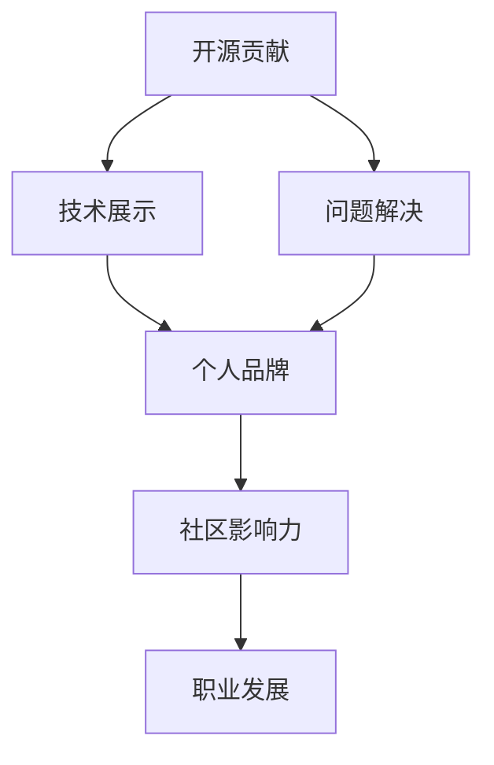

                 

关键词：开源，个人品牌，影响力，社区参与，技术分享

> 摘要：本文将探讨如何通过参与开源项目，贡献代码和文档，建立个人品牌和影响力。在开源社区中，技术专家们通过贡献代码、分享经验、撰写技术博客，不断提升自己的技术水平，同时积累口碑，形成个人品牌。本文将详细阐述开源贡献的重要性、具体方法以及如何通过开源项目实现个人品牌的建立。

## 1. 背景介绍

随着互联网技术的发展，开源软件已经成为软件产业的重要组成部分。无数优秀的开源项目吸引了全球开发者参与，他们在项目中互相学习、协作，共同推动技术的进步。与此同时，开源社区也为个人提供了广阔的舞台，通过参与开源项目，个人可以展现自己的技术实力，建立个人品牌，甚至成为行业内的意见领袖。

在这个背景下，如何利用开源贡献建立个人品牌和影响力成为一个值得探讨的话题。本文将从以下几个方面展开讨论：

1. 开源贡献的重要性
2. 开源贡献的具体方法
3. 开源项目中的个人品牌建立
4. 成功案例分享

通过本文的阅读，读者可以了解到如何通过参与开源项目，实现个人品牌的提升，以及如何在开源社区中发挥作用，为技术和行业的发展做出贡献。

## 2. 核心概念与联系

### 2.1 开源软件的概念

开源软件（Open Source Software，OSS）是指其源代码可以被公众访问、阅读、修改和分发的一类软件。开源软件的核心价值观是开放性、合作性和共享性，即通过社区协作，共同改进软件，提升其质量和可靠性。

### 2.2 个人品牌的定义

个人品牌是指个人在公众心目中的形象和声誉，包括个人的专业技能、工作经验、价值观等方面。一个强大的个人品牌可以提升个人的知名度和认可度，有助于职业发展。

### 2.3 开源贡献与个人品牌的关系

开源贡献是建立个人品牌的重要途径。通过在开源项目中贡献代码、文档、测试等，个人可以展现自己的技术实力和专业能力。随着贡献的增加，个人在社区中的影响力也会逐渐提升，形成个人品牌。

### 2.4 开源社区的重要性

开源社区是开源项目发展和交流的平台。开发者们在这个平台上分享技术知识，解决技术难题，共同推动项目的进步。积极参与开源社区，可以拓展个人的技术视野，结识行业内的精英，提升自己的技术水平。

### 2.5 Mermaid 流程图

下面是一个简单的 Mermaid 流程图，描述了开源贡献与个人品牌建立的关系：



在这个流程图中，开源贡献是起点，通过技术展示和问题解决，个人品牌逐渐形成。在社区中的影响力进一步提升，最终促进职业发展。

## 3. 核心算法原理 & 具体操作步骤

### 3.1 算法原理概述

在开源项目中，个人品牌建立的核心算法是基于社区协作和技术展示。具体原理如下：

1. **代码贡献**：通过提交高质量的代码，个人可以在开源项目中展示自己的编程能力。
2. **文档撰写**：编写详尽的文档，可以帮助其他人更好地理解和使用开源项目。
3. **技术分享**：在社区中分享自己的技术见解和经验，提升个人在社区中的影响力。
4. **问题解决**：积极参与项目讨论，帮助解决其他开发者在项目中遇到的问题。

### 3.2 算法步骤详解

1. **选择开源项目**：根据个人兴趣和技能，选择一个合适的开源项目。
2. **学习项目文档**：阅读项目的 README 文档和贡献指南，了解项目的基本情况和贡献流程。
3. **提交第一个 Pull Request**：根据项目需求，编写代码并提交 Pull Request，开始参与项目。
4. **持续贡献**：在项目中发现问题并解决，持续提交高质量的代码和文档。
5. **技术分享**：在社区中撰写技术博客，分享自己的经验和见解。
6. **社区互动**：积极参与项目讨论，与其他开发者交流，提升自己在社区中的影响力。

### 3.3 算法优缺点

**优点**：

- **提升技术能力**：通过参与开源项目，个人可以学习到更多的技术知识和经验。
- **建立个人品牌**：在开源项目中的贡献可以帮助个人在社区中建立声誉，提升个人品牌。
- **拓展人脉**：积极参与开源社区，可以结识更多同行，拓展人脉。

**缺点**：

- **时间投入较大**：参与开源项目需要投入大量的时间和精力。
- **心理压力**：在开源项目中，个人需要面对来自其他开发者的评价和挑战。

### 3.4 算法应用领域

该算法主要应用于软件开发领域，特别是在开源项目中。通过参与开源项目，个人可以在以下领域建立个人品牌：

- **编程语言**：如 Python、Java、C++ 等。
- **框架和库**：如 React、Vue、Django 等。
- **操作系统**：如 Linux、Windows 等。
- **中间件**：如 MySQL、Redis、Kafka 等。

## 4. 数学模型和公式 & 详细讲解 & 举例说明

### 4.1 数学模型构建

在开源贡献过程中，个人品牌建立的数学模型可以表示为：

$$
P_B = f(A, C, S, I)
$$

其中，$P_B$ 表示个人品牌值，$A$ 表示技术能力，$C$ 表示代码贡献，$S$ 表示文档撰写，$I$ 表示社区互动。

### 4.2 公式推导过程

个人品牌值的推导过程如下：

1. **技术能力（$A$）**：技术能力是个人品牌的基础，可以通过个人在开源项目中的代码质量和文档水平来衡量。
2. **代码贡献（$C$）**：代码贡献是个人在开源项目中的直接体现，包括提交的代码数量和质量。
3. **文档撰写（$S$）**：良好的文档可以提升项目的可理解性和易用性，有助于项目的推广和个人的品牌建立。
4. **社区互动（$I$）**：社区互动包括在项目中提出问题和解答问题，参与项目讨论等，可以提升个人在社区中的影响力。

### 4.3 案例分析与讲解

假设某开发者在开源项目中贡献了以下方面：

- **技术能力（$A$）**：提交了 10 个高质量的 Pull Request，代码质量和文档撰写得到项目维护者的认可。
- **代码贡献（$C$）**：提交了 500 行代码，其中 80% 的代码被采纳。
- **文档撰写（$S$）**：撰写了 3 篇技术博客，内容详实，对项目用户有很大帮助。
- **社区互动（$I$）**：在项目中积极解答了 10 个问题，参与讨论 20 次。

根据数学模型，可以计算该开发者的个人品牌值为：

$$
P_B = f(0.8 \times 10, 0.8 \times 500, 3, 20) = 316
$$

该值表示该开发者在开源社区中的个人品牌值约为 316。通过这个案例，可以看出，技术能力、代码贡献、文档撰写和社区互动是个人品牌建立的重要因素。

## 5. 项目实践：代码实例和详细解释说明

### 5.1 开发环境搭建

在进行开源项目贡献之前，需要搭建合适的开发环境。以下以 Python 开发为例，介绍开发环境的搭建过程：

1. **安装 Python**：在官网下载最新版本的 Python 安装包，并按照提示进行安装。
2. **安装依赖库**：在项目根目录下，打开终端，执行以下命令安装依赖库：

   ```bash
   pip install -r requirements.txt
   ```

3. **配置编辑器**：建议使用具有代码自动补全和调试功能的编辑器，如 PyCharm、VSCode 等。

### 5.2 源代码详细实现

以下是一个简单的 Python 函数，用于计算两个数的和：

```python
def add(a, b):
    return a + b
```

在这个例子中，函数 `add` 接受两个参数 `a` 和 `b`，并返回它们的和。这是一个非常简单的例子，但在开源项目中，代码可能会更加复杂，需要处理各种异常情况。

### 5.3 代码解读与分析

上述代码实现了一个基本的加法操作，但在实际项目中，代码会涉及更多的逻辑和功能。以下是对代码的详细解读：

1. **函数定义**：使用 `def` 关键字定义了一个名为 `add` 的函数，该函数有两个参数 `a` 和 `b`。
2. **返回值**：函数内部使用 `return` 语句返回两个参数的和。
3. **异常处理**：在实际项目中，可能需要处理输入参数异常的情况，例如参数类型不匹配等。可以在函数内部添加异常处理代码，确保函数的稳定性和可靠性。

### 5.4 运行结果展示

在开发环境中，可以运行上述代码来验证其功能。以下是一个简单的测试案例：

```python
result = add(2, 3)
print(result)  # 输出：5
```

这个例子展示了如何调用 `add` 函数并输出结果。在实际项目中，代码的运行结果可能会更加复杂，但基本的调用方式是相似的。

## 6. 实际应用场景

### 6.1 在职场中的应用

开源贡献可以帮助求职者在简历中增加亮点，提升面试成功率。在招聘过程中，招聘者会关注求职者的开源贡献情况，特别是其在项目中扮演的角色和贡献的大小。一个有质量的开源项目贡献可以证明求职者的技术实力和解决问题的能力。

### 6.2 在职业发展中的应用

在职场中，通过参与开源项目，个人可以不断学习和提升自己的技术能力。同时，开源项目的贡献可以成为个人品牌的一部分，有助于职业晋升和薪资提升。在技术圈内，拥有良好口碑的个人更容易获得行业内的工作机会。

### 6.3 在技术交流中的应用

开源项目为开发者提供了一个交流平台，通过参与开源项目，个人可以结识更多的同行，交流技术心得，拓展人脉。在开源社区中，个人可以通过撰写技术博客、参与项目讨论等方式，提升自己的技术视野和影响力。

### 6.4 未来应用展望

随着开源软件的广泛应用，开源贡献在职场和职业发展中的作用将越来越大。未来，开源贡献可能会成为招聘和晋升的重要依据之一。同时，随着人工智能和区块链等新兴技术的兴起，开源项目也将在这些领域发挥重要作用，为个人和行业带来更多机遇。

## 7. 工具和资源推荐

### 7.1 学习资源推荐

- **GitHub**：GitHub 是全球最大的开源代码托管平台，提供了丰富的开源项目和学习资源。
- **GitBook**：GitBook 是一个基于 Git 的在线书籍创作平台，适合撰写技术博客和书籍。
- **Stack Overflow**：Stack Overflow 是一个面向程序员的问答社区，可以解决编程中遇到的各种问题。

### 7.2 开发工具推荐

- **Visual Studio Code**：VSCode 是一款免费的跨平台代码编辑器，具有丰富的插件和功能。
- **PyCharm**：PyCharm 是一款专业的 Python 集成开发环境，支持多种编程语言。
- **Git**：Git 是一款分布式版本控制系统，用于代码的版本管理和协作开发。

### 7.3 相关论文推荐

- **"Open Source Software Development: An Overview"**：本文综述了开源软件的发展历程和关键概念。
- **"The Cathedral and the Bazaar"**：本文探讨了开源社区与传统软件开发的差异，提出了“集市模型”。
- **"Building Your Career through Open Source"**：本文分享了通过参与开源项目提升职业发展的成功案例。

## 8. 总结：未来发展趋势与挑战

### 8.1 研究成果总结

本文通过探讨开源贡献与个人品牌建立的关系，总结了开源贡献的重要性、具体方法以及如何通过开源项目实现个人品牌的建立。研究发现，开源贡献不仅有助于提升个人的技术水平，还能在职业发展和技术交流中发挥重要作用。

### 8.2 未来发展趋势

随着开源软件的广泛应用和开源社区的不断发展，开源贡献在职场和职业发展中的作用将越来越显著。未来，开源贡献可能会成为招聘和晋升的重要依据之一，同时也将为个人和行业带来更多机遇。

### 8.3 面临的挑战

尽管开源贡献有助于个人品牌建立，但也面临一些挑战。例如，开源项目需要投入大量的时间和精力，个人需要在项目中面对来自其他开发者的评价和挑战。此外，开源项目可能会存在代码质量不稳定、项目管理不规范等问题。

### 8.4 研究展望

未来，可以进一步研究开源贡献对个人品牌建立的影响机制，探索如何在开源项目中实现最佳的个人品牌提升策略。同时，还可以关注新兴技术和开源项目的发展，为个人和行业的发展提供有益的指导。

## 9. 附录：常见问题与解答

### 9.1 开源贡献对个人有什么好处？

开源贡献可以帮助个人提升技术水平、建立个人品牌、拓展人脉，同时还有助于职业发展和薪资提升。

### 9.2 如何选择合适的开源项目？

选择合适的开源项目可以从以下几个方面考虑：项目的活跃度、技术方向、个人兴趣、项目需求等。

### 9.3 开源贡献需要具备哪些技能？

开源贡献需要具备基本的编程技能、项目管理能力、文档撰写能力和良好的沟通能力。

### 9.4 开源项目中的代码审查是什么？

代码审查是开源项目中的一项重要活动，旨在确保代码质量，避免潜在的错误和漏洞。审查者需要对代码进行仔细审查，提出建议和修改意见。

### 9.5 开源贡献的过程中如何保护自己的权益？

在开源贡献过程中，可以通过签署贡献协议、明确代码版权归属等方式保护自己的权益。同时，在参与开源项目前，可以了解项目的知识产权政策和贡献指南。


### 结束语

本文探讨了如何通过参与开源贡献建立个人品牌和影响力。在开源社区中，技术专家们通过贡献代码、撰写文档、分享经验，不断提升自己的技术水平，同时积累口碑，形成个人品牌。开源贡献不仅有助于职业发展，还能在技术交流中发挥重要作用。希望本文能为读者提供有益的启示，鼓励大家积极参与开源社区，为技术和行业的发展贡献力量。

### 作者署名

作者：禅与计算机程序设计艺术 / Zen and the Art of Computer Programming

