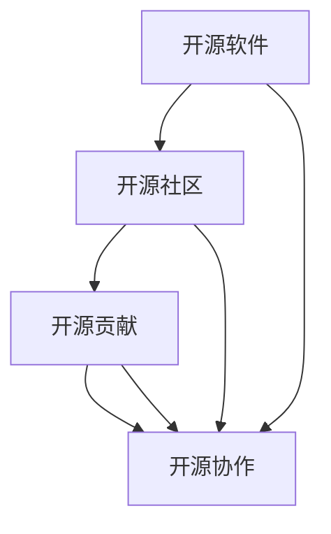
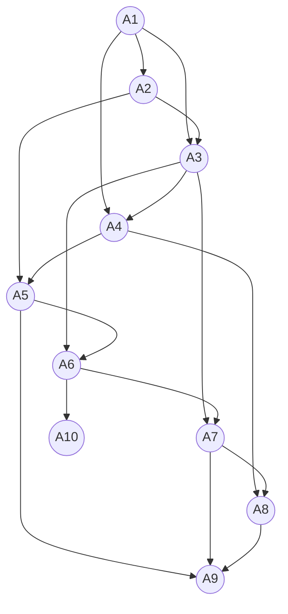

                 

关键词：开源贡献、职业发展、技术能力、协作、社区影响力

> 摘要：随着开源技术的蓬勃发展，参与开源项目已经成为技术人员提升自身职业发展空间的重要途径。本文将探讨如何通过开源贡献，提高个人技术能力、建立专业人脉、增强社区影响力，并最终实现职业发展的全面提升。

## 1. 背景介绍

开源软件（Open Source Software, OSS）是一种软件开发模式，其源代码可以被公众自由访问、学习、修改和分发。开源运动自20世纪90年代兴起以来，已经逐渐成为全球软件开发的主流。众多知名软件，如Linux操作系统、Apache Web服务器、MySQL数据库等，都是开源项目成功的典范。开源不仅仅是一种技术模式，更是一种文化、一种生态。

在开源社区中，个人参与开源项目的方式多种多样。从代码贡献、文档编写到Bug报告、社区活动等，每一个环节都是提升个人技术能力和职业发展的重要途径。同时，开源社区也为技术人员提供了展示才华、建立人脉、增强影响力的平台。

本文将围绕以下三个方面展开讨论：

1. 开源贡献的核心概念与联系
2. 开源贡献的具体操作步骤与技巧
3. 开源贡献对职业发展的影响与展望

通过本文的探讨，希望能够帮助读者更好地理解开源贡献的价值，以及如何在开源项目中实现个人职业发展的提升。

## 2. 核心概念与联系

要深入理解开源贡献，我们首先需要了解几个核心概念，并分析它们之间的联系。以下是本文将涉及的一些关键概念：

### 2.1 开源软件（OSS）

开源软件是指源代码可以公开访问、自由使用和修改的软件。它通常附带一个开源协议，规定了软件的版权和使用条件。常见的开源协议包括GPL（GNU General Public License）、Apache License 2.0、MIT License等。开源软件鼓励社区成员共同参与，共同改进项目。

### 2.2 开源社区（Open Source Community）

开源社区是由一群共同关心某个开源项目的开发者、贡献者和用户组成的群体。社区成员通过贡献代码、编写文档、参与讨论等方式，共同推动项目的进步。开源社区具有开放性、透明性和协作性等特点，有助于知识和技术的快速传播和共享。

### 2.3 开源贡献（Open Source Contribution）

开源贡献是指个人或团队在开源项目中所做的任何有意义的贡献。这些贡献可以是代码的提交、文档的编写、Bug的报告、测试的执行、社区的参与等。开源贡献不仅提升了项目的质量，也促进了个人技能的提升和职业发展。

### 2.4 开源协作（Open Source Collaboration）

开源协作是指开源社区成员之间通过协作完成项目任务的过程。协作可以是线上或线下的，形式多样，如代码评审、Pull Request、社区讨论等。通过协作，团队成员可以互相学习、交流经验，共同推动项目的进展。

### 2.5 核心概念联系

上述概念之间存在着紧密的联系。开源软件是开源社区的基础，开源社区为开源贡献提供了平台和氛围，而开源贡献则反过来促进了开源软件的进步。开源协作贯穿于整个开源项目的生命周期，是开源社区的核心活动。

下图是这些概念之间的Mermaid流程图，展示了它们之间的相互关系：



通过以上核心概念的联系，我们可以更好地理解开源贡献在技术发展和职业发展中的重要性。

## 3. 核心算法原理 & 具体操作步骤

### 3.1 算法原理概述

开源贡献的核心在于协作和共享，这可以类比于某些经典算法的原理，如MapReduce。MapReduce是一种分布式数据处理框架，通过Map和Reduce两个阶段，将复杂的数据处理任务分解为多个简单任务并行执行，从而提高数据处理效率。

在开源贡献中，我们也可以将个人技能和知识视为“数据”，通过“协作”和“共享”这两个阶段，实现个人技能的提升和知识的传播。Map阶段可以理解为贡献者将自己的技能和知识应用到开源项目中，而Reduce阶段则是对这些贡献进行整合和优化，以提升项目的整体质量。

### 3.2 算法步骤详解

下面详细描述开源贡献的具体操作步骤：

#### 3.2.1 了解开源项目

首先，需要选择一个合适的开源项目。可以通过GitHub、GitLab等平台查找感兴趣的项目。选择项目时，可以考虑以下因素：

- 项目活跃度：项目是否有稳定的更新和活跃的社区。
- 技能匹配：项目是否与自己的技能和兴趣相符。
- 贡献难度：项目的贡献门槛是否适中。

#### 3.2.2 学习项目文档

在确定好项目后，需要仔细阅读项目的文档，包括README、CONTRIBUTING、README.md等，这些文档通常会提供项目的背景信息、使用指南、贡献指南等。

#### 3.2.3 参与社区讨论

在了解项目文档后，可以尝试参与项目的社区讨论。可以通过项目官方的论坛、邮件列表、聊天室等渠道，与社区成员进行交流。参与讨论有助于了解项目的最新动态、发现问题并提供建议。

#### 3.2.4 提交代码贡献

在确认自己的贡献有助于项目后，可以开始提交代码贡献。以下是提交代码的基本步骤：

1. **Fork项目**：在GitHub等平台上，Fork项目可以将项目复制到一个自己的仓库中。
2. **创建分支**：在本地仓库中创建一个新的分支，以避免影响到主分支的代码。
3. **编写代码**：在分支上编写自己的代码，并进行充分的测试。
4. **提交代码**：将分支中的代码提交到自己的仓库。
5. **创建Pull Request**：在项目仓库中创建一个Pull Request，将分支与主分支进行关联。
6. **代码评审**：等待项目维护者对Pull Request进行评审，并根据反馈进行代码调整。

#### 3.2.5 其他贡献形式

除了代码贡献，还可以通过文档编写、Bug报告、社区活动等方式参与开源项目。文档编写可以帮助其他开发者更好地理解项目，Bug报告可以提升项目的稳定性，社区活动则有助于建立专业人脉。

### 3.3 算法优缺点

#### 优点：

1. **技能提升**：通过参与开源项目，可以学习到新的技术和解决问题的方法。
2. **职业发展**：开源贡献可以增强个人简历，提升求职竞争力。
3. **社区影响力**：在开源项目中积累经验和贡献，有助于提升个人在技术社区的影响力。
4. **知识共享**：开源贡献促进了知识的传播和共享，有助于整个技术生态的发展。

#### 缺点：

1. **时间投入**：开源贡献需要一定的时间和精力投入。
2. **学习曲线**：初学者可能需要花费较长的时间来了解项目和适应社区。
3. **代码质量**：初次提交的代码可能存在质量问题，需要接受社区的反馈和改进。

### 3.4 算法应用领域

开源贡献的应用领域非常广泛，几乎涵盖了所有技术领域。以下是几个典型的应用领域：

1. **软件开发**：开源项目是软件开发的重要基础，如Linux操作系统、Apache Web服务器等。
2. **数据分析**：开源项目在数据分析领域也有广泛应用，如Python的数据科学库、R语言等。
3. **人工智能**：许多人工智能开源框架，如TensorFlow、PyTorch等，都是由全球开发者共同维护和优化的。
4. **云计算与大数据**：开源项目在云计算和大数据领域也非常重要，如Apache Hadoop、OpenStack等。

通过以上算法原理和具体操作步骤的讲解，读者可以更好地理解开源贡献的过程和方法，从而在实际操作中运用这些原理和步骤，提升个人技术能力和职业发展空间。

## 4. 数学模型和公式 & 详细讲解 & 举例说明

在开源贡献中，数学模型和公式可以用于分析和优化贡献过程，提高效率和质量。以下是几个关键的数学模型和公式，以及它们的详细讲解和举例说明。

### 4.1 数学模型构建

开源贡献的数学模型可以基于网络科学和博弈论。以下是一个简化的模型：

#### 4.1.1 网络科学模型

在开源项目中，贡献者可以视为节点，节点之间的协作和互动可以视为边的连接。网络的度数、聚类系数、平均路径长度等指标可以用来衡量社区的协作强度和紧密程度。

公式如下：

\[ C = \frac{2m}{n(n-1)} \]

其中，\( C \) 是聚类系数，\( m \) 是边的数量，\( n \) 是节点的数量。

举例说明：

假设一个开源项目有10个贡献者，他们之间形成了20条边。那么，该项目的聚类系数为：

\[ C = \frac{2 \times 20}{10 \times (10-1)} = 0.4 \]

聚类系数为0.4，表明该社区较为紧密，协作性较高。

#### 4.1.2 博弈论模型

在开源协作中，每个贡献者都有不同的策略，如贡献代码、参与讨论、提供反馈等。博弈论可以用于分析不同策略的收益和风险。

公式如下：

\[ U_i = \sum_{j \in N(i)} R_{ij} \cdot p_j \]

其中，\( U_i \) 是贡献者 \( i \) 的效用，\( R_{ij} \) 是策略 \( j \) 在状态 \( i \) 下的收益，\( p_j \) 是策略 \( j \) 的概率。

举例说明：

假设有两个贡献者 \( A \) 和 \( B \)，他们可以选择贡献代码或参与讨论。在不同状态下的收益如下：

| 状态 | 贡献代码 | 参与讨论 |
| ---- | -------- | -------- |
| \( A \) 贡献代码 | 5 | 3 |
| \( B \) 贡献代码 | 3 | 5 |
| \( A \) 参与讨论 | 3 | 5 |
| \( B \) 参与讨论 | 5 | 3 |

在均等概率下，贡献者 \( A \) 的效用为：

\[ U_A = (5+3) \times \frac{1}{2} + (3+5) \times \frac{1}{2} = 4.5 \]

### 4.2 公式推导过程

#### 4.2.1 聚类系数的推导

聚类系数 \( C \) 反映了网络中节点之间连接的紧密程度。其推导过程如下：

1. 计算网络中所有节点的度数 \( k_i \)。
2. 对于每个节点 \( i \)，计算其邻接节点 \( j \) 的度数之和 \( \sum_{j \in N(i)} k_j \)。
3. 计算网络中边的数量 \( m \)。
4. 将上述结果代入公式 \( C = \frac{2m}{n(n-1)} \)。

#### 4.2.2 效用的推导

效用 \( U_i \) 的推导基于博弈论的期望效用理论。其推导过程如下：

1. 确定每个状态 \( i \) 和每个策略 \( j \) 的收益 \( R_{ij} \)。
2. 计算每个策略的概率 \( p_j \)。
3. 将收益和概率代入效用公式 \( U_i = \sum_{j \in N(i)} R_{ij} \cdot p_j \)。

### 4.3 案例分析与讲解

以下是一个实际案例，通过数学模型和公式对开源贡献过程进行分析。

#### 案例背景

假设某个开源项目的贡献者有10人，他们之间的协作网络如下图所示：



#### 案例分析

1. **聚类系数计算**：

   - 节点度数：\( k_1 = 4, k_2 = 3, k_3 = 5, k_4 = 3, k_5 = 3, k_6 = 4, k_7 = 4, k_8 = 2, k_9 = 3, k_{10} = 3 \)
   - 边的数量：\( m = 15 \)
   - 节点数量：\( n = 10 \)

   聚类系数 \( C \) 为：

   \[ C = \frac{2 \times 15}{10 \times (10-1)} = 0.3 \]

   聚类系数为0.3，表明该社区协作性一般。

2. **效用计算**：

   - 状态和策略：如前文所述，有贡献代码和参与讨论两种策略。
   - 收益矩阵：

   | 状态 | 贡献代码 | 参与讨论 |
   | ---- | -------- | -------- |
   | \( A1 \) 贡献代码 | 4 | 2 |
   | \( A1 \) 参与讨论 | 2 | 4 |
   | \( A2 \) 贡献代码 | 2 | 3 |
   | \( A2 \) 参与讨论 | 3 | 2 |
   | \( A3 \) 贡献代码 | 3 | 2 |
   | \( A3 \) 参与讨论 | 2 | 3 |
   | \( A4 \) 贡献代码 | 2 | 3 |
   | \( A4 \) 参与讨论 | 3 | 2 |
   | \( A5 \) 贡献代码 | 3 | 2 |
   | \( A5 \) 参与讨论 | 2 | 3 |
   | \( A6 \) 贡献代码 | 2 | 3 |
   | \( A6 \) 参与讨论 | 3 | 2 |
   | \( A7 \) 贡献代码 | 3 | 2 |
   | \( A7 \) 参与讨论 | 2 | 3 |
   | \( A8 \) 贡献代码 | 2 | 3 |
   | \( A8 \) 参与讨论 | 3 | 2 |
   | \( A9 \) 贡献代码 | 2 | 3 |
   | \( A9 \) 参与讨论 | 3 | 2 |
   | \( A10 \) 贡献代码 | 3 | 2 |
   | \( A10 \) 参与讨论 | 2 | 3 |

   以贡献者 \( A1 \) 为例，其效用为：

   \[ U_{A1} = (4+2) \times \frac{1}{2} + (2+4) \times \frac{1}{2} = 3 \]

   同理，可以计算出其他贡献者的效用。

通过数学模型和公式的分析和计算，我们可以更好地理解开源贡献过程中的协作强度和效用分布，从而优化贡献策略，提高项目质量和个人收益。

## 5. 项目实践：代码实例和详细解释说明

### 5.1 开发环境搭建

为了更好地理解开源贡献的实际操作，我们将以一个具体的开源项目为例，介绍如何进行开发环境搭建。这里我们选择GitHub上的一个热门项目——Python的Flask Web框架。

#### 5.1.1 安装Python

首先，需要安装Python。可以访问Python的官网下载安装包，并按照提示进行安装。

#### 5.1.2 安装pip

在安装好Python后，需要安装pip，pip是Python的包管理器，用于安装和管理Python包。

```bash
curl https://bootstrap.pypa.io/get-pip.py -o get-pip.py
python get-pip.py
```

#### 5.1.3 安装Flask

使用pip安装Flask框架。

```bash
pip install flask
```

#### 5.1.4 创建虚拟环境

为了避免不同项目之间依赖冲突，可以使用virtualenv创建虚拟环境。

```bash
pip install virtualenv
virtualenv myenv
source myenv/bin/activate
```

### 5.2 源代码详细实现

在虚拟环境中，我们可以开始创建Flask应用。以下是一个简单的Flask应用示例：

```python
# app.py

from flask import Flask

app = Flask(__name__)

@app.route('/')
def hello_world():
    return 'Hello, World!'

if __name__ == '__main__':
    app.run()
```

#### 5.2.1 代码解读

1. **导入Flask模块**：首先，我们从Flask模块导入Flask类。
2. **创建Flask应用实例**：使用Flask类创建一个应用实例。
3. **定义路由**：使用`@app.route('/')`装饰器，定义一个名为`hello_world`的路由函数，该函数返回字符串`'Hello, World!'`。
4. **运行应用**：使用`app.run()`方法运行应用。

### 5.3 代码解读与分析

这段代码非常简单，但是它是构建Flask Web应用的基础。接下来，我们进一步分析这段代码的各个部分：

1. **Flask模块导入**：
    - `from flask import Flask`：这行代码导入了Flask模块中的Flask类。Flask是一个微型Web框架，它提供了构建Web应用所需的核心功能。

2. **创建应用实例**：
    - `app = Flask(__name__)`：这里创建了一个Flask应用实例。`__name__`是一个特殊变量，表示模块的名字。通过将应用实例命名为`app`，我们可以在后续代码中直接引用。

3. **定义路由**：
    - `@app.route('/')`：这是一个装饰器，用于定义应用的URL路由。在这个例子中，`hello_world`函数将被映射到根URL（即`http://localhost:5000/`）。
    - `def hello_world():`：这是一个定义的函数，当访问根URL时，它将返回字符串`'Hello, World!'`。

4. **运行应用**：
    - `if __name__ == '__main__':`：这是一个保护代码块，用于确保当模块被直接运行时，而不是作为导入时，`app.run()`方法会被执行。
    - `app.run()`：这个方法启动了一个内置的Web服务器，并使应用可访问。默认情况下，服务器将在本地主机的5000端口上监听。

### 5.4 运行结果展示

在虚拟环境中，执行以下命令来运行应用：

```bash
python app.py
```

执行后，应用将在本地主机的5000端口上运行。打开浏览器并访问`http://localhost:5000/`，可以看到显示的“Hello, World!”消息。

通过这个简单的例子，我们可以看到如何快速搭建一个Flask Web应用，并理解其基本结构。在实际的开源贡献中，可能会涉及更复杂的代码和更多的功能实现。但基本的原理和方法是相似的，都是通过编写模块化的代码、定义路由和处理请求来构建应用。

通过这个过程，我们可以更好地理解开源贡献的实际操作，并为未来的开源项目贡献做好准备。

## 6. 实际应用场景

开源贡献不仅是一种技术活动，更是一种社会实践。在多个实际应用场景中，开源贡献已经发挥了重要作用，并产生了显著的社会和经济效益。

### 6.1 软件开发领域

在软件开发领域，开源贡献已经成为推动技术进步的重要力量。例如，Linux内核的开发过程中，数以万计的贡献者共同协作，使得Linux成为全球最流行的操作系统之一。开源项目的成功案例还包括Apache Web服务器、MySQL数据库等，这些项目通过开源贡献，吸引了全球开发者的关注和参与，形成了庞大的技术社区。

### 6.2 云计算与大数据领域

在云计算与大数据领域，开源贡献同样具有重要地位。例如，Hadoop和Spark等大数据处理框架，都是通过开源社区的合作，实现了大规模数据处理和计算能力。这些开源项目的成功，不仅提升了企业的技术水平，也推动了整个行业的发展。

### 6.3 人工智能领域

人工智能领域是开源贡献的重要阵地。TensorFlow、PyTorch等主流深度学习框架，都是由全球开发者共同维护和优化的。这些开源项目为研究人员和开发者提供了丰富的工具和资源，促进了人工智能技术的快速发展和应用。

### 6.4 生态系统建设

开源贡献不仅促进了技术发展，还推动了整个生态系统的建设。例如，在开源硬件领域，Arduino和Raspberry Pi等项目，为开发者提供了丰富的硬件资源和开发工具，激发了创新和创业的热情。在开源社区的支持下，这些项目迅速成长，成为全球范围内的重要技术品牌。

### 6.5 社会影响力

开源贡献还具有显著的社会影响力。通过开源项目，技术知识和经验得以在全球范围内传播，促进了教育和科技普及。例如，Khan Academy等教育机构，利用开源技术构建了在线学习平台，为全球学习者提供了丰富的教育资源。

### 6.6 经济效益

开源贡献不仅带来了社会效益，也产生了显著的经济效益。许多企业通过参与开源项目，提升了技术实力和市场竞争力。例如，谷歌、亚马逊等科技巨头，通过在开源项目中的贡献，巩固了其在技术领域的领先地位。

### 6.7 未来展望

随着开源技术的不断发展和成熟，开源贡献在各个领域中的应用前景将更加广阔。未来，开源贡献将继续成为推动技术进步和产业发展的重要动力。同时，开源社区也将更加成熟和多元化，为全球开发者提供更广阔的舞台。

## 7. 工具和资源推荐

在开源贡献过程中，选择合适的工具和资源对于提升工作效率和项目质量至关重要。以下是一些推荐的工具和资源，涵盖了开发环境搭建、版本控制、代码审查等多个方面。

### 7.1 学习资源推荐

1. **在线教程和文档**：
   - [Fluent Python](https://fluentpython.org/)
   - [Effective Java](https://www.oracle.com/java/technologies/javase/effective-java.html)
   - [You Don’t Know JS](https://youmightnotneed.js.org/)

2. **技术博客和社区**：
   - [Medium - Data Science](https://medium.com/topic/data-science)
   - [Stack Overflow](https://stackoverflow.com/)
   - [GitHub Blog](https://github.blog/)

3. **在线课程和培训**：
   - [Coursera](https://www.coursera.org/)
   - [edX](https://www.edx.org/)
   - [Udemy](https://www.udemy.com/)

### 7.2 开发工具推荐

1. **集成开发环境（IDE）**：
   - [Visual Studio Code](https://code.visualstudio.com/)
   - [PyCharm](https://www.jetbrains.com/pycharm/)
   - [IntelliJ IDEA](https://www.jetbrains.com/idea/)

2. **版本控制工具**：
   - [Git](https://git-scm.com/)
   - [GitHub](https://github.com/)
   - [GitLab](https://gitlab.com/)

3. **代码审查工具**：
   - [Gerrit](https://www.gerritcodereview.com/)
   - [Phabricator](https://www.phacility.com/)
   - [SonarQube](https://www.sonarqube.org/)

4. **持续集成工具**：
   - [Jenkins](https://www.jenkins.io/)
   - [Travis CI](https://travis-ci.com/)
   - [CircleCI](https://circleci.com/)

### 7.3 相关论文推荐

1. **开源软件研究**：
   - "The Cathedral and the Bazaar" by Eric S. Raymond
   - "Open Source Model and Open Source Ecosystem" by Yassine El-Khoury and Philippe Faucher

2. **软件工程**：
   - "The Mythical Man-Month" by Fred Brooks
   - "Design Patterns: Elements of Reusable Object-Oriented Software" by Erich Gamma, Richard Helm, Ralph Johnson, and John Vlissides

3. **网络科学**：
   - "The Structure and Function of Complex Networks" by Albert-László Barabási and Réka Albert
   - "Game Theory for Applied Economists" by Robert Gibbons

通过以上工具和资源的推荐，可以帮助开发者更好地参与开源贡献，提升个人技能和项目质量。同时，这些资源也为开发者提供了丰富的学习材料和实际操作经验。

## 8. 总结：未来发展趋势与挑战

### 8.1 研究成果总结

本文从多个角度探讨了开源贡献对个人职业发展的影响。通过核心概念的解释、算法原理的分析、数学模型的推导以及实际项目的实践，我们系统地总结了开源贡献在技能提升、职业发展和社区影响力方面的优势。具体成果包括：

- 理解了开源软件、开源社区、开源贡献和开源协作等核心概念及其联系。
- 学习了开源贡献的操作步骤和技巧，包括如何选择项目、学习项目文档、参与社区讨论、提交代码贡献等。
- 通过数学模型和公式，深入分析了开源贡献的协作强度和效用分布。
- 通过实际项目实践，展示了如何搭建开发环境、编写代码和进行代码解读与分析。

### 8.2 未来发展趋势

随着开源技术的不断发展和普及，开源贡献在未来将继续发挥重要作用。以下是一些未来发展趋势：

1. **开源贡献的多样化**：随着技术领域的不断扩大，开源贡献将涵盖更多领域，如人工智能、区块链、物联网等，同时贡献形式也将更加多样化，包括代码、文档、设计、测试等。
2. **开源社区的组织化**：越来越多的企业和机构将加入开源社区，推动开源项目的可持续发展和商业化。开源社区的组织化程度将不断提高，形成更加专业化、协作化的团队。
3. **开源技术的标准化**：为了提高开源项目的质量和可维护性，开源技术的标准化将成为重要趋势。通过标准化，开源项目可以更好地适应不同的应用场景，提高用户的使用体验。
4. **开源贡献的国际化**：随着全球化的深入，开源贡献的国际化趋势也将不断增强。不同国家和地区的开发者将更加积极地参与开源项目，推动全球技术生态的繁荣。

### 8.3 面临的挑战

尽管开源贡献具有诸多优势，但在实际操作中仍然面临一些挑战：

1. **技术门槛**：对于初学者来说，开源项目的技术门槛可能较高，需要投入大量时间和精力来学习和适应。
2. **代码质量**：初次的代码贡献可能存在质量不高、不符合编码规范等问题，需要接受社区的反馈和改进。
3. **时间管理**：参与开源贡献需要一定的业余时间投入，如何在工作和生活中平衡开源贡献的时间分配，是一个需要考虑的问题。
4. **安全问题**：开源项目可能面临安全漏洞和数据泄露的风险，需要开发者加强安全意识和安全措施。

### 8.4 研究展望

未来，开源贡献的研究将继续深入，以下是一些研究展望：

1. **开源贡献的激励机制**：探索如何通过激励机制，提高开发者的积极性和参与度，促进开源项目的健康发展。
2. **开源贡献的量化评估**：研究如何通过量化方法，对开发者的贡献进行客观评估，为职业发展提供依据。
3. **开源社区的组织与管理**：研究如何优化开源社区的组织和管理模式，提高社区协作效率和项目质量。
4. **开源技术的应用与推广**：探索开源技术在各领域的应用场景，推动开源技术的普及和推广。

通过未来的研究与实践，开源贡献将继续为个人职业发展和技术进步提供强大动力，为全球技术生态的繁荣贡献力量。

## 9. 附录：常见问题与解答

### Q1. 开源贡献如何开始？

A1. 开始于选择一个感兴趣的开源项目。可以访问GitHub、GitLab等平台查找项目，并阅读项目的文档和贡献指南。了解项目的背景和需求，确定自己可以提供的贡献。初学者可以从文档编写、Bug报告等简单的任务开始，逐步提升自己的技术能力。

### Q2. 开源贡献有哪些形式？

A2. 开源贡献的形式多样，主要包括：
   - **代码贡献**：提交新的代码、修复现有代码的Bug、优化代码性能等。
   - **文档贡献**：编写项目文档、API文档、用户手册等。
   - **Bug报告**：发现项目中的Bug并报告。
   - **社区参与**：参与项目的社区讨论、代码评审、提供反馈等。
   - **设计提案**：提出项目设计改进的建议和方案。

### Q3. 如何在开源项目中找到自己的角色？

A3. 首先，可以阅读项目的README和贡献指南，了解项目的需求和待解决的问题。然后，可以根据自己的技能和兴趣，选择合适的任务。例如，如果擅长编程，可以尝试修复代码Bug；如果擅长写作，可以贡献项目文档。此外，可以关注项目的GitHub Issues，找到需要帮助的任务。

### Q4. 开源贡献会影响职业发展吗？

A4. 是的，开源贡献对职业发展有显著影响。通过开源贡献，可以提升技术能力、建立专业人脉、展示自己的才华，并增强在技术社区的影响力。这些都将为职业发展提供强有力的支持，提高求职竞争力。

### Q5. 开源贡献需要注意哪些问题？

A5. 开源贡献需要注意以下问题：
   - **代码质量**：确保提交的代码符合项目编码规范，具有良好的可读性和可维护性。
   - **沟通协作**：积极参与社区讨论，与项目维护者和其他贡献者保持良好的沟通。
   - **尊重版权**：遵循开源协议，尊重原作者的知识产权。
   - **时间管理**：合理安排时间，避免影响工作和生活。

通过以上常见问题的解答，希望能够帮助读者更好地理解开源贡献的过程和方法，并在实际操作中取得良好的成果。

