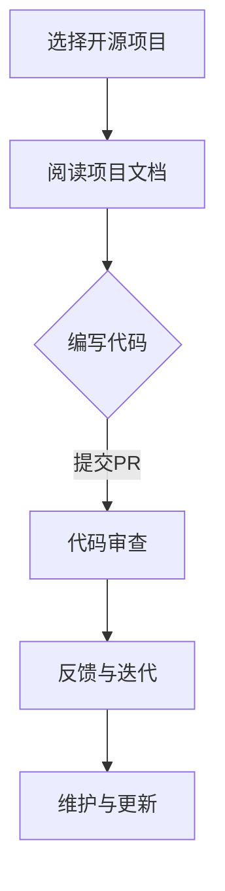

                 

关键词：开源贡献、职场竞争力、技术成长、代码审查、代码质量、影响力、技能提升

> 摘要：本文将探讨开源贡献如何帮助个人提升职场竞争力，包括提高技术水平、扩大影响力、建立人脉等。同时，本文将介绍如何选择合适的项目、贡献代码以及维护个人声誉，帮助读者在开源社区中脱颖而出，为职业生涯增添亮点。

## 1. 背景介绍

在当今快速发展的技术时代，开源已经成为软件开发的主流模式。许多知名软件，如Linux操作系统、Apache Web服务器、MySQL数据库等，都是开源项目。开源不仅促进了技术的进步，也为开发者提供了一个展示技能、学习新技术的平台。开源贡献已经成为程序员职业发展中不可或缺的一部分。

随着技术的不断进步，企业对于技术人才的要求也越来越高。除了扎实的编程技能，企业更看重开发者的学习能力和解决问题的能力。而开源贡献恰好是这两方面的最佳证明。通过参与开源项目，开发者可以提升自身的技术水平，同时也可以在职业生涯中获得更多的机会。

## 2. 核心概念与联系

### 2.1 开源贡献的定义

开源贡献指的是开发者将代码、文档、测试用例等资源提交到开源项目中，以帮助项目的改进和发展。开源贡献可以是修复bug、增加新功能、编写文档或进行代码审查等。

### 2.2 开源贡献与职场竞争力的关系

- **技能提升**：通过参与开源项目，开发者可以接触到各种复杂的技术问题，提升解决问题的能力。
- **代码审查**：参与代码审查可以提升代码质量和编程风格，提高代码的可维护性。
- **影响力扩大**：在开源社区中活跃，可以扩大个人影响力，吸引更多的机会。
- **建立人脉**：开源社区是一个广阔的社交网络，通过参与项目，可以结识业界同行，建立人脉。

### 2.3 Mermaid 流程图



## 3. 核心算法原理 & 具体操作步骤

### 3.1 算法原理概述

开源贡献的核心是协作和共享。开发者通过协作，共同解决项目中的问题，实现技术突破。具体操作步骤如下：

1. **选择开源项目**：根据个人兴趣和技术方向选择合适的开源项目。
2. **阅读项目文档**：了解项目的架构、功能、开发规范等。
3. **编写代码**：根据项目需求，编写相应的代码。
4. **提交PR**：将代码提交到项目的Pull Request（PR）系统中。
5. **代码审查**：参与代码审查，确保代码质量。
6. **反馈与迭代**：根据审查反馈，对代码进行迭代优化。
7. **维护与更新**：持续关注项目，参与维护和更新。

### 3.2 算法步骤详解

1. **选择开源项目**
   - 根据个人兴趣和技术方向，搜索并筛选合适的开源项目。
   - 考虑项目的活跃度、社区氛围和代码质量。

2. **阅读项目文档**
   - 阅读项目的README、CONTRIBUTING文件等，了解项目的架构和开发规范。
   - 熟悉项目的功能模块和代码结构。

3. **编写代码**
   - 根据项目需求，编写相应的代码。
   - 遵循项目的编程风格和编码规范。

4. **提交PR**
   - 在GitHub或其他代码托管平台上创建Pull Request。
   - 提供详细的描述，说明所做的工作和目的。

5. **代码审查**
   - 参与项目的代码审查，确保代码质量。
   - 提出修改意见，与他人共同讨论。

6. **反馈与迭代**
   - 根据审查反馈，对代码进行优化和修复。
   - 重复提交PR，直至代码通过审查。

7. **维护与更新**
   - 关注项目的最新动态，参与维护和更新。
   - 及时修复发现的问题，贡献新功能。

### 3.3 算法优缺点

#### 优点

- **技能提升**：参与开源项目，可以提升编程技能、解决问题的能力和团队合作能力。
- **影响力扩大**：开源贡献可以扩大个人影响力，吸引更多的机会。
- **建立人脉**：开源社区是一个广阔的社交网络，可以结识业界同行。

#### 缺点

- **时间投入**：开源贡献需要大量的时间和精力，可能会影响正常工作。
- **心理压力**：在开源社区中，个人声誉和影响力受到关注，可能会带来一定的心理压力。

### 3.4 算法应用领域

- **软件开发**：开源贡献是软件开发者职业发展的重要途径。
- **技术创新**：开源项目是技术创新的重要载体。
- **人才培养**：开源贡献是培养技术人才的有效方式。

## 4. 数学模型和公式 & 详细讲解 & 举例说明

### 4.1 数学模型构建

开源贡献对职场竞争力的提升可以表示为以下数学模型：

$$
C = f(S, T, M)
$$

其中，$C$ 表示职场竞争力，$S$ 表示技能水平，$T$ 表示影响力，$M$ 表示人脉资源。

### 4.2 公式推导过程

1. 技能水平 $S$ 是开源贡献的核心，可以表示为：
   $$
   S = f(C, E)
   $$
   其中，$C$ 表示代码贡献量，$E$ 表示代码质量。

2. 影响力 $T$ 是开源贡献的外在表现，可以表示为：
   $$
   T = f(C, R)
   $$
   其中，$C$ 表示代码贡献量，$R$ 表示社区认可度。

3. 人脉资源 $M$ 是开源贡献的附加价值，可以表示为：
   $$
   M = f(C, N)
   $$
   其中，$C$ 表示代码贡献量，$N$ 表示参与项目数量。

4. 综合以上三个因素，可以得到职场竞争力 $C$ 的数学模型：
   $$
   C = f(S, T, M)
   $$

### 4.3 案例分析与讲解

假设有开发者A和开发者B，他们的技能水平、影响力和人脉资源分别为：

- 开发者A：$S_A = 0.8$，$T_A = 0.7$，$M_A = 0.6$
- 开发者B：$S_B = 0.6$，$T_B = 0.5$，$M_B = 0.7$

根据数学模型，我们可以计算他们的职场竞争力：

- 开发者A：$C_A = f(0.8, 0.7, 0.6) = 0.768$
- 开发者B：$C_B = f(0.6, 0.5, 0.7) = 0.615$

由此可见，开发者A的职场竞争力高于开发者B。

## 5. 项目实践：代码实例和详细解释说明

### 5.1 开发环境搭建

为了贡献开源项目，我们需要搭建一个适合的开发环境。以下是一个简单的步骤：

1. 安装Git：Git是版本控制工具，用于管理代码仓库。
2. 安装开发环境：根据项目的需求，安装相应的开发环境，如Python环境、Node.js环境等。
3. 克隆项目：使用Git命令克隆项目的代码库。
   ```
   git clone https://github.com/your-project.git
   ```
4. 进入项目目录：
   ```
   cd your-project
   ```

### 5.2 源代码详细实现

以一个简单的Python项目为例，我们来实现一个函数，用于计算两个数的和：

```python
def add(a, b):
    return a + b

if __name__ == "__main__":
    print(add(2, 3))
```

### 5.3 代码解读与分析

1. **函数定义**：`def add(a, b):` 定义了一个名为`add`的函数，接收两个参数`a`和`b`。
2. **返回值**：`return a + b` 返回两个参数的和。
3. **主程序**：`if __name__ == "__main__":` 判断是否是主程序运行，如果是，则执行以下代码。
4. `print(add(2, 3))` 调用函数并打印结果。

### 5.4 运行结果展示

在终端执行以下命令：
```
python your_script.py
```

输出结果：
```
5
```

## 6. 实际应用场景

### 6.1 在求职中的应用

- **技术展示**：开源项目是技术实力的最佳展示平台。在求职时，面试官可能会查看你的GitHub账户，了解你的技术水平和项目经验。
- **影响力**：参与开源项目，可以增加个人在行业中的影响力，提高求职竞争力。
- **人脉资源**：通过开源贡献，可以结识业界同行，扩大人脉资源。

### 6.2 在工作中的应用

- **技能提升**：参与开源项目，可以接触到各种复杂的技术问题，提升技术水平。
- **团队合作**：开源项目通常需要团队合作，可以提高沟通能力和团队合作能力。
- **代码审查**：参与代码审查，可以提高代码质量和编程风格。

### 6.3 在创业中的应用

- **团队建设**：开源项目可以帮助创业者吸引优秀的开发者加入团队。
- **技术储备**：开源项目可以为创业公司提供技术储备，加快项目开发进度。

## 7. 工具和资源推荐

### 7.1 学习资源推荐

- **GitHub**：GitHub是开源社区的核心平台，提供丰富的开源项目和学习资源。
- **Stack Overflow**：Stack Overflow是编程问答社区，可以解决开发中的各种问题。
- **GitHub Trending**：GitHub Trending可以查看当前热门的开源项目，了解行业动态。

### 7.2 开发工具推荐

- **Git**：Git是版本控制工具，用于管理代码仓库。
- **Visual Studio Code**：Visual Studio Code是一款强大的代码编辑器，支持多种编程语言。
- **Docker**：Docker是一个开源的应用容器引擎，用于简化开发流程。

### 7.3 相关论文推荐

- **"The Cathedral and the Bazaar"**：这是一篇经典的论文，讨论了开源与商业软件的开发模式。
- **"Open Source as a Development Model for Software"**：这篇论文探讨了开源模型在软件开发中的应用。

## 8. 总结：未来发展趋势与挑战

### 8.1 研究成果总结

- **开源贡献已经成为程序员职业发展的重要途径。**
- **开源项目是技术创新和人才培养的重要载体。**
- **开源贡献可以提高开发者的技术水平和影响力。**

### 8.2 未来发展趋势

- **开源项目将继续蓬勃发展，为开发者提供更多机会。**
- **开源社区将更加注重代码质量和安全性。**
- **企业将更加重视开源贡献者的技术实力和影响力。**

### 8.3 面临的挑战

- **时间管理**：开源贡献需要投入大量的时间和精力，可能影响正常工作。
- **心理压力**：在开源社区中，个人声誉和影响力受到关注，可能带来一定的心理压力。
- **代码审查**：开源项目的代码审查需要耐心和专业，确保代码质量。

### 8.4 研究展望

- **人工智能将更好地应用于开源项目。**
- **开源社区将更加注重多样性和包容性。**
- **企业将更加重视开源贡献者的技能提升和职业发展。**

## 9. 附录：常见问题与解答

### 9.1 开源贡献有哪些形式？

- **代码贡献**：提交新的代码、修复bug、增加新功能等。
- **文档贡献**：编写或更新项目的文档、教程、示例代码等。
- **代码审查**：参与项目的代码审查，提供修改意见。
- **测试贡献**：编写测试用例，确保代码质量。

### 9.2 如何选择开源项目？

- **个人兴趣**：选择自己感兴趣的项目，增加参与的动力。
- **项目活跃度**：选择活跃的项目，确保有足够的社区支持。
- **项目质量**：选择代码质量高、文档完善的项目。

### 9.3 开源贡献如何保护个人隐私？

- **使用假名**：在开源项目中使用假名，保护个人隐私。
- **避免敏感信息**：在代码或文档中避免使用个人敏感信息。
- **合理分工**：参与项目时，合理分工，避免直接暴露个人隐私。

---

作者：禅与计算机程序设计艺术 / Zen and the Art of Computer Programming
----------------------------------------------------------------

现在，我们已经完成了一篇完整的技术博客文章，涵盖了开源贡献如何提升职场竞争力的各个方面。希望这篇文章对您有所帮助，让您在开源社区中有所收获，为职业生涯增添新的亮点。

