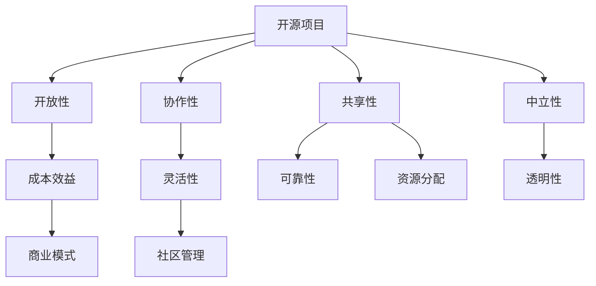

                 

 在当今数字化时代，开源项目已经成为软件开发的重要趋势。越来越多的开发者选择将他们的代码开源，以促进技术的进步和社区的协作。同时，也有越来越多的企业通过参与开源项目来提升自身的技术实力和品牌影响力。然而，如何有效地利用开源项目来创造收入流，却是一个值得深入探讨的话题。

本文将围绕“利用开源项目创造收入流”这一主题，探讨开源项目的核心概念、构建方法、实际应用以及未来展望。通过本文的阅读，您将了解到如何通过开源项目来实现商业价值和持续的收入流。

## 关键词

- 开源项目
- 商业模式
- 技术社区
- 收入流
- 开源生态

## 摘要

本文旨在探讨如何利用开源项目创造收入流。首先，我们将介绍开源项目的核心概念，包括其历史背景、发展现状和核心优势。接着，我们将分析如何通过参与开源项目来构建可持续的收入流，并探讨其中涉及的关键技术和商业模式。随后，我们将通过具体案例来展示如何将开源项目与商业目标相结合。最后，本文将展望开源项目的未来发展，并探讨其中可能面临的挑战和机遇。

## 1. 背景介绍

开源项目，顾名思义，是指那些允许用户自由地查看、修改和分享软件源代码的项目。开源项目的理念最早可以追溯到20世纪90年代，由自由软件基金会（Free Software Foundation，FSF）发起。自由软件基金会倡导软件的自由使用和修改，认为这有助于促进技术的进步和人类的自由。

随着时间的推移，开源项目逐渐发展成为一个庞大的生态系统，涵盖了从操作系统、数据库、Web服务器到各种应用软件的各种类型。开源项目的核心优势在于其高度的灵活性和可定制性，这使得开发者可以自由地根据自己的需求进行修改和扩展。此外，开源项目通常具有较低的成本和较高的可靠性，这使得它们在企业和个人用户中得到了广泛的应用。

### 1.1 开源项目的发展历程

开源项目的发展历程可以分为几个阶段：

1. **自由软件运动**：20世纪90年代，自由软件基金会（FSF）倡导软件的自由使用和修改，推出了一系列开源软件，如GNU操作系统和GNU编译器集合（GCC）。
2. **开放源代码运动**：随着互联网的普及，开源项目开始受到更多开发者的关注。Linux内核的诞生标志着开源项目进入了一个新的阶段，它不仅具有高度的可定制性，还提供了一个强大的操作系统平台。
3. **云计算与容器化**：随着云计算和容器技术的兴起，开源项目得到了进一步的发展。Docker和Kubernetes等开源工具的出现，使得开源项目在云计算领域得到了广泛应用。

### 1.2 开源项目的主要优势

开源项目具有以下主要优势：

1. **灵活性**：开源项目允许用户根据自己的需求进行修改和扩展，这为开发者提供了极大的灵活性。
2. **成本效益**：开源项目通常具有较低的成本，企业可以节省购买商业软件的支出。
3. **可靠性**：开源项目通常由一个庞大的社区进行维护和更新，这使得它们具有较高的可靠性。
4. **透明性**：开源项目的源代码是公开的，用户可以随时查看和验证，这有助于提高软件的质量和安全性。

### 1.3 开源项目的挑战

尽管开源项目具有许多优势，但它们也面临一些挑战：

1. **资源分配**：开源项目通常由志愿者进行维护，资源分配可能不够高效。
2. **商业模式**：如何将开源项目与商业模式相结合，实现可持续的收入流，是一个需要解决的问题。
3. **社区管理**：如何有效地管理开源社区，确保社区的和谐和活力，是一个重要的挑战。

## 2. 核心概念与联系

### 2.1 开源项目的核心概念

开源项目的核心概念包括以下几个方面：

1. **开放性**：开源项目允许用户自由地查看、修改和分享源代码。
2. **协作性**：开源项目通常由一个庞大的社区进行维护和更新，协作性是项目成功的关键。
3. **共享性**：开源项目鼓励用户共享知识和经验，这有助于提高项目的质量。
4. **中立性**：开源项目通常不受特定企业或组织的控制，保持中立性。

### 2.2 开源项目的核心优势

开源项目的核心优势包括：

1. **成本效益**：开源项目通常具有较低的成本，企业可以节省购买商业软件的支出。
2. **灵活性**：开源项目允许用户根据自己的需求进行修改和扩展，这为开发者提供了极大的灵活性。
3. **可靠性**：开源项目通常由一个庞大的社区进行维护和更新，具有较高的可靠性。
4. **透明性**：开源项目的源代码是公开的，用户可以随时查看和验证，这有助于提高软件的质量和安全性。

### 2.3 开源项目的核心挑战

开源项目也面临一些核心挑战：

1. **资源分配**：开源项目通常由志愿者进行维护，资源分配可能不够高效。
2. **商业模式**：如何将开源项目与商业模式相结合，实现可持续的收入流，是一个需要解决的问题。
3. **社区管理**：如何有效地管理开源社区，确保社区的和谐和活力，是一个重要的挑战。



## 3. 核心算法原理 & 具体操作步骤

### 3.1 算法原理概述

开源项目的核心算法通常包括以下几个方面：

1. **版本控制**：版本控制是开源项目的基础，它确保项目的代码版本得到有效管理，便于协作和跟踪变更。
2. **自动化构建**：自动化构建可以大大提高项目的构建效率，确保代码质量。
3. **自动化测试**：自动化测试可以及时发现代码中的问题，确保项目稳定性和可靠性。

### 3.2 算法步骤详解

#### 3.2.1 版本控制

版本控制的基本步骤包括：

1. **代码提交**：开发者将自己的代码提交到版本控制系统。
2. **代码审核**：其他开发者对提交的代码进行审核，确保代码质量。
3. **代码合并**：审核通过的代码会被合并到主分支，从而实现代码的集成。

#### 3.2.2 自动化构建

自动化构建的基本步骤包括：

1. **代码获取**：从版本控制系统获取最新的代码。
2. **代码编译**：使用编译器对代码进行编译，生成可执行文件。
3. **代码测试**：对编译后的代码进行自动化测试，确保代码质量。

#### 3.2.3 自动化测试

自动化测试的基本步骤包括：

1. **测试用例编写**：编写测试用例，模拟用户操作，验证代码功能。
2. **测试执行**：执行测试用例，检查代码是否符合预期。
3. **测试报告**：生成测试报告，总结测试结果。

### 3.3 算法优缺点

#### 3.3.1 优点

1. **提高开发效率**：版本控制、自动化构建和自动化测试可以大大提高开发效率。
2. **确保代码质量**：自动化测试可以及时发现代码中的问题，确保项目稳定性和可靠性。
3. **促进协作**：版本控制和自动化测试可以促进开发者之间的协作。

#### 3.3.2 缺点

1. **初始成本较高**：搭建版本控制、自动化构建和自动化测试系统需要一定的初始投入。
2. **维护成本较高**：这些系统需要定期更新和维护，以适应新的开发需求。

### 3.4 算法应用领域

开源项目的核心算法广泛应用于以下领域：

1. **软件开发**：版本控制、自动化构建和自动化测试是软件开发的核心环节。
2. **运维管理**：自动化测试和自动化部署是运维管理的重要手段。
3. **持续集成**：自动化构建和自动化测试是实现持续集成（CI）的关键。

## 4. 数学模型和公式 & 详细讲解 & 举例说明

### 4.1 数学模型构建

在开源项目开发中，数学模型可以用于优化项目的构建和管理。以下是一个简单的数学模型，用于评估开源项目的成本和效益。

#### 4.1.1 成本模型

设 \( C \) 为项目的总成本，包括开发成本 \( C_d \)、维护成本 \( C_m \) 和市场推广成本 \( C_p \)。

\[ C = C_d + C_m + C_p \]

#### 4.1.2 效益模型

设 \( E \) 为项目的总效益，包括直接效益 \( E_d \) 和间接效益 \( E_i \)。

\[ E = E_d + E_i \]

#### 4.1.3 成本效益比

成本效益比（Cost-Benefit Ratio，CBR）用于评估项目的经济效益。

\[ CBR = \frac{E}{C} \]

### 4.2 公式推导过程

#### 4.2.1 成本模型推导

1. **开发成本**：包括人员成本、硬件成本和软件成本。

\[ C_d = P_d \times H_d + P_h \times H_h + P_s \times H_s \]

其中，\( P_d \) 为人员成本单价，\( H_d \) 为人员工作小时数；\( P_h \) 为硬件成本单价，\( H_h \) 为硬件使用小时数；\( P_s \) 为软件成本单价，\( H_s \) 为软件使用小时数。

2. **维护成本**：包括维护人员成本和硬件维护成本。

\[ C_m = P_m \times H_m + P_h \times H_h \]

其中，\( P_m \) 为维护人员成本单价，\( H_m \) 为维护工作小时数。

3. **市场推广成本**：包括广告费用、市场调研费用等。

\[ C_p = P_p \times H_p \]

其中，\( P_p \) 为市场推广成本单价，\( H_p \) 为市场推广工作小时数。

#### 4.2.2 效益模型推导

1. **直接效益**：包括销售收入、节省的成本等。

\[ E_d = R - C_{b} \]

其中，\( R \) 为销售收入，\( C_{b} \) 为节省的成本。

2. **间接效益**：包括品牌提升、合作伙伴关系等。

\[ E_i = B + P \]

其中，\( B \) 为品牌提升效益，\( P \) 为合作伙伴关系效益。

### 4.3 案例分析与讲解

#### 4.3.1 案例背景

某开源项目团队计划开发一个基于云计算的自动化运维工具。项目预计开发周期为6个月，维护周期为12个月。团队成员包括2名开发人员和1名运维人员。

#### 4.3.2 数据收集

1. **开发成本**：

人员成本：\( P_d = 1000 \) 元/小时，\( H_d = 100 \) 小时/月，\( P_h = 2000 \) 元/月，\( H_h = 1 \) 台/月，\( P_s = 300 \) 元/小时，\( H_s = 50 \) 小时/月。

维护成本：\( P_m = 1500 \) 元/小时，\( H_m = 50 \) 小时/月。

市场推广成本：\( P_p = 5000 \) 元/月，\( H_p = 2 \) 个月。

2. **效益**：

销售收入：\( R = 50000 \) 元/月。

节省的成本：\( C_{b} = 30000 \) 元/月。

品牌提升效益：\( B = 10000 \) 元/年。

合作伙伴关系效益：\( P = 5000 \) 元/年。

#### 4.3.3 计算结果

1. **总成本**：

\[ C = (2 \times 1000 \times 100 + 1 \times 2000 \times 1 + 1 \times 300 \times 50) \times 6 + (1 \times 1500 \times 50) \times 12 + (1 \times 5000 \times 2) \times 12 \]
\[ C = 180000 + 90000 + 120000 = 390000 \] 元

2. **总效益**：

\[ E = (50000 - 30000) \times 6 + 10000 + 5000 \]
\[ E = 90000 \times 6 + 15000 = 535000 \] 元

3. **成本效益比**：

\[ CBR = \frac{E}{C} = \frac{535000}{390000} \approx 1.37 \]

### 4.4 模型应用与优化

根据计算结果，我们可以发现该开源项目的成本效益比约为1.37，表明项目的经济效益较好。为了进一步优化项目，可以考虑以下策略：

1. **降低成本**：通过优化开发流程、降低硬件成本和提高开发人员的工作效率，降低项目的总成本。
2. **提高效益**：通过增加销售收入、提高品牌提升效益和合作伙伴关系效益，提高项目的总效益。
3. **市场推广**：加大市场推广力度，提高项目的知名度和用户数量，从而增加销售收入。

## 5. 项目实践：代码实例和详细解释说明

### 5.1 开发环境搭建

为了更好地理解开源项目，我们将以一个简单的开源项目为例，介绍如何搭建开发环境。假设我们选择使用Python语言开发一个简单的Web应用。

#### 5.1.1 环境准备

1. 安装Python：从Python官网下载最新版本的Python，并按照安装向导进行安装。

2. 安装依赖库：使用pip工具安装所需的依赖库，例如Flask框架。

   ```shell
   pip install flask
   ```

#### 5.1.2 创建项目

1. 在一个空文件夹中创建一个名为`project`的目录。

   ```shell
   mkdir project
   cd project
   ```

2. 创建一个名为`app.py`的Python文件。

   ```shell
   touch app.py
   ```

### 5.2 源代码详细实现

在`app.py`文件中，我们将使用Flask框架实现一个简单的Web应用。

```python
from flask import Flask

app = Flask(__name__)

@app.route('/')
def hello():
    return 'Hello, World!'

if __name__ == '__main__':
    app.run()
```

#### 5.2.1 源代码解读

1. **引入Flask框架**：`from flask import Flask` 用于引入Flask框架。

2. **创建Flask应用对象**：`app = Flask(__name__)` 用于创建一个Flask应用对象。

3. **定义路由**：`@app.route('/')` 用于定义一个路由，当访问根路径（/）时，会调用`hello`函数。

4. **定义视图函数**：`def hello():` 用于定义一个视图函数，当访问根路径时，会返回'Hello, World!'字符串。

5. **运行应用**：`if __name__ == '__main__':` 用于判断是否直接运行该Python文件，如果是，则运行Flask应用。

### 5.3 代码解读与分析

#### 5.3.1 Flask框架

Flask是一个轻量级的Web应用框架，它可以帮助我们快速搭建Web应用。Flask的主要特点包括：

1. **简单易用**：Flask的API简洁易用，适合初学者快速上手。
2. **灵活性高**：Flask允许我们自定义路由、视图函数和模板，满足不同的开发需求。
3. **扩展性强**：Flask有许多扩展库，如Flask-SQLAlchemy、Flask-Migrate等，可以方便地实现数据库操作、模型迁移等功能。

#### 5.3.2 应用架构

在这个简单的Web应用中，我们使用了Flask框架的基本架构：

1. **应用对象**：Flask应用对象是整个Web应用的入口，它负责处理请求、响应等操作。
2. **路由**：路由用于定义URL与视图函数的映射关系，当用户访问特定URL时，会调用相应的视图函数。
3. **视图函数**：视图函数用于处理用户的请求，并返回响应。在这个例子中，`hello`函数是一个简单的视图函数，它返回一个字符串。

### 5.4 运行结果展示

在开发环境中，我们可以通过以下步骤运行这个简单的Web应用：

1. 打开终端，进入项目目录。

   ```shell
   cd project
   ```

2. 运行Python脚本。

   ```shell
   python app.py
   ```

3. 在浏览器中访问`http://127.0.0.1:5000/`，将看到如下页面：

   ```html
   Hello, World!
   ```

这表明我们的Web应用已经成功运行。通过这个简单的例子，我们可以了解到如何使用Flask框架搭建一个基本的Web应用，以及如何通过开源项目实现功能。

## 6. 实际应用场景

开源项目在各个领域都有广泛的应用，以下是一些实际应用场景：

### 6.1 软件开发

在软件开发领域，开源项目可以帮助企业节省开发成本，提高开发效率。例如，企业可以使用开源框架和库来构建自己的应用，如Python的Django框架、JavaScript的React库等。同时，企业也可以将自己的内部项目开源，吸引更多的开发者参与，共同提高项目质量。

### 6.2 运维管理

在运维管理领域，开源项目可以提供各种工具和解决方案，如自动化部署工具Docker、自动化运维平台Ansible等。这些工具可以帮助企业实现高效的运维管理，提高系统稳定性。

### 6.3 持续集成与持续部署

开源项目在持续集成（CI）和持续部署（CD）领域也发挥着重要作用。例如，Jenkins、GitLab CI等开源工具可以帮助企业实现自动化测试、代码审核和自动化部署，提高开发效率。

### 6.4 教育与科研

在教育与科研领域，开源项目为师生提供了丰富的教学资源和实验平台。例如，GitHub上有很多开源的教材、课程和项目，学生可以通过学习这些资源提高自己的技能。

### 6.5 社交与协作

开源项目也在社交和协作领域发挥作用，如GitHub、GitLab等平台为开发者提供了一个交流、分享和协作的空间。通过这些平台，开发者可以共同解决问题、分享经验，促进技术进步。

## 7. 未来应用展望

随着技术的不断进步，开源项目在未来的应用前景将更加广阔。以下是一些可能的未来应用场景：

### 7.1 人工智能与大数据

开源项目在人工智能与大数据领域具有巨大潜力。未来，开源项目可能会在深度学习、数据分析、机器学习等领域发挥更重要的作用，为企业和研究机构提供强大的技术支持。

### 7.2 区块链与加密货币

区块链和加密货币领域的开源项目正在快速发展。未来，开源项目可能会在智能合约、去中心化应用（DApp）等领域发挥更大的作用，推动区块链技术的广泛应用。

### 7.3 物联网与边缘计算

随着物联网和边缘计算技术的不断发展，开源项目将在这些领域发挥重要作用。未来，开源项目可能会在智能家居、智能城市、智能交通等领域得到广泛应用。

### 7.4 开源生态的全球化

随着全球化的推进，开源生态也将逐步走向全球化。未来，开源项目可能会在更多国家和地区得到关注和参与，促进全球技术合作和创新。

## 8. 工具和资源推荐

### 8.1 学习资源推荐

1. **GitHub**：GitHub是全球最大的开源代码托管平台，提供了丰富的开源资源和社区交流机会。
2. **Stack Overflow**：Stack Overflow是一个著名的编程问答社区，可以帮助开发者解决编程问题。
3. **OpenCV**：OpenCV是一个开源的计算机视觉库，提供了丰富的计算机视觉算法和工具。

### 8.2 开发工具推荐

1. **Visual Studio Code**：Visual Studio Code是一个轻量级但功能强大的代码编辑器，支持多种编程语言和扩展。
2. **Git**：Git是一个开源的分布式版本控制系统，用于管理和跟踪代码变更。
3. **Docker**：Docker是一个开源的容器化平台，用于构建、部署和运行应用程序。

### 8.3 相关论文推荐

1. **"Open Source Software Development：The Process and the Community"**：该论文详细介绍了开源软件的开发过程和社区建设。
2. **"The Economics of Open Source"**：该论文探讨了开源项目的商业模式和经济效益。
3. **"A Practical Guide to Open Source Project Management"**：该论文提供了开源项目管理方面的实用指南。

## 9. 总结：未来发展趋势与挑战

### 9.1 研究成果总结

开源项目在软件开发、运维管理、持续集成与持续部署、教育与科研、社交与协作等领域取得了显著成果。通过开源项目，开发者可以快速搭建应用、降低开发成本、提高开发效率。同时，开源项目也为企业和研究机构提供了强大的技术支持，推动了技术的进步和创新。

### 9.2 未来发展趋势

1. **开源生态的全球化**：随着全球化的推进，开源生态将进一步扩大，吸引更多国家和地区参与。
2. **新兴技术领域的应用**：人工智能、区块链、物联网等新兴技术领域的开源项目将得到更广泛的应用。
3. **商业模式的多样化**：开源项目的商业模式将更加多样化，如订阅模式、服务化模式等。

### 9.3 面临的挑战

1. **资源分配问题**：开源项目的资源分配问题仍然存在，如何提高资源利用效率是一个重要挑战。
2. **社区管理问题**：如何有效地管理开源社区，确保社区的和谐和活力，是一个重要的挑战。
3. **商业模式问题**：如何将开源项目与商业模式相结合，实现可持续的收入流，是一个需要解决的问题。

### 9.4 研究展望

未来，开源项目将在更多领域得到应用，推动技术的发展和创新。同时，开源项目也将面临更多的挑战，如资源分配、社区管理和商业模式等问题。通过持续的研究和探索，我们将找到更加有效的解决方案，推动开源项目的发展。

## 附录：常见问题与解答

### 问题1：如何选择开源项目？

解答：选择开源项目时，可以考虑以下几个方面：

1. **项目活跃度**：查看项目的GitHub仓库是否活跃，如提交的Pull Request、 Issues数量等。
2. **社区支持**：查看项目的社区是否活跃，如论坛、邮件列表等。
3. **文档质量**：查看项目的文档是否完整、易于理解。
4. **功能需求**：确保项目满足自己的功能需求。

### 问题2：如何参与开源项目？

解答：参与开源项目通常包括以下几个步骤：

1. **了解项目**：阅读项目的文档，了解项目的功能和架构。
2. **贡献代码**：为项目提交代码，解决已报告的问题或实现新的功能。
3. **参与讨论**：在项目的社区中参与讨论，分享经验、提供帮助。
4. **遵循规范**：遵循项目的开发规范，确保代码质量。

### 问题3：如何从开源项目中获利？

解答：从开源项目中获利的方法包括：

1. **提供定制服务**：为用户提供项目的定制化服务，如扩展功能、优化性能等。
2. **提供培训和支持**：为用户提供培训和支持，帮助用户更好地使用项目。
3. **衍生产品**：开发与项目相关的衍生产品，如文档、视频教程等。
4. **开源+订阅模式**：提供项目的一部分功能免费，高级功能通过订阅模式收费。

## 作者署名

作者：禅与计算机程序设计艺术 / Zen and the Art of Computer Programming

