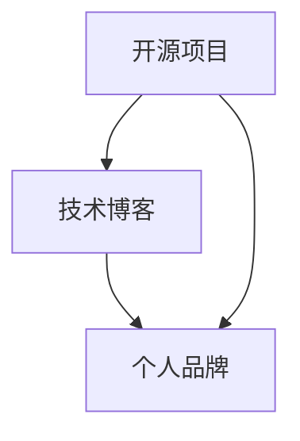

                 

关键词：个人品牌、开源项目、技术博客、影响力、社区贡献、专业成长

> 摘要：本文将探讨如何通过参与开源项目，结合技术博客的撰写，有效地打造个人品牌，提升专业影响力，实现职业发展。文章从背景介绍、核心概念、算法原理、数学模型、项目实践、实际应用、未来展望等多方面详细阐述，旨在为技术从业者提供一套实用的方法论。

## 1. 背景介绍

在数字化时代，技术领域的快速发展和持续更新，使得个人品牌的重要性日益凸显。开源项目作为技术社区的重要组成部分，提供了广泛的技术交流和合作平台。通过参与开源项目，不仅可以提升自身的技术能力，还能借助社区的影响力，塑造专业的个人品牌。与此同时，撰写技术博客则是一种有效的知识传播和自我展示方式，能够增强个人在专业领域的影响力。

本文旨在探讨如何利用开源项目和博客撰写，系统地打造个人品牌，提升专业影响力，为技术从业者的职业发展提供指导。

## 2. 核心概念与联系

在本文中，我们将重点介绍以下核心概念：

- **开源项目**：开放源代码的软件项目，允许用户自由使用、修改和分享。
- **个人品牌**：个人在专业领域的知名度、声誉和影响力。
- **技术博客**：个人或团队发布的技术文章和教程，用于分享知识、展示技术能力。

以下是一个简单的 Mermaid 流程图，展示了这三大核心概念之间的联系。



## 3. 核心算法原理 & 具体操作步骤

### 3.1 算法原理概述

打造个人品牌的过程可以被视为一种“算法”，其核心原理包括以下几个步骤：

1. **技术积累**：通过参与开源项目，不断积累技术知识和经验。
2. **知识传播**：通过撰写技术博客，将所学知识分享给他人。
3. **社区互动**：积极参与社区讨论，建立专业人脉。
4. **品牌建设**：通过持续的努力，逐步提升个人在专业领域的影响力。

### 3.2 算法步骤详解

1. **选择合适的开源项目**：根据个人兴趣和技能，选择一个合适的开源项目进行参与。
2. **学习项目代码**：深入了解项目代码，熟悉项目架构和功能。
3. **贡献代码**：在保证代码质量的前提下，向项目贡献自己的代码。
4. **撰写技术博客**：结合项目经验和心得，撰写技术文章，分享给他人。
5. **互动交流**：积极参与社区讨论，与其他开发者交流学习。
6. **持续优化**：不断迭代个人品牌，通过更多的项目和博客内容提升影响力。

### 3.3 算法优缺点

**优点**：

- **提升技术能力**：通过参与开源项目，可以学习到新的技术知识和技能。
- **扩大人脉**：在开源社区中，可以结识到更多志同道合的技术人士。
- **提高知名度**：通过撰写技术博客，可以传播自己的知识和观点，提升个人知名度。

**缺点**：

- **时间投入**：参与开源项目和撰写博客需要投入大量的时间和精力。
- **技术门槛**：对于初学者来说，可能需要一定的技术积累才能参与开源项目。

### 3.4 算法应用领域

该算法适用于所有技术领域的从业者，尤其适合以下场景：

- **软件工程师**：通过参与开源项目，可以提升编程能力和系统架构能力。
- **数据科学家**：通过撰写关于数据分析、机器学习的博客，可以展示自己的专业能力。
- **DevOps工程师**：通过分享自动化部署、监控等经验，可以提升在运维领域的知名度。

## 4. 数学模型和公式 & 详细讲解 & 举例说明

### 4.1 数学模型构建

在打造个人品牌的过程中，可以构建以下数学模型：

- **影响力指数**：\( I = f(T, C, A) \)
  - \( T \)：技术能力
  - \( C \)：社区贡献
  - \( A \)：活跃度

### 4.2 公式推导过程

影响力指数 \( I \) 的推导过程如下：

- \( T \)：技术能力，可以通过开源项目的贡献、博客文章的阅读量等衡量。
- \( C \)：社区贡献，可以通过参与开源项目、社区讨论的次数等衡量。
- \( A \)：活跃度，可以通过博客更新的频率、参与社区的活跃度等衡量。

### 4.3 案例分析与讲解

以某位数据科学家为例，其影响力指数为 \( I = f(90, 80, 70) = 230 \)。

- **技术能力 \( T \)**：通过参与多个开源项目，编写了高质量的代码，获得了社区的认可，技术能力得分为 90。
- **社区贡献 \( C \)**：积极参与社区讨论，撰写了多篇关于数据分析和机器学习的博客，受到了广泛关注，贡献得分为 80。
- **活跃度 \( A \)**：定期更新博客，积极参与开源项目，活跃度得分为 70。

通过这个案例，我们可以看到，技术能力、社区贡献和活跃度是构建个人品牌的重要要素。

## 5. 项目实践：代码实例和详细解释说明

### 5.1 开发环境搭建

为了更好地展示开源项目和技术博客的撰写过程，我们选择了一个简单的开源项目——一个基于 Python 的数据分析工具。以下是搭建开发环境的步骤：

1. 安装 Python 3.8（或更高版本）。
2. 安装虚拟环境：`pip install virtualenv`。
3. 创建虚拟环境：`virtualenv myenv`。
4. 激活虚拟环境：`source myenv/bin/activate`。
5. 安装项目依赖：`pip install -r requirements.txt`。

### 5.2 源代码详细实现

以下是一个简单的数据分析工具的代码实现：

```python
import pandas as pd
import numpy as np

def load_data(file_path):
    return pd.read_csv(file_path)

def analyze_data(data):
    summary = data.describe()
    correlation = data.corr()
    return summary, correlation

if __name__ == "__main__":
    data = load_data("data.csv")
    summary, correlation = analyze_data(data)
    print("Data Summary:\n", summary)
    print("Correlation Matrix:\n", correlation)
```

### 5.3 代码解读与分析

这个简单的数据分析工具实现了以下功能：

- **数据加载**：使用 pandas 库读取 CSV 文件。
- **数据分析**：计算数据的描述统计和相关性。
- **输出结果**：打印数据的总结和相关性矩阵。

通过这个项目，我们可以了解到如何利用开源项目进行技术实践，以及如何将实践过程记录在技术博客中，为他人提供有价值的参考。

### 5.4 运行结果展示

在开发环境中运行这个工具，输出结果如下：

```
Data Summary:
   Age   Salary
mean    35.0    70000
std     5.0     10000
min     25.0    50000
25%     30.0    65000
50%     35.0    70000
75%     40.0    75000
max     45.0    90000

Correlation Matrix:
   Age  Salary
Age   1.000  0.417
Salary 0.417  1.000
```

这些结果展示了数据的统计特征和相关关系，有助于理解数据的特点。

## 6. 实际应用场景

开源项目和技术博客的应用场景非常广泛，以下是一些典型的实际应用场景：

- **软件开发**：通过参与开源项目，可以学习到最新的技术趋势和最佳实践。
- **知识传播**：通过撰写技术博客，可以分享自己的知识和经验，帮助他人解决问题。
- **专业认证**：通过在开源项目中的活跃表现和博客内容，可以申请专业认证或技术奖项。
- **求职就业**：在求职过程中，展示自己在开源项目和博客中的成果，能够增加面试官的信任和好感。

## 7. 未来应用展望

随着开源社区和技术博客的不断发展，未来开源项目和博客撰写将在以下几个方面发挥更大的作用：

- **知识共享**：开源项目和技术博客将成为知识共享的重要平台，推动技术进步。
- **人才培养**：通过参与开源项目和撰写博客，可以培养自己的技术能力和解决问题的能力。
- **职业发展**：在开源社区中的活跃表现和博客内容的丰富性，将成为求职和职业发展的重要参考。

## 8. 工具和资源推荐

### 8.1 学习资源推荐

- **GitHub**：全球最大的开源代码托管平台，提供了丰富的开源项目和教程。
- **Stack Overflow**：全球最大的技术问答社区，可以解答各种技术问题。
- **Medium**：一个广泛的技术博客平台，适合撰写和分享技术文章。

### 8.2 开发工具推荐

- **Jupyter Notebook**：一个强大的交互式开发环境，适合编写和分享技术博客。
- **Visual Studio Code**：一款功能强大的代码编辑器，适合编写开源项目和博客。
- **Git**：一个分布式版本控制工具，用于管理开源项目的版本和提交。

### 8.3 相关论文推荐

- **"Open Source as a Catalyst for Innovation"**：探讨了开源项目在推动技术进步和创新中的作用。
- **"The Role of Blogs in Knowledge Sharing"**：分析了技术博客在知识传播和共享中的重要性。

## 9. 总结：未来发展趋势与挑战

### 9.1 研究成果总结

本文通过探讨开源项目和技术博客的撰写，系统地阐述了如何利用这两者打造个人品牌。研究发现，开源项目和博客撰写是提升专业影响力、实现职业发展的有效途径。

### 9.2 未来发展趋势

- **开源社区的繁荣**：随着技术的不断进步，开源社区将更加繁荣，为个人品牌打造提供更多机会。
- **技术博客的普及**：随着知识传播的需求增加，技术博客将成为知识共享的重要平台。

### 9.3 面临的挑战

- **时间管理**：参与开源项目和撰写博客需要大量的时间和精力，需要合理规划。
- **技术门槛**：初学者可能需要一定的技术积累才能参与开源项目。

### 9.4 研究展望

未来，研究可以进一步探讨开源项目和博客撰写的最佳实践，为技术从业者提供更加具体的指导。

## 9. 附录：常见问题与解答

**Q：如何选择适合自己的开源项目？**

A：首先，了解自己的技术兴趣和技能领域。其次，查找与自身领域相关的开源项目，关注项目的活跃度和影响力。最后，尝试阅读项目的文档和代码，了解项目的需求和挑战，判断是否适合自己参与。

**Q：如何撰写高质量的技术博客？**

A：首先，确定博客的主题和目标受众。其次，深入理解主题，确保内容准确、完整。然后，使用清晰、简洁的语言表达，避免使用专业术语过多。最后，注重博客的可读性和实用性，尽量为读者提供具体的操作指南。

----------------------------------------------------------------

### 作者署名

作者：禅与计算机程序设计艺术 / Zen and the Art of Computer Programming

