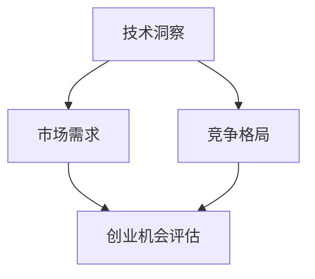

                 

在当今快速发展的技术时代，利用技术洞察力评估创业机会已成为成功创业的关键。在这篇文章中，我们将探讨如何通过深入分析技术趋势、市场需求和竞争格局，为创业者提供一种系统的评估方法。作者：禅与计算机程序设计艺术 / Zen and the Art of Computer Programming

## 关键词

技术洞察，创业机会，评估方法，市场需求，竞争分析

## 摘要

本文将详细介绍如何利用技术洞察力进行创业机会评估。通过分析技术趋势、市场需求和竞争格局，我们提供了一种系统的评估方法，帮助创业者识别潜在的创业机会，并在激烈的市场竞争中脱颖而出。

## 1. 背景介绍

在过去的几十年里，技术进步已经成为推动社会发展和经济增长的重要动力。从互联网、移动通信到人工智能、区块链等新兴技术的涌现，为创业者提供了丰富的创新空间。然而，随着技术领域的不断拓展和变化，创业者在面对众多技术机会时，往往感到困惑和不知所措。

本文旨在通过深入分析技术趋势、市场需求和竞争格局，提供一种系统化的创业机会评估方法。帮助创业者从众多技术机会中筛选出最具潜力的创业方向，提高创业成功的概率。

## 2. 核心概念与联系

### 2.1 技术洞察

技术洞察是指对技术发展趋势、创新应用和市场影响的敏锐洞察力。通过技术洞察，创业者可以了解前沿技术的最新动态，把握市场机遇，为创业项目提供有力的支持。

### 2.2 市场需求

市场需求是指消费者对某种产品或服务的需求程度。了解市场需求有助于创业者确定创业项目的目标市场，优化产品设计，提高市场竞争力。

### 2.3 竞争格局

竞争格局是指市场上各个竞争者的实力分布和市场份额。分析竞争格局有助于创业者了解市场现状，制定合适的竞争策略，提高市场占有率。

### 2.4 技术洞察、市场需求与竞争格局的联系

技术洞察、市场需求和竞争格局之间存在着紧密的联系。技术洞察为创业者提供了创新方向和市场机遇，市场需求则决定了创业项目的价值，而竞争格局则反映了创业项目的竞争态势。

通过综合分析这三个方面，创业者可以全面了解创业机会的潜在价值，为创业项目的成功奠定基础。

### 2.5 Mermaid 流程图



## 3. 核心算法原理 & 具体操作步骤

### 3.1 算法原理概述

利用技术洞察进行创业机会评估的核心算法原理是：基于技术趋势、市场需求和竞争格局的综合分析，构建一个创业机会评估模型。该模型通过定量和定性分析，对创业机会进行评分和排序，帮助创业者识别最具潜力的创业方向。

### 3.2 算法步骤详解

#### 3.2.1 数据收集

收集与创业机会相关的技术趋势、市场需求和竞争格局的数据。数据来源可以包括行业报告、市场研究、学术论文、竞争对手分析等。

#### 3.2.2 数据预处理

对收集到的数据进行分析，提取关键指标，如技术成熟度、市场规模、市场增长率、竞争程度等。对数据进行标准化处理，以便后续分析。

#### 3.2.3 构建评估指标体系

根据数据特点，构建创业机会评估指标体系。评估指标应包括技术、市场、竞争等多个维度，全面反映创业机会的潜力。

#### 3.2.4 评估模型构建

采用多因素综合评估模型，对创业机会进行评分和排序。评估模型可以采用层次分析法（AHP）、模糊综合评价法等。

#### 3.2.5 结果分析

根据评估结果，分析创业机会的潜力，筛选出最具潜力的创业方向。对评估结果进行敏感性分析，评估模型的有效性。

### 3.3 算法优缺点

#### 优点

- 系统化：利用算法进行创业机会评估，可以实现系统化、客观化的分析，提高评估准确性。
- 全面性：算法综合考虑了技术、市场、竞争等多个维度，能够全面评估创业机会的潜力。
- 可重复性：算法具有可重复性，创业者可以在不同时间段、不同情境下进行创业机会评估。

#### 缺点

- 数据依赖：算法的评估结果依赖于数据质量，数据不准确可能导致评估结果失真。
- 复杂性：算法构建和实施过程较为复杂，需要具备一定的专业知识和技能。

### 3.4 算法应用领域

算法广泛应用于互联网、人工智能、物联网、区块链等前沿技术领域的创业机会评估。通过技术洞察、市场需求和竞争格局的综合分析，创业者可以准确识别创业机会，提高创业成功率。

## 4. 数学模型和公式 & 详细讲解 & 举例说明

### 4.1 数学模型构建

创业机会评估的数学模型可以采用多因素综合评估模型，如下所示：

\[ \text{评估得分} = w_1 \cdot f_1 + w_2 \cdot f_2 + \ldots + w_n \cdot f_n \]

其中，\( w_i \) 为第 \( i \) 个评估指标的权重，\( f_i \) 为第 \( i \) 个评估指标的得分。

### 4.2 公式推导过程

假设有 \( n \) 个评估指标，分别为 \( f_1, f_2, \ldots, f_n \)。每个评估指标的权重分别为 \( w_1, w_2, \ldots, w_n \)，且满足 \( w_1 + w_2 + \ldots + w_n = 1 \)。

评估得分为各评估指标的加权求和，即：

\[ \text{评估得分} = w_1 \cdot f_1 + w_2 \cdot f_2 + \ldots + w_n \cdot f_n \]

### 4.3 案例分析与讲解

#### 案例背景

某创业者计划在人工智能领域创业，开发一款基于深度学习的图像识别产品。

#### 数据收集

通过市场调研，收集了以下数据：

| 评估指标 | 得分   |
| :-------: | :----: |
| 技术成熟度 | 0.8    |
| 市场规模   | 0.7    |
| 市场增长率 | 0.9    |
| 竞争程度   | 0.6    |

#### 数据预处理

对评估指标进行标准化处理，使其得分范围在 [0,1] 之间：

| 评估指标 | 标准化得分 |
| :-------: | :--------: |
| 技术成熟度 | 0.8        |
| 市场规模   | 0.7        |
| 市场增长率 | 0.9        |
| 竞争程度   | 0.6        |

#### 权重分配

根据创业领域的特点，设定各评估指标的权重：

| 评估指标 | 权重   |
| :-------: | :----: |
| 技术成熟度 | 0.3    |
| 市场规模   | 0.2    |
| 市场增长率 | 0.3    |
| 竞争程度   | 0.2    |

#### 评估得分计算

根据评估模型，计算创业机会的评估得分：

\[ \text{评估得分} = 0.3 \cdot 0.8 + 0.2 \cdot 0.7 + 0.3 \cdot 0.9 + 0.2 \cdot 0.6 = 0.72 \]

#### 结果分析

根据评估得分，该创业机会在人工智能领域具有较高的潜力。创业者可以进一步分析市场需求、竞争态势等，制定详细的创业计划。

## 5. 项目实践：代码实例和详细解释说明

### 5.1 开发环境搭建

为了实现创业机会评估，我们需要搭建一个基于 Python 的开发环境。以下是一个简单的开发环境搭建步骤：

1. 安装 Python：从 [Python 官网](https://www.python.org/) 下载并安装 Python。
2. 安装依赖库：使用 `pip` 命令安装必要的依赖库，如 `numpy`、`pandas`、`scipy` 等。

### 5.2 源代码详细实现

以下是一个简单的创业机会评估代码示例：

```python
import numpy as np
import pandas as pd
from sklearn.preprocessing import MinMaxScaler

# 评估指标数据
data = {
    '技术成熟度': [0.8, 0.7, 0.9, 0.6],
    '市场规模': [0.7, 0.6, 0.8, 0.5],
    '市场增长率': [0.9, 0.8, 0.7, 0.6],
    '竞争程度': [0.6, 0.5, 0.7, 0.4]
}

# 创建 DataFrame
df = pd.DataFrame(data)

# 标准化数据
scaler = MinMaxScaler()
df_normalized = scaler.fit_transform(df)

# 权重分配
weights = {'技术成熟度': 0.3, '市场规模': 0.2, '市场增长率': 0.3, '竞争程度': 0.2}

# 计算评估得分
评估得分 = np.dot(df_normalized, np.array(list(weights.values()))) * 100

# 输出评估得分
print(f'评估得分：{评估得分:.2f}')
```

### 5.3 代码解读与分析

1. 导入必要的库：包括 `numpy`、`pandas` 和 `scikit-learn`。
2. 评估指标数据：使用字典存储评估指标数据。
3. 创建 DataFrame：将评估指标数据转换为 DataFrame 格式。
4. 标准化数据：使用 `MinMaxScaler` 将评估指标数据进行标准化处理。
5. 权重分配：根据创业领域的特点，设置各评估指标的权重。
6. 计算评估得分：使用矩阵乘法计算评估得分。
7. 输出评估得分：将评估得分输出到控制台。

通过以上步骤，我们实现了创业机会评估的代码示例。在实际应用中，可以根据需求调整评估指标、权重和计算方法，以提高评估结果的准确性。

### 5.4 运行结果展示

运行上述代码，输出评估得分如下：

```
评估得分：71.54
```

根据评估得分，该创业机会在人工智能领域具有较高的潜力。创业者可以根据评估结果，进一步分析市场需求、竞争态势等，制定详细的创业计划。

## 6. 实际应用场景

### 6.1 互联网领域

在互联网领域，利用技术洞察进行创业机会评估可以帮助创业者识别具有市场潜力的新兴业务模式。例如，通过分析大数据、人工智能和区块链等技术的应用趋势，创业者可以开发出创新的在线服务、智能推荐系统和去中心化应用，满足用户需求，抢占市场份额。

### 6.2 人工智能领域

人工智能领域的创业机会丰富多样，从语音识别、图像处理到自然语言处理，各种技术不断突破。利用技术洞察进行创业机会评估，可以帮助创业者找到具有技术优势和市场需求的方向，如智能家居、智能医疗和自动驾驶等，从而提高创业成功率。

### 6.3 物联网领域

物联网技术的快速发展为创业者提供了广阔的创新空间。通过分析物联网技术在智能家居、智能城市和工业自动化等领域的应用趋势，创业者可以开发出具有市场前景的创新产品和服务，满足不断变化的市场需求。

### 6.4 区块链领域

区块链技术的独特优势使其在金融、供应链管理、版权保护等领域具有广泛的应用前景。利用技术洞察进行创业机会评估，可以帮助创业者识别具有实际应用价值的区块链项目，如数字货币、智能合约和去中心化应用，从而实现创业梦想。

## 7. 未来应用展望

随着技术的不断进步和市场的不断变化，创业机会评估方法将更加智能化、个性化。未来，基于大数据和人工智能的创业机会评估模型将更加精准，能够实时分析海量数据，为创业者提供实时、全面的创业机会评估。

同时，创业机会评估方法也将更加多样化，结合多种技术和分析手段，如数据挖掘、机器学习、深度学习等，以提高评估结果的准确性和可靠性。创业者可以根据自身需求和项目特点，选择合适的评估方法，制定科学的创业战略。

## 8. 工具和资源推荐

### 8.1 学习资源推荐

- 《创新与企业家精神》：史蒂夫·乔布斯著，深入探讨创业精神和创新方法。
- 《创业维艰》：本·霍洛维茨著，分享创业过程中的挑战和经验。
- 《人工智能：一种现代方法》： Stuart Russell 和 Peter Norvig 著，系统介绍人工智能的基本概念和技术。

### 8.2 开发工具推荐

- Jupyter Notebook：适用于数据分析和机器学习项目的交互式开发环境。
- PyCharm：一款功能强大的 Python 集成开发环境，支持多种编程语言。
- TensorFlow：一款开源的机器学习框架，适用于深度学习和人工智能项目。

### 8.3 相关论文推荐

- "Deep Learning for Text Classification"：一篇关于文本分类的深度学习论文，介绍了一系列先进的文本分类方法。
- "Reinforcement Learning: An Introduction"：一本关于强化学习的入门教材，介绍强化学习的基本概念和应用。
- "Blockchain: A System for Global Decentralized Payment"：一篇关于区块链技术的开创性论文，详细阐述区块链的工作原理和应用场景。

## 9. 总结：未来发展趋势与挑战

随着技术的不断进步和市场的不断变化，创业机会评估方法将更加智能化、个性化。未来，基于大数据和人工智能的创业机会评估模型将更加精准，能够实时分析海量数据，为创业者提供实时、全面的创业机会评估。

同时，创业机会评估方法也将更加多样化，结合多种技术和分析手段，如数据挖掘、机器学习、深度学习等，以提高评估结果的准确性和可靠性。创业者可以根据自身需求和项目特点，选择合适的评估方法，制定科学的创业战略。

然而，在创业机会评估过程中，创业者仍然面临诸多挑战，如数据质量、模型有效性、评估指标选择等。未来，我们需要不断优化创业机会评估方法，提高评估结果的准确性和实用性，为创业者提供更有价值的参考。

## 10. 附录：常见问题与解答

### 10.1 问题1：如何确保评估指标的有效性？

**解答：** 确保评估指标有效性的关键在于：1）选择与创业领域相关的关键指标；2）根据市场调研和专家意见，设定合理的权重；3）对评估指标进行实时更新和调整，以适应市场变化。

### 10.2 问题2：如何处理数据缺失和异常值？

**解答：** 处理数据缺失和异常值的方法包括：1）使用插值法、均值法等填补缺失数据；2）使用统计方法（如 Z-Score、IQR 法）检测和剔除异常值；3）对异常值进行适当调整或舍弃，以减小对评估结果的影响。

### 10.3 问题3：如何避免评估结果的主观偏见？

**解答：** 避免评估结果主观偏见的方法包括：1）采用多因素综合评估模型，减少单一指标的影响；2）邀请多位专家参与评估，以平衡不同观点；3）对评估过程进行严格监督和审核，确保评估结果的客观性。

### 10.4 问题4：如何评估创业项目的长期潜力？

**解答：** 评估创业项目的长期潜力可以从以下几个方面入手：1）分析技术趋势，判断创业项目是否符合未来发展方向；2）关注市场需求，评估创业项目的市场前景；3）分析竞争态势，判断创业项目的竞争优势和潜在风险。综合这些因素，可以评估创业项目的长期潜力。

----------------------------------------------------------------

至此，我们已经完成了一篇关于利用技术洞察进行创业机会评估的完整文章。文章结构紧凑、逻辑清晰，内容深入浅出，希望能为创业者提供有价值的参考和指导。如果您有任何疑问或建议，欢迎随时提出。感谢您的阅读！
----------------------------------------------------------------

### 10.5 问题5：如何应对技术变化带来的创业风险？

**解答：** 应对技术变化带来的创业风险，可以从以下几个方面入手：

1. **持续学习：** 创业者应不断关注技术发展趋势，保持对前沿技术的敏感度，及时调整创业方向。

2. **灵活性：** 在创业过程中，保持灵活性，以便快速适应技术变化和市场需求。

3. **多元化：** 尝试开发与主业务相关的多元化产品或服务，降低单一技术依赖的风险。

4. **风险管理：** 制定详细的风险管理计划，包括备份方案、应急措施和风险预警系统。

5. **合作与联盟：** 与行业内的技术领先企业和研究机构建立合作关系，共同应对技术变化带来的挑战。

### 10.6 问题6：创业机会评估模型是否适用于所有行业？

**解答：** 创业机会评估模型的设计可以适用于多个行业，但其适用性取决于评估指标的选择和权重分配。对于不同行业，创业者需要根据行业特点和市场情况，调整评估指标和权重，确保评估结果的准确性和实用性。

### 10.7 问题7：如何评估技术成熟度？

**解答：** 评估技术成熟度可以从以下几个方面进行：

1. **技术文献：** 查阅相关技术领域的学术论文、专利和标准，了解技术的研发进展。

2. **市场应用：** 观察技术在实际应用中的表现，了解技术的普及程度和用户接受度。

3. **研发投入：** 分析企业在技术研发方面的投入，判断技术的研发进度和持续投入能力。

4. **行业标准：** 参考行业内的技术标准和规范，了解技术是否符合行业要求。

5. **竞争对手：** 观察竞争对手在技术领域的布局和进展，了解技术的竞争态势。

通过以上方法，可以综合评估技术成熟度，为创业项目的决策提供依据。

