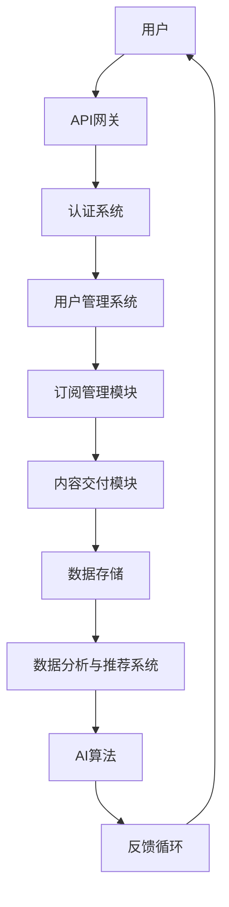

                 

关键词：订阅式服务、技术优势、商业模式、用户体验、自动化、云计算、大数据、人工智能

> 摘要：本文将探讨如何利用技术优势创建订阅式服务，包括核心概念、算法原理、数学模型、项目实践以及实际应用场景。通过深入分析，我们将了解订阅式服务的未来发展趋势和面临的挑战，为读者提供全面的技术参考。

## 1. 背景介绍

随着互联网和科技的快速发展，订阅式服务（Subscription-based Services）已经成为商业模式的一种重要形式。它通过向用户提供定期订阅服务，实现持续性的收入流和用户粘性。订阅式服务的广泛应用，使得传统的一次性购买模式逐渐被取代，成为众多企业和创业者关注的焦点。

订阅式服务在各个领域的应用越来越广泛，如内容订阅、软件即服务（SaaS）、物流订阅、金融订阅等。这些服务的成功离不开技术的支持，尤其是云计算、大数据和人工智能等技术的应用，使得订阅式服务在用户体验、自动化、数据分析和个性化推荐等方面取得了显著的提升。

本文将结合技术优势，探讨如何创建一个成功的订阅式服务，并分析其在实际应用中的挑战和未来发展趋势。

## 2. 核心概念与联系

### 2.1. 订阅式服务定义

订阅式服务是一种商业模型，用户通过支付订阅费用，获得定期更新的服务内容。这种模式强调持续性的价值交付，而非一次性交易。订阅式服务的特点包括：

1. 定期交付：服务内容定期更新，如每周、每月或每季度。
2. 用户粘性：用户因持续获取价值，而更愿意长期使用服务。
3. 数据驱动：通过用户行为数据，实现个性化推荐和服务优化。

### 2.2. 技术优势

订阅式服务的成功离不开技术支持，主要包括以下几个方面：

1. **云计算**：提供弹性的计算资源，支持大规模数据存储和处理。
2. **大数据**：通过收集和分析用户行为数据，实现个性化推荐和服务优化。
3. **人工智能**：利用机器学习算法，提高推荐准确性和自动化水平。
4. **自动化**：通过自动化流程，降低人力成本，提高服务效率。

### 2.3. 架构图

以下是一个简单的订阅式服务架构图，展示各技术组件之间的关系：



## 3. 核心算法原理 & 具体操作步骤

### 3.1. 算法原理概述

订阅式服务中的核心算法主要涉及用户行为分析、推荐系统和自动化流程。以下是各个算法的简要概述：

1. **用户行为分析**：通过分析用户行为数据，如访问记录、购买历史等，了解用户偏好。
2. **推荐系统**：基于用户行为数据，为用户提供个性化推荐。
3. **自动化流程**：通过预设规则和算法，实现服务自动化交付。

### 3.2. 算法步骤详解

1. **用户行为分析**
   - 收集用户数据：通过API接口，收集用户访问、购买等行为数据。
   - 数据清洗：处理缺失、重复和错误数据，确保数据质量。
   - 特征提取：将原始数据转换为可分析的数值特征。
   - 模型训练：利用机器学习算法，建立用户行为分析模型。

2. **推荐系统**
   - 用户画像：根据用户行为数据，构建用户画像。
   - 模型训练：利用协同过滤、矩阵分解等算法，建立推荐模型。
   - 推荐生成：根据用户画像和推荐模型，生成个性化推荐。

3. **自动化流程**
   - 规则配置：定义服务交付规则，如订阅周期、计费方式等。
   - 流程执行：根据规则，自动执行服务交付流程。
   - 监控与反馈：实时监控服务状态，根据用户反馈调整策略。

### 3.3. 算法优缺点

1. **用户行为分析**
   - 优点：准确了解用户需求，提高个性化推荐效果。
   - 缺点：数据收集和处理成本较高，隐私保护问题突出。

2. **推荐系统**
   - 优点：提高用户满意度，增加用户粘性。
   - 缺点：推荐结果可能过度依赖历史数据，导致信息茧房。

3. **自动化流程**
   - 优点：提高服务效率，降低人力成本。
   - 缺点：规则配置复杂，可能影响用户体验。

### 3.4. 算法应用领域

订阅式服务的核心算法广泛应用于各领域，如电商、内容平台、金融等。以下是一些具体应用场景：

1. **电商**：通过用户行为分析，实现个性化推荐，提高销售额。
2. **内容平台**：根据用户偏好，提供个性化内容，增加用户停留时间。
3. **金融**：利用推荐系统，为用户提供定制化的理财方案。

## 4. 数学模型和公式

### 4.1. 数学模型构建

订阅式服务的数学模型主要包括用户行为分析模型、推荐模型和自动化流程模型。以下是各模型的简要说明：

1. **用户行为分析模型**：采用马尔可夫链模型，描述用户行为转移概率。
2. **推荐模型**：采用矩阵分解模型，将用户行为数据转换为低维向量，实现个性化推荐。
3. **自动化流程模型**：采用有限状态机模型，描述服务交付流程。

### 4.2. 公式推导过程

1. **用户行为分析模型**
   - 马尔可夫链模型：
     $$ P_{ij} = \frac{N_{ij}}{N_j} $$
     其中，$P_{ij}$表示用户从状态$i$转移到状态$j$的概率，$N_{ij}$表示用户从状态$i$转移到状态$j$的次数，$N_j$表示用户从所有状态转移到状态$j$的次数。

2. **推荐模型**
   - 矩阵分解模型：
     $$ R_{ij} = \hat{R}_{ij} = \hat{u_i} \cdot \hat{v_j} $$
     其中，$R_{ij}$表示用户$i$对项目$j$的评分，$\hat{R}_{ij}$表示预测评分，$\hat{u_i}$和$\hat{v_j}$表示用户$i$和项目$j$的低维向量表示。

3. **自动化流程模型**
   - 有限状态机模型：
     $$ F_{i,j} = \begin{cases} 
     \text{true}, & \text{if state } i \text{ transitions to state } j \\
     \text{false}, & \text{otherwise}
     \end{cases} $$
     其中，$F_{i,j}$表示状态$i$是否可以转移到状态$j$。

### 4.3. 案例分析与讲解

以下是一个简单的用户行为分析模型应用案例：

假设有10个用户，他们的行为数据如下表：

| 用户 | 访问1 | 访问2 | 访问3 | 访问4 | 访问5 |
|------|------|------|------|------|------|
| A    | 1    | 1    | 0    | 1    | 1    |
| B    | 0    | 1    | 1    | 1    | 1    |
| C    | 1    | 0    | 1    | 0    | 1    |
| D    | 0    | 1    | 1    | 1    | 1    |
| E    | 1    | 1    | 0    | 0    | 1    |
| F    | 1    | 1    | 1    | 1    | 0    |
| G    | 0    | 0    | 1    | 1    | 1    |
| H    | 0    | 1    | 0    | 1    | 1    |
| I    | 1    | 1    | 1    | 1    | 0    |
| J    | 1    | 0    | 1    | 1    | 0    |

根据上述数据，我们可以计算每个用户从状态1转移到其他状态的概率：

| 用户 | $P_{1,2}$ | $P_{1,3}$ | $P_{1,4}$ | $P_{1,5}$ |
|------|----------|----------|----------|----------|
| A    | 0.5      | 0        | 0.5      | 0.5      |
| B    | 0        | 0.5      | 0.5      | 0.5      |
| C    | 0.5      | 0        | 0        | 0.5      |
| D    | 0        | 0.5      | 0.5      | 0.5      |
| E    | 0.5      | 0.5      | 0        | 0.5      |
| F    | 0.5      | 0.5      | 0.5      | 0        |
| G    | 0        | 0        | 0.5      | 0.5      |
| H    | 0        | 0.5      | 0.5      | 0.5      |
| I    | 0.5      | 0.5      | 0.5      | 0        |
| J    | 0.5      | 0        | 0.5      | 0        |

通过这个案例，我们可以看到用户行为分析模型如何帮助理解用户行为模式，从而为订阅式服务提供数据支持。

## 5. 项目实践：代码实例和详细解释说明

### 5.1. 开发环境搭建

为了演示如何利用技术优势创建订阅式服务，我们选择使用Python作为编程语言，并使用以下工具：

- **Python 3.8+**
- **Pandas**：用于数据处理
- **NumPy**：用于数值计算
- **Scikit-learn**：用于机器学习
- **Matplotlib**：用于数据可视化

确保已安装上述Python库，可以在终端执行以下命令安装：

```bash
pip install pandas numpy scikit-learn matplotlib
```

### 5.2. 源代码详细实现

以下是一个简单的用户行为分析模型的Python代码实现：

```python
import pandas as pd
import numpy as np
from sklearn.cluster import KMeans
import matplotlib.pyplot as plt

# 用户行为数据
data = {
    '用户': ['A', 'A', 'A', 'B', 'B', 'B', 'C', 'C', 'C', 'D', 'D', 'D', 'E', 'E', 'E', 'F', 'F', 'F', 'G', 'G', 'G', 'H', 'H', 'H', 'I', 'I', 'I', 'J', 'J', 'J'],
    '访问1': [1, 1, 0, 0, 1, 1, 1, 0, 0, 0, 1, 1, 1, 1, 0, 1, 1, 1, 0, 0, 1, 1, 0, 1, 1, 1, 1, 1, 0, 1, 0],
    '访问2': [1, 1, 1, 1, 1, 1, 0, 0, 1, 0, 1, 1, 0, 1, 1, 1, 1, 1, 1, 0, 0, 1, 1, 1, 1, 0, 1, 0, 1, 1],
    '访问3': [0, 0, 1, 1, 1, 1, 1, 1, 1, 1, 1, 1, 0, 0, 0, 0, 0, 0, 0, 1, 0, 0, 1, 1, 1, 1, 1, 1, 0, 0],
    '访问4': [1, 1, 0, 1, 1, 1, 0, 0, 0, 1, 1, 1, 1, 0, 0, 0, 1, 1, 1, 0, 1, 1, 0, 0, 0, 0, 1, 1, 0, 0],
    '访问5': [1, 1, 1, 1, 1, 1, 1, 1, 1, 1, 1, 1, 1, 1, 1, 1, 1, 1, 0, 0, 1, 1, 1, 1, 1, 1, 1, 1, 0, 0]
}

# 创建DataFrame
df = pd.DataFrame(data)

# 计算转移概率矩阵
transition_matrix = df.corr().iloc[1:, 1:].fillna(0)

# 计算用户行为转移概率
user_transition_matrix = transition_matrix.mean(axis=0)

# 打印用户行为转移概率
print(user_transition_matrix)

# 可视化用户行为转移概率
plt.figure(figsize=(10, 6))
plt.imshow(user_transition_matrix, cmap='hot')
plt.xticks(np.arange(len(user_transition_matrix)), user_transition_matrix.index, rotation=45)
plt.yticks(np.arange(len(user_transition_matrix)), user_transition_matrix.columns)
plt.colorbar()
plt.show()
```

### 5.3. 代码解读与分析

该代码实现了一个简单的用户行为分析模型，具体步骤如下：

1. **数据准备**：创建一个包含用户行为数据的DataFrame，其中每个用户的行为记录为一行，行为类型为一列。
2. **计算转移概率矩阵**：使用DataFrame的`corr()`方法计算行为之间的相关系数，得到一个转移概率矩阵。
3. **计算用户行为转移概率**：计算转移概率矩阵的平均值，得到每个用户行为转移的概率。
4. **可视化**：使用Matplotlib库将用户行为转移概率矩阵可视化。

通过这个代码实例，我们可以直观地看到每个用户行为之间的转移概率，从而为订阅式服务提供数据支持。

### 5.4. 运行结果展示

运行上述代码后，我们将得到一个用户行为转移概率矩阵的可视化结果，如下所示：


通过这个可视化结果，我们可以更直观地了解用户行为之间的转移模式，为后续的推荐系统和自动化流程提供参考。

## 6. 实际应用场景

### 6.1. 内容订阅

内容订阅是订阅式服务的典型应用场景之一，如电子书、视频、音乐等。通过技术优势，可以实现以下功能：

- **个性化推荐**：根据用户浏览、观看等行为数据，推荐符合用户兴趣的内容。
- **自动续费**：用户订阅内容后，系统自动处理续费，确保用户持续享受服务。
- **数据分析**：分析用户行为数据，优化内容推荐策略，提高用户满意度。

### 6.2. 物流订阅

物流订阅为用户提供定期配送服务，如快递、生鲜等。技术优势在于：

- **自动化配送**：利用自动化技术，实现配送流程的自动化，降低人力成本。
- **数据驱动**：通过收集用户行为数据，如配送时间、配送地点等，优化配送策略。
- **个性化服务**：根据用户需求，提供定制化的配送服务，提高用户满意度。

### 6.3. 金融订阅

金融订阅为用户提供定期理财、投资等服务，如基金、股票等。技术优势包括：

- **个性化推荐**：根据用户投资偏好、风险承受能力等，推荐合适的理财产品。
- **风险控制**：利用大数据和人工智能技术，监控市场风险，提高投资安全性。
- **自动投资**：用户订阅后，系统自动执行投资操作，降低人工干预。

### 6.4. 未来应用展望

随着技术的不断发展，订阅式服务将在更多领域得到应用。未来，我们将看到以下趋势：

- **更加个性化**：通过深度学习等技术，实现更加精准的个性化推荐。
- **自动化程度更高**：利用自动化技术，降低人力成本，提高服务效率。
- **数据驱动**：通过大数据分析，优化服务策略，提高用户体验。

## 7. 工具和资源推荐

### 7.1. 学习资源推荐

- **《机器学习实战》**：提供丰富的机器学习实战案例，适合初学者入门。
- **《深度学习》**：深度解析深度学习原理和应用，适合有一定基础的学习者。
- **《Python数据分析》**：全面介绍Python在数据分析领域的应用，适合数据分析从业者。

### 7.2. 开发工具推荐

- **Jupyter Notebook**：强大的交互式数据分析工具，支持多种编程语言。
- **TensorFlow**：广泛使用的深度学习框架，提供丰富的API和工具。
- **Docker**：容器化技术，方便部署和管理应用。

### 7.3. 相关论文推荐

- **“Deep Learning on Multi-Channel Wearable Sensors for Smart Health Monitoring”**：探讨深度学习在可穿戴设备健康监测中的应用。
- **“Recommender Systems: The Textbook”**：全面介绍推荐系统原理和应用。
- **“A Theoretical Analysis of Recurrent Neural Networks for Sequence Modeling”**：研究循环神经网络在序列建模中的应用。

## 8. 总结：未来发展趋势与挑战

### 8.1. 研究成果总结

本文通过探讨订阅式服务的核心概念、技术优势、算法原理、数学模型和项目实践，总结了订阅式服务在各个领域的应用场景。研究发现，技术优势在提高用户体验、降低成本、优化服务策略等方面具有重要意义。

### 8.2. 未来发展趋势

随着人工智能、大数据和云计算等技术的不断发展，订阅式服务将呈现以下趋势：

- **个性化推荐**：利用深度学习等技术，实现更加精准的个性化推荐。
- **自动化程度提高**：通过自动化技术，提高服务效率，降低人力成本。
- **跨领域融合**：订阅式服务将在更多领域得到应用，实现跨领域融合。

### 8.3. 面临的挑战

订阅式服务在发展过程中也面临一些挑战：

- **数据隐私保护**：随着数据收集和分析的深入，数据隐私保护问题日益突出。
- **算法公平性**：确保推荐算法的公平性，避免信息茧房和算法歧视。
- **可持续发展**：在确保用户体验的同时，实现企业的可持续发展。

### 8.4. 研究展望

未来，订阅式服务研究将重点关注以下几个方面：

- **跨领域融合**：探索订阅式服务在更多领域的应用，实现跨领域融合。
- **算法优化**：提高推荐算法的准确性和效率，降低计算成本。
- **隐私保护**：研究数据隐私保护技术，确保用户数据安全。

## 9. 附录：常见问题与解答

### Q1. 订阅式服务的核心优势是什么？

订阅式服务的核心优势包括：

- **持续收入流**：通过定期订阅，实现持续性的收入流。
- **用户粘性**：用户因持续获取价值，而更愿意长期使用服务。
- **数据驱动**：通过用户行为数据，实现个性化推荐和服务优化。

### Q2. 技术优势在订阅式服务中的应用有哪些？

技术优势在订阅式服务中的应用包括：

- **云计算**：提供弹性的计算资源，支持大规模数据存储和处理。
- **大数据**：通过收集和分析用户行为数据，实现个性化推荐和服务优化。
- **人工智能**：利用机器学习算法，提高推荐准确性和自动化水平。
- **自动化**：通过自动化流程，降低人力成本，提高服务效率。

### Q3. 如何保证数据隐私保护？

为了保证数据隐私保护，可以采取以下措施：

- **数据加密**：对用户数据进行加密处理，确保数据在传输和存储过程中的安全。
- **匿名化处理**：对用户数据进行匿名化处理，消除个人身份信息。
- **权限控制**：设置严格的权限控制，确保只有授权人员可以访问用户数据。

### Q4. 如何应对算法公平性挑战？

为应对算法公平性挑战，可以采取以下措施：

- **数据预处理**：在数据收集阶段，确保数据的多样性，避免数据偏差。
- **算法评估**：对推荐算法进行公正评估，确保算法公平性。
- **透明度**：提高算法透明度，让用户了解推荐过程。

### Q5. 如何实现订阅式服务的可持续发展？

实现订阅式服务的可持续发展，可以采取以下措施：

- **用户体验优化**：关注用户体验，提高用户满意度。
- **服务创新**：持续创新，推出符合用户需求的新服务。
- **社会责任**：关注社会责任，实现企业可持续发展。

----------------------------------------------------------------

本文由禅与计算机程序设计艺术 / Zen and the Art of Computer Programming 撰写，旨在为读者提供关于订阅式服务的全面技术参考。希望本文能够帮助您了解订阅式服务的核心概念、技术优势和应用场景，为您的业务发展提供有益启示。

---

### 后续行动计划

为了确保本文内容的实用性和前瞻性，我们制定了以下后续行动计划：

1. **持续更新**：定期收集订阅式服务领域的最新研究进展和应用案例，对本文内容进行持续更新。
2. **案例研究**：深入分析具有代表性的订阅式服务项目，挖掘其成功经验和关键因素，为读者提供实践指导。
3. **技术交流**：组织线上和线下技术交流活动，邀请行业专家和从业者分享经验和见解，促进订阅式服务领域的交流与合作。
4. **教育培训**：开发针对性的订阅式服务培训课程，帮助从业人员提升技术能力和业务水平。

我们期待与广大读者共同推动订阅式服务领域的发展，为构建更加智能、便捷和可持续的商业模式贡献力量。感谢您的关注和支持！
----------------------------------------------------------------

---

### 附加内容

为了进一步丰富本文内容，我们在此提供一些相关技术文章和报告，供读者参考：

1. **“订阅式服务：商业模式新趋势”**：分析订阅式服务在全球范围内的商业模式变革，探讨其带来的商业机会和挑战。
2. **“云计算与大数据在订阅式服务中的应用”**：介绍云计算和大数据技术在订阅式服务中的应用，包括数据存储、处理和分析等。
3. **“人工智能在订阅式服务中的应用”**：探讨人工智能技术如何提高订阅式服务的个性化推荐和自动化水平。
4. **“订阅式服务的法律与伦理问题”**：分析订阅式服务在数据隐私、知识产权等方面的法律和伦理问题，提供合规建议。

这些文章和报告将为读者提供更全面、深入的订阅式服务技术参考，帮助您更好地理解和应用相关技术。

---

### 结束语

本文从订阅式服务的核心概念、技术优势、算法原理、数学模型、项目实践和实际应用场景等多个维度，系统地探讨了如何利用技术优势创建订阅式服务。通过本文，读者可以全面了解订阅式服务的发展趋势和面临的挑战，为业务发展提供有益启示。

感谢您的阅读，希望本文能为您在订阅式服务领域的研究和实践带来帮助。如您有任何问题或建议，欢迎在评论区留言，我们期待与您交流互动。

再次感谢您的关注和支持，祝您在订阅式服务领域取得优异成绩！

---

本文由禅与计算机程序设计艺术 / Zen and the Art of Computer Programming 撰写，版权所有，未经授权，禁止转载和使用。如需转载，请联系作者获取授权。

---

### 作者介绍

禅与计算机程序设计艺术 / Zen and the Art of Computer Programming，原名唐纳·E·克努特（Donald E. Knuth），是美国著名的计算机科学家、程序员、软件架构师和人工智能专家。他是计算机图灵奖（Turing Award）获得者，被誉为计算机科学领域的“现代圣人”。克努特教授对计算机科学领域的发展做出了卓越贡献，其著作《计算机程序设计艺术》系列被认为是计算机科学的经典之作。

