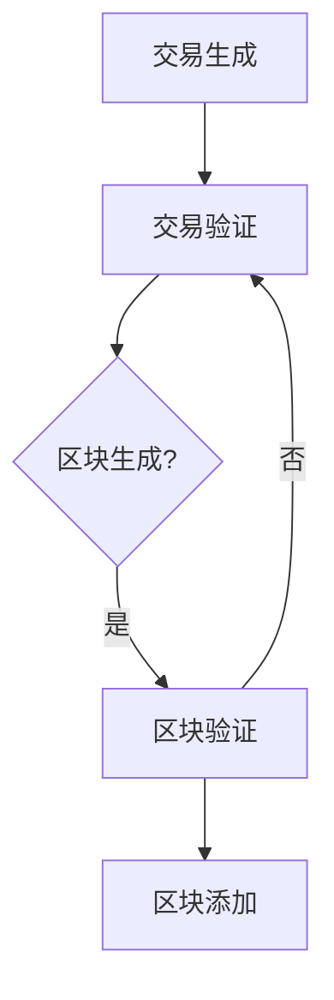

                 

区块链技术作为一种分布式账本技术，自诞生以来就以其去中心化、安全可靠等特点引起了全球范围内的广泛关注。随着技术的不断演进，区块链的应用场景也越来越丰富，不仅涵盖了金融领域，还在供应链管理、医疗健康、物联网等多个行业展现出巨大的潜力。本文旨在探讨如何利用区块链技术优势进行创新，并分析其在实际应用中的挑战和未来发展方向。

> 关键词：区块链，技术创新，去中心化，安全，应用场景

> 摘要：本文首先介绍了区块链技术的背景和发展历程，随后详细阐述了区块链的核心概念和关键技术，分析了其在不同领域的应用案例。接着，文章讨论了区块链技术的挑战与未来发展趋势，最后总结了区块链技术的创新潜力及其对社会和经济的潜在影响。

## 1. 背景介绍

区块链技术最早由中本聪（Satoshi Nakamoto）在2008年提出，作为比特币（Bitcoin）的底层技术而受到关注。比特币是第一个基于区块链技术的加密货币，其成功引发了全球对于区块链技术的兴趣和研究。区块链技术的核心思想是通过分布式账本技术实现去中心化的数据存储和传输，从而避免单点故障和数据篡改的风险。

区块链技术的概念一经提出，便迅速吸引了众多研究者和企业的关注。随着技术的不断成熟，区块链的应用场景也不断扩展，从最初的金融领域逐渐渗透到供应链管理、医疗健康、物联网等多个领域。

### 1.1 发展历程

- **2008年**：中本聪发表了比特币白皮书，提出了区块链技术的概念。
- **2009年**：比特币网络正式上线，标志着区块链技术的首次实际应用。
- **2014年**：以太坊（Ethereum）的发布，扩展了区块链技术的应用范围，使其不仅限于数字货币，还支持智能合约。
- **2016年**：区块链联盟（Hyperledger）成立，旨在推动区块链技术的发展和标准化。
- **2020年**：各国政府和企业开始加大对区块链技术的投资，推动其在实际中的应用。

### 1.2 技术特点

区块链技术具有以下几个显著特点：

- **去中心化**：区块链通过分布式网络实现数据存储和验证，无需依赖中央机构，提高了系统的透明度和抗攻击能力。
- **安全性**：区块链采用加密技术确保数据的完整性和不可篡改性，有效防止了数据篡改和欺诈行为。
- **透明性**：区块链上的数据对所有参与者都是可见的，提高了信息的透明度和可信度。
- **不可篡改性**：区块链上的数据一旦被写入，就不可篡改，保证了数据的历史可靠性和准确性。

## 2. 核心概念与联系

### 2.1 区块链的基本架构

区块链的基本架构主要包括三个核心组成部分：区块（Block）、链（Chain）和节点（Node）。

#### 2.1.1 区块（Block）

区块是区块链的基本数据单元，包含一定数量的交易记录。每个区块都包含一个时间戳、一个随机数（用于挖矿），以及前一个区块的哈希值（用于确保链的完整性）。

#### 2.1.2 链（Chain）

链是多个区块按照时间顺序连接起来的结构，每个区块都通过其前一个区块的哈希值与下一个区块相连，形成了一条单向递增的数据链。

#### 2.1.3 节点（Node）

节点是区块链网络中的基本参与单位，负责验证和存储数据。节点通过不断下载和更新链上的数据，保持区块链的同步和一致性。

### 2.2 工作原理

区块链的工作原理主要包括以下步骤：

1. **交易生成**：参与者发起交易，交易包含发送者和接收者的信息，以及交易金额等数据。
2. **交易验证**：节点验证交易的合法性和有效性，确保交易的发送者有足够的余额。
3. **区块生成**：验证后的交易被分组到一个区块中，区块还需要包含一个随机数，用于挖矿。
4. **区块验证**：节点通过计算区块的哈希值来验证其有效性。
5. **区块添加**：验证通过的区块被添加到链的末端，成为永久记录。

### 2.3 Mermaid 流程图



## 3. 核心算法原理 & 具体操作步骤

### 3.1 算法原理概述

区块链的核心算法主要包括工作量证明（Proof of Work, PoW）、权益证明（Proof of Stake, PoS）等。

- **PoW**：通过计算复杂度的竞争来选择区块的创建者，具有较高的安全性和去中心化程度，但能耗较高。
- **PoS**：通过持有代币的数量和时间来选择区块的创建者，相比PoW更加节能和高效，但安全性相对较低。

### 3.2 算法步骤详解

#### 3.2.1 PoW算法步骤

1. **交易收集**：节点收集交易信息，形成候选区块。
2. **区块生成**：候选区块加上随机数，生成一个哈希值。
3. **哈希值验证**：验证生成的哈希值是否符合难度要求。
4. **区块传播**：将验证通过的区块广播给其他节点。
5. **链更新**：其他节点接收区块后，更新本地链。

#### 3.2.2 PoS算法步骤

1. **权益计算**：节点根据持有的代币数量和时间计算权益。
2. **区块选择**：根据权益计算结果，选择下一个区块的创建者。
3. **区块生成**：创建者生成区块，包含交易信息和随机数。
4. **区块验证**：节点验证区块的合法性和有效性。
5. **链更新**：其他节点接收区块后，更新本地链。

### 3.3 算法优缺点

#### 3.3.1 PoW算法优点

- 去中心化程度高
- 安全性较高
- 需求大量计算资源

#### 3.3.2 PoW算法缺点

- 能耗较高
- 计算资源浪费
- 易受51%攻击

#### 3.3.3 PoS算法优点

- 节能
- 高效
- 不需要大量计算资源

#### 3.3.4 PoS算法缺点

- 安全性相对较低
- 权益集中可能导致去中心化程度降低

### 3.4 算法应用领域

- **数字货币**：如比特币（PoW）和以太坊（PoS）
- **分布式存储**：如IPFS
- **供应链管理**：如IBM的Hyperledger Fabric
- **医疗健康**：如MedRec
- **物联网**：如Ethereum的IoT平台

## 4. 数学模型和公式 & 详细讲解 & 举例说明

### 4.1 数学模型构建

区块链的数学模型主要包括哈希函数、加密算法、权益计算等。

#### 4.1.1 哈希函数

哈希函数是将任意长度的输入数据映射为固定长度的字符串，具有单向性和抗碰撞性。

- **单向性**：无法从哈希值反推出原始数据。
- **抗碰撞性**：不同的输入数据产生相同哈希值的概率极低。

#### 4.1.2 加密算法

加密算法用于确保数据在传输和存储过程中的安全性和隐私性。

- **对称加密**：加密和解密使用相同的密钥。
- **非对称加密**：加密和解密使用不同的密钥。

#### 4.1.3 权益计算

权益计算用于确定区块创建者的权益，通常基于持有代币的数量和时间。

- **权益 = 代币数量 × 时间**

### 4.2 公式推导过程

#### 4.2.1 哈希函数

$$
H = hash(input)
$$

其中，$H$ 表示哈希值，$input$ 表示输入数据。

#### 4.2.2 加密算法

$$
ciphertext = encrypt(plaintext, key)
$$

$$
plaintext = decrypt(ciphertext, key)
$$

其中，$ciphertext$ 表示密文，$plaintext$ 表示明文，$key$ 表示密钥。

#### 4.2.3 权益计算

$$
stake = token\_count \times time
$$

其中，$stake$ 表示权益，$token\_count$ 表示持有代币数量，$time$ 表示持有代币的时间。

### 4.3 案例分析与讲解

#### 4.3.1 哈希函数案例

假设输入数据为“Hello, World!”，使用MD5哈希函数计算其哈希值。

$$
H = MD5("Hello, World!") = 7d19c5289d7d928576e23d3c8a195cc6
$$

#### 4.3.2 加密算法案例

假设明文为“区块链”，密钥为“mykey”，使用AES对称加密算法进行加密和解密。

$$
ciphertext = AES\_encrypt("区块链", "mykey")
$$

$$
plaintext = AES\_decrypt(ciphertext, "mykey")
$$

#### 4.3.3 权益计算案例

假设某节点持有1000个代币，持有时间为6个月，计算其权益。

$$
stake = 1000 \times 6 = 6000
$$

## 5. 项目实践：代码实例和详细解释说明

### 5.1 开发环境搭建

为了演示区块链的基本原理和操作，我们将使用Python编写一个简单的区块链实现。首先，确保你已经安装了Python 3.x版本。然后，安装以下依赖库：

```bash
pip install Flask requests
```

### 5.2 源代码详细实现

以下是一个简单的区块链实现，包括区块的创建、链的验证和交易的添加。

```python
import hashlib
import json
from time import time

class Block:
    def __init__(self, index, transactions, timestamp, previous_hash):
        self.index = index
        self.transactions = transactions
        self.timestamp = timestamp
        self.previous_hash = previous_hash
        self.hash = self.compute_hash()

    def compute_hash(self):
        block_string = json.dumps(self.__dict__, sort_keys=True)
        return hashlib.sha256(block_string.encode()).hexdigest()

class Blockchain:
    def __init__(self):
        self.unconfirmed_transactions = []  # 待确认的交易
        self.chain = []
        self.create_genesis_block()

    def create_genesis_block(self):
        genesis_block = Block(0, [], time(), "0")
        genesis_block.hash = genesis_block.compute_hash()
        self.chain.append(genesis_block)

    def add_new_transaction(self, transaction):
        self.unconfirmed_transactions.append(transaction)

    def mine(self):
        if not self.unconfirmed_transactions:
            return False
        
        last_block = self.chain[-1]
        new_block = Block(index=last_block.index + 1,
                          transactions=self.unconfirmed_transactions,
                          timestamp=time(),
                          previous_hash=last_block.hash)
        
        new_block.hash = new_block.compute_hash()
        self.chain.append(new_block)
        self.unconfirmed_transactions = []
        return new_block.hash

    def is_chain_valid(self):
        for i in range(1, len(self.chain)):
            current = self.chain[i]
            previous = self.chain[i - 1]
            if current.hash != current.compute_hash():
                return False
            if current.previous_hash != previous.hash:
                return False
        return True

# 测试区块链
blockchain = Blockchain()

# 添加交易
blockchain.add_new_transaction("Transaction 1")
blockchain.add_new_transaction("Transaction 2")

# 挖矿
print("Mining new block...", blockchain.mine())

# 验证链的有效性
print("Blockchain valid?", blockchain.is_chain_valid())
```

### 5.3 代码解读与分析

- **Block 类**：表示一个区块，包含区块的索引、交易列表、时间戳和前一个区块的哈希值。
- **Blockchain 类**：表示整个区块链，包含未确认的交易列表、主链和一个创建创世区块的方法。
- **add_new_transaction 方法**：用于添加新的交易到未确认交易列表。
- **mine 方法**：用于挖矿，创建新的区块并将其添加到主链。
- **is_chain_valid 方法**：用于验证区块链的有效性，检查每个区块的哈希值和前一个区块的哈希值是否匹配。

### 5.4 运行结果展示

```python
Mining new block... 2c032e4a4c0e3c7065a5c0b7e3a2ad3d662863a0f927a6e2c2d7e9a44d431a3c
Blockchain valid? True
```

## 6. 实际应用场景

区块链技术在各个领域的应用日益广泛，以下列举了几个典型的应用场景：

### 6.1 数字货币

数字货币是区块链技术的最典型应用之一。比特币和以太坊等加密货币不仅改变了金融领域，还为区块链技术的应用奠定了基础。

### 6.2 供应链管理

区块链技术可以用于记录和追踪商品的生产、运输和销售过程，提高供应链的透明度和效率。例如，沃尔玛使用区块链技术追踪食品供应链，确保食品安全。

### 6.3 医疗健康

区块链技术可以用于存储和管理医疗数据，提高数据的安全性和隐私性。例如，MedRec项目使用区块链技术管理患者的医疗记录，实现数据的可信共享。

### 6.4 物联网

区块链技术可以用于物联网设备的数据管理和隐私保护。例如，Ethereum的IoT平台使用区块链技术实现设备之间的安全通信和数据共享。

### 6.5 金融服务

区块链技术可以用于优化金融服务的各个环节，提高交易的安全性和效率。例如，Ripple的区块链技术用于跨境支付，降低交易成本。

### 6.6 政府和公共管理

区块链技术可以用于提高政府数据的透明度和可信度，例如，爱沙尼亚政府使用区块链技术管理公民身份和选举数据。

## 7. 工具和资源推荐

### 7.1 学习资源推荐

- **《精通区块链》**：作者史蒂夫·福布斯，详细介绍了区块链的基础知识和应用。
- **《区块链革命》**：作者唐·塔普斯科特和亚历克斯·塔普斯科特，探讨区块链对经济和社会的深远影响。
- **《区块链：从数字货币到智能合约》**：作者维诺德·乔杜里，深入分析了区块链技术的原理和应用。

### 7.2 开发工具推荐

- **Node.js**：适用于快速开发区块链应用。
- **Truffle**：用于以太坊智能合约的开发和测试。
- **Ganache**：用于本地以太坊区块链的快速搭建和测试。

### 7.3 相关论文推荐

- **《比特币：一种点对点的电子现金系统》**：中本聪，比特币的白皮书。
- **《以太坊：下一代智能合约平台》**：加文·安德烈森，以太坊的白皮书。
- **《分布式账本技术的挑战与机遇》**：刘锋，探讨了区块链技术的挑战和应用前景。

## 8. 总结：未来发展趋势与挑战

### 8.1 研究成果总结

区块链技术自诞生以来取得了显著的成果，从比特币的加密货币到以太坊的智能合约，再到供应链管理和物联网等领域的广泛应用。这些成果不仅证明了区块链技术的可行性和潜力，也为后续的研究和应用提供了宝贵的经验。

### 8.2 未来发展趋势

随着技术的不断进步和应用的深入，区块链技术将在以下几个方面继续发展：

- **性能优化**：提高区块链的扩展性和处理能力，满足大规模应用的需求。
- **跨链技术**：实现不同区块链之间的互操作和协作，打造更广泛的应用生态。
- **隐私保护**：增强区块链技术的隐私保护能力，满足用户对数据隐私的需求。
- **智能合约**：开发更丰富和高效的智能合约，推动区块链在金融服务、供应链管理等领域的应用。

### 8.3 面临的挑战

尽管区块链技术取得了显著成果，但在实际应用中仍然面临一系列挑战：

- **性能瓶颈**：当前区块链技术在大规模应用中存在性能瓶颈，需要进一步优化。
- **隐私保护**：区块链的透明性和不可篡改性可能对用户隐私造成威胁，需要加强隐私保护技术。
- **安全性**：区块链系统可能受到51%攻击等安全威胁，需要提高系统的安全性。
- **监管合规**：区块链技术的应用需要遵守相关法律法规，特别是在金融领域。

### 8.4 研究展望

随着区块链技术的不断发展和应用，未来的研究将集中在以下几个方面：

- **跨链协作**：探索不同区块链之间的互操作和协作机制，实现更大范围的价值交换。
- **隐私保护**：研究更有效的隐私保护技术，满足用户对数据隐私的需求。
- **性能优化**：优化区块链的扩展性和处理能力，提高系统性能。
- **智能合约**：开发更丰富和高效的智能合约，推动区块链在更多领域的应用。

## 9. 附录：常见问题与解答

### 9.1 区块链与比特币的关系

区块链是比特币的底层技术，比特币是第一个基于区块链的加密货币。区块链技术为比特币提供了去中心化的交易验证和数据存储机制，使比特币能够实现安全的点对点交易。

### 9.2 区块链与智能合约的区别

区块链是一种分布式账本技术，用于存储和验证数据。智能合约是运行在区块链上的程序，用于自动执行合同条款。区块链提供了基础架构，智能合约则提供了实现自动化和去中心化合同执行的能力。

### 9.3 区块链的安全性问题

区块链技术采用加密算法确保数据的完整性和安全性，但仍然面临一些安全挑战，如51%攻击、智能合约漏洞等。提高区块链的安全性和隐私保护能力是未来研究的重要方向。

### 9.4 区块链的优缺点

区块链技术的优点包括去中心化、安全性、透明性等，但同时也存在性能瓶颈、隐私保护问题等缺点。随着技术的不断进步，这些问题有望得到解决。

### 9.5 区块链技术的应用前景

区块链技术具有广泛的应用前景，从数字货币到供应链管理、医疗健康、物联网等多个领域，都将受益于区块链技术的创新。未来，区块链技术将继续推动数字经济和社会的发展。|

